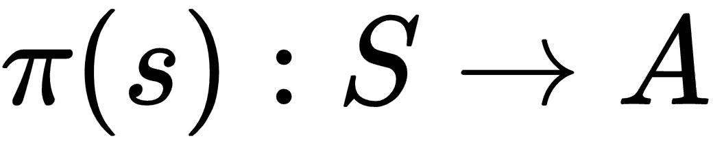
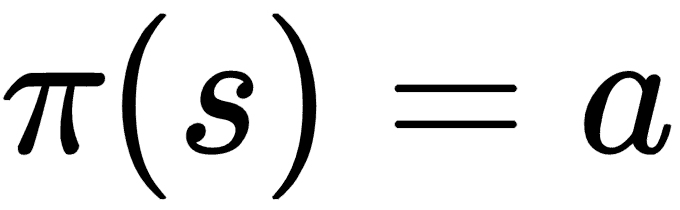
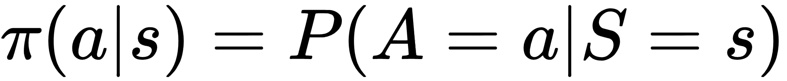
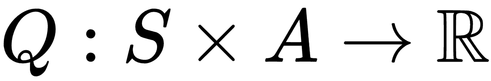
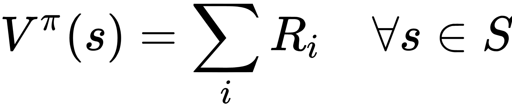
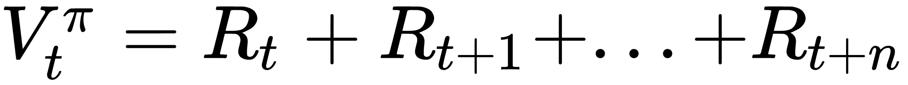
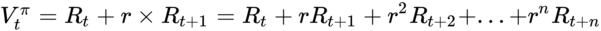
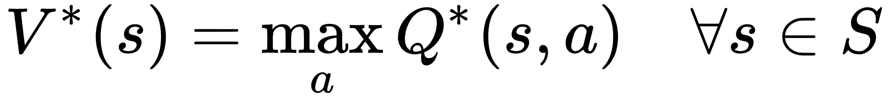
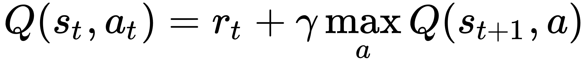

# 十三、深度强化学习

强化学习是一种学习形式，其中软件智能体观察环境并采取行动以最大化其对环境的奖励，如下图所示：


这个比喻可以用来表示现实生活中的情况，如下所示：

*   股票交易智能体观察交易信息，新闻，分析和其他形式信息，并采取行动买入或卖出交易，以便以短期利润或长期利润的形式最大化奖励。
*   保险智能体观察有关客户的信息，然后采取行动确定保险费金额，以便最大化利润并最大限度地降低风险。
*   类人机器人观察环境然后采取行动，例如步行，跑步或拾取物体，以便在实现目标方面最大化奖励。

强化学习已成功应用于许多应用，如广告优化，股票市场交易，自动驾驶汽车，机器人和游戏，仅举几例。

强化学习与监督学习不同，因为预先没有标签来调整模型的参数。该模型从运行中获得的奖励中学习。虽然短期奖励可以立即获得，但只有经过几个步骤才能获得长期奖励。这种现象也称为**延迟反馈**。

强化学习也与无监督学习不同，因为在无监督学习中没有可用的标签，而在强化学习中，反馈可用于奖励。

在本章中，我们将通过涵盖以下主题来了解强化学习及其在 TensorFlow 和 Keras 中的实现：

*   OpenAI Gym 101
*   将简单的策略应用于 cartpole 游戏
*   强化学习 101
    *   Q 函数
    *   探索和开发
    *   V 函数
    *   RL 技术
*   RL 的简单神经网络策略
*   实现 Q-Learning
    *   Q-Learning 的初始化和离散化
    *   使用 Q-Table 进行 Q-Learning
    *   深度 Q 网络：使用 Q-Network 进行 Q-Learning

我们将在 OpenAI Gym 中演示我们的示例，让我们首先了解一下 OpenAI Gym。

# OpenAI Gym 101

OpenAI Gym 是一个基于 Python 的工具包，用于研究和开发强化学习算法。 OpenAI Gym 在撰写本文时提供了 700 多个开源贡献环境。使用 OpenAI，您还可以创建自己的环境。最大的优势是 OpenAI 提供了一个统一的接口来处理这些环境，并在您专注于强化学习算法的同时负责运行模拟。

[描述 OpenAI Gym 的研究论文可在此链接中找到](http://arxiv.org/abs/1606.01540)。

您可以使用以下命令安装 OpenAI Gym：

```py
pip3 install gym
```

如果上述命令不起作用，[您可以在此链接中找到有关安装的更多帮助](https://github.com/openai/gym#installation)。 

1.  让我们在 OpenAI Gym 中打印可用环境的数量：

您可以按照本书代码包中的 Jupyter 笔记本`ch-13a_Reinforcement_Learning_NN`中的代码进行操作。

```py
all_env = list(gym.envs.registry.all())
print('Total Environments in Gym version {} : {}'
    .format(gym.__version__,len(all_env)))

Total Environments in Gym version 0.9.4 : 777
```

1.  让我们打印所有环境的列表：

```py
for e in list(all_env):
    print(e)
```

输出的部分列表如下：

```py
EnvSpec(Carnival-ramNoFrameskip-v0)
EnvSpec(EnduroDeterministic-v0)
EnvSpec(FrostbiteNoFrameskip-v4)
EnvSpec(Taxi-v2)
EnvSpec(Pooyan-ram-v0)
EnvSpec(Solaris-ram-v4)
EnvSpec(Breakout-ramDeterministic-v0)
EnvSpec(Kangaroo-ram-v4)
EnvSpec(StarGunner-ram-v4)
EnvSpec(Enduro-ramNoFrameskip-v4)
EnvSpec(DemonAttack-ramDeterministic-v0)
EnvSpec(TimePilot-ramNoFrameskip-v0)
EnvSpec(Amidar-v4)
```

由`env`对象表示的每个环境都有一个标准化的接口，例如：

*   通过传递 id 字符串，可以使用`env.make(&lt;game-id-string&gt;)`函数创建`env`对象。
*   每个`env`对象包含以下主要函数：
    *   `step()`函数将操作对象作为参数并返回四个对象：
        *   观察：由环境实现的对象，代表对环境的观察。
        *   奖励：一个带符号的浮点值，表示前一个操作的增益（或损失）。
        *   `done`：表示方案是否完成的布尔值。
        *   `info`：表示诊断信息的 Python 字典对象。
    *   `render()`函数可创建环境的直观表示。
    *   `reset()`函数将环境重置为原始状态。
*   每个`env`对象都有明确定义的动作和观察，由`action_space`和`observation_space`表示。

CartPole 是健身房里最受欢迎的学习强化学习游戏之一。在这个游戏中，连接到推车的杆必须平衡，以便它不会下降。如果杆子倾斜超过 15 度或者推车从中心移动超过 2.4 个单元，则游戏结束。 [OpenAI.com](http://openai.com) 的主页用这些词强调游戏：

这种环境的小尺寸和简单性使得可以进行非常快速的实验，这在学习基础知识时是必不可少的。

游戏只有四个观察和两个动作。动作是通过施加+1 或-1 的力来移动购物车。观察结果是推车的位置，推车的速度，杆的角度以及杆的旋转速度。然而，学习观察语义的知识不是学习最大化游戏奖励所必需的。

现在让我们加载一个流行的游戏环境 CartPole-v0，然后用随机控件播放：

1.  使用标准`make`函数创建`env`对象：

```py
env = gym.make('CartPole-v0')
```

1.  剧集的数量是游戏的数量。我们现在将它设置为一个，表示我们只想玩一次游戏。由于每集都是随机的，因此在实际的制作过程中，您将运行多集并计算奖励的平均值。此外，我们可以初始化一个数组，以便在每个时间步都存储环境的可视化：

```py
n_episodes = 1
env_vis = []
```

1.  运行两个嵌套循环 - 一个用于剧集数量的外部循环和一个用于您要模拟的时间步数的内部循环。您可以继续运行内部循环，直到方案完成或将步数设置为更高的值。
    *   在每集开始时，使用`env.reset()`重置环境。
    *   在每个时间步的开始，使用`env.render()`捕获可视化。

```py
for i_episode in range(n_episodes):
  observation = env.reset()
    for t in range(100):
  env_vis.append(env.render(mode = 'rgb_array'))
        print(observation)
        action = env.action_space.sample()
        observation, reward, done, info = env.step(action)
        if done:
  print("Episode finished at t{}".format(t+1))
            break
```

1.  使用辅助函数渲染环境：

```py
env_render(env_vis)
```

1.  辅助函数的代码如下：

```py
def env_render(env_vis):
  plt.figure()
    plot = plt.imshow(env_vis[0])
    plt.axis('off')
    def animate(i):
  plot.set_data(env_vis[i])

    anim = anm.FuncAnimation(plt.gcf(),
                             animate,
                             frames=len(env_vis),
                             interval=20,
                             repeat=True,
                             repeat_delay=20)
    display(display_animation(anim, default_mode='loop'))
```

运行此示例时，我们得到以下输出：

```py
[-0.00666995 -0.03699492 -0.00972623  0.00287713]
[-0.00740985  0.15826516 -0.00966868 -0.29285861]
[-0.00424454 -0.03671761 -0.01552586 -0.00324067]
[-0.0049789  -0.2316135  -0.01559067  0.28450351]
[-0.00961117 -0.42650966 -0.0099006   0.57222875]
[-0.01814136 -0.23125029  0.00154398  0.27644332]
[-0.02276636 -0.0361504   0.00707284 -0.01575223]
[-0.02348937  0.1588694   0.0067578  -0.30619523]
[-0.02031198 -0.03634819  0.00063389 -0.01138875]
[-0.02103895  0.15876466  0.00040612 -0.3038716 ]
[-0.01786366  0.35388083 -0.00567131 -0.59642642]
[-0.01078604  0.54908168 -0.01759984 -0.89089036]
[  1.95594914e-04   7.44437934e-01  -3.54176495e-02  -1.18905344e+00]
[ 0.01508435  0.54979251 -0.05919872 -0.90767902]
[ 0.0260802   0.35551978 -0.0773523  -0.63417465]
[ 0.0331906   0.55163065 -0.09003579 -0.95018025]
[ 0.04422321  0.74784161 -0.1090394  -1.26973934]
[ 0.05918004  0.55426764 -0.13443418 -1.01309691]
[ 0.0702654   0.36117014 -0.15469612 -0.76546874]
[ 0.0774888   0.16847818 -0.1700055  -0.52518186]
[ 0.08085836  0.3655333  -0.18050913 -0.86624457]
[ 0.08816903  0.56259197 -0.19783403 -1.20981195]
Episode finished at t22
```

杆子需要 22 个时间步长才能变得不平衡。在每次运行中，我们得到不同的时间步长值，因为我们通过使用`env.action_space.sample()`在学术上选择了动作。

由于游戏如此迅速地导致失败，随机选择一个动作并应用它可能不是最好的策略。有许多算法可以找到解决方案，使杆子保持笔直，可以使用更长的时间步长，例如爬山，随机搜索和策略梯度。

解决 Cartpole 游戏的一些算法可通过此链接获得：

<https://openai.com/requests-for-research/#cartpole>

<http://kvfrans.com/simple-algoritms-for-solving-cartpole/>

<https://github.com/kvfrans/openai-cartpole>

# 将简单的策略应用于 cartpole 游戏

到目前为止，我们已经随机选择了一个动作并应用它。现在让我们应用一些逻辑来挑选行动而不是随机机会。第三个观察指的是角度。如果角度大于零，则意味着杆向右倾斜，因此我们将推车向右移动（1）。否则，我们将购物车向左移动（0）。我们来看一个例子：

1.  我们定义了两个策略函数如下：

```py
def policy_logic(env,obs):
  return 1 if obs[2] > 0 else 0
def policy_random(env,obs):
  return env.action_space.sample()
```

1.  接下来，我们定义一个将针对特定数量的剧集运行的实验函数;每一集一直持续到游戏损失，即`done`为`True`。我们使用`rewards_max`来指示何时突破循环，因为我们不希望永远运行实验：

```py
def experiment(policy, n_episodes, rewards_max):
  rewards=np.empty(shape=(n_episodes))
    env = gym.make('CartPole-v0')

    for i in range(n_episodes):
  obs = env.reset()
        done = False
        episode_reward = 0
        while not done:
  action = policy(env,obs)
            obs, reward, done, info = env.step(action)
            episode_reward += reward
            if episode_reward > rewards_max:
  break
        rewards[i]=episode_reward
  print('Policy:{}, Min reward:{}, Max reward:{}'
          .format(policy.__name__,
                  min(rewards),
                  max(rewards)))
```

1.  我们运行实验 100 次，或直到奖励小于或等于`rewards_max`，即设置为 10,000：

```py
n_episodes = 100
rewards_max = 10000
experiment(policy_random, n_episodes, rewards_max)
experiment(policy_logic, n_episodes, rewards_max)
```

我们可以看到逻辑选择的动作比随机选择的动作更好，但不是更好：

```py
Policy:policy_random, Min reward:9.0, Max reward:63.0, Average reward:20.26
Policy:policy_logic, Min reward:24.0, Max reward:66.0, Average reward:42.81
```

现在让我们进一步修改选择动作的过程 - 基于参数。参数将乘以观察值，并且将基于乘法结果是零还是一来选择动作。让我们修改随机搜索方法，我们随机初始化参数。代码如下：

```py
def policy_logic(theta,obs):
  # just ignore theta
  return 1 if obs[2] > 0 else 0

def policy_random(theta,obs):
  return 0 if np.matmul(theta,obs) < 0 else 1

def episode(env, policy, rewards_max):
  obs = env.reset()
    done = False
    episode_reward = 0
    if policy.__name__ in ['policy_random']:
  theta = np.random.rand(4) * 2 - 1
    else:
  theta = None
    while not done:
  action = policy(theta,obs)
        obs, reward, done, info = env.step(action)
        episode_reward += reward
        if episode_reward > rewards_max:
  break
    return episode_reward

def experiment(policy, n_episodes, rewards_max):
  rewards=np.empty(shape=(n_episodes))
    env = gym.make('CartPole-v0')

    for i in range(n_episodes):
  rewards[i]=episode(env,policy,rewards_max)
        #print("Episode finished at t{}".format(reward))
  print('Policy:{}, Min reward:{}, Max reward:{}, Average reward:{}'
          .format(policy.__name__,
                  np.min(rewards),
                  np.max(rewards),
                  np.mean(rewards)))

n_episodes = 100
rewards_max = 10000
experiment(policy_random, n_episodes, rewards_max)
experiment(policy_logic, n_episodes, rewards_max)
```

我们可以看到随机搜索确实改善了结果：

```py
Policy:policy_random, Min reward:8.0, Max reward:200.0, Average reward:40.04
Policy:policy_logic, Min reward:25.0, Max reward:62.0, Average reward:43.03
```

通过随机搜索，我们改进了结果以获得 200 的最大奖励。平均而言，随机搜索的奖励较低，因为随机搜索会尝试各种不良参数，从而降低整体结果。但是，我们可以从所有运行中选择最佳参数，然后在生产中使用最佳参数。让我们修改代码以首先训练参数：

```py
def policy_logic(theta,obs):
  # just ignore theta
  return 1 if obs[2] > 0 else 0

def policy_random(theta,obs):
  return 0 if np.matmul(theta,obs) < 0 else 1

def episode(env,policy, rewards_max,theta):
  obs = env.reset()
    done = False
    episode_reward = 0

    while not done:
  action = policy(theta,obs)
        obs, reward, done, info = env.step(action)
        episode_reward += reward
        if episode_reward > rewards_max:
  break
    return episode_reward

def train(policy, n_episodes, rewards_max):

  env = gym.make('CartPole-v0')
    theta_best = np.empty(shape=[4])
    reward_best = 0

    for i in range(n_episodes):
 if policy.__name__ in ['policy_random']:  theta = np.random.rand(4) * 2 - 1
        else:
  theta = None

        reward_episode=episode(env,policy,rewards_max, theta)
        if reward_episode > reward_best:
  reward_best = reward_episode
            theta_best = theta.copy()
    return reward_best,theta_best

def experiment(policy, n_episodes, rewards_max, theta=None):
  rewards=np.empty(shape=[n_episodes])
    env = gym.make('CartPole-v0')

    for i in range(n_episodes):
  rewards[i]=episode(env,policy,rewards_max,theta)
        #print("Episode finished at t{}".format(reward))
  print('Policy:{}, Min reward:{}, Max reward:{}, Average reward:{}'
          .format(policy.__name__,
                  np.min(rewards),
                  np.max(rewards),
                  np.mean(rewards)))

n_episodes = 100
rewards_max = 10000

reward,theta = train(policy_random, n_episodes, rewards_max)
print('trained theta: {}, rewards: {}'.format(theta,reward))
experiment(policy_random, n_episodes, rewards_max, theta)
experiment(policy_logic, n_episodes, rewards_max)
```

我们训练了 100 集，然后使用最佳参数为随机搜索策略运行实验：

```py
n_episodes = 100
rewards_max = 10000

reward,theta = train(policy_random, n_episodes, rewards_max)
print('trained theta: {}, rewards: {}'.format(theta,reward))
experiment(policy_random, n_episodes, rewards_max, theta)
experiment(policy_logic, n_episodes, rewards_max)
```

我们发现训练参数给出了 200 的最佳结果：

```py
trained theta: [-0.14779543  0.93269603  0.70896423  0.84632461], rewards: 200.0
Policy:policy_random, Min reward:200.0, Max reward:200.0, Average reward:200.0
Policy:policy_logic, Min reward:24.0, Max reward:63.0, Average reward:41.94
```

我们可以优化训练代码以继续训练，直到我们获得最大奖励。笔记本`ch-13a_Reinforcement_Learning_NN`中提供了此优化的代码。

现在我们已经学习了 OpenAI Gym 的基础知识，让我们学习强化学习。

# 强化学习 101

强化学习由智能体从前一个时间步骤输入观察和奖励并以动作产生输出来描述，目标是最大化累积奖励。

智能体具有策略，值函数和模型：

*   智能体用于选择下一个动作的算法称为**策略**。在上一节中，我们编写了一个策略，它将采用一组参数 theta，并根据观察和参数之间的乘法返回下一个动作。该策略由以下等式表示：
    
    
    
    `S`是一组状态，`A`是一组动作。
    
    策略是确定性的或随机性的。
    
    *   确定性策略在每次运行中为相同状态返回相同的操作：
    
        
    
    *   随机策略为每次运行中的相同状态返回相同操作的不同概率：
    
        

*   **值函数**根据当前状态中的所选动作预测长期奖励的数量。因此，值函数特定于智能体使用的策略。奖励表示行动的直接收益，而价值函数表示行动的累积或长期未来收益。奖励由环境返回，价值函数由智能体在每个时间步骤估计。

*   **模型**表示智能体在内部保存的环境。该模型可能是环境的不完美表示。智能体使用该模型来估计所选动作的奖励和下一个状态。

智能体的目标还可以是为马尔可夫决策过程（MDP）找到最优策略。 MDP 是从一个州到另一个州的观察，行动，奖励和过渡的数学表示。为简洁起见，我们将省略对 MDP 的讨论，并建议好奇的读者在互联网上搜索更深入 MDP 的资源。

# Q 函数（在模型不可用时学习优化）

如果模型不可用，则智能体通过反复试验来学习模型和最优策略。当模型不可用时，智能体使用 Q 函数，其定义如下：



如果状态 s 处的智能体选择动作 a，则 Q 函数基本上将状态和动作对映射到表示预期总奖励的实数。

# RL 算法的探索与开发

在没有模型的情况下，智能体在每一步都要探索或利用。 **探索**意味着智能体选择一个未知动作来找出奖励和模型。 **剥削**意味着智能体选择最知名的行动来获得最大奖励。如果智能体总是决定利用它，那么它可能会陷入局部最优值。因此，有时智能体会绕过学到的策略来探索未知的行为。同样，如果智能体总是决定探索，那么它可能无法找到最优策略。因此，在探索和开发之间取得平衡非常重要。在我们的代码中，我们通过使用概率`p`来选择随机动作和概率`1-p`来选择最优动作来实现这一点。

# V 函数（模型可用时学习优化）

如果事先知道模型，则智能体可以执行**策略搜索**以找到最大化值函数的最优策略。当模型可用时，智能体使用值函数，该函数可以朴素地定义为未来状态的奖励总和：



因此，使用策略`p`选择操作的时间步`t`的值将是：



`V`是值，`R`是奖励，值函数估计在未来最多`n`个时间步长。

当智能体使用这种方法估计奖励时，它会平等地将所有行为视为奖励。在极点推车示例中，如果民意调查在步骤 50 处进行，则它将把直到第 50 步的所有步骤视为对跌倒的同等责任。因此，不是添加未来奖励，而是估计未来奖励的加权总和。通常，权重是提高到时间步长的折扣率。如果贴现率为零，则值函数变为上面讨论的幼稚函数，并且如果贴现率的值接近 1，例如 0.9 或 0.92，则与当前奖励相比，未来奖励的影响较小。

因此，现在行动`a`的时间步`t`的值将是：


`V`是值，`R`是奖励，`r`是折扣率。

**V 函数和 Q 函数之间的关系：**

`V*(s)`是状态`s`下的最优值函数，其给出最大奖励，并且`Q*(s，a)`是状态`s`下的最佳 Q 函数，其通过选择动作`a`给出最大期望奖励。 因此，`V*(s)`是所有可能动作中所有最优 Q 函数`Q*(s，a)`的最大值：



# 强化学习技巧

Reinforcement learning techniques can be categorized on the basis of the availability of the model as follows:

*   **模型可用**：如果模型可用，则智能体可以通过迭代策略或值函数来离线计划，以找到提供最大奖励的最优策略。
    *   **值迭代学习**：在值迭代学习方法中，智能体通过将`V(s)`初始化为随机值开始，然后重复更新`V(s)`直到找到最大奖励。
    *   **策略迭代学习** ： 在策略迭代学习方法中，智能体通过初始化随机策略`p`开始，然后重复更新策略，直到找到最大奖励。

*   **模型不可用**：如果模型不可用，则智能体只能通过观察其动作的结果来学习。因此，从观察，行动和奖励的历史来看，智能体会尝试估计模型或尝试直接推导出最优策略：
    *   **基于模型的学习**：在基于模型的学习中，智能体首先从历史中估计模型，然后使用策略或基于价值的方法来找到最优策略。
    *   **无模型学习**：在无模型学习中，智能体不会估计模型，而是直接从历史中估计最优策略。 Q-Learning 是无模型学习的一个例子。

作为示例，值迭代学习的算法如下：

```py
initialize V(s) to random values for all states
Repeat
    for s in states
        for a in actions
            compute Q[s,a]
        V(s) = max(Q[s])   # maximum of Q for all actions for that state
Until optimal value of V(s) is found for all states
```

策略迭代学习的算法如下：

```py
initialize a policy P_new to random sequence of actions for all states
Repeat
    P = P_new
    for s in states
        compute V(s) with P[s]
        P_new[s] = policy of optimal V(s)
Until P == P_new
```

# 强化学习的朴素神经网络策略

我们按照以下策略进行：

1.  让我们实现一个朴素的基于神经网络的策略。为定义一个新策略使用基于神经网络的预测来返回动作：

```py
def policy_naive_nn(nn,obs):
  return np.argmax(nn.predict(np.array([obs])))
```

1.  将`nn`定义为一个简单的单层 MLP 网络，它将具有四个维度的观测值作为输入，并产生两个动作的概率：

```py
from keras.models import Sequential
from keras.layers import Dense
model = Sequential()
model.add(Dense(8,input_dim=4, activation='relu'))
model.add(Dense(2, activation='softmax'))
model.compile(loss='categorical_crossentropy',optimizer='adam')
model.summary()
```

这就是模型的样子：

```py
Layer (type)                 Output Shape              Param #   
=================================================================
dense_16 (Dense)             (None, 8)                 40        
_________________________________________________________________
dense_17 (Dense)             (None, 2)                 18        
=================================================================
Total params: 58
Trainable params: 58
Non-trainable params: 0
```

1.  这个模型需要训练。运行 100 集的模拟并仅收集分数大于 100 的那些剧集的训练数据。如果分数小于 100，那么这些状态和动作不值得记录，因为它们不是好戏的例子：

```py
# create training data
env = gym.make('CartPole-v0')
n_obs = 4
n_actions = 2
theta = np.random.rand(4) * 2 - 1
n_episodes = 100
r_max = 0
t_max = 0

x_train, y_train = experiment(env, 
                              policy_random, 
                              n_episodes,
                              theta,r_max,t_max, 
                              return_hist_reward=100 )
y_train = np.eye(n_actions)[y_train]
print(x_train.shape,y_train.shape)
```

我们能够收集 5732 个样本进行训练：

```py
(5732, 4) (5732, 2)
```

1.  接下来，训练模型：

```py
model.fit(x_train, y_train, epochs=50, batch_size=10)
```

1.  训练的模型可用于玩游戏。但是，在我们合并更新训练数据的循环之前，模型不会从游戏的进一步游戏中学习：

```py
n_episodes = 200
r_max = 0
t_max = 0

_ = experiment(env, 
              policy_naive_nn, 
              n_episodes,
              theta=model, 
              r_max=r_max, 
              t_max=t_max, 
              return_hist_reward=0 )

_ = experiment(env, 
              policy_random, 
              n_episodes,
              theta,r_max,t_max, 
              return_hist_reward=0 )
```

我们可以看到，这种朴素的策略几乎以同样的方式执行，虽然比随机策略好一点：

```py
Policy:policy_naive_nn, Min reward:37.0, Max reward:200.0, Average reward:71.05
Policy:policy_random, Min reward:36.0, Max reward:200.0, Average reward:68.755
```

我们可以通过网络调整和超参数调整，或通过学习更多游戏玩法来进一步改进结果。 但是，有更好的算法，例如 Q-Learning。

在本章的其余部分，我们将重点关注 Q-Learning 算法，因为大多数现实生活中的问题涉及无模型学习。

# 实现 Q-Learning

Q-Learning 是一种无模型的方法，可以找到可以最大化智能体奖励的最优策略。在最初的游戏过程中，智能体会为每对（状态，动作）学习 Q 值，也称为探索策略，如前面部分所述。一旦学习了 Q 值，那么最优策略将是在每个状态中选择具有最大 Q 值的动作，也称为利用策略。学习算法可以以局部最优解决方案结束，因此我们通过设置`exploration_rate`参数来继续使用探索策略。

Q-Learning 算法如下：

```py
initialize Q(shape=[#s,#a]) to random values or zeroes
Repeat (for each episode)
    observe current state s
    Repeat
        select an action a (apply explore or exploit strategy)
        observe state s_next as a result of action a
        update the Q-Table using bellman's equation
        set current state s = s_next       
    until the episode ends or a max reward / max steps condition is reached
Until a number of episodes or a condition is reached 
        (such as max consecutive wins)
```

上述算法中的`Q(s, )`表示我们在前面部分中描述的 Q 函数。此函数的值用于选择操作而不是奖励，因此此函数表示奖励或折扣奖励。使用未来状态中 Q 函数的值更新 Q 函数的值。众所周知的贝尔曼方程捕获了这一更新：



这基本上意味着在时间步骤 t，在状态 s 中，对于动作 a，最大未来奖励（Q）等于来自当前状态的奖励加上来自下一状态的最大未来奖励。

Q（s，a）可以实现为 Q 表或称为 Q 网络的神经网络。在这两种情况下，Q 表或 Q 网络的任务是基于给定输入的 Q 值提供最佳可能的动作。随着 Q 表变大，基于 Q 表的方法通常变得棘手，因此使神经网络成为通过 Q 网络逼近 Q 函数的最佳候选者。让我们看看这两种方法的实际应用。

您可以按照本书代码包中的 Jupyter 笔记本`ch-13b_Reinforcement_Learning_DQN`中的代码进行操作。

# Q-Learning 的初始化和离散化

极地车环境返回的观测涉及环境状况。极点车的状态由我们需要离散的连续值表示。

如果我们将这些值离散化为小的状态空间，那么智能体会得到更快的训练，但需要注意的是会有收敛到最优策略的风险。

我们使用以下辅助函数来离散极推车环境的状态空间：

```py
# discretize the value to a state space
def discretize(val,bounds,n_states):
  discrete_val = 0
    if val <= bounds[0]:
  discrete_val = 0
    elif val >= bounds[1]:
  discrete_val = n_states-1
    else:
  discrete_val = int(round( (n_states-1) * 
                                  ((val-bounds[0])/
                                   (bounds[1]-bounds[0])) 
                                ))
    return discrete_val

def discretize_state(vals,s_bounds,n_s):
  discrete_vals = []
    for i in range(len(n_s)):
  discrete_vals.append(discretize(vals[i],s_bounds[i],n_s[i]))
    return np.array(discrete_vals,dtype=np.int)
```

我们将每个观察尺寸的空间离散为 10 个单元。您可能想尝试不同的离散空间。在离散化之后，我们找到观察的上限和下限，并将速度和角速度的界限改变在-1 和+1 之间，而不是-Inf 和+ Inf。代码如下：

```py
env = gym.make('CartPole-v0')
n_a = env.action_space.n
# number of discrete states for each observation dimension
n_s = np.array([10,10,10,10])   # position, velocity, angle, angular velocity
s_bounds = np.array(list(zip(env.observation_space.low, env.observation_space.high)))
# the velocity and angular velocity bounds are 
# too high so we bound between -1, +1
s_bounds[1] = (-1.0,1.0) 
s_bounds[3] = (-1.0,1.0)   
```

# 使用 Q-Table 进行 Q-Learning

您可以在`ch-13b.ipynb`中按照本节的代码进行操作。 由于我们的离散空间的尺寸为[10,10,10,10]，因此我们的 Q 表的尺寸为[10,10,10,10,2]：

```py
# create a Q-Table of shape (10,10,10,10, 2) representing S X A -> R
q_table = np.zeros(shape = np.append(n_s,n_a)) 
```

我们根据`exploration_rate`定义了一个利用或探索的 Q-Table 策略：

```py
def policy_q_table(state, env):
  # Exploration strategy - Select a random action
  if np.random.random() < explore_rate:
  action = env.action_space.sample()
    # Exploitation strategy - Select the action with the highest q
  else:
  action = np.argmax(q_table[tuple(state)])
    return action
```

定义运行单个剧集的`episode()`函数，如下所示：

1.  首先初始化变量和第一个状态：

```py
obs = env.reset()
state_prev = discretize_state(obs,s_bounds,n_s)

episode_reward = 0
done = False
t = 0
```

1.  选择操作并观察下一个状态：

```py
action = policy(state_prev, env)
obs, reward, done, info = env.step(action)
state_new = discretize_state(obs,s_bounds,n_s)
```

1.  更新 Q 表：

```py
best_q = np.amax(q_table[tuple(state_new)])
bellman_q = reward + discount_rate * best_q
indices = tuple(np.append(state_prev,action))
q_table[indices] += learning_rate*( bellman_q - q_table[indices])
```

1.  将下一个状态设置为上一个状态，并将奖励添加到剧集的奖励中：

```py
state_prev = state_new
episode_reward += reward
```

`experiment()`函数调用剧集函数并累积报告奖励。您可能希望修改该函数以检查连续获胜以及特定于您的游戏或游戏的其他逻辑：

```py
# collect observations and rewards for each episode
def experiment(env, policy, n_episodes,r_max=0, t_max=0):
  rewards=np.empty(shape=[n_episodes])
    for i in range(n_episodes):
  val = episode(env, policy, r_max, t_max)
        rewards[i]=val
    print('Policy:{}, Min reward:{}, Max reward:{}, Average reward:{}'
      .format(policy.__name__,
              np.min(rewards),
              np.max(rewards),
              np.mean(rewards)))
```

现在，我们要做的就是定义参数，例如`learning_rate`，`discount_rate`和`explore_rate`，并运行`experiment()`函数，如下所示：

```py
learning_rate = 0.8
discount_rate = 0.9
explore_rate = 0.2
n_episodes = 1000
experiment(env, policy_q_table, n_episodes)
```

对于 1000 集，基于我们的简单实现，基于 Q-Table 的策略的最大奖励为 180：

```py
Policy:policy_q_table, Min reward:8.0, Max reward:180.0, Average reward:17.592
```

我们对算法的实现很容易解释。但是，您可以对代码进行 od odify 以将探索率设置为最初，然后随着时间步长的过去而衰减。同样，您还可以实现学习和折扣率的衰减逻辑。让我们看看，由于我们的 Q 函数学得更快，我们是否可以用更少的剧集获得更高的奖励。

# Q-Network 或深度 Q 网络（DQN）的 Q-Learning

在 DQN 中，我们将 Q-Table 替换为神经网络（Q-Network），当我们使用探索状态及其 Q 值连续训练时，它将学会用最佳动作进行响应。因此，为了训练网络，我们需要一个存储游戏内存的地方：

1.  使用大小为 1000 的双端队列实现游戏内存：

```py
memory = deque(maxlen=1000)
```

1.  接下来，构建一个简单的隐藏层神经网络模型，`q_nn`：

```py
from keras.models import Sequential
from keras.layers import Dense
model = Sequential()
model.add(Dense(8,input_dim=4, activation='relu'))
model.add(Dense(2, activation='linear'))
model.compile(loss='mse',optimizer='adam')
model.summary()
q_nn = model
```

Q-Network 看起来像这样：

```py
_________________________________________________________________
Layer (type)                 Output Shape              Param #   
=================================================================
dense_1 (Dense)              (None, 8)                 40        
_________________________________________________________________
dense_2 (Dense)              (None, 2)                 18        
=================================================================
Total params: 58
Trainable params: 58
Non-trainable params: 0
_________________________________________________________________
```

执行游戏的一集的`episode()`函数包含基于 Q-Network 的算法的以下更改：

1.  生成下一个状态后，将状态，操作和奖励添加到游戏内存中：

```py
action = policy(state_prev, env)
obs, reward, done, info = env.step(action)
state_next = discretize_state(obs,s_bounds,n_s)

# add the state_prev, action, reward, state_new, done to memory
memory.append([state_prev,action,reward,state_next,done])
```

1.  使用 bellman 函数生成并更新`q_values`以获得最大的未来奖励：

```py
states = np.array([x[0] for x in memory])
states_next = np.array([np.zeros(4) if x[4] else x[3] for x in memory])
q_values = q_nn.predict(states)
q_values_next = q_nn.predict(states_next)

for i in range(len(memory)):
  state_prev,action,reward,state_next,done = memory[i]
    if done:
  q_values[i,action] = reward
    else:
  best_q = np.amax(q_values_next[i])
        bellman_q = reward + discount_rate * best_q
        q_values[i,action] = bellman_q
```

1.  训练`q_nn`的状态和我们从记忆中收到的`q_values`：

```py
q_nn.fit(states,q_values,epochs=1,batch_size=50,verbose=0)
```

将游戏玩法保存在内存中并使用它来训练模型的过程在深度强化学习文献中也称为**记忆重放**。让我们按照以下方式运行基于 DQN 的游戏：

```py
learning_rate = 0.8
discount_rate = 0.9
explore_rate = 0.2
n_episodes = 100
experiment(env, policy_q_nn, n_episodes)
```

我们获得 150 的最大奖励，您可以通过超参数调整，网络调整以及使用折扣率和探索率的速率衰减来改进：

```py
Policy:policy_q_nn, Min reward:8.0, Max reward:150.0, Average reward:41.27
```

我们在每一步计算和训练模型;您可能希望在剧集之后探索将其更改为训练。此外，您可以更改代码以丢弃内存重放，并为返回较小奖励的剧集再训练模型。但是，请谨慎实现此选项，因为它可能会减慢您的学习速度，因为初始游戏会更频繁地产生较小的奖励。

# 总结

在本章中，我们学习了如何在 Keras 中实现强化学习算法。为了保持示例的简单，我们使用了 Keras;您也可以使用 TensorFlow 实现相同的网络和模型。我们只使用了单层 MLP，因为我们的示例游戏非常简单，但对于复杂的示例，您最终可能会使用复杂的 CNN，RNN 或序列到序列模型。

我们还了解了 OpenAI Gym，这是一个框架，提供了一个模拟许多流行游戏的环境，以实现和实践强化学习算法。我们谈到了深层强化学习概念，我们鼓励您探索专门写有关强化学习的书籍，以深入学习理论和概念。

强化学习是一种先进的技术，你会发现它常用于解决复杂的问题。在下一章中，我们将学习另一系列先进的深度学习技术：生成性对抗网络。

