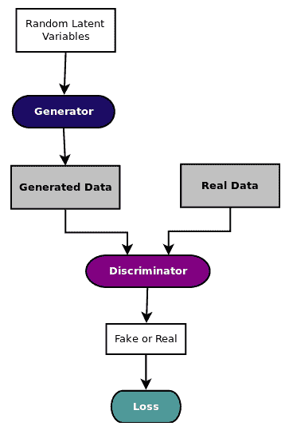
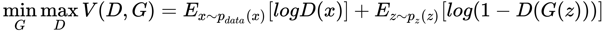
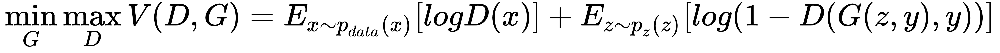
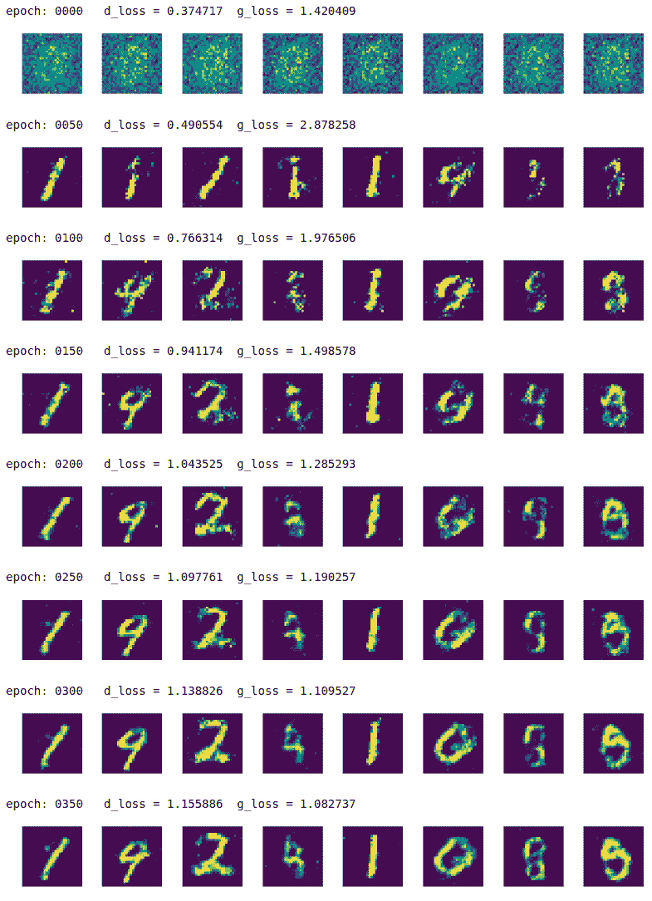
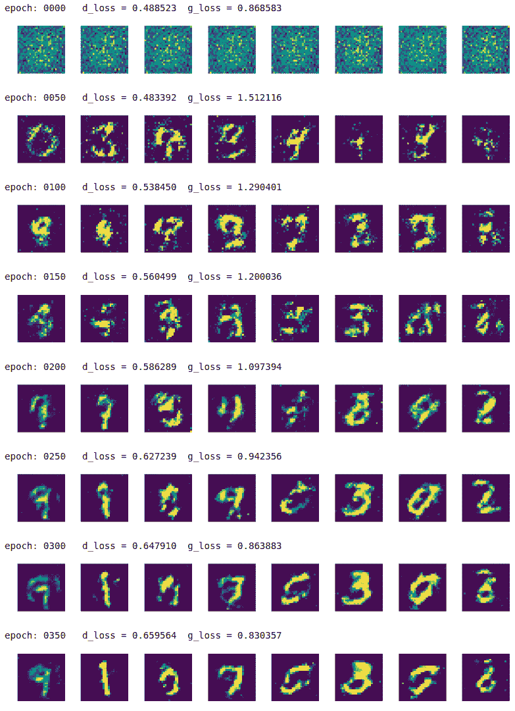
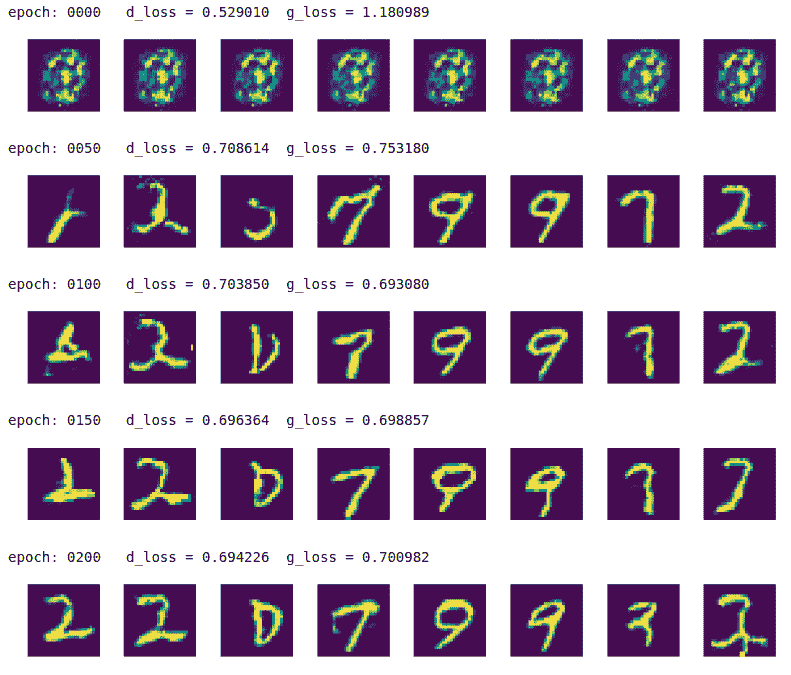

# 十四、生成对抗网络

生成模型被训练以生成与他们训练的数据类似的更多数据，并且训练对抗模型以通过提供对抗性示例来区分真实数据和假数据。

**生成对抗网络**（**GAN**）结合了两种模型的特征。 GAN 有两个组成部分：

*   学习如何生成类似数据的生成模型
*   一种判别模型，用于学习如何区分真实数据和生成数据（来自生成模型）

GAN 已成功应用于各种复杂问题，例如：

*   从低分辨率图像生成照片般逼真的分辨率图像
*   合成文本中的图像
*   风格迁移
*   完成不完整的图像和视频

在本章中，我们将学习以下主题，以学习如何在 TensorFlow 和 Keras 中实现 GAN：

*   生成对抗网络
*   TensorFlow 中的简单 GAN
*   Keras 的简单 GAN
*   具有 TensorFlow 和 Keras 的深度卷积 GAN

# 生成对抗网络 101

如下图所示，Generative Adversarial Networks（通常称为 GAN）有两个同步工作模型，用于学习和训练复杂数据，如图像，视频或音频文件：



直观地，生成器模型从随机噪声开始生成数据，但是慢慢地学习如何生成更真实的数据。生成器输出和实际数据被馈送到判别器，该判别器学习如何区分假数据和真实数据。

因此，生成器和判别器都发挥对抗性游戏，其中生成器试图通过生成尽可能真实的数据来欺骗判别器，并且判别器试图不通过从真实数据中识别伪数据而被欺骗，因此判别器试图最小化分类损失。两个模型都以锁步方式进行训练。

在数学上，生成模型`G(z)`学习概率分布`p(z)`，使得判别器`D(G(z), x)`无法在概率分布`p(z)`和`p(x)`之间进行识别。 GAN 的目标函数可以通过下面描述值函数`V`的等式来描述，（来自[此链接](https://papers.nips.cc/paper/5423-generative-adversarial-nets.pdf)）：



[可以在此链接中找到 IAN Goodfellow 在 NIPS 2016 上关于 GAN 的开创性教程](https://arxiv.org/pdf/1701.00160.pdf)。

这个描述代表了一个简单的 GAN（在文献中也称为香草 GAN），[由 Goodfellow 在此链接提供的开创性论文中首次介绍](https://arxiv.org/abs/1406.2661)。从那时起，在基于 GAN 推导不同架构并将其应用于不同应用领域方面进行了大量研究。

例如，在条件 GAN 中，为生成器和判别器网络提供标签，使得条件 GAN 的目标函数可以通过以下描述值函数`V`的等式来描述：



[描述条件 GAN 的原始论文位于此链接](https://arxiv.org/abs/1411.1784)。

应用中使用的其他几种衍生产品及其原始论文，如文本到图像，图像合成，图像标记，样式转移和图像转移等，如下表所示：

| **GAN 衍生物** | **原始文件** | **示例应用** |
| --- | --- | --- |
| StackGAN | <https://arxiv.org/abs/1710.10916> | 文字到图像 |
| StackGAN ++ | <https://arxiv.org/abs/1612.03242> | 逼真的图像合成 |
| DCGAN | <https://arxiv.org/abs/1511.06434> | 图像合成 |
| HR-DCGAN | <https://arxiv.org/abs/1711.06491> | 高分辨率图像合成 |
| 有条件的 GAN | <https://arxiv.org/abs/1411.1784> | 图像标记 |
| InfoGAN | <https://arxiv.org/abs/1606.03657> | 风格识别 |
| Wasserstein GAN | <https://arxiv.org/abs/1701.07875> <https://arxiv.org/abs/1704.00028> | 图像生成 |
| 耦合 GAN | <https://arxiv.org/abs/1606.07536> | 图像转换，域适应 |
| BEGAN | <https://arxiv.org/abs/1703.10717> | 图像合成 |
| DiscoGAN | <https://arxiv.org/abs/1703.05192> | 风格迁移 |
| CycleGAN | <https://arxiv.org/abs/1703.10593> | 风格迁移 |

让我们练习使用 MNIST 数据集创建一个简单的 GAN。在本练习中，我们将使用以下函数将 MNIST 数据集标准化为介于[-1，+ 1]之间：

```py
def norm(x):
  return (x-0.5)/0.5
```

我们还定义了 256 维的随机噪声，用于测试生成器模型：

```py
n_z = 256
z_test = np.random.uniform(-1.0,1.0,size=[8,n_z])
```

显示将在本章所有示例中使用的生成图像的函数：

```py
def display_images(images):
 for i in range(images.shape[0]):  plt.subplot(1, 8, i + 1)
        plt.imshow(images[i])
        plt.axis('off')
    plt.tight_layout()
    plt.show()
```

# 建立和训练 GAN 的最佳实践

对于我们为此演示选择的数据集，判别器在对真实和假图像进行分类方面变得非常擅长，因此没有为生成器提供梯度方面的大量反馈。因此，我们必须通过以下最佳实践使判别器变弱：

*   判别器的学习率保持远高于生成器的学习率。
*   判别器的优化器是`GradientDescent`，生成器的优化器是`Adam`。
*   判别器具有 dropout 正则化，而生成器则没有。
*   与生成器相比，判别器具有更少的层和更少的神经元。
*   生成器的输出是`tanh`，而判别器的输出是 sigmoid。
*   在 Keras 模型中，对于实际数据的标签，我们使用 0.9 而不是 1.0 的值，对于伪数据的标签，我们使用 0.1 而不是 0.0，以便在标签中引入一点噪声

欢迎您探索并尝试其他最佳实践。

# 使用 TensorFlow 的简单的 GAN

您可以按照 Jupyter 笔记本中的代码`ch-14a_SimpleGAN`。

为了使用 TensorFlow 构建 GAN，我们使用以下步骤构建三个网络，两个判别器模型和一个生成器模型：

1.  首先添加用于定义网络的超参数：

```py
# graph hyperparameters
g_learning_rate = 0.00001
d_learning_rate = 0.01
n_x = 784  # number of pixels in the MNIST image 

# number of hidden layers for generator and discriminator
g_n_layers = 3
d_n_layers = 1
# neurons in each hidden layer
g_n_neurons = [256, 512, 1024]
d_n_neurons = [256]

# define parameter ditionary
d_params = {}
g_params = {}

activation = tf.nn.leaky_relu
w_initializer = tf.glorot_uniform_initializer
b_initializer = tf.zeros_initializer
```

1.  接下来，定义生成器网络：

```py
z_p = tf.placeholder(dtype=tf.float32, name='z_p', 
        shape=[None, n_z])
layer = z_p

# add generator network weights, biases and layers
with tf.variable_scope('g'):
 for i in range(0, g_n_layers):  w_name = 'w_{0:04d}'.format(i)
        g_params[w_name] = tf.get_variable(
            name=w_name,
            shape=[n_z if i == 0 else g_n_neurons[i - 1], 
                    g_n_neurons[i]],
            initializer=w_initializer())
        b_name = 'b_{0:04d}'.format(i)
        g_params[b_name] = tf.get_variable(
            name=b_name, shape=[g_n_neurons[i]], 
            initializer=b_initializer())
        layer = activation(
            tf.matmul(layer, g_params[w_name]) + g_params[b_name])
    # output (logit) layer
  i = g_n_layers
    w_name = 'w_{0:04d}'.format(i)
    g_params[w_name] = tf.get_variable(
        name=w_name,
        shape=[g_n_neurons[i - 1], n_x],
        initializer=w_initializer())
    b_name = 'b_{0:04d}'.format(i)
    g_params[b_name] = tf.get_variable(
        name=b_name, shape=[n_x], initializer=b_initializer())
    g_logit = tf.matmul(layer, g_params[w_name]) + g_params[b_name]
    g_model = tf.nn.tanh(g_logit)
```

1.  接下来，定义我们将构建的两个判别器网络的权重和偏差：

```py
with tf.variable_scope('d'):
 for i in range(0, d_n_layers):  w_name = 'w_{0:04d}'.format(i)
        d_params[w_name] = tf.get_variable(
            name=w_name,
            shape=[n_x if i == 0 else d_n_neurons[i - 1], 
                    d_n_neurons[i]],
            initializer=w_initializer())

        b_name = 'b_{0:04d}'.format(i)
        d_params[b_name] = tf.get_variable(
            name=b_name, shape=[d_n_neurons[i]], 
            initializer=b_initializer())

    #output (logit) layer
  i = d_n_layers
    w_name = 'w_{0:04d}'.format(i)
    d_params[w_name] = tf.get_variable(
        name=w_name, shape=[d_n_neurons[i - 1], 1], 
        initializer=w_initializer())

    b_name = 'b_{0:04d}'.format(i)
    d_params[b_name] = tf.get_variable(
        name=b_name, shape=[1], initializer=b_initializer())
```

1.  现在使用这些参数，构建将真实图像作为输入并输出分类的判别器：

```py
# define discriminator_real

# input real images
x_p = tf.placeholder(dtype=tf.float32, name='x_p', 
        shape=[None, n_x])

layer = x_p

with tf.variable_scope('d'):
 for i in range(0, d_n_layers):  w_name = 'w_{0:04d}'.format(i)
        b_name = 'b_{0:04d}'.format(i)

        layer = activation(
            tf.matmul(layer, d_params[w_name]) + d_params[b_name])
        layer = tf.nn.dropout(layer,0.7)
    #output (logit) layer
  i = d_n_layers
    w_name = 'w_{0:04d}'.format(i)
    b_name = 'b_{0:04d}'.format(i)
    d_logit_real = tf.matmul(layer, 
        d_params[w_name]) + d_params[b_name]
    d_model_real = tf.nn.sigmoid(d_logit_real)
```

1.  接下来，使用相同的参数构建另一个判别器网络，但提供生成器的输出作为输入：

```py
# define discriminator_fake

# input generated fake images
z = g_model
layer = z

with tf.variable_scope('d'):
 for i in range(0, d_n_layers):  w_name = 'w_{0:04d}'.format(i)
        b_name = 'b_{0:04d}'.format(i)
        layer = activation(
            tf.matmul(layer, d_params[w_name]) + d_params[b_name])
        layer = tf.nn.dropout(layer,0.7)
    #output (logit) layer
  i = d_n_layers
    w_name = 'w_{0:04d}'.format(i)
    b_name = 'b_{0:04d}'.format(i)
    d_logit_fake = tf.matmul(layer, 
        d_params[w_name]) + d_params[b_name]
    d_model_fake = tf.nn.sigmoid(d_logit_fake)
```

1.  现在我们已经建立了三个网络，它们之间的连接是使用损失，优化器和训练函数完成的。在训练生成器时，我们只训练生成器的参数，在训练判别器时，我们只训练判别器的参数。我们使用`var_list`参数将此指定给优化器的`minimize()`函数。以下是为两种网络定义损失，优化器和训练函数的完整代码：

```py
g_loss = -tf.reduce_mean(tf.log(d_model_fake))
d_loss = -tf.reduce_mean(tf.log(d_model_real) + tf.log(1 - d_model_fake))

g_optimizer = tf.train.AdamOptimizer(g_learning_rate)
d_optimizer = tf.train.GradientDescentOptimizer(d_learning_rate)

g_train_op = g_optimizer.minimize(g_loss, 
                var_list=list(g_params.values()))
d_train_op = d_optimizer.minimize(d_loss, 
                var_list=list(d_params.values()))
```

1.  现在我们已经定义了模型，我们必须训练模型。训练按照以下算法完成：

```py
For each epoch:
 For each batch:  get real images x_batch
    generate noise z_batch
    train discriminator using z_batch and x_batch
    generate noise z_batch
    train generator using z_batch
```

笔记本电脑的完整训练代码如下：

```py
n_epochs = 400
batch_size = 100
n_batches = int(mnist.train.num_examples / batch_size)
n_epochs_print = 50

with tf.Session() as tfs:
  tfs.run(tf.global_variables_initializer())
    for epoch in range(n_epochs):
  epoch_d_loss = 0.0
        epoch_g_loss = 0.0
        for batch in range(n_batches):
  x_batch, _ = mnist.train.next_batch(batch_size)
            x_batch = norm(x_batch)
            z_batch = np.random.uniform(-1.0,1.0,size=[batch_size,n_z])
            feed_dict = {x_p: x_batch,z_p: z_batch}
            _,batch_d_loss = tfs.run([d_train_op,d_loss], 
                                    feed_dict=feed_dict)
            z_batch = np.random.uniform(-1.0,1.0,size=[batch_size,n_z])
            feed_dict={z_p: z_batch}
            _,batch_g_loss = tfs.run([g_train_op,g_loss], 
                                    feed_dict=feed_dict)
            epoch_d_loss += batch_d_loss 
            epoch_g_loss += batch_g_loss

        if epoch%n_epochs_print == 0:
  average_d_loss = epoch_d_loss / n_batches
            average_g_loss = epoch_g_loss / n_batches
            print('epoch: {0:04d}   d_loss = {1:0.6f}  g_loss = {2:0.6f}'
                  .format(epoch,average_d_loss,average_g_loss))
            # predict images using generator model trained            
 x_pred = tfs.run(g_model,feed_dict={z_p:z_test})
            display_images(x_pred.reshape(-1,pixel_size,pixel_size))   

```

我们每 50 个周期印刷生成的图像：



正如我们所看到的那样，生成器在周期 0 中只产生噪声，但是在周期 350 中，它经过训练可以产生更好的手写数字形状。您可以尝试使用周期，正则化，网络架构和其他超参数进行试验，看看是否可以产生更快更好的结果。

# 使用 Keras 的简单的 GAN

您可以按照 Jupyter 笔记本中的代码`ch-14a_SimpleGAN`。

现在让我们在 Keras 实现相同的模型：

1.  超参数定义与上一节保持一致：

```py
# graph hyperparameters
g_learning_rate = 0.00001
d_learning_rate = 0.01
n_x = 784  # number of pixels in the MNIST image 
# number of hidden layers for generator and discriminator
g_n_layers = 3
d_n_layers = 1
# neurons in each hidden layer
g_n_neurons = [256, 512, 1024]
d_n_neurons = [256]
```

1.  接下来，定义生成器网络：

```py
# define generator

g_model = Sequential()
g_model.add(Dense(units=g_n_neurons[0], 
                  input_shape=(n_z,),
                  name='g_0'))
g_model.add(LeakyReLU())
for i in range(1,g_n_layers):
  g_model.add(Dense(units=g_n_neurons[i],
                      name='g_{}'.format(i)
                     ))
    g_model.add(LeakyReLU())
g_model.add(Dense(units=n_x, activation='tanh',name='g_out'))
print('Generator:')
g_model.summary()
g_model.compile(loss='binary_crossentropy',
              optimizer=keras.optimizers.Adam(lr=g_learning_rate)
             )
```

这就是生成器模型的样子：

```py
Generator:
_________________________________________________________________
Layer (type)                 Output Shape              Param #   
=================================================================
g_0 (Dense)                  (None, 256)               65792     
_________________________________________________________________
leaky_re_lu_1 (LeakyReLU)    (None, 256)               0         
_________________________________________________________________
g_1 (Dense)                  (None, 512)               131584    
_________________________________________________________________
leaky_re_lu_2 (LeakyReLU)    (None, 512)               0         
_________________________________________________________________
g_2 (Dense)                  (None, 1024)              525312    
_________________________________________________________________
leaky_re_lu_3 (LeakyReLU)    (None, 1024)              0         
_________________________________________________________________
g_out (Dense)                (None, 784)               803600    
=================================================================
Total params: 1,526,288
Trainable params: 1,526,288
Non-trainable params: 0
_________________________________________________________________
```

1.  在 Keras 示例中，我们没有定义两个判别器网络，就像我们在 TensorFlow 示例中定义的那样。相反，我们定义一个判别器网络，然后将生成器和判别器网络缝合到 GAN 网络中。然后，GAN 网络仅用于训练生成器参数，判别器网络用于训练判别器参数：

```py
# define discriminator

d_model = Sequential()
d_model.add(Dense(units=d_n_neurons[0],  
                  input_shape=(n_x,),
                  name='d_0'
                 ))
d_model.add(LeakyReLU())
d_model.add(Dropout(0.3))
for i in range(1,d_n_layers):
  d_model.add(Dense(units=d_n_neurons[i], 
                      name='d_{}'.format(i)
                     ))
    d_model.add(LeakyReLU())
    d_model.add(Dropout(0.3))
d_model.add(Dense(units=1, activation='sigmoid',name='d_out'))
print('Discriminator:')
d_model.summary()
d_model.compile(loss='binary_crossentropy',
              optimizer=keras.optimizers.SGD(lr=d_learning_rate)
             )
```

这是判别器模型的外观：

```py
Discriminator:
_________________________________________________________________
Layer (type)                 Output Shape              Param #   
=================================================================
d_0 (Dense)                  (None, 256)               200960    
_________________________________________________________________
leaky_re_lu_4 (LeakyReLU)    (None, 256)               0         
_________________________________________________________________
dropout_1 (Dropout)          (None, 256)               0         
_________________________________________________________________
d_out (Dense)                (None, 1)                 257       
=================================================================
Total params: 201,217
Trainable params: 201,217
Non-trainable params: 0
_________________________________________________________________
```

1.  接下来，定义 GAN 网络，并将判别器模型的可训练属性转换为`false`，因为 GAN 仅用于训练生成器：

```py
# define GAN network
d_model.trainable=False
z_in = Input(shape=(n_z,),name='z_in')
x_in = g_model(z_in)
gan_out = d_model(x_in)

gan_model = Model(inputs=z_in,outputs=gan_out,name='gan')
print('GAN:')
gan_model.summary()
```

```py
gan_model.compile(loss='binary_crossentropy',
              optimizer=keras.optimizers.Adam(lr=g_learning_rate)
             )
```

这就是 GAN 模型的样子：

```py
GAN:
_________________________________________________________________
Layer (type)                 Output Shape              Param #   
=================================================================
z_in (InputLayer)            (None, 256)               0         
_________________________________________________________________
sequential_1 (Sequential)    (None, 784)               1526288   
_________________________________________________________________
sequential_2 (Sequential)    (None, 1)                 201217    
=================================================================
Total params: 1,727,505
Trainable params: 1,526,288
Non-trainable params: 201,217
_________________________________________________________________
```

1.  太好了，现在我们已经定义了三个模型，我们必须训练模型。训练按照以下算法进行：

```py
For each epoch:
 For each batch:  get real images x_batch
    generate noise z_batch
    generate images g_batch using generator model
    combine g_batch and x_batch into x_in and create labels y_out

    set discriminator model as trainable
    train discriminator using x_in and y_out

    generate noise z_batch
    set x_in = z_batch and labels y_out = 1

    set discriminator model as non-trainable
    train gan model using x_in and y_out, 
        (effectively training generator model)
```

为了设置标签，我们分别对真实和假图像应用标签 0.9 和 0.1。通常，建议您使用标签平滑，通过为假数据选择 0.0 到 0.3 的随机值，为实际数据选择 0.8 到 1.0。

以下是笔记本电脑训练的完整代码：

```py
n_epochs = 400
batch_size = 100
n_batches = int(mnist.train.num_examples / batch_size)
n_epochs_print = 50

for epoch in range(n_epochs+1):
  epoch_d_loss = 0.0
    epoch_g_loss = 0.0
    for batch in range(n_batches):
  x_batch, _ = mnist.train.next_batch(batch_size)
        x_batch = norm(x_batch)
        z_batch = np.random.uniform(-1.0,1.0,size=[batch_size,n_z])
        g_batch = g_model.predict(z_batch)

        x_in = np.concatenate([x_batch,g_batch])

        y_out = np.ones(batch_size*2)
        y_out[:batch_size]=0.9
        y_out[batch_size:]=0.1

        d_model.trainable=True
        batch_d_loss = d_model.train_on_batch(x_in,y_out)

        z_batch = np.random.uniform(-1.0,1.0,size=[batch_size,n_z])
        x_in=z_batch

        y_out = np.ones(batch_size)

        d_model.trainable=False
        batch_g_loss = gan_model.train_on_batch(x_in,y_out)

        epoch_d_loss += batch_d_loss 
        epoch_g_loss += batch_g_loss 
    if epoch%n_epochs_print == 0:
  average_d_loss = epoch_d_loss / n_batches
        average_g_loss = epoch_g_loss / n_batches
        print('epoch: {0:04d}   d_loss = {1:0.6f}  g_loss = {2:0.6f}'
              .format(epoch,average_d_loss,average_g_loss))
        # predict images using generator model trained            
 x_pred = g_model.predict(z_test)
        display_images(x_pred.reshape(-1,pixel_size,pixel_size))   
```

我们每 50 个周期印刷结果，最多 350 个周期：



该模型慢慢地学习从随机噪声中生成高质量的手写数字图像。

GAN 有如此多的变化，它将需要另一本书来涵盖所有不同类型的 GAN。但是，实现技术几乎与我们在此处所示的相似。

# 使用 TensorFlow 和 Keras 的深度卷积 GAN

您可以按照 Jupyter 笔记本中的代码`ch-14b_DCGAN`。

在 DCGAN 中，判别器和生成器都是使用深度卷积网络实现的：

1.  在此示例中，我们决定将生成器实现为以下网络：

```py
Generator:
_________________________________________________________________
Layer (type)                 Output Shape              Param #   
=================================================================
g_in (Dense)                 (None, 3200)              822400    
_________________________________________________________________
g_in_act (Activation)        (None, 3200)              0         
_________________________________________________________________
g_in_reshape (Reshape)       (None, 5, 5, 128)         0         
_________________________________________________________________
g_0_up2d (UpSampling2D)      (None, 10, 10, 128)       0         
_________________________________________________________________
g_0_conv2d (Conv2D)          (None, 10, 10, 64)        204864    
_________________________________________________________________
g_0_act (Activation)         (None, 10, 10, 64)        0         
_________________________________________________________________
g_1_up2d (UpSampling2D)      (None, 20, 20, 64)        0         
_________________________________________________________________
g_1_conv2d (Conv2D)          (None, 20, 20, 32)        51232     
_________________________________________________________________
g_1_act (Activation)         (None, 20, 20, 32)        0         
_________________________________________________________________
g_2_up2d (UpSampling2D)      (None, 40, 40, 32)        0         
_________________________________________________________________
g_2_conv2d (Conv2D)          (None, 40, 40, 16)        12816     
_________________________________________________________________
g_2_act (Activation)         (None, 40, 40, 16)        0         
_________________________________________________________________
g_out_flatten (Flatten)      (None, 25600)             0         
_________________________________________________________________
g_out (Dense)                (None, 784)               20071184  
=================================================================
Total params: 21,162,496
Trainable params: 21,162,496
Non-trainable params: 0
```

1.  生成器是一个更强大的网络，有三个卷积层，然后是 tanh 激活。我们将判别器网络定义如下：

```py
Discriminator:
_________________________________________________________________
Layer (type)                 Output Shape              Param #   
=================================================================
d_0_reshape (Reshape)        (None, 28, 28, 1)         0         
_________________________________________________________________
d_0_conv2d (Conv2D)          (None, 28, 28, 64)        1664      
_________________________________________________________________
d_0_act (Activation)         (None, 28, 28, 64)        0         
_________________________________________________________________
d_0_maxpool (MaxPooling2D)   (None, 14, 14, 64)        0         
_________________________________________________________________
d_out_flatten (Flatten)      (None, 12544)             0         
_________________________________________________________________
d_out (Dense)                (None, 1)                 12545     
=================================================================
Total params: 14,209
Trainable params: 14,209
Non-trainable params: 0
_________________________________________________________________
```

1.  GAN 网络由判别器和生成器组成，如前所述：

```py
GAN:
_________________________________________________________________
Layer (type)                 Output Shape              Param #   
=================================================================
z_in (InputLayer)            (None, 256)               0         
_________________________________________________________________
g (Sequential)               (None, 784)               21162496  
_________________________________________________________________
d (Sequential)               (None, 1)                 14209     
=================================================================
Total params: 21,176,705
Trainable params: 21,162,496
Non-trainable params: 14,209
_________________________________________________________________
```

当我们运行这个模型 400 个周期时，我们得到以下输出：



如您所见，DCGAN 能够从 epoch 100 本身开始生成高质量的数字。 DGCAN 已被用于样式转移，图像和标题的生成以及图像代数，即拍摄一个图像的一部分并将其添加到另一个图像的部分。 MNIST DCGAN 的完整代码在笔记本`ch-14b_DCGAN` 中提供。

# 总结

在本章中，我们了解了 Generative Adversarial Networks。我们在 TensorFlow 和 Keras 中构建了一个简单的 GAN，并将其应用于从 MNIST 数据集生成图像。我们还了解到，许多不同的 GAN 衍生产品正在不断推出，例如 DCGAN，SRGAN，StackGAN 和 CycleGAN 等等。我们还建立了一个 DCGAN，其中生成器和判别器由卷积网络组成。我们鼓励您阅读并尝试不同的衍生工具，以了解哪些模型适合他们试图解决的问题。

在下一章中，我们将学习如何使用 TensorFlow 集群和多个计算设备（如多个 GPU）在分布式集群中构建和部署模型。

