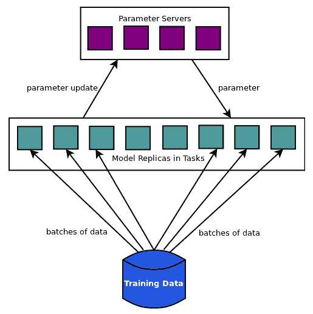
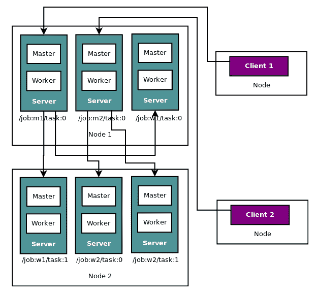
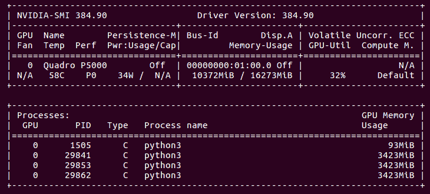
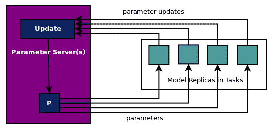
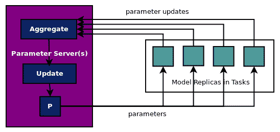

# 十五、TensorFlow 集群的分布式模型

之前我们学习了如何使用 Kubernetes，Docker 和 TensorFlow 服务在生产中大规模运行 TensorFlow 模型。 TensorFlow 服务并不是大规模运行 TensorFlow 模型的唯一方法。 TensorFlow 提供了另一种机制，不仅可以运行，还可以在多个节点或同一节点上的不同节点和不同设备上训练模型。 在第 1 章，TensorFlow 101 中，我们还学习了如何在不同设备上放置变量和操作。在本章中，我们将学习如何分发 TensorFlow 模型以在多个节点上的多个设备上运行。

在本章中，我们将介绍以下主题：

*   分布式执行策略
*   TensorFlow 集群
*   数据并行模型
*   对分布式模型的异步和同步更新

# 分布式执行策略

为了在多个设备或节点上分发单个模型的训练，有以下策略：

*   **模型并行**：将模型划分为多个子图，并将单独的图放在不同的节点或设备上。子图执行计算并根据需要交换变量。
*   **数据并行**：将数据分组并在多个节点或设备上运行相同的模型，并在主节点上组合参数。因此，工作节点在批量数据上训练模型并将参数更新发送到主节点，也称为参数服务器。



上图显示了数据并行方法，其中模型副本分批读取数据分区并将参数更新发送到参数服务器，参数服务器将更新的参数发送回模型副本以进行下一次批量计算的更新。

在 TensorFlow 中，有两种方法可以在数据并行策略下在多​​个节点/设备上实现模型的复制：

*   **图中复制**：在这种方法中，有一个客户端任务拥有模型参数，并将模型计算分配给多个工作任务。
*   **图之间复制**：在这种方法中，每个客户端任务都连接到自己的工作者以分配模型计算，但所有工作器都更新相同的共享模型。在此模型中，TensorFlow 会自动将一个工作器指定为主要工作器，以便模型参数仅由主要工作器初始化一次。

在这两种方法中，参数服务器上的参数可以通过两种不同的方式更新：

*   **同步更新**：在同步更新中，参数服务器等待在更新梯度之前从所有工作器接收更新。参数服务器聚合更新，例如通过计算所有聚合的平均值并将其应用于参数。更新后，参数将同时发送给所有工作器。这种方法的缺点是一个慢工作者可能会减慢每个人的更新速度。
*   **异步更新**：在异步更新中，工作器在准备好时将更新发送到参数服务器，然后参数服务器在接收更新时应用更新并将其发回。这种方法的缺点是，当工作器计算参数并发回更新时，参数可能已被其他工作器多次更新。这个问题可以通过几种方法来减轻，例如降低批量大小或降低学习率。令人惊讶的是，异步方法甚至可以工作，但实际上，它们确实有效！

# TensorFlow 集群

TensorFlow（TF）集群是一种实现我们刚刚讨论过的分布式策略的机制。在逻辑层面，TF 集群运行一个或多个作业，并且每个作业由一个或多个任务组成。因此，工作只是任务的逻辑分组。在进程级别，每个任务都作为 TF 服务器运行。在机器级别，每个物理机器或节点可以通过运行多个服务器（每个任务一个服务器）来运行多个任务。客户端在不同的服务器上创建图，并通过调用远程会话在一台服务器上开始执行图。

作为示例，下图描绘了连接到名为`m1`的两个作业的两个客户端：



这两个节点分别运行三个任务，作业`w1`分布在两个节点上，而其他作业包含在节点中。

TF 服务器实现为两个进程：主控制器和工作器。 主控制器与其他任务协调计算，工作器是实际运行计算的工作器。 在更高级别，您不必担心 TF 服务器的内部。 出于我们的解释和示例的目的，我们将仅涉及 TF 任务。

要以数据并行方式创建和训练模型，请使用以下步骤：

1.  定义集群规范
2.  创建服务器以承载任务
3.  定义要分配给参数服务器任务的变量节点
4.  定义要在所有工作任务上复制的操作节点

1.  创建远程会话
2.  在远程会话中训练模型
3.  使用该模型进行预测

# 定义集群规范

要创建集群，首先要定义集群规范。集群规范通常包含两个作业：`ps`用于创建参数服务器任务，`worker`用于创建工作任务。`worker`和`ps`作业包含运行各自任务的物理节点列表。举个例子：

```py
clusterSpec = tf.train.ClusterSpec({
  'ps': [
              'master0.neurasights.com:2222',  # /job:ps/task:0
  'master1.neurasights.com:2222' # /job:ps/task:1
  ]
  'worker': [
              'worker0.neurasights.com:2222',  # /job:worker/task:0
  'worker1.neurasights.com:2222',  # /job:worker/task:1
  'worker0.neurasights.com:2223',  # /job:worker/task:2
  'worker1.neurasights.com:2223' # /job:worker/task:3
  ]
          })
```

该规范创建了两个作业，作业`ps`中的两个任务分布在两个物理节点上，作业`worker`中的四个任务分布在两个物理节点上。

在我们的示例代码中，我们在不同端口上的 localhost 上创建所有任务：

```py
ps = [
        'localhost:9001',  # /job:ps/task:0
  ]
workers = [
        'localhost:9002',  # /job:worker/task:0
  'localhost:9003',  # /job:worker/task:1
  'localhost:9004',  # /job:worker/task:2
  ]
clusterSpec = tf.train.ClusterSpec({'ps': ps, 'worker': workers})
```

正如您在代码中的注释中所看到的，任务通过`/job:<job name>/task:<task index>`标识。

# 创建服务器实例

由于集群每个任务包含一个服务器实例，因此在每个物理节点上，通过向服务器传递集群规范，它们自己的作业名称和任务索引来启动服务器。服务器使用集群规范来确定计算中涉及的其他节点。

```py
server = tf.train.Server(clusterSpec, job_name="ps", task_index=0)
server = tf.train.Server(clusterSpec, job_name="worker", task_index=0)
server = tf.train.Server(clusterSpec, job_name="worker", task_index=1)
server = tf.train.Server(clusterSpec, job_name="worker", task_index=2)
```

在我们的示例代码中，我们有一个 Python 文件可以在所有物理机器上运行，包含以下内容：

```py
server = tf.train.Server(clusterSpec,
                         job_name=FLAGS.job_name,
                         task_index=FLAGS.task_index,
                         config=config
                         )
```

在此代码中，`job_name`和`task_index`取自命令行传递的参数。软件包`tf.flags`是一个花哨的解析器，可以访问命令行参数。 Python 文件在每个物理节点上执行如下（如果您仅使用本地主机，则在同一节点上的单独终端中执行）：

```py
# the model should be run in each physical node 
# using the appropriate arguments
$ python3 model.py --job_name='ps' --task_index=0
$ python3 model.py --job_name='worker' --task_index=0
$ python3 model.py --job_name='worker' --task_index=1
$ python3 model.py --job_name='worker' --task_index=2
```

为了在任何集群上运行代码具有更大的灵活性，您还可以通过命令行传递运行参数服务器和工作程序的计算机列表：`-ps='localhost:9001' --worker='localhost:9002,localhost:9003,``localhost:9004'`。您需要解析它们并在集群规范字典中正确设置它们。

为确保我们的参数服务器仅使用 CPU 而我们的工作器任务使用 GPU，我们使用配置对象：

```py
config = tf.ConfigProto()
config.allow_soft_placement = True

if FLAGS.job_name=='ps':
    #print(config.device_count['GPU'])
  config.device_count['GPU']=0
  server = tf.train.Server(clusterSpec,
                             job_name=FLAGS.job_name,
                             task_index=FLAGS.task_index,
                             config=config
                             )
    server.join()
    sys.exit('0')
elif FLAGS.job_name=='worker':
    config.gpu_options.per_process_gpu_memory_fraction = 0.2
  server = tf.train.Server(clusterSpec,
                             job_name=FLAGS.job_name,
                             task_index=FLAGS.task_index,
                             config=config
```

当工作器执行模型训练并退出时，参数服务器等待`server.join()`。

这就是我们的 GPU 在所有四台服务器运行时的样子：



# 定义服务器和设备之间的参数和操作

您可以使用我们在第 1 章中使用的`tf.device()`函数，将参数放在`ps`任务和`worker`任务上图的计算节点上。

请注意，您还可以通过将设备字符串添加到任务字符串来将图节点放置在特定设备上，如下所示：`/job:<job name>/task:<task index>/device:<device type>:<device index>`.

对于我们的演示示例，我们使用 TensorFlow 函数`tf.train.replica_device_setter()`来放置变量和操作。

1.  首先，我们将工作器设备定义为当前工作器：

```py
worker_device='/job:worker/task:{}'.format(FLAGS.task_index)
```

1.  接下来，使用`replica_device_setter`定义设备功能，传递集群规范和当前工作设备。`replica_device_setter`函数从集群规范中计算出参数服务器，如果有多个参数服务器，则默认情况下以循环方式在它们之间分配参数。参数放置策略可以更改为`tf.contrib`包中的用户定义函数或预构建策略。

```py
device_func = tf.train.replica_device_setter(
    worker_device=worker_device,cluster=clusterSpec)
```

1.  最后，我们在`tf.device(device_func)`块内创建图并训练它。对于同步更新和异步更新，图的创建和训练是不同的，因此我们将在两个单独的小节中介绍这些内容。

# 定义并训练图以进行异步更新

如前所述，并在此处的图中显示，在异步更新中，所有工作任务在准备就绪时发送参数更新，参数服务器更新参数并发回参数。参数更新没有同步或等待或聚合：

The full code for this example is in `ch-15_mnist_dist_async.py`. You are encouraged to modify and explore the code with your own datasets.

对于异步更新，将使用以下步骤创建和训练图：

1.  图的定义在`with`块内完成：

```py
with tf.device(device_func):
```

1.  使用内置的 TensorFlow 函数创建全局步骤变量：

```py
global_step = tf.train.get_or_create_global_step()
```

1.  此变量也可以定义为：

```py
tf.Variable(0,name='global_step',trainable=False)
```

1.  像往常一样定义数据集，参数和超参数：

```py
x_test = mnist.test.images
y_test = mnist.test.labels
n_outputs = 10  # 0-9 digits
n_inputs = 784  # total pixels
learning_rate = 0.01
n_epochs = 50
batch_size = 100
n_batches = int(mnist.train.num_examples/batch_size)
n_epochs_print=10
```

1.  像往常一样定义占位符，权重，偏差，对率，交叉熵，损失操作，训练操作，准确率：

```py
# input images
x_p = tf.placeholder(dtype=tf.float32,
                     name='x_p',
                     shape=[None, n_inputs])
# target output
y_p = tf.placeholder(dtype=tf.float32,
                     name='y_p',
                     shape=[None, n_outputs])
w = tf.Variable(tf.random_normal([n_inputs, n_outputs],
                                 name='w'
                                 )
                )
b = tf.Variable(tf.random_normal([n_outputs],
                                 name='b'
                                 )
                )
logits = tf.matmul(x_p,w) + b

entropy_op = tf.nn.softmax_cross_entropy_with_logits(labels=y_p,
                                                     logits=logits
                                                    )
loss_op = tf.reduce_mean(entropy_op)

optimizer = tf.train.GradientDescentOptimizer(learning_rate)
train_op = optimizer.minimize(loss_op,global_step=global_step)

correct_pred = tf.equal(tf.argmax(logits, 1), tf.argmax(y_p, 1))
accuracy_op = tf.reduce_mean(tf.cast(correct_pred, tf.float32))
```

当我们学习如何构建同步更新时，这些定义将会改变。

1.  TensorFlow 提供了一个主管类，可以帮助创建训练会话，在分布式训练设置中非常有用。创建一个`supervisor`对象，如下所示：

```py
init_op = tf.global_variables_initializer
sv = tf.train.Supervisor(is_chief=is_chief,
                        init_op = init_op(),
                        global_step=global_step)
```

1.  使用`supervisor`对象创建会话并像往常一样在此会话块下运行训练：

```py
with sv.prepare_or_wait_for_session(server.target) as mts:
    lstep = 0

    for epoch in range(n_epochs):
        for batch in range(n_batches):
            x_batch, y_batch = mnist.train.next_batch(batch_size)
            feed_dict={x_p:x_batch,y_p:y_batch}
            _,loss,gstep=mts.run([train_op,loss_op,global_step],
                                 feed_dict=feed_dict)
            lstep +=1
        if (epoch+1)%n_epochs_print==0:
            print('worker={},epoch={},global_step={}, \
                  local_step={},loss={}'.
                  format(FLAGS.task_index,epoch,gstep,lstep,loss))
    feed_dict={x_p:x_test,y_p:y_test}
    accuracy = mts.run(accuracy_op, feed_dict=feed_dict)
    print('worker={}, final accuracy = {}'
        .format(FLAGS.task_index,accuracy))
```

在启动参数服务器时，我们得到以下输出：

```py
$ python3 ch-15_mnist_dist_async.py --job_name='ps' --task_index=0
I tensorflow/core/common_runtime/gpu/gpu_device.cc:1030] Found device 0 with properties:
    name: Quadro P5000 major: 6 minor: 1 memoryClockRate(GHz): 1.506
pciBusID: 0000:01:00.0
totalMemory: 15.89GiB freeMemory: 15.79GiB
I tensorflow/core/common_runtime/gpu/gpu_device.cc:1120] Creating TensorFlow device (/device:GPU:0) -> (device: 0, name: Quadro P5000, pci bus id: 0000:01:00.0, compute capability: 6.1)
E1213 16:50:14.023235178   27224 ev_epoll1_linux.c:1051]     grpc epoll fd: 23
I tensorflow/core/distributed_runtime/rpc/grpc_channel.cc:215] Initialize GrpcChannelCache for job ps -> {0 -> localhost:9001}
I tensorflow/core/distributed_runtime/rpc/grpc_channel.cc:215] Initialize GrpcChannelCache for job worker -> {0 -> localhost:9002, 1 -> localhost:9003, 2 -> localhost:9004}
I tensorflow/core/distributed_runtime/rpc/grpc_server_lib.cc:324] Started server with target: grpc://localhost:9001
```

在启动工作任务时，我们得到以下三个输出：

工作器 1 的输出：

```py
$ python3 ch-15_mnist_dist_async.py --job_name='worker' --task_index=0
I tensorflow/core/common_runtime/gpu/gpu_device.cc:1030] Found device 0 with properties:
    name: Quadro P5000 major: 6 minor: 1 memoryClockRate(GHz): 1.506
pciBusID: 0000:01:00.0
totalMemory: 15.89GiB freeMemory: 9.16GiB
I tensorflow/core/common_runtime/gpu/gpu_device.cc:1120] Creating TensorFlow device (/device:GPU:0) -> (device: 0, name: Quadro P5000, pci bus id: 0000:01:00.0, compute capability: 6.1)
E1213 16:50:37.516609689   27507 ev_epoll1_linux.c:1051]     grpc epoll fd: 23
I tensorflow/core/distributed_runtime/rpc/grpc_channel.cc:215] Initialize GrpcChannelCache for job ps -> {0 -> localhost:9001}
I tensorflow/core/distributed_runtime/rpc/grpc_channel.cc:215] Initialize GrpcChannelCache for job worker -> {0 -> localhost:9002, 1 -> localhost:9003, 2 -> localhost:9004}
I tensorflow/core/distributed_runtime/rpc/grpc_server_lib.cc:324] Started server with target: grpc://localhost:9002
I tensorflow/core/distributed_runtime/master_session.cc:1004] Start master session 1421824c3df413b5 with config: gpu_options { per_process_gpu_memory_fraction: 0.2 } allow_soft_placement: true
worker=0,epoch=9,global_step=10896, local_step=5500, loss = 1.2575616836547852
worker=0,epoch=19,global_step=22453, local_step=11000, loss = 0.7158586382865906
worker=0,epoch=29,global_step=39019, local_step=16500, loss = 0.43712112307548523
worker=0,epoch=39,global_step=55513, local_step=22000, loss = 0.3935799300670624
worker=0,epoch=49,global_step=72002, local_step=27500, loss = 0.3877961337566376
worker=0, final accuracy = 0.8865000009536743
```

工作器 2 的输出：

```py
$ python3 ch-15_mnist_dist_async.py --job_name='worker' --task_index=1
I tensorflow/core/common_runtime/gpu/gpu_device.cc:1030] Found device 0 with properties:
    name: Quadro P5000 major: 6 minor: 1 memoryClockRate(GHz): 1.506
pciBusID: 0000:01:00.0
totalMemory: 15.89GiB freeMemory: 12.43GiB
I tensorflow/core/common_runtime/gpu/gpu_device.cc:1120] Creating TensorFlow device (/device:GPU:0) -> (device: 0, name: Quadro P5000, pci bus id: 0000:01:00.0, compute capability: 6.1)
E1213 16:50:36.684334877   27461 ev_epoll1_linux.c:1051]     grpc epoll fd: 23
I tensorflow/core/distributed_runtime/rpc/grpc_channel.cc:215] Initialize GrpcChannelCache for job ps -> {0 -> localhost:9001}
I tensorflow/core/distributed_runtime/rpc/grpc_channel.cc:215] Initialize GrpcChannelCache for job worker -> {0 -> localhost:9002, 1 -> localhost:9003, 2 -> localhost:9004}
I tensorflow/core/distributed_runtime/rpc/grpc_server_lib.cc:324] Started server with target: grpc://localhost:9003
I tensorflow/core/distributed_runtime/master_session.cc:1004] Start master session 2bd8a136213a1fce with config: gpu_options { per_process_gpu_memory_fraction: 0.2 } allow_soft_placement: true
worker=1,epoch=9,global_step=11085, local_step=5500, loss = 0.6955764889717102
worker=1,epoch=19,global_step=22728, local_step=11000, loss = 0.5891970992088318
worker=1,epoch=29,global_step=39074, local_step=16500, loss = 0.4183048903942108
worker=1,epoch=39,global_step=55599, local_step=22000, loss = 0.32243454456329346
worker=1,epoch=49,global_step=72105, local_step=27500, loss = 0.5384714007377625
worker=1, final accuracy = 0.8866000175476074
```

工作器 3 的输出：

```py
$ python3 ch-15_mnist_dist_async.py --job_name='worker' --task_index=2
I tensorflow/core/common_runtime/gpu/gpu_device.cc:1030] Found device 0 with properties:
    name: Quadro P5000 major: 6 minor: 1 memoryClockRate(GHz): 1.506
pciBusID: 0000:01:00.0
totalMemory: 15.89GiB freeMemory: 15.70GiB
I tensorflow/core/common_runtime/gpu/gpu_device.cc:1120] Creating TensorFlow device (/device:GPU:0) -> (device: 0, name: Quadro P5000, pci bus id: 0000:01:00.0, compute capability: 6.1)
E1213 16:50:35.568349791   27449 ev_epoll1_linux.c:1051]     grpc epoll fd: 23
I tensorflow/core/distributed_runtime/rpc/grpc_channel.cc:215] Initialize GrpcChannelCache for job ps -> {0 -> localhost:9001}
I tensorflow/core/distributed_runtime/rpc/grpc_channel.cc:215] Initialize GrpcChannelCache for job worker -> {0 -> localhost:9002, 1 -> localhost:9003, 2 -> localhost:9004}
I tensorflow/core/distributed_runtime/rpc/grpc_server_lib.cc:324] Started server with target: grpc://The full code for this example is in ch-15_mnist_dist_sync.py. You are encouraged to modify and explore the code with your own datasets.localhost:9004
I tensorflow/core/distributed_runtime/master_session.cc:1004] Start master session cb0749c9f5fc163e with config: gpu_options { per_process_gpu_memory_fraction: 0.2 } allow_soft_placement: true
I tensorflow/core/distributed_runtime/master_session.cc:1004] Start master session 55bf9a2b9718a571 with config: gpu_options { per_process_gpu_memory_fraction: 0.2 } allow_soft_placement: true
worker=2,epoch=9,global_step=37367, local_step=5500, loss = 0.8077645301818848
worker=2,epoch=19,global_step=53859, local_step=11000, loss = 0.26333487033843994
worker=2,epoch=29,global_step=70299, local_step=16500, loss = 0.6506651043891907
worker=2,epoch=39,global_step=76999, local_step=22000, loss = 0.20321622490882874
worker=2,epoch=49,global_step=82499, local_step=27500, loss = 0.4170967936515808
worker=2, final accuracy = 0.8894000053405762
```

我们打印了全球步骤和本地步骤。全局步骤表示所有工作器任务的步数，而本地步骤是该工作器任务中的计数，这就是为什么本地任务计数高达 27,500 并且每个工作器的每个周期都相同，但是因为工作器正在做按照自己的步伐采取全球性措施，全球步骤的数量在周期或工作器之间没有对称性或模式。此外，我们发现每个工作器的最终准确率是不同的，因为每个工作器在不同的时间执行最终的准确率，当时有不同的参数。

# 定义并训练图以进行同步更新

如前所述，并在此处的图中描述，在同步更新中，任务将其更新发送到参数服务器，`ps`任务等待接收所有更新，聚合它们，然后更新参数。工作任务在继续下一次计算参数更新迭代之前等待更新：



此示例的完整代码位于`ch-15_mnist_dist_sync.py`中。建议您使用自己的数据集修改和浏览代码。

对于同步更新，需要对代码进行以下修改：

1.  优化器需要包装在`SyncReplicaOptimizer`中。因此，在定义优化程序后，添加以下代码：

```py
# SYNC: next line added for making it sync update
optimizer = tf.train.SyncReplicasOptimizer(optimizer,
    replicas_to_aggregate=len(workers),
    total_num_replicas=len(workers),
    )
```

1.  之后应该像以前一样添加训练操作：

```py
train_op = optimizer.minimize(loss_op,global_step=global_step)
```

1.  接下来，添加特定于同步更新方法的初始化函数定义：

```py
if is_chief:
    local_init_op = optimizer.chief_init_op()
else:
    local_init_op = optimizer.local_step_init_op()
chief_queue_runner = optimizer.get_chief_queue_runner()
init_token_op = optimizer.get_init_tokens_op()
```

1.  使用两个额外的初始化函数也可以不同地创建`supervisor`对象：

```py
# SYNC: sv is initialized differently for sync update
sv = tf.train.Supervisor(is_chief=is_chief,
 init_op = tf.global_variables_initializer(),
 local_init_op = local_init_op,
 ready_for_local_init_op = optimizer.ready_for_local_init_op,
 global_step=global_step)
```

1.  最后，在训练的会话块中，我们初始化同步变量并启动队列运行器（如果它是主要的工作者任务）：

```py
# SYNC: if block added to make it sync update
if is_chief:
    mts.run(init_token_op)
    sv.start_queue_runners(mts, [chief_queue_runner])
```

其余代码与异步更新保持一致。

用于支持分布式训练的 TensorFlow 库和函数正在不断发展。 因此，请注意添加的新函数或函数签名的更改。 在撰写本书的时候，我们使用了 TensorFlow 1.4。

# 总结

在本章中，我们学习了如何使用 TensorFlow 集群在多台机器和设​​备上分发模型的训练。我们还学习了 TensorFlow 代码分布式执行的模型并行和数据并行策略。

参数更新可以与参数服务器的同步或异步更新共享。我们学习了如何为同步和异步参数更新实现代码。借助本章中学到的技能，您将能够构建和训练具有非常大的数据集的非常大的模型。

在下一章中，我们将学习如何在运行 iOS 和 Android 平台的移动和嵌入式设备上部署 TensorFlow 模型。

