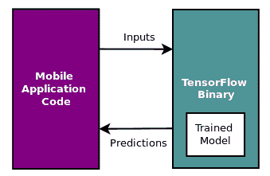
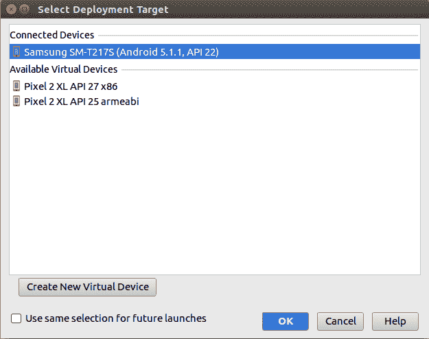
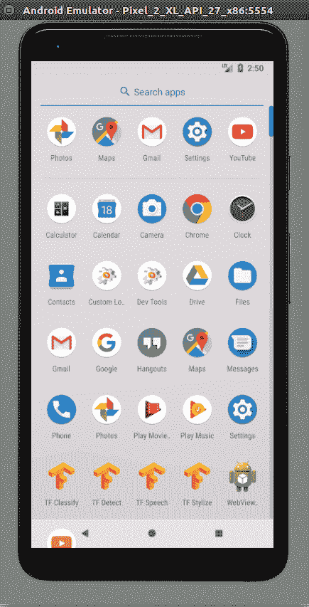

# 十六、移动和嵌入式平台上的 TensorFlow 模型

TensorFlow 模型还可用于在移动和嵌入式平台上运行的应用。 TensorFlow Lite 和 TensorFlow Mobile 是资源受限移动设备的两种 TensorFlow。与 TensorFlow Mobile 相比，TensorFlow Lite 支持功能的子集。由于较小的二进制大小和较少的依赖性，TensorFlow Lite 可以获得更好的表现。

要将 TensorFlow 集成到您的应用中，首先，使用我们在整本书中提到的技术训练模型，然后保存模型。现在可以使用保存的模型在移动应用中进行推理和预测。

要了解如何在移动设备上使用 TensorFlow 模型，在本章中我们将介绍以下主题：

*   移动平台上的 TensorFlow
*   Android 应用中的 TF Mobile
*   Android 上的 TF Mobile 演示
*   iOS 上的 TF Mobile 演示
*   TensorFlow Lite
*   Android 上的 TF Lite 演示
*   iOS 上的 TF Lite 演示

# 移动平台上的 TensorFlow

TensorFlow 可以集成到移动应用中，用于涉及以下一项或多项机器学习任务的许多用例：

*   语音识别
*   图像识别
*   手势识别
*   光学字符识别
*   图像或文本分类
*   图像，文本或语音合成
*   对象识别

要在移动应用上运行 TensorFlow，我们需要两个主要成分：

*   经过训练和保存的模型，可用于预测
*   TensorFlow 二进制文件，可以接收输入，应用模型，生成预测，并将预测作为输出发送

高级体系结构如下图所示：



移动应用代码将输入发送到 TensorFlow 二进制文件，该二进制文件使用训练的模型来计算预测并将预测发回。

# Android 应用中的 TF Mobile

TensorFlow 生态系统使其能够通过接口类`TensorFlowInferenceInterface`，和 jar 文件`libandroid_tensorflow_inference_java.jar`中的 TensorFlow Java API 在 Android 应用中使用。您可以使用 JCenter 中的 jar 文件，从`ci.tensorflow.org`下载预编译的 jar，也可以自己构建。

推理接口已作为 JCenter 包提供，可以通过将以下代码添加到`build.gradle`文件中包含在 Android 项目中：

```py
allprojects {
   repositories {
      jcenter()
   }
}
dependencies {
   compile 'org.tensorflow:tensorflow-android:+'
}
```

[您可以按照此链接中的说明使用 Bazel 或 Cmake 自行构建它们，而不是使用 JCenter 中的预构建二进制文件](https://github.com/tensorflow/tensorflow/blob/master/tensorflow/contrib/android/README.md)。

在 Android 项目中配置 TF 库后，您可以通过以下四个步骤调用 TF 模型：

1.  加载模型：

```py
TensorFlowInferenceInterface inferenceInterface = 
     new TensorFlowInferenceInterface(assetManager, modelFilename);
```

1.  将输入数据发送到 TensorFlow 二进制文件：

```py
inferenceInterface.feed(inputName, 
    floatValues, 1, inputSize, inputSize, 3);
```

1.  运行预测或推理：

```py
inferenceInterface.run(outputNames, logStats);
```

1.  接收 TensorFlow 二进制文件的输出：

```py
inferenceInterface.fetch(outputName, outputs);
```

# Android 上的 TF Mobile 演示

在本节中，我们将学习如何重新创建 TensorFlow 团队在其官方仓库中提供的 Android 演示应用。 Android 演示将在您的 Android 设备上安装以下四个应用：

*   `TF Classify`：这是一个对象识别应用，用于识别设备摄像头输入中的图像，并在其中一个预定义的类中对其进行分类。它不会学习新类型的图片，但会尝试将它们分类为已经学过的类别之一。该应用使用 Google 预训练的初始模型构建。
*   `TF Detect`：这是一个物体检测应用，可检测设备相机输入中的多个物体。在连续图像进纸模式下移动相机时，它会继续识别对象。
*   `TF Stylize`：这是一个样式转移应用，可将选定的预定义样式之一传输到设备相机的输入。
*   `TF Speech`：这是一个语音识别应用，用于识别您的语音，如果它与应用中的某个预定义命令匹配，则它会在设备屏幕上突出显示该特定命令。

示例演示仅适用于 API 级别大于 21 的 Android 设备，并且该设备必须具有支持`FOCUS_MODE_CONTINUOUS_PICTURE`的现代相机。如果您的设备相机不支持此功能，[则必须添加作者提交给 TensorFlow 的路径](https://github.com/tensorflow/tensorflow/pull/15489/files)。。

在您的设备上构建和部署演示应用的最简单方法是使用 Android Studio。要以这种方式构建它，请按照下列步骤操作：

1.  安装 Android Studio。[我们通过此链接的说明在 Ubuntu 16.04 上安装了 Android Studio](https://developer.android.com/studio/install.html)。
2.  查看 TensorFlow 仓库，并应用上一篇技巧中提到的补丁。我们假设您检查了主目录中`tensorflow`文件夹中的代码。

1.  使用 Android Studio，在路径`~/tensorflow/tensorflow/examples/Android`中打开 Android 项目。您的屏幕看起来与此类似：


1.  从左侧栏中展开 Gradle Scripts 选项，然后打开`build.gradle`文件。
2.  在`build.gradle`文件中，找到`def nativeBuildSystem`定义并将其设置为`'none'`。在我们检出的代码版本中，此定义位于第 43 行：

```py
def nativeBuildSystem = 'none'
```

1.  构建演示并在真实或模拟设备上运行它。我们在这些设备上测试了应用：



1.  您还可以构建 apk 并在虚拟或实际连接的设备上安装 apk 文件。一旦应用安装在设备上，您将看到我们之前讨论的四个应用：



Android 模拟器中的 TF 示例应用程序

[您还可以按照此链接中的说明使用 Bazel 或 Cmake 从源构建整个演示应用程序](https://github.com/tensorflow/tensorflow/tree/master/tensorflow/examples/android)。

# iOS 应用中的 TF Mobile

TensorFlow 通过以下步骤支持 iOS 应用：

1.  通过在项目的根目录中添加名为`Profile`的文件，在您的应用中包含 TF Mobile。将以下内容添加到`Profile`：

```py
target 'Name-Of-Your-Project'
       pod 'TensorFlow-experimental'
```

1.  运行`pod install`命令下载并安装 TensorFlow 实验舱。
2.  运行`myproject.xcworkspace`命令打开工作区，以便将预测代码添加到应用逻辑中。

要为 iOS 项目创建自己的 TensorFlow 二进制文件，请按照[此链接中的说明](https://github.com/tensorflow/tensorflow/tree/master/tensorflow/examples/ios)。

在 iOS 项目中配置 TF 库后，可以通过以下四个步骤调用 TF 模型：

1.  加载模型：

```py
PortableReadFileToProto(file_path, &tensorflow_graph);
```

1.  创建会话：

```py
tensorflow::Status s = session->Create(tensorflow_graph);
```

1.  运行预测或推理并获得输出：

```py
std::string input_layer = "input";
std::string output_layer = "output";
std::vector<tensorflow::Tensor> outputs;
tensorflow::Status run_status = session->Run(
    {{input_layer, image_tensor}},
 {output_layer}, {}, &outputs);
```

1.  获取输出数据：

```py
tensorflow::Tensor* output = &outputs[0];
```

# iOS 上的 TF Mobile 演示

要在 iOS 上构建演示，您需要 Xcode 7.3 或更高版本。请按照以下步骤构建 iOS 演示应用：

1.  查看主目录中`tensorflow`文件夹中的 TensorFlow 代码。
2.  打开终端窗口并从主文件夹执行以下命令以下载 Inception V1 模型，提取标签和图文件，并将这些文件移动到示例应用代码中的数据文件夹中：

```py
$ mkdir -p ~/Downloads
$ curl -o ~/Downloads/inception5h.zip \
 https://storage.googleapis.com/download.tensorflow.org/models/inception5h.zip \
 && unzip ~/Downloads/inception5h.zip -d ~/Downloads/inception5h
$ cp ~/Downloads/inception5h/* \
 ~/tensorflow/tensorflow/examples/ios/benchmark/data/
$ cp ~/Downloads/inception5h/* \
 ~/tensorflow/tensorflow/examples/ios/camera/data/
$ cp ~/Downloads/inception5h/* \
 ~/tensorflow/tensorflow/examples/ios/simple/data/
```

1.  导航到其中一个示例文件夹并下载实验窗格：

```py
$ cd ~/tensorflow/tensorflow/examples/ios/camera
$ pod install
```

1.  打开 Xcode 工作区：

```py
$ open tf_simple_example.xcworkspace
```

1.  在设备模拟器中运行示例应用。示例应用将显示“运行模型”按钮。相机应用需要连接 Apple 设备，而其他两个也可以在模拟器中运行。

# TensorFlow Lite

在编写本书时，TF Lite 是该版块中的新手，并且仍处于开发人员视图中。 TF Lite 是 TensorFlow Mobile 和 TensorFlow 的一个非常小的子集，因此使用 TF Lite 编译的二进制文件非常小，并提供卓越的表现。除了减小二进制文件的大小，TensorFlow 还采用了各种其他技术，例如：

*   内核针对各种设备和移动架构进行了优化
*   计算中使用的值是量化的
*   激活函数是预融合的
*   它利用设备上可用的专用机器学习软件或硬件，例如 Android NN API

在 TF Lite 中使用模型的工作流程如下：

1.  **获取模型**：您可以训练自己的模型或选择可从不同来源获得的预训练模型，并按原样使用预训练或使用您自己的数据再训练，或在修改某些部分后再训练该模型。只要您在文件中使用扩展名为.pb 或.pbtxt 的训练模型，就可以继续执行下一步。我们在前面的章节中学习了如何保存模型。
2.  **检查模型**：模型文件只包含图的结构，因此需要保存检查点文件。检查点文件包含模型的序列化变量，例如权重和偏差。我们在前面的章节中学习了如何保存检查点。
3.  **冻结模型**：合并检查点和模型文件，也称为冻结图。 TensorFlow 为此步骤提供`freeze_graph`工具，可以按如下方式执行：

```py
$ freeze_graph
 --input_graph=mymodel.pb
 --input_checkpoint=mycheckpoint.ckpt
 --input_binary=true
 --output_graph=frozen_model.pb
 --output_node_name=mymodel_nodes
```

1.  **转换模型**：需要使用 TensorFlow 提供的`toco`工具将步骤 3 中的冻结模型转换为 TF Lite 格式：

```py
$ toco 
 --input_file=frozen_model.pb
 --input_format=TENSORFLOW_GRAPHDEF
 --output_format=TFLITE
 --input_type=FLOAT
 --input_arrays=input_nodes
 --output_arrays=mymodel_nodes
 --input_shapes=n,h,w,c
```

1.  现在，在步骤 4 中保存的`.tflite`模型可以在使用 TFLite 二进制文件进行推理的 Android 或 iOS 应用中使用。在您的应用中包含 TFLite 二进制文件的过程不断发展，因此我们建议读者按照[此链接中的信息](https://github.com/tensorflow/tensorflow/tree/master/tensorflow/contrib/lite/g3doc)在您的 Android 或 iOS 应用中包含 TFLite 二进制文件。

通常，您可以使用`graph_transforms:summarize_graph`工具修剪在步骤 1 中获得的模型。 修剪后的模型将仅具有在推理或预测时从输入到输出的路径。仅删除训练或调试所需的任何其他节点和路径（例如保存检查点），从而使最终模型的大小非常小。

官方 TensorFlow 仓库附带 TF Lite 演示，该演示使用预训练的`mobilenet`对来自 1001 类别中的设备相机的输入进行分类。演示应用显示前三个类别的概率。

# Android 上的 TF Lite 演示

要在 Android 上构建 TF Lite 演示，请按照下列步骤操作：

1.  安装 Android Studio。[我们通过此链接的说明在 Ubuntu 16.04 上安装了 Android Studio](https://developer.android.com/studio/install.html)。
2.  查看 TensorFlow 仓库，并应用上一篇技巧中提到的补丁。我们假设您检查了主目录中`tensorflow`文件夹中的代码。

1.  使用 Android Studio，从路径`~/tensorflow/tensorflow/contrib/lite/java/demo`打开 Android 项目。如果它抱怨缺少 SDK 或 Gradle 组件，请安装这些组件并同步 Gradle。
2.  构建项目并使用`API​​ > 21`在虚拟设备上运行它。

我们收到了以下警告，但构建成功了。 如果构建失败，您可能希望解决警告：

`Warning:The Jack toolchain is deprecated and will not run. To enable support for Java 8 language features built into the plugin, remove 'jackOptions { ... }' from your build.gradle file, and add`

`android.compileOptions.sourceCompatibility 1.8`
`android.compileOptions.targetCompatibility 1.8`

`Future versions of the plugin will not support usage of 'jackOptions' in build.gradle.`
`To learn more, go to https://d.android.com/r/tools/java-8-support-message.html`

`Warning:The specified Android SDK Build Tools version (26.0.1) is ignored, as it is below the minimum supported version (26.0.2) for Android Gradle Plugin 3.0.1.`
`Android SDK Build Tools 26.0.2 will be used.`
`To suppress this warning, remove "buildToolsVersion '26.0.1'" from your build.gradle file, as each version of the Android Gradle Plugin now has a default version of the build tools.`

您还可以使用 Bazel 从源代码构建整个演示应用，[其中包含此链接中的说明](https://github.com/tensorflow/tensorflow/tree/master/tensorflow/contrib/lite)。

# iOS 上的 TF Lite 演示

要在 iOS 上构建演示，您需要 Xcode 7.3 或更高版本。请按照以下步骤构建 iOS 演示应用：

1.  查看主目录中`tensorflow`文件夹中的 TensorFlow 代码。
2.  根据[此链接](https://github.com/tensorflow/tensorflow/tree/master/tensorflow/contrib/lite/g3doc)中的说明构建适用于 iOS 的 TF Lite 二进制文件。
3.  导航到示例文件夹并下载 pod：

```py
$ cd ~/tensorflow/tensorflow/contrib/lite/examples/ios/camera
$ pod install
```

1.  打开 Xcode 工作区：

```py
$ open tflite_camera_example.xcworkspace
```

1.  在设备模拟器中运行示例应用。

# 总结

在本章中，我们学习了在移动应用和设备上使用 TensorFlow 模型。 TensorFlow 提供了两种在移动设备上运行的方式：TF Mobile 和 TF Lite。我们学习了如何为 iOs 和 Android 构建 TF Mobile 和 TF Lite 应用。我们在本章中使用了 TensorFlow 演示应用作为示例。鼓励读者探索这些演示应用的源代码，并使用 TF Mobile 和 TF Lite 通过使用 TensorFlow 构建的机器学习模型为自己的移动应用提供支持。

在下一章中，我们将学习如何在 R 统计软件中使用 TensorFlow 和 RStudio 发布的 R 包。

