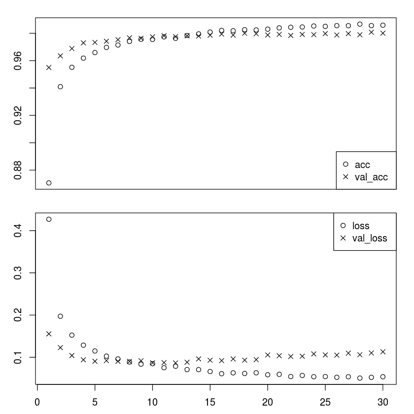
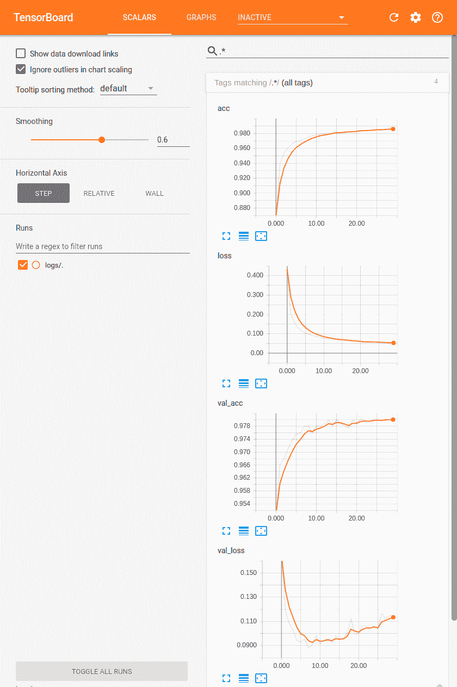
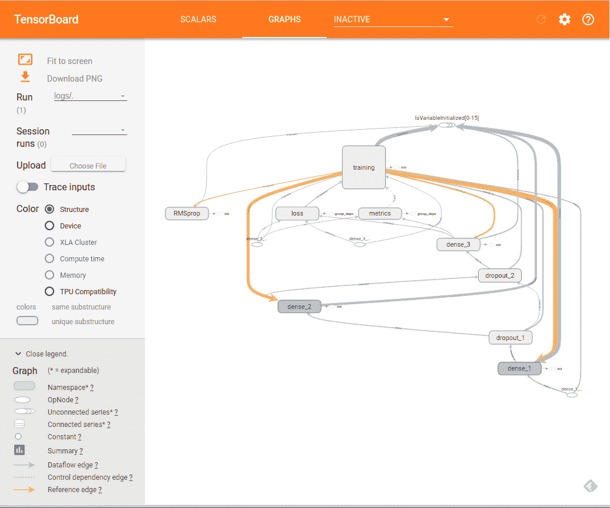

# 十七、R 中的 TensorFlow 和 Keras

R 是一个开源平台，包括用于统计计算的环境和语言。它还有一个桌面和基于 Web 的 IDE，称为 R Studio。有关 R 的更多信息，[请访问此链接](https://www.r-project.org/)。 R 通过提供以下 R 包提供对 TensorFlow 和 Keras 的支持：

*   `tensorflow`包提供对 TF 核心 API 的支持
*   `tfestimators`包提供对 TF 估计器 API 的支持
*   `keras`包提供对 Keras API 的支持
*   `tfruns`包用于 TensorBoard 风格的模型和训练课程可视化

在本章中，我们将学习如何在 R 中使用 TensorFlow，并将涵盖以下主题：

*   在 R 中安装 TensorFlow 和 Keras 软件包
*   R 中的 TF 核心 API
*   R 中的 TF 估计器 API
*   R 中的 Keras API
*   R 中的 TensorBoard
*   R 中的`tfruns`包

# 在 R 中安装 TensorFlow 和 Keras 软件包

要在 R 中安装支持 TensorFlow 和 Keras 的三个 R 软件包，请在 R 中执行以下命令。

1.  首先，安装`devtools`：

```r
install.packages("devtools")
```

1.  安装`tensorflow`和`tfestimators`包：

```r
devtools::install_github("rstudio/tensorflow")
devtools::install_github("rstudio/tfestimators")
```

1.  加载`tensorflow`库并安装所需的功能：

```r
library(tensorflow)
install_tensorflow()   
```

1.  默认情况下，安装功能会创建虚拟环境并在虚拟环境中安装`tensorflow `软件包。

有四种可用的安装方法，可以使用 method 参数指定：

| | |
| --- | --- |
| `auto` | 自动选择当前平台的默认值 |
| `virtualenv` | 安装到位于`~/.virtualenvs/r-tensorflow`的虚拟环境中 |
| `conda` | 安装到名为 r-tensorflow 的 Anaconda Python 环境中 |
| `system` | 安装到系统 Python 环境中 |

1.  默认情况下，安装功能会安装仅限 CPU 的 TensorFlow 版本。要安装 GPU 版本，请使用版本参数：

| | |
| --- | --- |
| `gpu` | 安装 tensorflow-gpu |
| `nightly` | 安装每晚仅限 CPU 的版本 |
| `nightly-gpu` | 安装每晚 GPU 构建 |
| `n.n.n` | 安装特定版本，例如 1.3.0 |
| `n.n.n-gpu` | 安装特定版本的 GPU 版本，例如 1.3.0 |

如果您希望 TensorFlow 库使用特定版本的 Python，请使用以下函数或设置`TENSORFLOW_PYTHON`环境变量：

*   `use_python('/usr/bin/python2')`
*   `use_virtualenv('~/venv')`
*   `use_condaenv('conda-env')`
*   `Sys.setenv(TENSORFLOW_PYTHON='/usr/bin/python2')`

We installed TensorFLow in R on Ubuntu 16.04 using the following command:

`install_tensorflow(version="gpu") 
`Note that the installation does not support Python 3 at the time of writing this book.

1.  安装 keras 包：

```r
devtools::install_github("rstudio/keras")
```

1.  在虚拟环境中安装 Keras：

```r
library(keras)
install_keras()
```

1.  要安装 GPU 版本，请使用：

```r
install_keras(tensorflow = "gpu")
```

1.  安装`tfruns`包：

```r
devtools::install_github("rstudio/tfruns")
```

# R 中的 TF 核心 API

我们在第 1 章中了解了 TensorFlow 核心 API。在 R 中，该 API 使用  `tensorflow` R 包实现。

作为一个例子，我们提供了 MLP 模型的演练，[用于在此链接中对来自 MNIST 数据集的手写数字进行分类](https://tensorflow.rstudio.com/tensorflow/articles/examples/mnist_softmax.html)。

您可以按照 Jupyter R 笔记本中的代码`ch-17a_TFCore_in_R`。

1.  首先，加载库：

```r
library(tensorflow)
```

1.  定义超参数：

```r
batch_size <- 128
num_classes <- 10
steps <- 1000
```

1.  准备数据：

```r
datasets <- tf$contrib$learn$datasets
mnist <- datasets$mnist$read_data_sets("MNIST-data", one_hot = TRUE)
```

数据从 TensorFlow 数据集库加载，并已标准化为[0,1]范围。

1.  定义模型：

```r
# Create the model
x <- tf$placeholder(tf$float32, shape(NULL, 784L))
W <- tf$Variable(tf$zeros(shape(784L, num_classes)))
b <- tf$Variable(tf$zeros(shape(num_classes)))
y <- tf$nn$softmax(tf$matmul(x, W) + b)

# Define loss and optimizer
y_ <- tf$placeholder(tf$float32, shape(NULL, num_classes))
cross_entropy <- tf$reduce_mean(-tf$reduce_sum(y_ * log(y), reduction_indices=1L))
train_step <- tf$train$GradientDescentOptimizer(0.5)$minimize(cross_entropy)
```

1.  训练模型：

```r
# Create session and initialize variables
sess <- tf$Session()
sess$run(tf$global_variables_initializer())

# Train
for (i in 1:steps) {
  batches <- mnist$train$next_batch(batch_size)
  batch_xs <- batches[[1]]
  batch_ys <- batches[[2]]
  sess$run(train_step,
           feed_dict = dict(x = batch_xs, y_ = batch_ys))
}
```

1.  评估模型：

```r
correct_prediction <- tf$equal(tf$argmax(y, 1L), tf$argmax(y_, 1L))
accuracy <- tf$reduce_mean(tf$cast(correct_prediction, tf$float32))
score <-sess$run(accuracy,
         feed_dict = dict(x = mnist$test$images, 
                          y_ = mnist$test$labels))

cat('Test accuracy:', score, '\n')
```

输出如下：

```r
Test accuracy: 0.9185
```

太酷了！

[通过此链接查找 R 中 TF Core 的更多示例](https://tensorflow.rstudio.com/tensorflow/articles/examples/)。

[有关`tensorflow` R 包的更多文档可以在此链接中找到](https://tensorflow.rstudio.com/tensorflow/reference/)。

# R 中的 TF 估计器 API

我们在第 2 章中了解了 TensorFlow 估计器 API。在 R 中，此 API 使用  `tfestimator` R 包实现。

例如，我们提供了 MLP 模型的演练，[用于在此链接中对来自 MNIST 数据集的手写数字进行分类](https://tensorflow.rstudio.com/tfestimators/articles/examples/mnist.html)。

您可以按照 Jupyter R 笔记本中的代码`ch-17b_TFE_Ttimator_in_R`。

1.  首先，加载库：

```r
library(tensorflow)
library(tfestimators)
```

1.  定义超参数：

```r
batch_size <- 128
n_classes <- 10
n_steps <- 100
```

1.  准备数据：

```r
# initialize data directory
data_dir <- "~/datasets/mnist"
dir.create(data_dir, recursive = TRUE, showWarnings = FALSE)

# download the MNIST data sets, and read them into R
sources <- list(
  train = list(
    x = "https://storage.googleapis.com/cvdf-datasets/mnist/train-images-idx3-ubyte.gz",
    y = "https://storage.googleapis.com/cvdf-datasets/mnist/train-labels-idx1-ubyte.gz"
  ),
  test = list(
    x = "https://storage.googleapis.com/cvdf-datasets/mnist/t10k-images-idx3-ubyte.gz",
    y = "https://storage.googleapis.com/cvdf-datasets/mnist/t10k-labels-idx1-ubyte.gz"
  )
)

# read an MNIST file (encoded in IDX format)
read_idx <- function(file) {

  # create binary connection to file
  conn <- gzfile(file, open = "rb")
  on.exit(close(conn), add = TRUE)

  # read the magic number as sequence of 4 bytes
  magic <- readBin(conn, what="raw", n=4, endian="big")
  ndims <- as.integer(magic[[4]])

  # read the dimensions (32-bit integers)
  dims <- readBin(conn,what="integer",n=ndims,endian="big")

  # read the rest in as a raw vector
  data <- readBin(conn,what="raw",n=prod(dims),endian="big")

  # convert to an integer vecto
  converted <- as.integer(data)

  # return plain vector for 1-dim array
  if (length(dims) == 1)
    return(converted)

  # wrap 3D data into matrix
  matrix(converted,nrow=dims[1],ncol=prod(dims[-1]),byrow=TRUE)
}

mnist <- rapply(sources,classes="character",how ="list",function(url) {
  # download + extract the file at the URL
  target <- file.path(data_dir, basename(url))
  if (!file.exists(target))
    download.file(url, target)

  # read the IDX file
  read_idx(target)
})

# convert training data intensities to 0-1 range
mnist$train$x <- mnist$train$x / 255
mnist$test$x <- mnist$test$x / 255
```

从下载的 gzip 文件中读取数据，然后归一化以落入[0,1]范围。

1.  定义模型：

```r
# construct a linear classifier
classifier <- linear_classifier(
  feature_columns = feature_columns(
    column_numeric("x", shape = shape(784L))
  ),
  n_classes = n_classes # 10 digits
)

# construct an input function generator
mnist_input_fn <- function(data, ...) {
  input_fn(
    data,
    response = "y",
    features = "x",
    batch_size = batch_size,
    ...
  )
}
```

1.  训练模型：

```r
train(classifier,input_fn=mnist_input_fn(mnist$train),steps=n_steps)
```

1.  评估模型：

```r
evaluate(classifier,input_fn=mnist_input_fn(mnist$test),steps=200)
```

输出如下：

```r
Evaluation completed after 79 steps but 200 steps was specified
```

| average_loss | 损失 | global_step | 准确性 |
| --- | --- | --- | --- |
| 0.35656 | 45.13418 | 100 | 0.9057 |

太酷!!

[通过此链接查找 R 中 TF 估计器的更多示例](https://tensorflow.rstudio.com/tfestimators/articles/examples/)。

[有关`tensorflow` R 包的更多文档可以在此链接中找到](https://tensorflow.rstudio.com/tfestimators/reference/)

# R 中的 Keras API

我们在第 3 章中了解了 Keras API。在 R 中，此 API 使用`keras` R 包实现。 `keras` R 软件包实现了 Keras Python 接口的大部分功能，包括顺序 API 和函数式 API。

作为示例，我们提供了 MLP 模型的演练，[用于在此链接中对来自 MNIST 数据集的手写数字进行分类](https://keras.rstudio.com/articles/examples/mnist_mlp.html)。

您可以按照 Jupyter R 笔记本中的代码`ch-17c_Keras_in_R`。

1.  首先，加载库：

```r
library(keras)
```

1.  定义超参数：

```r
batch_size <- 128
num_classes <- 10
epochs <- 30
```

1.  准备数据：

```r
# The data, shuffled and split between train and test sets
c(c(x_train, y_train), c(x_test, y_test)) %<-% dataset_mnist()

x_train <- array_reshape(x_train, c(nrow(x_train), 784))
x_test <- array_reshape(x_test, c(nrow(x_test), 784))

# Transform RGB values into [0,1] range
x_train <- x_train / 255
x_test <- x_test / 255

cat(nrow(x_train), 'train samples\n')
cat(nrow(x_test), 'test samples\n')

# Convert class vectors to binary class matrices
y_train <- to_categorical(y_train, num_classes)
y_test <- to_categorical(y_test, num_classes)
```

注释是不言自明的：数据从 Keras 数据集库加载，然后转换为 2D arrray 并归一化为[0,1]范围。

1.  定义模型：

```r
model <- keras_model_sequential()
model %>%
  layer_dense(units=256,activation='relu',input_shape=c(784)) %>%
  layer_dropout(rate = 0.4) %>%
  layer_dense(units = 128, activation = 'relu') %>%
  layer_dropout(rate = 0.3) %>%
  layer_dense(units = 10, activation = 'softmax')

summary(model)

model %>% compile(
    loss = 'categorical_crossentropy',
    optimizer = optimizer_rmsprop(),
    metrics = c('accuracy')
)
```

1.  定义和编译顺序模型。我们得到的模型定义如下：

```r
_____________________________________________________
Layer (type)               Output Shape       Param #     
=====================================================
dense_26 (Dense)           (None, 256)        200960      
_____________________________________________________
dropout_14 (Dropout)       (None, 256)        0           
_____________________________________________________
dense_27 (Dense)           (None, 128)        32896       
_____________________________________________________
dropout_15 (Dropout)       (None, 128)        0           
_____________________________________________________
dense_28 (Dense)           (None, 10)         1290        
=====================================================
Total params: 235,146
Trainable params: 235,146
Non-trainable params: 0
```

1.  训练模型：

```r
history <- model %>% fit(
    x_train, y_train,
    batch_size = batch_size,
    epochs = epochs,
    verbose = 1,
    validation_split = 0.2
)

plot(history)
```

拟合函数的输出存储在历史对象中，其包含来自训练周期的损失和度量值。绘制历史对象中的数据，结果如下：

Training and Validation Accuracy (y-axis) in Epochs (x-axis)

1.  评估模型：

```r
score <- model %>% evaluate(
    x_test, y_test,
    verbose = 0
)

# Output metrics
cat('Test loss:', score[[1]], '\n')
cat('Test accuracy:', score[[2]], '\n')
```

输出如下：

```r
Test loss: 0.1128517 
Test accuracy: 0.9816
```

太酷!!

[在此链接中查找更多关于 Keras in R 的示例](https://keras.rstudio.com/articles/examples/index.html)。

[有关 Keras R 软件包的更多文档可在此链接中找到](https://keras.rstudio.com/reference/index.html)。

# R 中的 TensorBoard

您可以按照 Jupyter R 笔记本中的代码`ch-17d_TensorBoard_in_R`。

您可以使用  `tensorboard()` 函数查看 TensorBoard，如下所示：

```r
tensorboard('logs')
```

这里，`'logs'`是应该创建 TensorBoard 日志的文件夹。

数据将显示为执行周期并记录数据。在 R 中，收集 TensorBoard 的数据取决于所使用的包：

*   如果您使用的是`tensorflow`软件包，请将`tf$summary$scalar`操作附加到图中
*   如果您使用的是`tfestimators`软件包，则 TensorBoard 数据会自动写入创建估计器时指定的`model_dir`参数
*   如果您正在使用`keras`软件包，则必须在使用`fit()`函数训练模型时包含`callback_tensorboard()`函数

我们修改了之前提供的 Keras 示例中的训练，如下所示：

```r
# Training the model --------
tensorboard("logs")

history <- model %>% fit(
    x_train, y_train,
    batch_size = batch_size,
    epochs = epochs,
    verbose = 1,
    validation_split = 0.2,
    callbacks = callback_tensorboard("logs")
)
```

当我们执行笔记本时，我们获得了训练单元的以下输出：

```r
Started TensorBoard at http://127.0.0.1:4233 
```

当我们点击链接时，我们会看到在 TensorBoard 中绘制的标量：

TensorBoad Visualization of Plots

单击 Graphs 选项卡，我们在 TensorBoard 中看到计算图：



TensorBoard 计算图的可视化有关 R 中 TensorBoard 的更多文档，[请访问此链接](https://tensorflow.rstudio.com/tools/tensorboard.html)。

# R 中的 tfruns 包

您可以按照 Jupyter R 笔记本中的代码`ch-17d_TensorBoard_in_R`。

`tfruns` 软件包是 R 中提供的非常有用的工具，有助于跟踪多次运行以训练模型。对于使用 `keras` `tfestimators` 软件包在 R 中构建的模型， `tfruns` 软件包自动捕获运行数据。使用 `tfruns` 非常简单易行。只需在 R 文件中创建代码，然后使用 `training_run()` 函数执行该文件。例如，如果你有一个 `mnist_model.R ` 文件 ，那么在交互式 R 控制台中使用 `training_run()` 函数执行它，如下所示：

```r
library(tfruns)
training_run('mnist_model.R')
```

训练完成后，将自动显示显示运行摘要的窗口。我们从[`tfruns` GitHub 仓库](https://github.com/rstudio/tfruns/blob/master/inst/examples/mnist_mlp/mnist_mlp)获得的[`mnist_mlp.R`](https://github.com/rstudio/tfruns/blob/master/inst/examples/mnist_mlp/mnist_mlp.R)窗口中获得以下输出。

tfruns visualization of the model run

在“查看器”窗口中，输出选项卡包含以下图：

tfruns visualization of the accuracy and loss values

`tfruns`软件包将一个插件安装到 RStudio，也可以从`Addins`菜单选项访问。该软件包还允许您比较多个运行并将运行报告发布到 RPub 或 RStudio Connect。您还可以选择在本地保存报告。

有关 R 中`tfruns`包的更多文档，请访问以下链接：

<https://tensorflow.rstudio.com/tools/tfruns/reference/>

<https://tensorflow.rstudio.com/tools/tfruns/articles/overview.html>.

# 总结

在本章中，我们学习了如何在 R 中使用 TensorFlow Core，TensorFlow Estimators 和 Keras 包来构建和训练机器学习模型。我们提供了来自 RStudio 的 MNIST 示例的演练，并提供了有关 TensorFlow 和 Keras R 软件包的进一步文档的链接。我们还学习了如何使用 R 中的可视化工具 TensorBoard。我们还介绍了一个来自 R Studio 的新工具`tfruns`，它允许您为多次运行创建报告，分析和比较它们，并在本地保存或发布它们。

直接在 R 中工作的能力很有用，因为大量的生产数据科学和机器学习代码是使用 R 编写的，现在您可以将 TensorFlow 集成到相同的代码库中并在 R 环境中运行它。

在下一章中，我们将学习一些用于调试构建和训练 TensorFlow 模型的代码的技术。

