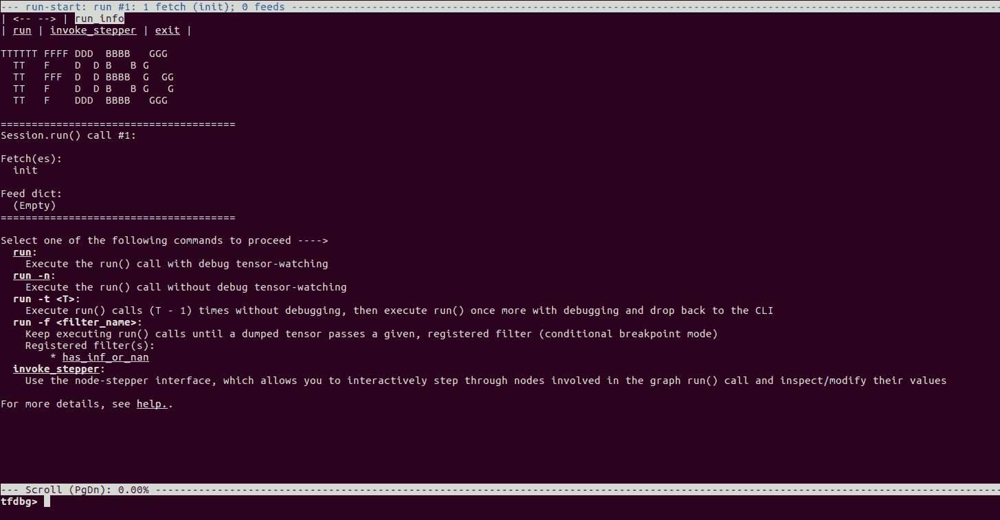
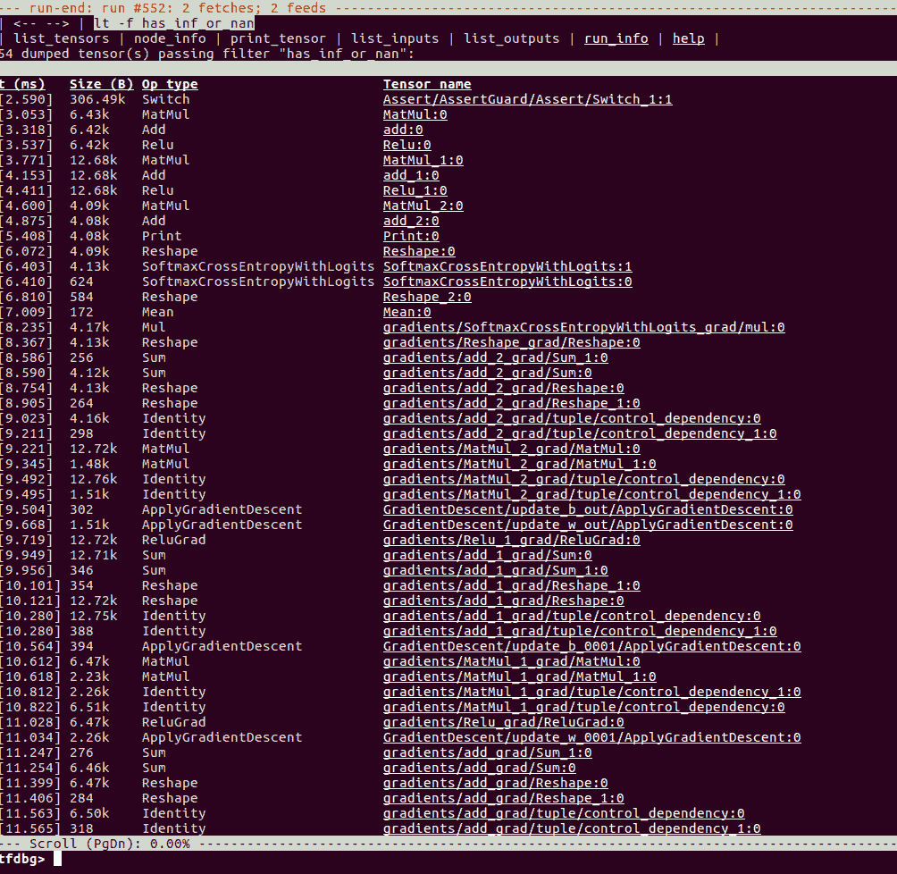

# 十八、调试 TensorFlow 模型

正如我们在本书中所学到的，TensorFlow 程序用于构建和训练可用于各种任务预测的模型。在训练模型时，您可以构建计算图，运行图以进行训练，并评估图以进行预测。重复这些任务，直到您对模型的质量感到满意为止，然后将图与学习的参数一起保存。在生产中，图是从文件构建或恢复的，并使用参数填充。

构建深度学习模型是一项复杂的技术，TensorFlow API 及其生态系统同样复杂。当我们在 TensorFlow 中构建和训练模型时，有时我们会得到不同类型的错误，或者模型不能按预期工作。例如，您经常看到自己陷入以下一种或多种情况：

*   在损失和指标输出中得到了 NaN
*   即使经过多次迭代，损失或其他指标也没有改善

在这种情况下，我们需要调试使用 TensorFlow API 编写的代码。

要修复代码以使其正常工作，可以使用调试器或平台提供的其他方法和工具，例如 Python 中的 Python 调试器（`pdb`）和 Linux OS 中的 GNU 调试器（`gdb`）。当出现问题时，TensorFlow API 还提供一些额外的支持来修复代码。

在本章中，我们将学习 TensorFlow 中可用的其他工具和技术，以帮助调试：

*   使用`tf.Session.run()`获取张量值
*   使用`tf.Print()`打印张量值
*   用`tf.Assert()`断言条件
*   使用 TensorFlow 调试器进行调试（`tfdbg`）

# 使用`tf.Session.run()`获取张量值

您可以使用`tf.Session.run()`获取要打印的张量值。这些值作为 NumPy 数组返回，可以使用 Python 语句打印或记录。这是最简单和最简单的方法，最大的缺点是计算图执行所有相关路径，从获取的张量开始，如果这些路径包括训练操作，那么它前进一步或一个周期。

因此，大多数情况下你不会调用`tf.Session.run()`来获取图中间的张量，但你会执行整个图并获取所有张量，你需要调试的那些张量以及你不需要的张量调试。

函数`tf.Session.partial_run()`也适用于您可能想要执行图的一部分的情况，但它是一个高度实验性的 API，尚未准备好用于生产。

# 使用`tf.Print()`打印张量值

为调试目的打印值的另一个选项是使用`tf.Print()`。当执行包含`tf.Print()`节点的路径时，您可以在`tf.Print()`中包含张量以在标准错误控制台中打印其值。`tf.Print()`函数具有以下签名：

```py
tf.Print(
     input_,
     data,
     message=None,
     first_n=None,
     summarize=None,
     name=None
    )
```

该函数的参数如下：

*   `input_`是一个从函数返回的张量，没有任何操作
*   `data`是要打印的张量列表
*   `message`是一个字符串，它作为打印输出的前缀打印出来
*   `first_n`表示打印输出的步骤数；如果此值为负，则只要执行路径，就始终打印该值
*   `summarize`表示从张量打印的元素数量；默认情况下，仅打印三个元素

您可以按照 Jupyter 笔记本中的代码`ch-18_TensorFlow_Debugging`。

让我们修改之前创建的 MNIST MLP 模型来添加`print`语句：

```py
model = tf.Print(input_=model,
                 data=[tf.argmax(model,1)],
                 message='y_hat=',
                 summarize=10,
                 first_n=5
  )
```

当我们运行代码时，我们在 Jupyter 的控制台中获得以下内容：

```py
I tensorflow/core/kernels/logging_ops.cc:79] y_hat=[0 0 0 7 0 0 0 0 0 0...]
I tensorflow/core/kernels/logging_ops.cc:79] y_hat=[0 7 7 1 8 7 2 7 7 0...]
I tensorflow/core/kernels/logging_ops.cc:79] y_hat=[4 8 0 6 1 8 1 0 7 0...]
I tensorflow/core/kernels/logging_ops.cc:79] y_hat=[0 0 1 0 0 0 0 5 7 5...]
I tensorflow/core/kernels/logging_ops.cc:79] y_hat=[9 2 2 8 8 6 6 1 7 7...]
```

使用`tf.Print()`的唯一缺点是该函数提供了有限的格式化功能。

# `tf.Assert()`

调试 TensorFlow 模型的另一种方法是插入条件断言。`tf.Assert()`函数需要一个条件，如果条件为假，则打印给定张量的列表并抛出`tf.errors.InvalidArgumentError`。

1.  `tf.Assert()`函数具有以下特征：

```py
tf.Assert(
    condition,
    data,
    summarize=None,
    name=None
)
```

1.  断言操作不会像`tf.Print()`函数那样落入图的路径中。为了确保`tf.Assert()`操作得到执行，我们需要将它添加到依赖项中。例如，让我们定义一个断言来检查所有输入是否为正：

```py
assert_op = tf.Assert(tf.reduce_all(tf.greater_equal(x,0)),[x])
```

1.  在定义模型时将`assert_op`添加到依赖项，如下所示：

```py
with tf.control_dependencies([assert_op]):
    # x is input layer
  layer = x
    # add hidden layers
  for i in range(num_layers):
        layer = tf.nn.relu(tf.matmul(layer, w[i]) + b[i])
    # add output layer
  layer = tf.matmul(layer, w[num_layers]) + b[num_layers]
```

1.  为了测试这段代码，我们在第 5 周期之后引入了一个杂质，如下：

```py
if epoch > 5:
    X_batch = np.copy(X_batch)
    X_batch[0,0]=-2
```

1.  代码运行正常五个周期，然后抛出错误：

```py
epoch: 0000 loss = 6.975991
epoch: 0001 loss = 2.246228
epoch: 0002 loss = 1.924571
epoch: 0003 loss = 1.745509
epoch: 0004 loss = 1.616791
epoch: 0005 loss = 1.520804

-----------------------------------------------------------------
InvalidArgumentError           Traceback (most recent call last)
...
InvalidArgumentError: assertion failed: [[-2 0 0]...]
...
```

除了`tf.Assert()`函数，它可以采用任何有效的条件表达式，TensorFlow 提供以下断言操作，检查特定条件并具有简单的语法：

*   `assert_equal`
*   `assert_greater`
*   `assert_greater_equal`
*   `assert_integer`
*   `assert_less`
*   `assert_less_equal`
*   `assert_negative`
*   `assert_none_equal`
*   `assert_non_negative`
*   `assert_non_positive`
*   `assert_positive`
*   `assert_proper_iterable`
*   `assert_rank`
*   `assert_rank_at_least`
*   `assert_rank_in`
*   `assert_same_float_dtype`
*   `assert_scalar`
*   `assert_type`
*   `assert_variables_initialized`

作为示例，前面提到的示例断言操作也可以写成如下：

```py
assert_op = tf.assert_greater_equal(x,0)
```

# 使用 TensorFlow 调试器（`tfdbg`）的调试

TensorFlow 调试器（`tfdbg`）与其他常用调试器（如`pdb`和`gdb`）的工作方式相同。要使用调试器，该过程通常如下：

1.  在代码中的断点处设置要中断的位置并检查变量
2.  在调试模式下运行代码
3.  当代码在断点处中断时，检查它然后继续下一步

一些调试器还允许您在代码执行时以交互方式观察变量，而不仅仅是在断点处：

1.  为了使用`tfdbg`，首先导入所需的模块并将会话包装在调试器包装器中：

```py
from tensorflow.python import debug as tfd

with tfd.LocalCLIDebugWrapperSession(tf.Session()) as tfs:
```

1.  接下来，将过滤器附加到会话对象。附加过滤器与在其他调试器中设置断点相同。例如，以下代码附加`tfdbg.has_inf_or_nan`过滤器，如果任何中间张量具有`nan`或`inf`值，则会中断：

```py
tfs.add_tensor_filter('has_inf_or_nan_filter', tfd.has_inf_or_nan)
```

1.  现在，当代码执行`tfs.run()`时，调试器将在控制台中启动调试器接口，您可以在其中运行各种调试器命令来监视张量值。
2.  我们提供了在`ch-18_mnist_tfdbg.py`文件中试用`tfdbg`的代码。当我们用`python3`执行代码文件时，我们看到`tfdbg`控制台：

```py
python3 ch-18_mnist_tfdbg.py
```



1.  在`tfdbg>`提示符下输入命令`run -f has_inf_or_nan`。代码在第一个周期后中断，因为我们使用`np.inf`值填充数据：



1.  现在您可以使用`tfdbg`控制台或可点击界面来检查各种张量的值。例如，我们查看其中一个梯度的值：


[您可以在此链接中找到有关使用`tfdbg`控制台和检查变量的更多信息](https://www.tensorflow.org/programmers_guide/debugger)。

# 总结

在本章中，我们学习了如何在 TensorFlow 中调试用于构建和训练模型的代码。我们了解到我们可以使用`tf.Session.run()`将张量作为 NumPy 数组获取。我们还可以通过在计算图中添加`tf.Print()`操作来打印张量值。我们还学习了，在使用`tf.Assert()`和其他`tf.assert_*`操作执行期间，某些条件无法保持时如何引发错误。我们通过对 TensorFlow 调试器（`tfdbg`）的介绍结束本章，用于设置断点和观察张量值，就像我们在 Python 调试器（`pdb`）或 GNU 调试器（`gdb`中调试代码一样） ）。

本章将我们的旅程带入一个新的里程碑。我们不希望旅程在此结束，但我们相信旅程刚刚开始，您将进一步扩展和应用本书中获得的知识和技能。

我们非常期待听到您的经验，反馈和建议。

