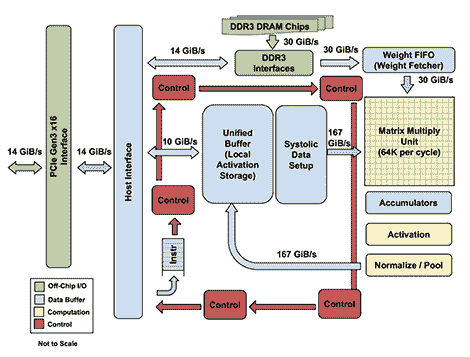
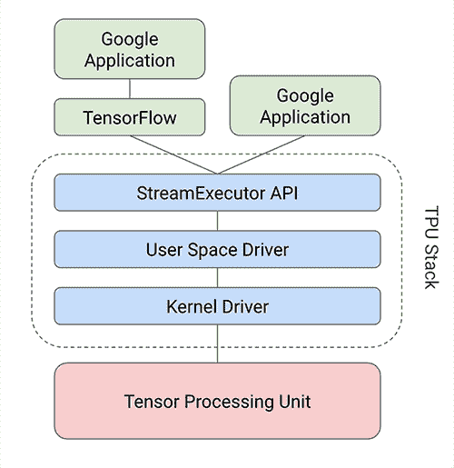

# 十九、张量处理单元

**张量处理单元**（ **TPU** ）是**专用集成电路**（ **ASIC** ），它实现了针对计算要求而优化的硬件电路深度神经网络。 TPU 基于**复杂指令集计算机**（ **CISC** ）指令集，该指令集实现用于训练深度神经网络的复杂任务的高级指令。 TPU 架构的核心在于优化矩阵运算的脉动数组。

The Architecture of TPUImage from: https://cloud.google.com/blog/big-data/2017/05/images/149454602921110/tpu-15.png

TensorFlow 提供了一个编译器和软件堆栈，可将 API 调用从 TensorFlow 图转换为 TPU 指令。以下框图描述了在 TPU 堆栈顶部运行的 TensorFlow 模型的体系结构：

Image from: https://cloud.google.com/blog/big-data/2017/05/images/149454602921110/tpu-2.pngFor more information on the TPU architecture, read the blog at the following link: [https://cloud.google.com/blog/big-data/2017/05/an-in-depth-look-at-googles-first-tensor-processing-unit-tpu.](https://cloud.google.com/blog/big-data/2017/05/an-in-depth-look-at-googles-first-tensor-processing-unit-tpu)

TPU 的 TensorFlow API 位于`tf.contrib.tpu`模块中。为了在 TPU 上构建模型，使用以下三个 TPU 特定的 TensorFlow 模块：

*   `tpu_config`：`tpu_config`模块允许您创建配置对象，其中包含有关将运行模型的主机的信息。
*   `tpu_estimator`：`tpu_estimator`模块将估计器封装在[H​​TG2]类中。要在 TPU 上运行估计器，我们创建此类的对象。
*   `tpu_optimizer`：`tpu_optimizer`模块包装优化器。例如，在下面的示例代码中，我们将`tpu_optimizer`类中的 SGD 优化器包装在`tpu_optimizer`类中。

例如，以下代码使用 TF Estimator API 为 TPU 上的 MNIST 数据集构建 CNN 模型：

以下代码改编自 [https://github.com/tensorflow/tpu-demos/blob/master/cloud_tpu/models/mnist/mnist.py.](https://github.com/tensorflow/tpu-demos/blob/master/cloud_tpu/models/mnist/mnist.py)

```py
import tensorflow as tf

from tensorflow.contrib.tpu.python.tpu import tpu_config
from tensorflow.contrib.tpu.python.tpu import tpu_estimator
from tensorflow.contrib.tpu.python.tpu import tpu_optimizer

learning_rate = 0.01
batch_size = 128

def metric_fn(labels, logits):
    predictions = tf.argmax(logits, 1)
    return {
        "accuracy": tf.metrics.precision(
            labels=labels, predictions=predictions),
    }

def model_fn(features, labels, mode):
    if mode == tf.estimator.ModeKeys.PREDICT:
        raise RuntimeError("mode {} is not supported yet".format(mode))

    input_layer = tf.reshape(features, [-1, 28, 28, 1])
    conv1 = tf.layers.conv2d(
        inputs=input_layer,
        filters=32,
        kernel_size=[5, 5],
        padding="same",
        activation=tf.nn.relu)
    pool1 = tf.layers.max_pooling2d(inputs=conv1, pool_size=[2, 2], 
                                    strides=2)
    conv2 = tf.layers.conv2d(
        inputs=pool1,
        filters=64,
        kernel_size=[5, 5],
        padding="same",
        activation=tf.nn.relu)
    pool2 = tf.layers.max_pooling2d(inputs=conv2, pool_size=[2, 2], 
                                    strides=2)
    pool2_flat = tf.reshape(pool2, [-1, 7 * 7 * 64])
    dense = tf.layers.dense(inputs=pool2_flat, units=128, 
                            activation=tf.nn.relu)
    dropout = tf.layers.dropout(
        inputs=dense, rate=0.4, 
        training=mode == tf.estimator.ModeKeys.TRAIN)
    logits = tf.layers.dense(inputs=dropout, units=10)
    onehot_labels = tf.one_hot(indices=tf.cast(labels, tf.int32), depth=10)

    loss = tf.losses.softmax_cross_entropy(
        onehot_labels=onehot_labels, logits=logits)

    if mode == tf.estimator.ModeKeys.EVAL:
        return tpu_estimator.TPUEstimatorSpec(
            mode=mode,
            loss=loss,
            eval_metrics=(metric_fn, [labels, logits]))

    # Train.
  decaying_learning_rate = tf.train.exponential_decay(learning_rate,
                                               tf.train.get_global_step(),
                                               100000,0.96)

    optimizer = tpu_optimizer.CrossShardOptimizer(
            tf.train.GradientDescentOptimizer(
                learning_rate=decaying_learning_rate))

    train_op = optimizer.minimize(loss, 
            global_step=tf.train.get_global_step())
    return tpu_estimator.TPUEstimatorSpec(mode=mode, 
            loss=loss, train_op=train_op)

def get_input_fn(filename):
    def input_fn(params):
        batch_size = params["batch_size"]

        def parser(serialized_example):
            features = tf.parse_single_example(
                serialized_example,
                features={
                    "image_raw": tf.FixedLenFeature([], tf.string),
                    "label": tf.FixedLenFeature([], tf.int64),
                })
            image = tf.decode_raw(features["image_raw"], tf.uint8)
            image.set_shape([28 * 28])
            image = tf.cast(image, tf.float32) * (1\. / 255) - 0.5
  label = tf.cast(features["label"], tf.int32)
            return image, label

        dataset = tf.data.TFRecordDataset(
            filename, buffer_size=FLAGS.dataset_reader_buffer_size)
        dataset = dataset.map(parser).cache().repeat()
        dataset = dataset.apply(
            tf.contrib.data.batch_and_drop_remainder(batch_size))
        images, labels = dataset.make_one_shot_iterator().get_next()
        return images, labels
    return input_fn

# TPU config

master = 'local' #URL of the TPU instance
model_dir = '/home/armando/models/mnist'
n_iterations = 50 # number of iterations per TPU training loop
n_shards = 8 # number of TPU chips

run_config = tpu_config.RunConfig(
        master=master,
        evaluation_master=master,
        model_dir=model_dir,
        session_config=tf.ConfigProto(
            allow_soft_placement=True,
            log_device_placement=True
  ),
        tpu_config=tpu_config.TPUConfig(n_iterations,
                                        n_shards
        )
    )

estimator = tpu_estimator.TPUEstimator(
    model_fn=model_fn,
    use_tpu=True,
    train_batch_size=batch_size,
    eval_batch_size=batch_size,
    config=run_config)

train_file = '/home/armando/datasets/mnist/train' # input data file
train_steps = 1000 # number of steps to train for

estimator.train(input_fn=get_input_fn(train_file),
                max_steps=train_steps
                )

eval_file = '/home/armando/datasets/mnist/test' # test data file
eval_steps = 10

estimator.evaluate(input_fn=get_input_fn(eval_file),
                   steps=eval_steps
                   )
```

有关在 TPU 上构建模型的更多示例，[请访问此链接](https://github.com/tensorflow/tpu-demos)。

