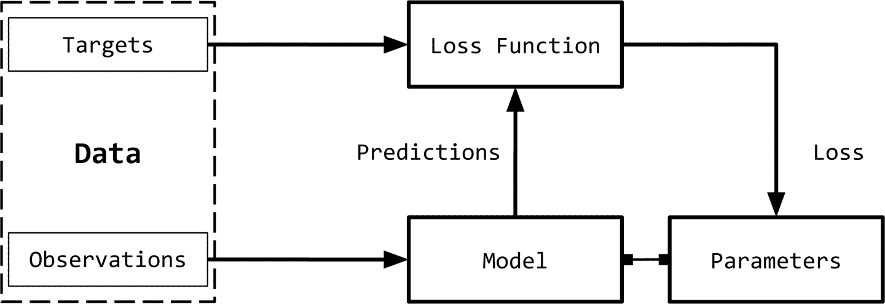
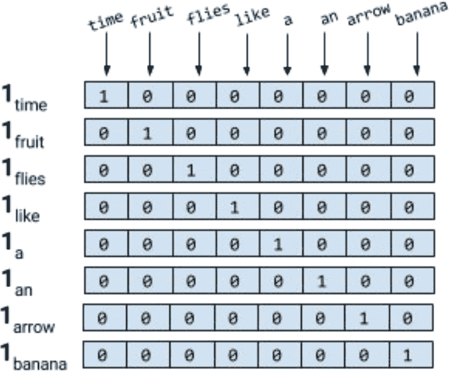
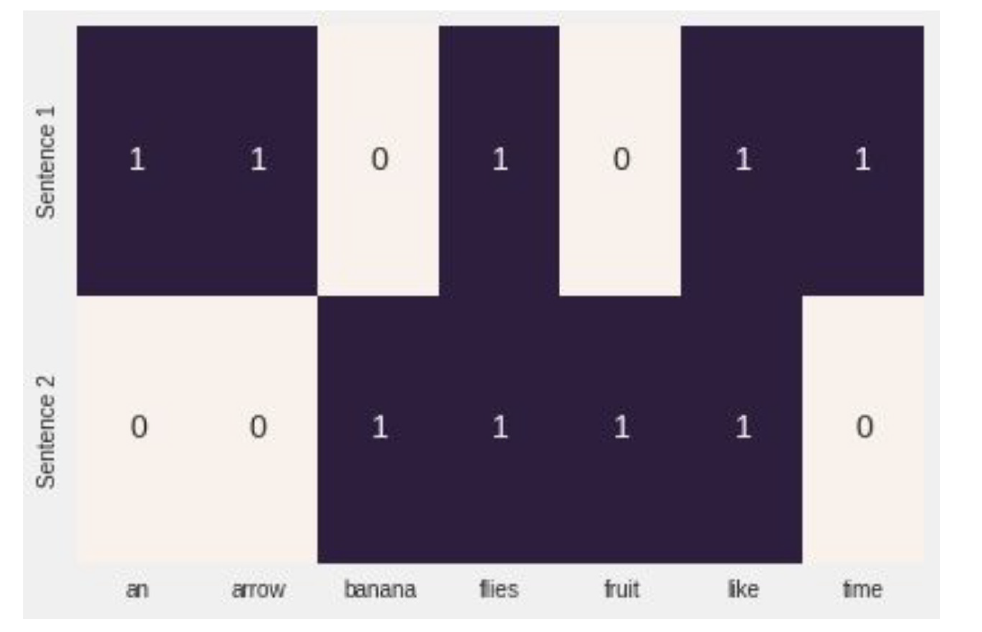
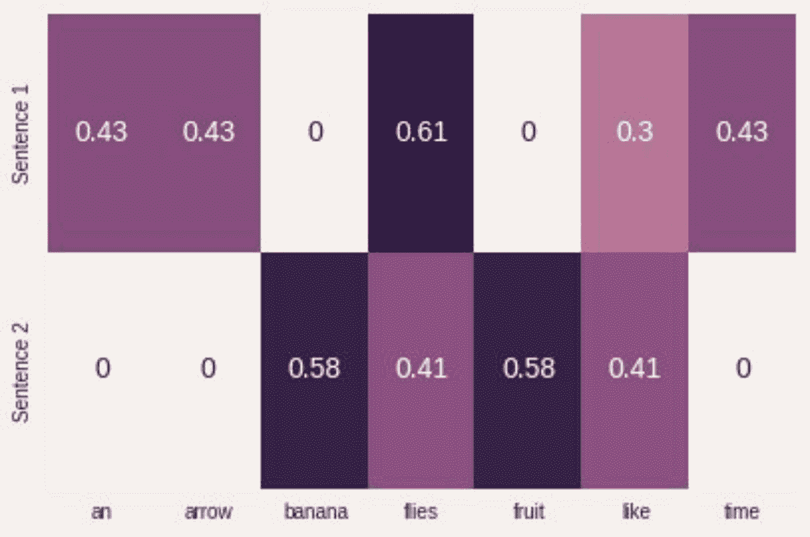
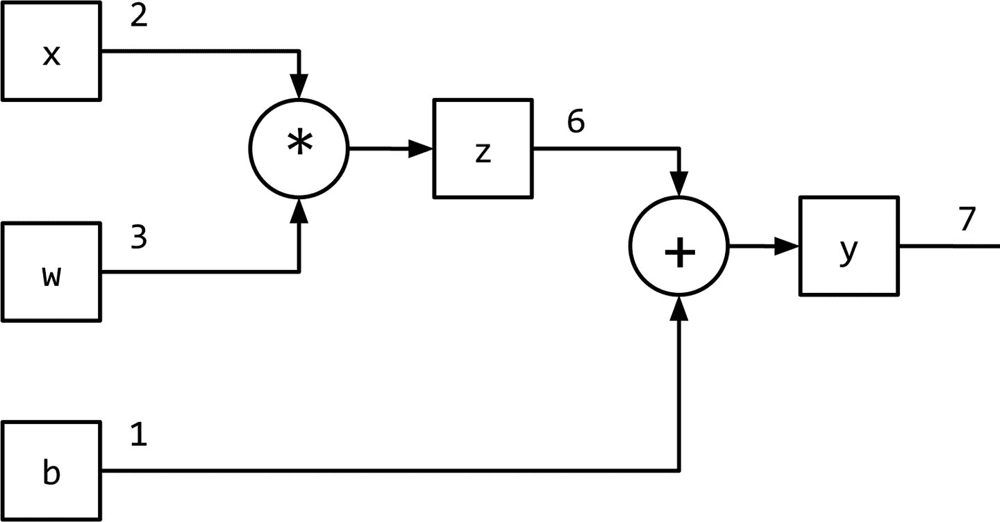

# 一、基础介绍

> 本文标题：[Natural-Language-Processing-with-PyTorch（一）](https://yifdu.github.io/2018/12/17/Natural-Language-Processing-with-PyTorch%EF%BC%88%E4%B8%80%EF%BC%89/)
> 
> 文章作者：[Yif Du](https://yifdu.github.io/ "访问 Yif Du 的个人博客")
> 
> 发布时间：2018 年 12 月 17 日 - 09:12
> 
> 最后更新：2019 年 02 月 16 日 - 21:02
> 
> 原始链接：[http://yifdu.github.io/2018/12/17/Natural-Language-Processing-with-PyTorch（一）/](https://yifdu.github.io/2018/12/17/Natural-Language-Processing-with-PyTorch%EF%BC%88%E4%B8%80%EF%BC%89/)
> 
> 许可协议：[署名-非商业性使用-禁止演绎 4.0 国际](https://creativecommons.org/licenses/by-nc-nd/4.0/)  转载请保留原文链接及作者。

像 Echo (Alexa）、Siri 和谷歌翻译这样的家喻户晓的产品名称至少有一个共同点。它们都是自然语言处理（NLP）应用的产物，NLP 是本书的两个主要主题之一。NLP 是一套运用统计方法的技术，无论是否有语言学的洞见，为了解决现实世界的任务而理解文本。这种对文本的“理解”主要是通过将文本转换为可用的计算表示，这些计算表示是离散或连续的组合结构，如向量或张量、图形和树。

从数据（本例中为文本）中学习适合于任务的表示形式是机器学习的主题。应用机器学习的文本数据有超过三十年的历史,但最近（2008 年至 2010 年开始) [1] 一组机器学习技术,被称为深度学习,继续发展和证明非常有效的各种人工智能（AI）在 NLP 中的任务,演讲,和计算机视觉。深度学习是我们要讲的另一个主题;因此，本书是关于 NLP 和深度学习的研究。

简单地说，深度学习使人们能够使用一种称为计算图和数字优化技术的抽象概念有效地从数据中学习表示。这就是深度学习和计算图的成功之处，像谷歌、Facebook 和 Amazon 这样的大型技术公司已经发布了基于它们的计算图形框架和库的实现，以捕捉研究人员和工程师的思维。在本书中，我们考虑 PyTorch，一个越来越流行的基于 python 的计算图框架库来实现深度学习算法。在本章中，我们将解释什么是计算图，以及我们选择使用 PyTorch 作为框架。机器学习和深度学习的领域是广阔的。在这一章，在本书的大部分时间里，我们主要考虑的是所谓的监督学习;也就是说，使用标记的训练示例进行学习。我们解释了监督学习范式，这将成为本书的基础。如果到目前为止您还不熟悉其中的许多术语，那么您是对的。这一章，以及未来的章节，不仅澄清了这一点，而且深入研究了它们。如果您已经熟悉这里提到的一些术语和概念，我们仍然鼓励您遵循以下两个原因:为本书其余部分建立一个共享的词汇表，以及填补理解未来章节所需的任何空白。

本章的目标是:

*   发展对监督学习范式的清晰理解，理解术语，并发展一个概念框架来处理未来章节的学习任务
*   学习如何为学习任务的输入编码
*   理解什么是计算图
*   掌握 PyTorch 的基本知识

让我们开始吧！

## 监督学习范式

机器学习中的监督，或者简单的监督学习，是指将目标（被预测的内容）的真实情况用于观察（输入）的情况。例如，在文档分类中，目标是一个分类标签，观察（输入）是一个文档。例如，在机器翻译中，观察（输入）是一种语言的句子，目标是另一种语言的句子。通过对输入数据的理解，我们在图 1-1 中演示了监督学习范式。 



我们可以将监督学习范式分解为六个主要概念，如图 1-1 所示: 观察： 观察是我们想要预测的东西。我们用`x`表示观察值。我们有时把观察值称为“输入”。 目标: 目标是与观察相对应的标签。它通常是被预言的事情。按照机器学习/深度学习中的标准符号，我们用`y`表示这些。有时，这被称为真实情况。 模型: 模型是一个数学表达式或函数，它接受一个观察值`x`，并预测其目标标签的值。 参数: 有时也称为权重，这些参数化模型。标准使用的符号`w`（权重）或`w_hat`。 预测: 预测，也称为估计，是模型在给定观测值的情况下所猜测目标的值。我们用一个`hat`表示这些。所以,目标`y`的预测用`y_hat`来表示。 损失函数: 损失函数是比较预测与训练数据中观测目标之间的距离的函数。给定一个目标及其预测，损失函数将分配一个称为损失的标量实值。损失值越低，模型对目标的预测效果越好。我们用`L`表示损失函数。

虽然在 NLP /深度学习建模或编写本书时，这在数学上并不是正式有效，但我们将正式重述监督学习范例，以便为该领域的新读者提供标准术语，以便他们拥有熟悉 arXiv 研究论文中的符号和写作风格。

考虑一个数据集`D={X[i],y[i]}, i=1..n`，有`n`个例子。给定这个数据集，我们想要学习一个由权值`w`参数化的函数（模型)`f`，也就是说，我们对`f`的结构做一个假设，给定这个结构，权值`w`的学习值将充分表征模型。对于一个给定的输入`X`,模型预测`y_hat`作为目标: `y_hat = f(X;W)`在监督学习中，对于训练例子，我们知道观察的真正目标`y`。这个实例的损失将为`L(y, y_hat)`。然后，监督学习就变成了一个寻找最优参数/权值`w`的过程，从而使所有`n`个例子的累积损失最小化。

* * *

利用（随机）梯度下降法进行训练 监督学习的目标是为给定的数据集选择参数值，使损失函数最小化。换句话说，这等价于在方程中求根。我们知道梯度下降法是一种常见的求方程根的方法。回忆一下，在传统的梯度下降法中，我们对根（参数）的一些初值进行猜测，并迭代更新这些参数，直到目标函数（损失函数）的计算值低于可接受阈值（即收敛准则）。对于大型数据集，由于内存限制，在整个数据集上实现传统的梯度下降通常是不可能的，而且由于计算开销，速度非常慢。相反，通常采用一种近似的梯度下降称为随机梯度下降（SGD）。在随机情况下，数据点或数据点的子集是随机选择的，并计算该子集的梯度。当使用单个数据点时，这种方法称为纯 SGD，当使用（多个）数据点的子集时，我们将其称为小型批量 SGD。通常情况下，“纯”和“小型批量”这两个词在根据上下文变得清晰时就会被删除。在实际应用中，很少使用纯 SGD，因为它会由于有噪声的更新而导致非常慢的收敛。一般 SGD 算法有不同的变体，都是为了更快的收敛。在后面的章节中，我们将探讨这些变体中的一些，以及如何使用渐变来更新参数。这种迭代更新参数的过程称为反向传播。反向传播的每个步骤（又名周期）由向前传递和向后传递组成。向前传递用参数的当前值计算输入并计算损失函数。反向传递使用损失梯度更新参数。

* * *

请注意，到目前为止，这里没有什么是专门针对深度学习或神经网络的。图 1-1 中箭头的方向表示训练系统时数据的“流”。关于训练和“计算图”中“流”的概念，我们还有更多要说的，但首先，让我们看看如何用数字表示 NLP 问题中的输入和目标，这样我们就可以训练模型并预测结果。

## 观测和目标编码

我们需要用数字表示观测值（文本），以便与机器学习算法一起使用。图 1-2 给出了一个可视化的描述。 


表示文本的一种简单方法是用数字向量表示。有无数种方法可以执行这种映射/表示。事实上，本书的大部分内容都致力于从数据中学习此类任务表示。然而，我们从基于启发式的一些简单的基于计数的表示开始。虽然简单，但是它们非常强大，或者可以作为更丰富的表示学习的起点。所有这些基于计数的表示都是从一个固定维数的向量开始的。

### 单热表示

顾名思义，单热表示从一个零向量开始，如果单词出现在句子或文档中，则将向量中的相应条目设置为 1。考虑下面两句话。

```py
Time flies like an arrow.
Fruit flies like a banana.

```

对句子进行标记，忽略标点符号，并将所有的单词都用小写字母表示，就会得到一个大小为 8 的词汇表:`{time, fruit, flies, like, a, an, arrow, banana}`。所以，我们可以用一个八维的单热向量来表示每个单词。在本书中，我们使用`1[w]`表示标记/单词`w`的单热表示。

对于短语、句子或文档，压缩的单热表示仅仅是其组成词的逻辑或的单热表示。使用图 1-3 所示的编码，短语`like a banana`的单热表示将是一个`3×8`矩阵，其中的列是 8 维的单热向量。通常还会看到“折叠”或二进制编码，其中文本/短语由词汇表长度的向量表示，用 0 和 1 表示单词的缺失或存在。`like a banana`的二进制编码是:`[0,0,0,1,1,0,0,1]`。



* * *

注意：在这一点上，如果你觉得我们把`flies`的两种不同的意思（或感觉）搞混了，恭喜你，聪明的读者!语言充满了歧义，但是我们仍然可以通过极其简化的假设来构建有用的解决方案。学习特定于意义的表示是可能的，但是我们现在做得有些超前了。

* * *

尽管对于本书中的输入，我们很少使用除了单热表示之外的其他表示，但是由于 NLP 中受欢迎、历史原因和完成目的，我们现在介绍术语频率（TF）和术语频率反转文档频率（TF-idf）表示。这些表示在信息检索（IR）中有着悠久的历史，甚至在今天的生产 NLP 系统中也得到了广泛的应用。（翻译有不足)

### TF 表示

短语、句子或文档的 TF 表示仅仅是构成词的单热的总和。为了继续我们愚蠢的示例，使用前面提到的单热编码，`Fruit flies like time flies a fruit`这句话具有以下 TF 表示:[1,2,2,1,1,1,0,0]。注意，每个条目是句子（语料库）中出现相应单词的次数的计数。我们用 TF(w）表示一个单词的 TF。

示例 1-1：使用 sklearn 生成“塌陷的”单热或二进制表示

```py
from sklearn.feature_extraction.text import CountVectorizer
import seaborn as sns

corpus = ['Time flies flies like an arrow.',
          'Fruit flies like a banana.']
one_hot_vectorizer = CountVectorizer(binary=True)
one_hot = one_hot_vectorizer.fit_transform(corpus).toarray()
sns.heatmap(one_hot, annot=True,
            cbar=False, xticklabels=vocab,
            yticklabels=['Sentence 1', 'Sentence 2'])

```



折叠的单热是一个向量中有多个 1 的单热

### TF-IDF 表示

考虑一组专利文件。您可能希望它们中的大多数都有诸如`claim`、`system`、`method`、`procedure`等单词，并且经常重复多次。TF 表示对更频繁的单词进行加权。然而，像`claim`这样的常用词并不能增加我们对具体专利的理解。相反，如果`tetrafluoroethylene`这样罕见的词出现的频率较低，但很可能表明专利文件的性质，我们希望在我们的表述中赋予它更大的权重。反文档频率（IDF）是一种启发式算法，可以精确地做到这一点。

**IDF 表示惩罚常见的符号，并奖励向量表示中的罕见符号。** 符号`w`的`IDF(w)`对语料库的定义为

其中`n[w]`是包含单词`w`的文档数量，`N`是文档总数。TF-IDF 分数就是`TF(w) * IDF(w)`的乘积。首先，请注意在所有文档（例如，`n[w] = N`）， `IDF(w)`为 0, TF-IDF 得分为 0，完全惩罚了这一项。其次，如果一个术语很少出现（可能只出现在一个文档中），那么 IDF 就是`log n`的最大值。

示例 1-2：使用 sklearn 生产 TF-IDF 表示

```py
from sklearn.feature_extraction.text import TfidfVectorizer
import seaborn as sns

tfidf_vectorizer = TfidfVectorizer()
tfidf = tfidf_vectorizer.fit_transform(corpus).toarray()
sns.heatmap(tfidf, annot=True, cbar=False, xticklabels=vocab,
            yticklabels= ['Sentence 1', 'Sentence 2'])

```



在深度学习中，很少看到使用像 TF-IDF 这样的启发式表示对输入进行编码，因为目标是学习一种表示。通常，我们从一个使用整数索引的单热编码和一个特殊的“嵌入查找”层开始构建神经网络的输入。在后面的章节中，我们将给出几个这样做的例子。

### 目标编码

正如“监督学习范式”所指出的，目标变量的确切性质取决于所解决的 NLP 任务。例如，在机器翻译、摘要和回答问题的情况下，目标也是文本，并使用前面描述的单热编码方法进行编码。

许多 NLP 任务实际上使用分类标签，其中模型必须预测一组固定标签中的一个。对此进行编码的一种常见方法是对每个标签使用惟一索引。当输出标签的数量太大时，这种简单的表示可能会出现问题。这方面的一个例子是语言建模问题，在这个问题中，任务是预测下一个单词，给定过去看到的单词。标签空间是一种语言的全部词汇，它可以很容易地增长到几十万，包括特殊字符、名称等等。我们将在后面的章节中重新讨论这个问题以及如何解决这个问题。

一些 NLP 问题涉及从给定文本中预测一个数值。例如，给定一篇英语文章，我们可能需要分配一个数字评分或可读性评分。给定一个餐馆评论片段，我们可能需要预测直到小数点后第一位的星级。给定用户的推文，我们可能需要预测用户的年龄群。有几种方法可以对数字目标进行编码，但是将目标简单地绑定到分类“容器”中（例如，“0-18”、“19-25”、“25-30”等等），并将其视为有序分类问题是一种合理的方法。 绑定可以是均匀的，也可以是非均匀的，数据驱动的。虽然关于这一点的详细讨论超出了本书的范围，但是我们提请您注意这些问题，因为在这种情况下，目标编码会显著影响性能，我们鼓励您参阅 Dougherty 等人（1995）及其引用。

## 计算图

图 1-1 将监督学习（训练）范式概括为数据流架构，模型（数学表达式）对输入进行转换以获得预测，损失函数（另一个表达式）提供反馈信号来调整模型的参数。利用计算图数据结构可以方便地实现该数据流。从技术上讲，计算图是对数学表达式建模的抽象。在深度学习的上下文中，计算图的实现（如 Theano、TensorFlow 和 PyTorch）进行了额外的记录（bookkeeping），以实现在监督学习范式中训练期间获取参数梯度所需的自动微分。我们将在“PyTorch 基础知识”中进一步探讨这一点。推理（或预测）就是简单的表达式求值（计算图上的正向流）。让我们看看计算图如何建模表达式。考虑表达式:y=wx+b

这可以写成两个子表达式`z = wx`和`y = z + b`，然后我们可以用一个有向无环图（DAG）表示原始表达式，其中的节点是乘法和加法等数学运算。操作的输入是节点的传入边，操作的输出是传出边。因此，对于表达式`y = wx + b`，计算图如图 1-6 所示。在下一节中，我们将看到 PyTorch 如何让我们以一种直观的方式创建计算图形，以及它如何让我们计算梯度，而无需考虑任何记录（bookkeeping）。



## PyTorch 基础

在本书中，我们广泛地使用 PyTorch 来实现我们的深度学习模型。PyTorch 是一个开源、社区驱动的深度学习框架。与 Theano、Caffe 和 TensorFlow 不同，PyTorch 实现了一种“基于磁带的自动微分”方法，允许我们动态定义和执行计算图形。这对于调试和用最少的努力构建复杂的模型非常有帮助。

* * *

动态 VS 静态计算图 像 Theano、Caffe 和 TensorFlow 这样的静态框架需要首先声明、编译和执行计算图。虽然这会导致非常高效的实现（在生产和移动设置中非常有用），但在研究和开发过程中可能会变得非常麻烦。像 Chainer、DyNet 和 PyTorch 这样的现代框架实现了动态计算图，从而支持更灵活的命令式开发风格，而不需要在每次执行之前编译模型。动态计算图在建模 NLP 任务时特别有用，每个输入可能导致不同的图结构。

* * *

PyTorch 是一个优化的张量操作库，它提供了一系列用于深度学习的包。这个库的核心是张量，它是一个包含一些多维数据的数学对象。0 阶张量就是一个数字，或者标量。一阶张量（一阶张量）是一个数字数组，或者说是一个向量。类似地，二阶张量是一个向量数组，或者说是一个矩阵。因此，张量可以推广为标量的`n`维数组，如图 1-7 所示

**图 1-7 还未给出**

在以下部分中，我们将使用 PyTorch 学习以下内容:

*   创建张量
*   操作与张量
*   索引、切片和与张量连接
*   用张量计算梯度
*   使用带有 gpu 的 CUDA 张量

在本节的其余部分中，我们将首先使用 PyTorch 来熟悉各种 PyTorch 操作。我们建议您现在已经安装了 PyTorch 并准备好了 Python 3.5+ 笔记本，并按照本节中的示例进行操作。我们还建议您完成本节后面的练习。

### 安装 PyTorch

第一步是通过在 pytorch.org 上选择您的系统首选项在您的机器上安装 PyTorch。选择您的操作系统，然后选择包管理器（我们推荐`conda/pip`），然后选择您正在使用的 Python 版本（我们推荐 3.5+）。这将生成命令，以便您执行安装 PyTorch。在撰写本文时，conda 环境的安装命令如下:

```py
conda install pytorch torchvision -c pytorch

```

* * *

注意：如果您有一个支持 CUDA 的图形处理器单元（GPU），您还应该选择合适的 CUDA 版本。要了解更多细节，请参考 pytorch.org 上的安装说明。

* * *

### 创建张量

首先，我们定义一个辅助函数，描述（`x`），它总结了张量`x`的各种性质，例如张量的类型、张量的维数和张量的内容:

```py
Input[0]:
def describe(x):
  print("Type: {}".format(x.type()))
  print("Shape/size: {}".format(x.shape))
  print("Values: \n{}".format(x))

```

PyTorch 允许我们使用`torch`包以许多不同的方式创建张量。创建张量的一种方法是通过指定一个随机张量的维数来初始化它，如例 1-3 所示。

示例 1-3：在 PyTorch 中使用`torch.Tensor`创建张量

```py
Input[0]:
import torch
describe(torch.Tensor(2, 3))
Output[0]:
Type: torch.FloatTensor
Shape/size: torch.Size([2, 3])
Values:
tensor([[ 3.2018e-05,  4.5747e-41,  2.5058e+25],
        [ 3.0813e-41,  4.4842e-44,  0.0000e+00]])

```

我们还可以创建一个张量通过随机初始化值区间上的均匀分布（`0,1`）或标准正态分布（从均匀分布随机初始化张量,说,是很重要的,正如您将看到的在第三章和第四章）,见示例 1-4。 

示例 1-4：创建随机初始化的张量

```py
Input[0]：
import torch
describe(torch.rand(2, 3))   # uniform random
describe(torch.randn(2, 3))  # random normal
Output[0]：
Type:  torch.FloatTensor
Shape/size:  torch.Size([2, 3])
Values:
 tensor([[ 0.0242,  0.6630,  0.9787],
        [ 0.1037,  0.3920,  0.6084]])

Type: torch.FloatTensor
Shape/size: torch.Size([2, 3])
Values:
tensor([[-0.1330, -2.9222, -1.3649],
        [ 2.3648,  1.1561,  1.5042]])

```

我们还可以创建张量，所有张量都用相同的标量填充。对于创建 0 或 1 张量，我们有内置函数，对于填充特定值，我们可以使用`fill_()`方法。任何带有下划线（`_`）的 PyTorch 方法都是指就地（in place）操作;也就是说，它在不创建新对象的情况下就地修改内容，如示例 1-5 所示。

示例 1-5：创建填充的张量

```py
Input[0]:
import torch
describe(torch.zeros(2, 3))
x = torch.ones(2, 3)
describe(x)
x.fill_(5)
describe(x)
Output[0]:
Type: torch.FloatTensor
Shape/size: torch.Size([2, 3])
Values:
tensor([[ 0.,  0.,  0.],
        [ 0.,  0.,  0.]])

Type: torch.FloatTensor
Shape/size: torch.Size([2, 3])
Values:
tensor([[ 1.,  1.,  1.],
        [ 1.,  1.,  1.]])

Type: torch.FloatTensor
Shape/size: torch.Size([2, 3])
Values:
tensor([[ 5.,  5.,  5.],
        [ 5.,  5.,  5.]])

```

示例 1-6 演示了如何通过使用 Python 列表以声明的方式创建张量。 

示例 1-6：从列表创建和初始化张量

```py
Input[0]:
x = torch.Tensor([[1, 2, 3],  
                  [4, 5, 6]])
describe(x)
Output[0]:
Type: torch.FloatTensor
Shape/size: torch.Size([2, 3])
Values:
tensor([[ 1.,  2., 3.],
        [ 4.,  5., 6.]])

```

值可以来自列表（如前面的示例），也可以来自 NumPy 数组。当然，我们也可以从 PyTorch 张量变换到 NumPy 数组。注意，这个张量的类型是一个`double`张量，而不是默认的`FloatTensor`。这对应于 NumPy 随机矩阵的数据类型`float64`，如示例 1-7 所示。

示例 1-7：从 NumPy 创建和初始化张量

```py
Input[0]:
import torch
import numpy as np
npy = np.random.rand(2, 3)
describe(torch.from_numpy(npy))
Output[0]:
Type: torch.DoubleTensor
Shape/size: torch.Size([2, 3])
Values:
tensor([[ 0.8360,  0.8836,  0.0545],
        [ 0.6928,  0.2333,  0.7984]], dtype=torch.float64)

```

在处理使用 Numpy 格式数值的遗留库（legacy libraries）时，在 NumPy 和 PyTorch 张量之间切换的能力变得非常重要。

### 张量类型和大小

每个张量都有一个相关的类型和大小。使用`torch`时的默认张量类型。张量构造函数是`torch.FloatTensor`。但是，可以在初始化时指定张量，也可以在以后使用类型转换方法将张量转换为另一种类型（`float`、`long`、`double`等）。有两种方法可以指定初始化类型，一种是直接调用特定张量类型（如`FloatTensor`和`LongTensor`）的构造函数，另一种是使用特殊的方法`torch.tensor`，并提供`dtype`，如例 1-8 所示。

示例 1-8：张量属性

```py
Input[0]:
x = torch.FloatTensor([[1, 2, 3],  
                       [4, 5, 6]])
describe(x)
Output[0]:
Type: torch.FloatTensor
Shape/size: torch.Size([2, 3])
Values:
tensor([[ 1.,  2.,  3.],
        [ 4.,  5.,  6.]])
Input[1]:
x = x.long()
describe(x)
Output[1]:
Type: torch.LongTensor
Shape/size: torch.Size([2, 3])
Values:
tensor([[ 1,  2,  3],
        [ 4,  5,  6]])
Input[2]:
x = torch.tensor([[1, 2, 3],
                  [4, 5, 6]], dtype=torch.int64)
describe(x)
Output[2]:
Type: torch.LongTensor
Shape/size: torch.Size([2, 3])
Values:
tensor([[ 1,  2,  3],
        [ 4,  5,  6]])
Input[3]:
x = x.float()
describe(x)
Output[3]:
Type: torch.FloatTensor
Shape/size: torch.Size([2, 3])
Values:
tensor([[ 1.,  2.,  3.],
        [ 4.,  5.,  6.]])

```

我们利用张量对象的形状特性和尺寸方法来获取其尺寸的测量值。访问这些度量的两种方法基本上是相同的。在调试 PyTorch 代码时，检查张量的形状成为必不可少的工具。

### 张量操作

在创建了张量之后，可以像处理传统编程语言类型（如`+`、`-`、`*`和`/`）那样对它们进行操作。除了操作符，我们还可以使用`.add()`之类的函数，如示例 1-9 所示，这些函数对应于符号操作符。

示例 1-9：张量操作：加法

```py
Input[0]:
import torch
x = torch.randn(2, 3)
describe(x)
Output[0]:
Type: torch.FloatTensor
Shape/size: torch.Size([2, 3])
Values:
tensor([[ 0.0461,  0.4024, -1.0115],
        [ 0.2167, -0.6123,  0.5036]])
Input[1]:
describe(torch.add(x, x))
Output[1]:
Type: torch.FloatTensor
Shape/size: torch.Size([2, 3])
Values:
tensor([[ 0.0923,  0.8048, -2.0231],
        [ 0.4335, -1.2245,  1.0072]])
Input[2]:
describe(x + x)
Output[2]:
Type: torch.FloatTensor
Shape/size: torch.Size([2, 3])
Values:
tensor([[ 0.0923,  0.8048, -2.0231],
        [ 0.4335, -1.2245,  1.0072]])

```

还有一些运算可以应用到张量的特定维数上。正如您可能已经注意到的，对于 2D 张量，我们将行表示为维度 0，列表示为维度 1，如示例 1-10 所示。 

示例 1-10：基于维度的张量操作

```py
Input[0]:
import torch
x = torch.arange(6)
describe(x)
Output[0]:
Type: torch.FloatTensor
Shape/size: torch.Size([6])
Values:
tensor([ 0.,  1.,  2.,  3.,  4.,  5.])
Input[1]:
x = x.view(2, 3)
describe(x)
Output[1]:
Type: torch.FloatTensor
Shape/size: torch.Size([2, 3])
Values:
tensor([[ 0.,  1.,  2.],
        [ 3.,  4.,  5.]])
Input[2]:
describe(torch.sum(x, dim=0))
Output[2]:
Type: torch.FloatTensor
Shape/size: torch.Size([3])
Values:
tensor([ 3.,  5.,  7.])
Input[3]:
describe(torch.sum(x, dim=1))
Output[3]:
Type: torch.FloatTensor
Shape/size: torch.Size([2])
Values:
tensor([  3.,  12.])
Input[4]:
describe(torch.transpose(x, 0, 1))
Output[4]:
Type: torch.FloatTensor
Shape/size: torch.Size([3, 2])
Values:
tensor([[ 0.,  3.],
        [ 1.,  4.],
        [ 2.,  5.]])

```

通常，我们需要执行更复杂的操作，包括索引、切片、连接和突变（indexing,slicing,joining and mutation）的组合。与 NumPy 和其他数字库一样，PyTorch 也有内置函数，可以使此类张量操作非常简单。

### 索引，切片和连接

如果您是一个 NumPy 用户，那么您可能非常熟悉示例 1-11 中所示的 PyTorch 的索引和切片方案。

示例 1-11：切片和索引张量

```py
Input[0]:
import torch
x = torch.arange(6).view(2, 3)
describe(x)
Output[0]:
Type: torch.FloatTensor
Shape/size: torch.Size([2, 3])
Values:
tensor([[ 0.,  1.,  2.],
        [ 3.,  4.,  5.]])
Input[1]:
describe(x[:1, :2])
Output[1]:
Type: torch.FloatTensor
Shape/size: torch.Size([1, 2])
Values:
tensor([[ 0.,  1.]])
Input[2]:
describe(x[0, 1])
Output[2]:
Type: torch.FloatTensor
Shape/size: torch.Size([])
Values:
1.0

```

示例 1-12 演示了 PyTorch 还具有用于复杂索引和切片操作的函数，您可能对有效地访问张量的非连续位置感兴趣。

示例 1-12：复杂索引：张量的非连续索引

```py
Input[0]:
indices = torch.LongTensor([0, 2])
describe(torch.index_select(x, dim=1, index=indices))
Output[0]:
Type: torch.FloatTensor
Shape/size: torch.Size([2, 2])
Values:
tensor([[ 0.,  2.],
        [ 3.,  5.]])
Input[1]:
indices = torch.LongTensor([0, 0])
describe(torch.index_select(x, dim=0, index=indices))
Output[1]:
Type: torch.FloatTensor
Shape/size: torch.Size([2, 3])
Values:
tensor([[ 0.,  1.,  2.],
        [ 0.,  1.,  2.]])
Input[2]:
row_indices = torch.arange(2).long()
col_indices = torch.LongTensor([0, 1])
describe(x[row_indices, col_indices])
Output[2]:
Type: torch.FloatTensor
Shape/size: torch.Size([2])
Values:
tensor([ 0.,  4.])

```

注意索引（indices）是一个长张量;这是使用 PyTorch 函数进行索引的要求。我们还可以使用内置的连接函数连接张量，如示例 1-13 所示，通过指定张量和维度。

示例 1-13：连接张量

```py
Input[0]:
import torch
x = torch.arange(6).view(2,3)
describe(x)
Output[0]:
Type: torch.FloatTensor
Shape/size: torch.Size([2, 3])
Values:
tensor([[ 0.,  1.,  2.],
        [ 3.,  4.,  5.]])
Input[1]:
describe(torch.cat([x, x], dim=0))
Output[1]:
Type: torch.FloatTensor
Shape/size: torch.Size([4, 3])
Values:
tensor([[ 0.,  1.,  2.],
        [ 3.,  4.,  5.],
        [ 0.,  1.,  2.],
        [ 3.,  4.,  5.]])
Input[2]:
describe(torch.cat([x, x], dim=1))
Output[2]:
Type: torch.FloatTensor
Shape/size: torch.Size([2, 6])
Values:
tensor([[ 0.,  1.,  2.,  0.,  1.,  2.],
        [ 3.,  4.,  5.,  3.,  4.,  5.]])
Input[3]:
describe(torch.stack([x, x]))
Output[3]:
Type: torch.FloatTensor
Shape/size: torch.Size([2, 2, 3])
Values:
tensor([[[ 0.,  1.,  2.],
         [ 3.,  4.,  5.]],

        [[ 0.,  1.,  2.],
         [ 3.,  4.,  5.]]])

```

PyTorch 还在张量上实现了高效的线性代数操作，如乘法、逆和迹，如示例 1-14 所示。

示例 1-14：张量上的线性代数：乘法

```py
Input[0]:
import torch
x1 = torch.arange(6).view(2, 3)
describe(x1)
Output[0]:
Type: torch.FloatTensor
Shape/size: torch.Size([2, 3])
Values:
tensor([[ 0.,  1.,  2.],
        [ 3.,  4.,  5.]])
Input[1]:
x2 = torch.ones(3, 2)
x2[:, 1] += 1
describe(x2)
Output[1]:
Type: torch.FloatTensor
Shape/size: torch.Size([3, 2])
Values:
tensor([[ 1.,  2.],
        [ 1.,  2.],
        [ 1.,  2.]])
Input[2]:
describe(torch.mm(x1, x2))
Output[2]:
Type: torch.FloatTensor
Shape/size: torch.Size([2, 2])
Values:
tensor([[  3.,   6.],
        [ 12.,  24.]])

```

到目前为止，我们已经研究了创建和操作恒定 PyTorch 张量对象的方法。就像编程语言（如 Python）变量封装一块数据,关于数据的额外信息（如内存地址存储,例如),PyTorch 张量处理构建计算图时所需的记账（bookkeeping）所需构建计算图对机器学习只是在实例化时通过启用一个布尔标志。

### 张量和计算图

PyTorch 张量类封装了数据（张量本身）和一系列操作，如代数操作、索引操作和整形操作。然而,1-15 所示的例子,当`requires_grad`布尔标志被设置为`True`的张量,记账操作启用,可以追踪的梯度张量以及梯度函数,这两个需要基于促进梯度学习讨论“监督学习范式”。

示例 1-15：为梯度记录创建张量

```py
Input[0]:
import torch
x = torch.ones(2, 2, requires_grad=True)
describe(x)
print(x.grad is None)
Output[0]:
Type: torch.FloatTensor
Shape/size: torch.Size([2, 2])
Values:
tensor([[ 1.,  1.],
        [ 1.,  1.]])
True
Input[1]:
y = (x + 2) * (x + 5) + 3
describe(y)
print(x.grad is None)
Output[1]:
Type: torch.FloatTensor
Shape/size: torch.Size([2, 2])
Values:
tensor([[ 21.,  21.],
        [ 21.,  21.]])
True
Input[2]:
z = y.mean()
describe(z)
z.backward()
print(x.grad is None)
Output[2]:
Type: torch.FloatTensor
Shape/size: torch.Size([])
Values:
21.0
False

```

当您使用`requires_grad=True`创建张量时，您需要 PyTorch 来管理计算梯度的 bookkeeping 信息。首先，PyTorch 将跟踪向前传递的值。然后，在计算结束时，使用单个标量来计算向后传递。反向传递是通过对一个张量使用`backward()`方法来初始化的，这个张量是由一个损失函数的求值得到的。向后传递为参与向前传递的张量对象计算梯度值。

一般来说，梯度是一个值，它表示函数输出相对于函数输入的斜率。在计算图形设置中，模型中的每个参数都存在梯度，可以认为是该参数对误差信号的贡献。在 PyTorch 中，可以使用`.grad`成员变量访问计算图中节点的梯度。优化器使用`.grad`变量更新参数的值。

到目前为止，我们一直在 CPU 内存上分配张量。在做线性代数运算时，如果你有一个 GPU，那么利用它可能是有意义的。要利用 GPU，首先需要分配 GPU 内存上的张量。对 gpu 的访问是通过一个名为 CUDA 的专门 API 进行的。CUDA API 是由 NVIDIA 创建的，并且仅限于在 NVIDIA gpu 上使用。PyTorch 提供的 CUDA 张量对象在使用中与常规 cpu 绑定张量没有区别，除了内部分配的方式不同。

### CUDA 张量

PyTorch 使创建这些 CUDA 张量变得非常容易（示例 1-16），它将张量从 CPU 传输到 GPU，同时维护其底层类型。PyTorch 中的首选方法是与设备无关，并编写在 GPU 或 CPU 上都能工作的代码。在下面的代码片段中，我们首先使用`torch.cuda.is_available()`检查 GPU 是否可用，然后使用`torch.device`检索设备名。然后，将实例化所有未来的张量，并使用`.to(device)`方法将其移动到目标设备。

示例 1-16：创建 CUDA 张量

```py
Input[0]:
import torch
print (torch.cuda.is_available())
Output[0]:
True
Input[1]:
# preferred method: device agnostic tensor instantiation
device = torch.device("cuda" if torch.cuda.is_available() else "cpu")
print (device)
Output[1]:
cuda
Input[2]:
x = torch.rand(3, 3).to(device)
describe(x)
Output[2]:
Type: torch.cuda.FloatTensor
Shape/size: torch.Size([3, 3])
Values:
tensor([[ 0.9149,  0.3993,  0.1100],
        [ 0.2541,  0.4333,  0.4451],
        [ 0.4966,  0.7865,  0.6604]], device='cuda:0')

```

要对 CUDA 和非 CUDA 对象进行操作，我们需要确保它们在同一设备上。如果我们不这样做，计算就会中断，如下面的代码片段所示。例如，在计算不属于计算图的监视指标时，就会出现这种情况。当操作两个张量对象时，确保它们在同一个设备上。例子 1-17 所示。

示例 1-17：混合 CUDA 张量和 CPU 绑定的张量

```py
Input[0]
y = torch.rand(3, 3)
x + y
Output[0]
----------------------------------------------------------------------
RuntimeError                         Traceback (most recent call last)
      1 y = torch.rand(3, 3)
----> 2 x + y

RuntimeError: Expected object of type torch.cuda.FloatTensor but found type torch.FloatTensor for argument #3 'other'
Input[1]
cpu_device = torch.device("cpu")
y = y.to(cpu_device)
x = x.to(cpu_device)
x + y
Output[1]
tensor([[ 0.7159,  1.0685,  1.3509],
        [ 0.3912,  0.2838,  1.3202],
        [ 0.2967,  0.0420,  0.6559]])

```

请记住，将数据从 GPU 来回移动是非常昂贵的。因此，典型的过程包括在 GPU 上执行许多并行计算，然后将最终结果传输回 CPU。这将允许您充分利用 gpu。如果您有几个 CUDA 可见的设备（即，最佳实践是在执行程序时使用`CUDA_VISIBLE_DEVICES`环境变量，如下图所示:

```py
CUDA_VISIBLE_DEVICES=0,1,2,3 python main.py

```

在本书中我们不涉及并行性和多 gpu 训练，但是它们在缩放实验中是必不可少的，有时甚至在训练大型模型时也是如此。我们建议您参考 PyTorch 文档和讨论论坛，以获得关于这个主题的更多帮助和支持。

# 练习

掌握一个主题的最好方法是解决问题。这里有一些热身运动。许多问题将涉及到查阅官方文件[1]和寻找有用的功能。 .

1.  Create a 2D tensor and then add a dimension of size 1 inserted at dimension 0.

2.  Remove the extra dimension you just added to the previous tensor.

3.  Create a random tensor of shape 5x3 in the interval [3, 7)

4.  Create a tensor with values from a normal distribution (mean=0, std=1).

5.  Retrieve the indexes of all the nonzero elements in the tensor torch.Tensor([1, 1, 1, 0, 1]).

6.  Create a random tensor of size (3,1) and then horizontally stack 4 copies together.

7.  Return the batch matrix-matrix product of two 3-dimensional matrices (a=torch.rand(3,4,5), b=torch.rand(3,5,4)).

8.  Return the batch matrix-matrix product of a 3D matrix and a 2D matrix (a=torch.rand(3,4,5), b=torch.rand(5,4)).

    # Solutions

9.  a = torch.rand(3, 3) a.unsqueeze(0)
10.  a.squeeze(0)
11.  3 + torch.rand(5, 3) * (7 - 3)
12.  a = torch.rand(3, 3) a.normal_()
13.  a = torch.Tensor([1, 1, 1, 0, 1]) torch.nonzero(a)

14.  a = torch.rand(3, 1) a.expand(3, 4)

15.  a = torch.rand(3, 4, 5) b = torch.rand(3, 5, 4) torch.bmm(a, b)

16.  a = torch.rand(3, 4, 5) b = torch.rand(5, 4) torch.bmm(a, b.unsqueeze(0).expand(a.size(0), * b.size()))

# 总结

在这一章中，我们介绍了本书的目标——自然语言处理（NLP）和深度学习——并对监督学习范式进行了详细的理解。在本章的最后，您现在应该熟悉或至少了解各种术语，例如观察、目标、模型、参数、预测、损失函数、表示、学习/训练和推理。您还了解了如何使用单热编码对学习任务的输入（观察和目标）进行编码。我们还研究了基于计数的表示，如 TF 和 TF-IDF。我们首先了解了什么是计算图，静态和动态计算图，以及 PyTorch 张量操纵操作。在第二章中，我们对传统的 NLP 进行了概述。第二章，这一章应该为你奠定必要的基础，如果你对这本书的主题是新的，并为你的书的其余部分做准备。

重点是 TF-IDF

`词频（TF）= 某个词在文章中出现的次数 / 文章中的总词数`

`逆文档频率（IDF）= log(语料库的文档总数 / (包含该词的文档数 + 1))`

TF 应该很容易理解就是计算词频,IDF 衡量词的常见程度.为了计算 IDF 我们需要事先准备一个语料库用来模拟语言的使用环境,如果一个词越是常见,那么式子中分母越大,逆文档频率越接近 0.这里分母`+1`是为了避免分母为 0 的情况出现

`TF-IDF = 词频（TF）× 逆文档频率（IDF）`

TF-IDF 可以很好的实现提取文章中关键词的目的.