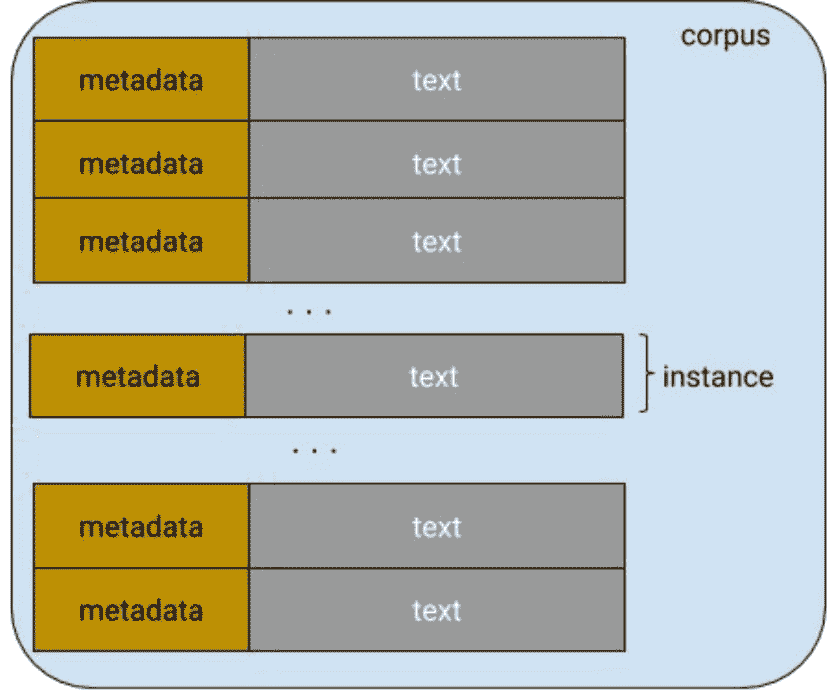
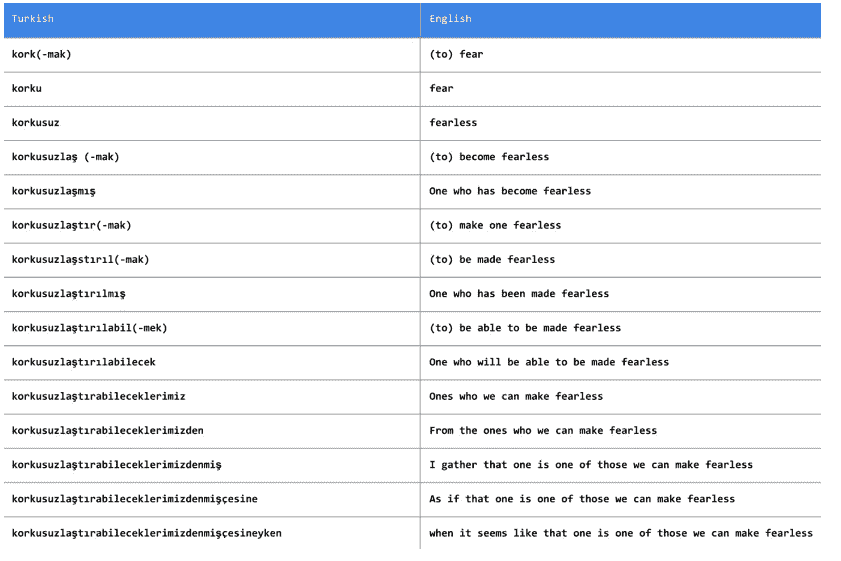
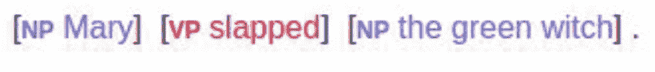
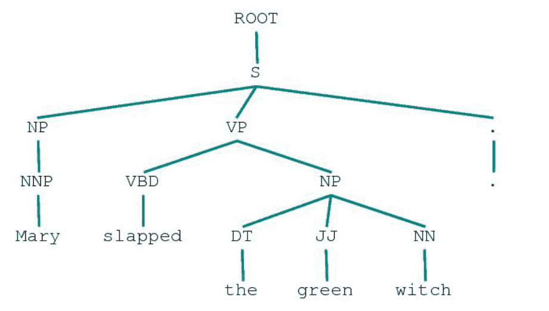
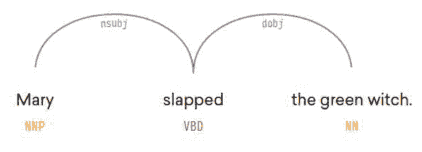
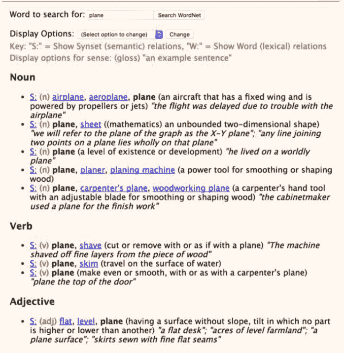

# 二、传统 NLP 快速回顾

> 本文标题：[Natural-Language-Processing-with-PyTorch（二）](https://yifdu.github.io/2018/12/18/Natural-Language-Processing-with-PyTorch%EF%BC%88%E4%BA%8C%EF%BC%89/)
> 
> 文章作者：[Yif Du](https://yifdu.github.io/ "访问 Yif Du 的个人博客")
> 
> 发布时间：2018 年 12 月 18 日 - 13:12
> 
> 最后更新：2019 年 02 月 16 日 - 23:02
> 
> 原始链接：[http://yifdu.github.io/2018/12/18/Natural-Language-Processing-with-PyTorch（二）/](https://yifdu.github.io/2018/12/18/Natural-Language-Processing-with-PyTorch%EF%BC%88%E4%BA%8C%EF%BC%89/)
> 
> 许可协议：[署名-非商业性使用-禁止演绎 4.0 国际](https://creativecommons.org/licenses/by-nc-nd/4.0/)  转载请保留原文链接及作者。

自然语言处理（NLP）和计算语言学（CL）是人类语言计算研究的两个领域。NLP 旨在开发解决涉及语言的实际问题的方法，如信息提取、自动语音识别、机器翻译、情绪分析、问答和总结。另一方面，CL 使用计算方法来理解人类语言的特性。我们如何理解语言?我们如何产生语言?我们如何学习语言?语言之间有什么关系?

在文献中，我们经常看到方法和研究人员的交叉，从 CL 到 NLP，反之亦然。来自语言学习的课程内容可以用来告知 NLP 中的先验，统计和机器学习的方法可以用来回答 CL 想要回答的问题。事实上，这些问题中的一些已经扩展到它们自己的学科，如音位学、形态学、句法学、语义学和语用学。

在本书中，我们只关注 NLP，但是我们经常根据需要从 CL 中借鉴思想。在我们将自己完全归属于 NLP 的神经网络方法之前，有必要回顾一下一些传统的 NLP 概念和方法。这就是本章的目标。

如果你有一些 NLP 的背景，你可以跳过这一章，但你也可以留下来怀旧，为未来建立一个共享的词汇表。

## 语料库，标记和类型

所有的 NLP 方法，无论是经典的还是现代的，都以文本数据集开始，也称为语料库（复数:corpora）。语料库通常有原始文本（ASCII 或 UTF-8 格式）和与文本相关的任何元数据。原始文本是字符（字节）序列，但是大多数时候将字符分组成连续的称为标记（Tokens）的连续单元是有用的。在英语中，标记（Tokens）对应由空格字符或标点分隔的单词和数字序列。

元数据可以是与文本相关联的任何辅助信息，例如标识符，标签和时间戳。 在机器学习术语中，文本及其元数据称为实例或数据点。 语料库（图 2-1）是一组实例，也称为数据集。 鉴于本书重点关注机器学习，我们可以自由地交换术语语料库和数据集。



将文本分解为标记（Tokens）的过程称为分词（tokenization）。世界语的句子，`Maria frapis la verda sorĉistino`有六个标记。分词可能比简单地基于非字母数字字符拆分文本更加复杂，如图 2-2 所示。对于像土耳其语这样的粘合语言来说，分隔空格和标点符号可能是不够的，因此可能需要更专业的技术。正如您将在第 4 章和第 6 章中看到的，通过将文本表示为字节流，我们可能能够在某些神经网络模型中完全规避分词问题;这对于粘合语言来说变得非常重要。 



最后，看看下面这条推文: 


分词 tweets 涉及到保存话题标签和`@handle`，将表情符号（如`:-)`）和 urls 分割为一个单元。`#MakeAMovieCold`标签应该是 1 个标记还是 4 个?虽然大多数研究论文对这一问题并没有给予太多的关注，而且事实上，许多分词决策往往是任意的，但是这些决策在实践中对准确性的影响要比公认的要大得多。通常被认为是预处理的繁琐工作，大多数开放源码 NLP 包为分词提供了合理的支持。示例 2-1 展示了来自 NLTK 和 SpaCy 的示例，这是两个用于文本处理的常用包。

示例 2-1：对文本分词

```py
Input[0]:
import spacy
nlp = spacy.load('en')
text = "Mary, don't slap the green witch"
print([str(token) for token in nlp(text.lower())])
Output[0]:
['mary', ',', 'do', "n't", 'slap', 'the', 'green', 'witch', '.']
Input[1]:
from nltk.tokenize import TweetTokenizer
tweet=u"Snow White and the Seven Degrees
    #MakeAMovieCold@midnight:-)"
tokenizer = TweetTokenizer()
print(tokenizer.tokenize(tweet.lower()))
Output[1]:
['snow', 'white', 'and', 'the', 'seven', 'degrees', '#makeamoviecold', '@midnight', ':-)']

```

类型是语料库中唯一的标记。语料库中所有类型的集合就是它的词汇表或词典。词可以区分为内容词和停止词。像冠词和介词这样的限定词主要是为了达到语法目的，就像填充物承载着内容词一样。

* * *

注：这种理解语言的语言学并将其应用于解决自然语言处理问题的过程称为特征工程。为了模型在不同语言之间的方便和可移植性，我们将这一点保持在最低限度。但是在构建和部署真实的生产系统时，特性工程是必不可少的，尽管最近的说法与此相反。对于特征工程的介绍，一般来说，可以阅读 Zheng（2016）的书。

* * *

## 一元组，二元组，三元组，...，N 元组

N 元组是文本中出现的固定长度（`n`）的连续标记序列。二元组有两个标记，一元组只有一个标记。从文本生成 N 元组非常简单，如示例 2-2 所示，但是 SpaCy 和 NLTK 等包提供了方便的方法。

示例 2-2：生成 N 元组

```py
Input[0]:
def n_grams(text, n):
    '''
    takes tokens or text, returns a list of n grams
    '''
    return [text[i:i+n] for i in range(len(text)-n+1)]

cleaned = ['mary', ',', "n't", 'slap', green', 'witch', '.']
print(n_grams(cleaned, 3))
Output[0]:
[['mary', ',', "n't"],
 [',', "n't", 'slap'],
 ["n't", 'slap', 'green'],
 ['slap', 'green', 'witch'],
 ['green', 'witch', '.']]

```

对于子词（subword）信息本身携带有用信息的某些情况，可能需要生成字符 N 元组。例如，`methanol`中的后缀`-ol`表示它是一种醇;如果您的任务涉及到对有机化合物名称进行分类，那么您可以看到 N 元组捕获的子单词（subword）信息是如何有用的。在这种情况下，您可以重用相同的代码，除了将每个字符 N 元组视为标记。（这里的子单词应该是值类似前缀后缀这种完整单词中的一部分)

## 词形和词干

词形是单词的词根形式。考虑动词`fly`。它可以被屈折成许多不同的单词——`flow`、`fly`、`flies`、`flying`、`flow`等等——而`fly`是所有这些看似不同的单词的词形。有时，为了保持向量表示的维数较低，将标记减少到它们的词形可能是有用的。这种简化称为词形还原（lemmatization），您可以在示例 2-3 中看到它的作用。

示例 2-3：词形还原

```py
Input[0]
import spacy
nlp = spacy.load('en')
doc = nlp(u"he was running late")
for token in doc:
    print('{} --> {}'.format(token, token.lemma_))
Output[0]
he --> he
was --> be
running --> run
late --> late

```

例如，SpaCy 使用一个预定义的字典 WordNet 来提取词形，但是词形还原可以构建为一个机器学习问题，需要理解语言的形态学。

词干是最普通的词形还原。它涉及到使用手工制定的规则来去掉单词的结尾，从而将它们简化为一种叫做词干的常见形式。通常在开源包中实现的流行的词干分析器是 Porter 词干提取器和 Snowball 词干提取器。我们留给您去寻找合适的 SpaCy/NLTK api 来执行词干提取。

## 分类句子和文档

对文档进行归类或分类可能是 NLP 最早的应用之一。我们在第 1 章中描述的表示（词频（TF）和词频-逆文档频率（TF-idf））对于对较长的文本块（如文档或句子）进行分类和分类非常有用。主题标签的分配、评论情绪的预测、垃圾邮件的过滤、语言识别和邮件分类等问题可以被定义为受监督的文档分类问题。（半监督版本，其中只使用了一个小的标记数据集，非常有用，但超出了本书的范围。)

## 分类单词：词性标注

我们可以将标记的概念从文档扩展到单个单词或标记。分类单词的一个常见示例是词性标注，如示例 2-4 所示。 

示例 2-4：词性

```py
Input[0]
import spacy
nlp = spacy.load('en')
doc = nlp(u"Mary slapped the green witch.")
for token in doc:
    print('{} - {}'.format(token, token.pos_))
Output[0]
Mary - PROPN
slapped - VERB
the - DET
green - ADJ
witch - NOUN
. - PUNCT

```

## 分类短语：分块和命名实体识别

通常，我们需要标记文本的范围;即，一个连续的多标记边界。例如，`Mary slapped the green witch.`我们可能需要识别其中的名词短语（NP）和动词短语（VP），如下图所示: 



这称为分块（Chunking）或浅解析（Shallow parsing）。浅解析的目的是推导出由名词、动词、形容词等语法原子组成的高阶单位。如果没有训练浅解析模型的数据，可以在词性标记上编写正则表达式来近似浅解析。幸运的是，对于英语和最广泛使用的语言来说，这样的数据和预先训练的模型是存在的。示例 2-5 给出了一个使用 SpaCy 的浅解析示例。

示例 2-5：名词块

```py
Input[0]:
import spacy
nlp = spacy.load('en')
doc  = nlp(u"Mary slapped the green witch.")
for chunk in doc.noun_chunks:
    print '{} - {}'.format(chunk, chunk.label_)
Output[0]:
Mary - NP
the green witch - NP

```

另一种有用的短语类型是命名实体。命名实体是一个字符串，它提到了一个真实世界的概念，如人员、位置、组织、药品名称等等。这里有一个例子: 


## 句子结构

浅层解析识别短语单位，而识别它们之间关系的任务称为解析（parsing）。您可能还记得，在初级英语课上，用图表表示句子，如图 2-6 所示。 



解析树（Parse tree）表示句子中不同的语法单元在层次上是如何相关的。图 2-6 中的解析树显示了所谓的成分解析。另一种可能更有用的显示关系的方法是使用依赖项解析（dependency parsing），如图 2-7 所示。 



要了解更多关于传统解析的信息，请参阅本章末尾的参考资料部分。

## 单词意义和情感

单词有意义，而且通常不止一个。一个词的不同含义称为它的意义（senses）。WordNet 是一个长期运行的词汇资源项目，它来自普林斯顿大学，旨在对所有英语单词（嗯，大部分）的含义以及其他词汇关系进行分类。例如，考虑像`plane`这样的单词。图 2-8 显示了`plane`一词的不同用法。 



在 WordNet 这样的项目中数十年的努力是值得的，即使是在有现代方法的情况下。本书后面的章节给出了在神经网络和深度学习方法的背景下使用现有语言资源的例子。词的意义也可以从上下文中归纳出来。从文本中自动发现词义实际上是半监督学习在自然语言处理中的第一个应用。尽管我们在本书中没有涉及到这一点，但我们鼓励您阅读 Jurasky and Martin（2014），第 17 章，Manning and Schutze（1999），第 7 章。

## 总结

在这一章中，我们回顾了 NLP 中的一些基本术语和思想，这些在以后的章节中会很有用。本章只涉及了传统 NLP 所能提供的部分内容。我们忽略了传统 NLP 的一些重要方面，因为我们想将本书的大部分内容用于 NLP 的深度学习。然而，重要的是要知道，有大量的 NLP 研究工作不使用神经网络，但仍具有很高的影响力（即，广泛用于建筑生产系统）。在许多情况下，基于神经网络的方法应该被看作是传统方法的补充而不是替代。有经验的实践者经常使用这两个世界的优点来构建最先进的系统。为了更多地了解 NLP 的传统方法，我们推荐以下参考资料部分中的标题。

## 参考文献

1.  `Manning, Christopher D., and Hinrich Schütze. (1999). Foundations of statistical natural language processing. MIT press.`

2.  `Bird, Steven, Ewan Klein, and Edward Loper. (2009). Natural language processing with Python: analyzing text with the natural language toolkit. O'Reilly Media.`

3.  `Smith, Noah A. (2011). "Linguistic structure prediction." Synthesis lectures on human language technologies.`

4.  `Jurafsky, Dan, and James H. Martin. (2014). Speech and language processing. Vol. 3. London: Pearson.`

5.  `Russell, Stuart J., and Peter Norvig. (2016). Artificial intelligence: a modern approach. Malaysia: Pearson Education Limited.`

6.  `Zheng, Alice, and Casari, Amanda. (2018). Feature Engineering for Machine Learning: Principles and Techniques for Data Scientists. O'Reilly Media, Inc.`