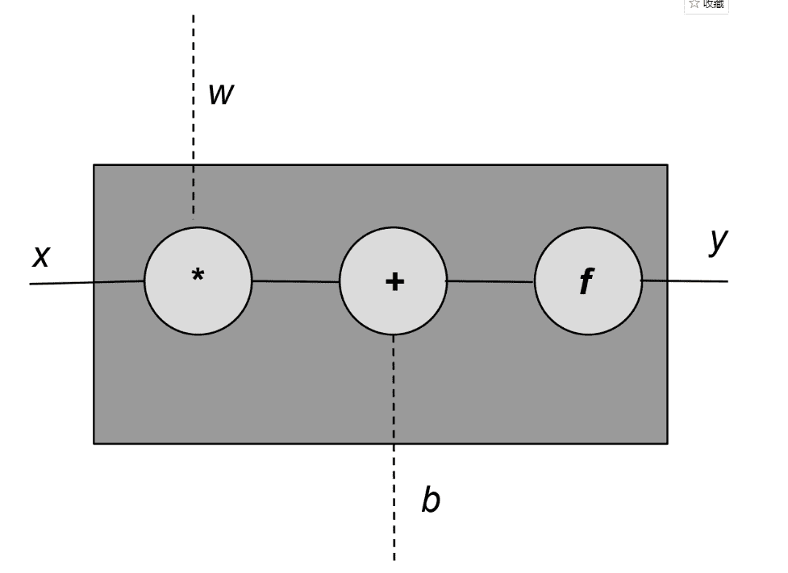
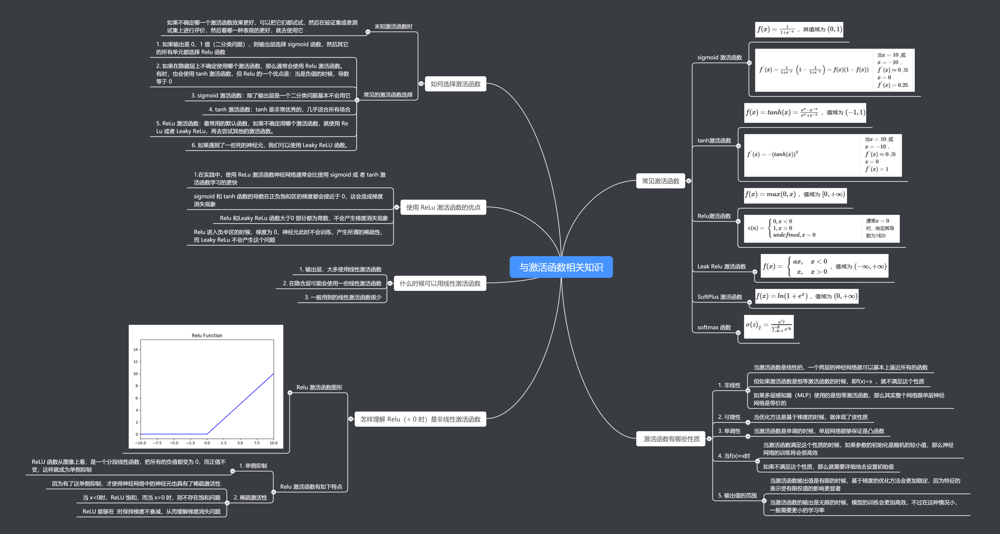
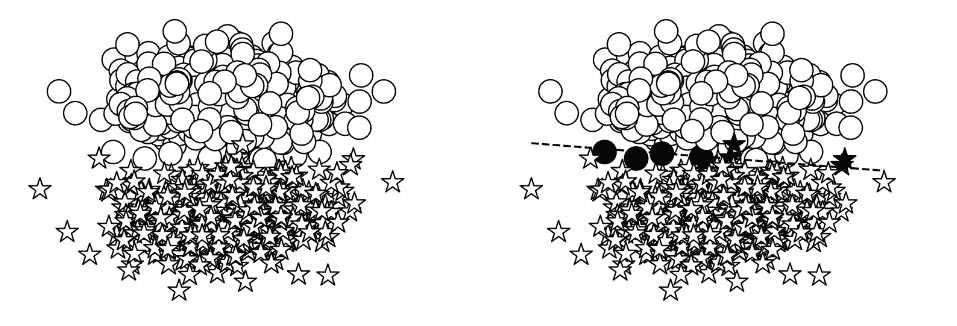
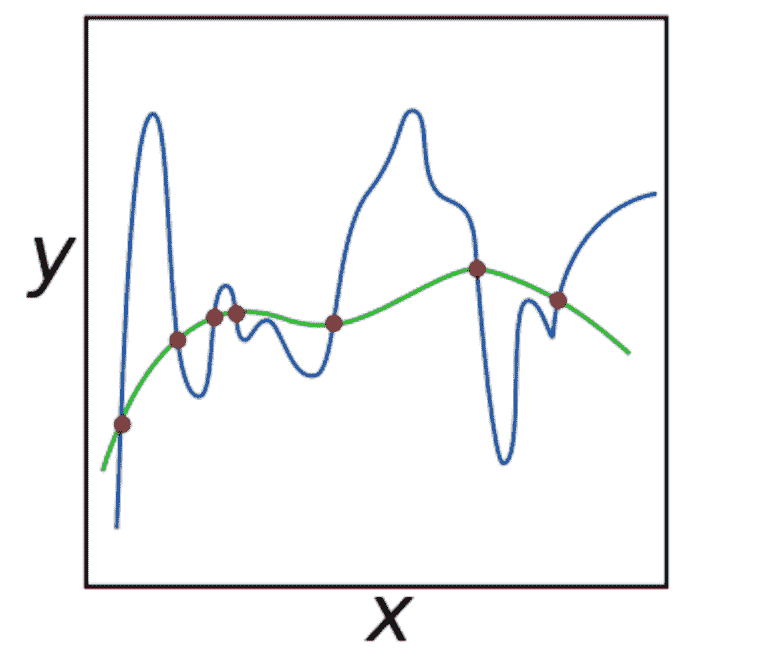

# 三、神经网络基础组件

> 本文标题：[Natural-Language-Processing-with-PyTorch（三）](https://yifdu.github.io/2018/12/19/Natural-Language-Processing-with-PyTorch%EF%BC%88%E4%B8%89%EF%BC%89/)
> 
> 文章作者：[Yif Du](https://yifdu.github.io/ "访问 Yif Du 的个人博客")
> 
> 发布时间：2018 年 12 月 19 日 - 14:12
> 
> 最后更新：2018 年 12 月 28 日 - 11:12
> 
> 原始链接：[http://yifdu.github.io/2018/12/19/Natural-Language-Processing-with-PyTorch（三）/](https://yifdu.github.io/2018/12/19/Natural-Language-Processing-with-PyTorch%EF%BC%88%E4%B8%89%EF%BC%89/)
> 
> 许可协议：[署名-非商业性使用-禁止演绎 4.0 国际](https://creativecommons.org/licenses/by-nc-nd/4.0/)  转载请保留原文链接及作者。

本章通过介绍构建神经网络的基本思想，如激活函数、损失函数、优化器和监督训练设置，为后面的章节奠定了基础。我们从感知器开始，这是一个将不同概念联系在一起的一个单元的神经网络。感知器本身是更复杂的神经网络的组成部分。这是一种贯穿全书的常见模式，我们讨论的每个架构或网络都可以单独使用，也可以在其他复杂的网络中组合使用。当我们讨论计算图形和本书的其余部分时，这种组合性将变得清晰起来。

## 感知机：最简单的神经网络

最简单的神经网络单元是感知器。感知器在历史上是非常松散地模仿生物神经元的。就像生物神经元一样，有输入和输出，“信号”从输入流向输出，如图 3-1 所示。 



每个感知器单元有一个输入（`x`），一个输出（`y`），和三个“旋钮”（knobs）:一组权重（`w`），偏量（`b`），和一个激活函数（`f`）。权重和偏量都从数据学习,激活函数是精心挑选的取决于网络的网络设计师的直觉和目标输出。数学上，我们可以这样表示:

通常情况下感知器有不止一个输入。我们可以用向量表示这个一般情况;即，`x`和`w`是向量，`w`和`x`的乘积替换为点积:

激活函数，这里用`f`表示，通常是一个非线性函数。示例 3-1 展示了 PyTorch 中的感知器实现，它接受任意数量的输入、执行仿射转换、应用激活函数并生成单个输出。

示例 3-1：使用 PyTorch 实现感知机

```py
import torch
import torch.nn as nn

class Perceptron(nn.Module):
    """ A Perceptron is one Linear layer """
    def __init__(self, input_dim):
        """
        Args:
            input_dim (int): size of the input features
        """
        super(Perceptron, self).__init__()
        self.fc1 = nn.Linear(input_dim, 1)

    def forward(self, x_in):
        """The forward pass of the Perceptron

        Args:
            x_in (torch.Tensor): an input data tensor.
                x_in.shape should be (batch, num_features)
        Returns:
            the resulting tensor. tensor.shape should be (batch,)
        """
        return torch.sigmoid(self.fc1(x_in)).squeeze()

```

线性运算`w_vec^T x_vec + b`称为仿射变换。PyTorch 方便地在`torch`中提供了一个`Linear()`类。`nn`模块，它做权值和偏差所需的簿记，并做所需的仿射变换。在“深入到有监督的训练”中，您将看到如何从数据中“学习”权重`w`和`b`的值。前面示例中使用的激活函数是 sigmoid 函数。在下一节中，我们将回顾一些常见的激活函数，包括 sigmoid 函数。

## 激活函数

激活函数是神经网络中引入的非线性函数，用于捕获数据中的复杂关系。在“深入到有监督的训练”和“多层感知器”中，我们深入研究了为什么学习中需要非线性，但首先，让我们看看一些常用的激活函数。



### Sigmoid

sigmoid 是神经网络历史上最早使用的激活函数之一。它取任何实值并将其压缩在 0 和 1 之间。数学上，sigmoid 的表达式如下:

从表达式中很容易看出，sigmoid 是一个光滑的、可微的函数。Torch 将 sigmoid 实现为`Torch.sigmoid()`，如示例 3-2 所示。 

示例 3-2：Sigmoid 激活

```py
import torch
import matplotlib.pyplot as plt

x = torch.range(-5., 5., 0.1)
y = torch.sigmoid(x)
plt.plot(x.numpy(), y.numpy())
plt.show()

```

从图中可以看出，sigmoid 函数饱和（即，产生极值输出）非常快，对于大多数输入。这可能成为一个问题，因为它可能导致梯度变为零或发散到溢出的浮点值。这些现象分别被称为消失梯度问题和爆炸梯度问题。因此，在神经网络中，除了在输出端使用 sigmoid 单元外，很少看到其他使用 sigmoid 单元的情况，在输出端，压缩属性允许将输出解释为概率。

### Tanh

如例 3-3 所示，tanh 激活函数是 sigmoid 在外观上的不同变体。当你写下 tanh 的表达式时，这就变得很清楚了:

通过一些争论（我们留作练习），您可以确信 tanh 只是 sigmoid 的一个线性变换。当您为`tanh()`写下 PyTorch 代码并绘制曲线时，这一点也很明显。注意双曲正切,像 sigmoid,也是一个“压缩”函数,除了它映射一个实值集合从`(-∞,+∞)`到`(-1,+1)`范围。

示例 3-3：Tanh 激活

```py
import torch
import matplotlib.pyplot as plt

x = torch.range(-5., 5., 0.1)
y = torch.tanh(x)
plt.plot(x.numpy(), y.numpy())
plt.show()

```

### ReLU

ReLU（发音为 ray-luh）代表线性整流单元。这可以说是最重要的激活函数。事实上，我们可以大胆地说，如果没有使用 ReLU，许多最近在深度学习方面的创新都是不可能实现的。对于一些如此基础的东西来说，神经网络激活函数的出现也是令人惊讶的。它的形式也出奇的简单: `f(x)=max(0,x)`因此，ReLU 单元所做的就是将负值裁剪为零，如示例 3-4 所示。 

示例 3-4：ReLU 激活

```py
import torch
import matplotlib.pyplot as plt

relu = torch.nn.ReLU()
x = torch.range(-5., 5., 0.1)
y = relu(x)

plt.plot(x.numpy(), y.numpy())
plt.show()

```

ReLU 的裁剪效果有助于消除梯度问题，随着时间的推移，网络中的某些输出可能会变成零，再也不会恢复。这就是所谓的“ReLU 死亡”问题。为了减轻这种影响，提出了 Leaky ReLU 或 Parametric ReLU （PReLU）等变体，其中泄漏系数`a`是一个可学习参数: `f(x)=max(x,ax)`

```py
import torch
import matplotlib.pyplot as plt

prelu = torch.nn.PReLU(num_parameters=1)
x = torch.range(-5., 5., 0.1)
y = prelu(x)

plt.plot(x.numpy(), y.numpy())
plt.show()

```

### Softmax

激活函数的另一个选择是 softmax。与 sigmoid 函数类似，softmax 函数将每个单元的输出压缩为 0 到 1 之间。然而，softmax 操作还将每个输出除以所有输出的和，从而得到一个离散概率分布，除以`k`个可能的类。结果分布中的概率总和为 1。这对于解释分类任务的输出非常有用，因此这种转换通常与概率训练目标配对，例如分类交叉熵，它在“深入研究监督训练”中介绍

```py
Input[0]
import torch.nn as nn
import torch

softmax = nn.Softmax(dim=1)
x_input = torch.randn(1, 3)
y_output = softmax(x_input)
print(x_input)
print(y_output)
print(torch.sum(y_output, dim=1))
Output[0]
tensor([[ 0.5836, -1.3749, -1.1229]])
tensor([[ 0.7561,  0.1067,  0.1372]])
tensor([ 1.])

```

在本节中，我们研究了四个重要的激活函数:Sigmoid、Tanh、ReLU 和 softmax。这些只是你在构建神经网络时可能用到的四种激活方式。随着本书的深入，我们将会清楚地看到应该使用哪些激活函数以及在哪里使用，但是一般的指南只是简单地遵循过去的工作原理。

## 损失函数

在第 1 章中，我们看到了通用的监督机器学习架构，以及损失函数或目标函数如何通过查看数据来帮助指导训练算法选择正确的参数。回想一下,一个损失函数将真相（`y`）和预测（`ŷ`）作为输入,产生一个实值的分数。这个分数越高，模型的预测就越差。PyTorch 在它的`nn`包中实现了许多损失函数，这些函数太过全面，这里就不介绍了，但是我们将介绍一些常用的损失函数。

### 均方误差损失

回归问题的网络的输出（`ŷ`）和目标（`y`）是连续值,一个常用的损失函数的均方误差（MSE）。

MSE 就是预测值与目标值之差的平方的平均值。还有一些其他的损失函数可以用于回归问题，例如平均绝对误差（MAE）和均方根误差（RMSE），但是它们都涉及到计算输出和目标之间的实值距离。示例 3-6 展示了如何使用 PyTorch 实现 MSE 损失。

示例 3-6：MSE 损失

```py
Input[0]
import torch
import torch.nn as nn

mse_loss = nn.MSELoss()
outputs = torch.randn(3, 5, requires_grad=True)
targets = torch.randn(3, 5)
loss = mse_loss(outputs, targets)
print(loss)
Output[0]
tensor(3.8618)

```

### 类别交叉熵损失

分类交叉熵损失（categorical cross-entropy loss）通常用于多类分类设置，其中输出被解释为类隶属度概率的预测。目标（`y`）是`n`个元素的向量，表示所有类的真正多项分布。如果只有一个类是正确的，那么这个向量就是单热向量。网络的输出（`ŷ`）也是一个向量`n`个元素,但代表了网络的多项分布的预测。分类交叉熵将比较这两个向量（`y, ŷ`）来衡量损失:

交叉熵和它的表达式起源于信息论，但是为了本节的目的，把它看作一种计算两个分布有多不同的方法是有帮助的。我们希望正确的类的概率接近 1，而其他类的概率接近 0。

为了正确地使用 PyTorch 的交叉熵损失，一定程度上理解网络输出、损失函数的计算方法和来自真正表示浮点数的各种计算约束之间的关系是很重要的。具体来说，有四条信息决定了网络输出和损失函数之间微妙的关系。首先，一个数字的大小是有限制的。其次，如果 softmax 公式中使用的指数函数的输入是负数，则结果是一个指数小的数，如果是正数，则结果是一个指数大的数。接下来，假定网络的输出是应用 softmax 函数之前的向量。最后,对数函数是指数函数的倒数,和`log(exp (x))`就等于`x`。因这四个信息,数学简化假设 指数函数和对数函数是为了更稳定的数值计算和避免很小或很大的数字。这些简化的结果是，不使用 softmax 函数的网络输出可以与 PyTorch 的交叉熵损失一起使用，从而优化概率分布。然后，当网络经过训练后，可以使用 softmax 函数创建概率分布，如例 3-7 所示。 

示例 3-7：交叉熵损失

```py
Input[0]
import torch
import torch.nn as nn

ce_loss = nn.CrossEntropyLoss()
outputs = torch.randn(3, 5, requires_grad=True)
targets = torch.tensor([1, 0, 3], dtype=torch.int64)
loss = ce_loss(outputs, targets)
print(loss)
Output[0]
tensor(2.7256)

```

### 二元交叉熵

我们在上一节看到的分类交叉熵损失函数在我们有多个类的分类问题中非常有用。有时，我们的任务包括区分两个类——也称为二元分类。在这种情况下，利用二元交叉熵损失是有效的。我们将在示例任务的“示例:对餐馆评论的情绪进行分类”中研究这个损失函数。

在示例 3-8 中，我们使用表示网络输出的随机向量上的 sigmoid 激活函数创建二进制概率输出向量。接下来，真实情况被实例化为一个 0 和 1 的向量。最后，利用二元概率向量和基真值向量计算二元交叉熵损失。

示例 3-8：二元交叉熵损失

```py
Input[0]
bce_loss = nn.BCELoss()
sigmoid = nn.Sigmoid()
probabilities = sigmoid(torch.randn(4, 1, requires_grad=True))
targets = torch.tensor([1, 0, 1, 0],  dtype=torch.float32).view(4, 1)
loss = bce_loss(probabilities, targets)
print(probabilities)
print(loss)
Output[0]
tensor([[ 0.1625],
        [ 0.5546],
        [ 0.6596],
        [ 0.4284]])
tensor(0.9003)

```

## 深入监督学习

监督学习是学习如何将观察结果映射到特定目标的问题。在这一节中，我们将更详细地讨论。具体地说，我们明确地描述了如何使用模型预测和损失函数对模型参数进行基于梯度的优化。这是一个重要的部分，因为本书的其余部分都依赖于它，所以即使您对监督学习有些熟悉，也值得详细阅读它。

回顾第 1 章，有监督学习需要以下内容:模型、损失函数、训练数据和优化算法。监督学习的训练数据是观察和目标对，模型从观察中计算预测，损失衡量预测相对于目标的误差。训练的目的是利用基于梯度的优化算法来调整模型的参数，使损失尽可能小。

在本节的其余部分中，我们将讨论一个经典的玩具问题:将二维点划分为两个类中的一个。直观上，这意味着学习一条直线（称为决策边界或超平面）来区分类之间的点。我们一步一步地描述数据结构，选择模型，选择一个损失，建立优化算法，最后，一起运行它。

### 构造玩具数据

在机器学习中，当试图理解一个算法时，创建具有易于理解的属性的合成数据是一种常见的实践。在本节中，我们使用“玩具”任务的合成数据——将二维点分类为两个类中的一个。为了构建数据，我们从 xy 平面的两个不同部分采样点，为模型创建了一个易于学习的环境。示例如图 3-2 所示。模型的目标是将星星（`⋆`）作为一个类,圆圈（`◯`）作为另一个类。这可以在图的右边看到，线上面的东西和线下面的东西分类不同。生成数据的代码位于本章附带的 Python 笔记本中名为`get_toy_data()`的函数中。 



### 选择模型

我们在这里使用的模型是在本章开头介绍的:感知器。感知器是灵活的，因为它允许任何大小的输入。在典型的建模情况下，输入大小由任务和数据决定。在这个玩具示例中，输入大小为 2，因为我们显式地将数据构造为二维平面。对于这个两类问题，我们为类指定一个数字索引:0 和 1。字符串的映射标签`⋆`和`◯`类指数是任意的,只要它在数据预处理是一致的,训练,评估和测试。该模型的另一个重要属性是其输出的性质。由于感知器的激活函数是一个 sigmoid，感知器的输出为数据点（`x`）为类 1 的概率;即`P(y = 1 | x)`

## 转换概率到具体类

对于二元分类问题,我们可以输出概率转换成两个离散类通过利用决策边界`δ`。如果预测的概率`P(y = 1 | x) > δ`,预测类是 1,其它类是 0。通常，这个决策边界被设置为 0.5，但是在实践中，您可能需要优化这个超参数（使用一个评估数据集），以便在分类中获得所需的精度。

## 选择损失函数

在准备好数据并选择了模型体系结构之后，在有监督的训练中还可以选择另外两个重要组件:损失函数和优化器。在模型输出为概率的情况下，最合适的损失函数是基于熵的交叉损失。对于这个玩具数据示例，由于模型产生二进制结果，我们特别使用 BCE 损失。

## 选择优化器

在这个简化的监督训练示例中，最后的选择点是优化器。当模型产生预测，损失函数测量预测和目标之间的误差时，优化器使用错误信号更新模型的权重。最简单的形式是，有一个超参数控制优化器的更新行为。这个超参数称为学习率，它控制错误信号对更新权重的影响。学习速率是一个关键的超参数，你应该尝试几种不同的学习速率并进行比较。较大的学习率会对参数产生较大的变化，并会影响收敛性。学习率过低会导致在训练过程中进展甚微。

PyTorch 库为优化器提供了几种选择。随机梯度下降法（SGD）是一种经典的选择算法，但对于复杂的优化问题，SGD 存在收敛性问题，往往导致模型较差。当前首选的替代方案是自适应优化器，例如 Adagrad 或 Adam，它们使用关于更新的信息。在下面的例子中，我们使用 Adam，但是它总是值得查看几个优化器。对于 Adam，默认的学习率是 0.001。对于学习率之类的超参数，总是建议首先使用默认值，除非您从论文中获得了需要特定值的秘诀。

示例 3-9：实例化 Adam 优化器

```py
Input[0]
import torch.nn as nn
import torch.optim as optim

input_dim = 2
lr = 0.001

perceptron = Perceptron(input_dim=input_dim)
bce_loss = nn.BCELoss()
optimizer = optim.Adam(params=perceptron.parameters(), lr=lr)

```

### 放到一起：基于梯度的监督学习

学习从计算损失开始;也就是说，模型预测离目标有多远。损失函数的梯度，反过来，是参数应该改变多少的信号。每个参数的梯度表示给定参数的损失值的瞬时变化率。实际上，这意味着您可以知道每个参数对损失函数的贡献有多大。直观上，这是一个斜率，你可以想象每个参数都站在它自己的山上，想要向上或向下移动一步。基于梯度的模型训练所涉及的最简单的形式就是迭代地更新每个参数，并使用与该参数相关的损失函数的梯度。

让我们看看这个梯度步进（gradient-steeping）算法是什么样子的。首先，使用名为`zero_grad()`的函数清除当前存储在模型（感知器）对象中的所有记帐信息，例如梯度。然后，模型计算给定输入数据（`x_data`）的输出（`y_pred`）。接下来，通过比较模型输出（`y_pred`）和预期目标（`y_target`）来计算损失。这正是有监督训练信号的有监督部分。PyTorch 损失对象（`criteria`）具有一个名为`bcakward()`的函数，该函数迭代地通过计算图向后传播损失，并将其梯度通知每个参数。最后，优化器（`opt`）用一个名为`step()`的函数指示参数如何在知道梯度的情况下更新它们的值。

整个训练数据集被划分成多个批（batch）。在文献和本书中，术语小批量也可以互换使用，而不是“批量”来强调每个批量都明显小于训练数据的大小;例如，训练数据可能有数百万个，而小批数据可能只有几百个。梯度步骤的每一次迭代都在一批数据上执行。名为`batch_size`的超参数指定批次的大小。由于训练数据集是固定的，增加批大小会减少批的数量。在多个批量（通常是有限大小数据集中的批量数量）之后，训练循环完成了一个周期。周期一个完整的训练迭代。如果每个周期的批数量与数据集中的批数量相同，那么周期就是对数据集的完整迭代。模型是为一定数量的周期而训练的。要训练的周期的数量对于选择来说不是复杂的，但是有一些方法可以决定什么时候停止，我们稍后将讨论这些方法。如示例 3-10 所示，受监督的训练循环因此是一个嵌套循环:数据集或批量集合上的内部循环，以及外部循环，后者在固定数量的周期或其他终止条件上重复内部循环。

示例 3-10：感知机和二分类的监督训练循环

```py
# each epoch is a complete pass over the training data
for epoch_i in range(n_epochs):
    # the inner loop is over the batches in the dataset
    for batch_i in range(n_batches):

        # Step 0: Get the data
        x_data, y_target = get_toy_data(batch_size)

        # Step 1: Clear the gradients
        perceptron.zero_grad()

        # Step 2: Compute the forward pass of the model
        y_pred = perceptron(x_data, apply_sigmoid=True)

        # Step 3: Compute the loss value that we wish to optimize
        loss = bce_loss(y_pred, y_target)

        # Step 4: Propagate the loss signal backward
        loss.backward()

        # Step 5: Trigger the optimizer to perform one update
        optimizer.step()

```

### 辅助训练概念

基于梯度监督学习的核心概念很简单:定义模型，计算输出，使用损失函数计算梯度，应用优化算法用梯度更新模型参数。然而，在训练过程中有几个重要但辅助的概念。我们将在本节介绍其中的一些。

### 正确度量模型表现：评估度量

核心监督训练循环之外最重要的部分是使用模型从未训练过的数据来客观衡量性能。模型使用一个或多个评估指标进行评估。在自然语言处理（NLP）中，存在多种评价指标。最常见的，也是我们将在本章使用的，是准确性。准确性仅仅是在训练过程中未见的数据集上预测正确的部分。

### 正确度量模型表现：分割数据集

一定要记住，最终的目标是很好地概括数据的真实分布。这是什么意思?假设我们能够看到无限数量的数据（“真实/不可见的分布”），那么存在一个全局的数据分布。显然，我们不能那样做。相反，我们用有限的样本作为训练数据。我们观察有限样本中的数据分布这是真实分布的近似或不完全图像。如果一个模型不仅减少了训练数据中样本的误差，而且减少了来自不可见分布的样本的误差，那么这个模型就比另一个模型具有更好的通用性。当模型致力于降低它在训练数据上的损失时，它可以过度适应并适应那些实际上不是真实数据分布一部分的特性。

要实现这一点，标准实践是将数据集分割为三个随机采样的分区，称为训练、验证和测试数据集，或者进行 k 折交叉验证。分成三个分区是两种方法中比较简单的一种，因为它只需要一次计算。您应该采取预防措施，确保在三个分支之间的类分布保持相同。换句话说，通过类标签聚合数据集，然后将每个由类标签分隔的集合随机拆分为训练、验证和测试数据集，这是一种很好的实践。一个常见的分割百分比是预留 70% 用于训练，15% 用于验证，15% 用于测试。不过，这不是一个硬编码的约定。

在某些情况下，可能存在预定义的训练、验证和测试分离;这在用于基准测试任务的数据集中很常见。在这种情况下，重要的是只使用训练数据更新模型参数，在每个周期结束时使用验证数据测量模型性能，在所有的建模选择被探索并需要报告最终结果之后，只使用测试数据一次。这最后一部分是极其重要的,因为更多的机器学习工程师在玩模型的性能测试数据集,他们是偏向选择测试集上表现得更好。当这种情况发生时,它是不可能知道该模型性能上看不见的数据没有收集更多的数据。

使用 k 折交叉验证的模型评估与使用预定义分割的评估非常相似，但是在此之前还有一个额外的步骤，将整个数据集分割为 k 个大小相同的折。其中一折保留用于评估，剩下的`k-1`折用于训练。通过交换出计算中的哪些折，可以重复执行此操作。因为有 k 折，每一折都有机会成为一个评价折，并产生一个特定于折的精度，从而产生 k 个精度值。最终报告的准确性只是具有标准差的平均值。k 折评估在计算上是昂贵的，但是对于较小的数据集来说是非常必要的，对于较小的数据集来说，错误的分割可能导致过于乐观（因为测试数据太容易了）或过于悲观（因为测试数据太困难了）。

### 了解什么时候停止训练

之前的例子训练了固定次数的模型。虽然这是最简单的方法，但它是任意的和不必要的。正确度量模型性能的一个关键功能是使用该度量来知道何时应该停止训练。最常用的方法是使用启发式方法，称为早期停止（early stopping）。早期停止通过跟踪验证数据集上从一个周期到另一个周期的性能并注意性能何时不再改进来的工作。然后，如果业绩继续没有改善，训练将终止。在结束训练之前需要等待的时间称为耐心。一般来说，模型停止改进某些数据集的时间点称为模型收敛的时间点。在实际应用中，我们很少等待模型完全收敛，因为收敛是耗时的，而且会导致过拟合。

### 查找正确的超参数

我们在前面了解到，参数（或权重）采用优化器针对称为小批量的固定训练数据子集调整的实际值。超参数是影响模型中参数数量和参数所取值的任何模型设置。有许多不同的选择来决定如何训练模型。这些选择包括选择一个损失函数;优化器;优化器的学习率，如层大小（在第 4 章中介绍);有等到早停止（early stopping）的耐心;和各种正规化决策（也在第 4 章讨论）。需要注意的是，这些决策会对模型是否收敛及其性能产生很大影响，你应该系统地探索各种选择点。

### 正则化

深度学习（以及机器学习）中最重要的概念之一是正则化。正则化的概念来源于数值优化理论。回想一下，大多数机器学习算法都在优化损失函数，以找到最可能解释观测结果（即，产生的损失最少）。对于大多数数据集和任务，这个优化问题可能有多个解决方案（可能的模型）。那么我们（或优化器）应该选择哪一个呢?为了形成直观的理解，请考虑图 3-3 通过一组点拟合曲线的任务。 



两条曲线都“拟合”这些点，但哪一条是不太可能的解释呢?通过求助于奥卡姆剃刀，我们凭直觉知道一个简单的解释比复杂的解释更好。这种机器学习中的平滑约束称为 L2 正则化。在 PyTorch 中，您可以通过在优化器中设置`weight_decay`参数来控制这一点。`weight_decay`值越大，优化器选择的解释就越流畅;也就是说，L2 正则化越强。

除了 L2，另一种流行的正则化是 L1 正则化。L1 通常用来鼓励稀疏解;换句话说，大多数模型参数值都接近于零。在第 4 章中，您将看到一种结构正则化技术，称为“丢弃”。模型正则化是一个活跃的研究领域，PyTorch 是实现自定义正则化的灵活框架。

## 示例：分类餐馆评论的情感

在上一节中，我们通过一个玩具示例深入研究了有监督的训练，并阐述了许多基本概念。在本节中，我们将重复上述练习，但这次使用的是一个真实的任务和数据集:使用感知器和监督训练对 Yelp 上的餐馆评论进行分类，判断它们是正面的还是负面的。因为这是本书中第一个完整的 NLP 示例，所以我们将极其详细地描述辅助数据结构和训练例程。后面几章中的示例将遵循非常相似的模式，因此我们鼓励您仔细遵循本节，并在需要复习时参考它。

在本书的每个示例的开头，我们将描述正在使用的数据集和任务。在这个例子中，我们使用 Yelp 数据集，它将评论与它们的情感标签（正面或负面）配对。此外，我们还描述了一些数据集操作步骤，这些步骤用于清理数据集并将其划分为训练、验证和测试集。

在理解数据集之后，您将看到定义三个辅助类的模式，这三个类在本书中反复出现，用于将文本数据转换为向量化的形式:词汇表（the Vocabulary）、向量化器（Vectorizer）和 PyTorch 的`DataLoader`。词汇表协调我们在“观察和目标编码”中讨论的整数到标记（token）映射。我们使用一个词汇表将文本标记（text tokens）映射到整数，并将类标签映射到整数。接下来，向量化器（vectorizer）封装词汇表，并负责接收字符串数据，如审阅文本，并将其转换为将在训练例程中使用的数字向量。我们使用最后一个辅助类，PyTorch 的`DataLoader`，将单个向量化数据点分组并整理成小批量。

在描述了构成文本向量化小批量管道（text-to-vectorized-minibatch pipeline）的数据集和辅助类之后，概述了感知器分类器及其训练例程。需要注意的重要一点是，本书中的每个示例的训练例程基本保持不变。我们会在这个例子中更详细地讨论它，因此，我们再次鼓励您使用这个例子作为未来训练例程的参考。我们通过讨论结果来总结这个例子，并深入了解模型学习到了什么。

### Yelp 评论数据集

2015 年，Yelp 举办了一场竞赛，要求参与者根据点评预测一家餐厅的评级。同年，Zhang, Zhao，和 Lecun（2015）将 1 星和 2 星评级转换为“消极”情绪类，将 3 星和 4 星评级转换为“积极”情绪类，从而简化了数据集。该数据集分为 56 万个训练样本和 3.8 万个测试样本。在这个数据集部分的其余部分中，我们将描述最小化清理数据并导出最终数据集的过程。然后，我们概述了利用 PyTorch 的数据集类的实现。

在这个例子中，我们使用了简化的 Yelp 数据集，但是有两个细微的区别。第一个区别是我们使用数据集的“轻量级”版本，它是通过选择 10% 的训练样本作为完整数据集而派生出来的。这有两个结果:首先，使用一个小数据集可以使训练测试循环快速，因此我们可以快速地进行实验。其次，它生成的模型精度低于使用所有数据。这种低精度通常不是主要问题，因为您可以使用从较小数据集子集中获得的知识对整个数据集进行重新训练。在训练深度学习模型时，这是一个非常有用的技巧，因为在许多情况下，训练数据的数量是巨大的。

从这个较小的子集中，我们将数据集分成三个分区:一个用于训练，一个用于验证，一个用于测试。虽然原始数据集只有两个部分，但是有一个验证集是很重要的。在机器学习中，您经常在数据集的训练部分上训练模型，并且需要一个保留部分来评估模型的性能。如果模型决策基于保留部分，那么模型现在不可避免地偏向于更好地执行保留部分。因为度量增量进度是至关重要的，所以这个问题的解决方案是使用第三个部分，它尽可能少地用于评估。

综上所述，您应该使用数据集的训练部分来派生模型参数，使用数据集的验证部分在超参数之间进行选择（进行建模决策），使用数据集的测试分区进行最终评估和报告。在例 3-11 中，我们展示了如何分割数据集。注意，随机种子被设置为一个静态数字，我们首先通过类标签聚合以确保类分布保持不变。

示例 3-11：创建训练，验证和测试分割

```py
# Splitting the subset by rating to create new train, val, and test splits
by_rating = collections.defaultdict(list)
for _, row in review_subset.iterrows():
    by_rating[row.rating].append(row.to_dict())

# Create split data
final_list = []
np.random.seed(args.seed)

for _, item_list in sorted(by_rating.items()):
    np.random.shuffle(item_list)

    n_total = len(item_list)
    n_train = int(args.train_proportion * n_total)
    n_val = int(args.val_proportion * n_total)
    n_test = int(args.test_proportion * n_total)

    # Give data point a split attribute
    for item in item_list[:n_train]:
        item['split'] = 'train'

    for item in item_list[n_train:n_train+n_val]:
        item['split'] = 'val'

    for item in item_list[n_train+n_val:n_train+n_val+n_test]:
        item['split'] = 'test'

    # Add to final list
    final_list.extend(item_list)

final_reviews = pd.DataFrame(final_list)

```

除了创建一个子集，该子集有三个分区用于训练、验证和测试之外，我们还通过在标点符号周围添加空格和删除并非所有分割都使用标点符号的无关符号来最低限度地清理数据，如示例 3-12 所示。

示例 3-12：最小程度清理数据

```py
def preprocess_text(text):
    text = text.lower()
    text = re.sub(r"([.,!?])", r" \1 ", text)
    text = re.sub(r"[^a-zA-Z.,!?]+", r" ", text)
    return text

final_reviews.review = final_reviews.review.apply(preprocess_text)

```

### 理解 PyTorch 的数据集表示

示例 3-13 中给出的`ReviewDataset`类假设数据集已被最少地清理并分割为三个部分。特别是，数据集假定它可以基于空白分隔评论，以便获得评论中的标记（tokens）列表。此外，它假定数据有一个注释，该注释将数据拆分为它所属的部分。需要注意的是，我们使用 Python 的类方法为这个数据集类指定了入口点方法。我们在整本书中都遵循这个模式。

PyTorch 通过提供数据集类为数据集提供了一个抽象。数据集类是一个抽象迭代器。在对新数据集使用 PyTorch 时，必须首先从数据集类继承子类（或继承），并实现`__getitem__`和`__len__`方法。对于这个例子，我们创建了一个`ReviewDataset`类，它继承自 PyTorch 的`Dataset`类，并实现了两个方法:`__getitem__`和`__len__`。通过实现这两种方法，有一个概念上的约定，允许各种 PyTorch 实用程序使用我们的数据集。在下一节中，我们将介绍其中一个实用程序，特别是`DataLoader`。下面的实现严重依赖于一个名为`ReviewVectorizer` 的类。在下一节中，我们将描述`ReviewVectorizer`，但是您可以直观地将其描述为处理从评审文本到表示评审的数字向量的转换的类。神经网络只有通过一定的向量化步骤才能与文本数据进行交互。总体设计模式是实现一个数据集类，它处理一个数据点的向量化逻辑。然后，PyTorch 的`DataLoader`（下一节也将介绍）将通过对数据集进行采样和整理来创建小批数据（minibatch）。

示例 3-13：`ReviewDataset`类

```py
from torch.utils.data import Dataset

class ReviewDataset(Dataset):
    def __init__(self, review_df, vectorizer):
        """
        Args:
            review_df (pandas.DataFrame): the dataset
            vectorizer (ReviewVectorizer): vectorizer instantiated from dataset
        """
        self.review_df = review_df
        self._vectorizer = vectorizer

        self.train_df = self.review_df[self.review_df.split=='train']
        self.train_size = len(self.train_df)

        self.val_df = self.review_df[self.review_df.split=='val']
        self.validation_size = len(self.val_df)

        self.test_df = self.review_df[self.review_df.split=='test']
        self.test_size = len(self.test_df)

        self._lookup_dict = {'train': (self.train_df, self.train_size),
                             'val': (self.val_df, self.validation_size),
                             'test': (self.test_df, self.test_size)}

        self.set_split('train')

    @classmethod
    def load_dataset_and_make_vectorizer(cls, review_csv):
        """Load dataset and make a new vectorizer from scratch

        Args:
            review_csv (str): location of the dataset
        Returns:
            an instance of ReviewDataset
        """
        review_df = pd.read_csv(review_csv)
        return cls(review_df, ReviewVectorizer.from_dataframe(review_df))

    def get_vectorizer(self):
        """ returns the vectorizer """
        return self._vectorizer

    def set_split(self, split="train"):
        """ selects the splits in the dataset using a column in the dataframe

        Args:
            split (str): one of "train", "val", or "test"
        """
        self._target_split = split
        self._target_df, self._target_size = self._lookup_dict[split]

    def __len__(self):
        return self._target_size

    def __getitem__(self, index):
        """the primary entry point method for PyTorch datasets

        Args:
            index (int): the index to the data point
        Returns:
            a dict of the data point's features (x_data) and label (y_target)
        """
        row = self._target_df.iloc[index]

        review_vector = \
            self._vectorizer.vectorize(row.review)

        rating_index = \
            self._vectorizer.rating_vocab.lookup_token(row.rating)

        return {'x_data': review_vector,
                'y_target': rating_index}

    def get_num_batches(self, batch_size):
        """Given a batch size, return the number of batches in the dataset

        Args:
            batch_size (int)
        Returns:
            number of batches in the dataset
        """
        return len(self) // batch_size

```

### `Vocabulary`，`Vectorizer`和`DataLoader`

`Vocabulary`，`Vectorizer`和`DataLoader`是三个类，我们几乎在本书的每个示例中都使用它们来执行一个关键的管道:将文本输入转换为向量化的小批（minibatch）。管道从预处理文本开始;每个数据点都是标记的集合。在本例中，标记碰巧是单词，但是正如您将在第 4 章和第 6 章中看到的，标记也可以是字符。以下小节中提供的三个类负责将每个标记映射到一个整数，将此映射应用到每个数据点，以创建一个向量化表单，然后将向量化数据点分组到模型的一个小批量中。

## 词汇表

从文本到向量化的小批量处理的第一步是将每个标记（tokens）映射到其自身的数字版本。标准的方法是在标记（tokens）和整数之间有一个双向映射（可以反向映射）。在 Python 中，这只是两个字典。我们将这个词封装到词汇表类中，如示例 3-14 所示。词汇表类不仅管理这个双射—允许用户添加新的标记并使索引自动递增—而且还处理一个名为`UNK.UNK`的特殊标记，它代表“未知”标记。通过使用`UNK`标记，我们可以在测试期间处理训练中从未见过的标记;例如，您可能会遇到一个以前从未见过的单词。正如我们将在接下来的向量化器中看到的，我们甚至将显式地限制词汇表中不经常出现的标记，以便在我们的训练例程中有`UNK`标记。这对于限制词汇表类使用的内存非常重要。预期的行为是调用`add_token`向词汇表中添加新的标记，检索标记索引时调用`lookup_token`，检索特定索引对应的标记时调用`lookup_index`。

示例 3-14：`Vocabulary`类

```py
class Vocabulary(object):
    """Class to process text and extract vocabulary for mapping"""

    def __init__(self, token_to_idx=None, add_unk=True, unk_token="<UNK>"):
        """
        Args:
            token_to_idx (dict): a pre-existing map of tokens to indices
            add_unk (bool): a flag that indicates whether to add the UNK token
            unk_token (str): the UNK token to add into the Vocabulary
        """

        if token_to_idx is None:
>           token_to_idx = {}
        self._token_to_idx = token_to_idx

        self._idx_to_token = {idx: token
                              for token, idx in self._token_to_idx.items()}

        self._add_unk = add_unk
        self._unk_token = unk_token

        self.unk_index = -1
        if add_unk:
            self.unk_index = self.add_token(unk_token)

    def to_serializable(self):
        """ returns a dictionary that can be serialized """
        return {'token_to_idx': self._token_to_idx,
                'add_unk': self._add_unk,
                'unk_token': self._unk_token}

    @classmethod
    def from_serializable(cls, contents):
        """ instantiates the Vocabulary from a serialized dictionary """
        return cls(**contents)

    def add_token(self, token):
        """Update mapping dicts based on the token.

        Args:
            token (str): the item to add into the Vocabulary
        Returns:
            index (int): the integer corresponding to the token
        """
        if token in self._token_to_idx:
            index = self._token_to_idx[token]
        else:
            index = len(self._token_to_idx)
            self._token_to_idx[token] = index
            self._idx_to_token[index] = token
        return index

    def lookup_token(self, token):
        """Retrieve the index associated with the token
          or the UNK index if token isn't present.

        Args:
            token (str): the token to look up
        Returns:
            index (int): the index corresponding to the token
        Notes:
            `unk_index` needs to be >=0 (having been added into the Vocabulary)
              for the UNK functionality
        """
        if self.add_unk:
            return self._token_to_idx.get(token, self.unk_index)
        else:
            return self._token_to_idx[token]

    def lookup_index(self, index):
        """Return the token associated with the index

        Args:
            index (int): the index to look up
        Returns:
            token (str): the token corresponding to the index
        Raises:
            KeyError: if the index is not in the Vocabulary
        """
        if index not in self._idx_to_token:
            raise KeyError("the index (%d) is not in the Vocabulary" % index)
        return self._idx_to_token[index]

    def __str__(self):
        return "<Vocabulary(size=%d)>" % len(self)

    def __len__(self):
        return len(self._token_to_idx)

```

## 向量化

从文本数据集到向量化的小批量的第二个阶段是迭代输入数据点的标记，并将每个标记转换为其整数形式。这个迭代的结果应该是一个向量。由于这个向量将与来自其他数据点的向量组合，因此有一个约束条件，即由向量化器生成的向量应该始终具有相同的长度。

为了实现这些目标，`Vectorizer`类封装了评审词汇表，它将评审中的单词映射到整数。在示例 3-15 中，向量化器为`from_dataframe`方法使用 Python 的`classmethod`装饰器来指示实例化向量化器的入口点。`from_dataframe`方法在 pandas `dataframe`的行上迭代，有两个目标。第一个目标是计算数据集中出现的所有标记的频率。第二个目标是创建一个词汇表，该词汇表只使用与方法截止提供的关键字参数一样频繁的标记。有效地，这种方法是找到所有至少出现截止时间的单词，并将它们添加到词汇表中。由于还将`UNK`标记添加到词汇表中，因此在调用词汇表的`lookup_`标记方法时，未添加的任何单词都将具有`unk_index`。

方法向量化封装了向量化器的核心功能。它以表示评审的字符串作为参数，并返回评审的向量化表示。在这个例子中，我们使用在第 1 章中介绍的折叠的单热表示。这种表示方式创建了一个二进制向量——一个包含 1 和 0 的向量——它的长度等于词汇表的大小。二进制向量在与复习中的单词对应的位置有 1。注意，这种表示有一些限制。首先，它是稀疏的——复习中惟一单词的数量总是远远少于词汇表中惟一单词的数量。第二，它抛弃了单词在评论中出现的顺序（词袋，“bag of words”）。在后面的章节中，您将看到其他没有这些限制的方法。

示例 3-15：`Vectorizer`类

```py
class ReviewDataset(Dataset):
    def __init__(self, review_df, vectorizer):
        """
        Args:
            review_df (pandas.DataFrame): the dataset
            vectorizer (ReviewVectorizer): vectorizer instantiated from dataset
        """
        self.review_df = review_df
        self._vectorizer = vectorizer

        self.train_df = self.review_df[self.review_df.split=='train']
        self.train_size = len(self.train_df)

        self.val_df = self.review_df[self.review_df.split=='val']
        self.validation_size = len(self.val_df)

        self.test_df = self.review_df[self.review_df.split=='test']
        self.test_size = len(self.test_df)

        self._lookup_dict = {'train': (self.train_df, self.train_size),
                             'val': (self.val_df, self.validation_size),
                             'test': (self.test_df, self.test_size)}

        self.set_split('train')

    @classmethod
    def load_dataset_and_make_vectorizer(cls, review_csv):
        """Load dataset and make a new vectorizer from scratch

        Args:
            review_csv (str): location of the dataset
        Returns:
            an instance of ReviewDataset
        """
        review_df = pd.read_csv(review_csv)
        train_review_df = review_df[review_df.split=='train']
        return cls(review_df, ReviewVectorizer.from_dataframe(train_review_df))

    @classmethod
    def load_dataset_and_load_vectorizer(cls, review_csv, vectorizer_filepath):
        """Load dataset and the corresponding vectorizer.
        Used in the case in the vectorizer has been cached for re-use

        Args:
            review_csv (str): location of the dataset
            vectorizer_filepath (str): location of the saved vectorizer
        Returns:
            an instance of ReviewDataset
        """
        review_df = pd.read_csv(review_csv)
        vectorizer = cls.load_vectorizer_only(vectorizer_filepath)
        return cls(review_df, vectorizer)

    @staticmethod
    def load_vectorizer_only(vectorizer_filepath):
        """a static method for loading the vectorizer from file

        Args:
            vectorizer_filepath (str): the location of the serialized vectorizer
        Returns:
            an instance of ReviewVectorizer
        """
        with open(vectorizer_filepath) as fp:
            return ReviewVectorizer.from_serializable(json.load(fp))

    def save_vectorizer(self, vectorizer_filepath):
        """saves the vectorizer to disk using json

        Args:
            vectorizer_filepath (str): the location to save the vectorizer
        """
        with open(vectorizer_filepath, "w") as fp:
            json.dump(self._vectorizer.to_serializable(), fp)

    def get_vectorizer(self):
        """ returns the vectorizer """
        return self._vectorizer

    def set_split(self, split="train"):
        """selects the splits in the dataset using a column in the dataframe"""
        self._target_split = split
        self._target_df, self._target_size = self._lookup_dict[split]

    def __len__(self):
        return self._target_size

    def __getitem__(self, index):
        """the primary entry point method for PyTorch datasets

        Args:
            index (int): the index to the data point
        Returns:
            a dict of the data point's features (x_data) and label (y_target)
        """
        row = self._target_df.iloc[index]

        review_vector = \
            self._vectorizer.vectorize(row.review)

        rating_index = \
            self._vectorizer.rating_vocab.lookup_token(row.rating)

        return {'x_data': review_vector,
                'y_target': rating_index}

    def get_num_batches(self, batch_size):
        """Given a batch size, return the number of batches in the dataset

        Args:
            batch_size (int)
        Returns:
            number of batches in the dataset
        """
        return len(self) // batch_size

```

## `DataLoader`

文本向向量化的小批量的最后一个阶段是对向向量化的数据点进行分组。因为分组成小批是训练神经网络的重要部分，所以 PyTorch 提供了一个名为`DataLoader`的内置类来协调这个过程。`DataLoader`类通过提供一个 PyTorch 数据集（例如为本例定义的`ReviewDataset`）、一个`batch_size`和一些其他关键字参数来实例化。得到的对象是一个 Python 迭代器，它对数据集.19 中提供的数据点进行分组和整理。在示例 3-16 中，我们将`DataLoader`包装在`generate_batch()`函数中，该函数是一个生成器，用于方便地在 CPU 和 GPU 之间切换数据。

示例 3-16：`generate_batches`函数

```py
def generate_batches(dataset, batch_size, shuffle=True,
                     drop_last=True, device="cpu"):
    """
    A generator function which wraps the PyTorch DataLoader. It will
      ensure each tensor is on the write device location.
    """
    dataloader = DataLoader(dataset=dataset, batch_size=batch_size,
                            shuffle=shuffle, drop_last=drop_last)

    for data_dict in dataloader:
        out_data_dict = {}
        for name, tensor in data_dict.items():
            out_data_dict[name] = data_dict[name].to(device)
        yield out_data_dict

```

### 感知机分类器

我们在这里使用的模型是我们在本章开头展示的感知器的重新实现。`ReviewClassifier`继承自 PyTorch 的模块，并创建具有单个输出的单个线性层。因为这是一个二元分类设置（消极或积极的审查），所以这是一个适当的设置。最终的非线性函数为 sigmoid 函数。

我们对`forward`方法进行参数化，以允许可选地应用 sigmoid 函数。要理解其中的原因，首先需要指出的是，在二元分类任务中，二元交叉熵损失（`torch.nn.BCELoss`）是最合适的损失函数。它是用数学公式表示二进制概率的。然而，应用一个 Sigmoid 然后使用这个损失函数存在数值稳定性问题。为了给用户提供更稳定的快捷方式，PyTorch 提供了`BCEWithLogitsLoss`。要使用这个损失函数，输出不应该应用 sigmoid 函数。因此，在默认情况下，我们不应用 sigmoid。但是，如果分类器的用户希望得到一个概率值，则需要使用 sigmoid，并将其作为选项保留。在示例 3-17 的结果部分中，我们看到了以这种方式使用它的示例。

示例 3-17：感知机分类器

```py
import torch.nn as nn
import torch.nn.functional as F

class ReviewClassifier(nn.Module):
    """ a simple perceptron based classifier """
    def __init__(self, num_features):
        """
        Args:
            num_features (int): the size of the input feature vector
        """
        super(ReviewClassifier, self).__init__()
        self.fc1 = nn.Linear(in_features=num_features,
                             out_features=1)

    def forward(self, x_in, apply_sigmoid=False):
        """The forward pass of the classifier

        Args:
            x_in (torch.Tensor): an input data tensor.
                x_in.shape should be (batch, num_features)
            apply_sigmoid (bool): a flag for the sigmoid activation
                should be false if used with the Cross Entropy losses
        Returns:
            the resulting tensor. tensor.shape should be (batch,)
        """
        y_out = self.fc1(x_in).squeeze()
        if apply_sigmoid:
            y_out = F.sigmoid(y_out)
        return y_out

```

### 训练例程

在本节中，我们将概述训练例程的组件，以及它们如何与数据集和模型结合来调整模型参数并提高其性能。在其核心，训练例程负责实例化模型，在数据集上迭代，在给定数据作为输入时计算模型的输出，计算损失（模型的错误程度），并根据损失比例更新模型。虽然这可能看起来有很多细节需要管理，但是改变训练常规的地方并不多，因此，在您的深度学习开发过程中，这将成为一种习惯。为了帮助管理高层决策，我们使用`args`对象集中协调所有决策点，您可以在示例 3-18 中看到。

示例 3-18：用于分类 Yelp 评论的参数

```py
from argparse import Namespace

args = Namespace(
    # Data and Path information
    frequency_cutoff=25,
    model_state_file='model.pth',
    review_csv='data/yelp/reviews_with_splits_lite.csv',
    save_dir='model_storage/ch3/yelp/',
    vectorizer_file='vectorizer.json',
    # No Model hyper parameters
    # Training hyper parameters
    batch_size=128,
    early_stopping_criteria=5,
    learning_rate=0.001,
    num_epochs=100,
    seed=1337,
    # ...  runtime options omitted for space
)

```

在本节的其余部分中，我们首先描述训练状态，这是一个用于跟踪关于训练过程的信息的小字典。当您跟踪关于训练例程的更多细节时，这个字典将会增长，如果您选择这样做，您可以系统化它，但是在下一个示例中给出的字典是您将在模型训练期间跟踪的基本信息集。在描述了训练状态之后，我们将概述为要执行的模型训练实例化的对象集。这包括模型本身、数据集、优化器和损失函数。在其他示例和补充材料中，我们包含了其他组件，但为了简单起见，我们不在文本中列出它们。最后，我们用训练循环本身结束本节，并演示标准 PyTorch 优化模式。

## 设置阶段来启动训练

示例 3-19 展示了我们为这个示例实例化的训练组件。第一项是初始训练状态。该函数接受`args`对象作为参数，以便训练状态能够处理复杂的信息，但是在本书的文本中，我们没有展示这些复杂性。我们建议您参考补充材料，看看您在训练状态下还可以使用哪些额外的东西。这里显示的最小集包括训练损失、训练精度、验证损失和验证精度的周期索引和列表。它还包括测试损失和测试精度两个字段。

接下来要实例化的两个项目是数据集和模型。在本例中，以及本书其余部分的示例中，我们将数据集设计为负责实例化向量化器。在补充材料中，数据集实例化嵌套在一个`if`语句中，该`if`语句允许加载以前实例化的向量化器，或者一个新的实例化，该实例化器也将保存到磁盘。重要的是，通过协调用户的意愿（通过`args.cuda`）和检查 GPU 设备是否确实可用的条件，将模型移动到正确的设备。目标设备用于核心训练循环中的`generate_batch`函数调用，以便数据和模型将位于相同的设备位置。

初始实例化中的最后两项是损失函数和优化器。本例中使用的损失函数是`bcewithlogits`损失。要更详细地解释为什么使用这种损失，请参考“感知器分类器”，它描述了模型。简而言之,最合适的损失函数的二元分类是二进制交叉熵（BCE）损失和更数值稳定对`BCEWithLogitsLoss`的模型不适用 Sigmoid 函数输出比一对`BCELoss`模型,并应用 sigmoid 函数的输出。我们使用的优化器是 Adam 优化器。一般来说，Adam 与其他优化器相比具有很强的竞争力，在撰写本文时，还没有令人信服的证据表明可以使用任何其他优化器来替代 Adam。我们鼓励您通过尝试其他优化器并注意性能来验证这一点。

示例 3-19：实例化数据集，模型，损失，优化器和训练状态

```py
import torch.optim as optim

def make_train_state(args):
    return {'epoch_index': 0,
            'train_loss': [],
            'train_acc': [],
            'val_loss': [],
            'val_acc': [],
            'test_loss': -1,
            'test_acc': -1}
train_state = make_train_state(args)

if not torch.cuda.is_available():
    args.cuda = False
args.device = torch.device("cuda" if args.cuda else "cpu")

# dataset and vectorizer
dataset = ReviewDataset.load_dataset_and_make_vectorizer(args.review_csv)
vectorizer = dataset.get_vectorizer()

# model
classifier = ReviewClassifier(num_features=len(vectorizer.review_vocab))
classifier = classifier.to(args.device)

# loss and optimizer
loss_func = nn.BCEWithLogitsLoss()
optimizer = optim.Adam(classifier.parameters(), lr=args.learning_rate)

```

## 训练循环

训练循环使用来自初始实例化的对象来更新模型参数，以便随着时间的推移进行改进。更具体地说，训练循环由两个循环组成:一个内循环覆盖数据集中的小批量，另一个外循环重复内循环若干次。在内部循环中，计算每个小批量的损失，并使用优化器更新模型参数。

为了更全面地介绍所发生的事情，让我们从下面的代码片段顶部开始。在第一行中，我们使用`for`循环，它的范围跨越各个周期。周期的数量是一个可以设置的超参数。它控制训练例程应该对数据集进行多少次传递。在实践中，您应该使用类似于早期停止标准的东西来在循环结束之前终止它。在补充资料中，我们向您展示了如何做到这一点。

在`for`循环的顶部，有几个例程定义和实例化。首先设置训练状态的周期索引，然后设置数据集的分割（首先是`"train"`，然后是`"val"`，当我们想在周期结束时测量模型性能，最后是`"test"`，当我们想评估模型的最终性能）。考虑到我们是如何构造数据集的，应该总是在调用`generate_batch()`之前设置拆分。创建`batch_generator`之后，将实例化两个浮动，以跟踪批量之间的损失和准确性。有关这里使用的“运行平均公式”的更多细节，请参阅 Wikipedia 的`moving average`页面。最后，调用分类器的`.train()`方法，表示模型处于“训练模式”，模型参数是可变的。这也支持像丢弃这样的正则化机制。

训练循环的下一部分是迭代`batch_generator`中的训练批，并执行更新模型参数的基本操作。在每个批量迭代中，首先使用`optimizer.zero_grad()`方法重置优化器的梯度。然后，从模型中计算输出。接下来，损失函数用于计算模型输出与监督目标（真正的类标签）之间的损失。在此之后，对损失对象（而不是损失函数对象）调用`loss.backward()`方法，导致梯度传播到每个参数。最后，优化器使用这些传播的梯度来使用`optimizer.step()`方法执行参数更新。这五个步骤是梯度下降的基本步骤。除此之外，还有一些用于记帐和跟踪的额外操作。具体来说，损失和精度值（作为常规 Python 变量存储）被计算出来，然后用于更新运行损失和运行精度变量。

在训练分割批量的内部循环之后，有两个簿记和实例化操作。具体来说，首先用最终的损失和精度值更新训练状态。然后，创建一个新的批量生成器、运行损失和运行精度。验证数据的循环几乎与训练数据相同，因此重用相同的变量。有一个主要的区别:调用分类器的`.eval()`方法，它执行与分类器的`.train()`方法相反的操作。`eval()`方法使模型参数不可变，且不可丢失。求值模式还禁止计算梯度的损失并将其传播回参数。这很重要，因为我们不希望模型根据验证数据调整参数。相反，我们希望这些数据作为模型执行情况的度量。如果其测量性能之间存在着很大的差异在训练数据和验证数据的测量性能,很可能模型过度拟合训练数据,你应该调整模型或训练程序（比如设置阻止早期,我们使用补充笔记本对于这个例子）。

在对验证数据进行迭代并保存由此产生的验证损失和精度值之后，外部`for`循环就完成了。我们在本书中实现的每个训练例程都将遵循非常相似的设计模式。事实上，所有梯度下降算法都遵循相似的设计模式。在您习惯了从头开始编写这个循环之后，您将会学会如何使用它执行梯度下降!示例 3-20 给出了代码。

示例 3-20：粗糙的训练循环

```py
for epoch_index in range(args.num_epochs):
    train_state['epoch_index'] = epoch_index

    # Iterate over training dataset

    # setup: batch generator, set loss and acc to 0, set train mode on
    dataset.set_split('train')
    batch_generator = generate_batches(dataset,
                                       batch_size=args.batch_size,
                                       device=args.device)
    running_loss = 0.0
    running_acc = 0.0
    classifier.train()

    for batch_index, batch_dict in enumerate(batch_generator):
        # the training routine is 5 steps:

        # step 1\. zero the gradients
        optimizer.zero_grad()

        # step 2\. compute the output
        y_pred = classifier(x_in=batch_dict['x_data'].float())

        # step 3\. compute the loss
        loss = loss_func(y_pred, batch_dict['y_target'].float())
        loss_batch = loss.item()
        running_loss += (loss_batch - running_loss) / (batch_index + 1)

        # step 4\. use loss to produce gradients
        loss.backward()

        # step 5\. use optimizer to take gradient step
        optimizer.step()

        # -----------------------------------------
        # compute the accuracy
        acc_batch = compute_accuracy(y_pred, batch_dict['y_target'])
        running_acc += (acc_batch - running_acc) / (batch_index + 1)

    train_state['train_loss'].append(running_loss)
    train_state['train_acc'].append(running_acc)

    # Iterate over val dataset

    # setup: batch generator, set loss and acc to 0; set eval mode on
    dataset.set_split('val')
    batch_generator = generate_batches(dataset,
                                       batch_size=args.batch_size,
                                       device=args.device)
    running_loss = 0.
    running_acc = 0.
    classifier.eval()

    for batch_index, batch_dict in enumerate(batch_generator):

        # step 1\. compute the output
        y_pred = classifier(x_in=batch_dict['x_data'].float())

        # step 2\. compute the loss
        loss = loss_func(y_pred, batch_dict['y_target'].float())
        loss_batch = loss.item()
        running_loss += (loss_batch - running_loss) / (batch_index + 1)

        # step 3\. compute the accuracy
        acc_batch = compute_accuracy(y_pred, batch_dict['y_target'])
        running_acc += (acc_batch - running_acc) / (batch_index + 1)

    train_state['val_loss'].append(running_loss)
    train_state['val_acc'].append(running_acc)

```

### 评估，推断和检查

在您有了一个经过训练的模型之后，接下来的步骤是要么评估它是如何处理一些保留下来的数据的，要么使用它对新数据进行推断，要么检查模型的权重，看看它学到了什么。在本节中，我们将向您展示所有三个步骤。

## 在测试数据上评估

为了评估外置测试集上的数据，代码与我们在上一个示例中看到的训练例程中的验证循环完全相同，但有一个细微的区别:分割设置为`"test"`而不是`"val"`。数据集的两个分区之间的区别在于，测试集应该尽可能少地运行。每次您在测试集上运行一个训练过的模型，做出一个新的模型决策（例如改变层的大小），并在测试集上重新测量新的再训练模型时，您都是在向测试数据倾斜您的建模决策。换句话说，如果您足够频繁地重复这个过程，那么测试集作为真正交付数据的精确度量将变得毫无意义。示例 3-21 对此进行了更深入的研究。

示例 3-21：测试集评估

```py
Input[0]
dataset.set_split('test')
batch_generator = generate_batches(dataset,
                                   batch_size=args.batch_size,
                                   device=args.device)
running_loss = 0.
running_acc = 0.
classifier.eval()

for batch_index, batch_dict in enumerate(batch_generator):
    # compute the output
    y_pred = classifier(x_in=batch_dict['x_data'].float())

    # compute the loss
    loss = loss_func(y_pred, batch_dict['y_target'].float())
    loss_batch = loss.item()
    running_loss += (loss_batch - running_loss) / (batch_index + 1)

    # compute the accuracy
    acc_batch = compute_accuracy(y_pred, batch_dict['y_target'])
    running_acc += (acc_batch - running_acc) / (batch_index + 1)

train_state['test_loss'] = running_loss
train_state['test_acc'] = running_acc
Input[1]
print("Test loss: {:.3f}".format(train_state['test_loss']))
print("Test Accuracy: {:.2f}".format(train_state['test_acc']))
Output[1]
Test loss: 0.297
Test Accuracy: 90.55

```

## 推断和分类新的数据点

评价模型的另一种方法是对新数据进行推断，并对模型是否有效进行定性判断。我们可以在示例 3-22 中看到这一点。

示例 3-22：打印样本评论的预测

```py
Input[0]
def predict_rating(review, classifier, vectorizer,
                   decision_threshold=0.5):
    """Predict the rating of a review

    Args:
        review (str): the text of the review
        classifier (ReviewClassifier): the trained model
        vectorizer (ReviewVectorizer): the corresponding vectorizer
        decision_threshold (float): The numerical boundary which
            separates the rating classes
    """

    review = preprocess_text(review)
    vectorized_review = torch.tensor(vectorizer.vectorize(review))
    result = classifier(vectorized_review.view(1, -1))

    probability_value = F.sigmoid(result).item()

    index =  1
    if probability_value < decision_threshold:
        index = 0

    return vectorizer.rating_vocab.lookup_index(index)

test_review = "this is a pretty awesome book"
prediction = predict_rating(test_review, classifier, vectorizer)
print("{} -> {}".format(test_review, prediction)
Output[0]
this is a pretty awesome book -> positive

```

## 检查模型权重

最后，了解模型在完成训练后是否表现良好的最后一种方法是检查权重，并对权重是否正确做出定性判断。如示例 3-23 所示，使用感知器和压缩的单热编码，这是一种相当简单的方法，因为每个模型的权重与词汇表中的单词完全对应。

示例 3-23：打印对应分类器权重的单词

```py
Input[0]
# Sort weights
fc1_weights = classifier.fc1.weight.detach()[0]
_, indices = torch.sort(fc1_weights, dim=0, descending=True)
indices = indices.numpy().tolist()

# Top 20 words
print("Influential words in Positive Reviews:")
print("--------------------------------------")
for i in range(20):
    print(vectorizer.review_vocab.lookup_index(indices[i]))
Output[0]
Influential words in Positive Reviews:
--------------------------------------
great
awesome
amazing
love
friendly
delicious
best
excellent
definitely
perfect
fantastic
wonderful
vegas
favorite
loved
yummy
fresh
reasonable
always
recommend
Input[1]
# Top 20 negative words
print("Influential words in Negative Reviews:")
print("--------------------------------------")
indices.reverse()
for i in range(20):
    print(vectorizer.review_vocab.lookup_index(indices[i]))
Output[1]
Influential words in Negative Reviews:
--------------------------------------
worst
horrible
mediocre
terrible
not
rude
bland
disgusting
dirty
awful
poor
disappointing
ok
no
overpriced
sorry
nothing
meh
manager
gross

```

## 总结

在这一章中，你学习了监督神经网络训练的一些基本概念:

1.  最简单的神经网络模型，感知器
2.  基本概念如激活函数、损失函数及其不同种类
3.  在一个玩具示例的上下文中，训练循环、批大小和时间
4.  泛化是什么意思，以及使用训练/测试/验证分割来衡量泛化性能的良好实践
5.  早期停止等准则来确定训练算法的端点或收敛性 什么是超参数和他们的一些例子，如批大小，学习率等等
6.  如何使用 PyTorch 实现的感知器模型对英文 Yelp 餐厅评论进行分类，如何通过检验权重来解释该模型

在第 4 章中，我们介绍了前馈网络，首先在不起眼的感知器模型的基础上，通过纵向和横向叠加来建立前馈网络，从而得到多层感知器模型。我们还研究了一种新的基于卷积运算的前馈网络来捕获语言子结构。