# 八、自然语言处理的高级序列模型

> 本文标题：[Natural-Language-Processing-with-PyTorch（八）](https://yifdu.github.io/2018/12/28/Natural-Language-Processing-with-PyTorch%EF%BC%88%E5%85%AB%EF%BC%89/)
> 
> 文章作者：[Yif Du](https://yifdu.github.io/ "访问 Yif Du 的个人博客")
> 
> 发布时间：2018 年 12 月 28 日 - 09:12
> 
> 最后更新：2018 年 12 月 28 日 - 11:12
> 
> 原始链接：[http://yifdu.github.io/2018/12/28/Natural-Language-Processing-with-PyTorch（八）/](https://yifdu.github.io/2018/12/28/Natural-Language-Processing-with-PyTorch%EF%BC%88%E5%85%AB%EF%BC%89/)
> 
> 许可协议：[署名-非商业性使用-禁止演绎 4.0 国际](https://creativecommons.org/licenses/by-nc-nd/4.0/)  转载请保留原文链接及作者。

在本章中，我们以第六章和第七章讨论的序列建模概念为基础，将它们扩展到序列到序列建模的领域，其中模型以一个序列作为输入，并产生另一个可能不同长度的序列作为输出。序列对序列问题的例子随处可见。例如，给定一封电子邮件，我们可能希望预测响应。给出一个法语句子，预测它的英语翻译。或者，给定一篇文章，写一篇摘要。我们还讨论了序列模型的结构变体，特别是双向模型。为了最大限度地利用序列表示，我们介绍了注意机制并对其进行了深入讨论。最后，本章以实现本章描述的概念的神经机器翻译的详细演练结束。

## 序列到序列模型，编码器-解码器模型，和条件生成

序列到序列（S2S）模型是一种称为编码器-解码器模型的一般模型家族的特殊情况。编码器-解码器模型是两个模型（图 8-1）的组合，一个是“编码器”模型，另一个是“解码器”模型，这两个模型通常是联合训练的。编码器模型需要输入并产生一个编码或表示ϕ的输入,通常一个向量。编码器的目标是捕获与当前任务相关的输入的重要属性。解码器的目标是获取编码输入并产生所需的输出。通过对编码器和解码器的理解，我们将 S2S 模型定义为编码器-解码器模型，其中编码器和解码器是序列模型，输入和输出都是序列，可能长度不同。 

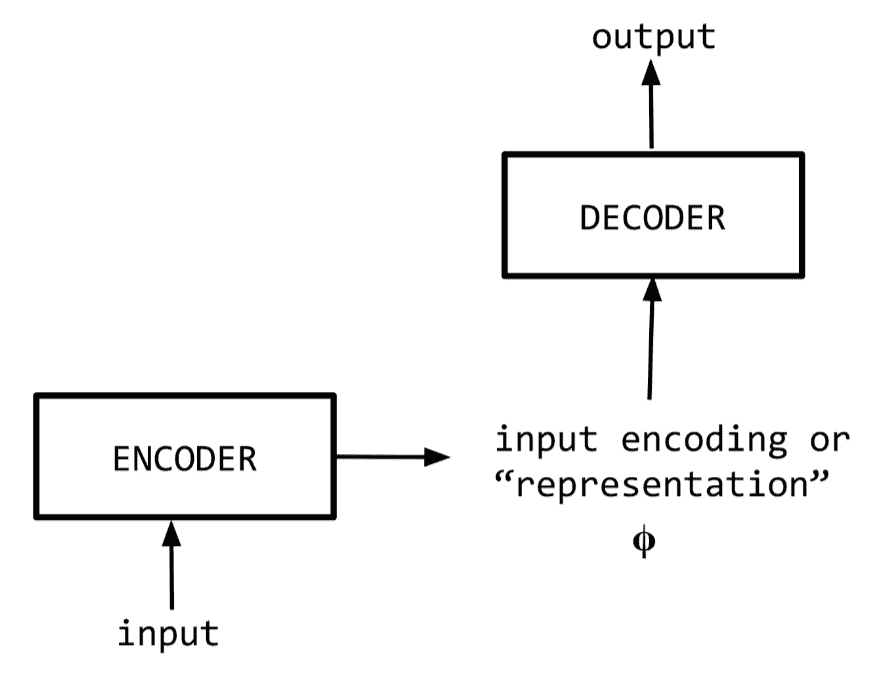

一种查看编码器-解码器模型的方法是将其作为称为条件生成模型的模型的特殊情况。在条件生成中,替代输入表示`ϕ`,一般条件上下文`c`影响译码器产生一个输出。当条件上下文`c`来自编码器模型时，条件生成与编码器-解码器模型相同。并非所有的条件生成模型都是编码器-解码器模型，因为条件上下文可能来自结构化源。以天气报告生成器为例。温度、湿度、风速和风向的值可以“调节”解码器，生成文本天气报告。在“模型 2:条件性姓氏生成模型”中，我们看到了一个基于国籍条件性姓氏生成的例子。图 8-2 展示了一些条件生成模型的实际示例。


在这一章中，我们深入研究了 S2S 模型，并在机器翻译任务的背景下进行了说明。考虑一个“智能”的 iOS/Android 键盘，它可以在你打字时自动将文本转换成表情符号。如果你输入`omg!`房子着火了!，你希望键盘输出类似内联输出的内容。注意，输出的长度（4 个标记）与输入的长度（6 个标记）不同。输出和输入之间的映射称为对齐，如图 8-3 所示。 

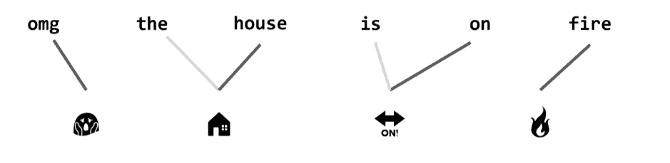

同样，在本例中，输入中的单个标记可以在输出中生成零个或多个标记。传统上，许多解决 S2S 问题的方法都是尝试使用工程和启发式重统计方法。虽然回顾这些方法超出了本章和本书的范围，但是我们建议您阅读 Koehn（2009）并参考 statmt.org 中的参考资料。

在第 6 章中，我们学习了序列模型如何将任意长度的序列编码成向量。在第 7 章中，我们看到单个向量如何使循环神经网络（RNN）有条件地产生不同的姓氏。S2S 模型是这些概念的自然延伸。

图 8 - 4 显示了编码器整个输入一个表示“编码”,`ϕ`,条件解码器生成正确的输出。您可以使用任何 RNN 作为编码器，无论是 Elman RNN, 长短期记忆（LSTM），还是门控单元（GRU），。在接下来的两个部分中，我们将介绍现代 S2S 模型的两个重要组件。首先，我们引入了双向递归模型，该模型将向前和向后传递组合在一个序列上，以创建更丰富的表示。然后，在“从序列中获取更多信息:注意力”中，我们介绍并考察了注意力机制，它在关注与任务相关的输入的不同部分时非常有用。这两个部分对于构建基于 S2S 模型的解决方案都非常重要。

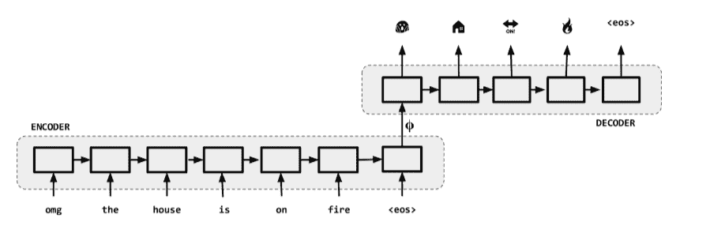

## 从序列中捕获更多：双向循环模型

理解递归模型的一种方法是把它看作一个将序列编码为向量的黑盒子。在建模序列时，不仅要观察过去的单词，而且还要观察将来出现的单词。考虑以下句子:`The man who hunts ducks out on the weekends.`。 如果模型只从左到右观察，那么`duck`的表示将不同于从右到左观察单词的模型。人类一直在做这种回溯性的更新。

因此，如果把过去和未来的信息结合在一起，就能够有力地按顺序表示一个单词的意思。这就是双向递归模型的目标。递归家族的任何模型，如 Elmann RNNs 或 LSTMs 或 GRUs，都可以用于这种双向表达。与第 6 章和第 7 章中的单向模型一样，双向模型可以用于分类和序列标记设置，我们需要预测输入中每个单词的一个标签。图 8-5 和图 8-6 详细说明了这一点。在图 8-6 中，`ϕ[love]`是表示、编码或该时刻网络的“隐藏的状态”,当输入的词是`love`。当我们讨论注意力时，这种状态信息在“从一个序列中获取更多信息:注意力”中变得很重要。

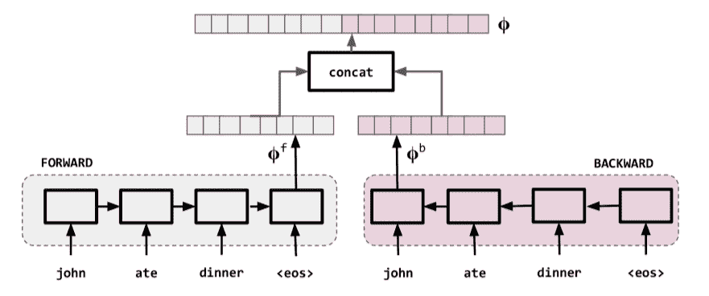

 

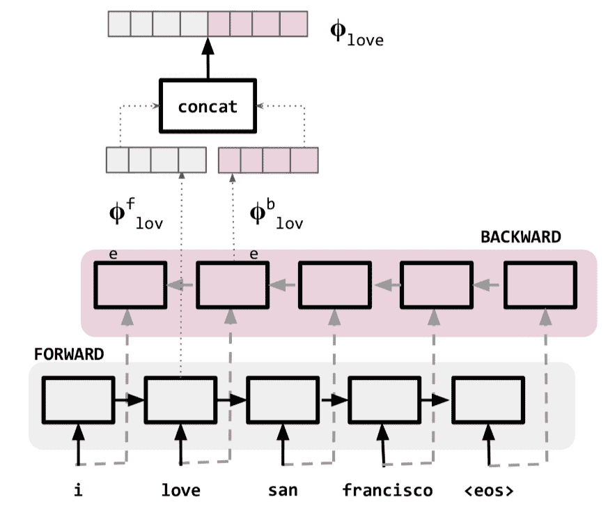

## 从序列中捕获更多：注意力

“序列到序列模型，编码器 - 解码器模型和条件生成”中引入的 S2S 模型公式的一个问题是它将整个输入句子变成单个向量（“编码”）`φ`并使用该编码生成输出，如图 8-7 所示。虽然这可能适用于非常短的句子，但对于长句，这样的模型无法捕获整个输入中的信息;例如，见 Bengio 等。 （1994）和 Le 和 Zuidema（2016）。这是仅使用最终隐藏状态作为编码的限制。长输入的另一个问题是，当长时间输入反向传播时，梯度消失，使训练变得困难。 

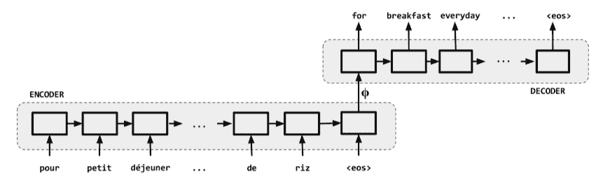

对于曾尝试翻译的双语/多语言读者来说，这种首先编码然后解码的过程可能会有点奇怪。作为人类，我们通常不会提炼句子的含义并从意义中产生翻译。对于图 8-7 中的示例，当我们看到`pour`，我们知道会有一个`for`； 类似地，当我们看到`petit-déjeuner`时，我们就会想到`breakfast`，等等。 换句话说，我们的思维在产生输出时专注于输入的相关部分。 这种现象称为注意力。 注意已经在神经科学和其他相关领域得到了广泛的研究，这使我们尽管记忆有限，却取得了相当的成功。 注意无处不在。 实际上，亲爱的读者，现在正在发生这种情况。 **现在每个你阅读的单词都受到注意**。 即使您记忆犹新，您可能也不会读整本书。 在阅读单词时，您会注意相邻的单词，可能是本节和本章的主题，等等。

以类似的方式，我们希望序列生成模型将注意力集中到输入的不同部分，而不仅仅是整个输入的最终总结。这就是注意力机制。第一个包含自然语言处理（NLP）注意概念的模型是 Bahdanau 等人（2015）的机器翻译模型。从那时起，人们提出了几种注意机制和提高注意的方法。在本节中，我们将回顾一些基本的注意机制，并介绍一些与注意相关的术语。事实证明，注意力对于改进输入和输出复杂的深度学习系统非常有用。事实上，Bahdanau 等人通过“BLEU 得分”（我们在“评估序列生成模型”中看到的）来衡量机器翻译系统的性能，当输入变长时，机器翻译系统在没有注意机制的情况下会下降，如图 8-8 所示。增加注意力可以解决问题。

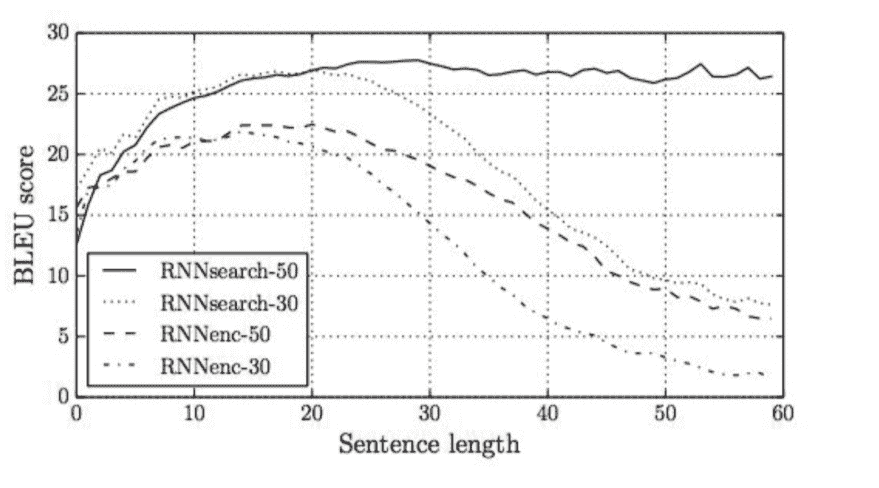

### 深度神经网络中的注意力

注意力是一种通用的机制，可以用于本书前面讨论过的任何一种模型。但我们在这里用编码器-解码器模型来描述它，因为这些模型是注意力机制真正发挥作用的地方。考虑一个 S2S 模型。回想一下,在一个典型的 S2S 模型中,每个时间步生成一个隐藏的状态表示,表示`ϕ[w]`,特定于该时间步的编码器。（如图 8-6 所示。）为了引起注意，我们不仅要考虑编码器的最终隐藏状态，还要考虑每个中间步骤的隐藏状态。这些编码器隐藏状态，在某种程度上是非信息性的，称为值。在某些情况下，编码器的隐藏状态也称为键。注意力还取决于调用查询的解码器的前一个隐藏状态。图 8-9 说明了时间步骤 0 的所有这些。时间步长`t=0`的查询向量是一个固定的超参数。注意由一个向量来表示，这个向量的维数与它所关注的值的维数相同。这被称为注意力向量，或注意力权重，有时也称为对齐。注意力权重与编码器状态（“值”）相结合，生成一个有时也称为瞥见的上下文向量。这个上下文向量成为解码器的输入，而不是完整的句子编码。使用兼容性函数更新下一个时间步骤的注意向量。相容函数的确切性质取决于所使用的注意机制。

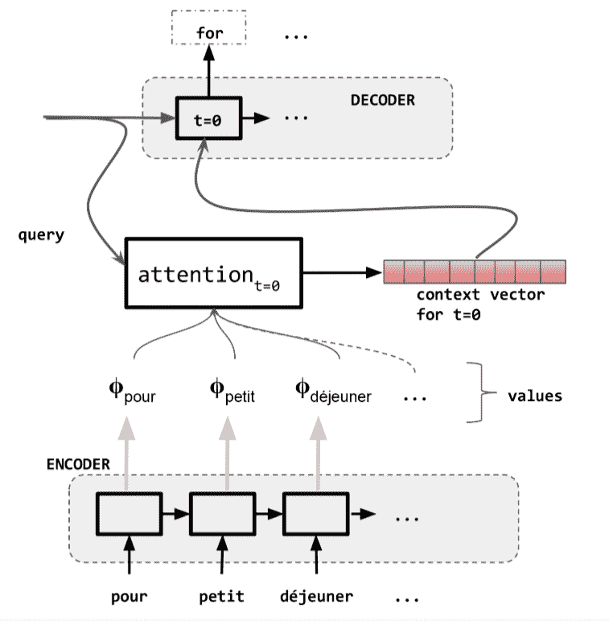

有几种方法可以实现关注。最简单和最常用的是内容感知机制。您可以在“示例：神经机器翻译”中看到内容感知注意力。另一种流行的注意机制是位置感知注意力，它仅依赖于查询向量和密钥。注意权重通常是 0 到 1 之间的浮点值。这称为软注意。相反，可以学习二进制 0/1 向量以引起注意。这被称为硬关注。

图 8-9 中所示的注意机制取决于输入中所有时间步长的编码器状态。这也被称为全球关注。相反，对于本地注意力，您可以设计一种注意机制，该机制仅依赖于当前时间步长周围的输入窗口。

有时，特别是在机器翻译中，可以明确地提供对齐信息作为训练数据的一部分。在这种情况下，可以设计受监督的注意力来使用共同训练的单独神经网络来学习注意力功能。对于诸如文档之类的大型输入，可以设计粗粒度到细粒度的注意机制，也称为分级注意，不仅关注立即输入，而且还考虑文档的结构 - 段落，部分，章节等。 Vaswani 等人对变压器网络的研究。 （2017），引入多头注意，其中多个注意向量用于跟踪输入的不同区域。他们还普及了自我关注的概念，这是一种机制，通过该机制，模型可以了解输入的哪些区域相互影响。

当输入是多模式时 - 例如，图像和语音 - 可以设计多模式注意力。关于注意力的文献虽然很新，但已经非常广泛，这表明了这一主题的重要性。详细介绍它们的每一个都超出了本书的范围，我们将引导您到 Luong，Pham 和 Manning（2011）以及 Vaswani 等人。 （2017）作为起点。

## 评估序列生成模型

当生成任务中可以看到多个有效答案时，精度，召回，准确度和 F1 等分类指标无法帮助模型 - 单个法语句子可以有多个英语翻译。序列模型根据称为参考输出的预期输出进行评估。在比较不同的模型时，我们使用分数来表明模型输出的“良好”与参考的接近程度。例如，在像机器翻译这样的任务中，如果一个模型只有一个单词关闭，我们可能不希望像另一个产生完全无法理解的答案的模型那样惩罚该模型。单个输入示例可以有多个参考输出。例如，对于特定的法语句子，可能存在多个有效的英语翻译，使用略微不同的单词。序列生成模型有两种评估：人工评估和自动评估。

人体评估涉及一个或多个人类受试者，要么对模型输出给出“竖起拇指”或“拇指向下”评级，要么进行编辑以纠正翻译。这导致了一个简单的“错误率”，它非常接近系统输出与人工任务相关的最终目标。人类评价很重要，但是很少使用，因为人类注释者往往是缓慢，昂贵和难以获得的。最后，人类也可能彼此不一致，并且，与任何其他金标准一样，人类评估与注释器间协议率配对。测量注释器间协议率也是另一个昂贵的主张。一种常见的人类评估指标是人为目标翻译错误率（HTER）。 HTER 是一个加权编辑距离，由人类为了合理充分的意义和流畅性而“修复”翻译输出而进行的插入，删除和转置次数计算得出（参见图 8-10）。

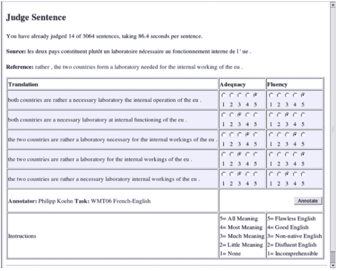

另一方面，自动评估操作简单快捷。有两种度量标准可用于自动评估生成的序列。我们再次使用机器翻译作为示例，但这些指标也适用于涉及生成序列的任何任务。这些指标包括基于 N 元组重叠的指标和困惑。基于 N 元组重叠的度量倾向于通过使用 N 元组重叠统计来计算得分来测量输出相对于参考的接近程度。 BLEU，ROUGE 和 METEOR 是基于 N 元组重叠的度量的示例。其中，BLEU 经受了时间的考验，成为机器翻译文献中的衡量标准。 BLEU 代表“双语评估学习”。我们跳过 BLEU 的确切表述，并建议您阅读 Papineni 等人。 （2002 年）。出于实际目的，我们使用像 NLTK7 或 SacreBLEU8 这样的包来计算分数。当参考数据可用时，BLEU 本身的计算非常快速和容易。

困惑是基于信息理论的另一种自动评估指标，您可以将其应用于可以测量输出序列概率的任何情况。对于序列`x`，如果`P(x)`是序列的概率，则困惑定义如下：

这为我们提供了一种比较不同序列生成模型的简单方法 - 测量保持数据集的模型的困惑度。虽然这很容易计算，但是当用于序列生成评估时，困惑会有许多问题。首先，它是一个膨胀的指标。请注意，困惑的表达式涉及取幂。因此，模型性能（可能性）的微小差异可能导致困惑的巨大差异，从而产生重大进展的错觉。其次，对困惑的改变可能不会转化为通过其他指标观察到的模型错误率的相应变化。最后，就像 BLEU 和其他基于 N 元组的指标一样，困惑的改善可能不会转化为人类判断的可察觉的改进。

在下一节中，我们将跟进机器翻译示例，并通过 PyTorch 实现将这些概念巧妙地结合在一起。

## 示例：神经机器翻译

在本例中，我们将介绍 S2S 模型最常用的实现:机器翻译。随着深度学习在 2010 年代早期的流行，很明显，使用嵌入词汇和 RNNs 是一种非常强大的两种语言之间的翻译方法——只要有足够的数据。引入“序列生成模型评价”中的注意机制，进一步完善了机器翻译模型。在这一部分，我们描述了一个基于 Luong, Pham, 和 Manning（2015）的实现，它简化了 S2S 模型中的注意方法。

我们首先概述数据集和神经机器翻译所需的特殊记账类型。数据集是一个平行的语料库;它由成对的英语句子和相应的法语翻译组成。因为我们正在处理两个可能不同长度的序列，所以我们需要跟踪输入序列和输出序列的最大长度和词汇。在大多数情况下，这个例子是对完整读者在前几章中所看到的内容的直接扩展。

在覆盖数据集和簿记数据结构之后，我们通过参与源序列中的不同位置来遍历模型以及它如何生成目标序列。我们模型中的编码器使用双向 GRU（bi-GRU）来计算源序列中每个位置的向量，这些向量由序列的所有部分通知。为此，我们使用 PyTorch 的`PackedSequences`数据结构。我们在“NMT 模型中的编码和解码”中更深入地介绍了这一点。在“从序列捕获更多：注意力”中讨论的注意机制应用于 bi-GRU 的输出并用于调节目标序列生成。我们讨论模型的结果以及在“训练常规和结果”中可以改进的方法。

### 机器翻译数据集

对于此示例，我们使用来自 Tatoeba Project 的英语 - 法语句子对的数据集.数据预处理首先将所有句子设为小写，并将 NLTK 的英语和法语标记符应用于每个句子对。接下来，我们应用 NLTK 的特定于语言的单词标记生成器来创建标记列表。即使我们进行了进一步的计算，我们将在下一段中描述，但这个标记列表是一个预处理的数据集。

## 除了刚刚描述的标准预处理之外，我们还使用指定的语法模式列表来选择数据的子集，以简化学习问题。从本质上讲，这意味着我们将数据范围缩小到只有有限范围的句法模式。反过来，这意味着在训练期间，模型将看到更少的变化，并在更短的训练时间内具有更高的性能。

Note

## 在构建新模型和尝试新体系结构时，您应该在建模选择和评估这些选择之间实现更快的迭代周期。

我们用来选择数据子集的句法模式是以`I am`，`he is`，`she is`，`they are`，`you are`或`we are`开头的英语句子。数据集从 135,842 个句子对减少到 13,062 个句子对，系数为 10。为了最终确定学习设置，我们将剩余的 13,062 个句子对分为 70% 训练，15% 验证和 15% 测试分裂。从刚刚列出的语法开始的每个句子的比例通过首先按句子开始分组，从这些组创建分割，然后合并每个组的分割来保持不变。

### NMT 向量化流水线

对源英语和目标法语句子进行向量化需要比前面章节中看到的更复杂的管道。复杂性增加有两个原因。首先，源序列和目标序列在模型中具有不同的角色，属于不同的语言，并且以两种不同的方式进行向量化。其次，作为使用 PyTorch 的`PackedSequences`的先决条件，我们按源句的长度对每个小批量进行排序。为了准备这两个复杂性，`NMTVectorizer`实例化了两个独立的`SequenceVocabulary`对象和两个最大序列长度的测量，如例 8-1 所示。 

示例 8-1：构造`NMTVectorizer`

```py
class NMTVectorizer(object):
    """ The Vectorizer which coordinates the Vocabularies and puts them to use"""
    def __init__(self, source_vocab, target_vocab, max_source_length,
                 max_target_length):
        """
        Args:
            source_vocab (SequenceVocabulary): maps source words to integers
            target_vocab (SequenceVocabulary): maps target words to integers
            max_source_length (int): the longest sequence in the source dataset
            max_target_length (int): the longest sequence in the target dataset
        """
        self.source_vocab = source_vocab
        self.target_vocab = target_vocab

        self.max_source_length = max_source_length
        self.max_target_length = max_target_length

    @classmethod
    def from_dataframe(cls, bitext_df):
        """Instantiate the vectorizer from the dataset dataframe

        Args:
            bitext_df (pandas.DataFrame): the parallel text dataset
        Returns:
            an instance of the NMTVectorizer
        """
        source_vocab = SequenceVocabulary()
        target_vocab = SequenceVocabulary()
        max_source_length, max_target_length = 0, 0

        for _, row in bitext_df.iterrows():
            source_tokens = row["source_language"].split(" ")
            if len(source_tokens) > max_source_length:
                max_source_length = len(source_tokens)
            for token in source_tokens:
                source_vocab.add_token(token)

            target_tokens = row["target_language"].split(" ")
            if len(target_tokens) > max_target_length:
                max_target_length = len(target_tokens)
            for token in target_tokens:
                target_vocab.add_token(token)

        return cls(source_vocab, target_vocab, max_source_length,
                   max_target_length

```

复杂性的第一个增加是处理源序列和目标序列的不同方式。源序列在开始时插入`BEGIN-OF-SEQUENCE`进行向量化，并将`END-OF-SEQUENCE`标记添加到结尾。该模型使用 bi-GRU 为源句子中的每个标记创建摘要向量，并且这些摘要向量极大地受益于具有句子边界的指示。相反，目标序列被向量化为两个副本，偏移一个标记：第一个副本需要`BEGIN-OF-SEQUENCE`标记，第二个副本需要`END-OF-SEQUENCE`标记。如果您从第 7 章回忆起来，序列预测任务需要在每个时间步骤观察输入标记和输出标记。 S2S 模型中的解码器正在执行此任务，但增加了编码器上下文的可用性。为了解决这种复杂性，我们制定了核心向量化方法`_vectorize`，无论它是源索引还是目标索引都无关紧要。然后，编写两个方法来分别处理源索引和目标索引。最后，使用`NMTVectorizer.vectorize`方法协调这些索引集，该方法是数据集调用的方法。例 8-2 显示了代码。

```py
class NMTVectorizer(object):
    """ The Vectorizer which coordinates the Vocabularies and puts them to use"""
    def _vectorize(self, indices, vector_length=-1, mask_index=0):
        """Vectorize the provided indices

        Args:
            indices (list): a list of integers that represent a sequence
            vector_length (int): an argument for forcing the length of index vector
            mask_index (int): the mask_index to use; almost always 0
        """
        if vector_length < 0:
            vector_length = len(indices)
        vector = np.zeros(vector_length, dtype=np.int64)
        vector[:len(indices)] = indices
        vector[len(indices):] = mask_index
        return vector

    def _get_source_indices(self, text):
        """Return the vectorized source text

        Args:
            text (str): the source text; tokens should be separated by spaces
        Returns:
            indices (list): list of integers representing the text
        """
        indices = [self.source_vocab.begin_seq_index]
        indices.extend(self.source_vocab.lookup_token(token)
                       for token in text.split(" "))
        indices.append(self.source_vocab.end_seq_index)
        return indices

    def _get_target_indices(self, text):
        """Return the vectorized source text

        Args:
            text (str): the source text; tokens should be separated by spaces
        Returns:
            a tuple: (x_indices, y_indices)
                x_indices (list): list of ints; observations in target decoder
                y_indices (list): list of ints; predictions in target decoder
        """
        indices = [self.target_vocab.lookup_token(token)
                   for token in text.split(" ")]
        x_indices = [self.target_vocab.begin_seq_index] + indices
        y_indices = indices + [self.target_vocab.end_seq_index]
        return x_indices, y_indices

    def vectorize(self, source_text, target_text, use_dataset_max_lengths=True):
        """Return the vectorized source and target text

        Args:
            source_text (str): text from the source language
            target_text (str): text from the target language
            use_dataset_max_lengths (bool): whether to use the max vector lengths
        Returns:
            The vectorized data point as a dictionary with the keys:
                source_vector, target_x_vector, target_y_vector, source_length
        """
        source_vector_length = -1
        target_vector_length = -1

        if use_dataset_max_lengths:
            source_vector_length = self.max_source_length + 2
            target_vector_length = self.max_target_length + 1

        source_indices = self._get_source_indices(source_text)
        source_vector = self._vectorize(source_indices,
                                        vector_length=source_vector_length,
                                        mask_index=self.source_vocab.mask_index)

        target_x_indices, target_y_indices = self._get_target_indices(target_text)
        target_x_vector = self._vectorize(target_x_indices,
                                        vector_length=target_vector_length,
                                        mask_index=self.target_vocab.mask_index)
        target_y_vector = self._vectorize(target_y_indices,
                                        vector_length=target_vector_length,
                                        mask_index=self.target_vocab.mask_index)
        return {"source_vector": source_vector,
                "target_x_vector": target_x_vector,
                "target_y_vector": target_y_vector,
                "source_length": len(source_indices)}

```

复杂性的第二次增加再次来自源序列。为了使用 bi-GRU 对源序列进行编码，我们使用 PyTorch 的`PackedSequences`数据结构。通常，可变长度序列的小批量数字表示为整数矩阵中的行，其中每个序列左对齐并且零填充以适应可变长度。 `PackedSequences`数据结构通过在每个时间步，一个接一个地连接序列的数据并知道每个时间步的序列数，将可变长度序列表示为数组，如图 8-11 所示。

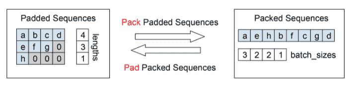

创建`PackedSequence`有两个先决条件：了解每个序列的长度，并按源序列的长度按降序对序列进行排序。为了反映这个新排序的矩阵，小批量中的剩余张量按相同的顺序排序，以便它们与源序列编码保持一致。在例 8-3 中，`generate_batches`函数被修改为`generate_nmt_batches`函数。

示例 8-3：为 NMT 示例生成小批量

```py
def generate_nmt_batches(dataset, batch_size, shuffle=True,
                            drop_last=True, device="cpu"):
    """A generator function which wraps the PyTorch DataLoader; NMT Version """
    dataloader = DataLoader(dataset=dataset, batch_size=batch_size,
                            shuffle=shuffle, drop_last=drop_last)

    for data_dict in dataloader:
        lengths = data_dict['x_source_length'].numpy()
        sorted_length_indices = lengths.argsort()[::-1].tolist()

        out_data_dict = {}
        for name, tensor in data_dict.items():
            out_data_dict[name] = data_dict[name][sorted_length_indices].to(device)
        yield out_data_dict

```

### NMT 模型的编码和解码

在这个例子中，我们从源序列开始 - 一个英语句子 - 我们生成一个目标序列 - 相应的法语翻译。标准方法是使用“序列到序列模型，编码器 - 解码器模型和条件生成”中描述的编码器 - 解码器模型。在示例 8-4 和示例 8-5 中呈现的模型中，编码器首先将每个源序列映射到具有 bi-GRU 的向量状态序列（参见“从序列中捕获更多：双向递归模型”）。然后，解码器以解码器的隐藏状态作为其初始隐藏状态开始，并使用注意机制（参见“从序列中捕获更多：注意”）来选择源序列中的不同信息以生成输出序列。在本节的其余部分，我们将更详细地解释此过程。

示例 8-4：`NMTModel`在单个前向方法中封装和协调了编码器和解码器

```py
class NMTModel(nn.Module):
    """ A Neural Machine Translation Model """
    def __init__(self, source_vocab_size, source_embedding_size,
                 target_vocab_size, target_embedding_size, encoding_size,
                 target_bos_index):
        """
        Args:
            source_vocab_size (int): number of unique words in source language
            source_embedding_size (int): size of the source embedding vectors
            target_vocab_size (int): number of unique words in target language
            target_embedding_size (int): size of the target embedding vectors
            encoding_size (int): the size of the encoder RNN.
            target_bos_index (int): index for BEGIN-OF-SEQUENCE token
        """
        super(NMTModel, self).__init__()
        self.encoder = NMTEncoder(num_embeddings=source_vocab_size,
                                  embedding_size=source_embedding_size,
                                  rnn_hidden_size=encoding_size)
        decoding_size = encoding_size * 2
        self.decoder = NMTDecoder(num_embeddings=target_vocab_size,
                                  embedding_size=target_embedding_size,
                                  rnn_hidden_size=decoding_size,
                                  bos_index=target_bos_index)

    def forward(self, x_source, x_source_lengths, target_sequence):
        """The forward pass of the model

        Args:
            x_source (torch.Tensor): the source text data tensor.
                x_source.shape should be (batch, vectorizer.max_source_length)
            x_source_lengths torch.Tensor): the length of the sequences in x_source
            target_sequence (torch.Tensor): the target text data tensor
        Returns:
            decoded_states (torch.Tensor): prediction vectors at each output step
        """
        encoder_state, final_hidden_states = self.encoder(x_source,
                                                          x_source_lengths)
        decoded_states = self.decoder(encoder_state=encoder_state,
                                      initial_hidden_state=final_hidden_states,
                                      target_sequence=target_sequence)
        return decoded_states

```

## 编码器

示例 8-5：编码器嵌入了源单词和使用 bi-GPU 提取的特征

```py
class NMTEncoder(nn.Module):
    def __init__(self, num_embeddings, embedding_size, rnn_hidden_size):
        """
        Args:
            num_embeddings (int): size of source vocabulary
            embedding_size (int): size of the embedding vectors
            rnn_hidden_size (int): size of the RNN hidden state vectors
        """
        super(NMTEncoder, self).__init__()

        self.source_embedding = nn.Embedding(num_embeddings, embedding_size,
                                             padding_idx=0)
        self.birnn = nn.GRU(embedding_size, rnn_hidden_size, bidirectional=True,
                            batch_first=True)

    def forward(self, x_source, x_lengths):
        """The forward pass of the model

        Args:
            x_source (torch.Tensor): the input data tensor.
                x_source.shape is (batch, seq_size)
            x_lengths (torch.Tensor): vector of lengths for each item in the batch
        Returns:
            a tuple: x_unpacked (torch.Tensor), x_birnn_h (torch.Tensor)
                x_unpacked.shape = (batch, seq_size, rnn_hidden_size * 2)
                x_birnn_h.shape = (batch, rnn_hidden_size * 2)
        """
        x_embedded = self.source_embedding(x_source)
        # create PackedSequence; x_packed.data.shape=(number_items, embedding_size)
        x_lengths = x_lengths.detach().cpu().numpy()
        x_packed = pack_padded_sequence(x_embedded, x_lengths, batch_first=True)

        # x_birnn_h.shape = (num_rnn, batch_size, feature_size)
        x_birnn_out, x_birnn_h  = self.birnn(x_packed)
        # permute to (batch_size, num_rnn, feature_size)
        x_birnn_h = x_birnn_h.permute(1, 0, 2)

        # flatten features; reshape to (batch_size, num_rnn * feature_size)
        #  (recall: -1 takes the remaining positions,
        #           flattening the two RNN hidden vectors into 1)
        x_birnn_h = x_birnn_h.contiguous().view(x_birnn_h.size(0), -1)

        x_unpacked, _ = pad_packed_sequence(x_birnn_out, batch_first=True)
        return x_unpacked, x_birnn_h

```

通常，编码器将整数序列作为输入，并为每个位置创建特征向量。在该示例中，编码器的输出是这些向量以及用于制作特征向量的 bi-GRU 的最终隐藏状态。该隐藏状态用于在下一节中初始化解码器的隐藏状态。

深入了解编码器，我们首先使用嵌入层嵌入输入序列。通常，只需在嵌入层上设置`padding_idx`标志，我们就可以使模型处理可变长度序列，因为任何等于`padding_idx`的位置都会被赋予零值向量，该向量在优化期间不会更新。回想一下，这被称为面具。然而，在这种编码器 - 解码器模型中，掩蔽位置需要以不同方式处理，因为我们使用 bi-GRU 来编码源序列。主要原因是后向分量可能受到屏蔽位置的影响，其因子与在序列上开始之前遇到的屏蔽位置的数量成比例。

为了处理 bi-GRU 中可变长度序列的掩码位置，我们使用 PyTorch 的`PackedSequence`数据结构。 `PackedSequences`源自 CUDA 如何允许以批量格式处理可变长度序列。如果满足两个条件，则可以将任何零填充序列（例如示例 8-6 中所示的编码器中的嵌入源序列）转换为`PackedSequence`：提供每个序列的长度，并根据以下顺序对小批量进行排序。这些序列的长度。这在图 8-11 中以可视方式显示，因为它是一个复杂的主题，我们在例 8-6 及其输出中再次演示它.

示例 8-6：`packed_padded_sequences`和`pad_packed_sequences`的简单演示

```py
Input[0]
abcd_padded = torch.tensor([1, 2, 3, 4], dtype=torch.float32)
efg_padded = torch.tensor([5, 6, 7, 0], dtype=torch.float32)
h_padded = torch.tensor([8, 0, 0, 0], dtype=torch.float32)

padded_tensor = torch.stack([abcd_padded, efg_padded, h_padded])

describe(padded_tensor)
Output[0]
Type: torch.FloatTensor
Shape/size: torch.Size([3, 4])
Values:
tensor([[ 1.,  2.,  3.,  4.],
        [ 5.,  6.,  7.,  0.],
        [ 8.,  0.,  0.,  0.]])
Input[1]
lengths = [4, 3, 1]
packed_tensor = pack_padded_sequence(padded_tensor, lengths,   
                                     batch_first=True)
packed_tensor
Output[1]
PackedSequence(data=tensor([ 1.,  5.,  8.,  2.,  6.,  3.,  7.,  4.]),
               batch_sizes=tensor([ 3,  2,  2,  1]))
Input[2]
unpacked_tensor, unpacked_lengths = \
    pad_packed_sequence(packed_tensor, batch_first=True)

describe(unpacked_tensor)
describe(unpacked_lengths)
Output[2]
Type: torch.FloatTensor
Shape/size: torch.Size([3, 4])
Values:
tensor([[ 1.,  2.,  3.,  4.],
        [ 5.,  6.,  7.,  0.],
        [ 8.,  0.,  0.,  0.]])
Type: torch.LongTensor
Shape/size: torch.Size([3])
Values:
tensor([ 4,  3,  1])

```

我们在生成每个小批量时处理排序，如上一节所述。然后，如例 8-7 所示，通过传递嵌入的序列，序列的长度和表示第一个维度是批量维度的布尔标志来激发 PyTorch 的`pack_padded_sequence`函数。此函数的输出是`PackedSequence`。将得到的`PackedSequence`输入到 bi-GRU 中以为下游解码器创建状态向量。使用另一个布尔标志将 bi-GRU 的输出解压缩为完整张量，指示批量在第一维上。解包操作，如图 8-11 所示，将每个屏蔽位置 15 设置为零值向量，保留下游计算的完整性。

示例 8-7：NMT 解码器从编码的源句子中构造目标句子

```py
class NMTDecoder(nn.Module):
    def __init__(self, num_embeddings, embedding_size, rnn_hidden_size, bos_index):
        """
        Args:
            num_embeddings (int): number of embeddings is also the number of
                unique words in target vocabulary
            embedding_size (int): the embedding vector size
            rnn_hidden_size (int): size of the hidden rnn state
            bos_index(int): begin-of-sequence index
        """
        super(NMTDecoder, self).__init__()
        self._rnn_hidden_size = rnn_hidden_size
        self.target_embedding = nn.Embedding(num_embeddings=num_embeddings,
                                             embedding_dim=embedding_size,
                                             padding_idx=0)
        self.gru_cell = nn.GRUCell(embedding_size + rnn_hidden_size,
                                   rnn_hidden_size)
        self.hidden_map = nn.Linear(rnn_hidden_size, rnn_hidden_size)
        self.classifier = nn.Linear(rnn_hidden_size * 2, num_embeddings)
        self.bos_index = bos_index

    def _init_indices(self, batch_size):
        """ return the BEGIN-OF-SEQUENCE index vector """
        return torch.ones(batch_size, dtype=torch.int64) * self.bos_index

    def _init_context_vectors(self, batch_size):
        """ return a zeros vector for initializing the context """
        return torch.zeros(batch_size, self._rnn_hidden_size)

    def forward(self, encoder_state, initial_hidden_state, target_sequence):
        """The forward pass of the model

        Args:
            encoder_state (torch.Tensor): the output of the NMTEncoder
            initial_hidden_state (torch.Tensor): The last hidden state in the  NMTEncoder
            target_sequence (torch.Tensor): the target text data tensor
            sample_probability (float): the schedule sampling parameter
                probability of using model's predictions at each decoder step
        Returns:
            output_vectors (torch.Tensor): prediction vectors at each output step
        """
        # We are making an assumption there: The batch is on first
        # The input is (Batch, Seq)
        # We want to iterate over sequence so we permute it to (S, B)
        target_sequence = target_sequence.permute(1, 0)

        # use the provided encoder hidden state as the initial hidden state
        h_t = self.hidden_map(initial_hidden_state)

        batch_size = encoder_state.size(0)
        # initialize context vectors to zeros
        context_vectors = self._init_context_vectors(batch_size)
        # initialize first y_t word as BOS
        y_t_index = self._init_indices(batch_size)

        h_t = h_t.to(encoder_state.device)
        y_t_index = y_t_index.to(encoder_state.device)
        context_vectors = context_vectors.to(encoder_state.device)

        output_vectors = []
        # All cached tensors are moved from the GPU and stored for analysis
        self._cached_p_attn = []
        self._cached_ht = []
        self._cached_decoder_state = encoder_state.cpu().detach().numpy()

        output_sequence_size = target_sequence.size(0)
        for i in range(output_sequence_size):

            # Step 1: Embed word and concat with previous context
            y_input_vector = self.target_embedding(target_sequence[i])
            rnn_input = torch.cat([y_input_vector, context_vectors], dim=1)

            # Step 2: Make a GRU step, getting a new hidden vector
            h_t = self.gru_cell(rnn_input, h_t)
            self._cached_ht.append(h_t.cpu().data.numpy())

            # Step 3: Use the current hidden to attend to the encoder state
            context_vectors, p_attn, _ = \
                verbose_attention(encoder_state_vectors=encoder_state,
                                  query_vector=h_t)

            # auxiliary: cache the attention probabilities for visualization
            self._cached_p_attn.append(p_attn.cpu().detach().numpy())

            # Step 4: Use the current hidden and context vectors
            #         to make a prediction to the next word
            prediction_vector = torch.cat((context_vectors, h_t), dim=1)
            score_for_y_t_index = self.classifier(prediction_vector)

            # auxiliary: collect the prediction scores
            output_vectors.append(score_for_y_t_index)

```

在编码器利用其 bi-GRU 和打包 - 解包协调创建状态向量之后，解码器在时间步骤上迭代以生成输出序列。在功能上，这个循环应该看起来与第 7 章中的生成循环非常相似，但是有一些差异明显是 Luong 等人的注意方式的方法选择。首先，在每个时间步骤提供目标序列作为观察。通过使用`GRUCell`计算隐藏状态。通过将线性层应用于编码器 bi-GRU 的级联最终隐藏状态来计算初始隐藏状态.在每个时间步骤处对解码器 GRU 的输入是嵌入输入标记和最后时间步骤的上下文的级联向量。向量。上下文向量旨在捕获对该时间步骤有用的信息，并用于调节模型的输出。对于第一个步骤，上下文向量全部为 0（零）以表示无上下文并且在数学上仅允许输入对 GRU 计算做出贡献。

使用新的隐藏状态作为查询向量，使用当前时间步骤的关注机制创建一组新的上下文向量。这些上下文向量与隐藏状态连接以创建表示该时间步长处的解码信息的向量。该解码信息状态向量用在分类器（在这种情况下，简单的线性层）中以创建预测向量`score_for_y_t_index`。这些预测向量可以使用 softmax 函数转换为输出词汇表上的概率分布，或者它们可以与交叉熵损失一起使用以优化地面实况目标。在我们转向如何在训练例程中使用预测向量之前，我们首先检查注意力计算本身。

## 注意力的详细解释

了解注意机制在此示例中的工作方式非常重要。回想一下前面的部分，可以使用查询，键和值来描述注意机制。分数函数将查询向量和关键向量作为输入，以计算在值向量中选择的一组权重。在这个例子中，我们使用点积评分函数，但它不是唯一的.在这个例子中，解码器的隐藏状态被用作查询向量，编码器状态向量集是关键和值向量。

解码器隐藏状态与编码器状态中的向量的点积为编码序列中的每个项创建标量。在使用 softmax 函数时，这些标量变为编码器状态中的向量的概率分布。这些概率用于在将编码器状态向量加在一起之前对其进行加权，以产生每个批次项目的单个向量。总而言之，允许解码器隐藏状态在每个时间步骤优先加权编码器状态。这就像一个聚光灯，使模型能够学习如何突出显示生成输出序列所需的信息。我们在例 8-8 中演示了这种版本的注意机制。第一个尝试详细说明操作。此外，它使用视图操作插入大小为 1 的维度，以便可以针对另一个张量广播张量。在`terse_attention`版本中，视图操作被更常用的练习替换，取消压缩。此外，不是将元素和求和相乘，而是使用更有效的`matmul`运算。

示例 8-8：注意力更加显式地执行逐元素乘法和求和

```py
def verbose_attention(encoder_state_vectors, query_vector):
    """
    encoder_state_vectors: 3dim tensor from bi-GRU in encoder
    query_vector: hidden state in decoder GRU
    """
    batch_size, num_vectors, vector_size = encoder_state_vectors.size()
    vector_scores = \
        torch.sum(encoder_state_vectors * query_vector.view(batch_size, 1,
                                                            vector_size),
                  dim=2)
    vector_probabilities = F.softmax(vector_scores, dim=1)
    weighted_vectors = \
        encoder_state_vectors * vector_probabilities.view(batch_size,
                                                          num_vectors, 1)
    context_vectors = torch.sum(weighted_vectors, dim=1)
    return context_vectors, vector_probabilities

def terse_attention(encoder_state_vectors, query_vector):
    """
    encoder_state_vectors: 3dim tensor from bi-GRU in encoder
    query_vector: hidden state
    """
    vector_scores = torch.matmul(encoder_state_vectors,
                                 query_vector.unsqueeze(dim=2)).squeeze()
    vector_probabilities = F.softmax(vector_scores, dim=-1)
    context_vectors = torch.matmul(encoder_state_vectors.transpose(-2, -1),
                                   vector_probabilities.unsqueeze(dim=2)).squeeze()
    return context_vectors, vector_probabilities

```

LEARNING TO SEARCH AND SCHEDULED SAMPLING

当前编写的方式，模型假定提供了目标序列，并将在解码器的每个时间步骤用作输入。在测试时，违反了这个假设，因为模型不能作弊并且知道它试图生成的序列。为了适应这一事实，一种技术是允许模型在训练期间使用自己的预测。这是一种在文献中探索为“学习搜索”和“预定抽样”的技术.理解这种技术的一种直观方法是将预测问题视为搜索问题。在每个时间步，模型有许多路径可供选择（选择的数量是目标词汇的大小），数据是正确路径的观察。在测试时，模型最终被允许“离开路径”，因为没有提供正确的路径，它应该从中计算概率分布。因此，让模型采样自己的路径的技术提供了一种方法，在该方法中，当模型偏离数据集中的目标序列时，可以优化模型以获得更好的概率分布。

代码有三个主要修改，以使模型在训练期间采样自己的预测。首先，初始索引更明确地作为`BEGIN-OF-SEQUENCE`标记索引。其次，为生成循环中的每个步骤绘制随机样本，如果随机样本小于样本概率，则在该迭代期间使用模型的预测。最后，第三个实际采样本身在条件`if`下使用`use_sample`。在示例 8-9 中，注释行显示了如何使用最大预测，而未注释行显示了如何以与其概率成比例的速率实际采样索引。

示例 8-9：在前向过程中构建的带有采样过程的解码器（粗体）

```py
class NMTDecoder(nn.Module):
    def __init__(self, num_embeddings, embedding_size, rnn_size, bos_index):
        super(NMTDecoder, self).__init__()
        # ... other init code here ...

        # arbitrarily set; any small constant will be fine
        self._sampling_temperature = 3

   def forward(self, encoder_state, initial_hidden_state, target_sequence,
               sample_probability=0.0):
        if target_sequence is None:
            sample_probability = 1.0
        else:
            # We are making an assumption there: The batch is on first
            # The input is (Batch, Seq)
            # We want to iterate over sequence so we permute it to (S, B)
            target_sequence = target_sequence.permute(1, 0)
            output_sequence_size = target_sequence.size(0)

        # ... nothing changes from the other implementation

        output_sequence_size = target_sequence.size(0)
        for i in range(output_sequence_size):
            # new: a helper boolean and the teacher y_t_index
            use_sample = np.random.random() < sample_probability
            if not use_sample:
                y_t_index = target_sequence[i]

            # Step 1: Embed word and concat with previous context
            # ... code omitted for space
            # Step 2: Make a GRU step, getting a new hidden vector
            # ... code omitted for space
            # Step 3: Use the current hidden to attend to the encoder state
            # ... code omitted for space
            # Step 4: Use the current hidden and context vectors
            #         to make a prediction to the next word
            prediction_vector = torch.cat((context_vectors, h_t), dim=1)
            score_for_y_t_index = self.classifier(prediction_vector)
            # new: sampling if boolean is true.
            if use_sample:
                # sampling temperature forces a peakier distribution
                p_y_t_index = F.softmax(score_for_y_t_index *
                                        self._sampling_temperature, dim=1)
                # method 1: choose most likely word
                # _, y_t_index = torch.max(p_y_t_index, 1)
                # method 2: sample from the distribution
                y_t_index = torch.multinomial(p_y_t_index, 1).squeeze()

            # auxiliary: collect the prediction scores
            output_vectors.append(score_for_y_t_index)

        output_vectors = torch.stack(output_vectors).permute(1, 0, 2)

        return output_vectors

```

### 训练例程和结果

此示例的训练例程几乎与前面章节中介绍的训练例程相同。对于固定数量的历元，我们在称为小批量的块中迭代数据集。然而，这里的每个小批量由四个张量组成：源序列的整数矩阵，目标序列的两个整数矩阵，以及源序列长度的整数向量。两个靶序列矩阵是靶序列偏移 1 并用`BEGIN-OF-SEQUENCE`标记填充以充当靶序列观察，或`END-OF-SEQUENCE`标记充当靶序列预测标记。该模型将源序列和​​目标序列观察作为输入，以产生目标序列预测。在损失函数中使用目标序列预测标签来计算交叉熵损失，然后将其反向传播到每个模型参数以使其知道其梯度。然后调用优化器并将每个模型参数更新一些与梯度成比例的量。

除了数据集的训练部分上的循环之外，验证部分上还有一个循环。验证分数用作模型改进的偏差较小的度量。该过程与训练例程相同，只是模型处于求值模式并且模型未相对于验证数据更新。

在训练模型之后，测量性能成为一个重要而重要的问题。在“评估序列生成模型”中描述了几个序列生成评估度量，但是诸如测量预测句子和参考语句之间的 N 元组的重叠的 BLEU 的度量已经成为机器翻译领域的标准。聚合结果的评估代码已被省略，但您可以在本书的随附代码库中找到它.在代码中，模型的输出与源句子，参考目标语句和注意概率矩阵聚合在一起。例。最后，为每对源和生成的句子计算 BLEU-4。

为了定性评估模型的工作情况，我们将注意概率矩阵可视化为源和生成文本之间的对齐。然而，值得注意的是，最近的研究表明，基于注意力的对齐与经典机器翻译中的对齐并不完全相同。基于注意力的对齐分数可以指示解码器的有用信息，例如在生成输出动词时参与句子的主语（Koehn 和 Knowles，2017），而不是单词和短语之间的对齐指示翻译同义词。

我们比较了我们模型的两个版本，它们与目标句子的交互方式不同。第一个版本使用提供的目标序列作为解码器中每个时间步的输入。第二个版本使用预定采样，以允许模型将其自己的预测视为解码器中的输入。这有利于强制模型优化其自身的错误。表 8-1 显示了 BLEU 分数。重要的是要记住，为了便于训练，我们选择了标准 NMT 任务的简化版本，这就是为什么分数似乎高于您在研究文献中通常会发现的分数。虽然第二个模型，即具有预定采样的模型，具有更高的 BLEU 分数，但是得分相当接近。但这些得分究竟意味着什么呢？为了研究这个问题，我们需要定性地检查模型。

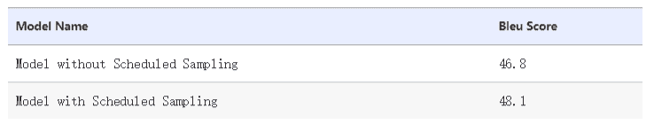

对于我们更深入的检查，我们绘制注意力分数，以查看它们是否在源句和目标句之间提供任何类型的对齐信息。我们发现在这次检查中两个模型之间形成了鲜明的对比.图 8-12 显示了具有预定采样的模型的每个解码器时间步长的注意概率分布。在该模型中，注意权重对于从数据集的验证部分采样的句子排列得相当好。

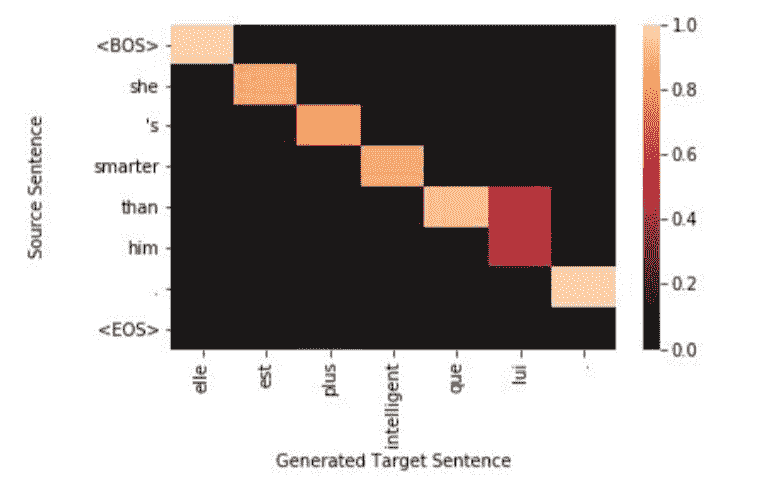

## 总结

本章重点介绍了在所谓的条件生成模型的条件上下文中生成序列输出。当条件上下文本身来自另一个序列时，我们将其称为序列到序列或 S2S 模型。我们还讨论了 S2S 模型如何成为编码器 - 解码器模型的特例。为了充分利用序列，我们讨论了第 6 章和第 7 章中讨论的序列模型的结构变体，特别是双向模型。我们还学习了如何结合注意机制来有效捕获更长距离的背景。最后，我们讨论了如何评估序列到序列模型，并使用端到端机器翻译示例进行演示。到目前为止，我们已将本书的每一章专门用于特定的网络架构。在下一章中，我们将前面的所有章节结合在一起，并查看如何使用各种模型体系结构的综合构建许多真实系统的示例。

## 参考

1.  `Yoshua Bengio, Patrice Simard, and Paolo Frasconi. (1994). "Learning long-term dependencies with gradient descent is difficult." IEEE transactions on neural networks.`

2.  `Kishore Papineni, Salim Roukos, Todd Ward, and Wei-Jing Zhu. (2002) "BLEU: a method for automatic evaluation of machine translation." In Proceedings ACL.. Hal Daumé III, John Langford, Daniel Marcu. (2009). "Search-based Structured Prediction." In Machine Learning Journal.`

3.  `Samy Bengio, Oriol Vinyals, Navdeep Jaitly, Noam Shazeer. "Scheduled Sampling for Sequence Prediction with Recurrent Neural Networks." In Proceedings of NIPS 2015.`

4.  `Minh-Thang Luong, Hieu Pham, and Christopher D. Manning. (2015). "Effective Approaches to Attention-based Neural Machine Translation." In Proceedings of EMNLP.`

5.  `Phong Le and Willem Zuidema. (2016). "Quantifying the Vanishing Gradient and Long Distance Dependency Problem in Recursive Neural Networks and Recursive LSTMs." Proceedings of the 1st Workshop on Representation Learning for NLP.`

6.  `Philipp Koehn, Rebecca Knowles. (2017). "Six Challenges for Neural Machine Translation." In Proceedings of the First Workshop on Neural Machine Translation.`

7.  `Graham Neubig. (2017). "Neural Machine Translation and Sequence-to-Sequence Models: A Tutorial." arXiv:1703.01619.`

8.  `Ashish Vaswani, Noam Shazeer, Niki Parmar, Jakob Uszkoreit, Llion Jones, Aidan N. Gomez, Łukasz Kaiser, and Illia Polosukhin. (2017). "Attention is all you need." In Proceedings of NIPS.`
