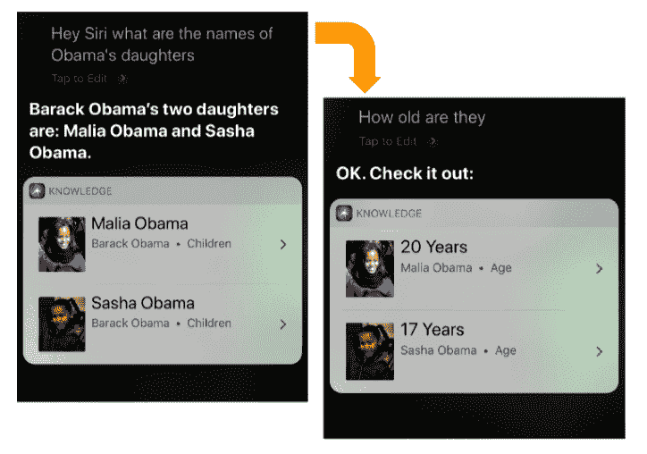
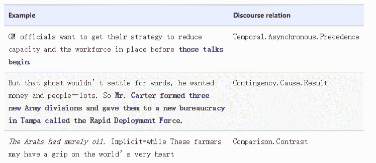
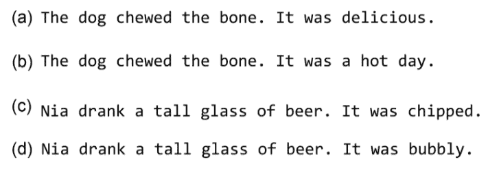
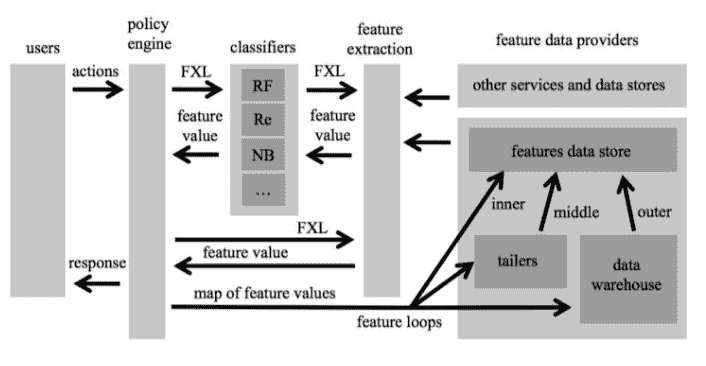
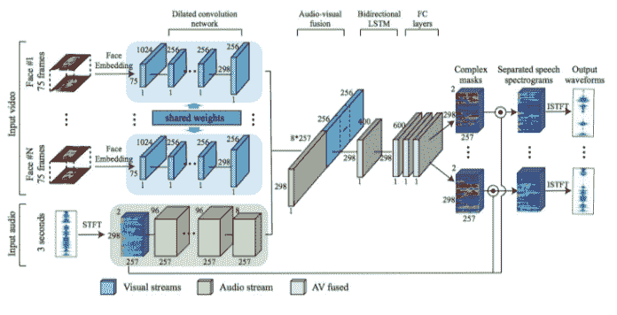
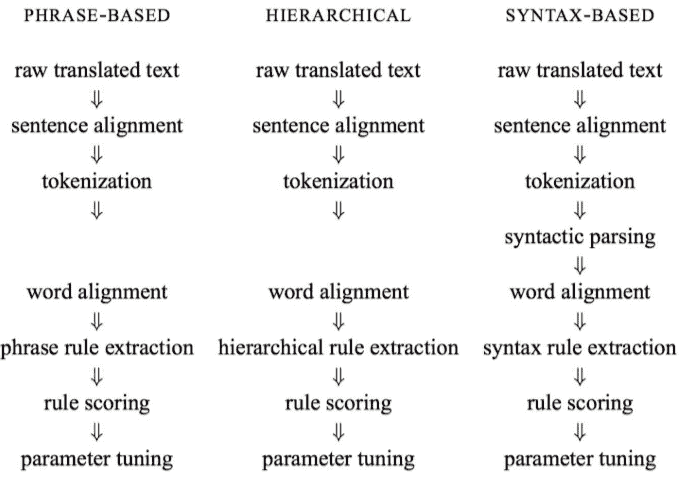

# 九、经典, 前沿和后续步骤

> 本文标题：[Natural-Language-Processing-with-PyTorch（九）](https://yifdu.github.io/2018/12/28/Natural-Language-Processing-with-PyTorch%EF%BC%88%E4%B9%9D%EF%BC%89/)
> 
> 文章作者：[Yif Du](https://yifdu.github.io/ "访问 Yif Du 的个人博客")
> 
> 发布时间：2018 年 12 月 28 日 - 11:12
> 
> 最后更新：2018 年 12 月 28 日 - 11:12
> 
> 原始链接：[http://yifdu.github.io/2018/12/28/Natural-Language-Processing-with-PyTorch（九）/](https://yifdu.github.io/2018/12/28/Natural-Language-Processing-with-PyTorch%EF%BC%88%E4%B9%9D%EF%BC%89/)
> 
> 许可协议：[署名-非商业性使用-禁止演绎 4.0 国际](https://creativecommons.org/licenses/by-nc-nd/4.0/)  转载请保留原文链接及作者。

在本章中，我们将从整本书的角度回顾前面的章节，并了解本书中讨论的看似独立的主题是如何相互依赖的，以及研究人员如何将这些想法混合和匹配以解决手头的问题。我们还总结了自然语言处理（NLP）中的一些经典主题，我们无法在这些封面之间进行深入讨论。最后，我们指出了该领域的前沿，截至 2018 年。在经验丰富的 NLP 和深度学习等快速发展的领域，我们必须学习新的想法并使自己保持最新状态。我们致力于学习如何在 NLP 中学习新主题。

## 我们到目前为止学习了什么？

我们从监督学习范式开始，以及我们如何使用计算图形抽象将复杂的想法编码为可以通过反向传播进行训练的模型。 PyTorch 是我们选择的计算框架。编写 NLP 书籍存在风险，该书使用深度学习将文本输入视为要输入黑盒子的“数据”。在第 2 章中，我们介绍了 NLP 和语言学的一些基本概念，为本书的其余部分奠定了基础。激活函数，损失函数和基于梯度的监督学习优化以及“训练 - 评估循环”等基本概念在本章的其他章节中变得非常方便。我们研究了前馈网络的两个例子 - 多层感知器（MLP）和卷积网络。我们看到了 L1，L2 规范和丢包等正规化机制，使网络更加健壮。 MLP 能够在其隐藏层中捕获类似 N 元组的关系，但是它们效率低下。另一方面，卷积网络使用称为“参数绑定”或“参数共享”的思想以计算有效的方式学习这个子结构。在第 6 章中，我们看到了循环网络如何能够捕获远程依赖性跨越时间也只有很少的参数。你可以说卷积网络正在跨越空间绑定参数，而循环网络正在跨时间绑定参数。我们看到了三种复发网络的变体，从 Elman 循环神经网络（RNN）和门控变体如长短期记忆（LSTM）和门控复发单位（GRU）开始。我们还了解了如何在预测或序列标记设置中使用循环网络，其中在输入的每个时间步骤预测输出。最后，我们介绍了一类称为编码器 - 解码器模型的模型，并研究了序列到序列模型作为解决条件生成问题（如机器翻译）的示例。我们在 PyTorch 中完成了许多这些主题的端到端示例。

## NLP 中的永恒主题

NLP 比单本书范围内的内容还多，本书也不例外。在第 2 章中，我们确定了 NLP 中的一些核心术语和任务。我们在其余章节中介绍了许多 NLP 任务，但是在这里我们简要提到一些我们无法部分或全部涵盖的重要主题，因为我们的范围仅限于初始说明书。

### 对话和交互系统

计算机和人类之间的无缝对话被认为是计算的圣杯，并激发了图灵测验和勒伯纳奖。自人工智能（人工智能）早期以来，NLP 一直与对话系统相关联，并通过虚构系统在流行文化中普及，如星际迷航中的 USS Enterprise 上的主计算机和电影 2001：A Space Odyssey 中的 HAL 9000。 1 对话和更广泛的交互系统设计领域是一个肥沃的研究领域，亚马逊的 Alexa，Apple 的 Siri 和 Google 的助手等近期产品取得了成功。对话系统可以是开放域（问我什么）或封闭域（例如，航班预订，汽车导航）。该领域的一些重要研究课题包括我们如何对对话行为进行建模，对话背景（见图 9-1）和对话状态？我们如何建立多模式对话系统（例如，语音和视觉或文本和视觉输入）？系统如何识别用户意图？我们如何为用户的偏好建模并生成针对用户量身定制的响应？如何回应更人性化的声音？例如，最近的生产对话系统已经开始将诸如“嗯”和“呃”之类的不流畅结合到响应中，以使系统看起来不那么机器人。

### 话语

话语涉及理解文本文档的部分整体性质。例如，话语解析的任务涉及理解两个句子在上下文中如何彼此相关。表 9-1 给出了 Penn Discourse Treebank（PDTB）的一些例子来说明这项任务。

Table 9-1\. Examples from the CoNLL 2015 Shallow Discourse Processing task 

理解话语还涉及解决其他问题，如回指解析和转喻检测。在 Anaphora Resolution 中，我们希望将代词的出现解析为它们所引用的实体。如图 9-2 所示，这可能成为一个复杂的问题。 

对象可以是转喻，如下例所示：`Beijing imposed trade tariffs in response to tariffs on Chinese goods.`

北京在这里指的不是中国政府的所在地。有时，成功解决所指对象可能需要使用知识库。

### 信息提取和文本挖掘

该行业中遇到的常见问题类别之一涉及信息提取。我们如何从文本中提取实体（人名，产品名称等），事件和关系？我们如何将文本中的实体提及映射到知识库中的条目（又称实体发现，实体链接，插槽填充）？我们如何首先构建和维护该知识库（知识库群体）？这些是在不同背景下的信息提取研究中经常回答的一些问题。

### 文档分析和检索

另一种常见的行业 NLP 问题包括理解大量文档。我们如何从文档中提取主题（主题建模）？我们如何更智能地索引和搜索文档？我们如何理解搜索查询（查询解析）？我们如何为大型集合生成摘要？

NLP 技术的范围和适用性很广，事实上，NLP 技术可以应用于存在非结构化或半结构化数据的任何地方。作为一个例子，我们将您介绍给 Dill 等人。 （2007），他们应用自然语言解析技术来解释蛋白质折叠。

## NLP 的前沿

当该领域正在进行快速创新时，写一篇题为“NLP 前沿”的部分似乎是一件愚蠢的事。但是，我们想让您一瞥 2018 年秋季的最新趋势：

1.  将经典 NLP 文献引入可微学习范式 NLP 领域已有几十年的历史，尽管深度学习领域只有几年的历史。许多创新似乎都在研究新的深度学习（可微学习）范式下的传统方法和任务。阅读经典 NLP 论文（我们建议阅读它们！）时，一个很好的问题是作者试图学习什么？什么是输入/输出表示？我们如何通过前面章节中学到的技术简化这一过程？
2.  模型的组合性原则。在本书中，我们讨论了 NLP,MLP，CNN，序列模型，序列到序列模型和基于注意力的模型的不同类型的深度学习架构。值得注意的是，尽管我们单独讨论了这些模型，但纯粹是出于教学原因。在文献中看到的一个趋势是组合不同的架构来完成工作。例如，您可以在单词的字符上编写卷积网络，然后在该表示上写入 LSTM，并且通过 MLP 完成 LSTM 编码的最终分类。能够根据任务需求组合地组合不同的架构是使深度学习成功的最有力的想法之一。
3.  序列的卷积。我们在序列建模中看到的最近趋势是使用卷积运算完全模拟序列。作为完全卷积机器翻译模型的一个例子，参见 Gehring 等人。 （2018）。解码步骤使用去卷积操作。这是有利的，因为可以使用全卷积模型显着加速训练。
4. 《Attention is all you need》。最近的另一个趋势是用注意机制取代卷积（Vaswani 等，2017）。使用注意机制，特别是称为自我关注和多头注意的变体，您基本上可以捕获通常使用 RNN 和 CNN 建模的远程依赖关系。
5.  迁移学习。迁移学习是学习一项任务的表示和使用表示来改进另一项任务的学习的任务。在最近神经网络的复兴和 NLP 中的深度学习中，使用预训练的单词向量的迁移学习技术已经变得无处不在。最近的工作（Radford 等，2018; Peters 等，2018）证明了语言建模任务的无监督表示如何有助于各种 NLP 任务，如问答，分类，句子相似性和自然 - 语言推断。

此外，强化学习领域最近在对话相关任务方面取得了一些成功，而复杂的自然语言推理任务的记忆和知识基础的建模似乎引起了工业界和学术界的研究人员的高度关注。在下一节中，我们将从经典和前沿转向更直接的事物 - 开发一个系统思考设计生产 NLP 系统。

## 生产 NLP 系统的设计模式

生产 NLP 系统可能很复杂。在构建 NLP 系统时，重要的是要记住，您正在构建的系统正在解决任务，并且只是实现这一目标的手段。在系统构建期间，工程师，研究人员，设计人员和产品经理可以做出多种选择。虽然我们的书主要关注技术或基础构建块，但将这些构建块放在一起以提出满足您需求的复杂结构将需要一些模式思考。模式思维和描述模式的语言是“在专业领域内描述良好设计实践或有用组织模式的方法。”这在许多学科（Alexander，1979）中很流行，包括软件工程。在本节中，我们将介绍生产 NLP 系统的一些常见设计和部署模式。这些是团队经常需要做出的选择或权衡，以使产品开发与技术，业务，战略和运营目标保持一致。我们在六个轴下检查这些设计选择：

1.  在线 VS 离线系统。在线系统是需要实时或接近实时地进行模型预测的系统。诸如打击垃圾邮件和内容审核等一些任务本质上需要在线系统。另一方面，离线系统不需要实时运行。我们可以将它们构建为在一批输入上有效运行，并且可以利用转换学习等方法。一些在线系统可以是被动的，甚至可以以在线方式进行学习（也称为在线学习），但是许多在线系统是通过定期离线模型构建来构建和部署的，该构建被推向生产。使用在线学习构建的系统应该对对抗性环境特别敏感。最近的一个例子是着名的 Twitter 聊天机器人 Tay，它误入歧途并开始从在线巨魔学习。正如后见之明所预见的那样，Tay 很快就开始回应令人反感的推文，其母公司微软不得不在推出后不到一天就关闭了这项服务。系统构建中的典型轨迹是首先构建一个离线系统，将其作为一个“在线”系统进行大量工程工作，然后通过添加反馈循环并可能改变学习方法使其成为“在线学习”系统。虽然这种路径在代码库中增加的复杂性方面是有机的，但它可能会引入诸如处理攻击者之类的盲点等等。图 9-3 显示了“Facebook 免疫系统”作为检测垃圾邮件的在线系统的一个例子（警告：大约 2012 年。不是当前 Facebook 基础设施的反映）。请注意在线系统如何比类似的离线系统需要更多的工程设计。 

2.  交互 VS 非交互系统。大多数自然语言系统在预测仅来自模型的意义上是非交互式的。实际上，许多生产 NLP 模型深深嵌入到数据处理的提取，转换和加载（ETL）管道的转换步骤中。在某些情况下，人类参与预测循环可能会有所帮助。图 9-4 显示了 Lilt Inc 的交互式机器翻译界面的一个例子，其中模型和人类共同参与所谓的“混合主动模型”（Green-Initiative Models）中的预测（Green 2014）。交互式系统难以设计，但通过将人类带入循环可以实现非常高的精度。

图 9-4。一种人-环机器翻译模型，允许人们修正或改写来自 MT 系统的建议，以产生非常高质量的翻译。 （图片由 Lilt Inc 提供）

1.  Unimodal versus multimodal systems

在许多情况下，在学习和预测过程中纳入多种模态可能会有所帮助。例如，新闻转录系统不仅使用音频流而且还使用视频帧作为输入是有帮助的。例如，Google 最近的一项名为《Look to Listen》（Ephrat et al。，2018）的作品使用多模式输入来解决扬声器源分离的困难问题（又名鸡尾酒会问题）。多模式系统的构建和部署成本很高，但是对于困难的问题，组合来自多个模态的输入提供了单独使用任何单一模态无法实现的信号。我们也在 NLP 中看到了这个例子。例如，在多模态翻译中，我们可以通过在可用时合并来自多种源语言的输入来提高翻译质量。生成网页主题（主题建模）时，除了网页上的文本外，还可以合并从其中包含的图像中提取的特征，如图 9-5 所示。

1.  端到端 VS 分片系统。自深度学习问世以来，研究人员和工程师可以选择的另一个选择点是构建一个复杂的 NLP 系统，既可以作为不同单元的管道，也可以作为单片端到端系统。端到端设计在机器翻译，摘要和语音识别等许多领域都具有吸引力，精心设计的端到端系统可以显着降低实施和部署的复杂性，并且肯定会减少代码行数。分段系统（图 9-6）将复杂的 NLP 任务分解为子任务，每个子任务单独优化，独立于最终任务目标。分段系统中的子任务使其非常模块化，易于“修补”生产中的特定问题，但通常会带来一些技术债务。

1.  封闭领域 VS 开放领域系统。封闭域系统明确地针对单一目的进行优化：在该域中表现良好。例如，机器翻译系统可以明确优化以与生物医学期刊一起使用 - 这不仅仅涉及生物医学平行语料库的训练。另一方面，开放域系统旨在用于通用目的（例如，Google Translate）。再举一个例子，考虑一个文件标签系统。如果系统只预测了许多预定义类中的一个（典型情况），则会产生一个封闭域系统。但是，如果系统被设计为在运行时发现新类，那么它就是一个开放域系统。在翻译和语音识别系统的背景下，封闭域系统也被称为“有限词汇”系统。
2.  Monolingual versus multilingual systems

为单一语言工作而构建的 NLP 系统称为单语系统。很容易构建和优化单语系统。相比之下，多语言系统可以处理多种语言。在对不同语言的数据集进行训练时，预计它们可以开箱即用。虽然构建多语言系统很有吸引力，但专注于单语版本有其优点。研究人员和工程师可以利用该语言中广泛可用的资源和领域专业知识来生成高质量的系统，否则一般的多语言系统是不可能的。出于这个原因，我们经常发现许多多语言产品被实现为单独优化的单语系统的集合，其中语言识别组件将输入分派给它们。

## 下一步是什么？

使用像 PyTorch 这样的即将到来的框架和像深度学习这样快速变化的领域，感觉就像在移动地面上建造一座豪宅。在本节中，我们指出了一些与深度学习，PyTorch 和 NLP 相关的资源，以帮助我们的读者继续加强我们在本书中构建的基础。

我们没有涵盖 PyTorch 的每一个功能。我们建议您遵循优秀的 PyTorch 文档并参与 PyTorch 论坛以继续您的 PyTorch 实践：

*   [PyTorch 文档](https://pytorch.org/docs)

*   [PyTorch 论坛](https://discuss.pytorch.org/)。

深度学习领域本身就是来自工业界和学术界的大量活动。大多数深度学习作品出现在 arXiv 的不同类别下：

*   [机器学习](https://arxiv.org/list/cs.LG/recent)

*   [语言和计算](https://arxiv.org/list/cs.CL/recent)

*   [人工智能](https://arxiv.org/list/cs.AI/recent)

了解 NLP 新作品的最佳方法是遵循以下学术会议：

*   计算语言学协会（ACL）

*   自然语言处理中的经验方法（EMNLP）

*   北美计算语言学协会（NAACL）

*   ACL 的欧洲分部（EACL）

*   计算自然语言学习会议（CoNLL）

我们建议 aclweb.org 跟踪这些会议和其他会议，研讨会和其他重要的 NLP 新闻的会议记录。

当您准备超越基础时，您可能会发现自己必须阅读研究论文。阅读论文是一门获得的艺术。您可以在[这里](https://www.cs.jhu.edu/~jason/advice/how-to-read-a-paper.html)找到一些有用的阅读 NLP 论文的提示。

最后，我们将继续提供更多教育材料，[以补充本书的内容](https://nlproc.info/pytorch)。

## 参考

1.  `Christopher Alexander. The Timeless Way of Building. Oxford University Press, 1979.`

2.  `Ken A. Dill, Adam Lucas, Julia Hockenmaier, Liang Huang, David Chiang, Aravind K. Joshi. "Computational linguistics: A new tool for exploring biopolymer structures and statistical mechanics." In Polymer, 2007.`

3.  `Hieu Hoang, Philipp Koehn, and Adam Lopez. "A Unified Framework for Phrase-Based, Hierarchical, and Syntax-Based Statistical Machine Translation." In Proceedings of IWSLT, 2009.`

4.  `Tao Stein, Erdong Chen, Karan Mangla. "Facebook Immune System." SNS, 2011`

5.  `Spence Green, "Mixed-Initiative Language Translation." PhD Thesis, Stanford University, 2014.`

6.  `Ashish Vaswani, Noam Shazeer, Niki Parmar, Jakob Uszkoreit, Llion Jones, Aidan N. Gomez, Lukasz Kaiser, Illia Polosukhin, "Attention Is All You Need." on arXiv, 2017.`

7.  `Ariel Ephrat, Inbar Mosseri, Oran Lang, Tali Dekel, Kevin Wilson, Avinatan Hassidim, William T. Freeman, Michael Rubinstein. "Looking to Listen: A Speaker-Independent Audio-Visual Model for Speech Separation." SIGGRAPH, 2018.`

8.  `Matthew E. Peters, Mark Neumann, Mohit Iyyer, Matt Gardner, Christopher Clark, Kenton Lee, Luke Zettlemoyer. "Deep contextualized word representations." ACL 2018.`