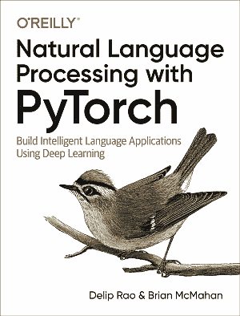

# PyTorch 自然语言处理



> 译者：[Yif Du](https://yifdu.github.io/)
> 
> 协议：[CC BY-NC-ND 4.0](https://creativecommons.org/licenses/by-nc-nd/4.0/)
> 
> 所有模型都是错的,但其中一些是有用的。

本书旨在为新人提供自然语言处理（NLP）和深度学习，以涵盖这两个领域的重要主题。这两个主题领域都呈指数级增长。对于一本介绍深度学习和强调实施的 NLP 的书，本书占据了重要的中间地带。在写这本书时，我们不得不对哪些材料遗漏做出艰难的，有时甚至是不舒服的选择。对于初学者，我们希望本书能够为基础知识提供强有力的基础，并可以瞥见可能的内容。特别是机器学习和深度学习是一种经验学科，而不是智力科学。我们希望每章中慷慨的端到端代码示例邀请您参与这一经历。当我们开始编写本书时，我们从 PyTorch 0.2 开始。每个 PyTorch 更新从 0.2 到 0.4 修改了示例。 PyTorch 1.0 将于本书出版时发布。本书中的代码示例符合 PyTorch 0.4，它应该与即将发布的 PyTorch 1.0 版本一样工作。 关于本书风格的注释。我们在大多数地方都故意避免使用数学;并不是因为深度学习数学特别困难（事实并非如此），而是因为它在许多情况下分散了本书主要目标的注意力——增强初学者的能力。在许多情况下，无论是在代码还是文本方面，我们都有类似的动机，我们倾向于对简洁性进行阐述。高级读者和有经验的程序员可以找到方法来收紧代码等等，但我们的选择是尽可能明确，以便覆盖我们想要达到的大多数受众。

* [在线阅读](https://nlp-pt.apachecn.org)
* [在线阅读（Gitee）](https://apachecn.gitee.io/nlp-pytorch-zh/)
* [ApacheCN 学习资源](http://docs.apachecn.org/)
* [ApacheCN 面试求职群 724187166](http://shang.qq.com/wpa/qunwpa?idkey=9bcf2fb3985835c9c2f15783ec9c85822e23be1191a6581eaf22f574b5192b19)
* [代码地址](https://github.com/joosthub/PyTorchNLPBook)

## 贡献指南

本项目需要校对，欢迎大家提交 Pull Request。

> 请您勇敢地去翻译和改进翻译。虽然我们追求卓越，但我们并不要求您做到十全十美，因此请不要担心因为翻译上犯错——在大部分情况下，我们的服务器已经记录所有的翻译，因此您不必担心会因为您的失误遭到无法挽回的破坏。（改编自维基百科）

## 联系方式

### 负责人

* [飞龙](https://github.com/wizardforcel): 562826179

### 其他

*   在我们的 [apachecn/nlp-pytorch-zh](https://github.com/apachecn/nlp-pytorch-zh) github 上提 issue.
*   发邮件到 Email: `apachecn@163.com`.
*   在我们的 [组织学习交流群](http://www.apachecn.org/organization/348.html) 中联系群主/管理员即可.

## 下载

### Docker

```
docker pull apachecn0/nlp-pytorch-zh
docker run -tid -p <port>:80 apachecn0/nlp-pytorch-zh
# 访问 http://localhost:{port} 查看文档
```

### PYPI

```
pip install nlp-pytorch-zh
nlp-pytorch-zh <port>
# 访问 http://localhost:{port} 查看文档
```

### NPM

```
npm install -g nlp-pytorch-zh
nlp-pytorch-zh <port>
# 访问 http://localhost:{port} 查看文档
```

## 赞助我们


