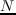
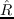
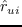
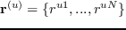
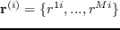
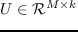
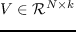
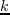

# 引言

推荐系统是针对消费者过度选择的直观防线。 鉴于网络上可用信息的爆炸性增长，用户经常受到无数产品，电影或餐馆的欢迎。 因此，个性化是促进更好用户体验的基本策略。 总而言之，这些系统在各种信息访问系统中发挥着至关重要和不可或缺的作用，来促进业务和促进决策过程[69, 121]，并且在诸如电子商务和/或媒体网站等众多网络领域中普遍存在。

通常，基于用户偏好，项目特征，用户-项目的过去交互以及诸如时间（例如，序列感知推荐器）和空间（例如，POI推荐器）数据的一些其他附加信息来生成推荐列表。 推荐模型主要分为协同过滤，基于内容的推荐系统和基于输入数据类型的混合推荐系统[1]。

深度学习目前非常火。 过去几十年，深度学习（DL）在计算机视觉和语音识别等许多应用领域取得了巨大成功。 学术界和工业界一直在竞相将深度学习应用于更广泛的领域，因为它能够解决许多复杂的任务，同时提供最先进的结果[27]。 最近，深度学习极大地改变了推荐架构，并为改进推荐器的性能带来了更多机会。 基于深度学习的推荐系统的最新进展，通过克服传统模型的障碍和实现高推荐质量，获得了显着的关注。 深度学习能够有效地捕获非线性和非平凡的用户 - 项目关系，并且能够将更复杂的抽象编码为更高层中的数据表示。 此外，它还从丰富的可访问数据源（如上下文，文本和可视信息）中捕获数据本身的错综复杂的关系。

推荐系统中深度学习的普遍性。 在行业中，推荐系统是增强用户体验和促进许多在线网站和移动应用的销售/服务的关键工具[20, 27, 30, 43, 113]。 例如，在Netflix上观看的电影中有80% 来自推荐[43]，YouTube 的 60% 的视频点击来自主页推荐[30]。 最近，许多公司采用深度学习来进一步提高他们的推荐质量[20, 27, 113]。 Covington 等[27]提出了一种基于深度神经网络的推荐算法，用于在YouTube上进行视频推荐。 Cheng等 [20]提出了一个适用于Google Play的App推荐系统，具有广而深的模型。 Shumpei等 [113]为雅虎新闻提供了基于RNN的新闻推荐系统。 所有这些模型都经过了在线测试，并显示出比传统模型显着的改进。 因此，我们可以看到深度学习推动了工业推荐应用的显着革命。

近年来，基于深度学习的推荐方法的研究出版物数量呈指数级增长，为推荐系统研究中的深度学习的不可避免的普遍存在提供了有力证据。 自2016年以来，前沿的推荐系统国际会议[RecSys](https://recsys.acm.org/) 开始定期组织用于推荐系统的[深度学习研讨会](http://dlrs-workshop.org/) 。研讨会旨在促进研究并鼓励基于深度学习的推荐系统的应用。

学术界和工业界的深度学习的成功，需要对成功的研究人员和从业人员进行全面的回顾和总结，以便更好地了解这些模型的优缺点和应用场景。

本综述与以前的综述有何不同？ 在基于深度学习的推荐领域已经进行了大量研究。 然而，据我们所知，很少有系统的回顾很好地描述了这个领域，并定位了现有的工作和当前的进展。 虽然有些工作已经探索了建立在深度学习技术基础上的推荐应用，并试图将这一研究领域正式化，但很少有人试图深入总结当前的努力或详细说明该领域存在的开放性问题。 本综述旨在提供基于深度学习的推荐系统的当前研究的全面总结，来确定当前限制现实世界实施的开放性问题，并指出沿此维度的未来方向。

在过去几年中，已经发表了许多传统推荐系统的综述。 例如，Su等 [138]提出了协同过滤技术的系统回顾；Burke 等 [8]提出了混合推荐系统的综述；Fernandez-Tobias等 [40]和Khan等 [74]回顾了跨域推荐模型；以及其它。 然而，基于深度学习的推荐系统缺乏广泛的回顾。 据我们所知，只有两份相关的简短综述[7, 97]正式发表。 Betru等  [7]介绍了三种基于深度学习的推荐模型[123, 153, 159]，尽管这三部工作在这一研究领域具有影响力，但忽略了其他新兴的高质量工作。 Liu 等  [97]回顾了13篇深度学习推荐的论文，并建议根据输入（使用内容信息的方法和没有内容信息的方法）和输出（评级和排名）形式，对这些模型进行分类。 然而，随着新式研究工作的不断出现，这种分类框架已不再适用，需要一个新的包容性框架来更好地理解这一研究领域。 鉴于在推荐系统中应用深度学习的日益普及和潜力，系统综述将具有很高的科学和实用价值。 我们从不同的角度分析了这些工作，并对这一领域提出了一些新的见解。 为此，超过100项研究入围并列入本综述。

我们如何收集文件？ 在这次综述中，我们收集了一百多篇相关论文。 我们使用Google Scholar作为主要搜索引擎，我们还采用了数据库Web of Science作为发现相关论文的重要工具。 此外，我们筛选了大多数相关的顶级会议，如NIPS，ICML，ICLR，KDD，WWW，SIGIR，WSDM，RecSys等，以及其它，来了解最近的工作。 我们使用的主要关键词包括：推荐系统，推荐，深度学习，神经网络，协同过滤，矩阵分解等。

本综述的贡献。 本综述的目的是彻底回顾基于深度学习的推荐系统的进展的文献。 它提供了一个全景图，读者可以快速了解并深入了解基于深度学习的推荐领域。 该综述为推荐系统领域的创新奠定了基础，并充分利用了该研究领域的丰富性。 该综述为对推荐系统感兴趣的研究人员，从业人员和教育工作者提供服务，希望他们在选择深层神经网络来解决手头的推荐任务时有一个粗略的指导方针。 总之，本综述的主要贡献有三方面：（1）我们对基于深度学习技术的推荐模型进行了系统评价，并提出了一种分类方案来定位和组织当前的工作；（2）我们提供现有技术的概述和总结。 （3）我们讨论挑战和开放性问题，确定本研究领域的新趋势和未来方向，分享愿景，拓展基于深度学习的推荐系统研究的视野。

本文的其余部分安排如下：第2节介绍了推荐系统和深度神经网络的预备知识，我们还讨论了基于深度神经网络的推荐模型的优缺点。 第3节首先介绍了我们的分类框架，然后详细介绍了最新技术。 第4节讨论了挑战和突出的开放研究问题。 第5节总结了论文。

# 推荐系统和深度学习概述

在我们深入本综述的细节之前，我们先介绍一下推荐系统和深度学习技术相关的基本术语和概念。 我们还讨论了将深度神经网络引入推荐系统的原因和动机。

## 推荐系统

推荐系统估计用户对项目的偏好，并主动推荐用户可能喜欢的项目[1, 121]。 推荐模型通常分为三类[1, 69]：协同过滤，基于内容和混合推荐系统。 协作过滤通过学习用户和项目的历史交互来做出推荐，无论是显式（例如用户的先前评级）还是隐式反馈（例如浏览历史）。 基于内容的推荐主要基于项目和用户辅助信息的比较。 可以考虑各种辅助信息，例如文本，图像和视频。 混合模型是指整合了两种或更多种推荐策略的推荐系统[8, 69]。

假设我们有  个用户和  个物品， 表示交互矩阵和  表示预测的交互矩阵。 让  表示用户  对项目  的偏好，  表示预测分数。 同时，我们使用部分观察到的向量（ 的行）  代表每个用户   ，和部分观察到的向量（ 的列）   代表每个项目  。  和  表示观察到的和未观察到的交互集。 我们用   和  表示用户和项目潜在因子。  是潜在因子的维度。 此外，还可以考虑诸如时间戳之类的序列信息，来产生序列感知推荐。 其他符号和表示将在相应章节中介绍。

## 深度学习技巧

深度学习通常被认为是机器学习的子领域。 深度学习的典型定义的本质是它学习深层表示 ，即从数据中学习多层的表示和抽象。 出于实际原因，我们将任何神经可微结构视为“深度学习” ，只要它使用随机梯度下降（SGD）的变体优化可微目标函数。 神经架构在监督和无监督学习任务中都取得了巨大的成功[31]。 在本小节中，我们阐明了与此综述密切相关的各种架构范式。

*   多层感知器（MLP）是前馈神经网络，在输入层和输出层之间具有多个（一个或多个）隐层。 这里，感知器可以采用任意激活函数，并不一定代表严格的二元分类器。 MLP可以被表示为非线性变换的堆叠层，学习分层特征表示。 MLP也被称为通用近似器。
*   自编码器（AE）是一种无监督的模型，试图在输出层重建其输入数据。 通常，瓶颈层（最中间层）用作输入数据的显着特征表示。 有许多自编码器变体，如去噪自编码器，边缘化去噪自编码器，稀疏自编码器，收缩自编码器和变分自编码器（VAE）[15, 45]。
*   卷积神经网络（CNN）[45]是一种特殊的前馈神经网络，具有卷积层和池化操作。 它可以捕获全局和局部特征，并显着提高效率和准确性。 它在处理具有网格状拓扑的数据方面表现良好。
*   循环神经网络（RNN）[45]适用于建模序列数据。 与前馈神经网络不同，RNN中存在循环和记忆，用于记住以前的计算。 诸如长短期记忆（LSTM）和门控循环单元（GRU）网络的变体通常在实践中部署来克服消失的梯度问题。
*   受限玻尔兹曼机（RBM）是一个由可见层和隐层组成的双层神经网络。 它可以很容易地堆叠为深度网络。 此处“受限”意味着可见层或隐层中没有层内通信。
*   神经自回归分布估计（NADE）[81, 152]是一种在自回归模型和前馈神经网络之上构建的无监督神经网络。 它是用于建模数据分布和密度的易处理且有效的估计器。
*   对抗网络（AN）[46]是一个生成神经网络，由鉴别器和生成器组成。 通过在 minmax 游戏框架中相互竞争来同时训练两个神经网络。
*   注意力模型（AM）是可微的神经架构，其基于输入序列（或图像）上的 soft content addressing 来操作。 注意力机制通常无处不在，并且在计算机视觉和自然语言处理领域中被接受。 然而，它也是深度推荐系统研究的新兴趋势。
*   深度强化学习（DRL）[106]。 强化学习是在试错法的范式下运作的。 整个框架主要由以下组成部分组成：智能体，环境，状态，行动和奖励。 深度神经网络和强化学习之间的结合形成了DRL，它已经在诸如游戏和自动驾驶汽车等多个领域实现了人类水平的表现。 深度神经网络使智能体能够从原始数据中获取知识，并获得有效的表示，而无需手工制作的特征和域的启发式。

请注意，每年都会出现许多先进的模型，这里我们只简要列出一些重要的模型。 对细节或更高级模型感兴趣的读者可以参考[45]。

## 为何推荐深度神经网络？

在深入了解最新进展的细节之前，了解将深度学习技术应用于推荐系统的原因是有益的。 很明显，已经在短短几年内提出了许多深度推荐系统。 这个领域确实充满了创新。 在这一点上，很容易质疑这么多不同架构的需求，和/或甚至神经网络对问题域的效用。 沿着相同的切线，很容易提供一个明确的理由，说明每个架构为什么提出以及它最有利的场景。 总而言之，这个问题与任务，域和推荐方案的问题高度相关。 神经架构最吸引人的特性之一是它们（1）端到端可微和（2）提供适合输入数据类型的合适的归纳偏差 。 因此，如果模型可以利用固有结构，那么深度神经网络应该是有用的。 例如，CNN和RNN长期利用视觉（和/或人类语言）中的内在结构。 类似地，会话或点击日志的顺序结构非常适合于循环/卷积模型[56, 143, 175]提供的归纳偏差。

此外，深层神经网络也是复合的，因为多个神经积木可以组成一个（巨大的）可微函数并且端到端训练。 这里的关键优势是处理基于内容的推荐。 在对Web上的用户/项目建模时，这是不可避免的，其中多模态数据是常见的。 例如，当处理文本数据（评论[202]，推文[44]等），图像数据（社交帖子，产品图像），CNN / RNN成为不可或缺的神经积木。 这里，传统的替代方案（设计模态特定的特征等）变得明显不那么有吸引力，因此，推荐系统不能利用联合（端到端）表示学习。 从某种意义上说，推荐系统领域的发展也与相关模式（如视觉或语言社区）的最新研究紧密结合。 例如，为了处理评论，人们将不得不执行昂贵的预处理（例如，关键短语提取，主题建模等），而较新的基于深度学习的方法能够端到端地提取所有文本信息[202]。 总而言之，深度学习在这方面的能力可以被视为范式转换，如果没有这些最新进展，在统一的联合框架[197]中表示图像，文本和交互是不可能的。

仅仅与交互设定（即矩阵补全或协作排序问题）有关，这里的关键思想是，当存在大量复杂性或存在大量训练实例时，深度神经网络是合理的。 在[53]中，作者使用MLP来近似交互函数，并且比MF等传统方法显示出合理的性能提升。 虽然这些神经模型表现更好，但我们还注意到，当使用基于动量的梯度下降，在仅有交互的数据[145]上训练时，标准机器学习模型（如BPR，MF和CML）表现相当好。 但是，我们也可以将这些模型视为神经架构，因为它们利用了最近的深度学习进展，例如Adam，Dropout 或 Batch Normalization [53, 195]。 同样很容易看出，传统的推荐算法（矩阵分解，分解机等）也可以表示为神经/可微结构[53, 54]，并使用Tensorflow或Pytorch等框架进行有效训练，在 GPU 上训练并启用自动微分。 因此，在当今的研究环境（甚至是工业）中，完全没有理由不使用基于深度学习的工具来开发任何推荐系统。

概括地说，我们总结了基于深度学习的推荐模型的优势，读者在尝试将它们用于实践时可能会记住这些模型。

*   非线性变换 。 与线性模型相反，深度神经网络能够利用非线性激活（例如relu，sigmoid，tanh等）对数据中的非线性建模。此属性使得捕获用户和项目的复杂交互模式成为可能。 诸如矩阵分解，分解机，稀疏线性模型的常规方法基本上是线性模型。 例如，矩阵分解通过线性组合用户和项目的潜在因子来模拟用户 - 项目交互[53]；分解机是多元线性族的一员[54]；显然，SLIM是一个具有稀疏性约束的线性回归模型。 作为许多传统推荐系统的基础，线性假设过于简单，并将极大地限制其建模表现力。 众所周知，神经网络能够通过改变激活选项和组合，来以任意精度近似任何连续函数[58, 59]。 此属性可以处理复杂的交互模式并精确反映用户的偏好。
*   表示学习 。 在从输入数据中学习潜在的解释因素和有用的表示方面，深度神经网络是有效的。 通常，在实际应用中可以获得项目和用户的大量描述性信息。 这些信息的利用提供了一种方法来促进我们对项目和用户的理解，从而产生更好的推荐系统。 因此，将深度神经网络应用于推荐模型中的表示学习是一种自然的选择。 使用深度神经网络来辅助表示学习的优点有两方面：（1）它减少了手工特征设计的工作量。 特征工程是一项劳动密集型工作，深度神经网络能够在无监督或监督的方法中自动从原始数据中学习特征；（2）它使推荐模型能够包括异构内容信息，例如文本，图像，音频甚至视频。 深度学习网络在多媒体数据处理方面取得了突破，并展示了来自各种来源的表示学习的潜力。
*   序列建模 。 深度神经网络已经在许多序列建模任务上展示了充满希望的结果，例如机器翻译，自然语言理解，语音识别，聊天机器人等等。 RNN和CNN在这些任务中发挥着关键作用。 RNN使用内部存储器状态来实现这一点，而CNN使用随时间滑动的过滤器来实现这一点。 它们在序列结构的数据挖掘中具有广泛的适用性和灵活性。 序列信号建模是挖掘用户行为和项目演变的时间动态的重要主题。 例如，下个项目/篮子的预测和基于会话的推荐是典型的应用。 因此，深度神经网络完美契合这种序列模式挖掘任务。
*   灵活性 。 深度学习技术具有很高的灵活性，特别是随着许多流行的深度学习框架的出现，如[Tensorflow](https://www.tensorflow.org/) ，[Keras](https://keras.io/) ，[Caffe](http://caffe.berkeleyvision.org/) ，[MXnet](https://mxnet.apache.org/) ，[DeepLearning4j](https://deeplearning4j.org/) ，[PyTorch](https://pytorch.org/) ，[Theano](http://deeplearning.net/software/theano/)等。这些工具大多以模块化方式开发，并具有积极的社区和专业支持。 良好的模块化使开发和工程更加高效。 例如，很容易将不同的神经结构组合起来，来形成强大的混合模型，或者用其他模块替换一个模块。 因此，我们可以轻松地构建混合和复合推荐模型，来同时捕获不同的特征和因素。

## 论潜在的限制

使用深度学习进行推荐是否有任何缺点和限制？ 在本节中，我们的目标是解决几个常见的反对使用深度学习进行推荐系统研究的论点。

*   可解释性。 尽管取得了成功，但众所周知深度学习表现为黑盒子，提供可解释的预测似乎是一项非常具有挑战性的任务。 反对深度神经网络的一个常见论点是，隐藏的权重和激活通常是不可解释的，限制了可解释性。 然而，随着神经注意力模型的出现，这种担忧通常得到了缓解，并为深度神经模型铺平了道路，这些神经模型具有更高的可解释性[126, 146, 178]。 虽然解释单个神经元仍然对神经模型（不仅在推荐系统中）构成挑战，但是现有的最先进模型已经能够在一定程度上解释，从而能够提供可解释的推荐。 我们在公开问题部分更详细地讨论了这个问题。
*   数据要求。 第二个可能的限制是，已知深度学习是数据饥饿的，因为它需要足够的数据才能完全支持其丰富的参数。 然而，与标记数据稀缺的其他领域（例如语言或视觉）相比，在推荐系统研究的背景下获取大量数据相对容易。 上亿规模的数据集不仅在工业中很常见，而且作为学术数据集发布。
*   广泛的超参数调整。 反对深度学习的第三个成熟论点是需要进行广泛的超参数调整。 然而，我们注意到超参数调整不是深度学习的唯一问题，而是一般的机器学习（例如，正则化因子和学习率同样必须针对传统的矩阵分解等进行调整）。然而，在某些情况下，深度学习可能会引入额外的超参数。 例如，最近的工作[145]，传统度量学习算法[60]的注意力扩展仅引入了单个超参数。
