# 基于深度学习的推荐：最先进的技术

在本节中，我们首先介绍基于深度学习的推荐模型的类别，然后突出最先进的研究原型，旨在确定近年来最显着和最有希望的进步。

## 基于深度学习的推荐模型的类别

**图 1：**基于深度神经网络的推荐模型的类别。

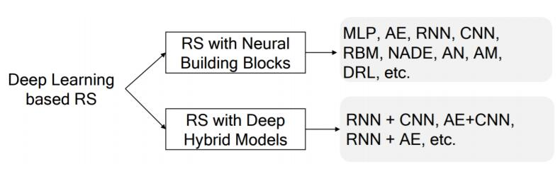

为了提供该领域的全景图，我们根据所采用的深度学习技术的类型对现有模型进行分类。 我们进一步将基于深度学习的推荐模型分为以下两类。 表 1 总结了分类方案。

**表 1：**已回顾论文的查找表。

| 分类 | 论文 |
| --- | --- |
| MLP | [2,13,20,27,38,47,53,54,66,92,95,157,166,185]， [12,39,93,112,134,154,182,183] |
| 自编码器 | [34,88,89,114,116,125,136,137,140,159,177,187,207]， [4,10,32,94,150,151,158,170,171,188,196,208,209] |
| CNN | [25,49,50,75,76,98,105,127,130,153,165,172,202,206]， [6,41,51,83,110,126,143,148,169,190,191] |
| RNN | [5,28,35,36,56,57,73,78,90,117,132,139,142,174-176]， [24,29,33,55,68,91] |
| RBM | [42,71,72,100,123,167,180] |
| NADE | [36,203,204] |
| 神经注意力 | [14,44,70,90,117,132,139,142,164-176]， [62,146,193] |
| 对抗网络 | [9,52,162,164] |
| DRL | [16,21,107,168,198-200] |
| 混合模型 | [17,38,41,82,84,87,118,135,160,192,193] |

*   使用神经积木的推荐 。 在该类别中，模型根据上述八种深度学习模型分为八个子类别：基于MLP，AE，CNN，RNN，RBM，NADE，AM，AN和DRL的推荐系统。 使用的深度学习技术决定了推荐模型的适用性。 例如，MLP可以轻松地模拟用户和项目之间的非线性交互；CNN能够从异构数据源（例如文本和视觉信息）中提取局部和全局表示；RNN使推荐系统能够建模内容信息的时间动态和连续演化。
*   使用深度混合模型的推荐。 一些基于深度学习的推荐模型使用多种深度学习技术。 深度神经网络的灵活性使得将几个神经积木组合在一起来相互补充，并形成更强大的混合模型成为可能。 这些深度学习技术有许多可能的组合，但并非所有技术都被利用。 请注意，它与[31]中的混合深度网络不同，后者指的是利用生成和判别成分的深层架构。

**表 2：**特定应用领域中基于深度神经网络的推荐模型。

| 数据 来源/任务 | 注 | 论文 |
| --- | --- | --- |
| 序列信息 | w/t 用户 ID | [16, 29, 33, 35, 73, 91, 117, 133, 143, 160, 173, 175, 189, 194, 198, 205] |
|  | 基于会话的 w/t 用户 ID | [55–57, 68, 73, 99, 101, 102, 117, 142, 148, 149] |
|  | 登入，POI | [150, 151, 165, 185] |
| 文本 | 哈希标签 | [44, 110, 118, 158, 182, 183, 193, 209] |
|  | 新闻 | [10, 12, 113, 135, 169, 200] |
|  | 评论文本 | [11, 87, 126, 146, 174, 197, 202] |
|  | 引言 | [82, 141] |
| 图片 | 视觉特征 | [2, 14, 25, 49, 50, 84, 98, 105, 112, 165, 172, 179, 191, 192, 197, 206] |
| 音频 | 音乐 | [95, 153, 167, 168] |
| 视频 | 影片 | [14, 17, 27, 83] |
| 网络 | 引文网 | [9, 38, 66] |
|  | 社交网络 | [32, 116, 166] |
|  | 跨域 | [39, 92, 166] |
| 其它 | 冷启动 | [154, 156, 170, 171] |
|  | 多任务 | [5, 73, 87, 174, 187] |
|  | 解释 | [87, 126] |

表 1 列出所有回顾的模型，我们按照上述分类方案组织它们。 此外，我们还在表 2 中从任务角度总结了一些论文。 回顾的论文涉及各种任务。 由于使用深度神经网络（例如基于会话的推荐，图像，视频推荐），一些任务已开始受到关注。 一些任务对于推荐研究领域可能并不新颖（用于推荐系统的辅助信息的详细回顾可以在[131]中找到），但DL提供了更多找到更好解决方案的可能性。 例如，如果没有深度学习技巧的帮助，处理图像和视频将是一项艰巨的任务。 深度神经网络的序列建模功能可以轻松捕获用户行为的序列模式。 一些具体任务将在下文中讨论。

## 基于多层感知器的推荐

MLP是一个简洁但有效的网络，据证明能够以任何所需的准确度近似将任何可测量的函数[59]。 因此，它是许多先进方法的基础，并且在许多领域中被广度使用。

传统推荐方法的神经扩展。 许多现有的推荐模型基本上是线性方法。 MLP可用于向现有RS方法添加非线性变换并将其解释为神经扩展。

**图 2：**图示：（a）神经协同过滤；（b）深度分解机。

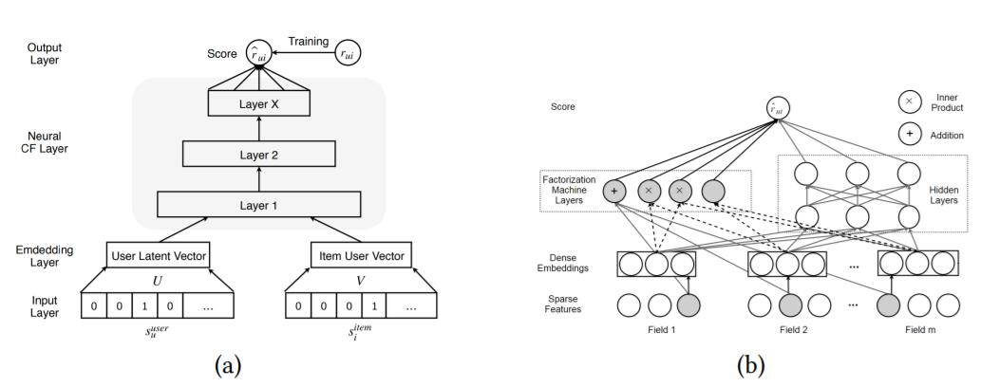

神经协同过滤 。 在大多数情况下，推荐被视为用户偏好和项目特征之间的双向交互。 例如，矩阵分解将评分矩阵分解为低维用户/项目潜在因子。 构建双神经网络来模拟用户和项目之间的双向交互是很自然的。 神经网络矩阵分解（NNMF）[37]和神经协同过滤（NCF）[53]是两个具有代表性的工作。 图 2a 显示了NCF架构。 让 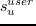 和 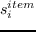 表示辅助信息（例如用户个人信息和项目特征），或者仅表示用户  和项目  的单热标识符。 评分函数定义如下：

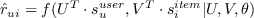 (1)

其中函数 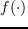 代表多层感知器，  是这个网络的参数。 传统的MF可以被视为NCF的一个特例。 因此，将矩阵分解的神经解释与MLP融合来制定更通用的模型是方便的，该模型利用MF的线性和MLP的非线性来提高推荐质量。 可以使用加权平方损失（用于显式反馈）或二元交叉熵损失（用于隐式反馈）来训练整个网络。 交叉熵损失定义为：

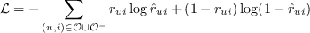 (2)

可以使用负采样方法来减少未观测的训练实例的数量。 后续工作[112,134]建议使用成对排名损失来提高效果。He 等 [92,166]将NCF模型扩展到跨域推荐。 Xue 等 [184]和 Zhang 等 [195]表明，可以用交互矩阵的列或行替换单热标识符来保留用户项目交互模式。

深度分解机 。 DeepFM [47]是一种端到端模型，可无缝集成分解机和MLP。 它能够使用深度神经网络和与分解机的低阶交互来建模高阶特征相互作用。 分解机（FM）利用加法和内积运算来捕获特征之间的线性和成对相互作用（更多细节参见[119]中的公式（1））。 MLP利用非线性激活和深层结构来模拟高阶交互。 MLP与FM结合的方式受到广度和深度网络的启发。 它用分解机的神经解释取代了宽的分量。 与广度和深度模型相比，DeepFM不需要繁琐的特征工程。 图 2b 说明了DeepFM的结构。  DeepFM的输入 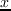 是一个   个领域的数据，由 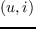 对组成（用户和项目的身份和特征）。 为简单起见，FM和MLP的输出分别表示为 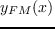 和 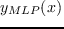 。 预测得分通过以下公式计算：

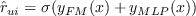 (3)

其中 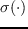 是S形激活函数。

Lian 等 [93]通过提出一个eXtreme深度分解机来同时模拟显式和隐式特征交互，从而改进了DeepMF。 通过压缩交互网络学习显式高阶特征交互。 He等提出的并行工作  [54]取代了与MLP的二阶交互，并建议使用dropout和batch normalization对模型进行正则化。

用MLP学习特征表示。 使用MLP进行特征表示非常简单且高效，即使它可能不像自编码器，CNN和RNN那样具有表现力。

广度和深度学习 。 这个通用模型（如图 3a 所示） 可以解决回归和分类问题，但最初在Google Play的App推荐中引入[20]。 广度学习成分是单层感知器，也可以视为广义线性模型。 深度学习成分是多层感知器。 结合这两种学习技术的基本原理是，它使推荐系统能够捕获记忆和概括。 广度学习成分实现的记忆，代表了从历史数据中捕获直接特征的能力。 同时，深度学习成分通过产生更一般和抽象的表示，来捕捉泛化。 该模型可以提高推荐的准确性和多样性。

形式上，广度学习定义为： 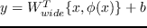  ，其中 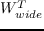  ， 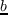 是模型参数。 输入 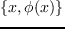 是由原始输入特征  ，和变换特征 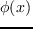 （例如，捕获特征之间的相关性的交叉乘积变换） 组成的连接特征集 。 深层神经元的每一层都是  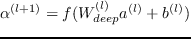  ，其中 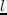 表示 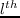 层，  是激活函数。  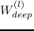 和  是权重和偏置。 通过融合这两个模型可以获得广度和深度学习模型：

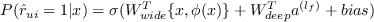 (4)

其中  是sigmoid函数，  是二元评分标签， 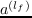 是最后的激活。 该联合模型使用随机反向传播（follow-the-regularized-leader 算法）进行优化。 基于预测的分数生成推荐列表。

通过扩展这个模型，Chen 等 [13]为大规模的工业级推荐任务设计了一个局部连接的广度和深度学习模型。 它采用高效的局部连接网络来取代深度学习成分，从而将运行时间减少一个数量级。 部署广度和深度学习的一个重要步骤是选择广度和深度部分的特征。 换句话说，系统应该能够确定哪些特征被记忆或概括。 此外，还需要手工设计交叉乘积变换。 这些预先步骤将极大地影响该模型的效果。 上述基于深度因式分解的模型可以减少特征工程的工作量。

Covington等  [27]探讨了YouTube推荐中MLP的应用。 该系统将推荐任务分为两个阶段：候选生成和候选排名。 候选生成网络从所有视频语料库中检索子集（数百个）。 排名网络基于来自候选者的最近邻居分数生成 top-n 个列表（数十个）。 我们注意到工业界更关注特征工程（例如变换，正则化，交叉）和推荐模型的可扩展性。

Alashkar等 [2]提出了基于MLP的化妆品推荐模型。 这项工作使用两个相同的MLP分别为标记示例和专家规则建模。 通过最小化它们的输出之间的差异，同时更新这两个网络的参数。 它展示了采用专家知识指导MLP框架中推荐模型学习过程的效果。 即使专业知识的获取需要很多人的参与，它也是高度精确的。

**图 3：**图示：（a）广度和深度学习；（b）多视图深度神经网络。

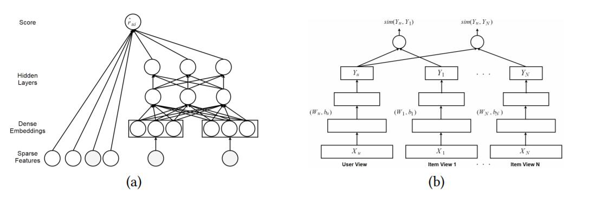

协同度量学习（CML） 。 CML [60]用欧几里德距离代替MF的点积，因为点积不满足距离函数的三角恒等性。 通过最大化用户与其不喜欢的项目之间的距离并最小化用户与其偏好项目之间的距离来学习用户和项目嵌入。 在CML中，MLP用于学习项目特征（如文本，图像和标签）的表示。

深度结构化语义模型的推荐。 深度结构化语义模型（DSSM）[65]是一个深度神经网络，用于学习常见连续语义空间中实体的语义表示，并测量它们的语义相似性。 它广泛应用于信息检索领域，非常适合 top-n 推荐[39,182]。 DSSM将不同的实体投射到一个共同的低维空间中，并用余弦函数计算它们的相似性。 基本的DSSM由MLP组成，因此我们将其放在本节中。 请注意，更高级的神经层（如卷积和最大池层）也可以轻松集成到DSSM中。

基于深度语义相似度的个性化推荐（DSPR） [182]是标签感知个性化推荐器，其中每个用户  和项目  由标记注解表示并映射到公共标记空间。 余弦相似度 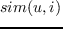 用于决定项目和用户的相关性（或用户对项目的偏好）。  DSPR的损失函数定义如下：

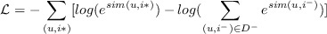 (5)

其中 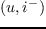 是从负面用户项目对中随机抽样的负样本。[183]的作者使用自编码器进一步改进DSPR，来从用户/项目资料中学习低维表示。

多视图深度神经网络（MV-DNN） [39]专为跨域推荐而设计。 它将用户视为透视视图，每个域（假设我们有 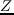 个域）作为辅助视图。 显然，对于  个用户域对，有  个相似度得分。 图 3b 展示了MV-DNN的结构。  MV-DNN的损失函数定义为：

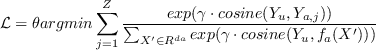 (6)

其中  是模型参数， 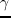 是平滑因子， 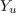 是用户视图的输出，  是活动视图的索引。 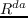 是视图   的输入域。  MV-DNN能够扩展到许多域。 然而，它基于这样的假设：如果用户在一个域中具有某种品味，应该在其他域中具有相似的品味。 直观地说，在许多情况下，这种假设可能是不合理的。 因此，我们应该初步了解不同域之间的相关性，来充分利用MV-DNN。

## 基于自编码器的推荐

将自编码器应用于推荐系统有两种通用方法：（1）利用自编码器学习瓶颈层的低维特征表示；或者（2）直接在重构层中填充交互矩阵的空白。 几乎所有的自编码器变体，例如去噪自编码器，变分自编码器，收缩自编码器和边缘化自编码器都可以应用于推荐任务。 表 3 基于所使用的自编码器类型总结了推荐模型。

基于自编码器的协同过滤。 其中一个成功的应用是从自编码器的角度考虑协同过滤。

AutoRec [125]使用用户部分向量 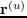 或项目部分向量  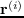 作为输入，旨在在输出层重构它们。 显然，它有两种变体：基于项目的AutoRec（I-AutoRec）和基于用户的AutoRec（U-AutoRec），对应于两种类型的输入。 在这里，我们只介绍I-AutoRec，而U-AutoRec可以相应地轻松派生。 图 4a 说明了I-AutoRec的结构。 给定输入    ，重构是：  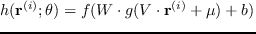  ，其中  和 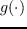 是激活函数， 是参数。  I-AutoRec的目标函数如下：

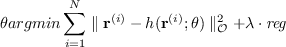 (7)

这里 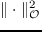 意味着它只考虑观测的评分。 可以通过弹性传播（收敛更快并产生可比较的结果）或L-BFGS（限制记忆的Broyden Fletcher Goldfarb Shanno算法）来优化目标函数。 AutoRec的四个要点值得在部署之前注意到：（1）I-AutoRec的性能优于U-AutoRec，这可能是由于用户部分观测向量的方差较大。  （2）激活函数  和  的不同组合将大大影响性能。  （3）适度增加隐藏单元大小将改善结果，因为扩展隐藏层维度使AutoRec能够更好地模拟输入的特征。  （4）添加更多层来形成深层网络可以略微改进。

**图 4：**图示：（a）基于项目的AutoRec；（b）协同去噪自编码器；（c）深层协同过滤框架。

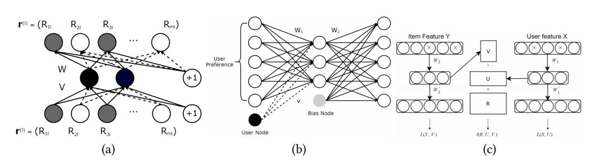

CFN [136,137]是AutoRec的扩展，具有以下两个优点：（1）它采用了去噪技术，使CFN更加健壮；（2）它结合了诸如用户资料和项目描述之类的辅助信息，来减轻稀疏性和冷启动影响。 CFN的输入也是部分观测向量，因此它也有两种变体：I-CFN和U-CFN， 和   分别作为输入。 掩蔽噪声是正则化器，用于更好地处理缺失元素（它们的值为零）。 作者介绍了三种广泛使用的破坏方法来破坏输入：高斯噪声，掩蔽噪声和椒盐噪声。  CFN的进一步扩展还包含辅助信息。 然而，CFN不是仅仅在第一层中结合辅助信息，而是在每一层中注入辅助信息。 因此，重构变为：

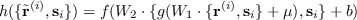 (8)

其中 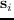 是辅助信息，  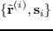 表示  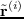 和  的连接。 结合辅助信息可提高预测准确性，加快训练过程并使模型更加健壮。

**表 3：**四种基于自编码器的推荐模型的总结

| 普通/去噪AE | 变分AE | 收缩AE | 边缘化AE |
| --- | --- | --- | --- |
| [114,125,136,137,159,177] [70,116,170,171,188] | [19,89,94] | [196] | [88] |

协同去噪自编码器（CDAE） 。 之前回顾的三个模型主要用于评分预测，而CDAE [177]主要用于排名预测。 CDAE的输入是用户的部分观测的隐式反馈 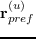  。 如果用户喜欢电影，则条目值为1，否则为0。它还可以被视为反映用户对项目的兴趣的偏好向量。 图 4b 说明了CDAE的结构。  CDAE的输入被高斯噪声破坏。 有损输入  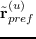 是从条件高斯分布 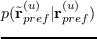  中提取的。重构定义为：

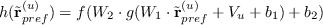 (9)

其中 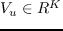 表示用户节点的权重矩阵（见图 4B）。 该权重矩阵对于每个用户是唯一的，并且对模型性能具有显着影响。 通过最小化重构误差也可以学习CDAE的参数：

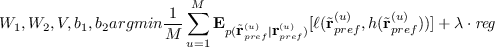 (10)

其中损失函数  可以是平方损失或 logistic 损失。

CDAE最初使用SGD在所有反馈上更新其参数。 然而，作者认为在现实世界的应用中考虑所有评分是不切实际的，因此他们提出了一种负采样技术来从负集合（用户没有与之交互的项目）中抽取一小部分，这减少了时间复杂度，但基本上没有降低排名质量。

Muli-VAE和Multi-DAE [94]提出了一种变分自编码器，用于推荐隐含数据，展示出比CDAE更好的性能。 作者介绍了一种用于参数估计的原则性贝叶斯推理方法，并且展示出比常用似然函数更好的结果。

据我们所知，基于自编码器的协同过滤（ACF）[114]是第一个基于自编码器的协同推荐模型。 它不是使用原始的部分观察向量，而是通过整数评分对它们进行分解。 例如，如果评分分数是[1-5]范围内的整数，则每个  将分为五个部分向量。 与AutoRec和CFN类似，ACF的损失函数旨在减少均方误差。 然而，ACF有两个缺点：（1）它无法处理非整数评分； （2）部分观测向量的分解增加了输入数据的稀疏性，导致预测精度更差。

用自编码器学习特征表示。 自编码器是一类功能强大的特征表示学习方法。 因此，它还可以用在推荐系统中以从用户/项目内容特征学习特征表示。

协同深度学习（CDL） 。 CDL [159]是一种分层贝叶斯模型，它将栈式去噪自编码器（SDAE）集成到概率矩阵分解中。 为了无缝地结合深度学习和推荐模型，作者提出了一个通用的贝叶斯深度学习框架[161]，它由两个紧密结合的成分组成：感知成分（深度神经网络）和任务特定成分。 具体而言，CDL的感知成分是普通SDAE的概率解释，PMF充当任务特定成分。 这种紧密结合使CDL能够平衡辅助信息和交互历史的影响。 CDL的生成过程如下：

1.  对于 SDAE 的每一层 ：（a）对于权重矩阵  的每列 ，抽取 ； （b）抽取偏置向量 ；（c） 的每一行 ，抽取 。
2.  对于每个项目  ：（a）抽取干净的输入 ；（b）抽取潜在偏移向量   并设置潜在项目向量：。
3.  为每个用户  抽取潜在的用户向量，  。
4.  对于每个用户 - 项目对 ，抽取评分 ，。

其中  和  是层  的权重矩阵和偏置向量，  代表层 。 ，，，， 是超参数， 是用于确定观察置信度的置信参数[63]。图 5（左）说明了CDL的图模型。 作者利用EM风格的算法来学习参数。 在每次迭代中，首先它都会更新  和 ，然后通过固定  和 ，更新  和 。作者还介绍了一种基于抽样的算法[161]，来避免局部最优。

在CDL之前，Wang等 [158]提出了一个类似的模型，关系栈式去噪自编码器（RSDAE），用于标签推荐。 CDL和RSDAE的区别在于，RSDAE用关系信息矩阵替换PMF。 CDL的另一个扩展是协同变分自编码器（CVAE）[89]，它用变分自编码器代替CDL的深层神经组件。 CVAE学习内容信息的概率潜变量，并且可以轻松地合并多媒体（视频，图像）数据源。

**图 5：**协同深度学习（左）和协同深度排名（右）的图模型。

协同深度排名（CDR） 。 CDR [188]专门为成对框架设计，用于 top-n 推荐。 一些研究表明，成对模型更适合排名列表生成[120,177,188]。 实验结果还表明，CDR在排名预测方面优于CDL。 图 5（右）介绍CDR的结构。  CDR生成过程的第一和第二步与CDL相同。 第三步和第四步由以下步骤代替：

*   对于每个用户 ：（a）抽取潜在的用户向量 ，；（b）对于每对成对偏好 ，其中 ，抽取估算器，。

其中  表示用户对项目  和项目  的偏好的成对关系， 是一个置信度值，表示比起项目  用户多么  喜欢项目 。优化过程与CDL相同。

深层协同过滤框架 。 它是使用协同过滤模型[88]来统一深度学习方法的一般框架。 该框架可以轻松利用深度特征学习技术来构建混合协同模型。 上述工作如[153,159,167]，可视为该一般框架的特例。 形式上，深层协同过滤框架定义如下：

 (11)

其中 ， 和  是权衡参数，用于平衡这三个成分的影响，  和  是辅助信息，  是协同过滤模型的损失。 和  充当铰链，用于连接深度学习和协同模型，以及将潜在因素链接到边信息。 在此框架的基础上，作者提出了基于边缘化去噪自编码器的协同过滤模型（mDA-CF）。 与CDL相比，mDA-CF探索了一种计算效率更高的自编码器变体：边缘化去噪自编码器[15]。 它通过边缘化损坏的输入，来节省搜索足够损坏的输入版本的计算开销，这使得mDA-CF比CDL更具可扩展性。 此外，mDA-CF嵌入项目和用户的内容信息，而CDL仅考虑项目特征的效果。

AutoSVD ++ [196]利用收缩自编码器[122]来学习项目特征表示，然后将它们集成到经典推荐模型SVD ++ [79]中。 所提出的模型具有以下优点：（1）与其他自编码器变体相比，收缩自编码器捕获无穷小的输入变化；（2）对隐式反馈进行建模，来进一步提高准确性；（3）设计了一种有效的训练算法，来减少训练时间。

HRCD [170,171]是基于自编码器和timeSVD ++ [80]的混合协同模型。 它是一种时间感知模型，它使用SDAE从原始特征中学习项目表示，旨在解决冷项目问题。
