## 基于卷积神经网络的推荐

卷积神经网络通过卷积和池化操作处理非结构化多媒体数据非常强大。 大多数基于CNN的推荐模型利用CNN进行特征提取。

用CNN学习特征表示。 CNN可用于从多个来源学习特征表示，例如图像，文本，音频，视频等。

用于图像特征提取的CNN 。Wang 等[165]研究了视觉特征对兴趣点（POI）推荐的影响，并提出了视觉内容增强型POI推荐系统（VPOI）。 VPOI采用CNN来提取图像特征。 推荐模型建立在PMF之上，探索以下因素之间的交互：（1）视觉内容和潜在用户因素；（2）视觉内容和潜在位置因素。 Chu等 [25]在餐馆推荐中利用视觉信息（例如餐馆的食物和家具的图像）的有效性。 CNN联合提取的视觉特征与文本表示一起输入到MF，BPRMF和FM中来测试它们的表现。 结果表明，视觉信息在一定程度上改善了表现，但并不显着。 He等 [50]通过将视觉特征（通过CNN学习）结合到矩阵分解中，来设计视觉贝叶斯个性化排名（VBPR）算法。 He等 [49]扩展VBPR，探索用户的时尚意识和用户在选择项目时考虑的视觉因素的演化。 Yu等。 [191]提出了一种基于美学的服装推荐的耦合矩阵和张量因子分解模型，其中CNN用于学习图像特征和美学特征。 Nguyen等。 [110]提出了一种基于CNN的个性化标签推荐模型。 它利用卷积和最大池化层从图像块中获取视觉特征。 注入用户信息以生成个性化推荐。 为了优化该网络，采用BPR目标来最大化相关和不相关标签之间的差异。 Lei等。 [84]提出了一个具有CNN的比较深度倾斜模型用于图像推荐。 该网络包括两个用于图像表示学习的CNN和一个用于用户偏好建模的MLP。 它将两个图像（一个正图像用户喜欢，一个负图像用户不喜欢）与用户进行比较。 训练数据由三胞胎组成： 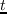  （用户 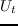  ，正面形象 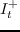  ，负面图像 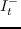  ）。 假设用户与正面图像之间的距离  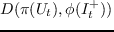 应该比用户和负面图像之间的距离更近  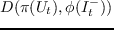  ，其中 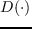 是距离度量（例如欧氏距离）。  ConTagNet [118]是一种上下文感知标签推荐系统。 图像特征由CNN学习。 上下文表示由两层全连接的前馈神经网络处理。 将两个神经网络的输出连接起来并放入softmax函数以预测候选标签的概率。

用于文本特征提取的CNN 。 DeepCoNN [202]采用两个并行的CNN来模拟评论文本中的用户行为和项目属性。 该模型通过利用评论文本的丰富语义表示，使用 CNN 来缓解稀疏性问题并增强模型可解释性。 它利用单词嵌入技术将评论文本映射到低维语义空间，并保留单词序列信息。 然后，提取的评论表示连续通过最大池化层、全连接层和具有不同核的卷积层。 用户网络  和项目网络 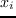 的输出最终连接作为预测层的输入，其中应用分解机来捕获它们的交互，来进行评分预测。 Catherine 等  [11]提到，只有在目标用户为目标项目编写的评论文本在测试时可用时，DeepCoNN才能正常工作，这是不合理的。 因此，他们通过引入潜在层来扩展它来表示目标用户 - 目标项目对。 此模型在验证/测试期间不访问评论，并且仍然可以保持良好的准确性。 Shen等  [130]建立了一个电子学习资源推荐模型。 它使用CNN从学习资源的文本信息中提取项目特征，如学习资料的介绍和内容，并使用[153]的相同程序进行推荐。  ConvMF [75]使用与CDL类似的方式将CNN与PMF相结合。  CDL使用自编码器来学习项目特征表示，而ConvMF使用CNN来学习高级项目表示。  ConvMF相对于CDL的主要优点是CNN能够使用词嵌入和卷积核，捕获更准确的项目上下文信息。  Tuan 等  [148]建议使用CNN来学习项目内容信息（例如，名称，描述，标识符和类别）的特征表示形式，来增强基于会话的推荐的准确性。

用于音频和视频特征提取的CNN 。 Van 等 [153]建议使用CNN从音乐信号中提取特征。 卷积核和池化层允许多个时间段的操作。 这种基于内容的模型可以缓解音乐推荐的冷启动问题（音乐尚未消耗）。 Lee 等 [83]建议使用著名的CNN模型ResNet提取音频特征。 该推荐在类似于CML的协同度量学习框架中执行。

基于CNN的协同过滤。 直接将CNN应用于普通协同过滤也是可行的。 例如，He等。 [51]建议使用CNN来改进NCF并提出ConvNCF。 它使用外部产品而不是点积来模拟用户项交互模式。 CNN应用于外部产品的结果，并且可以捕获嵌入维度之间的高阶相关性。 Tang等。 [143]呈现了具有CNN的顺序推荐（具有用户标识符），其中两个CNN（分层和垂直）用于对联合级序列模式进行建模并且跳过用于序列感知推荐的行为。

用于推荐的图CNN。 图卷积网络是非欧几里得数据的强大工具，例如：社交网络，知识图，蛋白质交互网络等[77]。 推荐区域中的交互也可以被视为这样的结构化数据集（二分图）。 因此，它也可以应用于推荐任务。 例如，Berg等 [6]建议将推荐问题视为使用图CNN的链接预测任务。 该框架使得将用户/项目方信息，例如社交网络和项目关系，集成到推荐模型中变得容易。 Ying等。 [190]建议使用图CNN来进行Pinterest中的推荐 \[\*\]  。 该模型使用随机游走和图CNN，从图结构以及项目特征信息生成项目嵌入，并且适用于非常大规模的网络推荐系统。 所提出的模型已经部署在Pinterest中，来解决各种现实世界的推荐任务。

## 基于循环神经网络的推荐

RNN非常适合顺序数据处理。 因此，它成为处理交互的时间动态，用户行为和顺序模式，以及具有顺序信号（如文本，音频等）的辅助信息的自然选择。

没有用户标识符的基于会话的推荐。 在许多现实世界的应用或网站中，系统通常不会打扰用户登录，因此它无法访问用户的标识符及其长期消费习惯或长期兴趣。 但是，会话或cookie机制使这些系统能够获得用户的短期偏好。 由于训练数据的极度稀疏，这在推荐系统中是相对不受欢迎的任务。 最近的进展证明了RNN在解决这个问题方面的效果[56,142,176]。

GRU4Rec 。 Hidasi等 [56]提出了一个基于会话的推荐模型GRU4Rec，基于GRU（如图 6a）。 输入是实际的会话状态，带有 1-of-N 编码，其中`N`是物品的数量。 如果相应的项在此会话中处于活动状态，则坐标将为 1，否则为0。输出是每个项目在会话中成为下一个项的可能性。 为了有效地训练所提出的框架，作者提出了一种会话并行的小批量算法，和一种用于输出的采样方法。 排名损失为 TOP1 并具有以下形式：

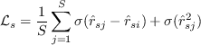 (12)

其中 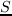 是样本大小， 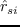 和 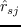 是负面项目 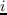 和正面项目 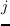 在会话 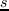 中的得分，  是 sigmoid 函数。 最后一项用于正则化。 注意，BPR损失也是可行的。 最近的一项工作[55]发现[56]中定义的原始TOP1损失和BPR损失受到梯度消失问题的影响，因此，提出了两种新的损失函数：TOP1-max和BPR-max。

后续工作[142]提出了几种进一步改进该模型的策略：（1）通过序列预处理和dropout正则化来扩展点击序列；（2）适应时间变化，通过使用完整的训练数据来预训练，并使用最近的点击序列微调模型；（3）使用教师模型和特权信息来改善模型 ；（4）使用项目嵌入来减少参数数量，以便更快地计算。

Wu等 [176]为真实世界的电子商务网站设计了基于会话的推荐模型。 它利用基本RNN根据点击历史预测用户下次购买的内容。 为了最小化计算成本，它只保留有限数量的最新状态，同时将旧状态折叠为单个历史状态。 该方法有助于权衡计算成本和预测准确性。 Quadrana 等 [117]提出了基于会话的用于推荐的分层递归神经网络。 当存在用户标识符时，该模型可以处理会话感知推荐。

上述三个基于会话的模型不考虑任何辅助信息。 两个扩展[57,132]表明辅助信息对提升会话推荐质量有影响。 Hidasi等 [57]引入了基于会话的并行推荐架构，该架构利用三个GRU来学习身份单热向量，图像特征向量和文本特征向量的表示。 这三个GRU的输出被加权连接并放入非线性激活，来预测该会话中的下一个项目。 Smirnova等 [132]提出了一种基于条件RNN的基于上下文感知会话的推荐系统。 它将上下文信息注入输入和输出层。 这两个模型的实验结果表明，包含额外信息的模型优于仅基于历史交互的模型。

尽管RNN在基于会话的推荐中取得了成功，但Jannach等 [68]表明，简单的邻域方法可以获得精度与GRU4Rec相同的结果。 将邻域与RNN方法相结合通常可以获得最佳性能。 这项工作表明，最近的工作中的一些基线没有充分证明和正确评估。 可以在[103]中找到更全面的讨论。

用户标识符的顺序推荐。 与基于会话的推荐系统不同，其中通常不存在用户标识符。 以下研究涉及带有已知用户标识的顺序推荐任务。

循环推荐网络（RRN） [175]是建立在RNN上的非参数推荐模型（如图 6B 所示）。 它能够模拟项目的季节性演化和用户偏好随时间的变化。  RRN使用两个LSTM网络作为积木来模拟动态用户状态 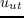 和项目状态 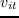  。 同时，考虑到用户长期兴趣和项目静态特征等固定属性，该模型还结合了用户和项目的固有潜在属性： 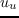 和 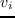  。 由用户  给出，在时间  上的项目的预测评分  定义为：

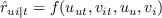 (13)

其中  和  从LSTM学习，  和  通过标准矩阵分解学习。 优化是最小化预测和实际评分值之间的平方误差。

Wu 等 [174]通过同时对文本评论和评分进行建模，进一步改进了RRN模型。 与大多数文本评论扩展型推荐模型[127,202]不同，此模型旨在使用具有用户和项目潜在状态的字符级LSTM网络生成评论。 评论生成任务可以被视为促进评分预测的辅助任务。 该模型能够提高评分预测的准确性，但不能生成连贯且可读的评论文本。 下文中介绍的NRT [87]可以生成可读的评论提示。 Jing等 [73]提出了一个多任务学习框架，可以同时预测用户的返回时间和推荐项目。 返回时间预测由生存分析模型驱动，它设计用于估计患者生存概率。 作者修改此模型，使用LSTM来估计客户的返回时间。 项目推荐也通过LSTM从用户过去的会话动作执行。 与上述基于会话的推荐系统不同，该推荐系统侧重于在同一会话中进行推荐，该模型旨在提供会话间的推荐。 Li 等 [91]提出了一个行为密集型的顺序推荐模型。 该模型由两部分组成：神经项目嵌入和判别行为学习。 后一部分由两个LSTM组成，分别用于会话和偏好行为学习。 Christakopoulou 等 [24]设计了一个带有RNN的交互式推荐系统。 提出的框架旨在解决交互推荐中的两个关键任务：提问和回答。 RNN用于处理这两项任务：根据用户最近的行为（例如，观察事件）预测用户可能会问的问题并预测响应。 Donkers等 [35]设计了一种新型的门控循环单元，来明确表示个人用户的下一个项目推荐。

**图 6：**插图：（a）使用RNN的基于会话的推荐；（b）循环推荐网络；（c）基于受限玻尔兹曼机的协同过滤。

使用RNN学习特征表示。 对于具有顺序模式的辅助信息，使用RNN作为表示学习工具是可取的选择。

Dai 等 [29]提出了一个共同进化的潜在模型，来捕捉用户和项目潜在特征的共同演化特性。 用户和项目之间的交互在推动用户偏好和项目状态的变化方面起着重要作用。 为了对历史交互进行建模，作者建议使用RNN自动学习来自用户和项目特征的变迁，进化和共同演化的影响的表示。

Bansal等 [5]建议使用GRU将文本序列编码为潜在因子模型。 这种混合模型解决了热启动和冷启动问题。 此外，作者采用了多任务正则化器来防止过拟合并减小训练数据的稀疏性。 主要任务是评分预测，而辅助任务是项目元数据（例如标签，流派）预测。

Okura等。 [113]建议使用GRU来学习用户浏览历史（浏览的新闻）的更具表现力的聚合，并使用潜在因子模型推荐新闻文章。 与传统的基于单词的方法相比，结果显示出显着的改进。 该系统已完全部署到在线生产服务，每天为超过一千万的独立用户提供服务。

Li 等 [87]提出了一个多任务学习框架NRT，用于预测评分以及同时为用户生成文本提示。 生成的提示提供简明的建议，并预测用户对某些产品的体验和感受。 评分预测任务由项目和用户潜在因素 ，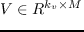 上的非线性层建模，其中 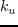 和 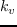  （不一定相等）是用户和项目的潜在因素维度。将预测评分 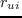 和两个潜在因子矩阵馈送到GRU中以产生提示。 这里，  用作上下文信息来决定生成的提示的情绪。 多任务学习框架使整个模型能够在端到端的范式中得到有效的训练。

Song 等 [135]设计了一个时态DSSM模型，该模型将RNN集成到DSSM中进行推荐。 基于传统的DSSM，TDSSM将左侧网络替换为项目静态特征，将右侧网络替换为两个子网络，来建模用户静态特征（具有MLP）和用户时间特征（具有RNN）。

## 基于受限玻尔兹曼机的推荐

Salakhutdinov等 [123]提出了一种基于受限玻尔兹曼机的推荐系统（如图 6C 所示）。 据我们所知，它是第一个建立在神经网络上的推荐模型。  RBM的可见单元限于二进制值，因此，评分得分以单热向量表示来适应该限制。 例如，[0,0,0,1,0]表示用户给该项目评分4。 让 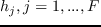 表示固定大小为 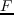 的隐藏单元。 每个用户都有一个具有共享参数的唯一RBM。 假设用户评价 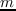 个电影，可见单元的数量为   ，让 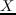 是一个 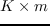 矩阵，其中 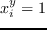，如果用户 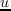 给电影  打分为 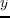，否则为 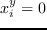。 然后：

 (14)

其中 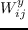 表示电影 的评分   和隐藏单元  之间连接的权重， 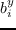 是评分  对于电影  的偏差，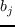 是隐藏单元  的偏差。RBM不易处理，但可以通过对比发散（CD）算法[45]来学习参数。 作者进一步提出使用条件RBM来结合隐式反馈。 这里的实质是，用户通过给出评分来隐含地告诉他们的偏好，无论他们如何评价项目。

上述RBM-CF是基于用户的，其中给定用户的评分限制在可见层上。 与之类似，如果我们将给定项目的评分限制在可见层上，我们可以轻松设计基于项目的RBM-CF。 Georgiev等 [42]建议将基于用户和基于项目的RBM-CF组合在一个统一的框架中。 在这种情况下，可见单元由用户和项目隐藏单元确定。 Liu等 [100]设计了混合RBM-CF，其中包含项目特征（项目类别）。 该模型也基于条件RBM。 这种混合模型与具有隐式反馈的条件RBM-CF之间存在两个差异：（1）这里的条件层用二元项目类型建模；（2）条件层使用不同连接权重影响隐藏层和可见层。

**表：**基于神经注意的推荐模型的类别。

| 普通注意 | 共同注意 |
| --- | --- |
| [14, 44, 70, 90, 99, 101, 127, 145, 169, 189] | [62, 146, 193, 194, 205] |

## 基于神经注意力的推荐

注意力机制是由人类视觉注意力驱动的。 例如，人们只需要关注视觉输入的特定部分来理解或识别它们。 注意力机制能够从原始输入中滤除无信息特征，并减少噪声数据的副作用。 这是一种直观但有效的技术，近年来在计算机视觉[3]，自然语言处理[104,155]和语音识别[22,23]等领域引起了相当多的关注。 神经注意力不仅可以与MLP，CNN和RNN一起使用，还可以独立地解决一些任务[155]。 将注意力机制集成到RNN中，使RNN能够处理长而嘈杂的输入[23]。 虽然LSTM可以在理论上解决长期记忆问题，但在处理远程依赖时仍然存在问题。 注意力机制提供了更好的解决方案，并帮助网络更好地记忆输入。 基于注意力的CNN能够捕获输入中信息量最大的元素[127]。 通过将注意力机制应用于推荐系统，可以利用注意力机制来过滤无信息内容并选择最具代表性的项目[14]，同时提供良好的可解释性。 虽然神经注意力机制并不完全是一种独立的深度神经技术，但由于其广泛使用，仍然值得单独讨论。

注意力模型使用注意力得分来学习输入的注意力。 计算注意力得分是神经注意力模型的核心。 基于计算注意力得分的方式，我们将神经注意力模型分为（1）标准的普通注意力和（2）共同注意力。 普通注意力利用参数化的背景向量来学习注意力，而共同注意力涉及从两个序列学习注意力权重。 自我注意力是共同关注的一个特例。 最近的工作[14,44,127]展示了注意力机制在提高推荐效果方面的能力。 表 ?? 总结了基于注意力的推荐模型。

使用普通注意力的推荐

Chen 等。 [14]通过在潜在因子模型中引入二级注意力机制，提出了一种注意力协同过滤模型。 它由项目级别和组件级别的注意力组成。 项目级注意力用于选择最具代表性的项目来表示用户。 组件级别的注意力旨在从每个用户的多媒体辅助信息中捕获最丰富的信息。 Tay 等 [145]为协同度量学习提出了基于记忆的注意力。 它引入了潜在关系向量，通过CML的关注来习得。 Jhamb等 [70]提出，使用注意力机制来提高基于自编码器的CF的性能。Liu等 [99]提出了一种基于短期注意力和记忆优先级的模型，其中长期和短期用户兴趣都集成在基于会话的推荐中。 Ying等 [189]提出了序列推荐的分层注意力模型。 两个注意力网络用于模拟用户的长期和短期兴趣。

向RNN引入注意力机制可以显着提高其性能。 Li等 [90]提出了一种基于注意力的LSTM模型，用于标签推荐。 这项工作利用RNN和注意力机制的优势，来捕获序列属性并识别来自微博帖子的信息性单词。 Loyala等 [101]提出了一种编码器 - 解码器架构，注重用户会话和意图建模。 该模型由两个RNN组成，可以以更具表现力的方式捕捉过渡性规律。

普通注意力也可以与CNN一起用于推荐任务。 Gong等 [44]提出了一个基于注意力的CNNs系统，用于微博中的`#`标签推荐。 它将主题标签推荐视为多标签分类问题。 所提出的模型由全局通道和局部注意力通道组成。 全局通道由卷积滤波器和最大池化层组成。 所有单词都在全局通道的输入中编码。 局部注意力通道具有一个具有给定窗口大小和阈值的注意层，来选择信息性词语（在本工作中称为触发词）。 因此，只有触发词在后续层中起作用。 在后续工作[127]中，Seo等 利用与[44]相同的两个神经网络（没有最后两层）来学习来自用户和项目评论文本的特征表示，并使用最终层中的点积来预测评分。 Wang等 [169]提出了文章推荐的组合模型，其中CNN用于学习文章表示，并且注意力被用于处理编辑的选择行为的多样化差异。

共同注意力的推荐。Zhang等 [194]提出了一个组合模型AttRec，它通过利用自我注意力和度量学习的强度来改进顺序推荐性能。 它利用自我注意力从最近的交互中学习用户的短期意图，并利用度量学习的优势来学习更具表现力的用户和项目嵌入。 Zhou等 [205]建议使用自我注意力进行用户异构行为建模。 自我注意力是一种简单而有效的机制，并且在顺序推荐任务方面表现出优于CNN和RNN的性能。 我们相信它有能力取代许多复杂的神经模型，预计会有更多的综述。 Tay等 [146]提出了一种基于评论的推荐系统，具有多指针的共同注意力。 共同注意力使模型能够通过用户和项目评论的共同学习来选择信息性评论。 Zhang等 [193]提出了一种基于共同注意力的标签推荐模型，该模型集成了视觉和文本信息。 Shi等 [62]提出了一种神经共同注意力模型，用于带有元路径的个性化排名任务。

## 基于神经自回归的推荐

如上所述，RBM不易处理，因此我们通常使用Contrastive Divergence算法来近似参数[81]上的对数似然梯度，这也限制了RBM-CF的使用。 所谓的神经自回归分布估计器（NADE）是一种易处理的分布估计器，它为RBM提供了理想的替代方案。 受RBM-CF的启发，Zheng等 [204]提出了一种基于NADE的协同过滤模型（CF-NADE）。 CF-NADE模拟用户评分的分布。 在这里，我们提供一个详细的例子来说明CF-NADE的工作原理。 假设我们有4部电影：m1（评分为4），m2（评分为2），m3（评分为3）和m4（评分为5）。 CF-NADE模拟评分向量  的联合概率，通过链式规则：  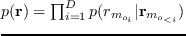，其中 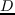 是用户评分的项目数，  是`D`元组，是 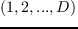 的排列， 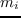 是第  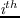 个评论的项目的下标， 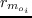 是用户给商品 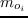 的评分。 具体来说，该过程如下：（1）用户给 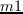 四星的概率，没有任何条件； （2）用户给 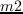 2星的概率，条件为  四星； （3）用户给 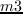  三星的概率，条件为  四星和   2星的； （4）用户给 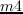 五星的概率，条件为  四星，   2星和   3星。

理想情况下，电影的顺序应遵循评分的时间戳。 然而，实证研究表明，随机抽取也会产生良好的性能。 该模型可以进一步扩展到深度模型。 在后续文献中，Zheng等 [203]提出结合隐式反馈来克服评分矩阵的稀疏性问题。 Du等 [36]使用用户项目共同自回归方法进一步改进了该模型，该方法在评分估计和个性化排名任务方面具有更好的性能。

## 深度强化学习推荐

大多数推荐模型将推荐过程视为静态过程，这使得难以捕获用户的时间意图并及时响应。 近年来，DRL开始引起人们对个性化推荐的关注[21,107,168,198-200]。 Zhao等 [198]提出了一个DRL框架DEERS，用于在顺序交互设置中提供负反馈和正反馈。 Zhao等 [200]使用DRL探索了页面推荐方案，建议的框架DeepPage能够根据用户的实时操作自适应地优化项目页面。Zheng等。 [200]提出了一个新闻推荐系统DRN，用DRL来应对以下三个挑战：（1）新闻内容和用户偏好的动态变化；（2）纳入用户的退货模式（对服务）；（3）增加建议的多样性。 Chen等 [16]提出了一种强大的深度Q学习算法，用两种策略解决不稳定的奖励估计问题：分层抽样重放和近似后悔奖励。 崔等。 [21]提出用RL和双聚类解决冷启动问题。 Munemasa等[107]建议使用DRL进行商店推荐。

强化学习技术，如上下文 - 强盗方法[86]，已在实际应用中表现出卓越的推荐性能。 深度神经网络增加了RL的实用性，并且可以为设计实时推荐策略建模各种额外信息。

## 基于对抗网络的推荐

IRGAN [162]是第一个将GAN应用于信息检索领域的模型。 具体而言，作者展示了其在信息检索任务中的三个能力，包括：网络搜索，项目推荐和问题回答。 在本综述中，我们主要关注如何使用IRGAN推荐商品。

首先，我们介绍IRGAN的一般框架。 传统的GAN由判别器和生成器组成。 可能在信息检索方面存在两种思维流派，即生成检索和判别检索。 给定查询 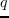，生成检索假定文档和查询之间存在潜在的生成过程，并且可以通过生成相关文档来实现检索任务 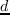。给定标记的相关查询 - 文档对，判别式检索学习预测相关性得分 。IRGAN的目标是将这两个想法组合成一个统一的模型，并使它们在GAN中扮演像生成器和判别器这样的极小极大游戏。 生成检索旨在生成类似于真实情况的相关文档，来欺骗判别性检索模型。

形式上，让 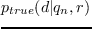 指代用户的相关性（偏好）分布。 生成检索模型   试图近似真实的相关性分布。 判别性检索  试图区分相关文档和不相关文档。 与GAN的目标函数类似，总体目标如下：

 (15)

其中 ， 代表 sigmoid 函数， 和  分别是生成和判别检索的参数。参数  和  可以用梯度下降交替学习。

为逐点相关性估计构造上述目标方程。在某些特定任务中，应该采用成对范式来生成更高质量的排名列表。这里，假设由 softmax 函数给出：  

 (16)

是文档  从查询  生成的机会。在显式世界的检索系统中，两者  和  都是特定于任务的。它们可以具有相同或不同的公式。为方便起见，作者使用相同的函数对它们进行了建模，并将它们定义为： 和 。在项目推荐方案中，作者采用矩阵分解来表示 。它可以用其他高级模型代替，例如分解机或神经网络。

He 等\[52\]提出了一种对抗性的个性化排名方法，使用对抗性训练增强了贝叶斯个性化排名。它在原始BPR目标和对手之间进行极小极大游戏，增加噪音或排列来最大化BPR损失。Cai等\[9\]为引文文献网络提出了一种基于GAN的表示学习方法，可以有效地解决个性化的引文推荐任务。Wang等\[164\]建议使用GAN为基于存储器网络的流推荐系统生成负样本。实验表明，所提出的基于GAN的采样器可以显着提高性能。

## 用于推荐的深度混合模型

凭借深度神经网络的良好灵活性，可以集成许多神经积木，来形成更强大和更具表现力的模型。尽管有很多可能的组合方式，但我们建议混合模型应该针对特定任务而合理并精心设计。在这里，我们总结了据证明在某些应用领域有效的现有模型。

CNN和自编码器。基于协同知识嵌入（CKE）\[192\]将CNN与自编码器相结合，用于图像特征提取。 CKE可以被视为CDL的另一步。 CDL仅考虑项目文本信息（例如文章摘要和电影情节），而CKE使用不同嵌入技术，利用结构内容，文本内容和视觉内容。结构信息包括项目的属性以及项目和用户之间的关系。 CKE采用TransR \[96\]，一种异构网络嵌入方法，用于解释结构信息。同样，CKE使用SDAE从文本信息中学习特征表示。至于视觉信息，CKE采用堆叠卷积自编码器（SCAE）。SCAE通过用卷积层替换全连接的SDAE层来有效利用卷积。推荐过程类似于CDL的概率形式。

CNN和RNN。Lee等 \[82\]提出了一个带有RNN和CNN的深度混合模型，用于引用推荐。引用推荐被视为，在给定查询文本或对话的情况下，生成有序的引用列表的任务（每个对话包含一系列推文）。它应用CNN来学习重要的局部语义，并将它们映射到分布向量。 LSTM进一步处理这些分布向量，来计算目标引用与给定推文对话的相关性。整体架构如图12（a）所示。

Zhang等\[193\]提出了基于CNN和RNN的混合模型，用于标签推荐。给定带有相应图像的推文，作者利用CNN从图像中提取特征，并利用LSTM从推文中学习文本特征。同时，作者提出了一种共同关注机制来模拟相关影响并平衡文本和图像的贡献。

Ebsesu等\[38\]提出了一个神经引文网络，它将CNN与RNN集成在一个编码器 - 解码器框架中，用于引用推荐。在此模型中，CNN充当编码器，捕获来自引用上下文的长期依赖性。给定所有先前的单词以及CNN获得的表示，RNN用作解码器，学习所引用的论文的标题中的单词的概率。

Chen 等\[17\]提出了一个集成CNN和RNN的集成框架，用于个性化（视频中）关键帧的推荐，其中CNN用于学习关键帧图像的特征表示，RNN用于处理文本特征。

RNN和自编码器。前面提到的协同深度学习模型缺乏鲁棒性，无法对文本信息序列进行建模。Wang 等 \[160\]进一步利用集成RNN和去噪自编码器来克服这些限制。作者首先设计了一种名为鲁棒复现网络的泛化RNN。基于强大的循环网络，作者提出了称为CRAE的分层贝叶斯推荐模型。CRAE还包括编码和解码部分，但它用RNN替换前馈神经层，这使得CRAE能够捕获项目内容信息的顺序信息。此外，作者设计了通配符去噪和β池化技术来防止模型过拟合。

具有DRL的RNN。Wang 等。[163\]建议将监督的深度强化学习与RNNs结合起来用于治疗推荐。该框架可以从指标信号和评估信号中学习处方策略。实验表明，该系统可以自动推断和发现最佳处理方法。我们相信这是一个有价值的话题，有益于社会利益。