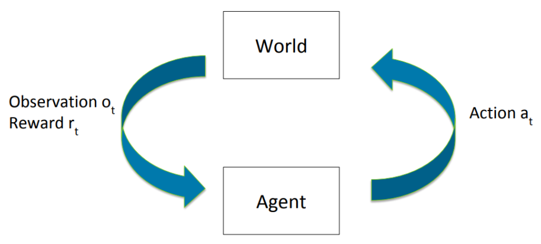
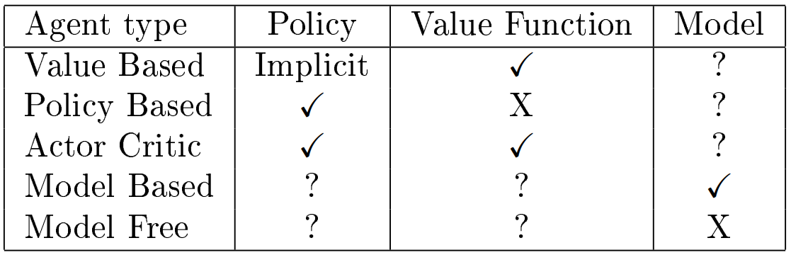
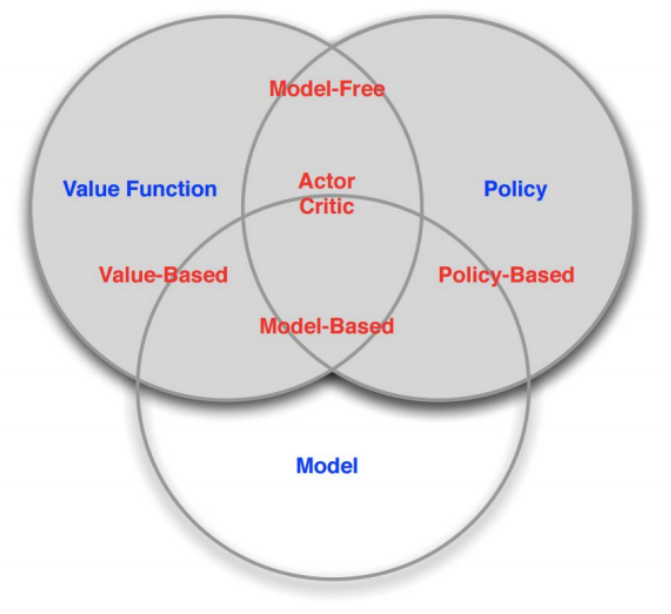

# Lecture 1 Introduction to Reinforcement Learning

# 课时1 强化学习介绍 2019.01.07

## 1. 引言

在强化学习（Reinforcement Learning）中，我们考虑在没有明确的指导的情况下，学习如何通过经验（experience）去进行动作（action）的问题。强化学习行为体（agent）需要同它所处的环境（environment）交互，并从中学习如何最大化随时间累积的奖励（reward）。

可能是由于 Deep Q-Network [[1]](#ref1) 取得了巨大进步，近些年来强化学习越来越收到欢迎。人工智能的其他领域也正尝试通过借鉴与利用强化学习中的概念去取得成功。例如，AlphaGo 通过强化学习的方法在围棋领域达到了超过人类的表现 [[3]](#ref3)，强化学习的概念在生成对抗网络（Generative Adversarial Networks, GAN）的训练过程中也得以应用 [[2]](#ref2)。

很多人好奇强化学习与其他机器学习方式的不同之处。在有监督学习（Supervised Learning）中，已知包括了例子和标记的数据集，对于分类问题，例子对应的正确的标签已知；对于回归问题，例子对应的正确的输出已知。相反，无监督学习（Unsupervised Learning）指的是利用标记未知的数据集，找到数据中隐含的关系。在强化学习中，我们需要做出决策并比较可采取的动作，而不是做出预测。强化学习行为体可以和环境交互，并在每次交互中获得一些立即的、局部反馈信号，这些信号通常被称作奖励。但是，行为体不知道它采取的动作是否是它能够选择的“最好的“动作，它必须通过某种方式去学习通过选择一些动作来最大化长期的累积的奖励。因此，由于奖励信号提供的反馈很弱/不完整，我们可以认为强化学习介于有监督学习和无监督学习之间：有监督学习中的有标记的数据提供强有力的反馈，而无监督学习中没有标记或反馈。

强化学习引入了许多需要克服的困难，并且我们可能要在这些挑战中进行权衡。行为体必须能够优化它的动作以使其收到的奖励达到最大，但是，因为它需要通过与环境交互来学习，探索（exploration）也是需要的。这自然就导致了探索与利用（exploitation）的权衡，在这种情况下，行为体需要决定是寻找新的、更好的策略但要承担获得较低奖励的风险，还是利用它已经知道的策略。另一个我们需要面对的问题是，行为体是否能够归纳它的经验？也就是说，它能否学习到一些曾经没出现过的行为是好是坏。最后，我们还需要考虑行为体的延迟后果，也就是说，如果它获得了一个高回报，是因为它刚刚采取的行为，还是因为更早采取的行动。

## 2. 强化学习概述

### 2.1 序列决策制定

通常我们考虑制定一个好的决策序列的问题。为了标准化这个问题，在离散的设置中，一个行为体进行一个动作（actions）序列 $\lbrace a_t \rbrace$，观测到一个观测值（observations）序列 $\lbrace o_t \rbrace$ 并获得一个奖励（rewards）序列 $\lbrace r_t \rbrace$。我们定义在时刻 $t$ 的历史（history）为 $h_t=(a_1,o_1,r_1,...,a_t,o_t,r_t)$，行为体选择的下一个动作可以被视为历史的函数，也就是说，$a_{t+1}=f(h_t)$，并且序列决策制定的问题可以被认为是如何恰当地定义并计算这个函数。

图 1：行为体与环境交互。

 

当序列决策制定过程的模型已知时，在一些确定的和有限的设定下，类似 A* 搜索 （A* search）和最大最小（minimax）的 AI 技术可以被应用于寻找最优动作序列。

然而，如果存在非常多（或无限）可能的状态，或模型中有一定的随机性，暴力的搜索变得不再可行。在这样的设定下，我们有必要结合泛化去使得任务可行，就像在课堂中看到的 Atari 例子那样。此外，如果没有彻底搜索的能力，行为体必须决定如何有策略性地做出动作去平衡短期的和长期的奖励。

### 2.2 模型建立

定义 $S$ 为可能的状态的集合，$s_t$ 为观测到的状态序列，观测值以时间为下标，$A$ 为可能的动作的集合，$P(s_{t+1}|s_t,a_t,...,s_1,a_1)$ 为历史状态和历史动作的函数，表示在 $S$ 上的状态转移（transition dynamics）概率分布。在强化学习中，我们通常假设马尔可夫性质（Markov Property）：
$$
P(s_{t+1}|s_t,a_t,...,s_1,a_1)=P\left( s_{t+1}|s_t,a_t \right),
\tag{1}
$$
在实践中，这一性质足以满足我们的要求。确保马尔可夫性质成立的一个小技巧是使用历史 $h_t$ 作为我们的状态。

通常我们认为奖励 $r_t$ 在状态转换时被获得 $s_t\stackrel{a_t}{\longrightarrow}s_{t+1}$，奖励函数（reward function）被用来预测奖励：$R(s,a,s')=\mathbb{E}[r_t|s_t=s,a_t=a,s_{t+1}=s']$。我们通常将奖励函数定义为以下的形式：$R(s)=\mathbb{E}[r_t|s_t=s]$ 或 $R(s,a)=\mathbb{E}[r_t|s_t=s,a_t=a]$。奖励函数有时也会存在退化情况，也就是说在给定 $s_t=s$ 时，$r_t$ 是一个固定值。

模型由上述状态转移和奖励函数组成。

### 2.3 强化学习行为体的组成

我们定义行为体状态（agent state）为历史的函数 $s_t^a=g(h_t)$。强化学习行为体通常包括以下三项中的一项或多项：策略（policy），值函数（value function）和可选的模型（model）。策略 $\pi$ 是从行为体状态到一个动作的映射 $\pi(s_t^a)\in A$，有时策略是在动作的随机分布 $\pi(a_t|s_t^a)$，当行为体要采取一个动作并且 $\pi$ 是随机的时，行为体以概率 $P(a_t=a)=\pi(a|s_t^a)$ 选择一个动作 $a\in A$。给定策略 $\pi$ 和衰减因子（discount factor）$\gamma\in[0,1]$，值函数（value function）$V^{\pi}$ 被定义为衰减奖励总额的期望
$$
V^{\pi}(s)=\mathbb{E}_ {\pi}[r_t+\gamma r_{t+1}+\gamma^2r_{t+2}+...|s_t=s],
\tag{2}
$$
这里 $\mathbb{E}_{\pi}$ 表示对通过使用策略 $\pi$ 遇到的状态求期望，衰减因子 $\gamma$ 用来对立即奖励和延迟奖励加权。最后，一个强化学习行为体可能有类似2.2节定义的模型，如果行为体拥有模型，我们称之为有模型（model-based）行为体；如果它不包含模型，则称之为无模型（model-free）行为体。

到目前为止，我们已经在一个非常常规的环境中考虑了定义，但我们尚未对 $o_t$ 和 $s_t$ 的关系做出任何假设。我们称 $o_t\neq s_t$ 的情况为部分可观测的（partially observable）。在部分可观测的设定中，为了定义可信状态（belief state）$s_t^a$，强化学习算法通常使用基于真实世界状态的概率分布。

然而，对于本课程的大部分内容，我们考虑完全可观测（fully observable）的情况，也就是说 $o_t=s_t$ 而且我们假设 $s_t^a=s_t$。

### 2.4 强化学习行为体的分类

有很多种方式进行分类，如表 1，并且在每种分类下，行为体的种类并不一定单一，例如，演员-评论家（actor critic）行为体也可以是无模型的。对行为体分类的方法概述如图 2 所示。

<!--
Agent type | Policy | Value Function | Model
 :-: | :-: | :-: | :-:
Value Based | Implicit | &radic; | ?
Policy Based | &radic; | X | ?
Actor Critic | &radic; | &radic; | ?
Model Based | ? | ? | &radic;
Model Free | ? | ? | X
-->

表 1：强化学习行为体分类，&radic; 表示行为体包含这一部分，X 表示行为体一定不包含这一部分，? 表示行为体可能含有这一部分。

 

图 2：强化学习行为体分类 [4](#ref4)。

### 2.5 连续空间

为简单起见，我们的讨论只集中在了具有离散时间步的离散状态和动作空间。然而，有许多应用，特别是在机器人和控制领域，最适合用连续状态和动作空间进行建模。对上述讨论进行推广，可以使其适用于这些连续空间的情况。

## 参考文献

1. V. Mnih et al., "Human-level control through deep reinforcement learning," *Nature* 518(7540): 529-533, 2015.

2. D. Pfau, and O. Vinyals, "Connecting generative adversarial networks and actor-critic methods," *arXiv preprint arXiv: 1610.01945*, 2016.

3. D. Silver et al., "Mastering the game of Go with deep neural networks and tree search," *Nature* 529(7587): 484-489, 2016.

4. D. Silver. "[Reinforcement Learning](http://www0.cs.ucl.ac.uk/staff/d.silver/web/Teaching_files/intro_RL.pdf)," 15 Jan. 2016. Reinforcement Learning, UCL.