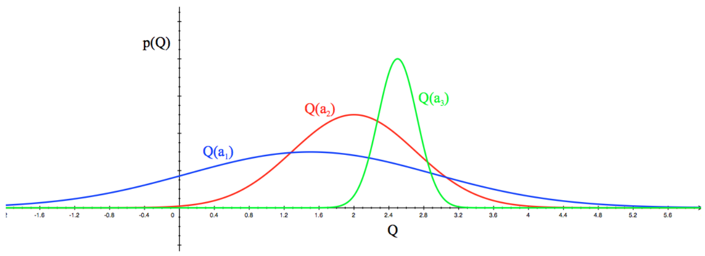
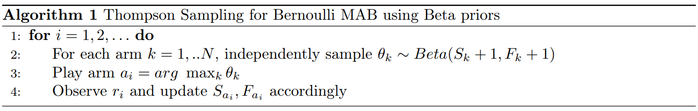

# Lecture 11&12 Exploration and Exploitation

# 课时11&12 探索与利用 2019.02.20 & 2019.02.25 & 2019.02.27

## 1. 介绍（Introduction）

我们之前讨论过强化学习算法的设计，特别地，除了渐近收敛之外，我们还希望获得良好的性能。在教育、医疗或机器人等许多实际应用中，渐近收敛速度并不是比较强化学习算法的有效指标。为实现良好的现实世界中的表现，我们希望能够快速收敛到好的策略，这有赖于良好的、有策略性的探索。

在线决策涉及到探索（exploration）与利用（exploitation）之间的基本权衡。利用（通过最大化未来收益来）制定最佳的可能的策略，而探索则采取次优动作来收集信息。虽然次优动作必然会导致近期的奖励减少，但它可能使得我们学习更好的策略，从长远来看能够改进策略。

## 2. 多臂赌博机问题（Multi-Armed Bandits）

我们首先讨论在多臂赌博机（multi-armed bandits, MABs）背景下，而非完全 MDPs 背景下的探索。MAB 是元组 $(A,R)$，这里 $A$ 表示动作的集合，$R$ 为每个动作对应奖励的概率分布 $R^{a}(r)=P[r|a]$。在每个时间步，行为体选择一个动作 $a_{t}$。像在 MDPs 中那样，行为体的目的是最大化累积的奖励。但由于不存在状态转移，所以不存在延迟的奖励或结果的概念。

令 $Q(a)=\mathbb{E}[r|a]$ 表示采取动作 $a$ 的真实期望奖励。我们考虑估计 $\hat{Q}_{t}(a)\approx Q(a)$ 的算法，该值通过蒙特卡洛评估来估计：

$$
\hat{Q}_ {t}(a) = \frac{1}{N_{t}(a)}\sum_{t=1}^{T} r_{t} {\bf{1}} (a_{t}=a) = \hat{Q}_ {t-1}(a)+\frac{1}{N_{t}(a)}(r_{t}-\hat{Q}_ {t-1}(a))，
\tag{1}
$$

这里 $N_{t}(a)$ 为动作 $a$ 在时间 $t$ 被采用过的次数。第二个等式用于递增地计算 $\hat{Q}_{t}$。

贪婪策略（greedy algorithm）选择有最大估计价值的动作：$a_{t}^{\ast}=\mathop{\arg\max}_ {a\in A} \hat{Q}_ {t}(a)$。然而，贪婪的做法可能使得次优的动作永远无法被采用。像在 MDPs 中那样，我们也可以使用（固定的）$\epsilon$-贪婪算法（$\epsilon$-greedy algorithm），即以 $1-\epsilon$ 的概率选择贪婪动作，以 $\epsilon$ 的概率选择随机动作。另一个算法是衰减 $\epsilon_{t}$-贪婪算法（decaying $\epsilon_{t}$-greedy algorithm），这里 $\epsilon_{t}$ 按照一定规律衰减。

一个简单的基于 $\epsilon$-贪婪算法的方法是乐观初始化（optimistic initialization），它将所有 $a\in A$ 的 $\hat{Q}_ {0}(a)$ 初始化为大于真值 $Q(a)$ 的某个值，也就是说，我们开始时对所有的动作选择“非常乐观”。在每一步我们可以使用贪婪（或 $\epsilon$-贪婪）的方法来选择动作，由于真正的奖励都低于我们的初始估计，所以被采用过的动作的估计值 $\hat{Q}$ 就会减小，这就鼓励了行为体对那些未被采用过的、$\hat{Q}$ 值仍旧大的动作进行探索。因此，所有的动作都会被至少尝试一次，可能多次。此外，我们可以初始化 $N_{0}(a)>0$ 以调整乐观初始化向真值收敛的速度。

### 2.1 遗憾（Regret）

这些探索策略自然会产生一个问题，即我们应该使用哪种标准来比较它们。可能的标准包括经验性的表现（尽管这依赖于环境）、渐近收敛的保证、有限采样的保证或 PAC 的保证。在 MAB 文献中的标准通常是遗憾（regret），我们现在定义遗憾以及相关的量。

$\bullet$ 动作值（action-value）$Q(a)=\mathbb{E}[r|a]$

$\bullet$ 最优值（optimal value）$V^{\ast}=Q(a^{\ast})=\mathop{\max}_{a\in A}Q(a)$

$\bullet$ 差距（gap）$\Delta_{a}=V^{\ast}-Q(a)$

$\bullet$ 遗憾（regret）$l_{t}=\mathbb{E}[V^{\ast}-Q(a_{t})]$

$\bullet$ 总遗憾（total regret）$L_{t}=\mathbb{E}[\sum_{\tau=1}^{t}(V^{\ast}-Q(a_{\tau}))]=t\cdot V^{\ast} - \mathbb{E}[\sum_{\tau=1}^{t}Q(a_{\tau})]$

因此，最小化总遗憾等价于最大化累积的奖励。如果我们定义 $\overline{N}_{t}(a)$ 为动作 $a$ 的期望选择次数，那么总遗憾就是差距和动作选择次数的函数：

$$
L_{t} = \mathbb{E}[\sum_{\tau=1}^{t}(V^{\ast}-Q(a_{\tau}))]
\tag{2}
$$

$$
= \sum_{a\in A} \mathbb{E}[N_{t}(a)] (V^{\ast}-Q(a))
\tag{3}
$$

$$
= \sum_{a\in A} \overline{N}_ {t}(a) \Delta_{a}
\tag{4}。
$$

高质量的算法可以保证对于大的差距，动作选择次数比较小。然而，差距并不能被事先知道，而且必须通过与 MAB 交互被习得。

### 2.2 遗憾界限（Regret Bounds）

我们希望保证某些算法的遗憾是可以量化并且有界的。遗憾界限有两种类型：与问题相关的遗憾界限和与问题无关的遗憾界限。与问题相关的遗憾界限是动作选择次数与差距的函数，与问题无关的遗憾界限是 $T$ 的函数，这里 $T$ 为算法执行的总步骤数。

永远探索或永远选择次优操作的算法都会经历线性遗憾（linear regret）。因此，达到次线性遗憾（sublinear regret）是可取的。前面讨论过的算法的遗憾界限如下：

$\bullet$ 贪婪（greedy）：线性总遗憾

$\bullet$ 常值 $\epsilon$-贪婪（constant $\epsilon$-greedy）：线性总遗憾

$\bullet$ 衰减 $\epsilon$-贪婪（decaying $\epsilon$-greedy）：次线性遗憾但 $\epsilon$ 的衰减进度需要差距的知识

$\bullet$ 乐观初始化（optimistic initialization）：如果初始值足够乐观则为次线性遗憾，否则为线性遗憾

为了解问题的严重性，我们先来探讨遗憾的下界。一般来说，任何算法的性能都取决于最优动作与其他动作的相似程度。困难的问题会有相似的动作，但方式略有不同，这可以由差距 $\Delta_{a}$ 和分布的相似程度（通过 KL 散度）$KL(R^{a}\lVert R^{a^{\ast}})$ 来描述，然后，我们可以对渐近总遗憾建立一个界限。

**定理 1**（Lai and Robbins，1985）对于 MAB，任何算法在总遗憾上的渐近下界至少为

$$
\lim_{t\to\infty} L_{t}\geq \log t \sum_{a|\Delta_{a}>0}\frac{\Delta_{a}}{KL(R^{a}\lVert R^{a^{\ast}})}。
$$

### 2.3 乐观面对不确定性（Optimism in the Face of Uncertainty）

图 1：动作 $a_1$，$a_2$，$a_3$ 的奖励分布。

考虑图 1，它显示了一些动作的估计分布。我们应该选择哪个动作？面对不确定性时的乐观原则是，我们应该把选择偏向于可能是好的的动作。直觉上，这将使我们了解到这个动作要么的确会带来高额回报，要么并不如我们期望的那么好，而且也会使我们了解到关于我们的问题的有价值的信息。

在这个方法的基础上，置信上界算法（Upper Confidence Bound Algorithm）产生了，其过程如下。首先，我们对每个动作值估计一个置信上界 $\hat{U}_ {t}(a)$ 使得大概率 $Q(a)\leq\hat{Q}_ {t}(a)+\hat{U}_ {t}(a)$ 成立，这依赖于动作 $a$ 被选择的次数。然后我们选择最大化置信上界的动作

$$
a_{t}=\mathop{\arg\max}_ {a\in A}(\hat{Q}_ {t}(a)+\hat{U}_ {t}(a))，
\tag{5}
$$

这可以由 Hoeffding 不等式（Hoeffding's inequality）推导得出。

**定理 2**（Hoeffding 不等式）令 $X_{1},...,X_{t}$ 为在区间 $[0,1]$ 中的独立同分布（i.i.d.）随机变量，$\overline{X}=\frac{1}{t}\sum_{\tau=1}^{t}X_{\tau}$ 为平均值，$u$ 为一个常量。那么，

$$
P[ \mathbb{E}[x]>\overline{X}_{t}+u] \leq e^{-2tu^{2}}。
$$

对 MAB 问题应用[定理 2](#thm2)，我们得到：

$$
P[Q(a)>\hat{Q}_ {t}(a)+U_ {t}(a)] \leq e^{-2N_{t}(a)U_{t}(a)^{2}}。
\tag{6}
$$

选择一个概率 $p$ 使得

$$
e^{-2N_{t}(a)U_{t}(a)^{2}} = p，
\tag{7}
$$

$$
U_{t}(a) = \sqrt{\frac{-\log p}{2N_{t}(a)}}。
\tag{8}
$$

随着我们观察到更多的奖励，我们将减小 $p$，特别地，选择 $p=t^{-4}$ 便得到了 UCB1 算法：

$$
a_{t} = \mathop{\arg\max}_ {a\in A}(Q(a)+\sqrt{\frac{2\log t}{N_{t}(a)}})，
\tag{9}
$$

这样保证了渐近最优动作选择，即它将 [[1]](#ref1) 下界匹配到常数因子。

**定理 2**（Auer et al., 2002, [[2]](#ref2)）UCB 算法得到的渐近总遗憾满足：

$$
\lim_{t\to\infty} L_t \leq 8 \log t \sum_{a|\Delta_{a}>0}\Delta_{a}。
$$

### 2.4 贝叶斯方法（Bayesian Bandits）

除了假设奖励有界，到目前为止我们还没对奖励分布 $R$ 做出任何假设。贝叶斯方法（Bayesian bandits）利用奖励的先验知识来计算下一时间步奖励的概率分布，即 $P[R]$，这里 $h_t=(a_1,r_1,...,a_{t-1},r_{t-1})$，然后根据这个后验知识来选择动作。例如，考虑应用了贝叶斯方法的 UCB，我们假设奖励分布为高斯分布，$R^{a}=N(r;\mu_{a},\sigma_{a}^{2})$，那么基于 $\mu_{a}$ 和 $\sigma_{a}^{2}$ 的后验概率可以用以下方式计算：

$$
P[\mu_{a},\sigma_{a}^{2}|h_t] \propto P[\mu_{a},\sigma_{a}] \prod_{t|a_{t}=a} N(r_{t};\mu_{a},\sigma_{a}^{2})，
\tag{10}
$$

我们可以选择最大化 $Q(a)$ 的标准差的动作：

$$
a_{t}=\mathop{\arg\max}_ {a\in A}(\mu_a + c\frac{\sigma_{a}}{\sqrt{N(a)}})。
\tag{11}
$$

另一种方式是概率匹配（probability matching），即根据某一动作是最优动作的概率选择动作，

$$
\pi(a|h_t) = P[Q(a)>Q(a'),\forall a'\neq a|h_t]，
\tag{12}
$$

面对不确定性，这样做是乐观的，因为不确定的动作有更高的概率是最优动作，然而，这个概率可能很难用解析的方法来计算。

实现概率匹配的一种方法是汤普森采样（Thompson sampling）,这里奖励分布 $\hat{R}$ 由对每个 $a\in A$ 采样得到，然后我们可以得到动作值函数 $\hat{Q}(a)=\mathbb{E}[\hat{R}^{a}]$，并选择最大值对应的动作，这个方法达到了 Lai-Robbins 下界 [[1]](#ref1)，并且在实践中非常高效。

可以证明，如果先验分布为 Beta 分布，那么所需的后验分布也是 Beta 分布。因此，我们可以在下一个时间步从 Beta 先验开始，然后更新后验的参数。更具体地说，令 $S_i$ 为到目前为止对动作 $i$ 后一秒观测到的值，$F_i$ 为后零秒观测到的值，那么下面的伪代码实现了这个算法。

类似的方法也适用于单位方差高斯 MAB，经过时间 $t$ 后，对于动作 $k$ 的后验值为 $N(\mu_{k},\frac{1}{S_k+F_k+1})$，这里 $\mu_k$ 为经验性的奖励。作为练习，请证明这一结论。

### 2.5 PAC 方法（PAC Bandits）

上面讨论的方法都试图达到用 $T$ 表示的遗憾界限，但这并不能让我们了解到算法所犯的错误类型，它可能不经常犯大错误，也可能经常犯小错误。在许多应用中，我们可能会关心限制大错误的数量。

通常，PAC 算法选择一个值为 $\epsilon$-最优的动作，即对于除了一个多项式的数（通常以 $\epsilon$，$\delta$，$N$ 的形式）的时间步外，$Q(a)\geq Q(a_{\ast})-\epsilon$ 的概率至少为 $1-\delta$。在不确定情况下和汤普森采样情况下，还有应用了这种 PAC 保证的乐观初始化方法的变体。

## 3. 信息状态搜索（Information State Search）

探索与利用之间的根本冲突源于这样一个事实，即探索获得的信息可能有助于未来，但此刻来看是次优的。如果我们能量化这种“信息的价值（value of information）”，即我们应该准备为获取这些信息付出多少努力，那么我们就能更有效地平衡探索与利用。作为一个具体的例子，请参考幻灯片中的地震学家的例子。

### 3.1 信息状态空间（Information State Space）

到目前为止，我们将 MAB 视作有一个状态的完全可观测的 MDP。

主要思路：将 MAB 问题定义为一个部分可观测的 MDP （partially observable MDP），其中隐藏状态是每个动作的实际奖励，动作仍像以前一样对应于拉动手臂，我们得到的观测量为从隐藏状态中采样的奖励。因此，该 POMDP 的最优策略即为最优 bandit 算法，也就是说，MAB 可以简化为 POMDP 规划。

POMDP 规划的一个主要思想是置信状态（belief state）$\tilde{s}$，它可以被看作我们上下文中的信息状态，这是 POMDP 隐藏状态的后验，即真实的平均回报。$\tilde{s}$  是一个使用历史计算得到的统计值，即 $\tilde{s}_ {t}=f(h_{t})$。在信息（置信）状态空间中，每个动作及其相应的观测（奖励）都会导致状态以某个概率转移到一个新的状态 $\tilde{s}_ {t+1}$。这样的结果是扩充信息状态空间上的 MDP。

### 3.2 伯努利 Bandits（Bernoulli Bandits）

在简单的伯努利 Bandits 下，信息状态为每只手臂 1，0 奖励的计数。由于这些计数是无限的，我们现在在这些信息状态上有一个无限的 MDP。这个 MDP 可以由 RL 来解决，例如使用无模型方法如 Q-学习，或基于模型的方法如贝叶斯方法。这种方法被称作贝叶斯自适应 RL（Bayesian-adaptive RL），这里我们寻求贝叶斯最优的探索/利用权衡，即给定当前信息，选择最大化期望奖励的动作。

前面描述的用于伯努利 Bandits 的汤普森采样算法可以用这些术语来考虑，每个手臂的 $S_k$ 值和 $F_k$ 值表示信息状态以及对它们的更新和转换。

#### 3.2.1 Gittins 指数（Gittins Index）

上述的贝叶斯自适应 MDP 可以通过动态规划方法求解，得到的结果称为 Gittins 指数（Gittins index）。由于状态空间的大小，这一问题的精确解通常很难得到，最近基于仿真的搜索被应用到这一问题中来尝试获得很好的结果。我们将在第 14 课学习这种仿真方法。

## 4. 应用于 MDP（Application to MDPs）

上述所有方法都可以扩展到成熟 MDP。

### 4.1 乐观初始化（Optimistic Initialization）

在无模型 RL 的情况下，使用价值函数的乐观初始化可以很好地鼓励系统性的探索。我们可以将 $Q(s,a)$ 初始化为 $\frac{R_{max}}{1-\gamma}$，然后执行 Q-学习、SARSA、蒙特卡洛等算法。较高的初始值可以确保每个 $(s,a)$ 对被探索多次，以获得对真实值更好的估计。

类似的想法对基于模型的方法也有效，这里我们构建一个乐观的 MDP 模型，并初始化状态转移到能够得到最多奖励的最终状态。RMax 算法 [[3]](#ref3) 就是这类算法的一个例子。

### 4.2 UCB：有模型的（UCB: Model Based）

类似于 MAB 情况，我们可以在可用动作中，选择一个最大化置信度上界的动作。

$$
a_t = \mathop{\arg\max}_ {A} Q(s_t,a)+U_{1}(s_t,a)+U_{2}(s_t,a)，
$$

这里 $U_1$ 为策略评估中的不确定量，易于量化，$U_2$ 源于策略提升，通常难以计算。

### 4.3 汤普森采样：基于模型的（Thompson Sampling: Model Based）

像之前那样，这个方法实现了概率匹配，即

$$
\pi(a|h_t) = P[Q(s,a)>Q(s,a'),\forall a'\neq a|h_t]。
\tag{13}
$$

我们可以利用贝叶斯定律来计算后验 $P[P,R|h_t]$，然后从该分布中采样一个 MDP，用规划算法求解并据此采取动作。

### 4.4 信息状态搜索（Information State Search）

与 MAB 情况一样，我们可以构造一个附加了 MDP 信息状态的扩展 MDP，从而得到一个扩展的状态空间来得到贝叶斯自适应 MDP。解决这个问题将给我们带来最优的探索/利用权衡。然而，状态空间的大小限制了们只能使用基于仿真的搜索方法。

## 5. 结论（Conclusion）

总的来说，有几种不同的探索方法，有些比其他的更有原则性。

$\bullet$ 普通的探索方法：$\epsilon$-贪婪方法

$\bullet$ 乐观初始化：想法很简单但通常效果很好

$\bullet$ 乐观面对不确定性：偏好价值不确定的动作，如 UCB

$\bullet$ 概率匹配：选择有最大概率是最优的动作，如 汤普森采样

$\bullet$ 信息状态空间：建立并解决扩展 MDP，因此直接包含了信息的价值

## 参考文献

1. T. L. Lai, and H. Robbins, "Asymtotically efficient adaptive allocation rules," *Advances in Applied Mathematics*, 1985.

2. P. Auer, C. B. Nicolo, and P. Fischer, "Finite-time analysis of the multiarmed bandit problem," *Maching Learning*, 2002.

3. R. I. Brafman, and M. Tennenholtz, "R-max - a general polynomial time algorithm for near-optimal reinforcement learning," *Journal of Maching Learning Research*, 2002.