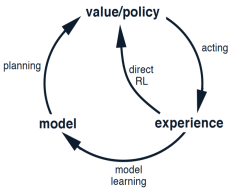
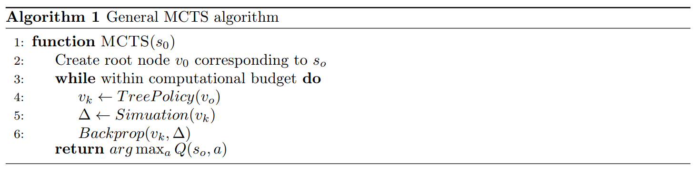
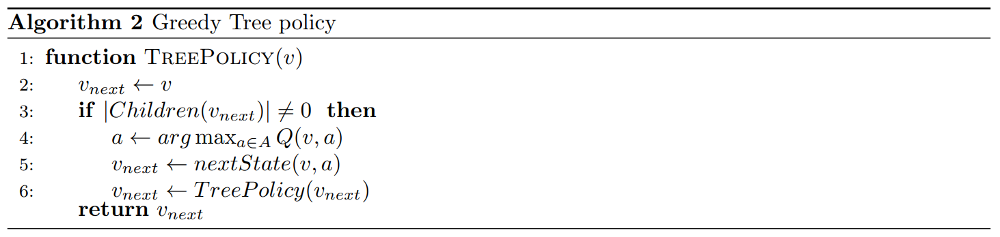
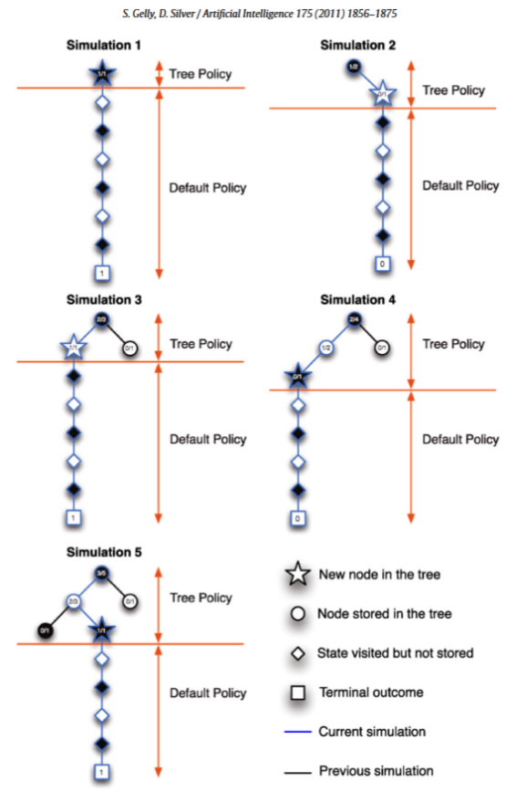
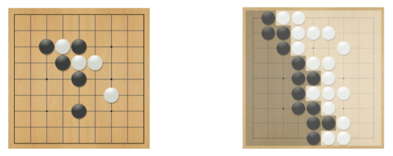
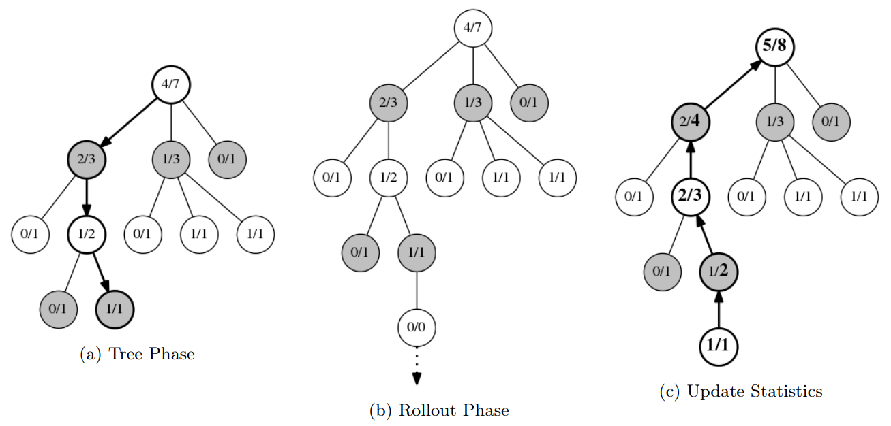

# Lecture 14 Model Based RL, Monte-Carlo Tree Search

# 课时14 基于模型的强化学习，蒙特卡洛树搜索 2019.03.06

## 1. 介绍（Introduction）

本节课我们讨论基于模型的强化学习与基于仿真的树搜索方法。到目前为止我们已经讨论了从经历中尝试学习值函数或策略的方法，与这些方法相反，基于模型的方法首先从经历中学习环境的模型，然后使用这个模型做出规划和行动。基于模型的方法在某些情况下有更高的采样效率和更快的收敛速度。我们还将讨论 MCTS 及其变体，它们可以用于针对给出的模型做出规划。MCTS 是 AlphoGo 成功背后的主要思想之一。

图 1：学习、规划与动作执行之间的关系。

## 2. 模型学习（Model Learning）

我们用 $<S,A,R,T,\gamma>$ 来表示一个 MDP 的模型，由 $\mu$ 参数化。在模型学习中，我们假设状态空间 $S$ 和 动作空间 $A$ 已知，并且通常还假设状态转移与奖励是相互独立的，即

$$
P[s_{t+1},r_{t+1}|s_t,a_t] = P[s_{t+1}|s_t,a_t]P[r_{t+1}|s_t,a_t]。
$$

因此，模型学习包括两个部分，分别为奖励函数 $R(\cdot|s,a)$ 和转移分布 $P(\cdot|s,a)$。

给定一个真实轨迹的集合 $\{S_t^k,A_t^k,R_t^k,...,S_T^k\}_{k=1}^{K}$，模型学习可以被视为一个监督学习问题，学习奖励函数 $R(s,a)$ 是一个回归问题，而学习转移函数 $P(s'|s,a)$ 是一个密度估计问题。首先我们选取一类合适的参数化模型，如查表模型、线性期望、线性高斯、高斯过程、深度神经网络等，然后我们选择一个恰当的损失函数，如均方误差、KL 散度等，通过最小化这个损失来优化参数。

## 3. 规划（Planning）

给定一个学习到的环境的模型，规划可以由基于值的方法、策略搜索的方法或树搜索的方法来实现。

一种比较的规划方法的思路为：仅使用该模型来生成采样轨迹，并使用 Q-学习、蒙特卡洛控制或 SARSA 等方法进行控制。这种基于样本的规划方法通常更具数据效率。

学习得到的模型可能是不准确的，因此，通过规划所学习的缩略也可能是次优的，即基于模型的 RL 的质量依赖于所学习的模型的质量。基于探索/利用的技术可用于在规划时明确解释模型中的这种不确定性。或者，如果我们确定模型在某些情况下是错误的，无模型 RL 方法也可以作为我们的后备方案。

## 4. 基于仿真的搜索（Simulation Based Search）

不管给出的模型是学习到的近似模型，还是像围棋这样的精确模型，这些方法都试图基于向前搜索或模拟来寻找最优动作。搜索树以当前的状态为根，使用模型生成其他节点。因为不需要求解整个 MDP 而只需要从当前状态开始求解子 MDP，所以这种方法可以节省大量的资源。一般来说，当我们收集了仿真经历 $\{S_T^K,A_t^k,R_t^k,...,S_T^K\}_{k=1}^{K}$后，我们可以将无模型方法应用于控制，如蒙特卡洛给出了蒙特卡洛搜索算法或 SARSA 给出了 TD 搜索算法。

更具体地说，在一个简单的 MC 搜索算法中，给出了一个模型 M 和一个模拟策略 $\pi$，对于每个动作 $a\in A$，我们模拟 $K$ 个 $\{S_T^K,a,R_t^k,...,S_T^K\}_{k=1}^{K}$ 形式的片段（在第一动作后遵循策略 $\pi$）。$Q(s_t,a)$ 值被估计为上述轨迹的平均回报，随后我们选择最大化这个估计的 $Q(s_t,a)$ 值的动作。

### 4.1 蒙特卡洛树搜索（Monte Carlo Tree Search）

这类算法基于两个原则：（1）状态的真实价值可以通过随机模拟的平均回报值来估计；（2）这些值可以用于迭代地调整策略，从而使我们能够关注搜索空间的高价值区域。

我们逐步构造一个以当前节点为根的部分搜索树。树由对应于状态 $s$ 的节点组成，此外，每个节点还存储统计信息，如总访问次数 $N(s)$、每个状态-动作对的访问次数 $N(s,a)$ 以及蒙特卡洛 $Q(s,a)$ 值估计等。一种典型的方法是一直构造这种树，直到某些预先定义的计算耗尽，价值估计会变得越来越准确。每个迭代大致可以分为四个阶段：

1. 选择：从根节点开始，我们在树中循环地选择子节点，直到达到非终结叶节点；

2. 扩展：将被选中的叶节点添加到搜索树中；

3. 仿真：从这一节点开始仿真来生成输出的估计值；

4. 反向传播：通过反向沿着根到选中叶节点的路径，更新遇到的节点的统计信息，从而将仿真中获得的值在树中反向传播。

MCTS 的变体通常包含对涉及的两个主要策略的修改：

$\bullet$ 树策略：根据存储的统计信息为树的节点选择动作，变体包括贪婪策略、UCB

$\bullet$ 仿真策略：用于树中叶节点的仿真，变体包括随机模拟、AlphaGo 的默认策略网络

这些步骤总结在了算法 1 中，我们从当前状态开始，迭代地生长搜索树，在每次迭代时使用树策略来选择要模拟的叶节点，然后对仿真结果进行反向传播，最后输出从根节点估计得到最大值的动作。

该算法的一个简单变体如算法 2 所示，在第一阶段中贪婪地在树节点之间选择动作，并在仿真阶段使用随机策略进行仿真。

还有一些基于上述方案的修改，如通过添加有限的节点集到树、智能修剪来提升存储器的使用，通过使用节点中存储的更复杂的统计数据来改善树策略。

从[图 2](#fig2) 中可以看到整个的运行过程。我们从根节点开始，仿真一个轨迹，图中的情况下，这个轨迹返回一个 1 的奖励；然后我们使用树策略，即贪婪地选择要添加到树的节点，然后从它开始使用仿真（默认）策略仿真一个片段，这个片段返回一个 0 的奖励，我们更新树节点中的统计信息；然后重复此过程。为了检查你的理解，你应该在下面的示例中验证统计信息已经正确更新，以及树策略选择了正确的节点来扩展。

MCTS 的主要优点包括：

$\bullet$ 树结构使它具有很大的并行性

$\bullet$ 状态评估是动态的，即从当前状态开始解决 MDP 问题，与 DP 不同

$\bullet$ 不需要模型，只需要样本

$\bullet$ 有效地结合规划和抽样来打破维度灾难（如围棋）

图 2：通用 MCTS 示意图。每个状态有两个可能的动作（左/右），每个仿真的结果为 $1$ 或 $0$。每次迭代添加一个新的节点（星星符号）到搜索树中，然后更新搜索树中每个节点的值以及总的访问次数。

### 4.2 置信上界树搜索（Upper Confidence Tree Search）

类似多臂老虎机，使用贪婪策略作为树策略往往是次优的，这会使我们即使是在一个糟糕的结果之后也避免采取行动，尽管其真实价值存在着很大的不确定性。作为一个例子，考虑[图 2](#fig2) 中最右边的节点，我们从该节点执行一个单独的仿真，收到一个值为 0 的奖励，然后再也不访问该节点，即使这个奖励可能只是因为运气不好（才是 0）。为了解决这个问题，我们可以使用 UCB 算法将不确定性下的乐观原则应用于 MCTS，更具体地说，树策略选择最大化动作值置信上界（$Q(s,a)+\sqrt{\frac{2\log N(s)}{N(s,a)}}$）的动作，而非贪婪地选择动作。

算法 3 为 UCT 中使用树策略的伪代码，该算法可以插入到前面描述的通用 MCTS 算法。 $nextState(s,a)$ 函数使用了 MDP 模型在从状态 $s$ 选择动作 $a$ 时采样下一状态。

## 5. 案例学习：围棋（Case Study: Go）

围棋是世界上最古老的棋类游戏，解决这一问题一直是人工智能面临的一个长期挑战，而在 AlphaGo 之前，传统的游戏树搜索算法未能达到专业的人类级别的性能。围棋是一个在 $19\times 19$ 板（也有更小的板）上进行的双人游戏（黑子/白子，B/W），黑子和白子接连被放在板上，游戏的主要目标是包围和占领领地，另外，被对手包围的棋子会被移除。

图 3：围棋。

最简单的奖励函数可以按照如下规则设置：如果最终状态黑子胜则奖励为 $+1$，如果白子胜则为 $0$，而其他状态均为 $0$。那么黑子玩家的目的则为最大化奖励而白子玩家则要尽量最小化奖励。给定一个策略 $\pi=<\pi_{B},\pi_{W}>$（分别对黑子玩家和白子玩家），值函数为 $V_{\pi}(s)=\mathbb{E}_ {\pi}[R_{T}|s]=P[Black wins|s]$，最优值函数为 $V^{\ast}(s)=\mathop{\max}_ {\pi_{B}}\mathop{\min}_ {\pi_{W}}V_{\pi}(s)$。

### 5.1 基于 MCTS 的围棋（MCTS for Go）

作为一个双人游戏，围棋需要一些相当自然的扩展以应用前面提到的 MCTS 算法。我们现在构建一个极小极大树，白色节点寻求最小化奖励，黑色节点寻求最大化奖励。我们在黑色节点使用前面提到的 UCB，在白色节点使用 LCB（置信下界）即 $\mathop{\min}_{a}Q(s,a)-\sqrt{\frac{2\log N(s)}{N(s,a)}}$（因为它们寻求最小化奖励）。

考虑[图 4](#fig4)（a）树中的状态以及节点中记录的统计信息（胜利/总次数），不同的颜色代表不同的玩家。算法或树策略的第一阶段在节点中使用这些统计信息，将每个节点视作一个独立的 MAB 实例，并从根节点开始使用 UCB（LCB）依次选择动作，如粗体箭头所示（$c=2$）。

一旦我们到达了树的叶节点，如[图 4](#fig4)（b）所示，我们就使用仿真策略来模拟一次游戏。然后，这次游戏的结果通过树反向传播（[图 4](#fig4)（c）），同时我们更新统计信息。

继续执行这个过程直到结束，然后最佳动作便可以得到。有关详细的伪代码，可以参考 [[4]](#ref4)，Python 实现可以参考 [[3]](#ref3)。

图 4：基于 MCTS 的围棋。（a）UCB1 算法在每个步骤中选择的位置和移动都用粗体进行表示。每个圆圈包含了获胜次数/游戏次数。（b）树底部标记为 $1/1$ 的位置下没有进一步的统计记录，因此我们选择一个随机的动作并为其添加一个新纪录（初始化为 $0/0$）。添加新纪录后，蒙特卡洛仿真开始（虚线箭头）。仿真中的动作可以是完全随机的，也可以为随机性添加权重。（c）仿真结束后，路径中的所有记录都将更新（粗体数字）。（图出处：[[3]](#ref3)）

AlphaGo [[1]](#ref1) 在仿真阶段使用了一个深度策略网络，这使得仿真比仅仅使用随机仿真更加真实。在围棋这种复杂的游戏中，仿真直到结束是不合适的，AlphaGo 会提前停止仿真，同时还使用了一个价值网络来获得获胜概率。最近，AlphaGo Zero [[2]](#ref2) 被提出，它使用一个单一的网络来同时输出策略和价值函数，并且只使用自玩来训练而没有内置的专家知识。AlphaGo Zero 的表现比 AlphaGo 更加令人印象深刻。

## 参考文献

1. D. Silver et al, "Mastering the game of Go with deep neural networks and tree search," *Nature*, 2016.

2. D. Silver et al, "Mastreing the game of Go without human knowledge," *Nature*, 2017.

3. J. Bradberry, "[Introduction to Monte Carlo tree search](https://jeffbradberry.com/posts/2015/09/intro-to-monte-carlo-tree-search/)," 2015.

4. S. Gelly, and D. Silver, "Monte-Carlo tree search and rapid action value estimation in computer Go," *Artificial Intelligence*, 2011.