# Lecture 3 Model Free Policy Evaluation: Policy Evaluation Without Knowing How the World Works

# 课时3 无模型策略评估 2019.01.14

## 4. 无模型策略评估

回忆上节内容，我们讨论了三个愈加复杂的问题：

1. 马尔可夫过程（MP）是一个具有马尔可夫性质的随机过程。

2. 马尔可夫奖励过程（MRP）是一个每个时间步都有奖励的马尔可夫过程，随时间衰减的奖励的累积成为价值（values）。

3. 马尔可夫决策过程（MDP）是一个在每个状态下都有选择或动作（actions）的马尔可夫奖励过程。

在上节课的下半部分，我们讨论了在 MDP 中评估一个策略的两种方法，分别是：直接解线性方程组和动态规划（dynamic programming）；我们也讨论了在 MDP 中寻找最优策略的三种方法，分别是：暴力策略搜索（brute force policy search）、策略迭代（policy iteration）和价值迭代（value iteration）。

这些方法都隐含这样一个假设，即每个状态转移的奖励和概率已知。然而，在许多情况下，这些信息并不容易被获取，因此我们需要无模型算法（model-free algorithms）。本课时我们讨论无模型策略评估（model-free policy evaluation），也就是说，在不知道奖励或状态转移概率的情况下，给定一个策略，我们对其价值进行评估。本课时我们暂时不讨论如何在无模型的情况下提升策略。

### 4.1 符号摘要

在深入讨论无模型策略评估方法之前，我们首先回顾一下本次课需要的有关 MDP 的一些符号。

我们将 MRP 的回报定义为随时间衰减的奖励的累积，起于时间步 $t$，止于 $H$，这里 $H$ 可能是无穷大，用数学的方式表示为
$$
G_t=\sum_{i=t}^{H-1}\gamma^{i-t}r_i,
\tag{1}
$$
这里 $0\leq t\leq H-1$，$\gamma$ 为衰减因子，$0<\gamma\leq 1$，$r_i$ 为在时间步 $i$ 的奖励。对于一个 MDP，回报 $G_t$ 被唯一定义，奖励 $r_i$ 根据策略 $\pi(a|s)$ 生成。

状态值函数 $V^{\pi}(s)$ 是起始于状态 $s$、遵照固定的策略 $\pi$ 得到的期望回报，我们可以将其表示为
$$
V^{\pi}(s)=\mathbb{E}_{\pi}[G_t|s_t=s]
\tag{2}
$$

$$
=\mathbb{E}_ {\pi}[\sum_{i=t}^{H-1}\gamma^{i-t}r_i|s_t=s]。
\tag{3}
$$

状态-行为值函数 $Q^{\pi}(s,a)$ 是起始于状态 $s$ 和动作 $a$、然后遵照固定的策略 $\pi$ 得到的期望回报，我们可以将其表示为
$$
Q^{\pi}(s,a)=\mathbb{E}_{\pi}[G_t|s_t=s,a_t=a]
\tag{4}
$$

$$
=\mathbb{E}_ {\pi}[\sum_{i=t}^{H-1}\gamma^{i-t}r_i|s_t=s,a_t=a]。
\tag{5}
$$

在整个课程中，我们假设时间步有限，并且假设奖励、转移概率和策略是固定的，这些假设使得状态值函数和状态-行为值函数是独立于时间的，就像上节课推导的那样。

接下来我们介绍一个新的定义：历史（history）。

**定义 4.1** 历史（history）是行为体经历的状态、动作和奖励的排列。在情节域（episodic domains）中，我们也称之为片段（episode）。在考虑到许多交互时，我们用以下方式表示历史：第 $j$ 个历史为
$$
h_j=(s_{j,1},a_{j,1},r_{j,1},s_{j,2},a_{j,2},r_{j,2},...,s_{j,L_j}),
$$
这里 $L_j$ 是交互的长度，$s_{j,t}$、$a_{j,t}$、$r_{j,t}$分别是历史 $j$ 中的在时间步 $t$ 时的状态、动作和奖励。

### 4.2 动态规划（Dynamic Programming）

回忆上节课的用来计算有限 MDP 的值的动态规划算法。

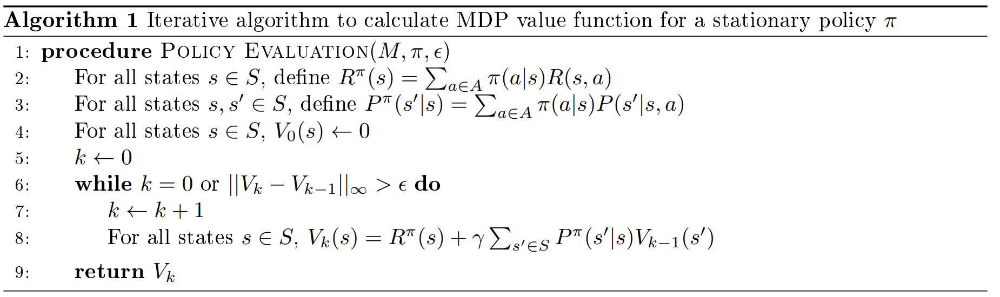

以这种方式来写时，我们可以以多种方式来考虑 $V_k$。首先，$V_k(s)$ 是起始于状态 $s$，接下来 $k$ 次状态转移遵循策略 $\pi$ 的确切的值。其次，对于 $k$ 值很大或算法 1 终止的情况，$V_k(s)$ 是真实的无穷时间步情况下的 $V^{\pi}(s)$ 的估计。

我们可以通过图 1 来表示该算法。我们自上而下阅读这幅图，这里白色圆圈代表状态，黑色圆圈代表动作，弧线表示取期望值。这个图展示了起始于状态 $s$ 并转移两个时间步的分支效果，还说明了在状态 $s$ 依据策略 $\pi$ 采取一个动作后，我们如何去计算下一状态的值的期望。在动态规划中，我们使用当前的估计值 $V_{k-1}(s')$ 引导（bootstrap）或估计下一状态的值。

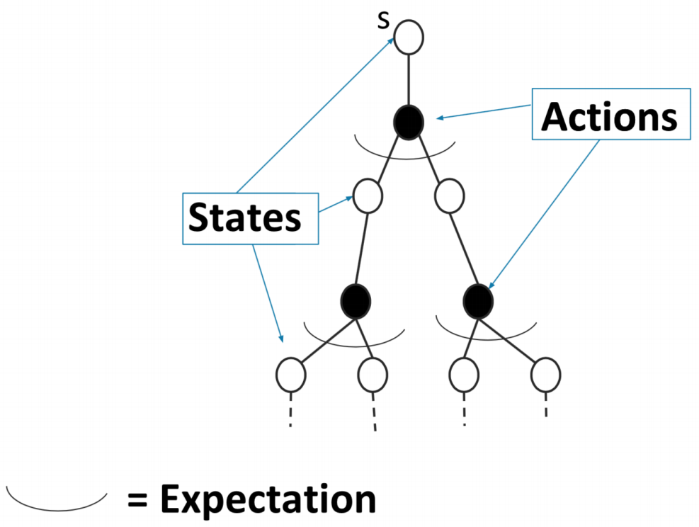

图 1：动态规划策略评估算法的备份示意图。

 

### 4.3 蒙特卡洛在线策略评估（Monte Carlo On Policy Evaluation）

我们现在通过一个常见的计算方法来描述第一个无模型策略评估算法，这个方法被称为蒙特卡洛方法。我们首先抛开强化学习，详细叙述一个使用蒙特卡洛方法的例子，然后比较全面地讨论蒙特卡洛方法，最后在强化学习中应用蒙特卡洛方法。需要强调的是，这种方法仅在情节的环境中有效，我们将在本节中更仔细地研究算法时看到为什么会这样。

假设我们想估计今天从你家到斯坦福大学的通勤时间。假设我们有一个模拟器，这个模拟器可以模拟交通、天气、施工延误和其他变量的不确定性以及它们之间的相互作用。估计预期通勤时间的一种方法是在模拟器上模拟许多次，然后对这些仿真的通勤时间取平均值。这被称为我们的通勤时间的蒙特卡洛估计。

一般来说，我们在现实生活或仿真中通过观察多个迭代得到某个量的蒙特卡洛估计，然后将这些观测值取平均。根据大数定律，这个平均值会收敛到这个量的期望值。

在强化学习中，我们希望估计的量是 $V^{\pi}(s)$，也就是起始于状态 $s$、遵循策略 $\pi$ 的回报 $G_t$ 的平均值。因此，我们可以通过三步来得到 $V^{\pi}(s)$ 的蒙特卡洛估计：
1. 执行策略 $\pi$，直到终止。多次进行这个过程（rollout）。
2. 记录我们观察到的回报 $G_t$（起始于状态 $s$）。
3. 对我们获取的 $G_t$ 取平均值来估计 $V^{\pi}(s)$。

图 2 展示了蒙特卡洛策略评估，新的蓝色的线表示我们起始于状态 $s$，对整个片段进行采样直到终止。

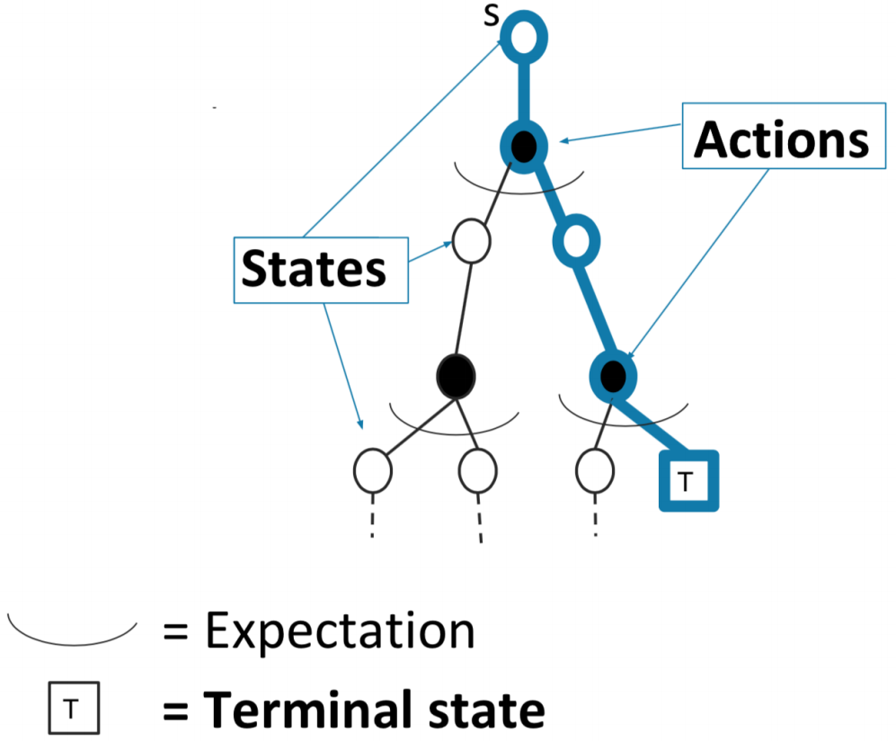

图 2：蒙特卡洛策略评估算法的备份示意图。

 

蒙特卡洛在线策略评估有两种方式，取决于每个 rollout 中，我们是只在第一次遇到一个状态时取平均值，还是每次遇到一个状态时都取平均值。这两种方式分别被称为首次访问（First-Visit）蒙特卡洛策略评估和每次访问（Every-Visit）蒙特卡洛策略评估。

更正式地，我们用算法 2 描述首次访问蒙特卡洛，用算法 3 描述每次访问蒙特卡洛。

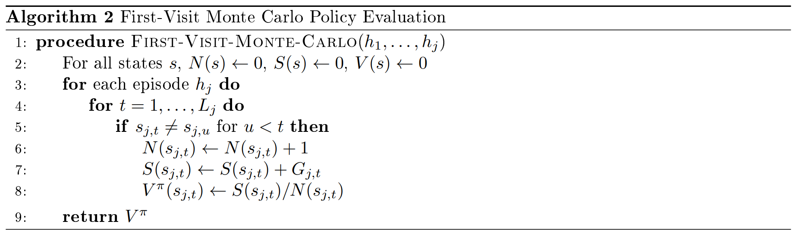

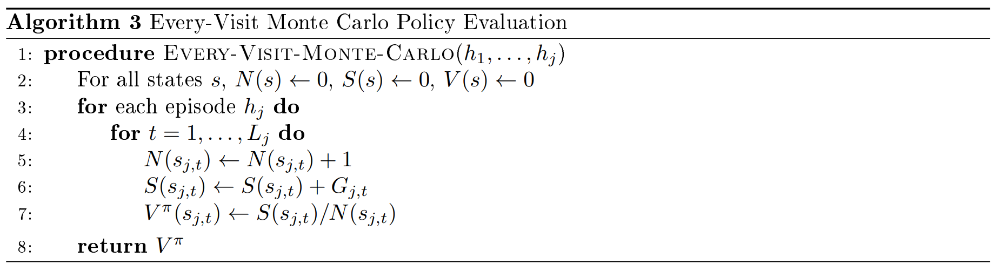

注意，在算法 2 和 3 的 for 循环中，我们可以移去向量 $S$，并且以
$$
V^{\pi}(s_{j,t})\leftarrow V^{\pi}(s_{j,t})+\frac{1}{N(s_{j,t})}(G_{j,t}-V^{\pi}(s_{j,t}))
\tag{6}
$$
代替 $V^{\pi}(s_{j,t})$ 的更新。这是因为新的平均值可以用以下方式来计算：
$$
\frac{V^{\pi}(s_{j,t})\times (N(s_{j,t})-1)+G_{j,t}}{N(s_{j,t})}=V^{\pi}(s_{j,t})+\frac{1}{N(s_{j,t})}(G_{j,t}-V^{\pi}(s_{j,t}))。
\tag{7}
$$
用 $\alpha$ 替代 $\frac{1}{N(s_{j,t})}$，我们就得到了更一般的增量蒙特卡洛策略评估（Incremental Monte Carlo On Policy Evaluation）。算法 4 和算法 5 分别详细描述了首次访问和每次访问蒙特卡洛。

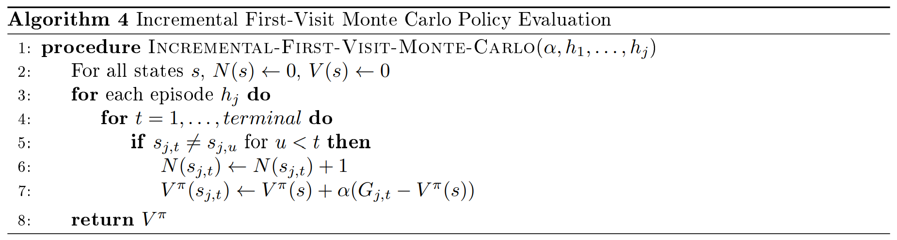

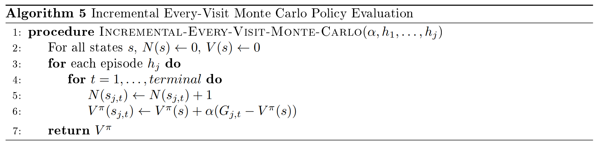

若我们使 $\alpha=\frac{1}{N(s_{j,t})}$，便得到了算法 2 和算法 3 中展示的原始的蒙特卡洛策略评估；若$\alpha>\frac{1}{N(s_{j,t})}$，则表示我们为新数据赋予更大的权重，这有助于学习非线性空间。如果我们是在确切的马尔可夫空间，每次访问蒙特卡洛将会是更加数据高效的，因为每次我们访问一个状态都会更新我们的回报平均值。

**练习 4.1** 回忆上节课提到的火星探测器（Mars Rover）MDP，如图 3 所示。假设我们当前对各个状态的估计值为 $0$，如果我们经历历史
$$
h=(S3,TL,+0,S2,TL,+0,S1,TL,+1,terminal)，
$$
那么：
1. 每个状态的 $V$ 的首次访问蒙特卡洛估计是什么？
2. 每个状态的 $V$ 的每次访问蒙特卡洛估计是什么？
3. 当 $\alpha=\frac{2}{3}$ 时，$V$ 的增量首次访问蒙特卡洛估计是什么？
4. 当 $\alpha=\frac{2}{3}$ 时，$V$ 的增量每次访问蒙特卡洛估计是什么？

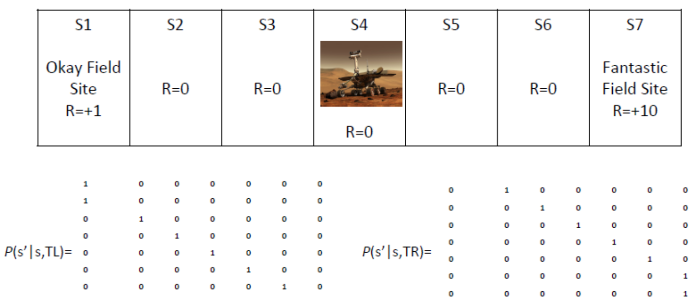

图 3：火星探测器马尔可夫决策过程，这里的动作为尝试左移（Try Left）与尝试右移（Try Right）。

 

### 4.4 蒙特卡洛离线策略评估（Monte Carlo Off Policy Evaluation）

上一节我们讨论了在希望评估的策略 $\pi$ 下，我们能够获得许多 $G_t$ 的实现的情况。然而在许多昂贵或高风险的情况下，我们并不能以期望评估的策略去获取 $G_t$ 的 rollout，例如，我们可能有与某一项医疗政策相关的数据，但我们想要确定另一个不同的医疗策略的价值。在本节中，我们讨论蒙特卡洛离线策略评估（Monte Carlo off policy evaluation），这是一种用从一个策略中获得的数据去评估另一个不同的策略的方法。

#### 4.4.1 重要性采样（Importance Sampling）

重要性采样（importance sampling）方法是离线策略评估的关键因素。重要性采样的目标是仅使用 $f(x_1), ..., f(x_n)$ 估计函数 $f(x)$ 的期望值，这里 $x$ 源于分布 $q$，$x_i$ 源于另一个不同的分布 $p$。总而言之，对于 $1\leq x_i \leq n$，给定 $q(x_i),p(x_i),f(x_i)$，我们想要估计 $\mathbb{E}_{x\sim q}[f(x)]$。我们可以通过以下近似来实现这个估计：

$$
\mathbb{E}_{x\sim q}[f(x)]=\int_x {q(x)f(x)} \text{ d}x
\tag{8}
$$

$$
=\int_x {p(x)[\frac{q(x)}{p(x)}f(x)]} \text{ d}x
\tag{9}
$$

$$
=\mathbb{E}_{x\sim p}[\frac{q(x)}{p(x)}f(x)]
\tag{10}
$$

$$
\approx \frac{1}{n}\sum_{i=1}^{n}[\frac{q(x_i)}{p(x_i)}f(x_i)]。
\tag{11}
$$
最后的式子给出了用分布 $p$ 下 $f$ 的样本对分布 $q$ 下 $f$ 的重要性采样估计。注意第一步仅在对于任意 $x$，$q(x)f(x)>0$ 表示 $p(x)>0$ 时才成立。

#### 4.4.2 离线策略评估的重要性采样（Importance Sampling for Off Policy Evaluation）

我们现在在强化学习中应用重要性采样估计的一般结果。我们想要用在策略 $\pi_2$ 下生成的 $n$ 个历史 $h_1,...,h_n$ 来近似在策略 $\pi_1$ 下状态 $s$ 的值，即 $V^{\pi_1}(s)=\mathbb{E}[G_t|s_t=s]$，重要性采样估计告诉我们
$$
V^{\pi_1}(s)\approx \frac{1}{n}\sum_{j=1}^{n}\frac{p(h_j|\pi_1,s)}{p(h_j|\pi_2,s)}G(h_j)，
\tag{12}
$$
这里 $G(h_j)=\sum_{t=1}^{L_j-1}\gamma^{t-1}r_{j,t}$ 是对于历史 $h_j$ 的衰减奖励总额。

现在，对于一个一般的策略 $\pi$，我们知道在策略 $\pi$ 下经历历史 $h_j$ 的概率是
$$
p(h_j|\pi,s=s_{s,1})=\prod_{t=1}^{L_j-1}p(a_{j,t}|s_{j,t})p(r_{j,t}|s_{j,t},a_{j,t})p(s_{j,t+1}|s_{j,t},a_{j,t})
\tag{13}
$$

$$
=\prod_{t=1}^{L_j-1}\pi(a_{j,t}|s_{j,t})p(r_{j,t}|s_{j,t},a_{j,t})p(s_{j,t+1}|s_{j,t},a_{j,t})
\tag{14}
$$
这里 $L_j$ 是第 $j$ 个片段的长度，第一行由每个状态转移的三个部分得到，这三个部分分别为：
1. $p(a_{j,t}|s_{j,t})$ - 在状态 $s_{j,t}$ 采取动作 $a_{j,t}$ 的概率；
2. $p(r_{j,t}|s_{j,t},a_{j,t})$ - 在状态 $s_{j,t}$ 采取动作 $a_{j,t}$ 后获得奖励 $r_{j,t}$ 的概率；
3. $p(s_{j,t+1}|s_{j,t},a_{j,t})$ - 在状态 $s_{j,t}$ 采取动作 $a_{j,t}$ 后，状态转移到 $s_{j,t+1}$ 的概率。

将对 $V^{\pi_1}(s)$ 的重要性采样估计和历史概率 $p(h_j|\pi,s=s_{j,1})$ 的分解相结合，我们得到
$$
V^{\pi_1}(s)\approx \frac{1}{n}\sum_{j=1}^{n}\frac{p(h_j|\pi_1,s)}{p(h_j|\pi_2,s)}G(h_j)
\tag{15}
$$

$$
=\frac{1}{n}\sum_{j=1}^{n} \frac{\prod_{t=1}^{L_j-1}\pi_1(a_{j,t}|s_{j,t})p(r_{j,t}|s_{j,t},a_{j,t})p(s_{j,t+1}|s_{j,t},a_{j,t})} {\prod_{t=1}^{L_j-1}\pi_2(a_{j,t}|s_{j,t})p(r_{j,t}|s_{j,t},a_{j,t})p(s_{j,t+1}|s_{j,t},a_{j,t})} G(h_j)
\tag{16}
$$

$$
=\frac{1}{n}\sum_{j=1}^{n} G(h_j) \prod_{t=1}^{L_j-1} \frac{\pi_1(a_{j,t}|s_{j,t})} {\pi_2(a_{j,t}|s_{j,t})}。
\tag{17}
$$

注意，现在我们可以显式地估计表达式，而不需要状态转移概率或奖励，因为式中第二步所涉及的模型动态部分都被约掉了。特别地，我们已经知道历史 $h_j$，所以我们可以计算 $G(h_j)=\sum_{t=1}^{L_j-1}\gamma^{t-1}r_{j,t}$，并且我们已经知道策略 $\pi_1$ 和 $\pi_2$，所以我们也可以计算式（[17](#eq17)）中的第二项。

### 4.5 时间差分学习（Temporal Difference (TD) Learning）

到目前为止，我们已经有两种方法进行策略评估：动态规划和蒙特卡洛。动态规划利用引导来帮助我们只需要一步的备份去获取价值估计。另一方面，蒙特卡洛对许多轨迹采样，使我们不需要知道模型也可以估计价值。现在我们介绍另一个无模型策略评估算法，该算法结合了引导和采样。

为了明白如何将采样和引导结合，让我们看一下增量蒙特卡洛更新：
$$
V^{\pi}(s_t)\leftarrow V^{\pi}(s_t)+\alpha(G_t-V^{\pi}(s_t))
\tag{18}。
$$

$G_t$ 是在状态 $s_t$ 从时间步 $t$ 直到终止执行某个策略所获得的回报。现在像在动态规划中那样，我们用一个贝尔曼备份算子替代 $G_t$，也就是用 $r_t+\gamma V^{\pi}(s_{t+1})$ 替代 $G_t$，这里 $r_t$ 是在时间步 $t$ 的奖励的采样，$V^{\pi}(s_{t+1})$ 是当前对下一状态的值的估计。通过这一替换，我们得到了时间差分学习（TD-learning）更新：
$$
V^{\pi}(s_t)\leftarrow V^{\pi}(s_t)+\alpha(r_t+\gamma V^{\pi}(s_{t+1})-V^{\pi}(s_{t}))。
\tag{19}
$$

差分
$$
\delta_t=r_t+\gamma V^{\pi}(s_{t+1})-V^{\pi}(s_{t})
\tag{20}
$$
通常被称为时间差分（TD-error）；奖励的采样加上下一状态的值的估计
$$
r_t+\gamma V^{\pi}(s_{t+1})
\tag{21}
$$
则被称为时间差分目标（TD-target）。完整的时间差分学习算法如算法 6 所示。我们可以看到，使用这种方法，我们在观测到状态转移 $(s_t,a_t,r_t,s_{t+1})$ 后直接更新 $V^{\pi}(s_{t})$，而不是像蒙特卡洛那样等到结束才更新。

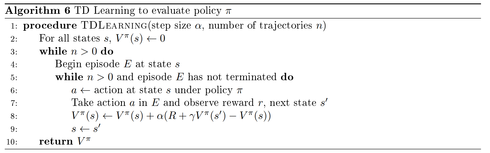

我们可以通过图标再次检验这个算法，如图 4。通过蓝色线表示我们从状态 $s$ 开始采样一个状态转移，然后我们用当前对下一状态的估计去估计下一状态的值，从而建立一个完整的贝尔曼备份估计。

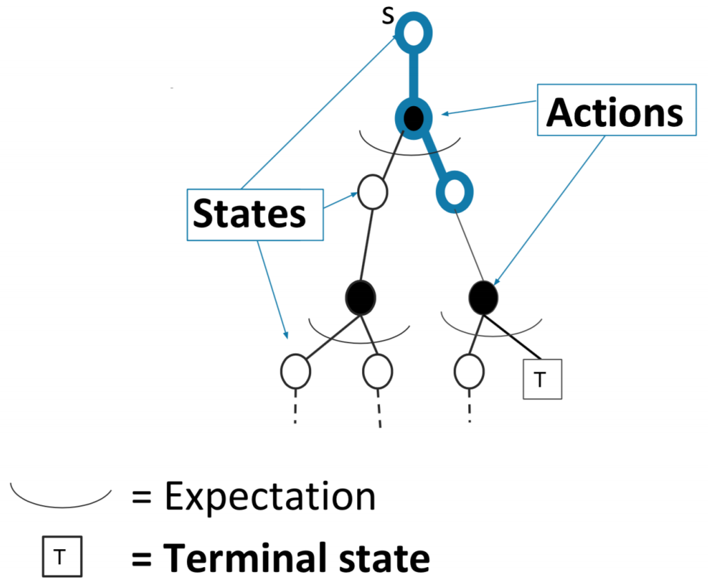

图 4：TD 学习策略评估算法的备份示意图。

 

实际上，我们可以通过一种方法将蒙特卡洛和动态规划融合，这种方法就是 TD($\lambda$)。当 $\lambda=0$ 时，我们得到如上所示的TD学习公式，因此我们也可以称之为 TD($0$)。当 $\lambda=1$ 时，我们就得到了蒙特卡洛策略估计。当 $0<\lambda<1$ 时，我们得到了两种方法的融合。关于 TD($\lambda$) 更细致的讨论，感兴趣的读者请参考 Sutton and Barto [[1]](#ref1) 的 7.1 节和 12.1-12.5 节，这两部分分别介绍 $n$ 步 TD 学习和 TD(\lambda)/资格迹（eligibility traces）。

**练习 4.2** 继续考虑图 3 所示的火星探测器（Mars Rover）例子。假设当前我们对各个状态的值的估计为 $0$，如果我们经历历史
$$
h=(S3,TL,+0,S2,TL,+0,S2,TL,+0,S1,TL,+1,terminal)，
$$
那么：
1. 当 $\alpha=1$ 时，$V$ 的 TD($0$) 估计是什么？
2. 当 $\alpha=\frac{2}{3}$ 时，$V$ 的 TD($0$) 估计是什么？

### 4.6 总结

在这节课中，我们用上节课的动态规划重新考察了策略估计，并介绍了策略估计的两种方法，分别是蒙特卡洛估计和时间差分（TD）学习。

首先，我们注意到动态规划依赖于世界的模型，从而引入蒙特卡洛和 TD 学习。也就是说，动态规划策略评估算法需要我们提供奖励和状态转移概率，蒙特卡洛和 TD 学习都不受这一限制，因此它们都是无模型方法。

在蒙特卡洛策略评估中，我们生成许多历史，然后对遇到的状态求平均回报。为了在有限的时间内生成这些历史，我们需要域是片段式的，也就是说我们需要保证观测到的历史有终点。在动态规划和时间差分学习中，我们只需要备份一次状态转移（我们只看未来一步），所以我们不需要关心历史是否有终点，而且我们可以将这些算法应用到非片段式的域中。

另一方面，在动态规划和 TD 学习中，我们可以只备份一次状态转移的原因是，我们采用了马尔可夫域假设。此外，算法 4 和算法 5 中描述的增量蒙特卡洛策略评估也可用于非马尔可夫域。

这三种方法都可以收敛到真实的值函数。上节课，我们用贝尔曼备份算子的收缩性证明了动态规划的收敛性。今天的课程中，根据大数定律，我们知道蒙特卡洛策略估计收敛于策略的值函数，TD($0$)也收敛到真值，我们将在下一部分中更详细地讨论这一内容。

在蒙特卡洛中，因为我们基于回报的真实分布取了平均值，所以我们得到的是每个状态的无偏估计值。另一方面，在 TD 学习中，我们通过引导下一状态的估计值去获取当前状态的估计值，所以这个估计值被下一状态的估计值带偏。关于此的讨论请参考 Sutton and Barto [[1]](#ref1) 的 6.2 节。

蒙特卡洛估计的方差相对高于 TD 学习，因为在蒙特卡洛估计中，我们要考虑每个片段中的许多状态转移，每个状态转移对我们的估计都会产生一些方差。另一方面，TD 学习在每次更新时仅考虑一次状态转移，因此不会像蒙特卡洛估计那么快地积累方差。

最后，蒙特卡洛通常比 TD($0$) 更加数据高效。在蒙特卡洛中，我们根据整个片段的回报来更新状态的值，因此，如果未来有很多非常高或非常低奖励的轨迹，这些奖励仍然会被立即纳入到我们对状态的值的更新中。而在 TD($0$) 中，我们只用当前时间步的奖励和一些之前的对下一状态的值的估计去更新一个状态的值，这意味着，如果未来有很多非常高或非常低奖励的轨迹，仅当奖励已经被用于更新下一状态的值的引导估计时，我们才在当前状态的值的更新中包含这些奖励。这意味着，如果一个高奖励片段的长度为 $L$，那么我们可能需要经历该片段 $L$ 次，使得高奖励片段的信息能一直返回到起始状态。

表 1 总结了以上讨论的方法的优点和局限性。

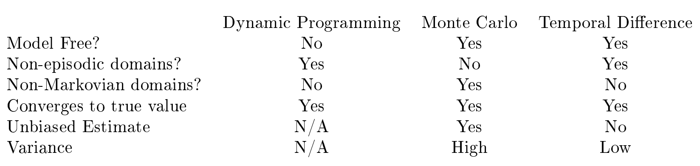

表 1：本节课提到的算法总结。

 

### 4.7 批蒙特卡洛和时间差分（Batch Monte Carlo and Temporal Difference）

现在我们讨论这些算法的批处理版本，这里我们有一组历史，这些历史用于多次更新。我们首先看一下 Sutton and Barto [[1]](#ref1) 中的示例6.4来更仔细地检查蒙特卡洛和 TD($0$) 之间的差异。假设 $\gamma=1$，假设我们有8个根据策略 $\pi$ 生成的历史，这些历史中在每个状态都采用动作1：
$$
h_1=(A,act1,+0,B,act1,+0,terminal)，
$$

$$
h_j=(B,act1,+1,terminal) \quad {\rm for} \quad j=2,...,7，
$$

$$
h_8=(B,act1,+0,terminal)。
$$
那么当 $\alpha=1$ 时，不论使用批蒙特卡洛还是批 TD($0$)，我们都会得到 $V(B)=0.75$。然而，如果使用蒙特卡洛，我们会得到 $V(A)=0$，因为只有第一个片段访问了状态 $A$ 而且回报为 $0$。另一方面，如果使用 TD($0$)，我们会得到 $V(A)=0.75$，因为用 $V(A)\leftarrow r_{1,1}+\gamma V(B)$ 来更新 $V(A)$。在图 5 所示的马尔可夫域下，由 $TD(0)$ 给出的估计更有意义。

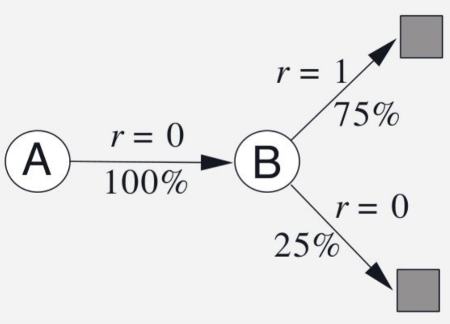

图 5：Sutton and Barto [[1]](#ref1) 例6.4。

 

这一部分我们考虑批蒙特卡洛和 TD($0$)。在批处理的情况，我们有一组历史 $h_1,...,h_n$，通过蒙特卡洛或 TD($0$) 这些历史可以被使用多次。与之前的式子相比，批处理唯一的不同点是只有在处理整个批后才更新值函数，因此，在 TD($0$) 中，只有在通过整个批后才更新引导估计。

在批蒙特卡洛设定中，每个状态的值收敛到使均方误差（根据挂测到的回报）最小的值，这直接源于这样一个事实：在蒙特卡洛中，我们取了每个状态的回报的平均值，通常来说，使样本的均方误差最小的值就是样本的平均值，也就是说，已知样本 $y_1,...,y_n$，当 $\hat{y}=\sum_{i=1}^{n}y_i$ 时，$\sum_{i=1}^{n}(y_i-\hat{y})^2$ 最小。从本节开头的例子也可以看出这一点，由于仅有第一个历史访问了状态 $A$, 因此应用蒙特卡洛我们可以得到 $V(A)=0$。

在批 TD($0$) 设定中，我们不会收敛到像蒙特卡洛那样的结果，而是会收敛到 $V^{\pi}$，即最大似然 MDP 模型的策略 $\pi$ 的值，这里
$$
\hat{P}(s^{'}|s,a)=\frac{1}{N(s,a)}\sum_{j=1}^{n}\sum_{t=1}^{L_j-1}1(s_{j,t}=s,a_{j,t},s_{j,t+1}=s')，
\tag{22}
$$

$$
\hat{r}(s,a)=\frac{1}{N(s,a)}\sum_{j=1}^{n}\sum_{t=1}^{L_j-1}1(s_{j,t}=s,a_{j,t})r_{j,t}。
\tag{23}
$$

也就是说，最大似然 MDP 模型是我们根据批能建立的最简单的模型，状态转移概率 $\hat{P}(s'|s,a)$ 是在这个批中，在状态 $s$ 采取动作 $a$ 后，产生了状态转移 (s,a,s') 的频率，奖励 $\hat{r}(s,a)$ 是在这个批中，在状态 $s$ 采取动作 $a$ 后，得到的奖励的平均值。

从本节开头的例子也可以看到这个结果，在这个例子中，我们的最大似然模型为
$$
\hat{P}(B|A,act1)=1，
\tag{24}
$$

$$
\hat{P}(terminal|B,act1)，
\tag{25}
$$

$$
\hat{r}(A,act1)=0，
\tag{26}
$$

$$
\hat{r}(B,act1)=0.75。
\tag{27}
$$

通过这个模型我们可以得出 $V^{\pi}(A)=0.75$，就像我们之前说的那样。

从最大似然 MDP 模型推导出的值函数被称作确定等价估计（certainty equivalence estimate）。应用这个关系，我们有另一种评估策略的方法：我们可以先根据批计算最大似然 MDP 模型，然后使用这个模型和上节课提到的有模型策略评估方法去计算 $V^{\pi}$。这个方法是非常数据高效的，但却需要较大的计算量，因为解析地求 MDP 模型需要的时间为 $O(|S|^3)$，通过动态规划求 MDP 模型所需时间为 $(|S|^2|A|)$。

**练习 4.2** 继续考虑图 3 所示的火星探测器（Mars Rover）例子。假设当前我们对各个状态的值的估计为 $0$，如果我们的批包括两个历史：
$$
h_1=(S3,TL,+0,S2,TL,+0,S1,TL,+1,terminal)
$$

$$
h_2=(S3,TL,+0,S2,TL,+0,S2,TL,+0,S1,TL,+1,terminal)
$$
并且我们的策略为 $TL$，那么确定等价估计是什么？

## 参考文献

1. R. S. Sutton, and A. G. Barto, *Introduction to Reinforcement Learning*. 2nd ed., MIT Press, 2017. Draft. http://incompleteideas.net/book/the-book-2nd.html.