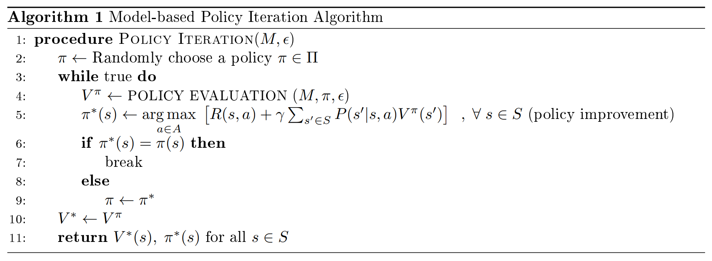
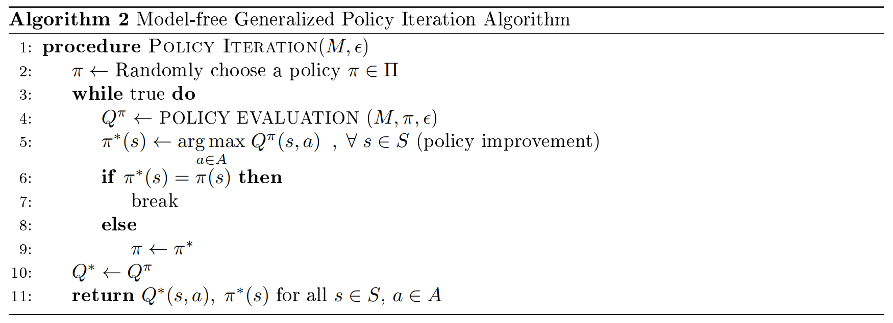
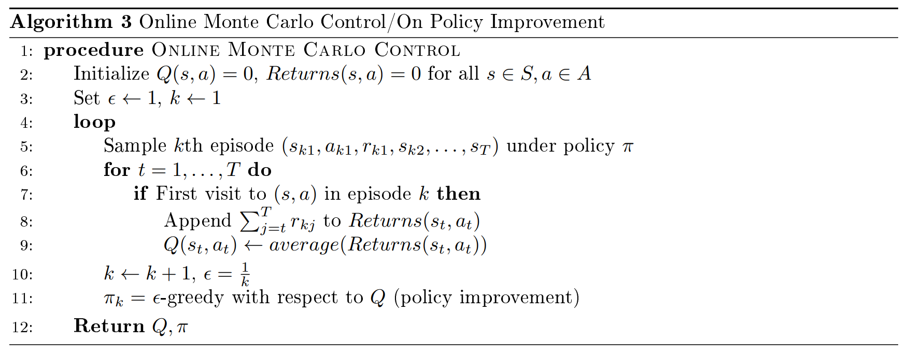
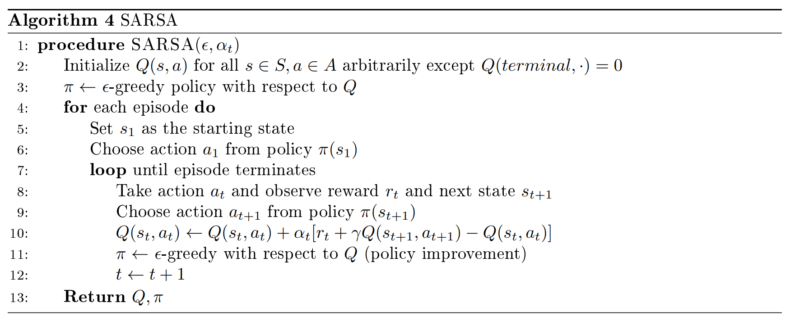
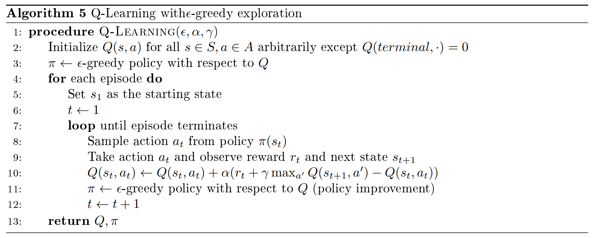
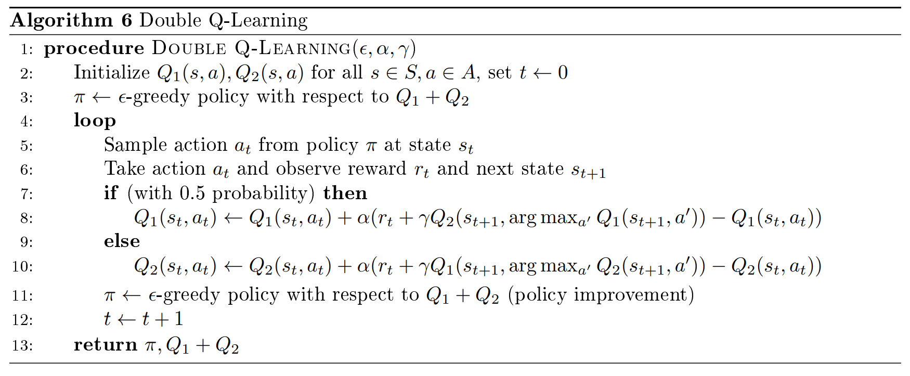

# Lecture 4 Model Free Control

# 课时4 无模型控制 2019.01.16

## 5. 无模型控制（Model Free Control）

上次课我们讨论了如何在不知道世界的模型、仅与环境交互的情况下评估一个给定的策略，我们提出了几种无模型策略评估（model-free policy evaluation）方法：蒙特卡洛策略评估和 TD 学习。这节课我们讨论无模型控制（model-free control），这里我们要在相同的约束下（只有交互，不知道状态转移概率或奖励）学习好的策略。这个框架在以下两种情况中是很重要的：
1. MDP 模型未知，但我们可以从这个 MDP 中对轨迹采样，或
2. MDP 模型已知，但由于计算量的原因，我们无法通过有模型控制方法计算价值函数。

本节课我们仍基于表格的设定（tabular setting），也就是说我们可以将每个状态值或状态-行为值作为表格的元素。下节课我们将基于值函数近似（value function approximation）的设定，重新检查今天和之前的课中提及的算法，这包括尝试将一个函数转换为状态值函数或状态-行为值函数。

### 5.1 广义策略迭代（Generalized Policy Iteration）

首先回忆有模型策略迭代算法，如算法 1 所示。

上节课我们介绍了无模型策略迭代算法，所以我们可以用无模型的方式将第四行替换。然而，为了使整个算法是无模型的，我们必须找到一种方式去处理第五行。根据定义，我们有 $Q^{\pi}(s,a)=R(s,a)+\gamma \sum_{s'\in S}P(s'|s,a)V^{\pi}(s')$，因此，我们可以通过在模型策略迭代算法中使用这个值，从而得到无模型策略迭代算法（算法 2）。

由于我们在第五行做了替换，有一些事项需要注意：
1. 如果策略 $\pi$ 是确定的，或不是以正的概率生成每一个动作 $a$，那么我们无法确切地计算第五行中的最大值。
2. 通过策略迭代算法，我们得到的是 $Q^{\pi}$ 的估计，所以我们并不清楚第五行是否会像有模型情况那样单调地提升策略。

### 5.2 探索的重要性（Importance of Exploration）

#### 5.2.1 探索（Importance）

上一部分里，我们看到无模型策略迭代算法的一个注意事项是策略 $\pi$ 需要对每个动作赋予一个正的概率，这样每个状态-行为值才能被确定。换句话说，策略 $\pi$ 应该探索动作，即使这些动作根据当前的 $Q$ 值估计来看可能不是最优的。

#### 5.2.2 $\epsilon$-贪婪策略（$\epsilon$-greedy Policies）

为了探索那些根据当前的 $Q$ 值估计来看可能不是最优的动作，我们需要需要一个系统的方式去平衡对非最优动作的探索与对最优（贪婪）动作的利用。一个简单的方法是以一个小的概率去采取一个随机动作，其余时间采用贪婪动作，这种探索方式被称为 $\epsilon$-贪婪策略（$\epsilon$-greedy policy）。基于状态-行为值 $Q^{\pi}(s,a)$，我们可以用如下的数学方式来表示 $\epsilon$-贪婪策略：
$$
\pi(a|s)=
\begin{cases}
a, & \text{with probability $\frac{\epsilon}{|A|}$} \\
\mathop{\arg\max}_{a} Q^{\pi}(s,a), & \text{with probability $1-\epsilon$}
\end{cases}
$$

#### 5.2.3 单调 $\epsilon$-贪婪策略提升（Monotonic $\epsilon$-greedy Policy Improvement）

第二节课中通过策略提升定理我们看到，如果基于当前的值采用贪婪动作，然后一直根据策略 $\pi$ 选取动作，那么这个策略相对策略 $\pi$ 来说是一个提升。那么，基于策略 $\pi$ 的 $\epsilon$-贪婪策略是否也是策略 $\pi$ 的一个提升呢？这个问题有助于解决算法 2 的第二个注意事项。幸运的是，关于 $\epsilon$-贪婪策略，有一个与策略提升定理类似的定理。下面我们介绍并推导这个定理。

**定理 5.1** （单调 $\epsilon$-贪婪策略提升，Monotonic $\epsilon$-greedy Policy Improvement）令 $\pi_i$ 为一个 $\epsilon$-贪婪策略，那么，基于 $Q^{\pi_i}$ 的 $\epsilon$-贪婪策略，记为 $\pi_{i+1}$，是相对策略 $\pi_i$ 单调提升的，也就是说，$V^{\pi_{i+1}}\geq V^{\pi_{i}}$。

证明：我们首先证明对于所有状态 $s$，有 $Q^{\pi_i}(s,\pi_{i+1}(s)) \geq V^{\pi_{i}}(s)$。
$$
Q^{\pi_i}(s,\pi_{i+1}(s)) = \sum_{a\in A}\pi_{i+1}(a|s)Q^{\pi_i}(s,a)
$$

$$
= \frac{\epsilon}{|A|} \sum_{a\in A}Q^{\pi_i}(s,a) + (1-\epsilon)\mathop{\max}_{a'}Q^{\pi_i}(s,a')
$$

$$
= \frac{\epsilon}{|A|} \sum_{a\in A}Q^{\pi_i}(s,a) + (1-\epsilon)\mathop{\max}_{a'}Q^{\pi_i}(s,a') \frac{1-\epsilon}{1-\epsilon}
$$

$$
= \frac{\epsilon}{|A|} \sum_{a\in A}Q^{\pi_i}(s,a) + (1-\epsilon)\mathop{\max}_ {a'}Q^{\pi_i}(s,a') \sum_{a\in A}\frac{\pi_{i}(a|s)-\frac{\epsilon}{|A|}}{1-\epsilon}
$$

$$
= \frac{\epsilon}{|A|} \sum_{a\in A}Q^{\pi_i}(s,a) + (1-\epsilon)\sum_{a\in A} \frac{\pi_{i}(a|s)-\frac{\epsilon}{|A|}}{1-\epsilon} \mathop{\max}_{a'}Q^{\pi_i}(s,a')
$$

$$
\geq \frac{\epsilon}{|A|} \sum_{a\in A}Q^{\pi_i}(s,a) + (1-\epsilon)\sum_{a\in A} \frac{\pi_{i}(a|s)-\frac{\epsilon}{|A|}}{1-\epsilon} Q^{\pi_i}(s,a)
$$

$$
= \sum_{a\in A}\pi_{i}(a|s)Q^{\pi_i}(s,a)
$$

$$
= V^{\pi_i}(s)
$$
第一个等式是因为我们根据策略 $\pi_{i+1}$ 生成第一个动作，然后根据策略 $\pi_{i}$ 生成之后的动作。第四个等式是因为 $1-\epsilon = \sum_{a}[\pi_{i}(a|s)-\frac{\epsilon}{|A|}]$。

根据策略提升定理，我们知道 $Q^{\pi_i}(s,\pi_{i+1}(s)) \geq V^{\pi_{i}}(s)$ 意味着对于所有状态 $s$，$V^{\pi_{i+1}}(s) \geq V^{\pi_{i}}(s)$。

证明完毕。$\diamondsuit$

因此，如果我们基于当前的 $\epsilon$-贪婪策略进行 $\epsilon$-贪婪动作，我们的策略实际上是提升的。

#### 5.2.4 无限探索中的极限贪心策略（Greedy in the Limit of Infinite Exploration）

上面我们介绍了一种 $\epsilon$-贪婪策略的简单方式以平衡对新动作的探索和对已有知识的利用。我们还可以通过引入一种新的、保证算法收敛的探索策略来改善这种平衡，这种策略就是无限探索中的极限贪心策略（Greedy in the Limit of Infinite Exploration, GLIE）。

**定义 5.1** （Greedy in the Limit of Infinite Exploration, GLIE）如果策略 $\pi$ 满足以下两条性质，那么它是无限探索中的极限贪心策略：
1. 所有的状态-行为对被访问无限多次，即对于所有的 $s\in S$，$a\in A$，有
$$
\lim_{i\to\infty} N_i(s,a) \rightarrow \infty，
$$
这里 $N_i(s,a)$ 为直到（包括）片段 $i$ 在状态 $s$ 采用动作 $a$ 的次数。
2. 行为策略收敛到基于学习到的 $Q$ 函数的贪婪策略，即对于所有的 $s\in S$，$a\in A$，有
$$
\lim_{i\to\infty} \pi_i(a|s) = \mathop{\arg\max}_{a} q(s,a) \quad\text{with probability $1$}。
$$

GLIE 策略的一个例子是 $\epsilon_i=\frac{1}{i}$ 的 $\epsilon$-贪婪策略，这里 $i$ 为片段的序号，$\epsilon$ 逐渐减小到 $0$。可以看出，对所有的 $i$，$\epsilon_i>0$，在每个时间步我们都以一个正的概率进行探索，因此满足 GLIE 的第一个条件；由于当 $i \rightarrow \infty$，$\epsilon_i \rightarrow 0$，极限情况下这个策略是贪婪的，因此满足 GLIE 的第二个条件。

### 5.3 蒙特卡洛控制（Monte Carlo Control）

现在我们将上述探索策略和上节课讨论的无模型策略评估算法结合起来，以得到一些无模型控制方法。算法 3 展示了首次访问在线蒙特卡洛控制；如果不检查第七行中的首次访问条件，我们就得到了每次访问在线蒙特卡洛控制。

像前面说过的，GLIE 策略保证我们的无模型控制方法收敛，特别地，我们有以下结果：

**定理 5.2** GLIE 蒙特卡洛控制收敛到最优状态-行为值函数，即 $Q(s,a)\rightarrow q(s,a)$。

### 5.4 时间差分控制（Temporal Difference Methods for Control）

上节课我们还介绍了另一种无模型策略评估方法：TD(0)。现在我们将上述的探索策略与 $TD(0)$ 结合起来：在线策略（on-policy）和离线策略(off-policy)。我们首先介绍在线策略的方法，这种方法也被称为 SARSA，如算法 4 所示。

算法 4 的第十行为策略评估更新，第十一行为策略提升。SARSA的名字源于用于更新方程的轨迹，为了更新状态-行为对 $(s,a)$ 的 $Q$ 值，我们需要奖励、下一状态以及下一动作，因此我们需要 $(s,a,r,s',a')$。SARSA 是在线策略的方法，因为用于更新方程的动作 $a$ 和$a'$ 都源于更新时存在的（最新的）策略。

像蒙特卡洛那样，我们可以得到 SARSA 的收敛性，但我们需要一个额外的条件：

**定理 5.3** 对于有限状态和有限动作的 MDP，如果满足以下两个条件，那么 SARSA 会收敛到最优状态-行为值，即 $Q(s,a)\rightarrow q(s,a)$：
1. 策略 $\pi$ 的序列满足 GLIE。
2. 步长 $a_t$ 满足罗宾斯-蒙罗（Robbins-Munro）序列，使得：
$$
\sum_{t=1}^{\infty} \alpha_t=\infty，
$$

$$
\sum_{t=1}^{\infty} \alpha_t^2<\infty。
$$

**练习 5.1** 算法 4 的第十一行，每次更新后都做一次策略更新的好处是什么？降低执行策略提升步骤的频率有什么好处？

### 5.5 离线策略 TD 的重要性采样（Importance Sampling for Off-Policy TD）

在推导离线策略 TD 控制前，我们先看一下离线 TD 策略评估的一种方式。回想以下，我们的 TD 更新采用了以下形式：
$$
V(s)\leftarrow V(s)+\alpha(r+\gamma V(s')-V(s))。
$$
现在我们假设，就像离线策略蒙特卡洛策略评估那样，我们有根据策略 $\pi_b$ 产生的数据，并且我们希望估计策略 $\pi_e$ 的值。我们可以以样本的频率来为目标赋予权重，然后通过重要性采样评估策略，然后用下式来更新：
$$
V^{\pi_e}(s)\leftarrow V^{\pi_e}(s)+\alpha[\frac{\pi_e(a|s)}{\pi_b(a|s)}(r+\gamma V^{\pi_e}(s')-V^{\pi_e}(s))]。
$$
注意，我们只使用一个采样轨迹而不是像蒙特卡洛那样采样所有轨迹，所以我们只从一个步骤考虑似然比，同样地，这个方法的方差比蒙特卡洛小得多。

另外，$\pi_b$ 不必每步都一样，但我们需要知道每步的动作的概率。就像蒙特卡洛那样，我们需要这两个策略有同样的原则，即如果 $\pi_e(a|s) \times V^{\pi_e}(s')$，那么$\pi_b(a|s)>0$。

### 5.6 Q-学习（Q-learning）

现在我们讨论适用于 TD 控制的离线策略方法。上面我们再次利用了重要性采样，但在 TD 控制中，我们不需要依赖于此，相反，我们可以维持 $Q$ 的估计并且与最好的未来动作相联系。SARSA 用下式来更新：
$$
Q(s_t,a_t)\leftarrow Q(s_t,a_t)+\alpha_t[r_t+\gamma Q(s_{t+1},a_{t+1})-Q(s_t,a_t)]，
$$
但我们可以通过引导下一状态的 $Q$ 值来获得以下更新：
$$
Q(s_t,a_t)\leftarrow Q(s_t,a_t)+\alpha_t[r_t+\gamma \mathop{\max}_ {a'} Q(s_{t+1},a')-Q(s_t,a_t)]。
$$
这就产生了 Q-学习（Q-learning），如算法 5，在下一状态，我们取使下一状态的值最大的动作，这个动作不一定和由当前策略产生的动作一样，因此，Q-学习是离线策略算法。

## 6. 最大化偏差（Maximization Bias）

最后我们来讨论最大化偏差（maximization bias）现象。我们首先通过一个小例子查看这个现象。

### 6.1 硬币例子（Example: Coins）

假设有两枚相同的公平的硬币，但我们不知道它们是否相同或公平。如果一枚硬币落地时头朝上，我们就得到一美元；反之则输掉一美元。我们希望回答以下两个问题：
1. 哪枚硬币在未来能赢来更多的钱？
2. 问题1中，赢/输的钱的期望是多少？

为了回答这两个问题，我们将两枚硬币各抛一次，然后选择赢来更多钱的硬币，以此作为第一个问题的回答；不论这枚硬币给我们带来/损失多少钱，我们都以这个数字来回答第二个问题。例如，如果硬币1头朝上而硬币2尾朝上，我们将硬币1作为第一问的答案，将一美元作为第二问的答案。

让我们检查以下此过程可能的结果。如果至少有一枚硬币是头朝上，那么对于第二个问题我们的回答是一美元。如果两枚硬币都是尾朝上，回答则变为负一美元。因此，对问题二的回答的期望值为 $\frac{3}{4}\times(1)+\frac{1}{4}\times(-1)=0.5$。这意味着抛更好的硬币得到的期望价值的估计高于抛那枚硬币得到的实际期望价值，换句话说，我们认为这个硬币比实际的要好。

这个问题源于这样一个事实，即我们基于估计值来选择更好的硬币并估计其价值。我们可以将这两步分开来解决这个问题。一种方法是将流程改为如下所示的步骤：选择更好的硬币后，再次抛这枚更好的硬币并用这个值作为问题二的回答，此时这个回答的期望值为 $0$，这与抛任意一枚硬币的实际期望价值相同。

### 6.2 强化学习中的最大化偏差（Maximization Bias in Reinforcement Learning）

让我们在一个有两个动作的单状态 MDP 中正式地介绍上面所看到的内容。假设我们处于状态 $s$，有两个动作 $a_1$ 和 $a_2$，每个动作的平均奖励都为 $0$，那么真实的状态值和状态-行为值都为 $0$，即 $Q(s,a_1)=Q(s,a_2)=V(s)=0$。假设我们对采取每个动作的奖励进行了采样，以此得到了状态-行为值的估计 $\hat{Q}(s,a_1)$ 和 $\hat{Q}(s,a_2)$。还假设这些采样是无偏的因为它们是由蒙特卡罗方法生成的，即 $\hat{Q}(s,a_i)=\frac{1}{n(s,a_i)}\sum_{j=1}^{n(s,a_i)}r_j(s,a_i)$，$n(s,a_i)$ 是状态-行为对 $(s,a_i)$ 的采样数。令 $\hat{\pi}=\mathop{\arg\max}_{a}\hat{Q}(s,a)$ 为基于 $Q$ 值估计的贪婪策略，则有：
$$
\hat{V}(s)=\mathbb{E}[\mathop{\max}(\hat{Q}(s,a_1),\hat{Q}(s,a_2))]
$$

$$
\geq \mathop{\max}(\mathbb{E}[\hat{Q}(s,a_1)],\mathbb{E}[\hat{Q}(s,a_2)]) \quad\text{by Jensen's inequality}
$$

$$
=\mathop{\max}(0,0) \quad\text{since each estimate is unbiased and $Q(s,\cdot)=0$}
$$

$$
=0=V^{*}(s)。
$$
因此，我们的 $s$ 的状态值估计至少和真实的状态值一样大，我们高估了已有的有限样本的状态值。

### 6.3 双 Q-学习（Double Q-learning）

上一小节中我们看到，当我们有有限个样本时，状态值估计可能会出现最大化偏差。正如我们在硬币例子中讨论的，将取最大值和估计最大值分开进行可以避免这种现象。在 Q-学习中，我们可以保持两个独立的无偏估计 $Q_1$ 和 $Q_2$，用其中一个选择最大值，用另一个估计这个最大值，这就产生了双 Q-学习（double Q-learning），如算法 6 所示，当我们提及关于 $Q_1+Q_2$ 的 $\epsilon$ 贪婪策略时，我们指的是状态 $s$ 的最优动作是 $\mathop{\arg\max}_{a} Q_1(s,a)+Q_2(s,a)$ 的 $\epsilon$-贪婪策略。

双 Q-学习比标准 Q-学习更快地消除次优动作，可以显著加快训练，Sutton and Barto [[1]](#ref1) 6.7节的玩具 MDP 就是一个很好的例子。

## 参考文献

1. R. S. Sutton, and A. G. Barto, *Introduction to Reinforcement Learning*. 2nd ed., MIT Press, 2017. Draft. http://incompleteideas.net/book/the-book-2nd.html.