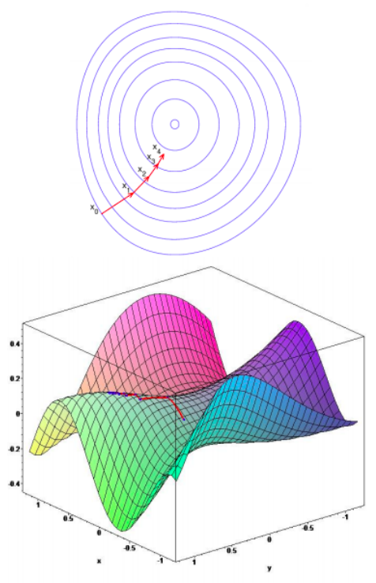
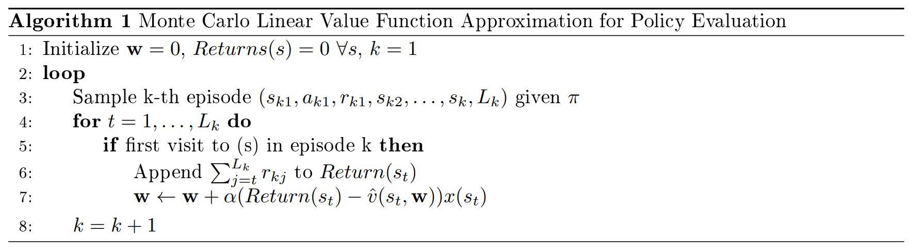
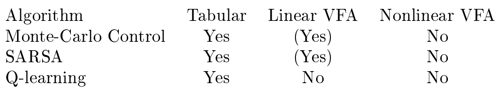
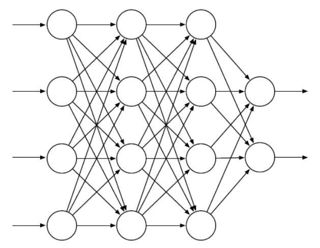

# Lecture 5 Value Function Approximation

# 课时4 值函数近似 2019.01.23

## 7. 介绍（Introduction）

到目前为止我们介绍了基于查表（lookup table）的值函数，这里每个状态都有一个对应条目，$V(s)$，或每个状态-行为对都有一个对应的条目，$Q(s,a)$。然而，这种方法可能不适合处理动作空间或状态空间非常大、或那些我们希望快速学习每个状态估计值的情况。函数近似是解决这个问题的常用办法：
$$
v_{\pi}(s) \approx \hat{v}(s,\mathbf{w}) \text{ or } q_{\pi}(s,a) \approx \hat{q}(s,a,\mathbf{w})，
$$
这里 $\mathbf{w}$ 通常指近似函数的参数。以下是常见的近似函数：

$\bullet$ 特征的线性组合（Linear combinations of features）

$\bullet$ 神经网络（Neural networks）

$\bullet$ 决策树（Decision trees）

$\bullet$ 最近邻（Nearest neighbors）

$\bullet$ 傅立叶/小波基（Fourier / wavelet bases）

我们讲进一步讨论可导近似函数：线性特征表示和神经网络，接下来的部分会提到要求函数可导的原因。

## 8. 线性特征表示（Linear Feature Representations）

在线性特征表示中，我们用一个特征向量去表示一个状态：
$$
x(s)=[x_1(s)\ x_2(s)\ ...\ x_n(s)]，
$$

然后我们用特征的线性组合来近似值函数：
$$
\hat{v}(s,\mathbf{w})=x(s)^{\text{T}}\mathbf{w}=\sum_{j=1}^n x_j(s)\mathbf{w}_j。
$$

我们定义（二次的）目标函数（也被称为损失函数）为：
$$
J(\mathbf{w})=\mathbb{E}_ {\pi}[(v_{\pi}(s)-\hat{v}(s,\mathbf{w}))^2]。
$$

### 8.1 梯度下降（Gradient Descent）

梯度下降（gradient descent）是最小化上述目标函数的一种常用方法。图 1 提供了直观的说明：我们从某个特定的点 $x_0$ 开始，对应于参数 $w$ 的某个初始值；然后计算在 $x_0$ 处的梯度，它告诉我们目标函数增加速度最快的方向；为了最小化我们的目标函数，我们沿着梯度向量的负方向以一定的步长前进，到达 $x_1$；将这个过程重复进行，直到到达某个收敛标准。

图 1：梯度下降可视化。我们希望求出使目标函数最小的点，我们跟着红色箭头走来实现这个目标，红色箭头指向梯度的负方向。

这个方法可以被总结为：
$$
\nabla_{\mathbf{w}}J(\mathbf{w})=[\frac{\partial J(\mathbf{w})}{\partial \mathbf{w}_1}\ \frac{\partial J(\mathbf{w})}{\partial \mathbf{w}_2}\ ...\ \frac{\partial J(\mathbf{w})}{\partial \mathbf{w}_n}] \quad\text{计算梯度}；
$$

$$
\Delta\mathbf{w}=-\frac{1}{2}\alpha\nabla_{\mathbf{w}}J(\mathbf{w}) \quad\text{用梯度下降计算更新步长}；
$$

$$
\mathbf{w} \leftarrow \mathbf{w}+\Delta\mathbf{w} \quad\text{向局部最小值更新一步}。
$$

### 8.2 随机梯度下降（Stochastic Gradient Descent）

实际上，梯度下降并不是一个样本高效的优化器，随机下降梯度（stochastic gradient descent, SGD）的使用更为频繁。尽管最初的 SGD 算法指的是使用单个样本更新权重，但由于矢量化的便利性，人们通常也将小批量样本上的梯度下降称为 SGD。在（小批量）SGD 中，我们取一个小批量的样本，使用该样本计算目标函数并通过梯度下降更新权重。现在我们回到前面课程提到的几种算法，看看如何使用值函数近似。

### 8.3 蒙特卡洛线性值函数近似（Monte Carlo with Linear VFA）

算法 1 是对首次访问蒙特卡洛策略评估的修改，这里我们用线性 VFA 替代了值函数。注意，尽管回报 $Returns(s_t)$ 是无偏估计，但通常它是有噪声的。

### 8.4 时间差分线性值函数近似（Temporal Difference (TD(0)) with linear VFA）

在基于表格的设定中，我们通过引导和采样来近似 $V^{\pi}$，用下式来更新 $V^{\pi}(s)$：
$$
V^{\pi}(s)=V^{\pi}(s)+\alpha(r+\gamma V^{\pi}(s')-V^{\pi}(s))，
$$
这里 $r+\gamma V^{\pi}(s')$ 为我们的目标（target）。我们用相同的 VFA 估计目标和值函数，后面课程中我们会考虑用不同的 VFA（例如在基于控制的设定中）。

使用 VFA，我们用 $\hat{V}^{\pi}$ 替换 $V^{\pi}$，如下式：
$$
\hat{V}^{\pi}(s,\mathbf{w})=\hat{V}^{\pi}(s,\mathbf{w})+\alpha(r+\gamma \hat{V}^{\pi}(s',\mathbf{w})-\hat{V}^{\pi}(s,\mathbf{w}))\nabla_{\mathbf{w}}\hat{V}^{\pi}(s,\mathbf{w})
$$

$$
\hat{V}^{\pi}(s,\mathbf{w})+\alpha(r+\gamma \hat{V}^{\pi}(s',\mathbf{w})-\hat{V}^{\pi}(s,\mathbf{w}))\mathbf{x}(s)。
$$

在值函数近似中，虽然我们的目标是对真值 $V^{\pi}(s)$ 的有偏且近似的估计，但线性 TD($0$) 仍会收敛（接近）到全局最优解，下面我们进行证明。

### 8.5 策略评估的线性值函数近似的收敛性（Convergence Guarantees for Linear VFA for Policy Evaluation）

我们定义策略 $\pi$ 的线性 VFA 相对真值的均方误差为：
$$
MSVE(\mathbf{w})=\sum_{s\in S}\mathbf{d}(s)(\mathbf{v}^{\pi}(s)-\hat{\mathbf{v}}^{\pi}(s,\mathbf{w}))^2，
$$
这里 $\mathbf{d}(s)$ 为真实决策过程中基于策略 $\pi$ 的状态的概率分布，$\hat{\mathbf{v}}^{\pi}(s,\mathbf{w})=\mathbf{x}(s)^{\text{T}}\mathbf{w}$ 为线性 VFA。

**定理 8.1** 使用 VFA 的蒙特卡洛策略评估收敛到权重 $\mathbf{w}_{MC}$，使均方误差最小：

$$
MSVE(\mathbf{w}_ {MC})=\mathop{\min}_ {\mathbf{w}}\sum_{s\in S}\mathbf{d}(s)(\mathbf{v}^{\pi}(s)-\hat{\mathbf{v}}^{\pi}(s,\mathbf{w}))^2。
$$

**定理 8.2** 使用 VFA 的 TD($0$) 策略评估收敛到权重 $\mathbf{w}_{TD}$，使均方误差在最小均方误差的常值倍数内：

$$
MSVE(\mathbf{w}_ {TD})=\frac{1}{1-\gamma} \mathop{\min}_ {\mathbf{w}}\sum_{s\in S}\mathbf{d}(s)(\mathbf{v}^{\pi}(s)-\hat{\mathbf{v}}^{\pi}(s,\mathbf{w}))^2。
$$
关于证明，读者可以参考文献 [[1]](#ref1)。

### 8.6 基于 VFA 的控制（Control Using VFA）

类似 VFA，我们也可以用近似函数来估计状态-行为值，即 $\hat{q}(s,a,\mathbf{w}) \approx q_{\pi}(s,a)$，然后我们可以通过 $\hat{q}(s,a,\mathbf{w})$ 进行策略评估（policy evaluation）和策略提升（policy improvement），下面我们用数学的方式表示上述过程。

首先，我们定义目标函数为 $J(\mathbf{w})$：
$$
J(\mathbf{w})=\mathbb{E}_ {\pi}[(q_{\pi}(s,a)-\hat{q}(s,a,\mathbf{w}))^2]。
$$

类似我们之前所做的，我们可以通过梯度下降或随机梯度下降来最小化目标函数。例如，对于线性状态-行为值近似函数，我们可以：
$$
x(s)=[x_1(s)\ x_2(s)\ ...\ x_n(s)] \quad\text{状态-行为值特征向量}；
$$

$$
\hat{q}(s,a,\mathbf{w})=x(s,a)\mathbf{w} \quad\text{以特征的线性组合作为状态-行为值}；
$$

$$
J(\mathbf{w})=\mathbb{E}_ {\pi}[(q_{\pi}(s,a)-\hat{q}(s,a,\mathbf{w}))^2] \quad\text{以特征的线性组合作为状态-行为值}；
$$

$$
-\frac{1}{2}\nabla_{\mathbf{w}}J(\mathbf{w})=\mathbb{E}_ {\pi}[(q_{\pi}(s,a)-\hat{q}(s,a,\mathbf{w}))\nabla_{\mathbf{w}}\hat{q}(s,a,\mathbf{w})] \quad\text{计算梯度}；
$$

$$
=(q_{\pi}(s,a)-\hat{q}(s,a,\mathbf{w}))x(s,a)
$$

$$
\Delta\mathbf{w}=-\frac{1}{2}\alpha\nabla_{\mathbf{w}}J(\mathbf{w}) \quad\text{用梯度下降计算更新步长}；
$$

$$
=\alpha(q_{\pi}(s,a)-\hat{q}(s,a,\mathbf{w}))x(s,a)
$$

$$
\mathbf{w} \leftarrow \mathbf{w}+\Delta\mathbf{w} \quad\text{向局部最小值更新一步}。
$$

对于蒙特卡洛，我们用回报 $G_t$ 代替目标 $q_{\pi}(s,a)$，也就是说，我们的更新为：
$$
\Delta\mathbf{w}=\alpha(G_t-\hat{q}(s,a,\mathbf{w}))\nabla_{\mathbf{w}}\hat{q}(s,a,\mathbf{w})。
$$

对于 SARSA，我们用 TD 目标代替 $q_{\pi}(s,a)$：
$$
\Delta\mathbf{w}=\alpha(r+\gamma\hat{q}(s',a',\mathbf{w})-\hat{q}(s,a,\mathbf{w}))\nabla_{\mathbf{w}}\hat{q}(s,a,\mathbf{w})。
$$

对于 Q-学习，我们用 TD 目标的最大值代替 $q_{\pi}(s,a)$：
$$
\Delta\mathbf{w}=\alpha(r+\gamma\mathop{\max}_ {a'}\hat{q}(s',a',\mathbf{w})-\hat{q}(s,a,\mathbf{w}))\nabla_{\mathbf{w}}\hat{q}(s,a,\mathbf{w})。
$$

注意，由于我们使用了值函数近似来完成卡尔曼备份，我们无法保证收敛性，推荐读者看一下 Baird 的 Counterexample，以获得更具体的说明。表1对不同算法是否收敛进行了总结。

表 1：基于 VFA 的控制方法的收敛性总结。(Yes) 表示结果在接近最优值函数时会抖动。

## 9. 神经网络（Neural Networks）

虽然线性 VFA 在给出了正确特征的情况下的表现通常很很好，但也很难去手动给出这些特征。神经网络提供了一个更为丰富的函数近似类，它可以直接以状态作为变量，而不需要明确的特征。

图 2 展示了一个通用的前馈神经网络。图中的神经网络由一个包含两个输出单元的输出层、一个包含四个输入单元的输入层、以及两个隐藏层（既不是输入层也不是输出层）组成。每个连接都与一个实值权重关联。这些单元通常是半线性的，即它们计算输入信号的加权和，然后对这个加权和应用一个非线性函数，这个函数通常被称为激活函数（activation function）。作业2中，我们研究了具有单个隐藏层的神经网络如何拥有“通用逼近（universal approximaiton）”的性质，实验和理论都表明，通过多个隐藏层的有层次的组合，我们可以更容易地逼近复杂的函数。

图 2：一个包含四个输入单元、两个输出单元、两个隐藏层的通用的前馈神经网络。

下节课我们将更深入地讨论关于用神经网络解决强化学习问题的一些理论和近期发现。

## 参考文献

1. J. N. Tsitsiklis, and B. V. Roy, "An analysis of temporal-difference learning with function approximation," *IEEE Transactions on Automation Control*, 1997.