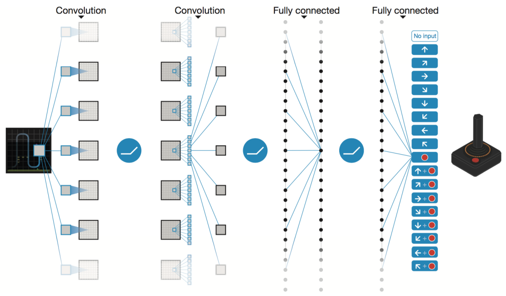
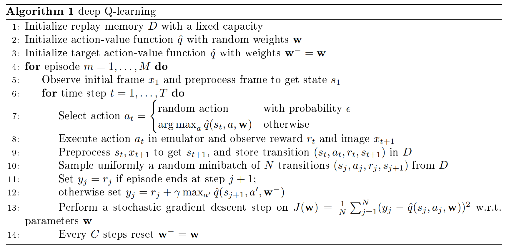
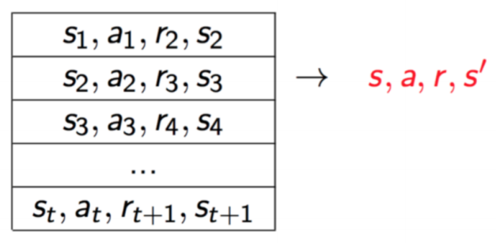
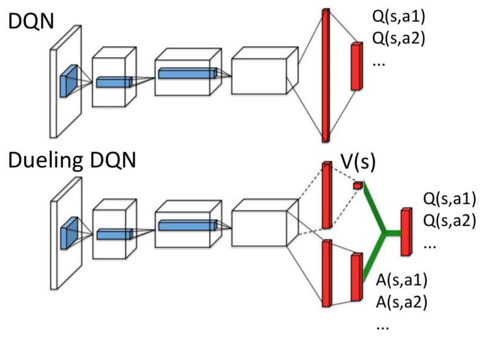

# Lecture 6 CNNs and Deep Q-learning

# 课时6 卷积神经网络与深度 Q-学习 2019.01.28

## 7. 基于值的深度强化学习（Value-based Deep Reinforcement Learning）

这一部分我们介绍三种常见的基于值的深度强化学习（RL）算法：深度 Q-网络（Deep Q-network）[[1]](#ref1)，双 DQN（Double DQN）[[2]](#ref2) 和对抗 DQN（Dueling DQN）[[3]](#ref3)。通过端到端的（end-to-end）强化学习，这三种神经网络架构都可以直接从像电子游戏的预处理像素这样的高维输入（high-dimensional inputs）中学习到成功的策略，它们在 Atari 2600 的 49 个游戏中达到了相当于专业的游戏测试员的水平 [[4]](#ref4)。

这些架构都使用了卷积神经网络（Convolutional Neural Networks, CNNs）[[5]](#ref5) 来从像素输入中提取特征。理解 CNNs 特征提取的机制有助于我们理解 DQN 的工作方式。 斯坦福大学 CS231N 课程网站提供了关于 CNNs 的详尽的介绍和例子，通过这个链接，读者可以阅读更多细节：[CS231N](http://cs231n.github.io/convolutional-networks/)。本节的其余部分我们将关注 RL 和 基于值的深度 RL 算法的泛化。

### 7.1 概述：状态-行为值函数近似（Recap: Action-value Function Approximation）

上节课我们用参数化的近似函数来表示状态-行为值函数（Q-函数），若我们将参数记为 $\mathbf{w}$，那么这种设定中，Q-函数可以被表示为 $\hat{q}(s,a,\mathbf{w})$。

假设我们知道 $q(s,a)$，通过最小化真实状态-动作值函数 $q(s,a)$ 和近似估计之间的均方误差 $J(\mathbf{w})$，我们可以得到近似的 Q-函数：
$$
J(\mathbf{w})=\mathbb{E}[(q(s,a)-\hat{q}(s,a,\mathbf{w}))^2]。
\tag{1}
$$

我们可以通过随机梯度下降（stochastic gradient descent, SGD）找到 $J$ 的关于 $\mathbf{w}$ 的局部最小值，并且以下式来更新 $\mathbf{w}$：

$$
\Delta(\mathbf{w})=-\frac{1}{2}\alpha\nabla_{\mathbf{w}}J(\mathbf{w})=\alpha\mathbb{E}[(q(s,a)-\hat{q}(s,a,\mathbf{w}))\nabla_{\mathbf{w}}\hat{q}(s,a,\mathbf{w})]，
\tag{2}
$$

这里 $\alpha$ 为学习率（learning rate）。通常情况下，真实的状态-动作值函数 $q(s,a)$ 是未知的，所以用一个近似的学习目标（learning target）来代替式（[2](#eq2)）中的 $q(s,a)$。

在蒙特卡洛方法中，对于片段式的 MDPs，我们用无偏的回报 $G_t$ 来代替学习目标：
$$
\Delta(\mathbf{w})=\alpha(G_t-\hat{q}(s,a,\mathbf{w}))\nabla_{\mathbf{w}}\hat{q}(s,a,\mathbf{w})。
\tag{3}
$$

对于 SARSA 方法，我们使用基于推导的 TD 目标 $r+\gamma\hat{q}(s',a',\mathbf{w})$：
$$
\Delta(\mathbf{w})=\alpha(r+\gamma\hat{q}(s',a',\mathbf{w})-\hat{q}(s,a,\mathbf{w}))\nabla_{\mathbf{w}}\hat{q}(s,a,\mathbf{w})，
\tag{4}
$$
这里 $a'$ 为在下一状态 $s'$ 执行的动作，$\gamma$ 为衰减因子，TD 目标利用了当前的函数近似值。

对于 Q-学习，我们使用 TD 目标 $r+\gamma\mathop{\max}_{a'}\hat{q}(s',a',\mathbf{w})$，并以下式来更新 $\mathbf{w}$：

$$
\Delta(\mathbf{w})=\alpha(r+\gamma\mathop{\max}_ {a'}\hat{q}(s',a',\mathbf{w})-\hat{q}(s,a,\mathbf{w}))\nabla_{\mathbf{w}}\hat{q}(s,a,\mathbf{w})。
\tag{5}
$$

下面的部分我们将介绍如何使用深度神经网络来近似 $\hat{q}(s,a,\mathbf{w})$，以及如何通过端到端的训练来学习神经网络的参数 $\mathbf{w}$。

### 7.2 泛化：深度 Q-网络（Generalization: Deep Q-network）[[1]](#ref1)

线性近似函数的表现非常依赖于特征的质量，一般来说，手动给出合适的特征很困难，也很耗时。为了在大的空间（large domians）（比如大的状态空间）进行决策并实现特征自动提取，深度神经网络（DNNs）通常被选作近似函数。

#### 7.2.1 DQN 架构（DQN Architecture）

图1展示了 DQN 的结构，图中的网络将 Atari 游戏环境的预处理像素图（预处理见 7.2.2 节）作为输入，为每个可行的动作赋予一个 Q 值，将这些 Q 值作为一个向量输出。预处理的像素输入代表了游戏状态 $s$，单个的输出单元表示动作 $a$ 的 $\hat{q}$ 函数。总的来说，$\hat{q}$ 可以被记为 $\hat{q}(s,\mathbf{w})\in\mathbb{R}^{|A|}$，简单起见，我们仍用 $\hat{q}(s,a,\mathbf{w})$ 来表示对 $(s,a)$ 的状态-行为值估计。

结构细节：输入为一张 $84\times 84\times 4$ 的图片；第一个卷积层有 32 个大小为 $8\times 8$、步幅（stride）为 $4$ 的滤波器，对输入图片进行卷积操作后，将结果输入非线性整流器（ReLU）[[6]](#ref6)；第二个隐藏层有 64 个大小为 $4\times 4$、步幅为 $2$ 的滤波器，同样地，后面接非线性整流器；第三个隐藏层有 64 个大小为 $3\times 3$、步幅为 $1$ 的滤波器，同样地，后面接 ReLU；最后的隐藏层为包含 512 个整流器（ReLU）单元的全连接层（fully-connected layer）；输出层为全连接线性层。

图 1：深度 Q 网络：网络的输入为一张 $84\times 84\times 4$ 的预处理过的图片，后面接三个卷积层和两个全连接层，每个可行动作都对应一个输出，每个隐藏层都接一个非线性整流器（ReLU）[[6]](#ref6)。

#### 7.2.2 原始像素预处理（Processing Raw Pixels）

原始的 Atari 2600 画面的大小为 $210\times 160\times 3$，最后的维度指的是 RGB 的通道数。[[1]](#ref1) 中采用的预处理步骤的目的是降低输入的维度以及处理游戏模拟器的一些工件。我们将预处理过程总结如下：

$\bullet$ 单帧图片编码（single frame encoding）：为编码单帧图片，我们将返回所编码帧和上一帧每个像素颜色值的最大值，也就是说，我们返回两帧连续的原始图片的每个像素的最大值（pixel-wise nax-pooling）；

$\bullet$ 降维（dimensionality reduction）：从编码的 RGB 图像中提取 Y 通道（也称为亮度，luminance），将其重新缩放到 $(84\times 84\times 1)$；

对 4 帧最新的原始 RGB 图像应用上述处理过程，并将编码后的图片堆叠在一起，以生成 Q-网络的输入（大小为 $(84\times 84\times 1)$）。将最新的帧堆叠在一起来作为游戏状态也是将游戏环境转换为（近似）马尔科夫世界的一种方法。

#### 7.2.3 DQN 的训练算法（Training Algorithms for DQN）

由于没有理论性的保证，而且学习和训练往往很不稳定，因此过去常常避免使用大型的深度神经网络来近似状态-行为值函数。为使用大型非线性近似函数和大规模在线 Q-学习，DQN 引入了两个主要变化：使用经验回放（experience replay）和一个单独的目标网络（target network），算法 1 展示了完整的算法。本质上，Q-网络是通过最小化以下均方误差来学习的：

$$
J(\mathbf{w})=\mathbb{E}_ {(s_t,a_t,r_t,s_{t+1})}[(y_t^{DQN}-\hat{q}(s_t,a_t,\mathbf{w}))^2]，
\tag{6}
$$

这里 $y_t^{DQN}$ 为提前一步学习目标（one-step ahead learning target）：
$$
y_t^{DQN}=r_t+\gamma\mathop{\max}_ {a'}\hat{q}(s_{t+1},a',\mathbf{w}^-)，
\tag{7}
$$

$\mathbf{w}^-$ 表示目标网络的参数，在线网络的参数 $\mathbf{w}$ 通过从曾经的状态转移 $(s_t,a_t,r_t,s_{t+1})$ 的小批量中采样梯度来更新。

（注意：尽管目标网络可以根据 $\mathbf{w}^-$ 计算学习的目标，当我们更新 $\mathbf{w}$ 时，仍认为目标 $y_t^{DQN}$ 是固定的。）

经验回放（Experience Replay）:

行为体在每个时间步的经历（或状态转移）$e_t=(s_t,a_t,r_t,s_{t+1})$ 被存储在一个固定大小的数据集（或回放存储器，replay buffer）中：$D_t={e_1,...,e_t}$，回放存储器保留着最新的 $k=1 million$ 次经历（图2解释了回放存储器）。通过从最小批数据中采样梯度来更新 Q-网络，最小批中的每个状态转移样本都是从经验存储池中随机均匀采样得到的：$(s,a,r,s')\sim U(D)$。对于标准的在线 Q-学习，这个方法有以下优点:

$\bullet$ 更高的数据效率（greater data efficiency）：每一步的经验都可能用于多次更新，从而提高数据效率；

$\bullet$ 去除样本相关性（removing sample correlations）：对状态转移的随机采样打破了连续样本间的联系，因此能降低更新的方差并稳定训练过程；

$\bullet$ 避免震荡或发散（avoiding oscillations or divergence）：表现分布根据许多的历史状态和状态转移做了平均，因此可以平滑学习过程，避免参数的震荡或发散。（注意，在使用经验回放时，应当使用离线策略方法，如 Q-学习，因为当前的参数与用于生成样本的参数不同。）

经验回放的限制（limitations of experience replay）：回放存储器并不区分重要的或能提供有用信息的状态转移；由于存储容量固定，最旧的状态转移总是会被最新的状态转移覆盖；类似地，从存储器均匀采样赋予了存储的经历以同等的重要性。[[7]](#ref7) 提出了一种更为复杂的回放策略，即优先回放（Prioritized Replay），它更频繁地回放重要的状态转移，因此行为体的学习效率更高。

图 2：回放存储器：从回放存储器中对状态转移 $(s,a,r,s')$ 均匀采样，以更新 Q 网络。

目标网络（Target Network）：

为了进一步提高学习的稳定性和处理非平稳的学习目标，在 Q-学习的更新中，DQN 采用了一个独立的目标网络来生成目标 $y_i$（算法 1 第 12 行）。具体来说，通过从在线网络 $\hat{q}(s,a,\mathbf{w})$ 复制参数值 $\mathbf{w}^-=\mathbf{w}$，每 $C$ 次更新/时间步更新一次目标网络 $\hat{q}(s,a,\mathbf{w}^-)$，在接下来的 $C$ 次更新中，目标网络保持不变并生成 $y_i$。这项改动使算法相对标准的在线 Q-学习 而言更加稳定，在原始的 DQN 中，$C=10000$。

#### 7.2.4 训练细节（Training Details）

原始的 DQN 论文 [[1]](#ref1) 用每个游戏以相同的结构训练了一个不同的网络（或行为体）来学习算法和超参数。作者们将游戏环境中的正面奖励都设置为 $+1$，负面奖励都设置为 $-1$，这使得行为体可以在不同的游戏中都使用相同的学习率。对于有生命计数器的游戏（例如 Breakout），模拟器还返回游戏中剩余的生命数，然后通过明确地设置未来奖励为零来标志训练期间一个片段的结束。他们还使用了一种简单的跳帧技术（或动作重复）：行为体每 4 帧选择一次动作并重复这个动作直到下一次选择，而非每帧都选择。这降低了做决策的频率而不会对性能造成太大影响，并且使行为体在训练期间可以多玩大约 4 倍的游戏。

[[1]](#ref1) 使用了 RMSProp（https://www.cs.toronto.edu/~tijmen/csc321/slides/lecture_slides_lec6.pdf ）来训练 DQN，最小批的大小为 32。训练过程中，他们应用了 $\epsilon$-贪婪策略，前一百万时间步中，$\epsilon$ 从 $1.0$ 线性地减小到 $0.1$，后面 $\epsilon$ 一直保持为 $0.1$。回放存储器存储最新的一百万次状态转移。测试过程中，他们使用 $\epsilon=0.05$ 的 $\epsilon$-贪婪策略。

### 7.3 降低偏移：双深度 Q-网络（Reducing Bias: Double Deep Q-network）[[2]](#ref2)

DQN 中的最大值算子（算法 1 第 12 行）使用了相同的网络值来选择并评估一个动作，这个设定使得选择高估计值的可能性更大，并导致目标值估计过于乐观。 H. Van 等人在 [[2]](#ref2) 也展示了 DQN 算法在 Atari 2600 的某些游戏中存在严重的高估问题。为了避免高估并降低偏差，我们可以将动作选择与动作评估分离。

回忆双 Q-学习（Double Q-learning），有两个状态-行为值函数，我们通过随机分配状态转移来更新这两个函数中的一个，从而产生两组不同的函数参数，分别记为 $\mathbf{w}$ 和 $\mathbf{w}'$。为了计算目标，我们用其中一个函数来选择贪婪动作，用另一个函数来评估其价值：
$$
y_t^{DoubleQ}=r_t+\gamma \hat{q}(s_{t+1},\mathop{\arg\max}_ {a'}\hat{q}(s_{t+1},a',\mathbf{w}),\mathbf{w}')。
\tag{8}
$$

注意，我们根据函数参数 $\mathbf{w}$ 选择动作（$\mathop{\arg\max}$），根据另一组参数 $\mathbf{w}'$ 评估动作价值。

在计算目标的过程中的通过将动作选择与动作评估分离从而避免高估的想法也可以被扩展到深度 Q-学习。DQN 结构中的目标网络在不引入额外网络的情况下，为第二个状态-行为值函数提供了一个自然的候选，同样地，贪婪动作是根据参数为 $\mathbf{w}$ 的在线网络生成的，但其值是根据参数为 $\mathbf{w}^-$ 目标网络估计的，这样产生的算法被称作双 DQN （Double DQN），它仅仅用下式替换了算法 1 的第 12 行：
$$
y_t^{DoubleDQN}=r_t+\gamma \hat{q}(s_{t+1},\mathop{\arg\max}_ {a'}\hat{q}(s_{t+1},a',\mathbf{w}),\mathbf{w}^-)。
\tag{9}
$$

目标网络的更新与 DQN 保持不变，并定期地复制在线网络参数 $\mathbf{w}$，DQN 算法的其余部分保持不变。

### 7.4 ：将值函数与优势函数分开：对抗网络（Decoupling Value and Advantage: Dueling Network）[[3]](#ref3)

#### 7.4.1 对抗网络结构（The Dueling Network Architecture）

在探索对抗式结构前，我们首先介绍一个重要的量：优势函数（advantage function），这个函数与状态值函数和 Q 函数有关（假设遵循策略 $\pi$）：
$$
A^{\pi}(s,a)=Q^{\pi}(s,a)-V^{\pi}(s)。
\tag{10}
$$

因为 $V^{\pi}(s)=\mathbb{E}_ {a\sim\pi(s)}[Q^{\pi}(s,a)]$，我们有 $\mathbb{E}_{a\sim\pi(s)}[A^{\pi}(s,a)]=0$。直观地说，优势函数从 Q 函数减去了状态值函数，得到了每个动作的重要性的相对度量。

就像 DQN 那样，对抗网络也是一个为了学习 Q 函数的 DNN 近似函数。不同的是，它通过将值函数和优势函数分开来近似 Q 函数，图 3 比较了对抗网络的结构和 DQN 的结构。

图 3：深度 Q 网路（顶部）和对抗 Q 网络（底部）。对抗网络分别估计状态值函数 $V(s)$（标量）和优势函数 $A(s,a)$（对每个动作）；绿色的输出模块执行式（[13](#eq13)）以将这两个输出合并。两个网络都为每个动作输出 Q 值。

对抗网络的底层是卷积神经网络，然而，它使用了两个全连接层来估计 Q 值，而不是用一个全连接层。其中一个层提供状态值函数，另一个层对每个可行的动作估计优势函数，最后，将这两个层合并以得到近似的 Q 函数。像 DQN 那样，网络的输出为 Q 值向量，每个元素对应一个动作。

注意，由于对抗网络的输入和最终输出（两个层的合并）和原始的 DQN 一样，所以上面介绍的训练算法（算法 1）也可以被用来训练对抗网络。分开的两个层是根据作者的观察或灵感来设计的：

$\bullet$ 对于许多状态，我们并不一定要估计所有可能的动作的价值。在某些状态时，动作的选择非常重要；而在很多状态下，选择什么动作对接下来发生的事情并没有影响。另一方面，对每个状态的价值估计对基于引导的算法（如 Q 学习）而言非常重要。

$\bullet$ 确定价值函数所需的特征可能不同于用于准确估计动作价值的特征。

将两个全连接层合并来估计 Q 值并不是一项简单的任务，实际上，这个合并模块（aggregating module）（图 3 中的绿线）需要非常周到的设计，我们将在下一小节介绍这一点。

#### 7.4.2 Q 值估计（Q-value Estimation）

根据优势函数（10）的定义，我们有 $Q^{\pi}(s,a)=A^{\pi}(s,a)+V^{\pi}(s)$，以及 $\mathbb{E}_ {a\sim\pi(s)}[A^{\pi}(s,a)]=0$。另外，对于确定性策略（deterministic policy）（常用于基于值的深度 RL），$a^{\ast}=\mathop{\arg\max}_{a'\in A}Q(s,a')$，由于 $Q(s,a^{\ast})=V(s)$，我们有 $A(s,a^{\ast})=0$，这种情况下，贪婪动作的优势函数为零。

考虑图 3 中的对抗网络结构，记其中一个全连接层的标量值函数输出为 $\hat{v}(s,\mathbf{w},\mathbf{w}_ {\mathbf{V}})$，记另一个全连接层的向量优势函数输出为 $A(s,a,\mathbf{w},\mathbf{w}_ {\mathbf{A}})$，这里我们用 $\mathbf{w}$ 表示卷积层的共享参数，用 $\mathbf{w}_ {\mathbf{V}}$ 和 $\mathbf{w}_ {\mathbf{A}}$ 表示两个全连接层的参数，那么。合并模块的最简单的设计方式可能就是下式这样：

$$
\hat{q}(s,a,\mathbf{w},\mathbf{w}_ {\mathbf{A}},\mathbf{w}_ {\mathbf{V}})=\hat{v}(s,\mathbf{w},\mathbf{w}_ {\mathbf{V}})+A(s,a,\mathbf{w},\mathbf{w}_ {\mathbf{A}})。
\tag{11}
$$

这样设计的主要问题是式（[11](#eq11)）不是无法确认的，给定 $\hat{q}$，我们不能唯一地得到 $\hat{v}$ 和 $A$，比如，将 $\hat{v}$ 加上一个常数并将 $A$ 减去一个相同的常数，我们能得到一样的 Q 值估计。无法确认的问题在实践中会导致差的表现。

为了使 Q 函数是可以确认的，回忆上面讨论的确定性策略的情况，我们可以强制优势函数在选择的动作下的估计为零，那么，我们有：

$$
\hat{q}(s,a,\mathbf{w},\mathbf{w}_ {\mathbf{A}},\mathbf{w}_ {\mathbf{V}})=\hat{v}(s,\mathbf{w},\mathbf{w}_ {\mathbf{V}})+(A(s,a,\mathbf{w},\mathbf{w}_ {\mathbf{A}}) - \mathop{\max}_ {a'\in A}A(s,a',\mathbf{w},\mathbf{w}_{A}))。
\tag{12}
$$

对于一个确定性策略，$a^{ast}=\mathop{\arg\max}_ {a'\in A}\hat{q}(s,a',\mathbf{w},\mathbf{w}_ {\mathbf{A}},\mathbf{w}_ {\mathbf{V}})=\mathop{\arg\max}_ {a'\in A}A(s,a',\mathbf{w},\mathbf{w}_ {\mathbf{A}})$，式（[12](#eq12)）说明 $\hat{q}(s,a^{ast},\mathbf{w},\mathbf{w}_ {\mathbf{A}}=\hat{v}(s,\mathbf{w},\mathbf{w}_ {\mathbf{V}})$，因此，全连接层输出的 $\hat{v}$ 为值函数的估计，另一个全连接层的输出 $A$ 为优势函数的估计。

[[3]](#ref3) 中作者还提出了另一种合并模块的设计：用平均算子代替最大值算子，

$$
\hat{q}(s,a,\mathbf{w},\mathbf{w}_ {\mathbf{A}},\mathbf{w}_ {\mathbf{V}})=\hat{v}(s,\mathbf{w},\mathbf{w}_ {\mathbf{V}})+(A(s,a,\mathbf{w},\mathbf{w}_ {\mathbf{A}}) - \frac{1}{|A|}A(s,a',\mathbf{w},\mathbf{w}_{A}))。
\tag{13}
$$

尽管这种设计在某种意义上失去了 $\hat{v}$ 和 $A$ 的原始含义，但作者认为它提升了学习的稳定性：优势函数只需要随着平均值的变化而变化，而不必对最优动作的优势函数的改变做出补偿，因此，对抗网络 [[3]](#ref3) 中的合并模块是根据式（[13](#eq13)）实现的，当做出动作时，通过评估优势函数便足以做出决策。

对抗网络的优点在于它能够有效地逼近价值函数，动作的数量越多，这一优点相对单个全连接层的 Q 网络而言就越为明显，并且在 2016 年，对抗网络就在 Atari 游戏上取得了最佳结果。

## 参考文献

1. V. Mnih et al., "Human-level control through deep reinforcement learning," *Nature* 518(7540): 529-533, 2015.

2. H. van Hasselt, A. Guez, and D. Silver, "Deep reinforcement learning with double q-learning," *AAAI*, 2016.

3. Z. Wang et al., "Dueling network architectures for deep reinforcement learning," *arXiv preprint arXiv: 1511.06581*, 2015.

4. M. G. Bellemare et al., "The arcade learning environment: an evaluation platform for general agents," *IJCAI*, 2015.

5. A. Krizhevsky, I. Sutskever, and G. F. Hinton, "Imagenet classification with deep convolutional neural networks," *NIPS*, 2012.

6. V. Nair, and G. E. Hinton, "Rectified linear units improve restricted boltzmann machines," *ICML*, 2010.

7. T. Schaul et al., "Prioritized experience replay," *arXiv preprint arXiv: 1511.05952*, 2016.