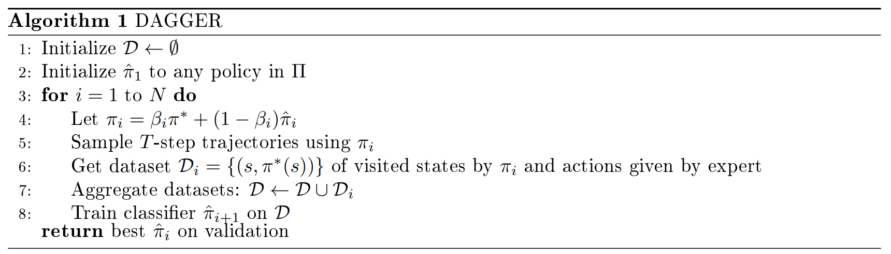
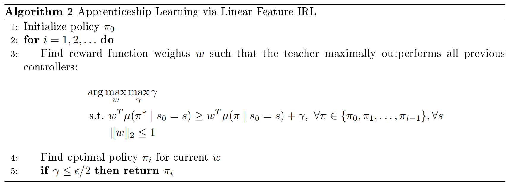
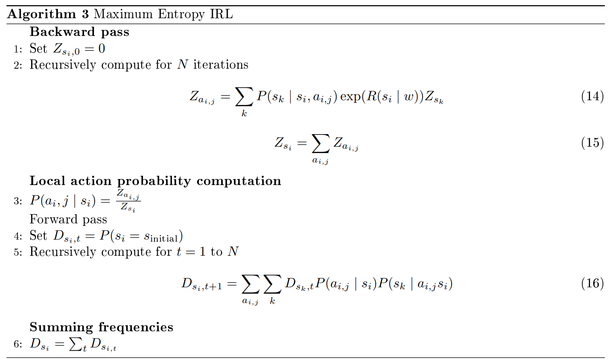

# Lecture 7 Imitation Learning

# 课时7 模仿学习 2019.01.30

## 8. 介绍（Introduction）

强化学习中有一些必须克服的理论和实践上的障碍，包括优化、延迟的影响、如何探索以及如何归纳。然而，重要的是，我们希望能够处理上述所有困难，同时保证数据效率和计算效率。

我们将在课程后后面部分讨论有效探索的一般方法，这些方法能够处理一般的 MDPs。但是，如果我们知道问题的结构，或者我们有可以使用的外部知识，我们就可以更有效地探索。本次课我们讨论如何模仿和学习人类（专家）在任务上的行为。

## 9. 模仿学习（Imitation Learning）

过去我们的目标是从奖励中学习策略，这些奖励通常非常稀疏（sparse），例如，一个简单的奖励信号可能是行为体是否赢得了一场游戏。这种方法在数据便宜且易于收集的情况下是成功的，然而，当数据收集速度较慢、必须避免失败（如自动驾驶）或必须保证安全时，这种方法就不是可行的。

缓解稀疏奖励问题的一种途径是手动设计在时间上密集的奖励函数，然而，这种方法需要人来手工设计奖励函数，并记住所需的行为，因此，最好通过模仿执行相关任务的行为体来学习。

### 9.1 从示范中学习（Learning from Demonstration）

一般来说，专家们提供了一组演示轨迹（demonstration trajectories），这些轨迹是状态和动作的序列。更正式地，我们假设已知：

$\bullet$ 状态空间，动作空间；

$\bullet$ 状态转移模型 $P(s'|s,a)$；

$\bullet$ 奖励函数 $R$ 未知；

$\bullet$ 一个或多个演示 $(s_0,a_0,s_1,a_1,...)$，这里动作遵循策略 $\pi^{\ast}$。

## 10. 行为克隆（Behavioral Cloning）

我们能否通过有监督学习来学习策略？

 

行为克隆是为了通过有监督学习去学习策略。具体来说，我们固定一个策略的类，目的是在已知数据 ${(s_0,a_0),(s_1,a_1),...}$ 时，学习一个将状态映射到动作的策略。一个值得注意的例子是 ALVINN，它学会了将传感器输入映射到转向角。

这种方法的一个挑战是状态空间的数据不是 i.i.d.（独立同分布，independent and identically distributed）的，i.i.d. 的假设是有监督学习文献和理论的标准。然而，在 RL 环境中，错误是复杂的；这些错误会随着事件过程不断累积。用于被学习的策略的数据会紧紧围绕专家的轨迹，如果犯了一个错误，而且这个错误使得行为体处于专家没有访问过的状态，那么行为体就没有可以从中学习策略的数据。在这种情况下，与标准 RL 中的线性标度相反，误差在片段中呈四次标度（the error scales quadratically）。

### 10.1 DAGGER：数据聚集（DAGGER: Dataset Aggregation）

数据聚集（DAGGER，算法 1，[[1]](#ref1)）的目的是通过为新访问的状态添加数据来缓解错误的复杂化问题。与假设存在预先定义好的专家演示相反，我们假设我们可以通过专家来生成更多的数据。当然，这么做的局限之处在于，专家必须能够提供标签，有时还应该是实时的。

## 11. 逆强化学习（Inverse Reinforcement Learning, IRL）

我们能否复原奖励函数 $R$？

 

在逆强化学习中（也被称为逆最优控制（inverse optimal control）），我们的目标是基于专家演示来学习奖励函数（未知）。如果不假设演示的最优性，这个问题是很难解决的，因为任何奖励函数都可能产生观测到的轨迹。

### 11.1 线性特征奖励的逆强化学习(Linear Feature Reward Inverse RL)

我们考虑表示为特征的线性组合的奖励：
$$
R(s)=\omega^{\text{T}}x(s)，
\tag{1}
$$

这里 $\omega\in \mathbb{R}^n$，$x:S\rightarrow \mathbb{R}^n$。在这种情况下，IRL 问题是给定一组演示时，确定权重向量 $\omega$。由此生成的关于策略 $\pi$ 的价值函数可以表示为：
$$
V^{\pi}(s)=\mathbb{E}_ {\pi}[\sum_{t=0}^{\infty}\gamma^tR(s_t)|s_0=s]
\tag{2}
$$

$$
=\mathbb{E}_ {\pi}[\sum_{t=0}^{\infty}\gamma^t\omega^{\text{T}}x(s_t)|s_0=s]
\tag{3}
$$

$$
=\omega^{\text{T}}\mathbb{E}_ {\pi}[\sum_{t=0}^{\infty}\gamma^tx(s_t)|s_0=s]
\tag{4}
$$

$$
=\omega^{\text{T}}\mu(\pi)，
\tag{5}
$$

这里 $\mu(\pi|s_0=s)\in\mathbb{R}^n$ 为基于策略 $\pi$ 的状态特征 $x(s)$ 的衰减加权和。注意：
$$
\mathbb{E}_ {\pi^{\ast}}[\sum_{t=0}^{\infty}\gamma^tR^{\ast}(s_t)|s_0=s]\geq \mathbb{E}_ {\pi}[\sum_{t=0}^{\infty}\gamma^tR^{\ast}(s_t)|s_0=s] \quad \forall\pi，
\tag{6}
$$

这里 $R^{\ast}$ 为最优奖励函数。因此，如果专家演示是最优的（即动作是基于最优策略生成的），那么我们找到满足下式的 $\omega^{\ast}$ 就能够确定 $\omega$：
$$
\omega^{\ast\text{T}}\mu(\pi^{\ast}|s_0=s) \geq \omega^{\ast\text{T}}\mu(\pi|s_0=s) \quad \forall\pi，\forall s。
\tag{7}
$$

从某种意义上说，我们希望找到奖励函数的一种参数化形式，使得专家策略的表现优于其他策略。

## 12. 学徒制学习（Apprenticeship Learning）

我们能否通过复原的奖励函数来生成好的策略？

 

为使策略 $\pi$ 表现得和专家策略 $\pi^{\ast}$ 一样好，只需要这个策略的特征的衰减加权和的期望与专家策略相匹配 [[2]](#ref2)。更准确地说，如果
$$
\lVert \mu(\pi|s_0=s)-\mu(\pi^{\ast}|s_0=s) \rVert _1 \leq \epsilon，
\tag{8}
$$

那么对于所有满足 $\lVert \omega \rVert _\infty \leq 1$ 的 $\omega$，根据 Cauchy-Schwartz 不等式，我们有
$$
|\omega^{\text{T}}\mu(\pi|s_0=s)-\omega^{\text{T}}\mu(\pi^{\ast}|s_0=s)|\leq\epsilon。
$$

由这一结论我们可以得到算法 2 ，通过算法 2 来学习一个表现得像专家策略一样好的策略（细节请参考 [[2]](#ref2)）。

在实践中，这种方法存在一些问题：

$\bullet$ 如果专家策略是次优的，那么得到的策略就是一些武断的策略的混合，这些策略在其凸包（convex hull）中具有专家策略的性质。在实践中，实践者可以选择这个集合中的最佳策略并选择对应的奖励函数；

$\bullet$ 这种方法需要在给定奖励函数的情况下，能够计算出最优策略，然而这个要求可能是昂贵或不可能的；

$\bullet$ 有无穷多的奖励函数具有相同的最优策略，并且有无穷多的策略能够匹配特征。

### 12.1 最大熵的逆强化学习（Maximum Entropy Inverse RL）

为解决歧义问题（problem of ambiguity），Ziebart 等人 [[3]](#ref3) 引入了最大熵（Maximum Entropy, MaxEnt）IRL。考虑确定性 MDP 中所有可能的 $H$-步轨迹，对于线性奖励模型，一个策略完全由其在轨迹上的分布来描述。鉴于此，给定 $m$ 个分布，我们应该选择哪种策略？

我们再次假设奖励函数为特征的线性函数 $R(s)=\omega^{\text{T}}x(s)$。记轨迹 $j$ 为 $\tau_j$，我们可以把这个轨迹的特征写成：
$$
\mu_{\tau_j}=\sum_{s_i\in\tau_j}x(s_i)。
\tag{9}
$$

对 $m$ 个轨迹求平均，我们可以将平均特征写为：
$$
\tilde{\mu}=\frac{1}{m}\sum_{j=1}^{m}\mu_{\tau_j}。
\tag{10}
$$

最大熵定理（Principle of Maximum Entropy）[[4]](#ref4) 鼓励选择这样一个分布：除了与示范数据集中的特征期望相匹配外，没有其他偏好，即
$$
\mathop{\max}_P -\sum _{\tau}P(\tau)\log P(\tau)，
\tag{11}
$$

$$
\text{s.t.} \quad \sum_{\tau}P(\tau)\mu_{\tau}=\tilde{\mu}，
\tag{12}
$$

$$
\sum_{\tau}P(\tau)=1。
\tag{13}
$$

在线性奖励的情况下，这相当于指定权重 $\omega$，使 $\omega$ 产生有最大熵的策略同时与特征期望匹配。在观测数据的特征约束下，路径分布的熵的最大化意味着在最大熵（指数族）分布下观测数据可能性的最大化：
$$
P(\tau_j|\omega)=\frac{1}{Z(\omega)}\text{exp}(\omega^{\text{T}}\mu_{\tau_j})=\frac{1}{Z(\omega)}\text{exp}(\sum_{s_i\in\tau_j}\omega^{\text{T}}x(s_i))，
$$
这里，

$$
Z(\omega,s)=\sum_{\tau{s}}\text{exp}(\omega^{\text{T}}\mu_{\tau_s})。
$$

这就产生了对低成本路径的强烈偏好，而等成本路径是同等可能的。许多我们关注的 MDPs 是随机的，在这些情况下，路径的分布取决于奖励权重和动态
$$
P(\tau_j|\omega,P(s'|s,a))\approx \frac{\text{exp}(\omega^{\text{T}}\mu_{\tau_j})}{Z(\omega,P(s'|s,a))} \prod_{s_i,a_i\in\tau_j}P(s_{i+1}|s_i,a_i)。
$$

通过最大化数据的可能性来学习权重 $\omega$：

$$
\omega^{\ast}=\mathop{\arg\max}_ {\omega}L(\omega)=\mathop{\arg\max}_ {\omega}\sum_{\text{examples}}\log P(\tau|\omega)。
$$

梯度为经验特征的期望与学习者的特征期望之间的差异，学习者的特征期望可以表示为期望的状态访问频率：
$$
\nabla L(\omega)=\tilde{\mu}-\sum_{\tau} P(\tau|\omega)\mu_{\tau} = \tilde{\mu}-\sum_{s_i} D(s_i)x(s_i)，
$$

这里 $D(s_i)$ 表示状态访问频率。这种方法有深远的影响，它提供了一种在许多可能的奖励函数中进行选择的原则性方法。然而，算法的原始公式需要状态转移模型或能够通过仿真/实际实验来收集状态转移模型的样本。

## 参考文献

1. S. Ross, G. J. Gordon, and J. A. Bagnell, "A reduction of imitation learning and structured prediction to no-regret online learning," *Proceedings of the 14th International Conference on Artificial Intelligence and Statistics*, 2011.

2. P. Abbeel, and A. Y. Ng, "Apprenticeship learning via inverse reinforcement learning," *Proceedings of the 21st International Conference on Machine Learning*, 2004.

3. B. D. Ziebart et al., "Maximum entropy inverse reinforcement learning," *Association for the Advancement of Artificial Intelligence*, 2008.

4. E. T. Jaynes, "Information theory and statistical mechanics," *Physical Review*, 1957.