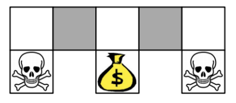
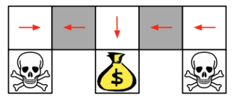
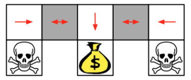
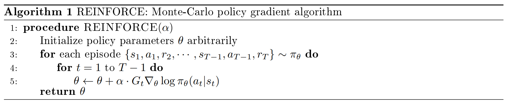
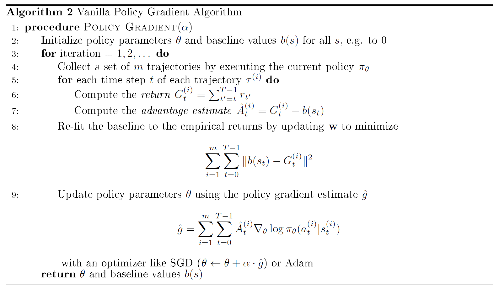

# Lecture 8&9 Policy Gradient

# 课时8&9 策略梯度 2019.02.04 & 2019.02.06

## 1. 策略搜索介绍（Introduction to Policy Search）

到目前为止，为学习策略，我们主要研究了基于值的（value-based）方法，在这类方法中，我们以参数 $\theta$ 的函数来近似最优状态值函数或状态-行为值函数：
$$
V_{\theta}(s)\approx V^{\pi}(s)，
$$

$$
Q_{\theta}(s,a)\approx Q^{\pi}(s,a)，
$$
然后通过 $V_{\theta}$ 或 $Q_{\theta}$ 得到策略，即 $\epsilon$-贪婪策略。我们也可以使用基于策略的（policy-based）方法来直接将策略参数化：
$$
\pi_{\theta}(a|s)=\mathbb{P}[a|s;\theta]。
$$

在这种设定中，我们的目标是根据最大的值函数 $V^{\pi}$ 来直接找到策略，而不是先找到基于最优策略的值函数，再从中得到策略。我们将考虑参数化的随机策略，而不是那种从状态到动作的查表式策略。找到一个好的策略需要以下两点：

$\bullet$ 好的策略参数化形式：我们的函数近似和状态/动作表达形式必须是充分的；

$\bullet$ 有效的搜索：我们必须能够为我们的策略函数近似找到好的参数。

基于策略的 RL 相比基于值的 RL 而言有一些优点：

$\bullet$ 更好的收敛性（见 Sutton and Barto 的第 13.3 章）；

$\bullet$ 高维或连续动作空间下的有效性，比如机器人，第 6.2 节介绍了处理连续动作空间的一种方法；

$\bullet$ 学习随机策略的能力（见后面部分）。

基于策略的 RL 方法的缺点是：

$\bullet$ 由于依赖于梯度下降，它们通常收敛于局部最优策略，而不是全局最优策略；

$\bullet$ 评估一个策略通常是数据效率低下或方差很大的。

## 2. 随机策略（Stochastic Policies）

本节我们将简要介绍两种环境，这两种环境中，随机策略优于任何的确定性策略。

### 2.1 石头-剪刀-布（Rock-paper-scissors）

作为一个相关的例子，在流行的剪刀-石头-布（和为零）游戏中，任何非均匀随机的策略：
$$
P(\text{rock}|s)=1/3
$$

$$
P(\text{scissors}|s)=1/3
$$

$$
P(\text{paper}|s)=1/3
$$
都可被利用。

### 2.2 网格世界（Aliased Gridworld）

图 1：在这个部分可观测的网格环境中，行为体无法区分灰色状态。

在图 1 的网格世界环境中，假设行为体可以向四个基本的方向移动，即动作空间为 $A={N,S,E,W}$。假设它只能感知当前位置周围的墙，具体而言，它观察每个方向的以下形式的特征：
$$
\phi(s)=\begin{bmatrix} \mathbf{1}(\text{wall to N}) \\ \cdots \\ \mathbf{1}(\text{wall to W}) \\ \end{bmatrix}。
$$

注意，它的观测结果并不能完全代表环境，因为它不能区分两个灰色的方块，这也意味着它的域不是马尔可夫的。因此，确定性策略必须要么学会在灰色方块中一直向左走，要么一直向右走。由于行为体可能陷在环境中的某个角落，所以这两种策略都不是最优的：

图 2：对于这个确定性策略，行为体无法“逃离”左上的两个状态。

而随机策略则可以学习在灰色的状态下随机选择一个方向，从而保证对于任何起始位置，它最终都能获得奖励。一般来说，随机策略有助于克服对抗或非平稳域（adversarial or non-stationary domain）以及状态表示为非马尔可夫的情况。

图 3：在灰色状态下以等概率采取动作 $E$ 或 $W$ 的随即策略将在几个时间步内以高概率到达目标处。

# 3. 策略优化（Policy Optimization）

## 3.1 策略目标函数（Policy Objective Function）

定义了一个策略 $\pi_{theta}(a|s)$ 后，我们需要能够衡量它的表现，以便优化它。在片段式环境（episodic environment）中，一种度量量是策略的起始价值（start value of the policy），即起始状态的期望价值：
$$
J_1(\theta)=V^{\pi_{\theta}}(s_1)=\mathbb{E}_ {\pi_{\theta}}[v_1]。
$$

在连续环境中，我们可以使用策略的平均价值（average value of the policy）作为度量量，这里 $d^{\pi_{\theta}}(s)$ 为 $\pi_{\theta}$ 的稳态分布（stationary distribution）：
$$
J_{avV}(\theta)=\sum_s d^{\pi_{\theta}}(s)V^{\pi_{\theta}}(s)，
$$
也可以使用每时间步的平均奖励（average value per time-step）：
$$
J_{avR}(\theta)=\sum_s d^{\pi_{\theta}}(s) \sum_a \pi_{\theta}(a|s)R(s,a)。
$$

本课程中，我们讨论片段式的情况，但我们得到的所有结果都可以很容易地被推广到非片段式的情况。我们还将关注衰减因子 $\gamma=1$ 的情况，同样地，结果也可以很容易地被推广到一般的 $\gamma$。

## 3.2 优化方法（Optimization Methods）

利用目标函数，我们可以将基于策略的强化学习问题转化为优化问题。本课程中，我们关注梯度下降，因为最近这是基于策略的强化学习方法的最常用的优化方法。但一些无梯度优化方法（gradient-free optimization methods）也值得考虑，包括：

$\bullet$ 爬山（Hill climbing）

$\bullet$ 单纯形法 / amoeba / Nelder Mead（Simplex / amoeba / Nelder Mead）

$\bullet$ 遗传算法（Genetic algorithms）

$\bullet$ 交叉熵方法（Cross-entropy methods, CEM）

$\bullet$ 协方差矩阵自适应（Covariance matrix adaption, CMA）

$\bullet$ 进化策略（Evolution strategies）

与基于梯度的方法相比，这些方法的优点是不需要计算目标函数的梯度，这就允许了参数化策略可以是不可导的，而且通常也很容易并行化这些方法。无梯度方法通常是个有用的基线，有时候这些方法的表现出奇的好 [[1]](#ref1)。然而，由于这些方法忽略了奖励的时间结构，即更新只考虑整个片段的总奖励，而不会将奖励分解为轨迹中的每个状态的奖励，因此它们通常不是数据高效的（见 4.3 节）。

# 4. 策略梯度（Policy Gradient）

定义 $V(\theta)$ 为我们希望基于 $\theta$ 最大化的目标函数。策略梯度的方法通过提升策略的梯度来搜索基于 $\theta$ 的 $V(\theta)$ 的局部最大值：

$$
\Delta\theta=\alpha\nabla_{\theta}V(\theta)，
$$

这里 $\alpha$ 为步长，$\nabla_{\theta}V(\theta)$ 为策略梯度：

$$
\nabla_{\theta}V(\theta)=\begin{pmatrix} \frac{\partial V(\theta)}{\partial \theta_1} \\ \cdots \\ \frac{\partial V(\theta)}{\partial \theta_n} \\ \end{pmatrix}。
$$

## 4.1 梯度计算（Computing the Gradient）

根据以上这些设定，我们需要做的事仅剩下计算目标函数 $V(\theta)$ 的梯度，然后我们就可以将其优化。微积分的有限差分法（finite difference）提供了梯度的近似：

$$
\frac{\partial V(\theta)}{\partial \theta_k} \approx \frac{V(\theta + \epsilon u_k)-V(\theta)}{\epsilon}，
$$

这里 $u_k$ 为第 $k$ 个元素为 $1$，其余元素为 $0$ 的单位向量。这个方法使用 $n$ 个评价来计算 $n$ 维的策略梯度，因此效率很低，而且通常仅提供真实策略梯度的有噪声的近似。然而，它的优点是适用于不可导的策略。[[2]](#ref2) 成功使用了该方法去训练 AIBO 机器人步态。

### 4.1.1 解析梯度（Analytic Gradients）

令目标函数 $V(\theta)$ 为一个片段的期望奖励：

$$
V(\theta)=\mathbb{E}_ {(s_t,a_t)\sim \pi_{\theta}}[\sum_{t=0}^{T}R(s_t,a_t)]=\mathbb{E}_ {\tau \sim \pi_{\theta}}[R(\tau)]=\sum_{\tau}P(\tau;\theta)R(\tau)，
$$

这里 $\tau$ 为轨迹：

$$
\tau=(s_0,a_0,r_0,...,s_{T-1},a_{T-1},r_{T-1},s_T)，
$$

$P(\tau;\theta)$ 为遵循策略 $\pi_{\theta}$ 时轨迹的概率，$R(\tau)$ 为一个轨迹的奖励和。注意这个目标函数与 3.1 节中提到的起始价值（start value）$J_1(\theta)$ 一样（$\gamma=1$ 时）。

如果我们可以用数学方法计算策略梯度 $\nabla_{\theta}\pi_{\theta}(a|s)$，那么我们就可以直接计算这个目标函数相对于 $\theta$ 的梯度：

$$
\nabla_{\theta}V(\theta)=\nabla_{\theta} \sum_{\tau}P(\tau;\theta)R(\tau)
\tag{1}
$$

$$
=\sum_{\tau}\nabla_{\theta}P(\tau;\theta)R(\tau)
\tag{2}
$$

$$
=\sum_{\tau}\frac{P(\tau;\theta)}{P(\tau;\theta)}\nabla_{\theta}P(\tau;\theta)R(\tau)
\tag{3}
$$

$$
=\sum_{\tau}P(\tau;\theta)R(\tau) \frac{\nabla_{\theta}P(\tau;\theta)}{P(\tau;\theta)}
\tag{4}
$$

$$
=\sum_{\tau}P(\tau;\theta)R(\tau) \nabla_{\theta}\log P(\tau;\theta)
\tag{5}
$$

$$
=\mathbb{E}_ {\tau \sim \pi_{\theta}}[R(\tau)\nabla_{\theta} \log P(\tau;\theta)]。
\tag{6}
$$

式（[4](#eq4)）中的 $\frac{\nabla_{\theta}P(\tau;\theta)}{P(\tau;\theta)}$ 也也被称为似然比（likelihood ratio）。

式（[3](#eq3)）~（6）中的技巧有以下两点好处：首先，这些技巧帮助我们将梯度转化为 $\mathbb{E}_ {\tau \sim \pi_{\theta}}[...]$ 的形式，这使得我们可以通过采样轨迹 $\tau^{(i)}$ 来近似梯度：

$$
\nabla_{\theta}V(\theta) \approx \hat{g} = \frac{1}{m}\sum_{i=1}^{m}R(\tau^{(i)})\nabla_{\theta}\log P(\tau^{(i)};\theta)；
\tag{7}
$$

其次，计算 $\nabla_{\theta}\log P(\tau^{(i)};\theta)$ 比直接计算 $P(\tau^{(i)};\theta)$ 容易：

$$
\nabla_{\theta}\log P(\tau^{(i)};\theta) = \nabla_{\theta}\log [\underbrace{\mu(s_0)}_ {\text{initial state distribution}} \prod_{t=0}^{T-1} \underbrace{\pi_{\theta}(a_t|s-t)}_ {\text{policy}} \underbrace{P(s_{t+1}|s_t,a_t)}_{\text{dynamics model}}]
\tag{8}
$$

$$
= \nabla_{\theta} [\log \mu(s_0) + \sum_{t=0}^{T-1}\log \pi_{\theta}(a_t|s_t) + \log P(s_{t+1}|s_t,a_t)]
\tag{9}
$$

$$
= \sum_{t=0}^{T-1} \underbrace{\nabla_{\theta}\log \pi_{\theta}(a_t|s_t)}_{\text{no dynamics model required!}}。
\tag{10}
$$

处理 $\log P(\tau^{(i)};\theta)$ 而不是 $P(\tau^{(i)};\theta)$ 使得我们可以在不参考初始状态，甚至不参考环境动态模型的情况下表示梯度！

将式（[7](#eq7)）和式（[10](#eq10)）结合，我们得到：

$$
\nabla_{\theta}V(\theta) \approx \hat{g} = \frac{1}{m}\sum_{i=1}^{m}R(\tau^{(i)}) \sum_{t=0}^{T-1}\nabla_{\theta}\log \pi_{\theta}(a_t^{(i)}|s_t^{(i)})，
$$

我们可以将其转化为优化 $\pi_{\theta}$ 的具体算法（第 5 部分）。在这之前，我们要提及这个结果的广义版本，并讨论利用将 $R(\tau^(i))$ 分解为奖励项 $r_t^{(i)}$ 之和来优化上述推导（4.3 节）。

## 4.2 策略梯度定理（The Policy Gradient Theorem）

**定理 4.1** 对于所有的可导策略 $\pi_{\theta}(a|s)$ 和所有的策略目标函数 $V(\theta)=J_1$，$J_{avR}$ 或 $\frac{1}{1-\gamma}J_{avV}$，策略梯度为：

$$
\nabla_{\theta}V(\theta)=\mathbb{E}_ {\pi_{\theta}}[Q^{\pi_{\theta}}(s,a)\nabla_{\theta}\log \pi_{\theta}(a|s)]。
$$

我们不详细讨论这个更一般的定理的推导，但本课程中讨论的相同的概念同样适用于非片段式（连续）的环境。到目前为止，我们用片段的总奖励 $R(\tau)$ 代替了这个定理中的 Q 值，但在后面的内容中，我们将使用时间结构来把我们的结果转化为更像这个定理的形式，其中未来的回报 $G_t$（即 $Q(s,a)$ 的无偏估计）将取代 $Q^{\pi_{\theta}}(s,a)$。

## 4.3 用奖励的时间形式求策略梯度（Using Temporal Structure of Rewards for the Policy Gradient）

式（[6](#eq6)）可被表示为：

$$
\nabla_{\theta}V(\theta) = \nabla_{\theta} \mathbb{E}_ {\tau \sim \pi_{\theta}}[R(\tau)] = \mathbb{E}_ {\tau \sim \pi_{\theta}}[R(\tau)\sum_{t=0}^{T-1}\nabla_{\theta}\log \pi_{\theta}(a_t|s_t)]。
\tag{11}
$$

注意，这里奖励 $R(\tau^{(i)}$ 为整个轨迹 $\tau^{(i)}$ 的函数，我们可以将其拆分为轨迹中得到的所有奖励的和：

$$
R(\tau) = \sum_{t=1}^{T-1}R(s_t,a_t)。
$$

这样，我们可以用推导式（[11](#eq11)）的同样的方法来推导单个奖励 $r_{t'}$ 的梯度估计：

$$
\nabla_{\theta} \mathbb{E}_ {\pi_{\theta}}[r_{t'}] = \mathbb{E}_ {\pi_{\theta}}[r_{t'}\sum_{t=0}^{t'} \nabla_{\theta} \log \pi_{\theta}(a_t|s_t)]。
$$

由于 $\sum_{t'=t}^{T-1}r_{t'}^{(i)}$ 就是回报 $G_t^{(i)}$，我们可以将其随时间步累加，从而得到：

$$
\nabla_{\theta} V(\theta) = \nabla_{\theta} \mathbb{E}_ {\tau \sim \pi_{\theta}}[R(\tau)] = \mathbb{E}_ {\pi_{\theta}}[\sum_{t'=0}^{T-1}r_{t'}\sum_{t=0}^{t'} \nabla_{\theta} \log \pi_{\theta}(a_t|s_t)]
\tag{12}
$$

$$
= \mathbb{E}_ {\pi_{\theta}}[\sum_{t=0}^{T-1} \nabla_{\theta} \log \pi_{\theta}(a_t|s_t) \sum_{t'=t}^{T-1}r_{t'}]
\tag{13}
$$

$$
= \mathbb{E}_ {\pi_{\theta}}[\sum_{t=0}^{T-1} G_t \nabla_{\theta} \log \pi_{\theta}(a_t|s_t)]。
\tag{14}
$$

由于从式（[12](#eq12)）到式（[13](#eq13)）可能并不显而易见，所以我们来举个简单的例子。假设有一个包括三个时间步的轨迹，那么式（[12](#eq12)）就变成了：

$$
\nabla_{\theta} V(\theta) = \mathbb{E}_ {\pi_{\theta}}[r_0 \nabla_{\theta} \log\pi_{\theta}(a_0|s_0) +
$$

$$
r_1(\nabla_{\theta} \log\pi_{\theta}(a_0|s_0) + \nabla_{\theta} \log\pi_{\theta}(a_1|s_1)) +
$$

$$
r_2(\nabla_{\theta} \log\pi_{\theta}(a_0|s_0) + \nabla_{\theta} \log\pi_{\theta}(a_1|s_1) + \nabla_{\theta} \log\pi_{\theta}(a_2|s_2))]。
$$

重新组合这些项，我们可以得到：

$$
\nabla_{\theta} V(\theta) = \mathbb{E}_ {\pi_{\theta}}[\nabla_{\theta} \log\pi_{\theta}(a_0|s_0) (r_0+r_1+r_2) +
$$

$$
\nabla_{\theta} \log\pi_{\theta}(a_1|s_1) (r_1+r_2) +
$$

$$
\nabla_{\theta} \log\pi_{\theta}(a_2|s_2) (r_2)]，
$$

也就是说，式（[13](#eq13)）成立。其主要思想是，策略在特定时间步 $t$ 的选择仅影响在这个片段中的后续时间步获得的奖励，而不会影响先前时间步获得的奖励。式（[11](#eq11)）中的原始表达式并没有考虑这一点。

我们将要在下一节的策略梯度算法中使用的表达式为：

$$
\nabla_{\theta} V(\theta) = \nabla_{\theta} \mathbb{E}_ {\tau \sim \pi_{\theta}}[R(\tau)] \approx \frac{1}{m}\sum_{i=1}^{m}\sum_{t=0}^{T-1}G_t^{(i)} \nabla_{\theta} \log \pi_{\theta}(a_t^{(i)}|s_t^{(i)})。
\tag{15}
$$

# 5. REINFORCE：一个蒙特卡洛策略梯度算法（REINFORCE: A Monte Carlo Policy Gradient Algorithm）

在前面的部分中，我们已经完成了第一个策略梯度算法的大部分工作，该算法对遵循策略 $\pi_{\theta}$ 的多个轨迹采样，同时根据式（[15](#eq15)）的梯度估计更新 $\theta$。

# 6. 可导策略类（Differentiable Policy Classes)

## 6.1 离散动作空间：软最大值策略（Discrete Action Space: Softmax Policy）

离散动作空间中，我们通常用软最大值函数（softmax function）来参数化策略：

$$
\pi_{\theta}(a|s)=\frac{e^{\phi(s,a)^{\text{T}}\theta}}{\sum_{a'} e^{\phi(s,a')^{\text{T}}\theta}}。
$$

则评价函数变为：

$$
\nabla_{\theta} \log \pi_{\theta}(a|s) = \nabla_{\theta} [\phi(s,a)^{\text{T}}\theta - \log \sum_{a'}e^{\phi(s,a')^{\text{T}}\theta}]
$$

$$
= \phi(s,a) - \frac{1}{\sum_{a'}e^{\phi(s,a')^{\text{T}}\theta}} \nabla_{\theta} \sum_{a'}e^{\phi(s,a')^{\text{T}}\theta}
$$

$$
= \phi(s,a) - \frac{1}{\sum_{a'}e^{\phi(s,a')^{\text{T}}\theta}} \sum_{a'} \phi(s,a')e^{\phi(s,a')^{\text{T}}\theta}
$$

$$
= \phi(s,a) - \sum_{a'} \phi(s,a') \frac{e^{\phi(s,a')^{\text{T}}\theta}}{\sum_{a''}e^{\phi(s,a'')^{\text{T}}\theta}}
$$

$$
= \phi(s,a) - \sum_{a'} \phi(s,a') \pi_{\theta}(a'|s)
$$

$$
= \phi(s,a) - \mathbb{E}_ {a'\sim\pi_{\theta}(a'|s)}[\phi(s,a')]
$$

## 6.2 连续动作空间：高斯策略（Continuous Action Space: Gaussian Policy）

对于连续动作空间，一个常用的选择是高斯策略：$a \sim \cal{N} (\mu(s),\sigma^2)$。

$\bullet$ 动作的平均值为状态特征的线性组合：$\mu(s)=\phi(s)^{\text{T}}\theta$；

$\bullet$ 方差 $\sigma^2$ 可以是固定的，也可以是参数化的。

评价函数为：

$$
\nabla_{\theta} \log \pi_{\theta}(a|s) = \frac{(a-\mu(s))\phi(s)}{\sigma^2}。
$$

# 7. 根据基准减小方差（Variance Reduction with a Baseline）

蒙特卡洛策略梯度算法的一个缺点是多个片段的回报 $G_t^{(i)}$ 的方差通常很大。解决这个问题的一种方法是从每个 $G_t^{(i)}$ 减去一个基准（baseline）$b(s)$，这个基准可以是任何函数，只要它不随 $a$ 的变化而变化。

$$
\nabla_{\theta} V(\theta) = \nabla_{\theta} \mathbb{E}_ {\tau \sim \pi_{\theta}}[R(\tau)] = \mathbb{E}_ {\pi_{\theta}}[\sum_{t=0}^{T-1}(G_t-b(s_t))\nabla_{\theta}\log\pi_{\theta}(a_t|s_t)]。
$$

首先，为什么我们要这样做？直观地说，我们可以认为 $(G_t-b(s_t))$ 是对时间步 $t$ 之后我们做得比预期的基准 $b(s_t)$ 要好多少的估计。所以，如果基准近似等于期望回报 $b(s_t)\approx \mathbb{E}[r_t+r_{t+1}+...+r_{T-1}]$，那么我们将按照回报 $G_t$ 比期望好多少，成比例地增大动作 $a_t$ 的对数概率（log-probability）。过去，我们按照 $G_t$ 的大小，成比例地增大对数概率，所以即使策略总是能达到期望回报，我们仍会采用梯度更新，这可能导致其发散。$(G_t-b(s_t))$ 通常被称为优势（advantage），$A_t$。我们可以根据一个采样的轨迹 $\tau^{(i)}$ 来估计真实的优势：

$$
\hat{A}_t=(G_t^{(i)}-b(s_t))。
$$

第二，为什么我们可以这样做？结果表明，用这种方式减去一个基准并不会在梯度计算中引入任何偏差。$\mathbb{E}_ {\tau}[b(s_t)\nabla_{\theta}\log \pi_{\theta}(a_t|s_t)]$ 为 $0$，因此不会影响梯度更新。

$$
\mathbb{E}_ {\tau\sim\pi_{\theta}}[b(s_t)\nabla_{\theta}\log \pi_{\theta}(a_t|s_t)]
$$

$$
= \mathbb{E}_ {s_{0:t},a_{0:(t-1)}}[\mathbb{E}_ {s_{(t+1):T},a_{t:(T-1)}}[\nabla_{\theta} \log \pi_{\theta}(a_t|s_t)b(s_t)]] \quad \text{（将期望拆开）}
$$

$$
= \mathbb{E}_ {s_{0:t},a_{0:(t-1)}}[b(s_t)\mathbb{E}_ {s_{(t+1):T},a_{t:(T-1)}}[\nabla_{\theta} \log \pi_{\theta}(a_t|s_t)]] \quad \text{（提出基准项）}
$$

$$
= \mathbb{E}_ {s_{0:t},a_{0:(t-1)}}[b(s_t)\mathbb{E}_ {a_t}[\nabla_{\theta} \log \pi_{\theta}(a_t|s_t)]] \quad \text{（移除无关变量）}
$$

$$
= \mathbb{E}_ {s_{0:t},a_{0:(t-1)}}[b(s_t) \sum_{a_t} \pi_{\theta}(a_t|s_t)\frac{\nabla_{\theta}\pi_{\theta}(a_t|s_t)}{\pi_{\theta}(a_t|s_t)}] \quad \text{（将期望展开 + 对数函数求导）}
$$

$$
= \mathbb{E}_ {s_{0:t},a_{0:(t-1)}}[b(s_t) \sum_{a_t} \nabla_{\theta}\pi_{\theta}(a_t|s_t)]
$$

$$
= \mathbb{E}_ {s_{0:t},a_{0:(t-1)}}[b(s_t) \nabla_{\theta} \sum_{a_t} \pi_{\theta}(a_t|s_t)]
$$

$$
= \mathbb{E}_ {s_{0:t},a_{0:(t-1)}}[b(s_t) \nabla_{\theta} 1]
$$

$$
= \mathbb{E}_ {s_{0:t},a_{0:(t-1)}}[b(s_t) \cdot 0]
$$

$$
= 0。
$$

## 7.1 普通策略梯度（Vanilla Policy Gradient）

使用前面讨论的基准，这里我们介绍普通策略梯度（vanilla policy gradient）算法。假设基准函数的参数为 $\mathbf{w}$。

状态值函数是基准的一个很自然的选择，$b(s_t)=V(s_t)$，这时优势函数为 $A^{\pi}(s,a)=Q^{\pi}(s,a)-V^{\pi}(s)$。然而，由于我们不知道真实的状态值，因此我们使用估计值 $\hat{V}(s_t;\mathbf{w})$ 来代替，这里 $\mathbf{w}$ 为权重向量。我们可以通过蒙特卡洛轨迹采样来同时学习基准函数（状态值函数）的权重向量 $\mathbf{w}$ 和策略的参数 $\theta$。

注意，在算法 2 中，我们通常并不单独计算梯度 $\sum_t \hat{A}_ t \nabla_{\theta} \log \pi_{\theta}(a_t|s_t)$，而是将一个批的数据累积到损失函数中：

$$
L(\theta)=\sum_t \hat{A}_ t \log \pi_{\theta}(a_t|s_t)，
$$

然后通过计算 $\nabla_{\theta} L(\theta)$ 来计算梯度。我们也可以在这个损失函数中引入一个分量来拟合基准函数：

$$
L(\theta,\mathbf{w})=\sum_t (\hat{A}_ t \log \pi_{\theta}(a_t|s_t) - \parallel b(s_t)-G_t^{(i)} \parallel ^2)，
$$

然后我们可以计算 $L(\theta,\mathbf{w})$ 关于 $\theta$ 和 $\mathbf{w}$ 的梯度来执行 SGD 更新。

## 7.2 N 步估计（N-step Estimators）

在上面的推导中，为近似策略梯度，我们使用了奖励的蒙特卡洛估计。然而，如果我们能知道值函数（例如基准），那么我们也可以 TD 方法、或 TD 与 MC 的混合方法来进行策略梯度更新：

$$
\hat{G}_{t}^{(1)} = r_t + \gamma V(s_{t+1})
$$

$$
\hat{G}_{t}^{(2)} = r_t + \gamma r_{t+1} + \gamma^2 V(s_{t+2})
$$

$$
...
$$

$$
\hat{G}_t^{(\text{inf})} = r_t + \gamma r_{t+1} + \gamma^2 r_{t+2} + ...，
$$

我们也可以用这些方法来计算优势函数：

$$
\hat{A}_t^{(1)} = r_t + \gamma V(s_{t+1}) - V(s_t)
$$

$$
\hat{A}_t^{(2)} = r_t + \gamma r_{t+1} + \gamma^2 V(s_{t+2}) - V(s_t)
$$

$$
...
$$

$$
\hat{A}_t^{(\text{inf})} = r_t + \gamma r_{t+1} + \gamma^2 r_{t+2} - V(s_t)，
$$

这里 $\hat{A}_t^{(1)}$ 是纯的 TD 估计，具有低方差、高偏移的特点，$\hat{A}_t^{(\text{inf})}$ 是纯的 MC 估计，具有零偏移、高方差的特点。如果我们选择一个中间值 $\hat{A}_t^{(k)}$，那么这个中间值的方差和偏移都是中间量。

## 参考文献

1. https://blog.openai.com/evolution-strategies/.

2. N. Kohl, and P. Stone, "Policy gradient reinforcement learning for fast quadrupedal locomotion," *Proceedings of the IEEE International Conference on Robotics and Automation*, 2004.