# 高级卷积神经网络

在本章中，我们将讨论如何将**卷积神经网络**（**CNN**）用于除图像以外的领域中的深度学习。 我们的注意力将首先集中在文本分析和**自然语言处理**（**NLP**）上。 在本章中，我们将介绍一些用于以下方面的方法：

*   创建 ConvNet 进行情感分析
*   检查 VGG 预制网络了解了哪些过滤器
*   使用 VGGNet，ResNet，Inception 和 Xception 对图像进行分类
*   回收预先构建的深度学习模型以提取特征
*   非常深的 Inception-v3 网络用于转移学习
*   使用膨胀的 ConvNets，WaveNet 和 NSynth 生成音乐
*   回答有关图像的问题（可视化问答）
*   通过六种不同方式对视频进行预训练网络分类

# 介绍

在上一章中，我们了解了如何将 ConvNets 应用于图像。 在本章中，我们将类似的思想应用于文本。

文字和图像有什么共同点？ 乍一看，很少。 但是，如果我们将句子或文档表示为矩阵，则此矩阵与每个单元都是像素的图像矩阵没有区别。 因此，下一个问题是，我们如何将文本表示为矩阵？ 好吧，这很简单：矩阵的每一行都是一个向量，代表文本的基本单位。 当然，现在我们需要定义什么是基本单位。 一个简单的选择就是说基本单位是一个字符。 另一个选择是说基本单位是一个单词，另一个选择是将相似的单词聚合在一起，然后用代表符号表示每个聚合（有时称为簇或嵌入）。

Note that regardless of the specific choice adopted for our basic units, we need to have a 1:1 map from basic units into integer IDs so that a text can be seen as a matrix. For instance, if we have a document with 10 lines of text and each line is a 100-dimensional embedding, then we will represent our text with a matrix 10 x 100\. In this very particular *image*, a *pixel* is turned on if that sentence x contains the embedding represented by position y. You might also notice that a text is not really a matrix but more a vector because two words located in adjacent rows of text have very little in common. Indeed, there is a major difference with images where two pixels located in adjacent columns most likely have some correlation.

现在您可能会想：我知道您将文本表示为矢量，但是这样做会使我们失去单词的位置，而这个位置应该很重要，不是吗？

好吧，事实证明，在许多实际应用中，知道一个句子是否包含特定的基本单位（一个字符，一个单词或一个合计）是非常准确的信息，即使我们不记住句子中的确切位置也是如此。 基本单元位于。

# 创建用于情感分析的 ConvNet

在本食谱中，我们将使用 TFLearn 创建基于 CNN 的情感分析深度学习网络。 如上一节所述，我们的 CNN 将是一维的。 我们将使用 IMDb 数据集，用于训练的 45,000 个高度受欢迎的电影评论和用于测试的 5,000 个集合。

# 做好准备

TFLearn 具有用于自动从网络下载数据集并促进 ConvNet 创建的库，因此让我们直接看一下代码。

# 怎么做...

我们按以下步骤进行：

1.  导入 TensorFlow `tflearn`和构建网络所需的模块。 然后，导入 IMDb 库并执行一键编码和填充：

```py
import tensorflow as tf
import tflearn
from tflearn.layers.core import input_data, dropout, fully_connected
from tflearn.layers.conv import conv_1d, global_max_pool
from tflearn.layers.merge_ops import merge
from tflearn.layers.estimator import regression
from tflearn.data_utils import to_categorical, pad_sequences
from tflearn.datasets import imdb
```

2.  加载数据集，将句子填充到最大长度为 0 的位置，并对标签执行两个编码，分别对应于真值和假值的两个值。 注意，参数`n_words`是要保留在词汇表中的单词数。 所有多余的单词都设置为未知。 另外，请注意 trainX 和 trainY 是稀疏向量，因为每个评论很可能包含整个单词集的子集：

```py
# IMDb Dataset loading
train, test, _ = imdb.load_data(path='imdb.pkl', n_words=10000,
valid_portion=0.1)
trainX, trainY = train
testX, testY = test
#pad the sequence
trainX = pad_sequences(trainX, maxlen=100, value=0.)
testX = pad_sequences(testX, maxlen=100, value=0.)
#one-hot encoding
trainY = to_categorical(trainY, nb_classes=2)
testY = to_categorical(testY, nb_classes=2)
```

3.  打印一些维度以检查刚刚处理的数据并了解问题的维度是什么：

```py
print ("size trainX", trainX.size)
print ("size testX", testX.size)
print ("size testY:", testY.size)
print ("size trainY", trainY.size)
size trainX 2250000
 size testX 250000
 size testY: 5000
 site trainY 45000
```

4.  为数据集中包含的文本构建嵌入。 就目前而言，将此步骤视为一个黑盒子，该黑盒子接受这些单词并将它们映射到聚合（群集）中，以便相似的单词可能出现在同一群集中。 请注意，先前步骤的词汇是离散且稀疏的。 通过嵌入，我们将创建一个地图，该地图会将每个单词嵌入到连续的密集向量空间中。 使用此向量空间表示将为我们提供词汇表的连续，分布式表示。 当我们谈论 RNN 时，将详细讨论如何构建嵌入：

```py
# Build an embedding
network = input_data(shape=[None, 100], name='input')
network = tflearn.embedding(network, input_dim=10000, output_dim=128)
```

5.  建立一个合适的`convnet`。 我们有三个卷积层。 由于我们正在处理文本，因此我们将使用一维 ConvNet，并且各层将并行运行。 每层采用大小为 128 的张量（嵌入的输出），并应用有效填充，激活函数 ReLU 和 L2 `regularizer`的多个滤波器（分别为 3、4、5）。 然后，将每个层的输出与合并操作连接在一起。 此后，添加一个最大池层，然后以 50% 的概率进行删除。 最后一层是具有 softmax 激活的完全连接层：

```py
#Build the convnet
branch1 = conv_1d(network, 128, 3, padding='valid', activation='relu', regularizer="L2")
branch2 = conv_1d(network, 128, 4, padding='valid', activation='relu', regularizer="L2")
branch3 = conv_1d(network, 128, 5, padding='valid', activation='relu', regularizer="L2")
network = merge([branch1, branch2, branch3], mode='concat', axis=1)
network = tf.expand_dims(network, 2)
network = global_max_pool(network)
network = dropout(network, 0.5)
network = fully_connected(network, 2, activation='softmax')
```

6.  学习阶段意味着使用`categorical_crossentropy`作为损失函数的 Adam 优化器：

```py
network = regression(network, optimizer='adam', learning_rate=0.001,
loss='categorical_crossentropy', name='target')
```

7.  然后，我们使用 batch_size = 32 运行训练，并观察训练和验证集达到的准确性。 如您所见，在预测电影评论所表达的情感方面，我们能够获得 79% 的准确性：

```py
# Training
model = tflearn.DNN(network, tensorboard_verbose=0)
model.fit(trainX, trainY, n_epoch = 5, shuffle=True, validation_set=(testX, testY), show_metric=True, batch_size=32)
Training Step: 3519 | total loss: 0.09738 | time: 85.043s
 | Adam | epoch: 005 | loss: 0.09738 - acc: 0.9747 -- iter: 22496/22500
 Training Step: 3520 | total loss: 0.09733 | time: 86.652s
 | Adam | epoch: 005 | loss: 0.09733 - acc: 0.9741 | val_loss: 0.58740 - val_acc: 0.7944 -- iter: 22500/22500
 --
```

# 这个怎么运作...

[用于句子分类的卷积神经网络，Yoon Kim，EMNLP 2014](https://arxiv.org/abs/1408.5882)。 请注意，由于筛选器窗口对连续单词进行操作，因此本文提出的模型保留了一些有关位置的信息。 从论文中提取的以下图像以图形方式表示了网络之外的主要直觉。 最初，文本被表示为基于标准嵌入的向量，从而为我们提供了一维密集空间中的紧凑表示。 然后，使用多个标准一维卷积层处理矩阵。

Note that the model uses multiple filters (with varying window sizes) to obtain multiple features. After that, there is a max pool operation where the idea is to capture the most important feature-the one with the highest value for each feature map. For regularization, the article proposed to adopt a dropout on the penultimate layer with a constraint on L2-norms of the weight vectors. The final layer will output the sentiment as positive or negative.

为了更好地理解该模型，有以下几点观察：

*   过滤器通常在连续空间上卷积。 对于图像，此空间是像素矩阵表示形式，在高度和宽度上在空间上是连续的。 对于文本而言，连续空间无非是连续单词自然产生的连续尺寸。 如果仅使用单次编码表示的单词，则空间稀疏；如果使用嵌入，则由于聚集了相似的单词，因此生成的空间密集。
*   图像通常具有三个通道（RGB），而文本自然只有一个通道，因为我们无需表示颜色。

# 还有更多...

论文[《用于句子分类的卷积神经网络》](https://arxiv.org/abs/1408.5882)（Yoon Kim，EMNLP 2014）进行了广泛的实验。 尽管对超参数的调整很少，但具有一层卷积的简单 CNN 在句子分类方面的表现却非常出色。 该论文表明，采用一组静态嵌入（将在我们谈论 RNN 时进行讨论），并在其之上构建一个非常简单的 ConvNet，实际上可以显着提高情感分析的性能：

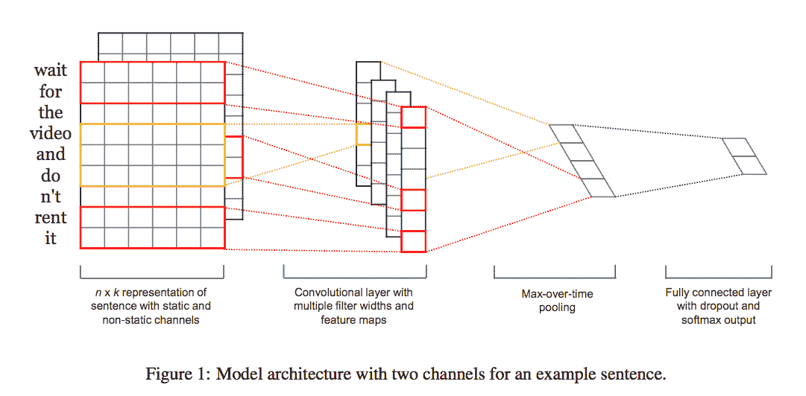

[如图所示的模型架构示例](https://arxiv.org/pdf/1408.5882.pdf)

使用 CNN 进行文本分析是一个活跃的研究领域。 我建议看看以下文章：

*   [《从头开始理解文本》](https://arxiv.org/abs/1502.01710)（张翔，Yann LeCun）。 本文演示了我们可以使用 CNN 将深度学习应用于从字符级输入到抽象文本概念的文本理解。 作者将 CNN 应用于各种大规模数据集，包括本体分类，情感分析和文本分类，并表明它们可以在不了解单词，词组，句子或任何其他句法或语义结构的情况下实现惊人的性能。 一种人类的语言。 这些模型适用于英文和中文。

# 检查 VGG 预制网络了解了哪些过滤器

在本食谱中，我们将使用 [keras-vis](https://raghakot.github.io/keras-vis/)，这是一个外部 Keras 软件包，用于直观检查预建的 VGG16 网络从中学到了什么不同的过滤器。 这个想法是选择一个特定的 ImageNet 类别，并了解 VGG16 网络如何学会代表它。

# 做好准备

第一步是选择用于在 ImageNet 上训练 VGG16 的特定类别。 假设我们采用类别 20，它对应于下图中显示的*美国北斗星*鸟：

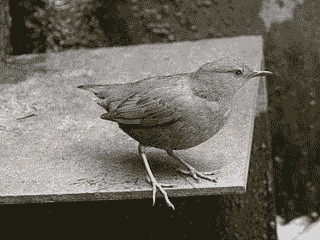

[美国北斗星的一个例子](https://commons.wikimedia.org/wiki/File:American_Dipper.jpg)

可以在网上找到 [ImageNet 映射](https://gist.github.com/yrevar/6135f1bd8dcf2e0cc683)作为 python 泡菜字典，其中 ImageNet 1000 类 ID 映射到了人类可读的标签。

# 怎么做...

我们按以下步骤进行：

1.  导入 matplotlib 和 keras-vis 使用的模块。 此外，还导入预构建的 VGG16 模块。 Keras 使处理此预建网络变得容易：

```py
from matplotlib import pyplot as plt
from vis.utils import utils
from vis.utils.vggnet import VGG16
from vis.visualization import visualize_class_activation
```

2.  通过使用 Keras 中包含的并经过 ImageNet 权重训练的预构建层来访问 VGG16 网络：

```py
# Build the VGG16 network with ImageNet weights
model = VGG16(weights='imagenet', include_top=True)
model.summary()
print('Model loaded.')
```

3.  这就是 VGG16 网络在内部的外观。 我们有许多 ConvNet，与 maxpool2D 交替使用。 然后，我们有一个 Flatten 层，然后是三个 Dense 层。 最后一个称为**预测**，并且这一层应该能够检测到高级特征，例如人脸或我们的鸟类形状。 请注意，顶层已明确包含在我们的网络中，因为我们想可视化它学到的知识：

```py
_________________________________________________________________
 Layer (type) Output Shape Param #
 =================================================================
 input_2 (InputLayer) (None, 224, 224, 3) 0
 _________________________________________________________________
 block1_conv1 (Conv2D) (None, 224, 224, 64) 1792
 _________________________________________________________________
 block1_conv2 (Conv2D) (None, 224, 224, 64) 36928
 _________________________________________________________________
 block1_pool (MaxPooling2D) (None, 112, 112, 64) 0
 _________________________________________________________________
 block2_conv1 (Conv2D) (None, 112, 112, 128) 73856
 _________________________________________________________________
 block2_conv2 (Conv2D) (None, 112, 112, 128) 147584
 _________________________________________________________________
 block2_pool (MaxPooling2D) (None, 56, 56, 128) 0
 _________________________________________________________________
 block3_conv1 (Conv2D) (None, 56, 56, 256) 295168
 _________________________________________________________________
 block3_conv2 (Conv2D) (None, 56, 56, 256) 590080
 _________________________________________________________________
 block3_conv3 (Conv2D) (None, 56, 56, 256) 590080
 _________________________________________________________________
 block3_pool (MaxPooling2D) (None, 28, 28, 256) 0
 _________________________________________________________________
 block4_conv1 (Conv2D) (None, 28, 28, 512) 1180160
 _________________________________________________________________
 block4_conv2 (Conv2D) (None, 28, 28, 512) 2359808
 _________________________________________________________________
 block4_conv3 (Conv2D) (None, 28, 28, 512) 2359808
 _________________________________________________________________
 block4_pool (MaxPooling2D) (None, 14, 14, 512) 0
 _________________________________________________________________
 block5_conv1 (Conv2D) (None, 14, 14, 512) 2359808
 _________________________________________________________________
 block5_conv2 (Conv2D) (None, 14, 14, 512) 2359808
 _________________________________________________________________
 block5_conv3 (Conv2D) (None, 14, 14, 512) 2359808
 _________________________________________________________________
 block5_pool (MaxPooling2D) (None, 7, 7, 512) 0
 _________________________________________________________________
 flatten (Flatten) (None, 25088) 0
 _________________________________________________________________
 fc1 (Dense) (None, 4096) 102764544
 _________________________________________________________________
 fc2 (Dense) (None, 4096) 16781312
 _________________________________________________________________
 predictions (Dense) (None, 1000) 4097000
 =================================================================
 Total params: 138,357,544
 Trainable params: 138,357,544
 Non-trainable params: 0
 _________________________________________________________________
 Model loaded.
```

从外观上看，网络可以如下图所示：


A VGG16 Network

4.  现在，让我们着重于通过关注 American Dipper（ID 20）来检查最后一个预测层的内部外观：

```py
layer_name = 'predictions'
layer_idx = [idx for idx, layer in enumerate(model.layers) if layer.name == layer_name][0]
# Generate three different images of the same output index.
vis_images = []
for idx in [20, 20, 20]:
img = visualize_class_activation(model, layer_idx, filter_indices=idx, max_iter=500)
img = utils.draw_text(img, str(idx))
vis_images.append(img)
```

5.  让我们在给定功能的情况下显示特定图层的生成图像，并观察网络如何在内部看到*美国北斗星*鸟的概念：

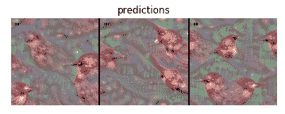

因此，这就是神经网络在内部代表鸟类的方式。 这是一种令人毛骨悚然的形象，但我发誓没有为网络本身提供任何特定种类的人造药物！ 这正是这种特殊的人工网络自然学到的东西。

6.  您是否仍然想了解更多？ 好吧，让我们选择一个较早的层，并代表网络如何在内部看到相同的`American Dipper`训练课程：

```py
layer_name = 'block3_conv1'
layer_idx = [idx for idx, layer in enumerate(model.layers) if layer.name == layer_name][0]
vis_images = []
for idx in [20, 20, 20]:
img = visualize_class_activation(model, layer_idx, filter_indices=idx, max_iter=500)
img = utils.draw_text(img, str(idx))
vis_images.append(img)
stitched = utils.stitch_images(vis_images)
plt.axis('off')
plt.imshow(stitched)
plt.title(layer_name)
plt.show()
```

以下是上述代码的输出：

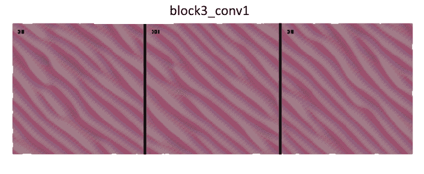

不出所料，该特定层正在学习非常基本的功能，例如曲线。 但是，ConvNets 的真正力量在于，随着我们对模型的深入研究，网络会推断出越来越复杂的功能。

# 这个怎么运作...

密集层的 keras-vis 可视化的关键思想是生成一个输入图像，该图像最大化与鸟类类相对应的最终密集层输出。 因此，实际上该模块的作用是解决问题。 给定具有权重的特定训练密集层，将生成一个新的合成图像，它最适合该层本身。

每个转换滤波器都使用类似的想法。 在这种情况下，请注意，由于 ConvNet 层在原始像素上运行，因此可以通过简单地可视化其权重来解释它。 后续的 conv 过滤器对先前的 conv 过滤器的输出进行操作，因此直接可视化它们不一定很有解释性。 但是，如果我们独立地考虑每一层，我们可以专注于仅生成可最大化滤波器输出的合成输入图像。

# 还有更多...

GitHub 上的 [keras-vis 存储库](https://github.com/raghakot/keras-vis)提供了一组很好的可视化示例，这些示例说明了如何内部检查网络，包括最近的显着性地图，其目的是在图像经常包含其他元素（例如草）时检测图像的哪个部分对特定类别（例如老虎）的训练贡献最大。 种子文章是[《深度卷积网络：可视化图像分类模型和显着性图》](https://arxiv.org/abs/1312.6034)（Karen Simonyan，Andrea Vedaldi，Andrew Zisserman），并在下面报告了从 Git 存储库中提取的示例，在该示例中，网络可以自行了解*定义为*老虎的图像中最突出的部分是：

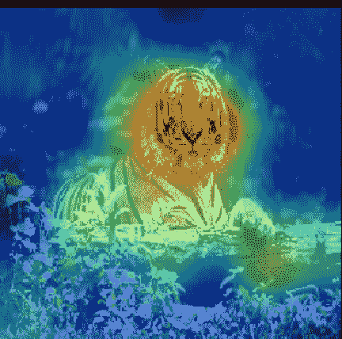

[显着性地图的示例](https://github.com/raghakot/keras-vis)

# 使用 VGGNet，ResNet，Inception 和 Xception 对图像进行分类

图像分类是典型的深度学习应用程序。 由于 [ImageNet](http://image-net.org/) 图像数据库，该任务的兴趣有了最初的增长。 它按照 [WordNet](http://wordnet.princeton.edu/) 层次结构（目前仅是名词）来组织，其中每个节点都由成百上千的图像描绘。 更准确地说，ImageNet 旨在将图像标记和分类为将近 22,000 个单独的对象类别。 在深度学习的背景下，ImageNet 通常指的是 [ImageNet 大规模视觉识别挑战](http://www.image-net.org/challenges/LSVRC/)，或简称 ILSVRC 中包含的工作。在这种情况下，目标是训练一个模型，该模型可以将输入图像分类为 1,000 个单独的对象类别。 在此配方中，我们将使用超过 120 万个训练图像，50,000 个验证图像和 100,000 个测试图像的预训练模型。

# VGG16 和 VGG19

在[《用于大型图像识别的超深度卷积网络》](https://arxiv.org/abs/1409.1556)（Karen Simonyan，Andrew Zisserman，2014 年）中，引入了 VGG16 和 VGG19。 该网络使用 3×3 卷积层堆叠并与最大池交替，两个 4096 个全连接层，然后是 softmax 分类器。 16 和 19 代表网络中权重层的数量（列 D 和 E）：

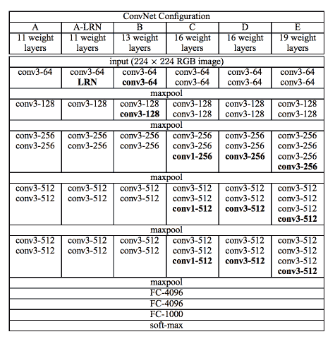

[一个非常深的网络配置示例](https://arxiv.org/pdf/1409.1556.pdf)

在 2015 年，拥有 16 或 19 层就足以考虑网络的深度，而今天（2017 年）我们达到了数百层。 请注意，VGG 网络的训练速度非常慢，并且由于末端的深度和完全连接的层数，它们需要较大的重量空间。

# ResNet

ResNet 已在[《用于图像识别的深度残差学习》](https://arxiv.org/abs/1512.03385)（何开明，张向宇，任少青，孙健，2015）中引入。 该网络非常深，可以使用称为残差模块的标准网络组件使用标准的随机下降梯度进行训练，然后使用该网络组件组成更复杂的网络（该网络在网络中称为子网络）。

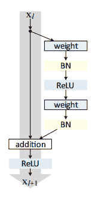

与 VGG 相比，ResNet 更深，但是模型的大小更小，因为使用了全局平均池化操作而不是全密层。

# 起始时间

在[《重新思考计算机视觉的初始架构》](https://arxiv.org/abs/1512.00567)（Christian Szegedy，Vincent Vanhoucke，Sergey Ioffe，Jonathon Shlens，Zbigniew Wojna，2015 年）中引入了 Inception 。关键思想是在同一模块中具有多种大小的卷积作为特征提取并计算 1×1、3×3 和 5×5 卷积。 这些滤波器的输出然后沿着通道尺寸堆叠，并发送到网络的下一层。 下图对此进行了描述：

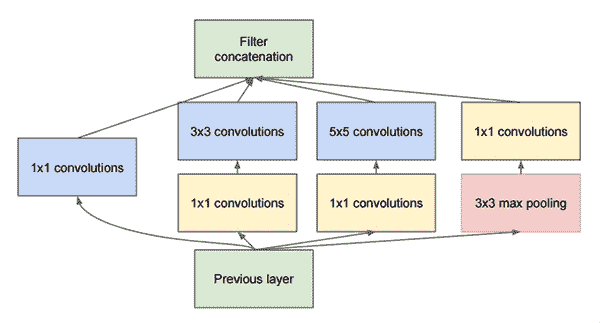

在“重新思考计算机视觉的 Inception 体系结构”中描述了 Inception-v3，而在[《Inception-v4，Inception-ResNet 和残余连接对学习的影响》](https://arxiv.org/abs/1602.07261)（Szegedy，Sergey Ioffe，Vincent Vanhoucke，Alex Alemi，2016 年）中描述了 Inception-v4。

# Xception

Xception 是 Inception 的扩展，在[《Xception：具有深度可分离卷积的深度学习》](https://arxiv.org/abs/1610.02357)（FrançoisChollet，2016 年）中引入。 Xception 使用一种称为深度可分离卷积运算的新概念，该概念使其在包含 3.5 亿张图像和 17,000 个类别的大型图像分类数据集上的表现优于 Inception-v3。 由于 Xception 体系结构具有与 Inception-v3 相同数量的参数，因此性能的提高并不是由于容量的增加，而是由于模型参数的更有效使用。

# 做好准备

此食谱使用 Keras，因为该框架已预先完成了上述模块的实现。 Keras 首次使用时会自动下载每个网络的权重，并将这些权重存储在本地磁盘上。 换句话说，您不需要重新训练网络，而是可以利用 Internet 上已经可用的训练。 在您希望将网络分类为 1000 个预定义类别的假设下，这是正确的。 在下一个食谱中，我们将了解如何从这 1,000 个类别开始，并通过称为转移学习的过程将它们扩展到自定义集合。

# 怎么做...

我们按以下步骤进行：

1.  导入处理和显示图像所需的预制模型和其他模块：

```py
from keras.applications import ResNet50
from keras.applications import InceptionV3
from keras.applications import Xception # TensorFlow ONLY
from keras.applications import VGG16
from keras.applications import VGG19
from keras.applications import imagenet_utils
from keras.applications.inception_v3 import preprocess_input
from keras.preprocessing.image import img_to_array
from keras.preprocessing.image import load_img
import numpy as np
import matplotlib.pyplot as plt
from matplotlib.pyplot import imshow
from PIL import Image
%matplotlib inline
```

2.  定义用于记忆用于训练网络的图像大小的地图。 这些是每个模型的众所周知的常数：

```py
MODELS = {
"vgg16": (VGG16, (224, 224)),
"vgg19": (VGG19, (224, 224)),
"inception": (InceptionV3, (299, 299)),
"xception": (Xception, (299, 299)), # TensorFlow ONLY
"resnet": (ResNet50, (224, 224))
}
```

3.  定义用于加载和转换每个图像的辅助功能。 注意，预训练网络已在张量上训练，该张量的形状还包括`batch_size`的附加维度。 因此，我们需要将此尺寸添加到图像中以实现兼容性：

```py
def image_load_and_convert(image_path, model):
pil_im = Image.open(image_path, 'r')
imshow(np.asarray(pil_im))
# initialize the input image shape
# and the pre-processing function (this might need to be changed
inputShape = MODELS[model][1]
preprocess = imagenet_utils.preprocess_input
image = load_img(image_path, target_size=inputShape)
image = img_to_array(image)
# the original networks have been trained on an additional
# dimension taking into account the batch size
# we need to add this dimension for consistency
# even if we have one image only
image = np.expand_dims(image, axis=0)
image = preprocess(image)
return image
```

4.  定义用于对图像进行分类的辅助函数，并在预测上循环，并显示 5 级预测以及概率：

```py
def classify_image(image_path, model):
img = image_load_and_convert(image_path, model)
Network = MODELS[model][0]
model = Network(weights="imagenet")
preds = model.predict(img)
P = imagenet_utils.decode_predictions(preds)
# loop over the predictions and display the rank-5 predictions
# along with probabilities
for (i, (imagenetID, label, prob)) in enumerate(P[0]):
print("{}. {}: {:.2f}%".format(i + 1, label, prob * 100))
```

5.然后开始测试不同类型的预训练网络：

```py
classify_image("images/parrot.jpg", "vgg16")
```

接下来，您将看到具有相应概率的预测列表：
1.金刚鹦鹉：99.92% 
2.美洲豹：0.03% 
3.澳洲鹦鹉：0.02% 
4.蜂食者：0.02% 
5.巨嘴鸟：0.00% 

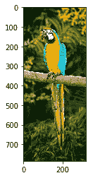

[金刚鹦鹉的一个例子](https://commons.wikimedia.org/wiki/File:Blue-and-Yellow-Macaw.jpg)

```py
classify_image("images/parrot.jpg", "vgg19")
```

1.金刚鹦鹉：99.77% 
2.鹦鹉：0.07% 
3.巨嘴鸟：0.06% 
4.犀鸟：0.05% 
5.贾卡马尔：0.01% 


```py
classify_image("images/parrot.jpg", "resnet")
```

1.金刚鹦鹉：97.93% 
2.孔雀：0.86% 
3.鹦鹉：0.23% 
4\. j：0.12% 
5.杰伊：0.12% 


```py
classify_image("images/parrot_cropped1.jpg", "resnet")
```

1.金刚鹦鹉：99.98% 
2.鹦鹉：0.00% 
3.孔雀：0.00% 
4.硫凤头鹦鹉：0.00% 
5.巨嘴鸟：0.00% 

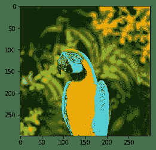

```py
classify_image("images/incredible-hulk-180.jpg", "resnet")
```

1\. comic_book：99.76% 
2\. book_jacket：0.19% 
3.拼图游戏：0.05% 
4.菜单：0.00% 
5.数据包：0.00% 

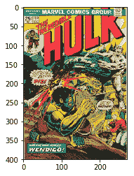

[如中所示的漫画分类示例](https://comicvine.gamespot.com/the-incredible-hulk-180-and-the-wind-howls-wendigo/4000-14667/)

```py
classify_image("images/cropped_panda.jpg", "resnet")
```

大熊猫：99.04% 
2.英迪尔：0.59% 
3.小熊猫：0.17% 
4.长臂猿：0.07% 
5\. titi：0.05% 

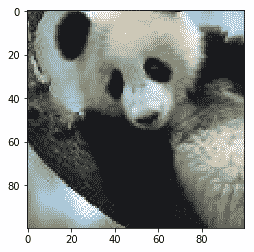

```py
classify_image("images/space-shuttle1.jpg", "resnet")
```

1.航天飞机：92.38% 
2.三角恐龙：7.15% 
3.战机：0.11% 
4.牛仔帽：0.10% 
5.草帽：0.04% 

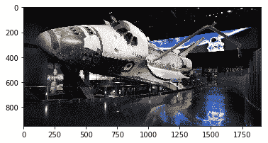

```py
classify_image("images/space-shuttle2.jpg", "resnet")
```

1.航天飞机：99.96% 
2.导弹：0.03% 
3.弹丸：0.00% 
4.蒸汽机车：0.00% 
5.战机：0.00% 

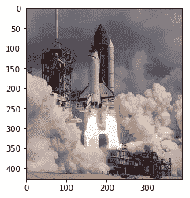

```py
classify_image("images/space-shuttle3.jpg", "resnet")
```

1.航天飞机：93.21% 
2.导弹：5.53% 
3.弹丸：1.26% 
4.清真寺：0.00% 
5.信标：0.00% 

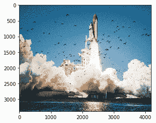

```py
classify_image("images/space-shuttle4.jpg", "resnet")
```

1.航天飞机：49.61% 
2.城堡：8.17% 
3.起重机：6.46% 
4.导弹：4.62% 
5.航空母舰：4.24% 

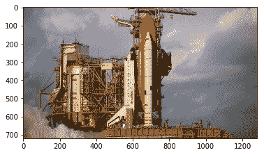

请注意，可能会出现一些错误。 例如：

```py
classify_image("images/parrot.jpg", "inception")
```

1.秒表：100.00% 
2.貂皮：0.00% 
3.锤子：0.00% 
4.黑松鸡：0.00% 
5.网站：0.00% 

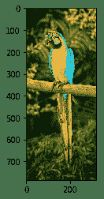

```py
classify_image("images/parrot.jpg", "xception")
```

1.背包：56.69% 
2.军装：29.79% 
3.围兜：8.02% 
4.钱包：2.14% 
5.乒乓球：1.52% 


6.  定义一个辅助功能，用于显示每个预构建和预训练网络的内部体系结构：

```py
def print_model(model):
print ("Model:",model)
Network = MODELS[model][0]
model = Network(weights="imagenet")
model.summary()
print_model('vgg19')
```

```py
('Model:', 'vgg19')
 _________________________________________________________________
 Layer (type) Output Shape Param #
 =================================================================
 input_14 (InputLayer) (None, 224, 224, 3) 0
 _________________________________________________________________
 block1_conv1 (Conv2D) (None, 224, 224, 64) 1792
 _________________________________________________________________
 block1_conv2 (Conv2D) (None, 224, 224, 64) 36928
 _________________________________________________________________
 block1_pool (MaxPooling2D) (None, 112, 112, 64) 0
 _________________________________________________________________
 block2_conv1 (Conv2D) (None, 112, 112, 128) 73856
 _________________________________________________________________
 block2_conv2 (Conv2D) (None, 112, 112, 128) 147584
 _________________________________________________________________
 block2_pool (MaxPooling2D) (None, 56, 56, 128) 0
 _________________________________________________________________
 block3_conv1 (Conv2D) (None, 56, 56, 256) 295168
 _________________________________________________________________
 block3_conv2 (Conv2D) (None, 56, 56, 256) 590080
 _________________________________________________________________
 block3_conv3 (Conv2D) (None, 56, 56, 256) 590080
 _________________________________________________________________
 block3_conv4 (Conv2D) (None, 56, 56, 256) 590080
 _________________________________________________________________
 block3_pool (MaxPooling2D) (None, 28, 28, 256) 0
 _________________________________________________________________
 block4_conv1 (Conv2D) (None, 28, 28, 512) 1180160
 _________________________________________________________________
 block4_conv2 (Conv2D) (None, 28, 28, 512) 2359808
 _________________________________________________________________
 block4_conv3 (Conv2D) (None, 28, 28, 512) 2359808
 _________________________________________________________________
 block4_conv4 (Conv2D) (None, 28, 28, 512) 2359808
 _________________________________________________________________
 block4_pool (MaxPooling2D) (None, 14, 14, 512) 0
 _________________________________________________________________
 block5_conv1 (Conv2D) (None, 14, 14, 512) 2359808
 _________________________________________________________________
 block5_conv2 (Conv2D) (None, 14, 14, 512) 2359808
 _________________________________________________________________
 block5_conv3 (Conv2D) (None, 14, 14, 512) 2359808
 _________________________________________________________________
 block5_conv4 (Conv2D) (None, 14, 14, 512) 2359808
 _________________________________________________________________
 block5_pool (MaxPooling2D) (None, 7, 7, 512) 0
 _________________________________________________________________
 flatten (Flatten) (None, 25088) 0
 _________________________________________________________________
 fc1 (Dense) (None, 4096) 102764544
 _________________________________________________________________
 fc2 (Dense) (None, 4096) 16781312
 _________________________________________________________________
 predictions (Dense) (None, 1000) 4097000
 =================================================================
 Total params: 143,667,240
 Trainable params: 143,667,240
 Non-trainable params: 0
```

# 这个怎么运作...

我们使用了 Keras 应用程序，预训练的 Keras 学习模型，该模型随预训练的权重一起提供。 这些模型可用于预测，特征提取和微调。 在这种情况下，我们将模型用于预测。 我们将在下一个食谱中看到如何使用模型进行微调，以及如何在最初训练模型时最初不可用的数据集上构建自定义分类器。

# 还有更多...

截至 2017 年 7 月，Inception-v4 尚未在 Keras 中直接提供，但可以作为单独的模块[在线下载](https://github.com/kentsommer/keras-inceptionV4)。 安装后，该模块将在首次使用时自动下载砝码。

AlexNet 是最早的堆叠式深层网络之一，它仅包含八层，前五层是卷积层，然后是全连接层。 该网络是在 2012 年提出的，明显优于第二名（前五名的错误率为 16%，而第二名的错误率为 26% ）。

关于深度神经网络的最新研究主要集中在提高准确性上。 较小的 DNN 架构具有同等的准确性，至少具有三个优点：

*   较小的 CNN 在分布式训练期间需要较少的跨服务器通信。
*   较小的 CNN 需要较少的带宽才能将新模型从云导出到提供模型的位置。
*   较小的 CNN 在具有有限内存的 FPGA 和其他硬件上部署更可行。 为了提供所有这些优点，SqueezeNet 在​​论文 [SqueezeNet: AlexNet-level accuracy with 50x fewer parameters and <0.5MB model size](https://arxiv.org/abs/1602.07360) 中提出。 SqueezeNet 通过减少 50 倍的参数在 ImageNet 上达到 AlexNet 级别的准确性。 此外，借助模型压缩技术，我们可以将 SqueezeNet 压缩到小于 0.5 MB（比 AlexNet 小 510 倍）。 Keras 将 SqueezeNet [作为单独的模块在线实现](https://github.com/DT42/squeezenet_demo)。

# 回收预建的深度学习模型以提取特征

在本食谱中，我们将看到如何使用深度学习来提取相关功能

# 做好准备

一个非常简单的想法是通常使用 VGG16 和 DCNN 进行特征提取。 该代码通过从特定层提取要素来实现该想法。

# 怎么做...

我们按以下步骤进行：

1.  导入处理和显示图像所需的预制模型和其他模块：

```py
from keras.applications.vgg16 import VGG16
from keras.models import Model
from keras.preprocessing import image
from keras.applications.vgg16 import preprocess_input
import numpy as np
```

2.  从网络中选择一个特定的层，并获得作为输出生成的要素：

```py
# pre-built and pre-trained deep learning VGG16 model
base_model = VGG16(weights='imagenet', include_top=True)
for i, layer in enumerate(base_model.layers):
print (i, layer.name, layer.output_shape)
# extract features from block4_pool block
model =
Model(input=base_model.input, output=base_model.get_layer('block4_pool').output)
```

3.  提取给定图像的特征，如以下代码片段所示：

```py
img_path = 'cat.jpg'
img = image.load_img(img_path, target_size=(224, 224))
x = image.img_to_array(img)
x = np.expand_dims(x, axis=0)
x = preprocess_input(x)
# get the features from this block
features = model.predict(x)
```

# 这个怎么运作...

现在，您可能想知道为什么我们要从 CNN 的中间层提取要素。 关键的直觉是：随着网络学会将图像分类，各层学会识别进行最终分类所必需的特征。

较低的层标识较低阶的特征（例如颜色和边缘），较高的层将这些较低阶的特征组合为较高阶的特征（例如形状或对象）。 因此，中间层具有从图像中提取重要特征的能力，并且这些特征更有可能有助于不同种类的分类。

这具有多个优点。 首先，我们可以依靠公开提供的大规模训练，并将这种学习转移到新颖的领域。 其次，我们可以节省昂贵的大型训练时间。 第三，即使我们没有针对该领域的大量训练示例，我们也可以提供合理的解决方案。 对于手头的任务，我们也有一个很好的起始网络形状，而不是猜测它。

# 用于迁移学习的非常深的 InceptionV3 Net

转移学习是一种非常强大的深度学习技术，在不同领域中有更多应用。 直觉非常简单，可以用类推来解释。 假设您想学习一种新的语言，例如西班牙语，那么从另一种语言（例如英语）已经知道的内容开始可能会很有用。

按照这种思路，计算机视觉研究人员现在通常使用经过预训练的 CNN 来生成新任务的表示形式，其中数据集可能不足以从头训练整个 CNN。 另一个常见的策略是采用经过预先训练的 ImageNet 网络，然后将整个网络微调到新颖的任务。

InceptionV3 Net 是 Google 开发的非常深入的 ConvNet。 Keras 实现了整个网络，如下图所示，并且已在 ImageNet 上进行了预训练。 该型号的默认输入大小在三个通道上为 299x299：

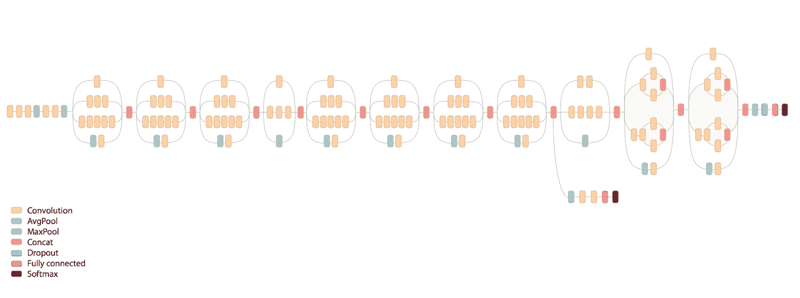

An example of ImageNet v3

# 做好准备

此框架示例受到 [Keras 网站上在线提供的方案](https://keras.io/applications/)的启发。 我们假设在与 ImageNet 不同的域中具有训练数据集 D。 D 在输入中具有 1,024 个特征，在输出中具有 200 个类别。

# 怎么做...

我们可以按照以下步骤进行操作：

1.  导入处理所需的预制模型和其他模块：

```py
from keras.applications.inception_v3 import InceptionV3
from keras.preprocessing import image
from keras.models import Model
from keras.layers import Dense, GlobalAveragePooling2D
from keras import backend as K
# create the base pre-trained model
base_model = InceptionV3(weights='imagenet', include_top=False)
```

2.  我们使用训练有素的 Inception-v3，但我们不包括顶级模型，因为我们要在 D 上进行微调。顶层是具有 1,024 个输入的 Dense 层，最后一个输出是具有 200 类输出的 softmax Dense 层 。 `x = GlobalAveragePooling2D()(x)`用于将输入转换为 Dense 图层要处理的正确形状。 实际上，`base_model.output tensor`具有`dim_ordering="th"`的形状（样本，通道，行，列），`dim_ordering="tf"`具有（样本，行，列，列，通道），但是 Dense 需要将它们作为[样本，通道] `GlobalAveragePooling2D` 平均值（行，列）。 因此，如果查看最后四层（在`include_top=True`中），则会看到以下形状：

```py
# layer.name, layer.input_shape, layer.output_shape
('mixed10', [(None, 8, 8, 320), (None, 8, 8, 768), (None, 8, 8, 768), (None, 8, 8, 192)], (None, 8, 8, 2048))
('avg_pool', (None, 8, 8, 2048), (None, 1, 1, 2048))
('flatten', (None, 1, 1, 2048), (None, 2048))
('predictions', (None, 2048), (None, 1000))
```

3.  当包含`_top=False`时，将除去最后三层并暴露`mixed_10`层，因此`GlobalAveragePooling2D`层将`(None, 8, 8, 2048)`转换为`(None, 2048)`，其中`(None, 2048)`张量中的每个元素都是平均值 `(None, 8, 8, 2048)`张量中每个对应的（8,8）次张量的值：

```py
# add a global spatial average pooling layer
 x = base_model.output
 x = GlobalAveragePooling2D()(x)
 # let's add a fully-connected layer as first layer
 x = Dense(1024, activation='relu')(x)
 # and a logistic layer with 200 classes as last layer
 predictions = Dense(200, activation='softmax')(x)
 # model to train
 model = Model(input=base_model.input, output=predictions)
```

4.  所有卷积级别都经过预训练，因此我们在训练完整模型时将其冻结。

```py
# i.e. freeze all convolutional Inception-v3 layers
for layer in base_model.layers:
layer.trainable = False
```

5.  然后，对模型进行编译和训练几个时期，以便对顶层进行训练：

```py
# compile the model (should be done *after* setting layers to non-trainable)
 model.compile(optimizer='rmsprop', loss='categorical_crossentropy')
# train the model on the new data for a few epochs
 model.fit_generator(...)
```

6.  然后我们冻结 Inception 中的顶层并微调 Inception 层。 在此示例中，我们冻结了前 172 层（要调整的超参数）：

```py
# we chose to train the top 2 inception blocks, i.e. we will freeze
 # the first 172 layers and unfreeze the rest:
 for layer in model.layers[:172]:
 layer.trainable = False
 for layer in model.layers[172:]:
 layer.trainable = True
```

7.  然后重新编译模型以进行微调优化。 我们需要重新编译模型，以使这些修改生效：

```py
# we use SGD with a low learning rate
 from keras.optimizers import SGD
 model.compile(optimizer=SGD(lr=0.0001, momentum=0.9), loss='categorical_crossentropy')

 # we train our model again (this time fine-tuning the top 2 inception blocks
 # alongside the top Dense layers
 model.fit_generator(...)
```

# 这个怎么运作...

现在，我们有了一个新的深度网络，该网络可以重用标准的 Inception-v3 网络，但可以通过迁移学习在新的域 D 上进行训练。 当然，有许多参数需要微调以获得良好的精度。 但是，我们现在正在通过迁移学习重新使用非常庞大的预训练网络作为起点。 这样，我们可以通过重复使用 Keras 中已经可用的内容来节省对机器进行训练的需求。

# 还有更多...

截至 2017 年，“计算机视觉”问题意味着在图像中查找图案的问题可以视为已解决，并且此问题影响了我们的生活。 例如：

*   [《皮肤科医师对具有深层神经网络的皮肤癌的分类》](https://www.nature.com/nature/journal/v542/n7639/full/nature21056.html)（Andre Esteva，Brett Kuprel，Roberto A. Novoa，Justin Ko，Susan M. Swetter，Helen M. Blau & Sebastian Thrun，2017 年）使用 129450 个临床图像的数据集训练 CNN，该图像由 2032 种不同疾病组成。 他们在 21 个经过董事会认证的皮肤科医生的活检验证的临床图像上对结果进行了测试，并使用了两个关键的二元分类用例：角质形成细胞癌与良性脂溢性角化病； 恶性黑色素瘤与良性痣。 CNN 在这两项任务上均达到了与所有测试过的专家相同的性能，展示了一种能够对皮肤癌进行分类的，具有与皮肤科医生相当的能力的人工智能。
*   论文[《通过多视图深度卷积神经网络进行高分辨率乳腺癌筛查》](https://arxiv.org/abs/1703.07047)（Krzysztof J. Geras，Stacey Wolfson，S。Gene Kim，Linda Moy，Kyunghyun Cho）承诺通过其创新的体系结构来改善乳腺癌的筛查过程，该体系结构可以处理四个标准视图或角度，而不会牺牲高分辨率。 与通常用于自然图像的 DCN 体系结构（其可处理 224 x 224 像素的图像）相反，MV-DCN 也能够使用 2600 x 2000 像素的分辨率。

# 使用膨胀的 ConvNets，WaveNet 和 NSynth 生成音乐

WaveNet 是用于生成原始音频波形的深度生成模型。 Google DeepMind](https://deepmind.com/blog/wavenet-generative-model-raw-audio/) ）已引入了这一突破性技术。 HTG3]），以教授如何与计算机通话。 结果确实令人印象深刻，在网上可以找到合成语音的示例，计算机可以在其中学习如何与名人的声音（例如 Matt Damon）交谈。

因此，您可能想知道为什么学习合成音频如此困难。 嗯，我们听到的每个数字声音都是基于每秒 16,000 个样本（有时是 48,000 个或更多），并且要建立一个预测模型，在此模型中，我们学会根据以前的所有样本来复制样本是一个非常困难的挑战。 尽管如此，仍有实验表明，WaveNet 改进了当前最先进的**文本转语音**（TTS）系统，使美国英语和普通话与人声的差异降低了 50%  中文。

更酷的是，DeepMind 证明 WaveNet 也可以用于向计算机教授如何产生乐器声音（例如钢琴音乐）。

现在为一些定义。 TTS 系统通常分为两个不同的类别：

*   串联 TTS，其中单个语音语音片段首先被存储，然后在必须重现语音时重新组合。 但是，该方法无法扩展，因为可能只重现存储的语音片段，并且不可能重现新的扬声器或不同类型的音频而不从一开始就记住这些片段。
*   参数化 TTS，在其中创建一个模型来存储要合成的音频的所有特征。 在 WaveNet 之前，参数 TTS 生成的音频不如串联 TTS 生成的音频自然。 WaveNet 通过直接对音频声音的产生进行建模，而不是使用过去使用的中间信号处理算法，从而改善了现有技术。

原则上，WaveNet 可以看作是一维卷积层的堆栈（我们已经在第 4 章中看到了图像的 2D 卷积），步幅恒定为 1，没有池化层。 请注意，输入和输出在构造上具有相同的尺寸，因此 ConvNet 非常适合对顺序数据（例如音频）建模。 但是，已经显示出，为了在输出神经元中的接收场达到较大的大小，有必要使用大量的大型过滤器或过分增加网络的深度。 请记住，一层中神经元的接受场是前一层的横截面，神经元从该层提供输入。 因此，纯 ConvNet 在学习如何合成音频方面不是那么有效。

WaveNet 之外的主要直觉是所谓的因果因果卷积（有时称为原子卷积），这仅意味着在应用卷积层的滤波器时会跳过某些输入值。 Atrous 是法语表述为 *à trous* 的*混蛋*，意思是带有孔的。 因此，AtrousConvolution 是带孔的卷积。例如，在一个维度中，尺寸为 3 且扩张为 1 的滤波器 w 将计算出以下总和。

简而言之，在 D 扩散卷积中，步幅通常为 1，但是没有任何东西可以阻止您使用其他步幅。 下图给出了一个示例，其中膨胀（孔）尺寸增大了= 0、1、2：

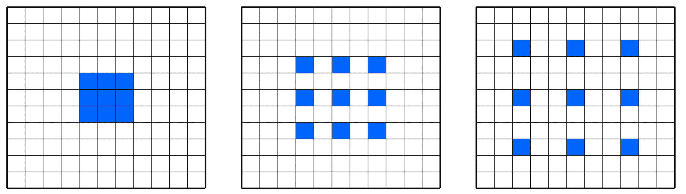

An example of dilated network

由于采用了引入“空洞”的简单思想，可以在不具有过多深度网络的情况下，使用指数级增长的滤波器堆叠多个膨胀的卷积层，并学习远程输入依赖项。

因此，WaveNet 是一个 ConvNet，其中卷积层具有各种膨胀因子，从而使接收场随深度呈指数增长，因此有效覆盖了数千个音频时间步长。

当我们训练时，输入是从人类扬声器录制的声音。 波形被量化为固定的整数范围。 WaveNet 定义了一个初始卷积层，仅访问当前和先前的输入。 然后，有一堆散布的 ConvNet 层，仍然仅访问当前和以前的输入。 最后，有一系列密集层结合了先前的结果，然后是用于分类输出的 softmax 激活函数。

在每个步骤中，都会从网络预测一个值，并将其反馈到输入中。 同时，为下一步计算新的预测。 损失函数是当前步骤的输出与下一步的输入之间的交叉熵。

[NSynth](https://magenta.tensorflow.org/nsynth)是 Google Brain 集团最近发布的 WaveNet 的改进版本，其目的不是查看因果关系，而是查看输入块的整个上下文。 神经网络是真正的，复杂的，如下图所示，但是对于本介绍性讨论而言，足以了解该网络通过使用基于减少编码/解码过程中的错误的方法来学习如何再现其输入。 阶段：

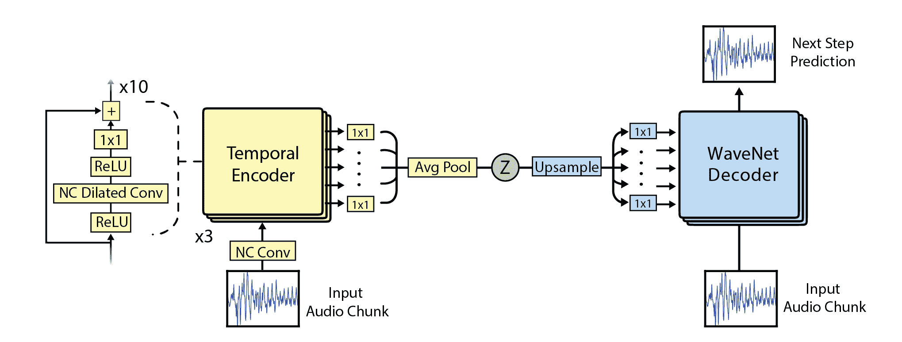

[如下所示的 NSynth 架构示例](https://magenta.tensorflow.org/nsynth)

# 做好准备

对于本食谱，我们不会编写代码，而是向您展示如何使用[一些在线可用的代码](https://github.com/tensorflow/magenta/tree/master/magenta/models/nsynth)和一些不错的演示，您可以从 [Google Brain 找到](https://aiexperiments.withgoogle.com/sound-maker)。 有兴趣的读者还可以阅读以下文章：[《使用 WaveNet 自编码器的音符的神经音频合成》](https://arxiv.org/abs/1704.01279)（杰西·恩格尔，辛琼·雷斯尼克，亚当·罗伯茨，桑德·迪勒曼，道格拉斯·埃克，卡伦·西蒙扬，穆罕默德·诺鲁兹，4 月 5 日 2017）。

# 怎么做...

我们按以下步骤进行：

1.  通过创建单独的 conda 环境来安装 NSynth。 使用支持 Jupyter Notebook 的 Python 2.7 创建并激活 Magenta conda 环境：

```py
conda create -n magenta python=2.7 jupyter
source activate magenta
```

2.  安装洋红色 pip 包和 librosa（用于读取音频格式）：

```py
pip install magenta
pip install librosa
```

3.  从[互联网](http://download.magenta.tensorflow.org/models/nsynth/wavenet-ckpt.tar)安装预构建的模型，然后下载[示例声音](https://www.freesound.org/people/MustardPlug/sounds/395058/)。 然后运行[演示目录](http://localhost:8888/notebooks/nsynth/Exploring_Neural_Audio_Synthesis_with_NSynth.ipynb)中包含的笔记本。 第一部分是关于包含稍后将在我们的计算中使用的模块的：

```py
import os
import numpy as np
import matplotlib.pyplot as plt
from magenta.models.nsynth import utils
from magenta.models.nsynth.wavenet import fastgen
from IPython.display import Audio
%matplotlib inline
%config InlineBackend.figure_format = 'jpg'
```

4.  然后，我们加载从互联网下载的演示声音，并将其放置在与笔记本计算机相同的目录中。 这将在约 2.5 秒内将 40,000 个样本加载到计算机中：

```py
# from https://www.freesound.org/people/MustardPlug/sounds/395058/
fname = '395058__mustardplug__breakbeat-hiphop-a4-4bar-96bpm.wav'
sr = 16000
audio = utils.load_audio(fname, sample_length=40000, sr=sr)
sample_length = audio.shape[0]
print('{} samples, {} seconds'.format(sample_length, sample_length / float(sr)))
```

5.  下一步是使用从互联网下载的预先训练的 NSynth 模型以非常紧凑的表示形式对音频样本进行编码。 每四秒钟音频将为我们提供 78 x 16 尺寸的编码，然后我们可以对其进行解码或重新合成。 我们的编码是张量（`#files=1 x 78 x 16`）：

```py
%time encoding = fastgen.encode(audio, 'model.ckpt-200000', sample_length)
INFO:tensorflow:Restoring parameters from model.ckpt-200000
 CPU times: user 1min 4s, sys: 2.96 s, total: 1min 7s
 Wall time: 25.7 s
print(encoding.shape)
(1, 78, 16)
```

6.  让我们保存以后将用于重新合成的编码。 另外，让我们用图形表示来快速查看编码形状是什么，并将其与原始音频信号进行比较。 如您所见，编码遵循原始音频信号中呈现的节拍：

```py
np.save(fname + '.npy', encoding)
fig, axs = plt.subplots(2, 1, figsize=(10, 5))
axs[0].plot(audio);
axs[0].set_title('Audio Signal')
axs[1].plot(encoding[0]);
axs[1].set_title('NSynth Encoding')
```

我们观察到以下音频信号和 Nsynth 编码：

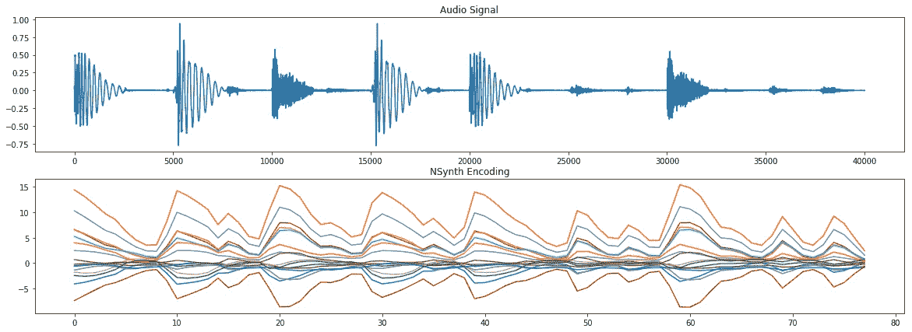

7.  现在，让我们对刚刚产生的编码进行解码。 换句话说，我们试图从紧凑的表示中再现原始音频，目的是理解重新合成的声音是否类似于原始声音。 确实，如果您运行实验并聆听原始音频和重新合成的音频，它们听起来非常相似：

```py
%time fastgen.synthesize(encoding, save_paths=['gen_' + fname], samples_per_save=sample_length)
```

# 这个怎么运作...

WaveNet 是一种 ConvNet，其中卷积层具有各种扩张因子，从而使接收场随深度呈指数增长，因此有效覆盖了数千个音频时间步长。 NSynth 是 WaveNet 的演进，其中原始音频使用类似 WaveNet 的处理进行编码，以学习紧凑的表示形式。 然后，使用这种紧凑的表示来再现原始音频。

# 还有更多...

一旦我们学习了如何通过膨胀卷积创建音频的紧凑表示形式，我们就可以玩这些学习并从中获得乐趣。 您会在互联网上找到非常酷的演示：

1.  例如，您可以看到模型如何学习[不同乐器的声音](https://magenta.tensorflow.org/nsynth)：

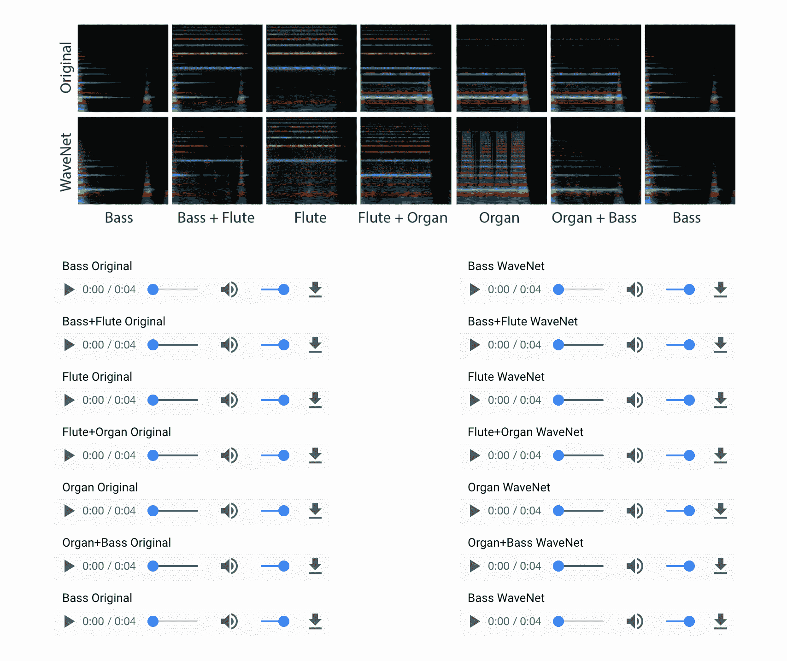

2.  然后，您将看到如何将在一个上下文中学习的一个模型在另一个上下文中重新组合。 例如，通过更改说话者身份，[我们可以使用 WaveNet 以不同的声音说同一件事](https://deepmind.com/blog/wavenet-generative-model-raw-audio/)。
3.  另一个非常有趣的实验是学习乐器模型，然后以一种可以重新创建以前从未听说过的新乐器的方式对其进行重新混合。 这真的很酷，它为通往新的可能性开辟了道路，坐在我里面的前电台 DJ 无法抗拒超级兴奋。 例如，在此示例中，我们将西塔琴与电吉他结合在一起，这是一种很酷的新乐器。 不够兴奋？ 那么，[如何将弓弦低音与狗的吠声结合起来呢](https://aiexperiments.withgoogle.com/sound-maker/view/)？玩得开心！：

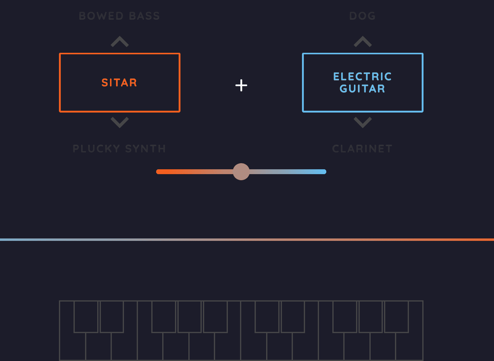

# 回答有关图像的问题（可视化问答）

在本食谱中，我们将学习如何回答有关特定图像内容的问题。 这是一种强大的 Visual Q＆A，它结合了从预先训练的 VGG16 模型中提取的视觉特征和词聚类（嵌入）的组合。 然后将这两组异类特征组合成一个网络，其中最后一层由密集和缺失的交替序列组成。 此食谱适用于 Keras 2.0+。

因此，本食谱将教您如何：

*   从预先训练的 VGG16 网络中提取功能。
*   使用预构建的单词嵌入将单词映射到相邻相似单词的空间中。
*   使用 LSTM 层构建语言模型。 LSTM 将在第 6 章中讨论，现在我们将它们用作黑盒。
*   组合不同的异构输入要素以创建组合的要素空间。 对于此任务，我们将使用新的 Keras 2.0 功能 API。
*   附加一些其他的 Dense 和 Dropout 层，以创建多层感知器并增强我们的深度学习网络的功能。

为了简单起见，我们不会在 5 中重新训练组合网络，而是使用已经在线提供的[预先训练的权重集](https://avisingh599.github.io/deeplearning/visual-qa/)。 有兴趣的读者可以在由 N 个图像，N 个问题和 N 个答案组成的自己的训练数据集上对网络进行再训练。 这是可选练习。 该网络的灵感来自[《VQA：视觉问题解答》](http://arxiv.org/pdf/1505.00468v4.pdf)（Aishwarya Agrawal，Jiasen Lu，Stanislaw Antol，Margaret Mitchell，C.Lawrence Zitnick，Dhruv Batra，Devi Parikh，2015 年）：

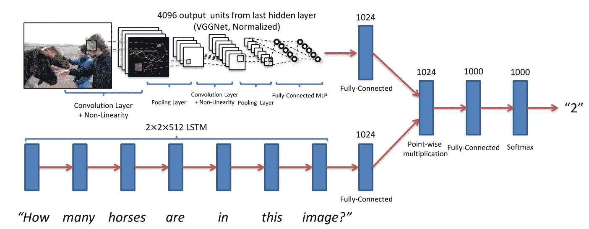

在视觉问题回答论文中看到的 Visual Q&A 示例

我们这种情况的唯一区别是，我们将图像层产生的特征与语言层产生的特征连接起来。

# 怎么做...

我们可以按照以下步骤进行操作：

1.  加载配方所需的所有 Keras 模块。 其中包括用于词嵌入的 spaCy，用于图像特征提取的 VGG16 和用于语言建模的 LSTM。 其余的几个附加模块非常标准：

```py
%matplotlib inline
import os, argparse
import numpy as np
import cv2 as cv2
import spacy as spacy
import matplotlib.pyplot as plt
from keras.models import Model, Input
from keras.layers.core import Dense, Dropout, Reshape
from keras.layers.recurrent import LSTM
from keras.layers.merge import concatenate
from keras.applications.vgg16 import VGG16
from keras.preprocessing import image
from keras.applications.vgg16 import preprocess_input
from sklearn.externals import joblib
import PIL.Image
```

2.  定义一些常量。 请注意，我们假设我们的问题语料库具有`max_length_questions = 30`，并且我们知道我们将使用 VGG16 提取 4,096 个描述输入图像的特征。 另外，我们知道单词嵌入在`length_feature_space = 300`的空间中。 请注意，我们将使用从互联网下载的[一组预训练权重](https://github.com/iamaaditya/VQA_Demo)：

```py
# mapping id -> labels for categories
label_encoder_file_name =
'/Users/gulli/Books/TF/code/git/tensorflowBook/Chapter5/FULL_labelencoder_trainval.pkl'
# max length across corpus
max_length_questions = 30
# VGG output
length_vgg_features = 4096
# Embedding outout
length_feature_space = 300
# pre-trained weights
VQA_weights_file =
'/Users/gulli/Books/TF/code/git/tensorflowBook/Chapter5/VQA_MODEL_WEIGHTS.hdf5'
```

3.使用 VGG16 提取特征。 请注意，我们从 fc2 层中明确提取了它们。 给定输入图像，此函数返回 4,096 个特征：

```py
'''image features'''
def get_image_features(img_path, VGG16modelFull):
'''given an image returns a tensor with (1, 4096) VGG16 features'''
# Since VGG was trained as a image of 224x224, every new image
# is required to go through the same transformation
img = image.load_img(img_path, target_size=(224, 224))
x = image.img_to_array(img)
# this is required because of the original training of VGG was batch
# even if we have only one image we need to be consistent
x = np.expand_dims(x, axis=0)
x = preprocess_input(x)
features = VGG16modelFull.predict(x)
model_extractfeatures = Model(inputs=VGG16modelFull.input,
outputs=VGG16modelFull.get_layer('fc2').output)
fc2_features = model_extractfeatures.predict(x)
fc2_features = fc2_features.reshape((1, length_vgg_features))
return fc2_features
```

请注意，VGG16 的定义如下：

```py
Layer (type) Output Shape Param #
 =================================================================
 input_5 (InputLayer) (None, 224, 224, 3) 0
 _________________________________________________________________
 block1_conv1 (Conv2D) (None, 224, 224, 64) 1792
 _________________________________________________________________
 block1_conv2 (Conv2D) (None, 224, 224, 64) 36928
 _________________________________________________________________
 block1_pool (MaxPooling2D) (None, 112, 112, 64) 0
 _________________________________________________________________
 block2_conv1 (Conv2D) (None, 112, 112, 128) 73856
 _________________________________________________________________
 block2_conv2 (Conv2D) (None, 112, 112, 128) 147584
 _________________________________________________________________
 block2_pool (MaxPooling2D) (None, 56, 56, 128) 0
 _________________________________________________________________
 block3_conv1 (Conv2D) (None, 56, 56, 256) 295168
 _________________________________________________________________
 block3_conv2 (Conv2D) (None, 56, 56, 256) 590080
 _________________________________________________________________
 block3_conv3 (Conv2D) (None, 56, 56, 256) 590080
 _________________________________________________________________
 block3_pool (MaxPooling2D) (None, 28, 28, 256) 0
 _________________________________________________________________
 block4_conv1 (Conv2D) (None, 28, 28, 512) 1180160
 _________________________________________________________________
 block4_conv2 (Conv2D) (None, 28, 28, 512) 2359808
 _________________________________________________________________
 block4_conv3 (Conv2D) (None, 28, 28, 512) 2359808
 _________________________________________________________________
 block4_pool (MaxPooling2D) (None, 14, 14, 512) 0
 _________________________________________________________________
 block5_conv1 (Conv2D) (None, 14, 14, 512) 2359808
 _________________________________________________________________
 block5_conv2 (Conv2D) (None, 14, 14, 512) 2359808
 _________________________________________________________________
 block5_conv3 (Conv2D) (None, 14, 14, 512) 2359808
 _________________________________________________________________
 block5_pool (MaxPooling2D) (None, 7, 7, 512) 0
 _________________________________________________________________
 flatten (Flatten) (None, 25088) 0
 _________________________________________________________________
 fc1 (Dense) (None, 4096) 102764544
 _________________________________________________________________
 fc2 (Dense) (None, 4096) 16781312
 _________________________________________________________________
 predictions (Dense) (None, 1000) 4097000
 =================================================================
 Total params: 138,357,544
 Trainable params: 138,357,544
 Non-trainable params: 0
 _________________________________________
```

4.  使用 spaCy 获取单词嵌入，并将输入的问题映射到一个空格（`max_length_questions, 300`），其中`max_length_questions`是我们语料库中问题的最大长度，而 300 是 spaCy 产生的嵌入的尺寸。 在内部，spaCy 使用一种称为 [gloVe](http://nlp.stanford.edu/projects/glove/) 的算法。 gloVe 将给定令牌简化为 300 维表示。 请注意，该问题使用右 0 填充填充到`max_lengh_questions`：

```py
'''embedding'''
def get_question_features(question):
''' given a question, a unicode string, returns the time series vector
with each word (token) transformed into a 300 dimension representation
calculated using Glove Vector '''
word_embeddings = spacy.load('en', vectors='en_glove_cc_300_1m_vectors')
tokens = word_embeddings(question)
ntokens = len(tokens)
if (ntokens > max_length_questions) :
ntokens = max_length_questions
question_tensor = np.zeros((1, max_length_questions, 300))
for j in xrange(len(tokens)):
question_tensor[0,j,:] = tokens[j].vector
return question_tensor
```

5.  使用先前定义的图像特征提取器加载图像并获取其显着特征：

```py
image_file_name = 'girl.jpg'
img0 = PIL.Image.open(image_file_name)
img0.show()
#get the salient features
model = VGG16(weights='imagenet', include_top=True)
image_features = get_image_features(image_file_name, model)
print image_features.shape
```

6.  使用先前定义的句子特征提取器，编写一个问题并获得其显着特征：

```py
question = u"Who is in this picture?"
language_features = get_question_features(question)
print language_features.shape
```

7.  将两组异类特征组合为一个。 在这个网络中，我们有三个 LSTM 层，这些层将考虑我们语言模型的创建。 注意，LSTM 将在第 6 章中详细讨论，目前我们仅将它们用作黑匣子。 最后的 LSTM 返回 512 个要素，这些要素随后用作一系列密集层和缺失层的输入。 最后一层是具有 softmax 激活函数的密集层，其概率空间为 1,000 个潜在答案：

```py
'''combine'''
def build_combined_model(
number_of_LSTM = 3,
number_of_hidden_units_LSTM = 512,
number_of_dense_layers = 3,
number_of_hidden_units = 1024,
activation_function = 'tanh',
dropout_pct = 0.5
):
#input image
input_image = Input(shape=(length_vgg_features,),
name="input_image")
model_image = Reshape((length_vgg_features,),
input_shape=(length_vgg_features,))(input_image)
#input language
input_language = Input(shape=(max_length_questions,length_feature_space,),
name="input_language")
#build a sequence of LSTM
model_language = LSTM(number_of_hidden_units_LSTM,
return_sequences=True,
name = "lstm_1")(input_language)
model_language = LSTM(number_of_hidden_units_LSTM,
return_sequences=True,
name = "lstm_2")(model_language)
model_language = LSTM(number_of_hidden_units_LSTM,
return_sequences=False,
name = "lstm_3")(model_language)
#concatenate 4096+512
model = concatenate([model_image, model_language])
#Dense, Dropout
for _ in xrange(number_of_dense_layers):
model = Dense(number_of_hidden_units,
kernel_initializer='uniform')(model)
model = Dropout(dropout_pct)(model)
model = Dense(1000,
activation='softmax')(model)
#create model from tensors
model = Model(inputs=[input_image, input_language], outputs = model)
return model
```

8.  建立组合的网络并显示其摘要，以了解其内部外观。 加载预训练的权重并使用 rmsprop 优化器使用`categorical_crossentropy`损失函数来编译模型：

```py
combined_model = build_combined_model()
combined_model.summary()
combined_model.load_weights(VQA_weights_file)
combined_model.compile(loss='categorical_crossentropy', optimizer='rmsprop')
____________________________
 Layer (type) Output Shape Param # Connected to
 ====================================================================================================
 input_language (InputLayer) (None, 30, 300) 0
 ____________________________________________________________________________________________________
 lstm_1 (LSTM) (None, 30, 512) 1665024 input_language[0][0]
 ____________________________________________________________________________________________________
 input_image (InputLayer) (None, 4096) 0
 ____________________________________________________________________________________________________
 lstm_2 (LSTM) (None, 30, 512) 2099200 lstm_1[0][0]
 ____________________________________________________________________________________________________
 reshape_3 (Reshape) (None, 4096) 0 input_image[0][0]
 ____________________________________________________________________________________________________
 lstm_3 (LSTM) (None, 512) 2099200 lstm_2[0][0]
 ____________________________________________________________________________________________________
 concatenate_3 (Concatenate) (None, 4608) 0 reshape_3[0][0]
 lstm_3[0][0]
 ____________________________________________________________________________________________________
 dense_8 (Dense) (None, 1024) 4719616 concatenate_3[0][0]
 ____________________________________________________________________________________________________
 dropout_7 (Dropout) (None, 1024) 0 dense_8[0][0]
 ____________________________________________________________________________________________________
 dense_9 (Dense) (None, 1024) 1049600 dropout_7[0][0]
 ____________________________________________________________________________________________________
 dropout_8 (Dropout) (None, 1024) 0 dense_9[0][0]
 ____________________________________________________________________________________________________
 dense_10 (Dense) (None, 1024) 1049600 dropout_8[0][0]
 ____________________________________________________________________________________________________
 dropout_9 (Dropout) (None, 1024) 0 dense_10[0][0]
 ____________________________________________________________________________________________________
 dense_11 (Dense) (None, 1000) 1025000 dropout_9[0][0]
 ====================================================================================================
 Total params: 13,707,240
 Trainable params: 13,707,240
 Non-trainable params: 0
```

9.  使用预训练的组合网络进行预测。 请注意，在这种情况下，我们使用该网络已经在线可用的权重，但是感兴趣的读者可以在自己的训练集中重新训练组合的网络：

```py
y_output = combined_model.predict([image_features, language_features])
# This task here is represented as a classification into a 1000 top answers
# this means some of the answers were not part of training and thus would
# not show up in the result.
# These 1000 answers are stored in the sklearn Encoder class
labelencoder = joblib.load(label_encoder_file_name)
for label in reversed(np.argsort(y_output)[0,-5:]):
print str(round(y_output[0,label]*100,2)).zfill(5), "% ", labelencoder.inverse_transform(label)
```

# 这个怎么运作...

视觉问题解答的任务是通过结合使用不同的深度神经网络来解决的。 预训练的 VGG16 已用于从图像中提取特征，而 LSTM 序列已用于从先前映射到嵌入空间的问题中提取特征。 VGG16 是用于图像特征提取的 CNN，而 LSTM 是用于提取表示序列的时间特征的 RNN。 目前，这两种方法的结合是处理此类网络的最新技术。 然后，在组合模型的顶部添加一个具有辍学功能的多层感知器，以形成我们的深度网络。

# 还有更多...

在互联网上，您可以找到 [Avi Singh](https://avisingh599.github.io/deeplearning/visual-qa/) 进行的更多实验，其中比较了不同的模型，包括简单的“袋装”语言的“单词”与图像的 CNN，仅 LSTM 模型以及 LSTM + CNN 模型-类似于本食谱中讨论的模型。 博客文章还讨论了每种模型的不同训练策略。

除此之外，有兴趣的读者可以在[互联网](https://github.com/anujshah1003/VQA-Demo-GUI)上找到一个不错的 GUI，它建立在 Avi Singh 演示的顶部，使您可以交互式加载图像并提出相关问题。 还提供了 [YouTube 视频](https://www.youtube.com/watch?v=7FB9PvzOuQY)。

# 通过六种不同方式对视频进行预训练网络分类

对视频进行分类是一个活跃的研究领域，因为处理此类媒体需要大量数据。 内存需求经常达到现代 GPU 的极限，可能需要在多台机器上进行分布式训练。 目前，研究正在探索复杂性不断提高的不同方向，让我们对其进行回顾。

第一种方法包括一次将一个视频帧分类，方法是将每个视频帧视为使用 2D CNN 处理的单独图像。 这种方法只是将视频分类问题简化为图像分类问题。 每个视频帧*产生*分类输出，并且通过考虑每个帧的更频繁选择的类别对视频进行分类。

第二种方法包括创建一个单一网络，其中 2D CNN 与 RNN 结合在一起。 这个想法是 CNN 将考虑图像分量，而 RNN 将考虑每个视频的序列信息。 由于要优化的参数数量非常多，这种类型的网络可能很难训练。

第三种方法是使用 3D ConvNet，其中 3D ConvNet 是在 3D 张量（`time`，`image_width`和`image_height`）上运行的 2D ConvNets 的扩展。 这种方法是图像分类的另一个自然扩展，但同样，3D ConvNets 可能很难训练。

第四种方法基于智能直觉。 代替直接使用 CNN 进行分类，它们可以用于存储视频中每个帧的脱机功能。 想法是，如先前的食谱所示，可以通过转移学习使特征提取非常有效。 提取所有特征后，可以将它们作为一组输入传递到 RNN，该 RNN 将学习多个帧中的序列并发出最终分类。

第五种方法是第四种方法的简单变体，其中最后一层是 MLP 而不是 RNN。 在某些情况下，就计算要求而言，此方法可能更简单且成本更低。

第六种方法是第四种方法的变体，其中特征提取的阶段是通过提取空间和视觉特征的 3D CNN 实现的。 然后将这些功能传递给 RNN 或 MLP。

选择最佳方法严格取决于您的特定应用，没有明确的答案。 前三种方法通常在计算上更昂贵，而后三种方法则更便宜并且经常获得更好的性能。

在本食谱中，我们将通过描述论文 [Temporal Activity Detection in Untrimmed Videos with Recurrent Neural Networks](https://arxiv.org/abs/1608.08128) 来描述如何使用第六种方法。 这项工作旨在解决 [ActivityNet 挑战](http://activity-net.org/challenges/2016/) 。 这项挑战着重于从用户生成的视频中识别高水平和面向目标的活动，类似于在互联网门户网站中找到的那些活动。 该挑战针对两项不同任务中的 200 个活动类别量身定制：

*   未修剪的分类挑战：给定较长的视频，请预测视频中存在的活动的标签
*   检测挑战：给定较长的视频，预测视频中存在的活动的标签和时间范围

呈现的架构包括两个阶段，如下图所示。 第一阶段将视频信息编码为单个视频表示形式，以用于小型视频剪辑。 为此，使用了 C3D 网络。 C3D 网络使用 3D 卷积从视频中提取时空特征，这些视频先前已被分成 16 帧剪辑。

一旦提取了视频特征，第二阶段就是对每个剪辑的活动进行分类。 为了执行这种分类，使用了 RNN，更具体地说是一个 LSTM 网络，该网络试图利用长期相关性并执行视频序列的预测。 此阶段已被训练：

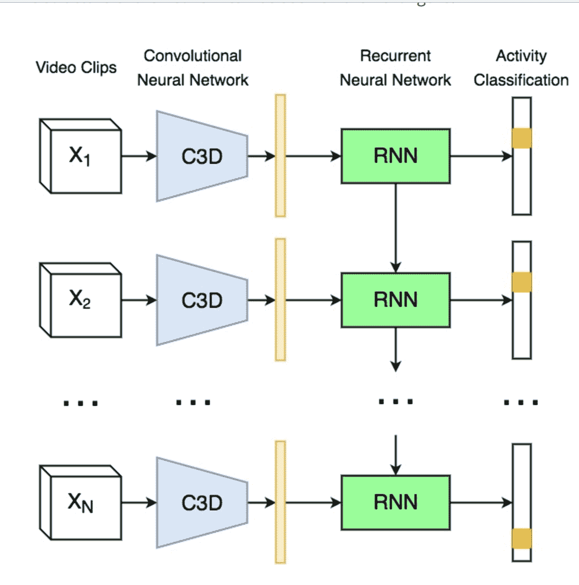

[C3D + RNN 的示例](https://imatge-upc.github.io/activitynet-2016-cvprw/)

# 怎么做...

对于此食谱，我们仅汇总[在线呈现的结果](https://github.com/imatge-upc/activitynet-2016-cvprw/blob/master/misc/step_by_step_guide.md)：

1.  第一步是从克隆 git 仓库

```py
git clone https://github.com/imatge-upc/activitynet-2016-cvprw.git
```

2.  然后，我们需要下载 ActivityNet v1.3 数据集，其大小为 600 GB：

```py
cd dataset
 # This will download the videos on the default directory
 sh download_videos.sh username password
 # This will download the videos on the directory you specify
 sh download_videos.sh username password /path/you/want
```

3.  下一步是下载 CNN3d 和 RNN 的预训练权重：

```py
cd data/models
 sh get_c3d_sports_weights.sh
 sh get_temporal_location_weights.sh
```

4.  最后一步包括对视频进行分类：

```py
python scripts/run_all_pipeline.py -i path/to/test/video.mp4
```

# 这个怎么运作...

如果您有兴趣在计算机上训练 CNN3D 和 RNN，则可以在 Internet 上找到此计算机管道使用的特定命令。

目的是介绍可用于视频分类的不同方法的高级视图。 同样，不仅有一个单一的配方，而且有多个选项，应根据您的特定需求仔细选择。

# 还有更多...

CNN-LSTM 体系结构是新的 RNN 层，其中输入转换和递归转换的输入都是卷积。 尽管名称非常相似，但如上所述，CNN-LSTM 层与 CNN 和 LSTM 的组合不同。 该模型在论文[《卷积 LSTM 网络：降水临近预报的机器学习方法》](https://arxiv.org/abs/1506.04214)（史兴建，陈周荣，王浩，杨天彦，黄伟坚，胡旺春，2015 年）中进行了描述，并且在 2017 年，有些人开始尝试使用此模块进行视频实验，但这仍然是一个活跃的研究领域。