# 循环神经网络

In this chapter, we will present a number of recipes covering the following topics:

*   神经机器翻译-训练 seq2seq RNN
*   神经机器翻译-推理 seq2seq RNN
*   您只需要关注-seq2seq RNN 的另一个示例
*   通过 RNN 学习写作莎士比亚
*   学习使用 RNN 预测未来的比特币价值
*   多对一和多对多 RNN 示例

# 介绍

在本章中，我们将讨论**循环神经网络**（**RNN**）如何在保持顺序顺序重要的领域中用于深度学习。 我们的注意力将主要集中在文本分析和**自然语言处理**（**NLP**）上，但我们还将看到用于预测比特币价值的序列示例。

通过采用基于时间序列的模型，可以描述许多实时情况。 例如，如果您考虑编写文档，则单词的顺序很重要，而当前单词肯定取决于先前的单词。 如果我们仍然专注于文本编写，很明显单词中的下一个字符取决于前一个字符（例如`quick brown`字符的下一个字母很有可能将会是字母`fox`），如下图所示。 关键思想是在给定当前上下文的情况下生成下一个字符的分布，然后从该分布中采样以生成下一个候选字符：

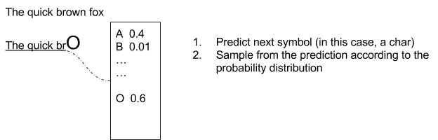

An example of prediction with "The quick brown fox" sentence

一个简单的变体是存储多个预测，因此创建一棵可能的扩展树，如下图所示：

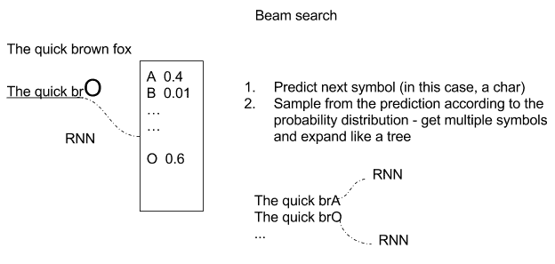

An example of tree prediction with "The quick brown fox" sentence

但是，基于序列的模型可以在大量其他域中使用。 在音乐中，乐曲中的下一个音符肯定取决于前一个音符，而在视频中，电影中的下一个帧必定与前一帧有关。 此外，在某些情况下，当前的视频帧，单词，字符或音符不仅取决于前一个，而且还取决于后一个。

可以使用 RNN 描述基于时间序列的模型，其中对于给定输入`X[i]`，时间为`i`，产生输出`Y[i]`，将时间`[0，i-1]`的以前状态的记忆反馈到网络。 反馈先前状态的想法由循环循环描述，如下图所示：

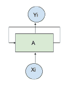； 

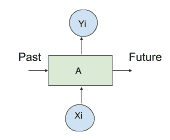

An example of feeding back

循环关系可以方便地通过*展开*网络来表示，如下图所示：

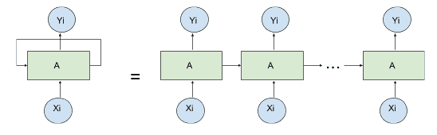

An example of unfolding a recurrent cell

最简单的 RNN 单元由简单的 *tanh* 函数（双曲正切函数）组成，如下图所示：

| 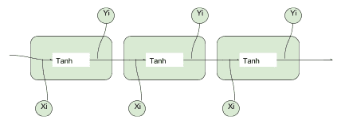 | 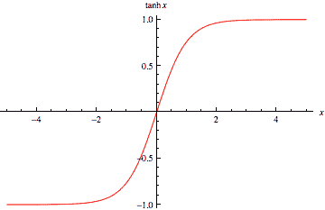 |

An example of simple tanh cell

# 消失和梯度爆炸

训练 RNN 十分困难，因为存在两个稳定性问题。 由于反馈回路的缘故，梯度可能会迅速发散到无穷大，或者它可能会迅速发散到 0。在两种情况下，如下图所示，网络将停止学习任何有用的东西。 可以使用基于**梯度修剪**的相对简单的解决方案来解决梯度爆炸的问题。 梯度消失的问题更难解决，它涉及更复杂的 RNN 基本单元的定义，例如**长短期记忆**（**LSTM**）或**门控循环单元**（**GRU**）。 让我们首先讨论梯度爆炸和梯度裁剪：

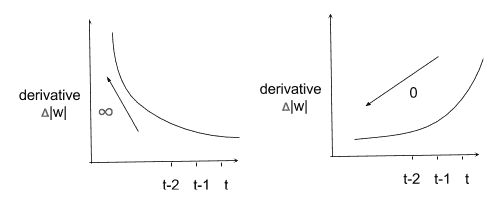

Examples of gradient

**梯度裁剪**包括对梯度施加最大值，以使其无法无限增长。 下图所示的简单解决方案为**梯度爆炸问题提供了简单的解决方案**：

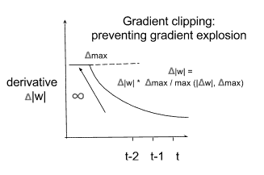

An example of gradient clipping

解决梯度消失的问题需要一种更复杂的内存模型，该模型可以选择性地忘记先前的状态，只记住真正重要的状态。 考虑下图，输入以`[0,1]`中的概率`p`写入存储器`M`中，并乘以加权输入。

以类似的方式，以`[0,1]`中的概率`p`读取输出，将其乘以加权输出。 还有一种可能性用来决定要记住或忘记的事情：

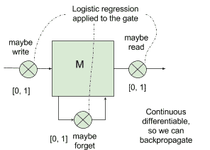

An example of memory cell

# 长短期记忆（LSTM）

LSTM 网络可以控制何时让输入进入神经元，何时记住在上一个时间步中学到的内容以及何时让输出传递到下一个时间戳。 所有这些决定都是自调整的，并且仅基于输入。 乍一看，LSTM 看起来很难理解，但事实并非如此。 让我们用下图来说明它是如何工作的：

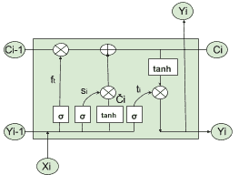

An example of an LSTM cell

首先，我们需要一个逻辑函数σ（请参见第 2 章，“回归”）来计算介于 0 和 1 之间的值，并控制哪些信息流过 *LSTM 门*。 请记住，逻辑函数是可微的，因此允许反向传播。 然后，我们需要一个运算符`⊗`，它采用两个相同维的矩阵并生成另一个矩阵，其中每个元素`ij`是原始两个矩阵的元素`ij`的乘积。 同样，我们需要一个运算符`⊕`，它采用两个相同维度的矩阵并生成另一个矩阵，其中每个元素`ij`是原始两个矩阵的元素`ij`之和。 使用这些基本块，我们考虑时间`i`处的输入`X[i]`，并将其与上一步中的输出`Y[i-1]`并置。

方程`f[t] = σ(W[f] · [y[i-1], x[t]] + b[f])`实现了控制激活门`⊗`的逻辑回归，并用于确定应从*先前*候选值`C[i-1]`获取多少信息。 传递给下一个候选值`C[i]`（此处`W[f]`和`b[f]`矩阵和用于 logistic 回归的偏差）。如果 logistic 输出为 1，则表示*不要忘记*先前的单元格状态`C[i-1]`；如果输出 0， 这将意味着*忘记*先前的单元状态`C[i-1]`。`(0, 1)`中的任何数字都将表示要传递的信息量。

然后我们有两个方程：`s[i] = σ(W[s] · [Y[i-1], x[i]] + b[s])`，用于通过`⊗`控制由当前单元产生的多少信息（`Ĉ[i] = tanh(W [C] · [Y[i-1]， X[i] + b[c])`）应该通过`⊕`运算符添加到下一个候选值`C[i]`中，根据上图中表示的方案。

为了实现与运算符`⊕`和`⊗`所讨论的内容，我们需要另一个方程，其中进行实际的加法`+`和乘法`*`：`C[i] = f[t] * C[i-1] + s[i] * Ĉ[i]`

最后，我们需要确定当前单元格的哪一部分应发送到`Y[i]`输出。 这很简单：我们再进行一次逻辑回归方程，然后通过`⊗`运算来控制应使用哪一部分候选值输出。 在这里，有一点值得关注，使用 *tanh* 函数将输出压缩为`[-1, 1]`。 最新的步骤由以下公式描述：

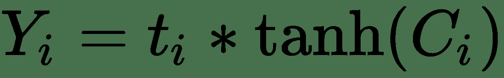

现在，我了解到这看起来像很多数学运算，但有两个好消息。 首先，如果您了解我们想要实现的目标，那么数学部分并不是那么困难。 其次，您可以将 LSTM 单元用作标准 RNN 单元的黑盒替代，并立即获得解决梯度消失问题的好处。 因此，您实际上不需要了解所有数学知识。 您只需从库中获取 TensorFlow LSTM 实现并使用它即可。

# 门控循环单元（GRU）和窥孔 LSTM

近年来提出了许多 LSTM 细胞的变体。 其中两个真的很受欢迎。 窥孔 LSTM 允许栅极层查看单元状态，如下图虚线所示，而**门控循环单元**（**GRU**）合并了隐藏状态和单元状态 进入一个单一的信息渠道。

同样，GRU 和 Peephole LSTM 都可以用作标准 RNN 单元的黑盒插件，而无需了解基础数学。 这两个单元都可用于解决梯度消失的问题，并可用于构建深度神经网络：

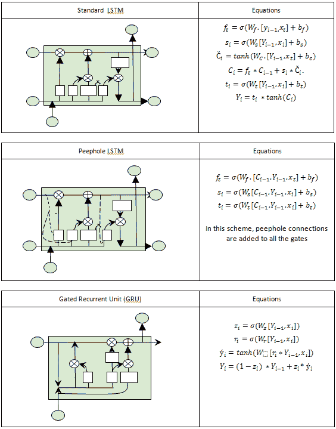

Examples of Standard LSTM, PeepHole LSTM, and GRU

# 对向量序列进行运算

使 RNN 真正强大的是能够对向量序列进行操作的能力，其中 RNN 的输入和/或 RNN 的输出都可以是序列。 下图很好地表示了这一点，其中最左边的示例是传统的（非递归）网络，其后是带有输出序列的 RNN，然后是带有输入序列的 RNN，再是带有序列的 RNN 在不同步序列的输入和输出中，然后是在序列同步的输入和输出中具有序列的 RNN：

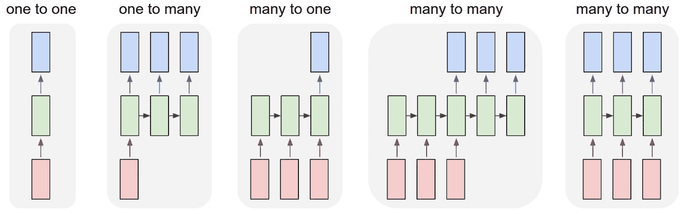

An example of RNN sequences as seen in http://karpathy.github.io/2015/05/21/rnn-effectiveness/

机器翻译是输入和输出中不同步序列的一个示例：网络将输入文本作为序列读取，在读取全文之后，*会输出目标语言*。

视频分类是输入和输出中同步序列的示例：视频输入是帧序列，并且对于每个帧，输出中都提供了分类标签。

如果您想了解有关 RNN 有趣应用的更多信息，则必须阅读 Andrej Karpathy [发布的博客](http://karpathy.github.io/2015/05/21/rnn-effectiveness/)。 他训练了网络，以莎士比亚的风格撰写论文（用 Karpathy 的话说：*几乎*不能从实际的莎士比亚中识别出这些样本），撰写有关虚构主题的现实 Wikipedia 文章，撰写关于愚蠢和不现实问题的现实定理证明（用 Karpathy 的话：*更多的幻觉代数几何*），并写出现实的 Linux 代码片段（用 Karpathy 的话：*他首先建模逐个字符地列举 GNU 许可证，其中包括一些示例，然后生成一些宏，然后深入研究代码*）。

以下示例摘自[这个页面](http://karpathy.github.io/2015/05/21/rnn-effectiveness/)：

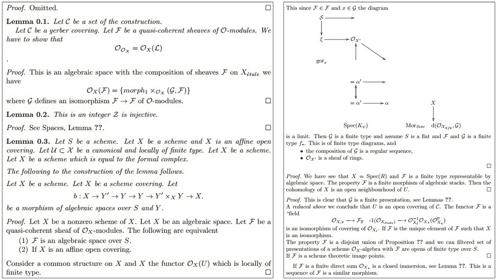

An example of text generated with RNNs

# 神经机器翻译-训练 seq2seq RNN

序列到序列（seq2seq）是 RNN 的一种特殊类型，已成功应用于神经机器翻译，文本摘要和语音识别中。 在本食谱中，我们将讨论如何实现神经机器翻译，其结果与 [Google 神经机器翻译系统](https://research.googleblog.com/2016/09/a-neural-network-for-machine.html)。 关键思想是输入整个文本序列，理解整个含义，然后将翻译输出为另一个序列。 读取整个序列的想法与以前的体系结构大不相同，在先前的体系结构中，将一组固定的单词从一种源语言翻译成目标语言。

本节的灵感来自 [Minh-Thang Luong](https://github.com/lmthang/thesis/blob/master/thesis.pdf) 的 2016 年博士学位论文*神经机器翻译*）。 第一个关键概念是编码器-解码器体系结构的存在，其中编码器将源句子转换为代表含义的向量。 然后，此向量通过解码器以产生翻译。 编码器和解码器都是 RNN，它们可以捕获语言中的长期依赖关系，例如性别协议和语法结构，而无需先验地了解它们，并且不需要跨语言进行 1：1 映射。 这是一种强大的功能，可实现非常流畅的翻译：

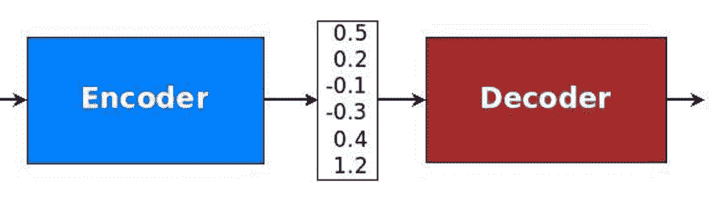

An example of encoder-decoder as seen in https://github.com/lmthang/thesis/blob/master/thesis.pdf

让我们看一个 RNN 的示例，该语句将“她爱可爱的猫咪”翻译成 Elle Aime les chat Mignons。

有两种 RNN：一种充当编码器，另一种充当解码器。 源句“她爱可爱的猫”后跟一个分隔符-目标句是 Elle aime les chats mignons。 这两个连接的句子在输入中提供给编码器进行训练，并且解码器将生成目标目标。 当然，我们需要像这样的多个示例来获得良好的训练：

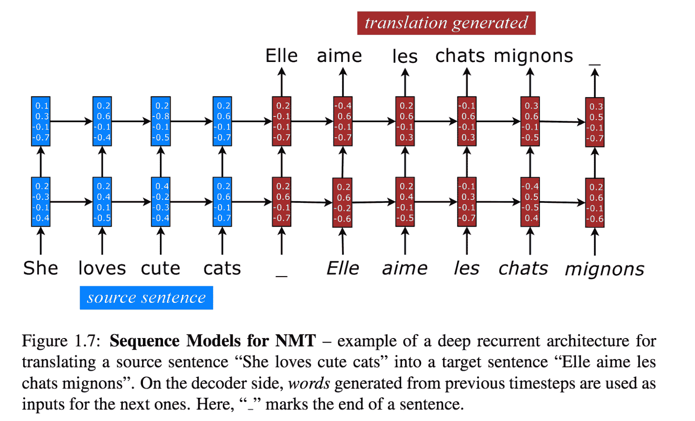

An example of sequence models for NMT as seen in https://github.com/lmthang/thesis/blob/master/thesis.pdf

现在，我们可以拥有许多 RNN 变体。 让我们看看其中的一些：

*   RNN 可以是单向或双向的。 后者将捕捉双方的长期关系。
*   RNN 可以具有多个隐藏层。 选择是关于优化的问题：一方面，更深的网络可以学到更多；另一方面，更深的网络可以学到更多。 另一方面，可能需要很长的时间来训练并且可能会过头。
*   RNN 可以具有一个嵌入层，该层将单词映射到一个嵌入空间中，在该空间中相似的单词恰好被映射得非常近。
*   RNNs 可以使用简单的或者复发的细胞，或 LSTM，或窥视孔 LSTM，或越冬。

仍然参考博士学位论文[神经机器翻译](https://github.com/lmthang/thesis/blob/master/thesis.pdf)，我们可以使用嵌入层来映射 将输入语句放入嵌入空间。 然后，有两个 RNN *粘在一起*——源语言的编码器和目标语言的解码器。 如您所见，存在多个隐藏层，并且有两个流程：前馈垂直方向连接这些隐藏层，水平方向是将知识从上一步转移到下一层的递归部分：

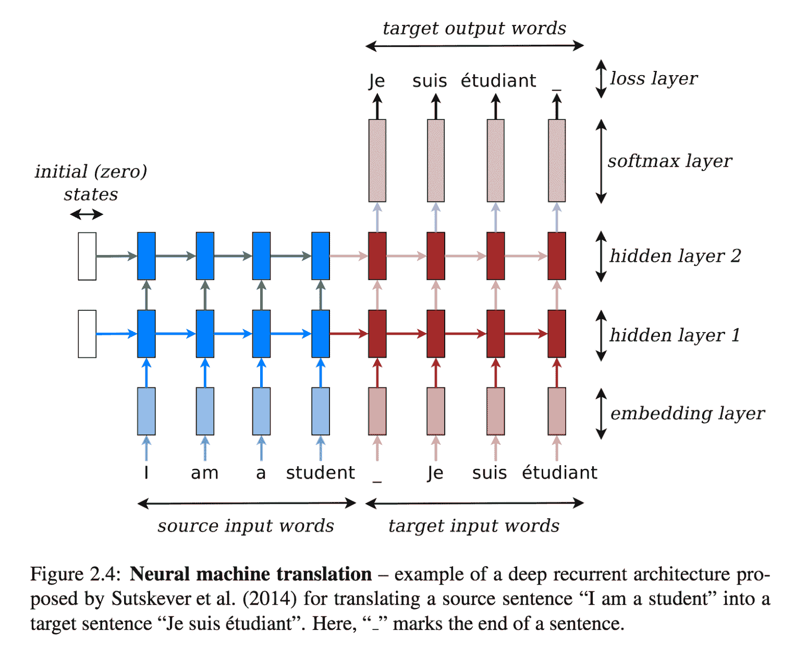

An example of Neural machine translation as seen in https://github.com/lmthang/thesis/blob/master/thesis.pdf

在本食谱中，我们使用 NMT（神经机器翻译），这是一个可在 TensorFlow 顶部在线获得的翻译演示包。

# 做好准备

NMT 可在[这个页面](https://github.com/tensorflow/nmt/)上找到，并且代码在 GitHub 上。

# 怎么做...

我们按以下步骤进行：

1.  从 GitHub 克隆 NMT：

```py
git clone https://github.com/tensorflow/nmt/
```

2.  下载训练数据集。 在这种情况下，我们将使用训练集将越南语翻译为英语。 其他数据集可从[这里](https://nlp.stanford.edu/projects/nmt/)获取其他语言，例如德语和捷克语：

```py
nmt/scripts/download_iwslt15.sh /tmp/nmt_data
```

3.  考虑[这里](https://github.com/tensorflow/nmt/)，我们将定义第一个嵌入层。 嵌入层接受输入，词汇量 V 和输出嵌入空间的所需大小。 词汇量使得仅考虑 V 中最频繁的单词进行嵌入，而所有其他单词都映射到一个常见的*未知*术语。 在我们的例子中，输入是主要时间的，这意味着最大时间是[第一个输入参数](https://www.tensorflow.org/api_docs/python/tf/nn/dynamic_rnn)：

```py
# Embedding
 embedding_encoder = variable_scope.get_variable(
 "embedding_encoder", [src_vocab_size, embedding_size], ...)
 # Look up embedding:
 # encoder_inputs: [max_time, batch_size]
 # encoder_emb_inp: [max_time, batch_size, embedding_size]
 encoder_emb_inp = embedding_ops.embedding_lookup(
 embedding_encoder, encoder_inputs)
```

4.  仍然参考[这里](https://github.com/tensorflow/nmt/)，我们定义了一个简单的编码器，它使用`tf.nn.rnn_cell.BasicLSTMCell(num_units)`作为基本 RNN 单元。 这非常简单，但是要注意，给定基本的 RNN 单元，我们使用[`tf.nn.dynamic_rnn`](https://www.tensorflow.org/api_docs/python/tf/nn/dynamic_rnn)创建 RNN：

```py
# Build RNN cell
 encoder_cell = tf.nn.rnn_cell.BasicLSTMCell(num_units)

 # Run Dynamic RNN
 # encoder_outpus: [max_time, batch_size, num_units]
 # encoder_state: [batch_size, num_units]
 encoder_outputs, encoder_state = tf.nn.dynamic_rnn(
 encoder_cell, encoder_emb_inp,
 sequence_length=source_sequence_length, time_major=True)
```

5.  之后，我们需要定义解码器。 因此，第一件事是拥有一个带有`tf.nn.rnn_cell.BasicLSTMCell`的基本 RNN 单元，然后将其用于创建一个基本采样解码器`tf.contrib.seq2seq.BasicDecoder`，该基本采样解码器将用于与解码器`tf.contrib.seq2seq.dynamic_decode`进行动态解码：

```py
# Build RNN cell
 decoder_cell = tf.nn.rnn_cell.BasicLSTMCell(num_units)
# Helper
 helper = tf.contrib.seq2seq.TrainingHelper(
 decoder_emb_inp, decoder_lengths, time_major=True)
 # Decoder
 decoder = tf.contrib.seq2seq.BasicDecoder(
 decoder_cell, helper, encoder_state,
 output_layer=projection_layer)
 # Dynamic decoding
 outputs, _ = tf.contrib.seq2seq.dynamic_decode(decoder, ...)
 logits = outputs.rnn_output
```

6.  网络的最后一个阶段是 softmax 密集阶段，用于将顶部隐藏状态转换为 logit 向量：

```py
projection_layer = layers_core.Dense(
 tgt_vocab_size, use_bias=False)
```

7.  当然，我们需要定义交叉熵函数和训练阶段使用的损失：

```py
crossent = tf.nn.sparse_softmax_cross_entropy_with_logits(
 labels=decoder_outputs, logits=logits)
 train_loss = (tf.reduce_sum(crossent * target_weights) /
 batch_size)
```

8.  下一步是定义反向传播所需的步骤，并使用适当的优化器（在本例中为 Adam）。 请注意，梯度已被裁剪，Adam 使用预定义的学习率：

```py
# Calculate and clip gradients
 params = tf.trainable_variables()
 gradients = tf.gradients(train_loss, params)
 clipped_gradients, _ = tf.clip_by_global_norm(
 gradients, max_gradient_norm)
# Optimization
 optimizer = tf.train.AdamOptimizer(learning_rate)
 update_step = optimizer.apply_gradients(
 zip(clipped_gradients, params))
```

9.  现在，我们可以运行代码并了解不同的执行步骤。 首先，创建训练图。 然后，训练迭代开始。 用于评估的度量标准是**双语评估研究**（**BLEU**）。 此度量标准是评估已从一种自然语言机器翻译成另一种自然语言的文本质量的标准。 质量被认为是机器与人工输出之间的对应关系。 如您所见，该值随时间增长：

```py
python -m nmt.nmt --src=vi --tgt=en --vocab_prefix=/tmp/nmt_data/vocab --train_prefix=/tmp/nmt_data/train --dev_prefix=/tmp/nmt_data/tst2012 --test_prefix=/tmp/nmt_data/tst2013 --out_dir=/tmp/nmt_model --num_train_steps=12000 --steps_per_stats=100 --num_layers=2 --num_units=128 --dropout=0.2 --metrics=bleu
# Job id 0
[...]
# creating train graph ...
num_layers = 2, num_residual_layers=0
cell 0 LSTM, forget_bias=1 DropoutWrapper, dropout=0.2 DeviceWrapper, device=/gpu:0
cell 1 LSTM, forget_bias=1 DropoutWrapper, dropout=0.2 DeviceWrapper, device=/gpu:0
cell 0 LSTM, forget_bias=1 DropoutWrapper, dropout=0.2 DeviceWrapper, device=/gpu:0
cell 1 LSTM, forget_bias=1 DropoutWrapper, dropout=0.2 DeviceWrapper, device=/gpu:0
start_decay_step=0, learning_rate=1, decay_steps 10000,decay_factor 0.98
[...]
# Start step 0, lr 1, Thu Sep 21 12:57:18 2017
# Init train iterator, skipping 0 elements
global step 100 lr 1 step-time 1.65s wps 3.42K ppl 1931.59 bleu 0.00
global step 200 lr 1 step-time 1.56s wps 3.59K ppl 690.66 bleu 0.00
[...]
global step 9100 lr 1 step-time 1.52s wps 3.69K ppl 39.73 bleu 4.89
global step 9200 lr 1 step-time 1.52s wps 3.72K ppl 40.47 bleu 4.89
global step 9300 lr 1 step-time 1.55s wps 3.62K ppl 40.59 bleu 4.89
[...]
# External evaluation, global step 9000
decoding to output /tmp/nmt_model/output_dev.
done, num sentences 1553, time 17s, Thu Sep 21 17:32:49 2017.
bleu dev: 4.9
saving hparams to /tmp/nmt_model/hparams
# External evaluation, global step 9000
decoding to output /tmp/nmt_model/output_test.
done, num sentences 1268, time 15s, Thu Sep 21 17:33:06 2017.
bleu test: 3.9
saving hparams to /tmp/nmt_model/hparams
[...]
global step 9700 lr 1 step-time 1.52s wps 3.71K ppl 38.01 bleu 4.89
```

# 这个怎么运作...

所有上述代码已在[这个页面](https://github.com/tensorflow/nmt/blob/master/nmt/model.py)中定义。 关键思想是将两个 RNN *打包在一起*。 第一个是编码器，它在嵌入空间中工作，非常紧密地映射相似的单词。 编码器*理解*训练示例的含义，并产生张量作为输出。 然后只需将编码器的最后一个隐藏层连接到解码器的初始层，即可将该张量传递给解码器。 注意学习是由于我们基于基于与`labels=decoder_outputs`的交叉熵的损失函数而发生的。

该代码学习如何翻译，并通过 BLEU 度量标准通过迭代跟踪进度，如下图所示：


An example of BLEU metric in Tensorboard

# 神经机器翻译-推理 seq2seq RNN

在此配方中，我们使用先前配方的结果将源语言转换为目标语言。 这个想法非常简单：给源语句提供两个组合的 RNN（编码器+解码器）作为输入。 句子一结束，解码器将产生对率值，我们*贪婪地*产生与最大值关联的单词。 例如，从解码器产生单词`moi`作为第一个令牌，因为该单词具有最大对率值。 之后，会产生单词`suis`，依此类推：

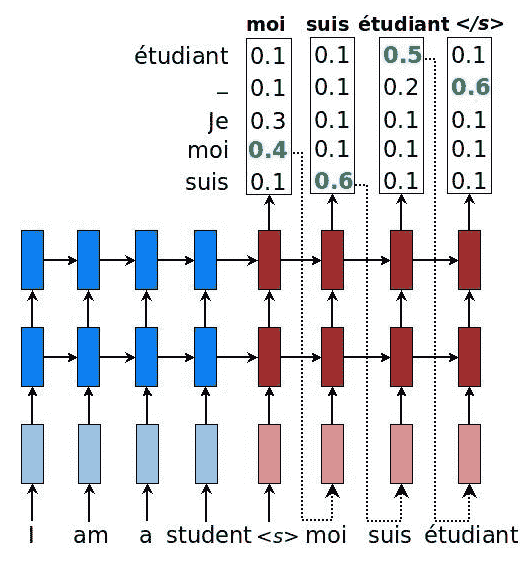

An example of sequence models for NMT with probabilities as seen in https://github.com/lmthang/thesis/blob/master/thesis.pdf

使用解码器的输出有多种策略：

*   **贪婪**：产生与最大对率对应的字
*   **采样**：通过对对率产生的对率进行采样来产生单词
*   **集束搜索**：一个以上的预测，因此创建了可能的扩展树

# 怎么做...

我们按以下步骤进行：

1.  定义用于对解码器进行采样的贪婪策略。 这很容易，因为我们可以使用`tf.contrib.seq2seq.GreedyEmbeddingHelper`中定义的库。 由于我们不知道目标句子的确切长度，因此我们将启发式方法限制为最大长度为源句子长度的两倍：

```py
# Helper
 helper = tf.contrib.seq2seq.GreedyEmbeddingHelper(
 embedding_decoder,
 tf.fill([batch_size], tgt_sos_id), tgt_eos_id)

 # Decoder
 decoder = tf.contrib.seq2seq.BasicDecoder(
 decoder_cell, helper, encoder_state,
 output_layer=projection_layer)
 # Dynamic decoding
 outputs, _ = tf.contrib.seq2seq.dynamic_decode(
 decoder, maximum_iterations=maximum_iterations)
 translations = outputs.sample_id
maximum_iterations = tf.round(tf.reduce_max(source_sequence_length) * 2)
```

2.  现在，我们可以运行网络，输入一个从未见过的句子（`inference_input_file=/tmp/my_infer_file`），然后让网络翻译结果（`inference_output_file=/tmp/nmt_model/output_infer`）：

```py
python -m nmt.nmt \
 --out_dir=/tmp/nmt_model \
 --inference_input_file=/tmp/my_infer_file.vi \
 --inference_output_file=/tmp/nmt_model/output_infer
```

# 这个怎么运作...

将两个 RNN *打包在一起*，以形成编码器-解码器 RNN 网络。 解码器产生 logit，然后将其贪婪地转换为目标语言的单词。 例如，此处显示了从越南语到英语的自动翻译：

*   **用英语输入的句子**：小时候，我认为朝鲜是世界上最好的国家，我经常唱歌&。 我们没有什么可嫉妒的。
*   **翻译成英语的输出句子**：当我非常好时，我将去了解最重要的事情，而我不确定该说些什么。

# 您只需要关注-seq2seq RNN 的另一个示例

在本食谱中，我们介绍了[**注意**方法](https://arxiv.org/abs/1409.0473)（Dzmitry Bahdanau，Kyunghyun Cho 和 Yoshua Bengio，ICLR 2015），这是神经网络翻译的最新解决方案。 ，它包括在编码器和解码器 RNN 之间添加其他连接。 实际上，仅将解码器与编码器的最新层连接会带来信息瓶颈，并且不一定允许通过先前的编码器层获取的信息通过。 下图说明了采用的解决方案：


An example of attention model for NMT as seen in https://github.com/lmthang/thesis/blob/master/thesis.pdf

需要考虑三个方面：

*   首先，将当前目标隐藏状态与所有先前的源状态一起使用以得出注意力权重，该注意力权重用于或多或少地关注序列中先前看到的标记
*   其次，创建上下文向量以汇总注意权重的结果
*   第三，将上下文向量与当前目标隐藏状态组合以获得注意力向量

# 怎么做...

我们按以下步骤进行：

1.  使用库`tf.contrib.seq2seq.LuongAttention`定义注意力机制，该库实现了 Minh-Thang Luong，Hieu Pham 和 Christopher D. Manning（2015 年）在*基于注意力的神经机器翻译有效方法*中定义的注意力模型：

```py
# attention_states: [batch_size, max_time, num_units]
 attention_states = tf.transpose(encoder_outputs, [1, 0, 2])

 # Create an attention mechanism
 attention_mechanism = tf.contrib.seq2seq.LuongAttention(
 num_units, attention_states,
 memory_sequence_length=source_sequence_length)
```

2.  通过注意包装器，将定义的注意机制用作解码器单元周围的包装器：

```py
decoder_cell = tf.contrib.seq2seq.AttentionWrapper(
 decoder_cell, attention_mechanism,
 attention_layer_size=num_units)
```

3.  运行代码以查看结果。 我们立即注意到，注意力机制在 BLEU 得分方面产生了显着改善：

```py
python -m nmt.nmt \
> --attention=scaled_luong \
> --src=vi --tgt=en \
> --vocab_prefix=/tmp/nmt_data/vocab \
> --train_prefix=/tmp/nmt_data/train \
> --dev_prefix=/tmp/nmt_data/tst2012 \
> --test_prefix=/tmp/nmt_data/tst2013 \
> --out_dir=/tmp/nmt_attention_model \
> --num_train_steps=12000 \
> --steps_per_stats=100 \
> --num_layers=2 \
> --num_units=128 \
> --dropout=0.2 \
> --metrics=bleu
[...]
# Start step 0, lr 1, Fri Sep 22 22:49:12 2017
# Init train iterator, skipping 0 elements
global step 100 lr 1 step-time 1.71s wps 3.23K ppl 15193.44 bleu 0.00
[...]
# Final, step 12000 lr 0.98 step-time 1.67 wps 3.37K ppl 14.64, dev ppl 14.01, dev bleu 15.9, test ppl 12.58, test bleu 17.5, Sat Sep 23 04:35:42 2017
# Done training!, time 20790s, Sat Sep 23 04:35:42 2017.
# Start evaluating saved best models.
[..]
loaded infer model parameters from /tmp/nmt_attention_model/best_bleu/translate.ckpt-12000, time 0.06s
# 608
src: nhưng bạn biết điều gì không ?
ref: But you know what ?
nmt: But what do you know ?
[...]
# Best bleu, step 12000 step-time 1.67 wps 3.37K, dev ppl 14.01, dev bleu 15.9, test ppl 12.58, test bleu 17.5, Sat Sep 23 04:36:35 2017
```

# 这个怎么运作...

注意是一种机制，该机制使用由编码器 RNN 的内部状态获取的信息，并将该信息与解码器的最终状态进行组合。 关键思想是，通过这种方式，有可能或多或少地关注源序列中的某些标记。 下图显示了 BLEU 得分，引起了关注。

我们注意到，相对于我们第一个配方中未使用任何注意的图表而言，它具有明显的优势：

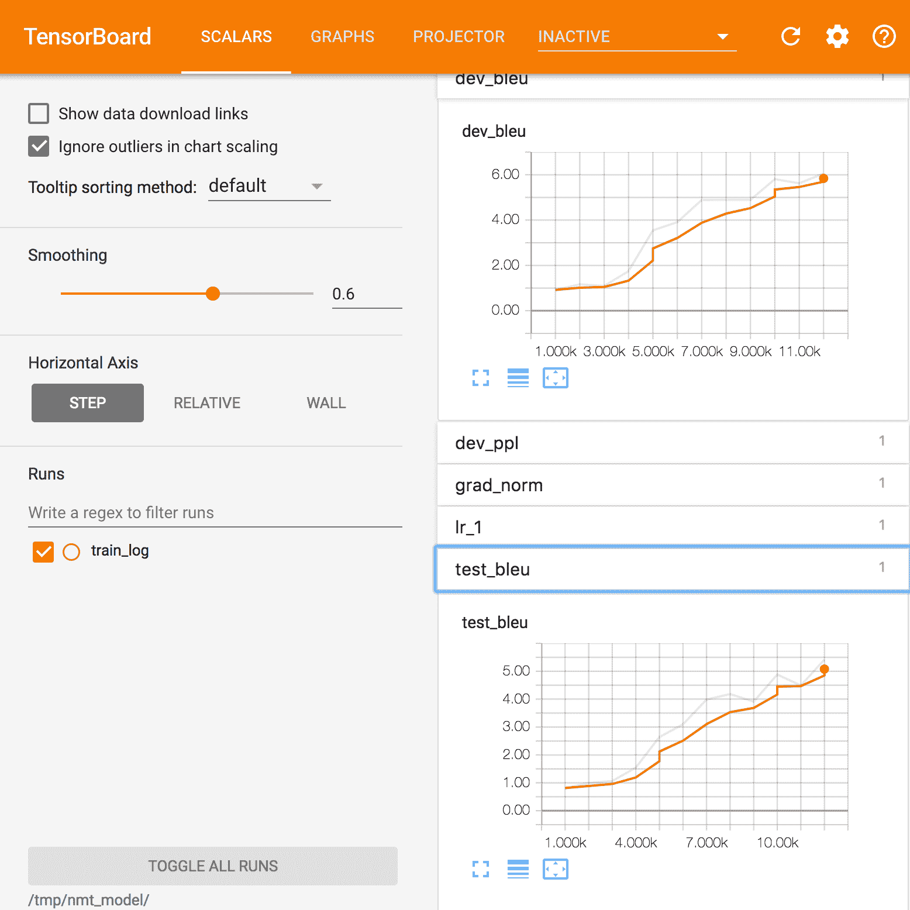

An example of BLEU metrics with attention in Tensorboard

# 还有更多...

值得记住的是 seq2seq 不仅可以用于机器翻译。 让我们看一些例子：

*   Lukasz Kaiser 在[作为外语的语法](https://arxiv.org/abs/1412.7449)中，使用 seq2seq 模型来构建选区解析器。 选区分析树将文本分为多个子短语。 树中的非终结符是短语的类型，终结符是句子中的单词，并且边缘未标记。
*   seq2seq 的另一个应用是 SyntaxNet，又名 Parsey McParserFace（[语法分析器](https://research.googleblog.com/2016/05/announcing-syntaxnet-worlds-most.html)），它是 许多 NLU 系统中的关键第一组件。 给定一个句子作为输入，它将使用描述单词的句法功能的**词性**（**POS**）标签标记每个单词，并确定单词中句法之间的句法关系 句子，在依存关系分析树中表示。 这些句法关系与所讨论句子的潜在含义直接相关。

下图使我们对该概念有了一个很好的了解：

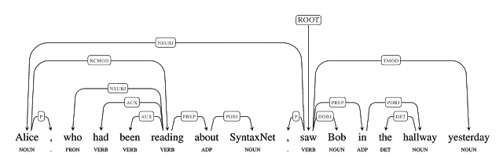

An example of SyntaxNet as seen in https://research.googleblog.com/2016/05/announcing-syntaxnet-worlds-most.html

# 通过 RNN 学习写作莎士比亚

在本食谱中，我们将学习如何生成与威廉·莎士比亚（William Shakespeare）相似的文本。 关键思想很简单：我们将莎士比亚写的真实文本作为输入，并将其作为输入 RNN 的输入，该 RNN 将学习序列。 然后将这种学习用于生成新文本，该文本看起来像最伟大的作家用英语撰写的文本。

为了简单起见，我们将使用框架 [TFLearn](http://tflearn.org/)，它在 TensorFlow 上运行。 此示例是标准分发版的一部分，[可从以下位置获得](https://github.com/tflearn/tflearn/blob/master/examples/nlp/lstm_generator_shakespeare.py)。开发的模型是 RNN 字符级语言模型，其中考虑的序列是字符序列而不是单词序列。

# 怎么做...

我们按以下步骤进行：

1.  使用`pip`安装 TFLearn：

```py
pip install -I tflearn
```

2.  导入许多有用的模块并下载一个由莎士比亚撰写的文本示例。 在这种情况下，我们使用[这个页面](https://raw.githubusercontent.com/tflearn/tflearn.github.io/master/resources/shakespeare_input.txt)中提供的一种：

```py
import os
import pickle
from six.moves import urllib
import tflearn
from tflearn.data_utils import *
path = "shakespeare_input.txt"
char_idx_file = 'char_idx.pickle'
if not os.path.isfile(path): urllib.request.urlretrieve("https://raw.githubusercontent.com/tflearn/tflearn.github.io/master/resources/shakespeare_input.txt", path)
```

3.  使用`string_to_semi_redundant_sequences()`将输入的文本转换为向量，并返回解析的序列和目标以及相关的字典，该函数将返回一个元组（输入，目标，字典）：

```py
maxlen = 25
char_idx = None
if os.path.isfile(char_idx_file):
print('Loading previous char_idx')
char_idx = pickle.load(open(char_idx_file, 'rb'))
X, Y, char_idx = \
textfile_to_semi_redundant_sequences(path, seq_maxlen=maxlen, redun_step=3,
pre_defined_char_idx=char_idx)
pickle.dump(char_idx, open(char_idx_file,'wb'))
```

4.  定义一个由三个 LSTM 组成的 RNN，每个 LSTM 都有 512 个节点，并返回完整序列，而不是仅返回最后一个序列输出。 请注意，我们使用掉线模块连接 LSTM 模块的可能性为 50％。 最后一层是密集层，其应用 softmax 的长度等于字典大小。 损失函数为`categorical_crossentropy`，优化器为 Adam：

```py
g = tflearn.input_data([None, maxlen, len(char_idx)])
g = tflearn.lstm(g, 512, return_seq=True)
g = tflearn.dropout(g, 0.5)
g = tflearn.lstm(g, 512, return_seq=True)
g = tflearn.dropout(g, 0.5)
g = tflearn.lstm(g, 512)
g = tflearn.dropout(g, 0.5)
g = tflearn.fully_connected(g, len(char_idx), activation='softmax')
g = tflearn.regression(g, optimizer='adam', loss='categorical_crossentropy',
learning_rate=0.001)
```

5.  给定步骤 4 中定义的网络，我们现在可以使用库`flearn.models.generator.SequenceGenerator`（`network`，`dictionary=char_idx, seq_maxlen=maxle`和`clip_gradients=5.0, checkpoint_path='model_shakespeare'`）生成序列：

```py
m = tflearn.SequenceGenerator(g, dictionary=char_idx,
seq_maxlen=maxlen,
clip_gradients=5.0,
checkpoint_path='model_shakespeare')
```

6.  对于 50 次迭代，我们从输入文本中获取随机序列，然后生成一个新文本。 温度正在控制所创建序列的新颖性； 温度接近 0 看起来像用于训练的样本，而温度越高，新颖性越强：

```py
for i in range(50):
seed = random_sequence_from_textfile(path, maxlen)
m.fit(X, Y, validation_set=0.1, batch_size=128,
n_epoch=1, run_id='shakespeare')
print("-- TESTING...")
print("-- Test with temperature of 1.0 --")
print(m.generate(600, temperature=1.0, seq_seed=seed))
print("-- Test with temperature of 0.5 --")
print(m.generate(600, temperature=0.5, seq_seed=seed))
```

# 这个怎么运作...

当新的未知或被遗忘的艺术品要归功于作者时，有著名的学者将其与作者的其他作品进行比较。 学者们要做的是在著名作品的文本序列中找到共同的模式，希望在未知作品中找到相似的模式。

这种方法的工作方式相似：RNN 了解莎士比亚作品中最特殊的模式是什么，然后将这些模式用于生成新的，从未见过的文本，这些文本很好地代表了最伟大的英语作者的风格。

让我们看一些执行示例：

```py
python shakespeare.py
Loading previous char_idx
Vectorizing text...
Text total length: 4,573,338
Distinct chars : 67
Total sequences : 1,524,438
---------------------------------
Run id: shakespeare
Log directory: /tmp/tflearn_logs/
```

# 第一次迭代

在这里，网络正在学习一些基本结构，包括需要建立有关虚构字符（`DIA`，`SURYONT`，`HRNTLGIPRMAR`和`ARILEN`）的对话。 但是，英语仍然很差，很多单词不是真正的英语：

```py
---------------------------------
Training samples: 1371994
Validation samples: 152444
--
Training Step: 10719 | total loss: 2.22092 | time: 22082.057s
| Adam | epoch: 001 | loss: 2.22092 | val_loss: 2.12443 -- iter: 1371994/1371994
-- TESTING...
-- Test with temperature of 1.0 --
'st thou, malice?
If thou caseghough memet oud mame meard'ke. Afs weke wteak, Dy ny wold' as to of my tho gtroy ard has seve, hor then that wordith gole hie, succ, caight fom?
DIA:
A gruos ceen, I peey
by my
Wiouse rat Sebine would.
waw-this afeean.
SURYONT:
Teeve nourterong a oultoncime bucice'is furtutun
Ame my sorivass; a mut my peant?
Am:
Fe, that lercom ther the nome, me, paatuy corns wrazen meas ghomn'ge const pheale,
As yered math thy vans:
I im foat worepoug and thit mije woml!
HRNTLGIPRMAR:
I'd derfomquesf thiy of doed ilasghele hanckol, my corire-hougangle!
Kiguw troll! you eelerd tham my fom Inow lith a
-- Test with temperature of 0.5 --
'st thou, malice?
If thou prall sit I har, with and the sortafe the nothint of the fore the fir with with the ceme at the ind the couther hit yet of the sonsee in solles and that not of hear fore the hath bur.
ARILEN:
More you a to the mare me peod sore,
And fore string the reouck and and fer to the so has the theat end the dore; of mall the sist he the bot courd wite be the thoule the to nenge ape and this not the the ball bool me the some that dears,
The be to the thes the let the with the thear tould fame boors and not to not the deane fere the womour hit muth so thand the e meentt my to the treers and woth and wi
```

# 经过几次迭代

在这里，网络开始学习对话的正确结构，并且使用`Well, there shall the things to need the offer to our heart`和`There is not that be so then to the death To make the body and all the mind`这样的句子，书面英语看起来更正确：

```py
---------------------------------
Training samples: 1371994
Validation samples: 152444
--
Training Step: 64314 | total loss: 1.44823 | time: 21842.362s
| Adam | epoch: 006 | loss: 1.44823 | val_loss: 1.40140 -- iter: 1371994/1371994
--
-- Test with temperature of 0.5 --
in this kind.
THESEUS:
There is not that be so then to the death
To make the body and all the mind.
BENEDICK:
Well, there shall the things to need the offer to our heart,
To not are he with him: I have see the hands are to true of him that I am not,
The whom in some the fortunes,
Which she were better not to do him?
KING HENRY VI:
I have some a starter, and and seen the more to be the boy, and be such a plock and love so say, and I will be his entire,
And when my masters are a good virtues,
That see the crown of our worse,
This made a called grace to hear him and an ass,
And the provest and stand,
```

# 还有更多...

博客文章[循环神经网络的不合理有效性](http://karpathy.github.io/2015/05/21/rnn-effectiveness/)描述了一组引人入胜的示例 RNN 字符级语言模型，包括以下内容：

*   莎士比亚文字生成类似于此示例
*   Wikipedia 文本生成类似于此示例，但是基于不同的训练文本
*   代数几何（LaTex）文本生成类似于此示例，但基于不同的训练文本
*   Linux 源代码文本的生成与此示例相似，但是基于不同的训练文本
*   婴儿命名文本的生成与此示例类似，但是基于不同的训练文本

# 学习使用 RNN 预测未来的比特币价值

在本食谱中，我们将学习如何使用 RNN 预测未来的比特币价值。 关键思想是，过去观察到的值的时间顺序可以很好地预测未来的值。 对于此食谱，我们将使用 MIT 许可下的[这个页面](https://github.com/guillaume-chevalier/seq2seq-signal-prediction)上提供的代码。 给定时间间隔的比特币值通过 API 从[这里](https://www.coindesk.com/api/)下载。 这是 API 文档的一部分：

```py
We offer historical data from our Bitcoin Price Index through the following endpoint: https://api.coindesk.com/v1/bpi/historical/close.json By default, this will return the previous 31 days' worth of data. This endpoint accepts the following optional parameters: ?index=[USD/CNY]The index to return data for. Defaults to USD. ?currency=<VALUE>The currency to return the data in, specified in ISO 4217 format. Defaults to USD. ?start=<VALUE>&end=<VALUE> Allows data to be returned for a specific date range. Must be listed as a pair of start and end parameters, with dates supplied in the YYYY-MM-DD format, e.g. 2013-09-01 for September 1st, 2013. ?for=yesterday Specifying this will return a single value for the previous day. Overrides the start/end parameter. Sample Request: https://api.coindesk.com/v1/bpi/historical/close.json?start=2013-09-01&end=2013-09-05 Sample JSON Response: {"bpi":{"2013-09-01":128.2597,"2013-09-02":127.3648,"2013-09-03":127.5915,"2013-09-04":120.5738,"2013-09-05":120.5333},"disclaimer":"This data was produced from the CoinDesk Bitcoin Price Index. BPI value data returned as USD.","time":{"updated":"Sep 6, 2013 00:03:00 UTC","updatedISO":"2013-09-06T00:03:00+00:00"}}
```

# 怎么做...

这是我们进行食谱的方法：

1.  克隆以下 GitHub 存储库。 这是一个鼓励用户尝试使用 seq2seq 神经网络体系结构的项目：

```py
git clone https://github.com/guillaume-chevalier/seq2seq-signal-prediction.git
```

2.  给定前面的存储库，请考虑以下函数，这些函数可加载和标准化 USD 或 EUR 比特币值的比特币历史数据。 这些功能在`dataset.py`中定义。 训练和测试数据根据 80/20 规则分开。 因此，测试数据的 20％是最新的历史比特币值。 每个示例在要素轴/维度中包含 40 个 USD 数据点，然后包含 EUR 数据。 根据平均值和标准偏差对数据进行归一化。 函数`generate_x_y_data_v4`生成大小为`batch_size`的训练数据（分别是测试数据）的随机样本：

```py
def loadCurrency(curr, window_size):
   """
   Return the historical data for the USD or EUR bitcoin value. Is done with an web API call.
   curr = "USD" | "EUR"
   """
   # For more info on the URL call, it is inspired by :
   # https://github.com/Levino/coindesk-api-node
   r = requests.get(
       "http://api.coindesk.com/v1/bpi/historical/close.json?start=2010-07-17&end=2017-03-03&currency={}".format(
           curr
       )
   )
   data = r.json()
   time_to_values = sorted(data["bpi"].items())
   values = [val for key, val in time_to_values]
   kept_values = values[1000:]
   X = []
   Y = []
   for i in range(len(kept_values) - window_size * 2):
       X.append(kept_values[i:i + window_size])
       Y.append(kept_values[i + window_size:i + window_size * 2])
   # To be able to concat on inner dimension later on:
   X = np.expand_dims(X, axis=2)
   Y = np.expand_dims(Y, axis=2)
   return X, Y
def normalize(X, Y=None):
   """
   Normalise X and Y according to the mean and standard
deviation of the X values only.
   """
   # # It would be possible to normalize with last rather than mean, such as:
   # lasts = np.expand_dims(X[:, -1, :], axis=1)
   # assert (lasts[:, :] == X[:, -1, :]).all(), "{}, {}, {}. {}".format(lasts[:, :].shape, X[:, -1, :].shape, lasts[:, :], X[:, -1, :])
   mean = np.expand_dims(np.average(X, axis=1) + 0.00001, axis=1)
   stddev = np.expand_dims(np.std(X, axis=1) + 0.00001, axis=1)
   # print (mean.shape, stddev.shape)
   # print (X.shape, Y.shape)
   X = X - mean
   X = X / (2.5 * stddev)
   if Y is not None:
       assert Y.shape == X.shape, (Y.shape, X.shape)
       Y = Y - mean
       Y = Y / (2.5 * stddev)
       return X, Y
   return X

def fetch_batch_size_random(X, Y, batch_size):
   """
   Returns randomly an aligned batch_size of X and Y among all examples.
   The external dimension of X and Y must be the batch size
(eg: 1 column = 1 example).
   X and Y can be N-dimensional.
   """
   assert X.shape == Y.shape, (X.shape, Y.shape)
   idxes = np.random.randint(X.shape[0], size=batch_size)
   X_out = np.array(X[idxes]).transpose((1, 0, 2))
   Y_out = np.array(Y[idxes]).transpose((1, 0, 2))
   return X_out, Y_out
X_train = []
Y_train = []
X_test = []
Y_test = []

def generate_x_y_data_v4(isTrain, batch_size):
   """
   Return financial data for the bitcoin.
   Features are USD and EUR, in the internal dimension.
   We normalize X and Y data according to the X only to not
   spoil the predictions we ask for.
   For every window (window or seq_length), Y is the prediction following X.
   Train and test data are separated according to the 80/20
rule.
   Therefore, the 20 percent of the test data are the most
   recent historical bitcoin values. Every example in X contains
   40 points of USD and then EUR data in the feature axis/dimension.
   It is to be noted that the returned X and Y has the same shape
   and are in a tuple.
   """
   # 40 pas values for encoder, 40 after for decoder's predictions.
   seq_length = 40
   global Y_train
   global X_train
   global X_test
   global Y_test
   # First load, with memoization:
   if len(Y_test) == 0:
       # API call:
       X_usd, Y_usd = loadCurrency("USD",
window_size=seq_length)
       X_eur, Y_eur = loadCurrency("EUR",
window_size=seq_length)
       # All data, aligned:
       X = np.concatenate((X_usd, X_eur), axis=2)
       Y = np.concatenate((Y_usd, Y_eur), axis=2)
       X, Y = normalize(X, Y)
       # Split 80-20:
       X_train = X[:int(len(X) * 0.8)]
       Y_train = Y[:int(len(Y) * 0.8)]
       X_test = X[int(len(X) * 0.8):]
       Y_test = Y[int(len(Y) * 0.8):]
   if isTrain:
       return fetch_batch_size_random(X_train, Y_train, batch_size)
   else:
       return fetch_batch_size_random(X_test,  Y_test,  batch_size)
```

3.  生成训练，验证和测试数据，并定义许多超参数，例如`batch_size`，`hidden_dim`（RNN 中隐藏的神经元的数量）和`layers_stacked_count`（堆叠的循环细胞的数量）。 此外，定义一些参数以微调优化器，例如优化器的学习率，迭代次数，用于优化器模拟退火的`lr_decay`，优化器的动量以及避免过度拟合的 L2 正则化。 请注意，GitHub 存储库具有默认的`batch_size = 5`和`nb_iters = 150`，但使用`batch_size = 1000`和`nb_iters = 100000`获得了更好的结果：

```py
from datasets import generate_x_y_data_v4
generate_x_y_data = generate_x_y_data_v4
import tensorflow as tf  
import numpy as np
import matplotlib.pyplot as plt
%matplotlib inline
sample_x, sample_y = generate_x_y_data(isTrain=True, batch_size=3)
print("Dimensions of the dataset for 3 X and 3 Y training
examples : ")
print(sample_x.shape)
print(sample_y.shape)
print("(seq_length, batch_size, output_dim)")
print sample_x, sample_y
# Internal neural network parameters
seq_length = sample_x.shape[0]  # Time series will have the same past and future (to be predicted) lenght.
batch_size = 5  # Low value used for live demo purposes - 100 and 1000 would be possible too, crank that up!
output_dim = input_dim = sample_x.shape[-1]  # Output dimension (e.g.: multiple signals at once, tied in time)
hidden_dim = 12  # Count of hidden neurons in the recurrent units.
layers_stacked_count = 2  # Number of stacked recurrent cells, on the neural depth axis.
# Optmizer:
learning_rate = 0.007  # Small lr helps not to diverge during training.
nb_iters = 150  # How many times we perform a training step (therefore how many times we show a batch).
lr_decay = 0.92  # default: 0.9 . Simulated annealing.
momentum = 0.5  # default: 0.0 . Momentum technique in weights update
lambda_l2_reg = 0.003  # L2 regularization of weights - avoids overfitting
```

4.  将网络定义为由基本 GRU 单元组成的编码器/解码器。 该网络由`layers_stacked_count=2` RNN 组成，我们将使用 TensorBoard 可视化该网络。 请注意，`hidden_dim = 12`是递归单位中的隐藏神经元：

```py
tf.nn.seq2seq = tf.contrib.legacy_seq2seq
tf.nn.rnn_cell = tf.contrib.rnn
tf.nn.rnn_cell.GRUCell = tf.contrib.rnn.GRUCell
tf.reset_default_graph()
# sess.close()
sess = tf.InteractiveSession()
with tf.variable_scope('Seq2seq'):
   # Encoder: inputs
   enc_inp = [
       tf.placeholder(tf.float32, shape=(None, input_dim), name="inp_{}".format(t))
          for t in range(seq_length)
   ]
   # Decoder: expected outputs
   expected_sparse_output = [
       tf.placeholder(tf.float32, shape=(None, output_dim), name="expected_sparse_output_".format(t))
         for t in range(seq_length)
   ]

   # Give a "GO" token to the decoder.
   # You might want to revise what is the appended value "+ enc_inp[:-1]".
   dec_inp = [ tf.zeros_like(enc_inp[0], dtype=np.float32, name="GO") ] + enc_inp[:-1]
   # Create a `layers_stacked_count` of stacked RNNs (GRU cells here).
   cells = []
   for i in range(layers_stacked_count):
       with tf.variable_scope('RNN_{}'.format(i)):
           cells.append(tf.nn.rnn_cell.GRUCell(hidden_dim))
           # cells.append(tf.nn.rnn_cell.BasicLSTMCell(...))
   cell = tf.nn.rnn_cell.MultiRNNCell(cells)   
   # For reshaping the input and output dimensions of the seq2seq RNN:
   w_in = tf.Variable(tf.random_normal([input_dim, hidden_dim]))
   b_in = tf.Variable(tf.random_normal([hidden_dim], mean=1.0))
   w_out = tf.Variable(tf.random_normal([hidden_dim, output_dim]))
   b_out = tf.Variable(tf.random_normal([output_dim]))   
reshaped_inputs = [tf.nn.relu(tf.matmul(i, w_in) + b_in) for i in enc_inp]   
# Here, the encoder and the decoder uses the same cell, HOWEVER,
   # the weights aren't shared among the encoder and decoder, we have two
   # sets of weights created under the hood according to that function's def.

   dec_outputs, dec_memory = tf.nn.seq2seq.basic_rnn_seq2seq(
       enc_inp,
       dec_inp,
       cell
   )   

output_scale_factor = tf.Variable(1.0, name="Output_ScaleFactor")
   # Final outputs: with linear rescaling similar to batch norm,
   # but without the "norm" part of batch normalization hehe.
   reshaped_outputs = [output_scale_factor*(tf.matmul(i, w_out) + b_out) for i in dec_outputs]  
   # Merge all the summaries and write them out to /tmp/bitcoin_logs (by default)
   merged = tf.summary.merge_all()
   train_writer = tf.summary.FileWriter('/tmp/bitcoin_logs',                                     sess.graph)
```

5.  现在让我们运行 TensorBoard 并可视化由 RNN 编码器和 RNN 解码器组成的网络：

```py
tensorboard --logdir=/tmp/bitcoin_logs
```

以下是代码流程：

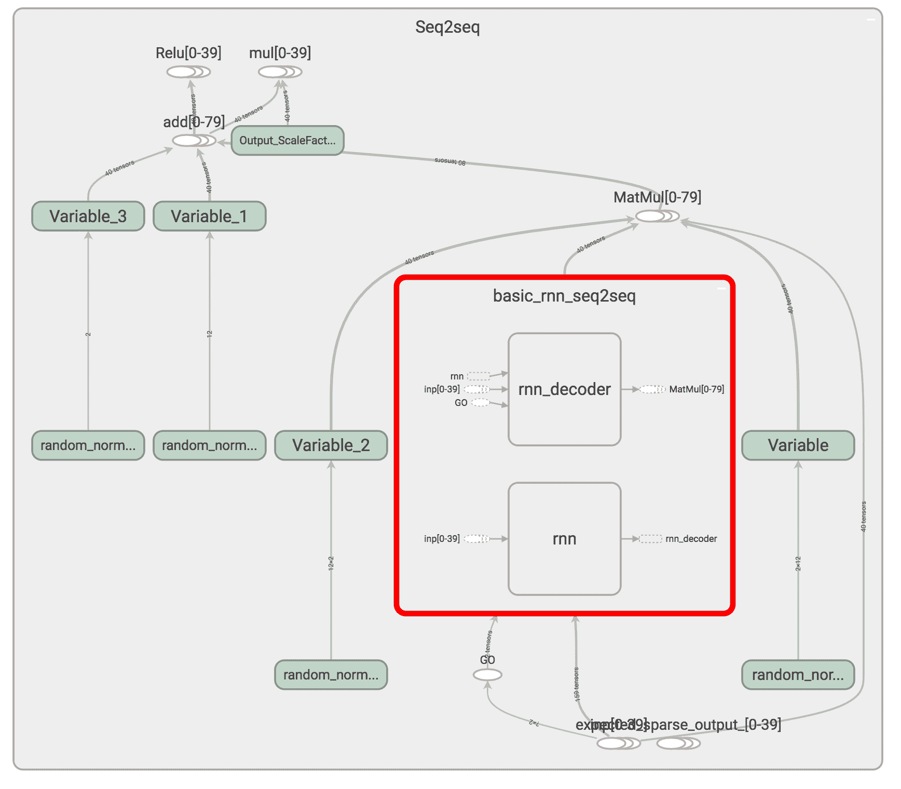

An example of code for Bitcoin value prediction as seen in Tensorboard

6.  现在让我们将损失函数定义为具有正则化的 L2 损失，以避免过度拟合并获得更好的泛化。 选择的优化器是 RMSprop，其值为`learning_rate`，衰减和动量，如步骤 3 所定义：

```py
# Training loss and optimizer
with tf.variable_scope('Loss'):
   # L2 loss
   output_loss = 0
   for _y, _Y in zip(reshaped_outputs, expected_sparse_output):
       output_loss += tf.reduce_mean(tf.nn.l2_loss(_y - _Y))       
  # L2 regularization (to avoid overfitting and to have a  better generalization capacity)
   reg_loss = 0
   for tf_var in tf.trainable_variables():
       if not ("Bias" in tf_var.name or "Output_" in tf_var.name):
           reg_loss += tf.reduce_mean(tf.nn.l2_loss(tf_var))

   loss = output_loss + lambda_l2_reg * reg_loss

with tf.variable_scope('Optimizer'):
   optimizer = tf.train.RMSPropOptimizer(learning_rate, decay=lr_decay, momentum=momentum)
   train_op = optimizer.minimize(loss)
```

7.  通过生成训练数据并在数据集中的`batch_size`示例上运行优化器来为批量训练做准备。 同样，通过从数据集中的`batch_size`示例生成测试数据来准备测试。 训练针对`nb_iters+1`迭代进行，每十个迭代中的一个用于测试结果：

```py
def train_batch(batch_size):
   """
   Training step that optimizes the weights
   provided some batch_size X and Y examples from the dataset.
   """
   X, Y = generate_x_y_data(isTrain=True, batch_size=batch_size)
   feed_dict = {enc_inp[t]: X[t] for t in range(len(enc_inp))}
   feed_dict.update({expected_sparse_output[t]: Y[t] for t in range(len(expected_sparse_output))})
   _, loss_t = sess.run([train_op, loss], feed_dict)
   return loss_t

def test_batch(batch_size):
   """
   Test step, does NOT optimizes. Weights are frozen by not
   doing sess.run on the train_op.
   """
   X, Y = generate_x_y_data(isTrain=False, batch_size=batch_size)
   feed_dict = {enc_inp[t]: X[t] for t in range(len(enc_inp))}
   feed_dict.update({expected_sparse_output[t]: Y[t] for t in range(len(expected_sparse_output))})
   loss_t = sess.run([loss], feed_dict)
   return loss_t[0]

# Training
train_losses = []
test_losses = []
sess.run(tf.global_variables_initializer())

for t in range(nb_iters+1):
   train_loss = train_batch(batch_size)
   train_losses.append(train_loss)   
   if t % 10 == 0:
       # Tester
       test_loss = test_batch(batch_size)
       test_losses.append(test_loss)
       print("Step {}/{}, train loss: {}, \tTEST loss: {}".format(t, nb_iters, train_loss, test_loss))
print("Fin. train loss: {}, \tTEST loss: {}".format(train_loss, test_loss))
```

8.  可视化`n_predictions`结果。 我们将以黄色形象化`nb_predictions = 5`预测，以 x 形象化蓝色的实际值 ix。 请注意，预测从直方图中的最后一个蓝点开始，从视觉上，您可以观察到，即使这个简单的模型也相当准确：

```py
# Test
nb_predictions = 5
print("Let's visualize {} predictions with our signals:".format(nb_predictions))
X, Y = generate_x_y_data(isTrain=False, batch_size=nb_predictions)
feed_dict = {enc_inp[t]: X[t] for t in range(seq_length)}
outputs = np.array(sess.run([reshaped_outputs], feed_dict)[0])
for j in range(nb_predictions):
   plt.figure(figsize=(12, 3))   
   for k in range(output_dim):
       past = X[:,j,k]
       expected = Y[:,j,k]
       pred = outputs[:,j,k]       
       label1 = "Seen (past) values" if k==0 else "_nolegend_"
       label2 = "True future values" if k==0 else "_nolegend_"
       label3 = "Predictions" if k==0 else "_nolegend_"
       plt.plot(range(len(past)), past, "o--b", label=label1)
       plt.plot(range(len(past), len(expected)+len(past)), expected, "x--b", label=label2)
       plt.plot(range(len(past), len(pred)+len(past)), pred, "o--y", label=label3)   
   plt.legend(loc='best')
   plt.title("Predictions v.s. true values")
   plt.show()
```

我们得到的结果如下：

| 

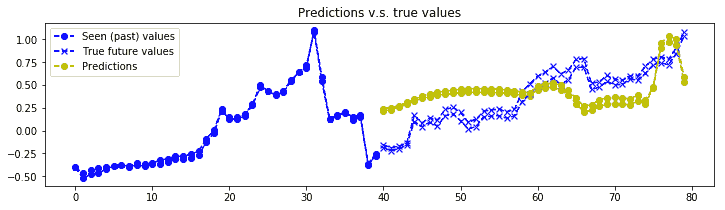

 |
| 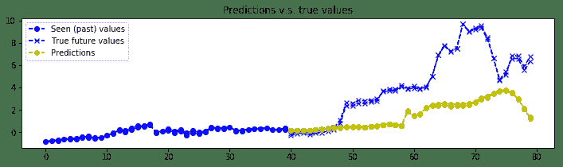 |
| 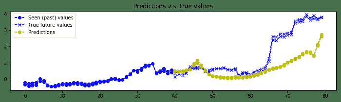 |
| 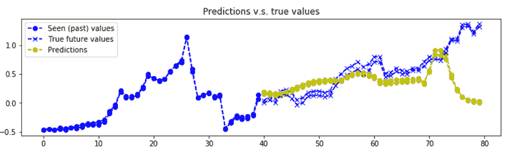 |
| 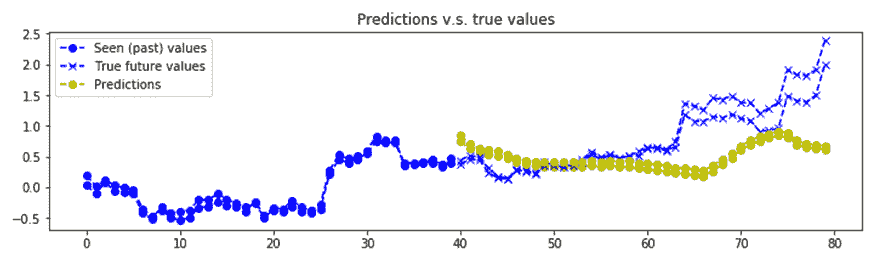 |

An example of bitcoin value prediction

# 这个怎么运作...

带有 GRU 基本单元的编码器-解码器层堆叠 RNN 用于预测比特币值。 RNN 非常擅长学习序列，即使使用基于 2 层和 12 个 GRU 单元的简单模型，比特币的预测确实相当准确。 当然，此预测代码并非鼓励您投资比特币，而只是讨论深度学习方法。 而且，需要更多的实验来验证我们是否存在数据过度拟合的情况。

# 还有更多...

预测股市价值是一个不错的 RNN 应用程序，并且有许多方便的软件包，例如：

*   Drnns-prediction 使用来自 Kaggle 的《股票市场每日新闻》数据集上的 Keras 神经网络库实现了深度 RNN。 数据集任务是使用当前和前一天的新闻头条作为特征来预测 DJIA 的未来走势。 开源代码可从[这里](https://github.com/jvpoulos/drnns-prediction)获得。
*   迈克尔·卢克（Michael Luk）撰写了一篇有趣的博客文章，[内容涉及如何基于 RNN 预测可口可乐的库存量](https://sflscientific.com/data-science-blog/2017/2/10/predicting-stock-volume-with-lstm)。
*   Jakob Aungiers 写了另一篇有趣的博客文章 [LSTM 神经网络时间序列预测](http://www.jakob-aungiers.com/articles/a/LSTM-Neural-Network-for-Time-Series-Prediction)。

# 多对一和多对多 RNN 示例

在本食谱中，我们通过提供 RNN 映射的各种示例来总结与 RNN 讨论过的内容。 为了简单起见，我们将采用 Keras 并演示如何编写一对一，一对多，多对一和多对多映射，如下图所示：


An example of RNN sequences as seen in http://karpathy.github.io/2015/05/21/rnn-effectiveness/

# 怎么做...

我们按以下步骤进行：

1.  如果要创建**一对一**映射，则这不是 RNN，而是密集层。 假设已经定义了一个模型，并且您想添加一个密集网络。 然后可以在 Keras 中轻松实现：

```py
model = Sequential()
model.add(Dense(output_size, input_shape=input_shape))
```

2.  如果要创建**一对多**选项，可以使用`RepeatVector(...)`实现。 请注意，`return_sequences`是一个布尔值，用于决定是返回输出序列中的最后一个输出还是完整序列：

```py
model = Sequential()
model.add(RepeatVector(number_of_times,input_shape=input_shape)) 
model.add(LSTM(output_size, return_sequences=True))
```

3.  如果要创建**多对一**选项，则可以使用以下 LSTM 代码段实现：

```py
model = Sequential()
model.add(LSTM(1, input_shape=(timesteps, data_dim)))
```

4.  如果要创建**多对多**选项，当输入和输出的长度与循环步数匹配时，可以使用以下 LSTM 代码段来实现：

```py
model = Sequential() 
model.add(LSTM(1, input_shape=(timesteps, data_dim), return_sequences=True))
```

# 这个怎么运作...

Keras 使您可以轻松编写各种形状的 RNN，包括一对一，一对多，多对一和多对多映射。 上面的示例说明了用 Keras 实施它们有多么容易。