# 无监督学习

到目前为止，我们在本书中涵盖的所有模型都是基于监督学习范式的。 训练数据集包括输入和该输入的所需标签。 相反，本章重点介绍无监督的学习范式。 本章将包括以下主题：

*   主成分分析
*   k 均值聚类
*   自组织图
*   受限玻尔兹曼机
*   使用 RBM 的推荐系统
*   DBN 用于情绪检测

# 介绍

在机器学习中，存在三种不同的学习范式：监督学习，无监督学习和强化学习。

在**监督学习**（也称为与老师一起学习）中，向网络提供输入和各自所需的输出。 例如，在 MNIST 数据集中，手写数字的每个图像都有一个标签，表示与之关联的数字值。

在**强化学习**（也称为与批评家学习）中，没有为网络提供所需的输出； 相反，环境会提供奖励或惩罚方面的反馈。 当其输出正确时，环境奖励网络，而当输出不正确时，环境对其进行惩罚。

在**无监督学习**（也称为无老师学习）中，没有向网络提供有关其输出的信息。 网络接收输入，但是既不提供期望的输出，也不提供来自环境的奖励； 网络自己学习输入的隐藏结构。 无监督学习非常有用，因为正常情况下可用的数据没有标签。 它可以用于模式识别，特征提取，数据聚类和降维等任务。 在本章和下一章中，您将学习基于无监督学习的不同机器学习和 NN 技术。

# 主成分分析

**主成分分析**（**PCA**）是用于降维的最流行的多元统计技术。 它分析了由几个因变量组成的训练数据，这些因变量通常是相互关联的，并以一组称为**主成分**的新正交变量的形式从训练数据中提取重要信息。 我们可以使用两种方法执行 PCA-**本征分解**或**奇异值分解**（**SVD**）。

# 做好准备

PCA 将 *n* 维输入数据还原为 *r* 维输入数据，其中 *r* < *n* 。 简单来说，PCA 涉及平移原点并执行轴的旋转，以使其中一个轴（主轴）与数据点的差异最小。 通过执行此变换，然后以高方差落下（删除）正交轴，可以从原始数据集中获得降维数据集。 在这里，我们采用 SVD 方法降低 PCA 尺寸。 考虑 *X* ， *n* 维数据， *p* 点 *X* <sub>*p* ， *n*</sub> 。 任何实数（ *p* × *n* ）矩阵都可以分解为：

*X = U ∑ V <sup>T</sup>*

在这里， *U* 和 *V* 是正交矩阵（即 *UU <sup>T</sup>* *=* *V <sup>T</sup> .V = 1* ）的大小分别为 *p* × *n* 和 *n* × *n* 。 *∑* 是大小为 *n* × *n* 的对角矩阵。 接下来，将 *∑* 矩阵切成 *r* 列，得到 *∑ <sub>r</sub>* ； 使用 *U* 和 *V* ，我们找到了降维数据点 *Y <sub>r</sub>* ：

*Y <sub>r</sub> = U∑ <sub>r</sub>*

[此处提供的代码已从以下 GitHub 链接进行改编](https://github.com/eliorc/Medium/blob/master/PCA-tSNE-AE.ipynb)

# 怎么做...

我们按以下步骤进行操作：

1.  导入所需的模块。 我们肯定会使用 TensorFlow; 我们还需要`numpy`进行一些基本矩阵计算，并需要`matplotlib`，`mpl_toolkit`和`seaborn`进行绘图：

```py
import tensorflow as tf
import numpy as np
import matplotlib.pyplot as plt
from mpl_toolkits.mplot3d import Axes3D
import seaborn as sns
%matplotlib inline
```

2.  我们加载数据集-我们将使用我们最喜欢的 MNIST 数据集：

```py
from tensorflow.examples.tutorials.mnist import input_data
mnist = input_data.read_data_sets("MNIST_data/")
```

3.  我们定义了一个`TF_PCA`类，它将实现我们的所有工作。 该类的初始化如下：

```py
def __init__(self, data,  dtype=tf.float32):
        self._data = data
        self._dtype = dtype
        self._graph = None
        self._X = None
        self._u = None
        self._singular_values = None
        self._sigma = None)
```

4.  给定输入数据的 SVD 用`fit`方法计算。 该方法定义了计算图，并执行该计算图以计算奇异值和正交矩阵 U。需要`self.data`来输入占位符`self._X`。 `tf.svd`以降序返回形状[...，p]的 s（`singular_values`）。 我们使用`tf.diag`将其转换为对角矩阵：

```py
def fit(self):
        self._graph = tf.Graph()
        with self._graph.as_default():
            self._X = tf.placeholder(self._dtype, shape=self._data.shape)
            # Perform SVD
            singular_values, u, _ = tf.svd(self._X)
            # Create sigma matrix
            sigma = tf.diag(singular_values)
        with tf.Session(graph=self._graph) as session:
            self._u, self._singular_values, self._sigma = session.run([u, singular_values, sigma], feed_dict={self._X: self._data})
```

5.  现在我们有了 sigma 矩阵，正交 U 矩阵和奇异值，我们通过定义`reduce`方法来计算降维数据。 该方法需要两个输入参数之一`n_dimensions`或`keep_info`。 `n_dimensions`参数表示我们要保留在降维数据集中的维数。 另一方面，`keep_info`参数确定我们要保留的信息的百分比（值为 0.8 表示我们要保留 80％的原始数据）。 该方法创建一个切片 Sigma 矩阵的图，并计算降维数据集 *Y <sub>r</sub>* ：

```py
def reduce(self, n_dimensions=None, keep_info=None):
        if keep_info:
            # Normalize singular values
            normalized_singular_values = self._singular_values / sum(self._singular_values)
            # information per dimension
            info = np.cumsum(normalized_singular_values)            # Get the first index which is above the given information threshold
           it = iter(idx for idx, value in enumerate(info) if value >= keep_info)
            n_dimensions = next(it) + 1 
       with self.graph.as_default():
            # Cut out the relevant part from sigma
            sigma = tf.slice(self._sigma, [0, 0], [self._data.shape[1], n_dimensions])
            # PCA
            pca = tf.matmul(self._u, sigma)

        with tf.Session(graph=self._graph) as session:
            return session.run(pca, feed_dict={self._X: self._data})
```

6.  我们的`TF_PCA`类已准备就绪。 现在，我们将使用它来将 MNIST 数据从尺寸为 784（28 x 28）的每个输入减少为尺寸为 3 的每个点的新数据。这里，我们仅保留了 10％的信息以便于查看，但是通常 将需要保留大约 80％的信息：

```py
tf_pca.fit()
pca = tf_pca.reduce(keep_info=0.1)  # The reduced dimensions dependent upon the % of information
print('original data shape', mnist.train.images.shape)
print('reduced data shape', pca.shape) 
```

以下是以下代码的输出：

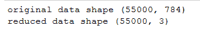

7.  现在，让我们在三维空间中绘制 55,000 个数据点：

```py
Set = sns.color_palette("Set2", 10)
color_mapping = {key:value for (key,value) in enumerate(Set)}
colors = list(map(lambda x: color_mapping[x], mnist.train.labels))
fig = plt.figure()
ax = Axes3D(fig)
ax.scatter(pca[:, 0], pca[:, 1],pca[:, 2], c=colors)
```

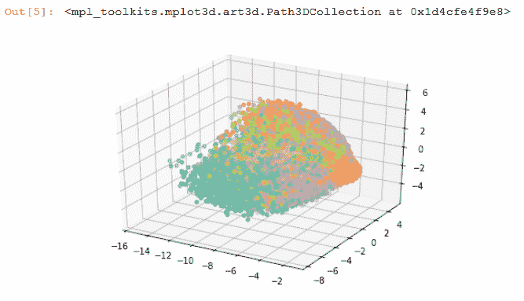

# 这个怎么运作...

前面的代码对 MNIST 图像执行降维。 每个原始图像的尺寸为 28 x 28； 使用 PCA 方法，我们可以将其减小到较小的尺寸。 通常，对于图像数据，降维是必要的。 之所以如此，是因为图像很大，并且包含大量的冗余数据。

# 还有更多...

TensorFlow 提供了一种称为**嵌入**的技术，该技术是将对象映射到向量中。 TensorBoard 的嵌入式投影仪允许我们以交互方式可视化模型中的嵌入。 嵌入式投影仪提供了三种降低尺寸的方法：PCA，t-SNE 和自定义。 我们可以使用 TensorBoard 的 Embedding Projector 实现与上一个类似的结果。 我们需要从`tensorflow.contrib.tensorboard.plugins`导入`projector`类，以从`tensorflow.contrib.tensorboard.plugins` import `projector`进行相同的操作。 我们可以通过三个简单的步骤来做到这一点：

1.  加载要探索其嵌入的数据：

```py
mnist = input_data.read_data_sets('MNIST_data')
images = tf.Variable(mnist.test.images, name='images')
```

2.  创建一个`metadata`文件（（`metadata`文件是制表符分隔的`.tsv`文件）：

```py
with open(metadata, 'w') as metadata_file:
    for row in mnist.test.labels:
        metadata_file.write('%d\n' % row)
```

3.  将嵌入内容保存在所需的`Log_DIR`中：

```py
with tf.Session() as sess:
    saver = tf.train.Saver([images])

    sess.run(images.initializer)
    saver.save(sess, os.path.join(LOG_DIR, 'images.ckpt'))

    config = projector.ProjectorConfig()
    # One can add multiple embeddings.
    embedding = config.embeddings.add()
    embedding.tensor_name = images.name
    # Link this tensor to its metadata file (e.g. labels).
    embedding.metadata_path = metadata
    # Saves a config file that TensorBoard will read during startup.
    projector.visualize_embeddings(tf.summary.FileWriter(LOG_DIR), config)
```

嵌入已准备就绪，现在可以使用 TensorBoard 看到。 通过 CLI `tensorboard --logdir=log`启动 TensorBoard，在 Web 浏览器中打开 TensorBoard，然后转到 EMBEDDINGS 选项卡。 这是使用 PCA 的 TensorBoard 投影，前三个主要成分为轴：

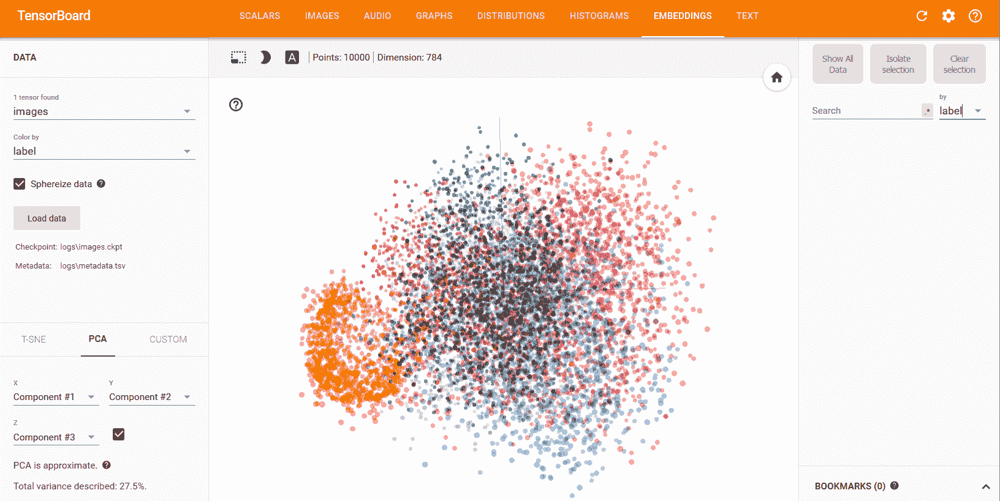

# 也可以看看

*   <https://arxiv.org/abs/1404.1100>
*   <http://www.cs.otago.ac.nz/cosc453/student_tutorials/principal_components.pdf>
*   <http://mplab.ucsd.edu/tutorials/pca.pdf>
*   <http://projector.tensorflow.org/>

# k 均值聚类

顾名思义，k 均值聚类是一种对数据进行聚类的技术，即将数据划分为指定数量的数据点。 这是一种无监督的学习技术。 它通过识别给定数据中的模式来工作。 还记得哈利波特成名的分拣帽子吗？ 书中的工作是聚类-将新生（未标记）的学生分成四个不同的类：格兰芬多，拉文克劳，赫奇帕奇和斯莱特林。

人类非常擅长将对象分组在一起。 聚类算法试图为计算机提供类似的功能。 有许多可用的聚类技术，例如“层次”，“贝叶斯”或“局部”。 k 均值聚类属于部分聚类； 它将数据划分为 *k* 簇。 每个群集都有一个中心，称为**重心**。 群集数 *k* 必须由用户指定。

k 均值算法以以下方式工作：

1.  随机选择 *k* 个数据点作为初始质心（集群中心）
2.  将每个数据点分配给最接近的质心； 可以找到接近度的不同方法，最常见的是欧几里得距离
3.  使用当前群集成员资格重新计算质心，以使平方和的距离减小
4.  重复最后两个步骤，直到达到收敛

# 做好准备

我们将使用 TensorFlow `KmeansClustering` Estimator 类来实现 k 均值。 它在[这个链接](https://github.com/tensorflow/tensorflow/blob/r1.3/tensorflow/contrib/learn/python/learn/estimators/kmeans.py)中定义。它创建一个模型来运行 k 均值和推理。 根据 TensorFlow 文档，一旦创建了`KmeansClustering`类对象，就可以使用以下`__init__`方法实例化该对象：

```py
__init__(
num_clusters,
model_dir=None,
initial_clusters=RANDOM_INIT,
distance_metric=SQUARED_EUCLIDEAN_DISTANCE,
random_seed=0,
use_mini_batch=True,
mini_batch_steps_per_iteration=1,
kmeans_plus_plus_num_retries=2,
relative_tolerance=None,
config=None
)
```

TensorFlow 文档对这些参数的定义如下：

**Args:**
**num_clusters**: The number of clusters to train.
**model_dir:** The directory to save the model results and log files.
**initial_clusters:** Specifies how to initialize the clusters for training. See clustering_ops.kmeans for the possible values.
**distance_metric:** The distance metric used for clustering. See clustering_ops.kmeans for the possible values.
**random_seed**: Python integer. Seed for PRNG used to initialize centers.
**use_mini_batch**: If true, use the mini-batch k-means algorithm. Or else assume full batch.
**mini_batch_steps_per_iteration**: The number of steps after which the updated cluster centers are synced back to a master copy. See clustering_ops.py for more details.
**kmeans_plus_plus_num_retries:** For each point that is sampled during kmeans++ initialization, this parameter specifies the number of additional points to draw from the current distribution before selecting the best. If a negative value is specified, a heuristic is used to sample O(log(num_to_sample)) additional points.
**relative_tolerance**: A relative tolerance of change in the loss between iterations. Stops learning if the loss changes less than this amount. Note that this may not work correctly if use_mini_batch=True.
**config**: See Estimator.

TensorFlow 支持欧几里得距离和余弦距离作为质心的量度。 TensorFlow `KmeansClustering`提供了各种与`KmeansClustering`对象进行交互的方法。 在本食谱中，我们将使用`fit()`，`clusters()`和`predict_clusters_idx()`方法：

```py
fit(
 x=None,
 y=None,
 input_fn=None,
 steps=None,
 batch_size=None,
 monitors=None,
 max_steps=None
)
```

根据 TensorFlow 文档，对于`KmeansClustering`估算器，我们需要向`fit()`提供`input_fn()`。 `cluster`方法返回聚类中心，`predict_cluster_idx`方法返回预测的聚类索引。

# 怎么做...

这是我们进行食谱的方法：

1.  和以前一样，我们从加载必要的模块开始。 我们将像往常一样需要 TensorFlow，NumPy 和 Matplotlib。 在本食谱中，我们使用的是鸢尾花数据集，该数据集包含三个类别，每个类别有 50 个实例，其中每个类别都代表一种鸢尾花植物。 我们可以从 [https://archive.ics.uci.edu/ml/datasets/iris](https://archive.ics.uci.edu/ml/datasets/iris) 文件中下载数据作为`.csv`文件，也可以使用 sklearn 的数据集模块（scikit-learn） 做任务：

```py
import numpy as np
import tensorflow as tf
import matplotlib.pyplot as plt
from matplotlib.colors import ListedColormap
# dataset Iris
from sklearn import datasets

%matplotlib inline
```

2.  我们加载数据集：

```py
# import some data to play with
iris = datasets.load_iris()
x = iris.data[:, :2] # we only take the first two features.
y = iris.target
```

3.  让我们看看该数据集的外观：

```py
# original data without clustering
plt.scatter(hw_frame[:,0], hw_frame[:,1])
plt.xlabel('Sepia Length')
plt.ylabel('Sepia Width')
```

以下是以下代码的输出：

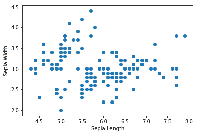

4.  我们可以看到在数据中没有明显可见的聚类。 现在我们定义`input_fn`，它将用于提供`fit`方法。 我们的输入函数返回一个 TensorFlow 常数，该常数被分配了 x 的值和形状，并且类型为`float`：

```py
def input_fn():
 return tf.constant(np.array(x), tf.float32, x.shape),None
```

5.  现在我们使用`KmeansClustering`类； 在这里，我们已经知道类的数量为 3，因此我们将`num_clusters=3`设置为。 通常，我们不知道集群的数量。 在这种情况下，常用的方法是**肘法**：

```py
kmeans = tf.contrib.learn.KMeansClustering(num_clusters=3, relative_tolerance=0.0001, random_seed=2) 
kmeans.fit(input_fn=input_fn)
```

6.  我们使用`clusters()`方法找到聚类，并使用`predict_cluster_idx()`方法为每个输入点分配聚类索引：

```py
clusters = kmeans.clusters()
assignments = list(kmeans.predict_cluster_idex(input_fn=input_fn))
```

7.  现在让我们可视化由 k 均值创建的聚类。 为此，我们创建一个包装器函数`ScatterPlot`，该函数将`X`和`Y`值以及每个数据点的簇和簇索引一起使用：

```py
def ScatterPlot(X, Y, assignments=None, centers=None):
 if assignments is None:
 assignments = [0] * len(X)
 fig = plt.figure(figsize=(14,8))
 cmap = ListedColormap(['red', 'green', 'blue'])
 plt.scatter(X, Y, c=assignments, cmap=cmap)
 if centers is not None:
 plt.scatter(centers[:, 0], centers[:, 1], c=range(len(centers)), 
 marker='+', s=400, cmap=cmap) 
 plt.xlabel('Sepia Length')
 plt.ylabel('Sepia Width')
```

我们用它来绘制我们的`clusters`：

```py
ScatterPlot(x[:,0], x[:,1], assignments, clusters)
```

情节如下：

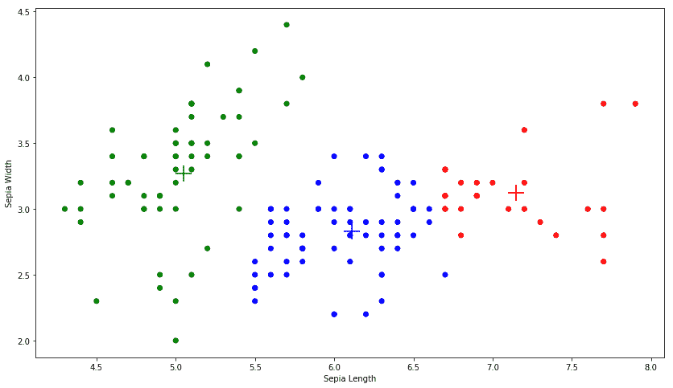

**+** 标记是三个簇的质心。

# 这个怎么运作...

前面的配方使用 TensorFlow 的 k 均值聚类估计器将给定数据聚类为聚类。 在这里，由于我们知道集群的数量，我们决定保留`num_clusters=3`，但是在大多数情况下，如果使用未标记的数据，则永远无法确定存在多少集群。 可以使用弯头法确定最佳簇数。 该方法基于以下原则：我们应选择能减少**平方误差和**（**SSE**）距离的簇数。 如果 *k* 是簇数，则随着 *k* 增加，SSE 减少，SSE = 0； 当 *k* 等于数据点数时，每个点都是其自己的簇。 我们想要一个 *k* 较低的值，以使 SSE 也较低。 在 TensorFlow 中，我们可以使用`KmeansClustering`类中定义的`score()`方法找到 SSE； 该方法将距离的总和返回到最近的聚类：

```py
sum_distances = kmeans.score(input_fn=input_fn, steps=100)
```

对于虹膜数据，如果我们针对不同的 *k* 值绘制 SSE，则可以看到对于 *k = 3* 而言，SSE 的方差最高； 之后，它开始减小，因此肘点为 *k = 3* ：

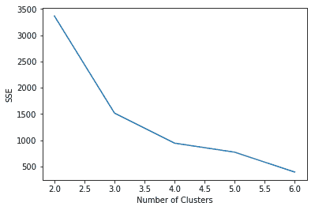

# 还有更多...

K 均值聚类非常流行，因为它快速，简单且健壮。 它还有一些缺点：最大的缺点是用户必须指定群集的数量。 其次，该算法不能保证全局最优。 第三，它对异常值非常敏感。

# 也可以看看

*   Kanungo，Tapas 等人。 *一种有效的 k 均值聚类算法：分析和实现*。 IEEE 关于模式分析和机器智能的交易 24.7（2002）：881-892。

*   奥尔特加，华金·佩雷斯（JoaquínPérez）等人。 *关于 k 均值算法的研究问题：使用 matlab* 的实验性试验。 CEUR 研讨会论文集：语义网和新技术。

*   [http://home.deib.polimi.it/matteucc/Clustering/tutorial_html/kmeans.html](http://home.deib.polimi.it/matteucc/Clustering/tutorial_html/kmeans.html)

*   陈可 *关于度量和欧几里得空间中 k 均值和 k 均值聚类的核心集及其应用*。 SIAM 计算学报 39.3（2009）：923-947。

*   [https://zh.wikipedia.org/wiki/确定 _clusters_in_a_data_set 的编号](https://en.wikipedia.org/wiki/Determining_the_number_of_clusters_in_a_data_set)

# 自组织图

**自组织地图**（**SOM**），有时也称为 **Kohonen 网络**或**获胜者获得所有单位**（**WTU**），是一种非常特殊的神经网络，受人脑的独特特征驱动。 在我们的大脑中，不同的感觉输入以拓扑有序的方式表示。 与其他神经网络不同，神经元并非都通过权重相互连接，而是会影响彼此的学习。 SOM 的最重要方面是神经元以拓扑方式表示学习的输入。

在 SOM 中，神经元通常放置在（1D 或 2D）晶格的节点上。 更大的尺寸也是可能的，但实际上很少使用。 晶格中的每个神经元都通过权重矩阵连接到所有输入单元。 在这里，您可以看到一个具有 3 x 4（12 个神经元）和七个输入的 SOM。 为了清楚起见，仅显示将所有输入连接到一个神经元的权重向量。 在这种情况下，每个神经元将具有七个元素，从而形成大小为（12 x 7）的组合权重矩阵：

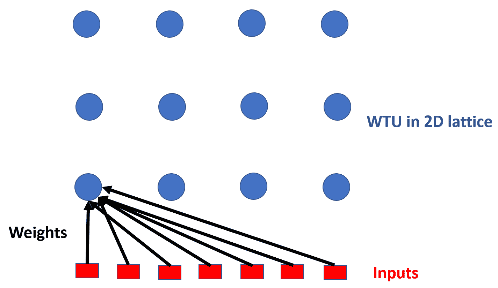

SOM 通过竞争性学习来学习。 可以将其视为 PCA 的非线性概括，因此，像 PCA 一样，可以用于降维。

# 做好准备

为了实现 SOM，让我们首先了解它是如何工作的。 第一步，将网络的权重初始化为某个随机值，或者通过从输入中获取随机样本进行初始化。 占据晶格中空间的每个神经元将被分配特定的位置。 现在，作为输入出现，与输入距离最小的神经元被宣布为 Winner（WTU）。 这是通过测量所有神经元的权重向量（ *W* ）和输入向量（ *X* ）之间的距离来完成的：

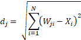

在此， *d <sub>j</sub>* 是神经元 *j* 的权重与输入 *X* 的距离。 最小 *d* 值的神经元是赢家。

接下来，以一种方式调整获胜神经元及其相邻神经元的权重，以确保如果下次出现相同的输入，则相同的神经元将成为获胜者。 为了确定哪些相邻神经元需要修改，网络使用邻域函数*Λ（r）*； 通常，选择高斯墨西哥帽函数作为邻域函数。 邻域函数在数学上表示如下：

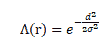

在这里，*σ*是神经元的时间依赖性半径， *d* 是其与获胜神经元的距离：

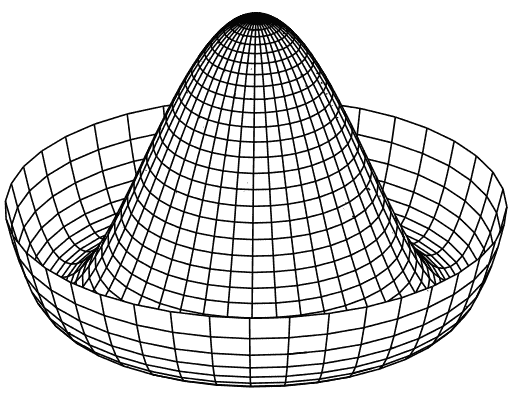

邻域函数的另一个重要属性是其半径随时间减小。 结果，一开始，许多相邻神经元的权重被修改，但是随着网络的学习，最终在学习过程中，一些神经元的权重（有时只有一个或没有）被修改。 重量变化由以下公式给出：

dW *= η*Λ*(X-W)*

我们继续所有输入的过程，并重复给定的迭代次数。 随着迭代的进行，我们将学习率和半径减小一个取决于迭代次数的因素。

# 怎么做...

我们按以下步骤进行：

1.  与往常一样，我们从导入必要的模块开始：

```py
import tensorflow as tf
import numpy as np
import matplotlib.pyplot as plt
%matplotlib inline
```

2.  接下来，我们声明一个类 WTU，它将执行所有任务。 用`m x n` 2D SOM 格的大小，`dim`输入数据中的维数以及迭代总数来实例化该类：

```py
def __init__(self, m, n, dim, num_iterations, eta = 0.5, sigma = None):
    """
    m x n : The dimension of 2D lattice in which neurons are     arranged
    dim : Dimension of input training data
    num_iterations: Total number of training iterations
    eta : Learning rate
    sigma: The radius of neighbourhood function.
    """
    self._m = m
    self._n = n
    self._neighbourhood = []
    self._topography = []
    self._num_iterations = int(num_iterations) 
    self._learned = False
```

3.  在`__init__`本身中，我们定义了计算图和会话。
4.  如果网络未提供任何`sigma`值，它将采用默认值，该值通常是 SOM 晶格最大尺寸的一半：

```py
if sigma is None:
    sigma = max(m,n)/2.0 # Constant radius
else:
    sigma = float(sigma)
```

5.  接下来，在图中，我们声明权重矩阵的变量，输入的占位符以及计算获胜者并更新其及其邻居权重的计算步骤。 由于 SOM 提供了地形图，因此我们还添加了操作以获得神经元的地形位置：

```py
self._graph = tf.Graph()

# Build Computation Graph of SOM
 with self._graph.as_default():
# Weight Matrix and the topography of neurons
    self._W = tf.Variable(tf.random_normal([m*n, dim], seed = 0))
    self._topography = tf.constant(np.array(list(self._neuron_location(m, n))))

    # Placeholders for training data
    self._X = tf.placeholder('float', [dim])

    # Placeholder to keep track of number of iterations
    self._iter = tf.placeholder('float')

    # Finding the Winner and its location
    d = tf.sqrt(tf.reduce_sum(tf.pow(self._W - tf.stack([self._X 
          for i in range(m*n)]),2),1))
    self.WTU_idx = tf.argmin(d,0)
    slice_start = tf.pad(tf.reshape(self.WTU_idx, [1]),np.array([[0,1]]))
    self.WTU_loc = tf.reshape(tf.slice(self._topography, slice_start,             [1,2]), [2])
    # Change learning rate and radius as a function of iterations
    learning_rate = 1 - self._iter/self._num_iterations
    _eta_new = eta * learning_rate
    _sigma_new = sigma * learning_rate

    # Calculating Neighbourhood function
    distance_square = tf.reduce_sum(tf.pow(tf.subtract(
    self._topography, tf.stack([self.WTU_loc for i in range(m * n)])), 2), 1)
    neighbourhood_func = tf.exp(tf.negative(tf.div(tf.cast(
distance_square, "float32"), tf.pow(_sigma_new, 2))))

    # multiply learning rate with neighbourhood func
    eta_into_Gamma = tf.multiply(_eta_new, neighbourhood_func)

    # Shape it so that it can be multiplied to calculate dW
    weight_multiplier = tf.stack([tf.tile(tf.slice(
eta_into_Gamma, np.array([i]), np.array([1])), [dim])
for i in range(m * n)])
    delta_W = tf.multiply(weight_multiplier,
tf.subtract(tf.stack([self._X for i in range(m * n)]),self._W))
    new_W = self._W + delta_W
    self._training = tf.assign(self._W,new_W)

   # Initialize All variables
   init = tf.global_variables_initializer()
   self._sess = tf.Session()
   self._sess.run(init)
```

6.  我们为该类定义一个`fit`方法，该方法执行在该类的默认图中声明的训练操作。 该方法还计算质心网格：

```py
def fit(self, X):
 """
 Function to carry out training
 """
 for i in range(self._num_iterations):
   for x in X:
       self._sess.run(self._training, feed_dict= {self._X:x, self._iter: i})

 # Store a centroid grid for easy retreival
 centroid_grid = [[] for i in range(self._m)]
 self._Wts = list(self._sess.run(self._W))
 self._locations = list(self._sess.run(self._topography))
 for i, loc in enumerate(self._locations):
      centroid_grid[loc[0]].append(self._Wts[i])
 self._centroid_grid = centroid_grid

 self._learned = True
```

7.  我们定义一个函数来确定获胜神经元在 2D 晶格中的索引和位置：

```py
def winner(self, x):
    idx = self._sess.run([self.WTU_idx,self.WTU_loc], feed_dict = {self._X:x})
    return idx
```

8.  我们定义一些更多的辅助函数，以执行晶格中神经元的 2D 映射并将输入向量映射到 2D 晶格中的相关神经元：

```py
def _neuron_location(self,m,n):
    """
    Function to generate the 2D lattice of neurons
    """
    for i in range(m):
       for j in range(n):
           yield np.array([i,j])

def get_centroids(self):
    """
    Function to return a list of 'm' lists, with each inner     list containing the 'n' corresponding centroid locations     as 1-D NumPy arrays.
    """
    if not self._learned:
       raise ValueError("SOM not trained yet")
    return self._centroid_grid
```

```py
def map_vects(self, X):
    """
    Function to map each input vector to the relevant neuron         in the lattice
    """
    if not self._learned:
        raise ValueError("SOM not trained yet")
    to_return = []
    for vect in X:
       min_index = min([i for i in range(len(self._Wts))],
       key=lambda x: np.linalg.norm(vect -
self._Wts[x]))
       to_return.append(self._locations[min_index])
return to_return
```

9.  现在我们的 WTU 类已经准备好，我们从`.csv`文件中读取数据并对其进行规范化：

```py
def normalize(df):
    result = df.copy()
    for feature_name in df.columns:
       max_value = df[feature_name].max()
       min_value = df[feature_name].min()
       result[feature_name] = (df[feature_name] - min_value) / (max_value - min_value)
    return result

# Reading input data from file
import pandas as pd
df = pd.read_csv('colors.csv') # The last column of data file is a label
data = normalize(df[['R', 'G', 'B']]).values
name = df['Color-Name'].values
n_dim = len(df.columns) - 1

# Data for Training
colors = data
color_names = name
```

10.  最后，我们使用我们的类执行降维并将其布置在美丽的地形图中：

```py
som = WTU(30, 30, n_dim, 400, sigma=10.0)
som.fit(colors)

# Get output grid
image_grid = som.get_centroids()

# Map colours to their closest neurons
mapped = som.map_vects(colors)

# Plot
plt.imshow(image_grid)
plt.title('Color Grid SOM')
for i, m in enumerate(mapped):
     plt.text(m[1], m[0], color_names[i], ha='center', va='center', bbox=dict(facecolor='white', alpha=0.5, lw=0))
```

情节如下：

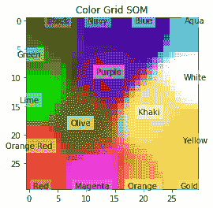

# 这个怎么运作...

SOM 在计算上很昂贵，因此对于非常大的数据集并没有真正的用处。 尽管如此，它们仍然易于理解，并且可以很好地找到输入数据之间的相似性。 因此，它们已被用于图像分割和确定 NLP 中的单词相似度图。

# 也可以看看

*   这是一篇非常不错的博客文章，用简单的语言解释了 SOM： [http://www.ai-junkie.com/ann/som/som1.html](http://www.ai-junkie.com/ann/som/som1.html)
*   关于 SOM 的简要介绍： [https://en.wikipedia.org/wiki/Self-organizing_map](https://en.wikipedia.org/wiki/Self-organizing_map)
*   Kohonen 关于 SOM 的开创性论文：“自组织图”。 神经计算 21.1（1998）：1-6： [https://pdfs.semanticscholar.org/8c6a/aea3159e9f49283de252d0548b337839ca6f.pdf](https://pdfs.semanticscholar.org/8c6a/aea3159e9f49283de252d0548b337839ca6f.pdf)

# 受限玻尔兹曼机

**受限玻尔兹曼机**（**RBM**）是两层神经网络，第一层称为**可见层**，第二层称为[HTG6 隐藏层。 它们被称为**浅层神经网络**，因为它们只有两层深。 它们最初是由 1986 年由保罗·斯莫伦斯基（Paul Smolensky）（他称其为 Harmony Networks <sup>[1]</sup> ）提出的，后来由 Geoffrey Hinton 提出，于 2006 年提出了**对比发散**（**CD**）作为训练他们的方法。 可见层中的所有神经元都与隐藏层中的所有神经元相连，但是存在**限制**-同一层中没有神经元可以连接。 所有神经元本质上都是二进制的：


Source: By Qwertyus - Own work, CC BY-SA 3.0, https://commons.wikimedia.org/w/index.php?curid=22717044

RBM 可用于降维，特征提取和协作过滤。 RBM 中的训练可分为三个部分：前进，后退和比较。

# 做好准备

让我们看看制作 RBM 所需的表达式：

**正向传递**：可见单位（ *V* ）上的信息通过权重（ *W* ）和偏差（ *c* ）传递给隐藏的对象 单位（ *h <sub>0</sub>* ）。 隐藏单元是否可以触发取决于随机概率（*σ*是随机概率）：

*p(h<sub>i</sub>|v<sub>0</sub>) = σ(V<sup>T</sup>W + c)<sub>i</sub>*

**向后传递**：隐藏的单位表示（ *h <sub>0</sub>* ）然后通过相同的权重 *W* 传递回可见单位，但是 不同的偏置 *c* ，它们在其中重构输入。 再次，对输入进行采样：

*p(v<sub>i</sub>|h<sub>0</sub>) = σ(W<sup>T</sup>h<sub>0</sub> +b)<sub>i</sub>*

将这两个遍重复 k 步或直到达到收敛。 根据研究人员的说法， *k = 1* 给出了很好的结果，因此我们将保持 *k = 1* 。

可见矢量 *V* 和隐藏矢量的联合构型具有如下能量：


自由能还与每个可见矢量 *V* 相关，为与具有 *V* 的所有构型具有相同概率的单个配置所需的能量：


使用对比度发散目标函数，即 *Mean（F（V [HT [GTG1]原始））-Mean（F（V <sub>重构的</sub>））*，权重的变化 是（谁）给的：


在此，*η*是学习率。 对于偏差 *b* 和 *c* 存在相似的表达式。

# 怎么做...

我们按以下步骤进行：

1.  导入模块：

```py
import tensorflow as tf
import numpy as np
from tensorflow.examples.tutorials.mnist import input_data
import matplotlib.pyplot as plt
%matplotlib inline
```

2.  声明 RBM 类，它将完成主要任务。 `__init__`将建立完整的图形，正向和反向传递以及目标函数； 我们将使用 TensorFlow 内置的优化器来更新权重和偏差：

```py
class RBM(object):
    def __init__(self, m, n):
        """
        m: Number of neurons in visible layer
        n: number of neurons in hidden layer
        """
        self._m = m
        self._n = n
        # Create the Computational graph
        # Weights and biases
        self._W = tf.Variable(tf.random_normal(shape=(self._m,self._n)))
        self._c = tf.Variable(np.zeros(self._n).astype(np.float32)) #bias for hidden layer
        self._b = tf.Variable(np.zeros(self._m).astype(np.float32)) #bias for Visible layer
         # Placeholder for inputs
        self._X = tf.placeholder('float', [None, self._m])
         # Forward Pass
        _h = tf.nn.sigmoid(tf.matmul(self._X, self._W) + self._c)
        self.h = tf.nn.relu(tf.sign(_h -         tf.random_uniform(tf.shape(_h))))
        #Backward pass
        _v = tf.nn.sigmoid(tf.matmul(self.h, tf.transpose(self._W)) + self._b)
        self.V = tf.nn.relu(tf.sign(_v - tf.random_uniform(tf.shape(_v))))
        # Objective Function
        objective = tf.reduce_mean(self.free_energy(self._X)) - tf.reduce_mean(
self.free_energy(self.V))
        self._train_op = tf.train.GradientDescentOptimizer(1e-3).minimize(objective)
        # Cross entropy cost
        reconstructed_input = self.one_pass(self._X)
        self.cost = tf.reduce_mean(tf.nn.sigmoid_cross_entropy_with_logits(
labels=self._X, logits=reconstructed_input))
```

3.  我们在`RBM`类中定义`fit()`方法。 在`__init__`中声明了所有操作后，训练只是在会话中调用`train_op`。 我们使用批量训练：

```py
 def fit(self, X, epochs = 1, batch_size = 100):
        N, D = X.shape
        num_batches = N // batch_size

        obj = []
        for i in range(epochs):
            #X = shuffle(X)
            for j in range(num_batches):
                batch = X[j * batch_size: (j * batch_size + batch_size)]
                _, ob = self.session.run([self._train_op,self.cost ], feed_dict={self._X: batch})
                if j % 10 == 0:
                    print('training epoch {0} cost {1}'.format(j,ob)) 
                obj.append(ob)
        return obj
```

4.  还有其他帮助程序功能可计算 logit 错误并从网络返回重建的图像：

```py
def set_session(self, session):
    self.session = session

def free_energy(self, V):
    b = tf.reshape(self._b, (self._m, 1))
    term_1 = -tf.matmul(V,b)
    term_1 = tf.reshape(term_1, (-1,))
    term_2 = -tf.reduce_sum(tf.nn.softplus(tf.matmul(V,self._W) +
        self._c))
    return term_1 + term_2

def one_pass(self, X):
    h = tf.nn.sigmoid(tf.matmul(X, self._W) + self._c)
    return tf.matmul(h, tf.transpose(self._W)) + self._b

def reconstruct(self,X):
    x = tf.nn.sigmoid(self.one_pass(X))
    return self.session.run(x, feed_dict={self._X: X})

```

5.  我们加载 MNIST 数据集：

```py
mnist = input_data.read_data_sets("MNIST_data/", one_hot=True)
trX, trY, teX, teY = mnist.train.images, mnist.train.labels, mnist.test.images, mnist.test.labels
```

6.  接下来，我们在 MNIST 数据集上训练`RBM`：

```py
Xtrain = trX.astype(np.float32)
Xtest = teX.astype(np.float32)
_, m = Xtrain.shape
rbm = RBM(m, 100)
#Initialize all variables
init = tf.global_variables_initializer()
with tf.Session() as sess:
    sess.run(init)
    rbm.set_session(sess)
    err = rbm.fit(Xtrain)
    out = rbm.reconstruct(Xest[0:100])  # Let us reconstruct Test Data
```

7.  作为**历元**的函数的错误：

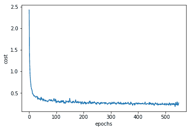

# 这个怎么运作...

由于其具有重建图像的能力，RBM 可用于从现有数据中生成更多数据。 通过制作一个小的助手绘图代码，我们可以看到原始和重建的 MNIST 图像：

```py
row, col = 2, 8
idx = np.random.randint(0, 100, row * col // 2)
f, axarr = plt.subplots(row, col, sharex=True, sharey=True, figsize=(20,4))
for fig, row in zip([Xtest_noisy,out], axarr):
    for i,ax in zip(idx,row):
        ax.imshow(fig[i].reshape((28, 28)), cmap='Greys_r')
        ax.get_xaxis().set_visible(False)
        ax.get_yaxis().set_visible(False)
```

我们得到的结果如下：

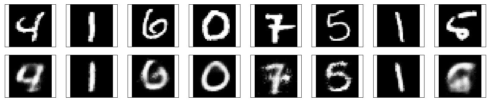

# 也可以看看

*   保罗·斯摩棱斯基。 *动态系统中的信息处理：和谐理论的基础*。 编号 CU-CS-321-86。 科罗拉多大学计算机科学系，1986 年。（[链接](http://stanford.edu/~jlmcc/papers/PDP/Volume%201/Chap6_PDP86.pdf)）

*   Salakhutdinov，Ruslan，Andriy Mnih 和 Geoffrey Hinton。 *用于协作过滤的受限 Boltzmann 机*。 第 24 届机器学习国际会议论文集。 ACM，2007 年。（[链接](http://machinelearning.wustl.edu/mlpapers/paper_files/icml2007_SalakhutdinovMH07.pdf)）

*   欣顿，杰弗里。 *训练受限 Boltzmann 机器*的实用指南。 Momentum 9.1（2010）：926.（[链接](http://www.csri.utoronto.ca/~hinton/absps/guideTR.pdf)）

*   如果您对数学感兴趣，这是一个很好的教程： [http://deeplearning.net/tutorial/rbm.html#rbm](http://deeplearning.net/tutorial/rbm.html#rbm)

# 使用 RBM 的推荐系统

网上零售商广泛使用推荐系统向客户推荐产品。 例如，亚马逊会告诉您购买此商品的其他客户对什么感兴趣，或者 Netflix 根据您所观看的内容以及有相同兴趣的其他 Netflix 用户所观看的内容推荐电视连续剧和电影。 这些推荐器系统在协作筛选的基础上工作。 在协作过滤中，系统根据用户的过去行为来构建模型。 我们将使用上一个食谱中的 RBM 构建一个使用协作过滤来推荐电影的推荐器系统。 这项工作中的一个重要挑战是，大多数用户不会对所有产品/电影进行评分，因此大多数数据都将丢失。 如果有 M 个产品和 N 个用户，则我们需要构建一个数组 N x M，其中包含用户的已知等级并将所有未知值设为零。

# 做好准备

为了使用协作过滤创建推荐系统，我们需要修改数据。 作为说明，我们将使用来自 [https://grouplens.org/datasets/movielens/](https://grouplens.org/datasets/movielens/) 的电影数据集。 数据由两个`.dat`文件组成：`movies.dat`和`ratings.dat`。 `movies.dat`文件包含 3 列：3883 个电影的 MovieID，Title 和 Genre。 `ratings.dat`文件包含四列：UserID，MovieID，Rating 和 Time。 我们需要合并这两个数据文件，以便能够构建一个数组，其中对于每个用户，我们对所有 3,883 部电影都有一个评分。 问题在于用户通常不会对所有电影进行评级，因此我们仅对某些电影进行非零（标准化）评级。 其余部分设为零，因此不会对隐藏层有所贡献。

# 怎么做...

1.  我们将使用在先前配方中创建的`RBM`类。 让我们定义我们的 RBM 网络； 可见单位的数量将是电影的数量，在我们的示例中为 3883（`movies_df`是包含`movies.dat`文件中的数据的数据帧）：

```py
m = len(movies_df)  # Number of visible units
n = 20  # Number of Hidden units
recommender = rbm.RBM(m,n)
```

2.  我们使用 Pandas 合并和`groupby`命令创建了一个列表`trX`，该列表包含大约 1,000 个用户的规范化电影评分。 列表的大小为 1000 x3883。我们使用它来训练我们的 RBM：

```py
Xtrain = np.array(trX) 
init = tf.global_variables_initializer()
with tf.Session() as sess:
 sess.run(init)
 recommender.set_session(sess)
 err = recommender.fit(Xtrain, epochs=10)
```

3.  每个时期的跨逻辑错误减少：

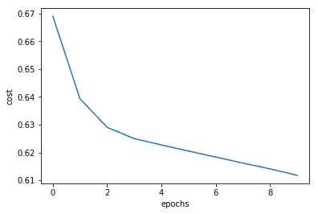

4.  网络现已接受训练； 我们使用它为索引为 150 的随机用户（可能是任何现有用户）获得推荐：

```py
user_index = 150
x = np.array([Xtrain[user_index, :]])
init = tf.global_variables_initializer()
with tf.Session() as sess:
 sess.run(init)
 recommender.set_session(sess)
 out = recommender.reconstruct(x.astype(np.float32))
```

5.  结果与现有数据帧合并，我们可以看到该用户的推荐分数：

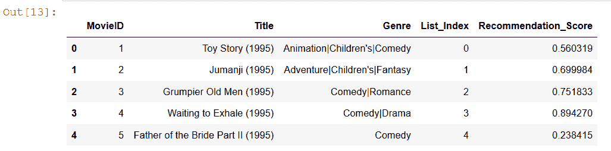

# 还有更多...

杰弗里·欣顿（Geoffrey Hinton）教授领导的多伦多大学团队赢得了 Netflix 最佳协作过滤竞赛的冠军，该协作过滤使用 RBM [（https://en.wikipedia.org/wiki/Netflix_Prize）](https://en.wikipedia.org/wiki/Netflix_Prize)来预测电影的用户收视率。 可以从他们的论文中获取其工作的详细信息： [http://www.cs.toronto.edu/~hinton/absps/netflixICML.pdf](http://www.cs.toronto.edu/~hinton/absps/netflixICML.pdf) 。

一个 RBM 的隐藏单元的输出可以馈送到另一个 RBM 的可见单元，可以重复此过程以形成 RBM 的堆栈。 这导致**堆叠的 RBM** 。 假定不存在其他堆叠式 RBM，则对其进行独立训练。 大量堆叠的 RBM 构成了**深度信任网络（DBN）**。 可以使用有监督或无监督的训练来训练 DBN。 您将在下一个食谱中了解有关它们的更多信息。

# DBN 用于情绪检测

在本食谱中，我们将学习如何首先堆叠 RBM 来制作 DBN，然后训练它来检测情绪。 食谱中有趣的部分是我们采用了两种不同的学习范例：首先，我们使用无监督学习对 RBM 进行了预训练，最后，我们有了一个 MLP 层，该层是使用监督学习进行了训练的。

# 做好准备

我们使用已经在配方*受限玻尔兹曼机*中创建的 RBM 类，只需进行一次更改即可，现在无需在训练后重建图像。 取而代之的是，我们堆叠的 RBM 将仅将数据转发至 DBN 的最后一个 MLP 层。 这是通过从类中删除`reconstruct()`函数并将其替换为`rbm_output()`函数来实现的：

```py
def rbm_output(self,X):
    x = tf.nn.sigmoid(tf.matmul(X, self._W) + self._c)
    return self.session.run(x, feed_dict={self._X: X})
```

对于数据，我们考虑了 Kaggle 面部表情识别数据，该数据可从 [https://www.kaggle.com/c/challenges-in-representation-learning-facial-expression-recognition-challenge](https://www.kaggle.com/c/challenges-in-representation-learning-facial-expression-recognition-challenge) 获得。 此处给出的数据描述为：

The data consists of 48 x 48 pixel grayscale images of faces. The faces have been automatically registered so that the face is more or less centered and occupies about the same amount of space in each image. The task is to categorize each face based on the emotion shown in the facial expression into one of seven categories (0=Angry, 1=Disgust, 2=Fear, 3=Happy, 4=Sad, 5=Surprise, 6=Neutral).
train.csv contains two columns, "emotion" and "pixels". The "emotion" column contains a numeric code ranging from 0 to 6, inclusive, for the emotion that is present in the image. The "pixels" column contains a string surrounded in quotes for each image. The contents of this string are space-separated pixel values in row major order. test.csv contains only the "pixels" column and your task is to predict the emotion column.
The training set consists of 28,709 examples. The public test set used for the leaderboard consists of 3,589 examples. The final test set, which was used to determine the winner of the competition, consists of another 3,589 examples.
This dataset was prepared by Pierre-Luc Carrier and Aaron Courville, as part of an ongoing research project. They have graciously provided the workshop organizers with a preliminary version of their dataset to use for this contest.

完整的数据合而为一。 名为`fer2013.csv`的`csv`文件。 我们从中分离出训练，验证和测试数据：

```py
data = pd.read_csv('data/fer2013.csv')
tr_data = data[data.Usage == "Training"]
test_data = data[data.Usage == "PublicTest"]
mask = np.random.rand(len(tr_data)) < 0.8
train_data = tr_data[mask]
val_data = tr_data[~mask]
```

我们将需要预处理数据，即将像素和情感标签分开。 为此，我们制作了两个函数`dense_to_one_hot ()`，它对标签执行了一个热编码。 第二个功能是`preprocess_data()`，它将单个像素分离为一个数组。 在这两个功能的帮助下，我们生成了训练，验证和测试数据集的输入特征和标签：

```py
def dense_to_one_hot(labels_dense, num_classes):
     num_labels = labels_dense.shape[0]
     index_offset = np.arange(num_labels) * num_classes
     labels_one_hot = np.zeros((num_labels, num_classes))
     labels_one_hot.flat[index_offset + labels_dense.ravel()] = 1
     return labels_one_hot
def preprocess_data(dataframe):
     pixels_values = dataframe.pixels.str.split(" ").tolist()
     pixels_values = pd.DataFrame(pixels_values, dtype=int)
     images = pixels_values.values
     images = images.astype(np.float32)
     images = np.multiply(images, 1.0/255.0)
     labels_flat = dataframe["emotion"].values.ravel()
     labels_count = np.unique(labels_flat).shape[0]
     labels = dense_to_one_hot(labels_flat, labels_count)
     labels = labels.astype(np.uint8)
     return images, labels
```

使用前面代码中定义的函数，我们以训练所需的格式获取数据。 基于本文针对 MNIST 提到的相似原理，我们构建了情感检测 DBN： [https://www.cs.toronto.edu/~hinton/absps/fastnc.pdf](https://www.cs.toronto.edu/~hinton/absps/fastnc.pdf) 。

# 怎么做...

我们按以下步骤进行：

1.  我们需要导入标准模块 TensorFlow，NumPy 和 Pandas，以读取`.csv`文件和 Matplolib：

```py
import tensorflow as tf
import numpy as np
import pandas as pd
import matplotlib.pyplot as plt
```

2.  训练，验证和测试数据是使用帮助程序功能获得的：

```py
X_train, Y_train = preprocess_data(train_data)
X_val, Y_val = preprocess_data(val_data)
X_test, Y_test = preprocess_data(test_data)
```

3.  让我们来探讨一下我们的数据。 我们绘制平均图像并找到每个训练，验证和测试数据集中的图像数量：

```py
# Explore Data
mean_image = X_train.mean(axis=0)
std_image = np.std(X_train, axis=0)
print("Training Data set has {} images".format(len(X_train)))
print("Validation Data set has {} images".format(len(X_val)))
print("Test Data set has {} images".format(len(X_test)))
plt.imshow(mean_image.reshape(48,48), cmap='gray')
```

我们得到的结果如下：

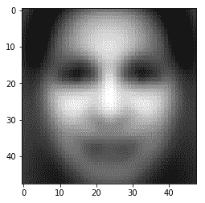

4.  我们还会看到训练样本中的图像及其各自的标签：

```py
classes = ['angry','disgust','fear','happy','sad','surprise','neutral']
num_classes = len(classes)
samples_per_class = 7
for y,cls in enumerate(classes):
     idxs = np.flatnonzero(np.argmax(Y_train, axis =1) == y)
     idxs = np.random.choice(idxs, samples_per_class, replace=False)
     for i, idx in enumerate(idxs):
         plt_idx = i * num_classes + y + 1
         plt.subplot(samples_per_class, num_classes, plt_idx)
         plt.imshow(X_train[idx].reshape(48,48), cmap='gray') #pixel height and width
         plt.axis('off')
         if i == 0:
             plt.title(cls)
plt.show()
```

情节如下：

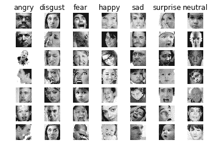

5.  接下来，我们定义 RBM 堆栈； 每个 RBM 都将先前 RBM 的输出作为其输入：

```py
RBM_hidden_sizes = [1500, 700, 400] #create 4 layers of RBM with size 1500, 700, 400 and 100
#Set input as training data
inpX = X_train
#Create list to hold our RBMs
rbm_list = []
#Size of inputs is the number of inputs in the training set
input_size = inpX.shape[1]
#For each RBM we want to generate
for i, size in enumerate(RBM_hidden_sizes):
     print ('RBM: ',i,' ',input_size,'->', size)
     rbm_list.append(RBM(input_size, size))
     input_size = size
```

这将生成三个 RBM：第一个 RBM 具有 2304（48×48）个输入和 1500 个隐藏单元，第二个 RBM 具有 1500 个输入和 700 个隐藏单元，最后第三个 RBM 具有 700 个输入和 400 个隐藏单元。

6.  我们逐一训练每个 RBM。 该技术也称为**贪婪训练**。 在原始论文中，用于在 MNIST 上训练每个 RBM 的时期数是 30，因此在这里，增加时期也应会改善网络的性能：

```py
# Greedy wise training of RBMs
init = tf.global_variables_initializer()
for rbm in rbm_list:
     print ('New RBM:')
     #Train a new one
     with tf.Session() as sess:
         sess.run(init)
         rbm.set_session(sess)
         err = rbm.fit(inpX, 5)
         inpX_n = rbm.rbm_output(inpX)
         print(inpX_n.shape)
         inpX = inpX_n
```

7.  我们定义一个`DBN`类。 在课堂上，我们用三层 RBM 和另外两层 MLP 构建完整的 DBN。 从预训练的 RBM 中加载 RBM 层的权重。 我们还声明了训练和预测 DBN 的方法； 为了进行微调，网络尝试最小化均方损失函数：

```py
class DBN(object):

     def __init__(self, sizes, X, Y, eta = 0.001, momentum = 0.0, epochs = 10, batch_size = 100):
         #Initialize hyperparameters
         self._sizes = sizes
         print(self._sizes)
         self._sizes.append(1000) # size of the first FC layer
         self._X = X
         self._Y = Y
         self.N = len(X)
         self.w_list = []
         self.c_list = []
         self._learning_rate = eta
         self._momentum = momentum
         self._epochs = epochs
         self._batchsize = batch_size
         input_size = X.shape[1]

         #initialization loop
         for size in self._sizes + [Y.shape[1]]:
             #Define upper limit for the uniform distribution range
             max_range = 4 * math.sqrt(6\. / (input_size + size))

             #Initialize weights through a random uniform distribution
             self.w_list.append(
             np.random.uniform( -max_range, max_range, [input_size,         size]).astype(np.float32))

             #Initialize bias as zeroes
             self.c_list.append(np.zeros([size], np.float32))
             input_size = size

         # Build DBN
         #Create placeholders for input, weights, biases, output
         self._a = [None] * (len(self._sizes) + 2)
         self._w = [None] * (len(self._sizes) + 1)
         self._c = [None] * (len(self._sizes) + 1)
         self._a[0] = tf.placeholder("float", [None, self._X.shape[1]])
         self.y = tf.placeholder("float", [None, self._Y.shape[1]])

         #Define variables and activation function
         for i in range(len(self._sizes) + 1):
             self._w[i] = tf.Variable(self.w_list[i])
             self._c[i] = tf.Variable(self.c_list[i])
         for i in range(1, len(self._sizes) + 2):
             self._a[i] = tf.nn.sigmoid(tf.matmul(self._a[i - 1], self._w[i - 1]) + self._c[i - 1])

         #Define the cost function
         cost = tf.reduce_mean(tf.nn.softmax_cross_entropy_with_logits(labels=self.y, logits= self._a[-1]))
         #cost = tf.reduce_mean(tf.square(self._a[-1] - self.y))

         #Define the training operation (Momentum Optimizer minimizing the Cost function)
         self.train_op = tf.train.AdamOptimizer(learning_rate=self._learning_rate).minimize(cost)

         #Prediction operation
         self.predict_op = tf.argmax(self._a[-1], 1)

     #load data from rbm
     def load_from_rbms(self, dbn_sizes,rbm_list):
         #Check if expected sizes are correct
         assert len(dbn_sizes) == len(self._sizes)

         for i in range(len(self._sizes)):
             #Check if for each RBN the expected sizes are correct
             assert dbn_sizes[i] == self._sizes[i]

         #If everything is correct, bring over the weights and biases
         for i in range(len(self._sizes)-1):
             self.w_list[i] = rbm_list[i]._W
             self.c_list[i] = rbm_list[i]._c

     def set_session(self, session):
         self.session = session

    #Training method
     def train(self, val_x, val_y):
         #For each epoch
         num_batches = self.N // self._batchsize

         batch_size = self._batchsize
         for i in range(self._epochs):
             #For each step
             for j in range(num_batches):
                 batch = self._X[j * batch_size: (j * batch_size + batch_size)]
                 batch_label = self._Y[j * batch_size: (j * batch_size + batch_size)]

                 self.session.run(self.train_op, feed_dict={self._a[0]: batch, self.y: batch_label})

                 for j in range(len(self._sizes) + 1):
                     #Retrieve weights and biases
                     self.w_list[j] = sess.run(self._w[j])
                     self.c_list[j] = sess.run(self._c[j])

             train_acc = np.mean(np.argmax(self._Y, axis=1) ==
 self.session.run(self.predict_op, feed_dict={self._a[0]: self._X, self.y: self._Y}))

             val_acc = np.mean(np.argmax(val_y, axis=1) ==
 self.session.run(self.predict_op, feed_dict={self._a[0]: val_x, self.y: val_y}))
             print (" epoch " + str(i) + "/" + str(self._epochs) + " Training Accuracy: " +  str(train_acc) + " Validation Accuracy: " + str(val_acc))

     def predict(self, X):
         return self.session.run(self.predict_op, feed_dict={self._a[0]: X})
```

8.  现在，我们训练实例化`DBN`对象并对其进行训练。 并预测测试数据的标签：

```py
nNet = DBN(RBM_hidden_sizes, X_train, Y_train, epochs = 80)
with tf.Session() as sess:
     #Initialize Variables
     sess.run(tf.global_variables_initializer())
     nNet.set_session(sess)
     nNet.load_from_rbms(RBM_hidden_sizes,rbm_list)
     nNet.train(X_val, Y_val)
     y_pred = nNet.predict(X_test)
```

# 这个怎么运作...

RBM 使用无监督学习来学习模型的隐藏表示/功能，然后对与预训练 RBM 一起添加的全连接层进行微调。

这里的精度在很大程度上取决于图像表示。 在前面的食谱中，我们没有使用图像处理，仅使用了 0 到 1 之间缩放的灰度图像。但是，如果我们按照以下论文所述添加图像处理，则会进一步提高精度- [http：// deeplearning。 净/wp-content/uploads/2013/03/dlsvm.pdf](http://deeplearning.net/wp-content/uploads/2013/03/dlsvm.pdf) 。 因此，我们在`preprocess_data`函数中将每个图像乘以 100.0 / 255.0，然后将以下几行代码添加到主代码中：

```py
std_image = np.std(X_train, axis=0)
X_train = np.divide(np.subtract(X_train,mean_image), std_image)
X_val = np.divide(np.subtract(X_val,mean_image), std_image)
X_test = np.divide(np.subtract(X_test,mean_image), std_image)
```

# 还有更多...

在前面的示例中，没有进行预处理，这三个数据集的准确性大约为 40％。 但是，当我们添加预处理时，训练数据的准确性将提高到 90％，但是对于验证和测试，我们仍然可以获得约 45％的准确性。

可以引入许多更改来改善结果。 首先，我们在配方中使用的数据集是只有 22,000 张图像的 Kaggle 数据集。 如果观察这些图像，则会发现仅过滤面部的步骤会改善结果。 如下文所述，另一种策略是增加隐藏层的大小而不是减小它们的大小- [https://www.cs.swarthmore.edu/~meeden/cs81/s14/papers/KevinVincent.pdf [](https://www.cs.swarthmore.edu/~meeden/cs81/s14/papers/KevinVincent.pdf) 。

在识别情绪方面确实非常成功的另一个更改是使用面部关键点而不是整个面部训练， [http://cs229.stanford.edu/proj2010/McLaughlinLeBayanbat-RecognizingEmotionsWithDeepBeliefNets.pdf](http://cs229.stanford.edu/proj2010/McLaughlinLeBayanbat-RecognizingEmotionsWithDeepBeliefNets.pdf) 。

使用前面的配方，您可以尝试这些更改并探索性能如何提高。 愿 GPU 力量与您同在！