# 八、自编码器

自编码器是前馈，非循环神经网络，可通过无监督学习来学习。 他们具有学习数据的紧凑表示的固有能力。 它们是深度信念网络的中心，可在图像重建，聚类，机器翻译等领域找到应用。 在本章中，您将学习和实现自编码器的不同变体，并最终学习如何堆叠自编码器。 本章包括以下主题：

*   普通自编码器
*   稀疏自编码器
*   去噪自编码器
*   卷积自编码器
*   栈式自编码器

# 介绍

自编码器，也称为**空竹网络**或**自动关联器**，最初由 Hinton 和 PDP 小组于 1980 年代提出。 它们是前馈网络，没有任何反馈，并且它们是通过无监督学习来学习的。 像第 3 章的多人感知机，神经网络感知机一样，它们使用反向传播算法进行学习，但有一个主要区别-目标与输入相同。

我们可以认为自编码器由两个级联网络组成-第一个网络是编码器，它接受输入`x`，然后使用变换`h`将其编码为编码信号`y`：

`y = h(x)`

第二网络使用编码信号`y`作为其输入，并执行另一个变换`f`以获得重构信号`r`：

`r = f(y) = f(h(x))`

我们将误差`e`定义为原始输入`x`与重构信号`r`之间的差，`e = x - r`。然后，网络通过减少**均方误差**（**MSE**）进行学习，并且像 MLP 一样，该错误会传播回隐藏层。 下图显示了自编码器，其中编码器和解码器分别突出显示。 自编码器可以具有权重分配，也就是说，解码器和编码器的权重只是彼此的换位，这可以在训练参数数量较少时帮助网络更快地学习，但同时会降低编码器的自由度。 网络。 它们与第 7 章“无监督学习”的 RBM 非常相似，但有一个很大的区别-自编码器中神经元的状态是确定性的，而在 RBM 中，神经元是概率性的：

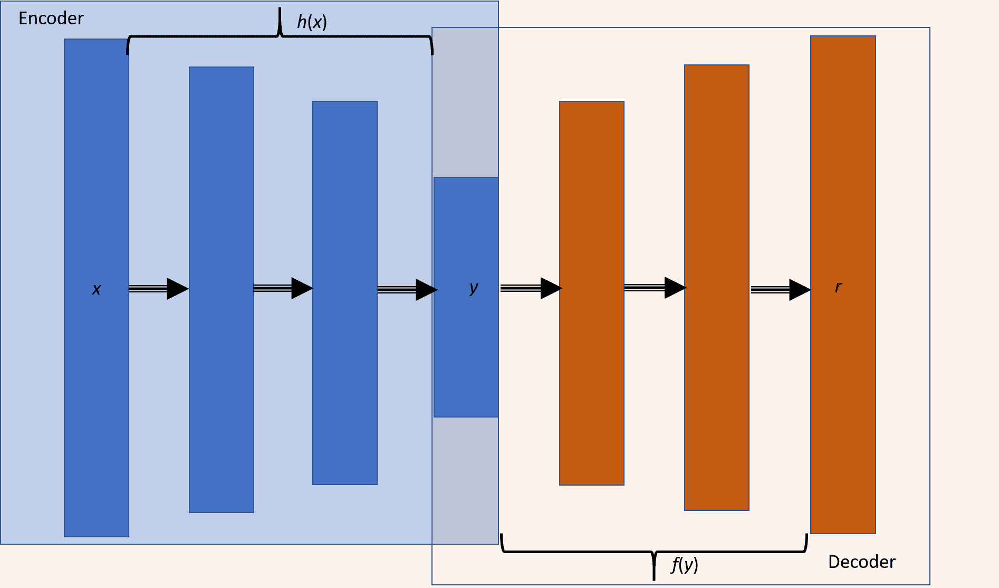

根据隐藏层的大小，自编码器分为**不完整**（隐藏层的神经元少于输入层）或**过完整**（隐藏层的神经元多于输入层）。 。 根据对损失施加的限制/约束，我们有多种类型的自编码器：稀疏自编码器，降噪自编码器和卷积自编码器。 在本章中，您将了解自编码器中的这些变体，并使用 TensorFlow 实现它们。

自编码器的明显应用之一是在降维领域[2]。 结果表明，与 PCA 相比，自编码器产生了更好的结果。 自编码器还可以用于特征提取[3]，文档检索[2]，分类和异常检测。

# 另见

*   `Rumelhart, David E., Geoffrey E. Hinton, and Ronald J. Williams. Learning internal representations by error propagation. No. ICS-8506. California Univ San Diego La Jolla Inst for Cognitive Science, 1985. (http://www.cs.toronto.edu/~fritz/absps/pdp8.pdf)`

*   `Hinton, Geoffrey E., and Ruslan R. Salakhutdinov. Reducing the dimensionality of data with neural networks, science 313.5786 (2006): 504-507. (https://pdfs.semanticscholar.org/7d76/b71b700846901ac4ac119403aa737a285e36.pdf)`

*   `Masci, Jonathan, et al. Stacked convolutional auto-encoders for hierarchical feature extraction. Artificial Neural Networks and Machine Learning–ICANN 2011 (2011): 52-59. (https://www.researchgate.net/profile/Jonathan_Masci/publication/221078713_Stacked_Convolutional_Auto-Encoders_for_Hierarchical_Feature_Extraction/links/0deec518b9c6ed4634000000/Stacked-Convolutional-Auto-Encoders-for-Hierarchical-Feature-Extraction.pdf)`

*   `Japkowicz, Nathalie, Catherine Myers, and Mark Gluck. A novelty detection approach to classification. IJCAI. Vol. 1. 1995. (http://www.ijcai.org/Proceedings/95-1/Papers/068.pdf)`

# 普通自编码器

Hinton 提出的普通自编码器仅包含一个隐藏层。 隐藏层中神经元的数量少于输入（或输出）层中神经元的数量。 这导致对网络中信息流产生瓶颈效应，因此我们可以将隐藏层视为瓶颈层，从而限制了要存储的信息。 自编码器中的学习包括在隐藏层上开发输入信号的紧凑表示，以便输出层可以忠实地再现原始输入：

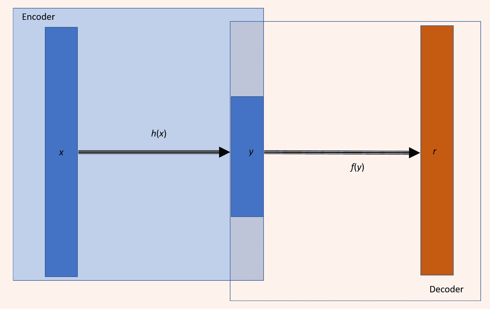

具有单个隐藏层的自动编码器

# 准备

此秘籍将使用自编码器进行图像重建； 我们将在 MNIST 数据库上训练自编码器，并将其用于重建测试图像。

# 操作步骤

我们按以下步骤进行：

1.  与往常一样，第一步是导入所有必需的模块：

```py
import tensorflow as tf
import numpy as np
from tensorflow.examples.tutorials.mnist import input_data
import matplotlib.pyplot as plt
%matplotlib inline
```

2.  接下来，我们从 TensorFlow 示例中获取 MNIST 数据-这里要注意的重要一点是，标签不是一次性编码的，仅仅是因为我们没有使用标签来训练网络。 自编码器通过无监督学习来学习：

```py
mnist = input_data.read_data_sets("MNIST_data/")
trX, trY, teX, teY = mnist.train.images, mnist.train.labels, mnist.test.images, mnist.test.labels
```

3.  接下来，我们声明一个类`AutoEncoder`； 该类具有`init`方法来为自编码器初始化权重，偏差和占位符。 我们还可以使用`init`方法构建完整的图形。 该类还具有用于`encoder`，`decoder`，设置会话（`set_session`）和`fit`的方法。 我们在此处构建的自编码器使用简单的 MSE 作为`loss`函数，我们尝试使用`AdamOptimizer`对其进行优化：

```py
class AutoEncoder(object):
def __init__(self, m, n, eta = 0.01):
"""
m: Number of neurons in input/output layer
n: number of neurons in hidden layer
"""
self._m = m
self._n = n
self.learning_rate = eta

# Create the Computational graph

# Weights and biases
self._W1 = tf.Variable(tf.random_normal(shape=(self._m,self._n)))
self._W2 = tf.Variable(tf.random_normal(shape=(self._n,self._m)))
self._b1 = tf.Variable(np.zeros(self._n).astype(np.float32)) #bias for hidden layer
self._b2 = tf.Variable(np.zeros(self._m).astype(np.float32)) #bias for output layer

# Placeholder for inputs
self._X = tf.placeholder('float', [None, self._m])

self.y = self.encoder(self._X)
self.r = self.decoder(self.y)
error = self._X - self.r

self._loss = tf.reduce_mean(tf.pow(error, 2))
self._opt = tf.train.AdamOptimizer(self.learning_rate).minimize(self._loss)

def encoder(self, x):
h = tf.matmul(x, self._W1) + self._b1
return tf.nn.sigmoid(h)

def decoder(self, x):
h = tf.matmul(x, self._W2) + self._b2
return tf.nn.sigmoid(h)

def set_session(self, session):
self.session = session

def reduced_dimension(self, x):
h = self.encoder(x)
return self.session.run(h, feed_dict={self._X: x})

def reconstruct(self,x):
h = self.encoder(x)
r = self.decoder(h)
return self.session.run(r, feed_dict={self._X: x})

def fit(self, X, epochs = 1, batch_size = 100):
N, D = X.shape
num_batches = N // batch_size

obj = []
for i in range(epochs):
#X = shuffle(X)
for j in range(num_batches):
    batch = X[j * batch_size: (j * batch_size + batch_size)]
    _, ob = self.session.run([self._opt,self._loss], feed_dict={self._X: batch})
    if j % 100 == 0 and i % 100 == 0:
        print('training epoch {0} batch {2} cost {1}'.format(i,ob, j)) 
obj.append(ob)
return obj
```

为了能够在训练后使用自编码器，我们还定义了两个工具函数：`reduced_dimension`提供编码器网络的输出，`reconstruct`重构最终图像。

4.  我们将输入数据转换为`float`进行训练，初始化所有变量，然后开始计算会话。 在计算中，我们目前仅测试自编码器的重构能力：

```py
Xtrain = trX.astype(np.float32)
Xtest = teX.astype(np.float32)
_, m = Xtrain.shape

autoEncoder = AutoEncoder(m, 256)

#Initialize all variables
init = tf.global_variables_initializer()
with tf.Session() as sess:
    sess.run(init)
    autoEncoder.set_session(sess)
    err = autoEncoder.fit(Xtrain, epochs=10)
    out = autoEncoder.reconstruct(Xtest[0:100])
```

5.  我们可以通过绘制误差与时期的关系图来验证我们的网络在训练时是否确实优化了 MSE。 为了获得良好的训练，应该使用`epochs`来减少错误：

```py
plt.plot(err)
plt.xlabel('epochs')
plt.ylabel('cost')
```

该图如下所示：

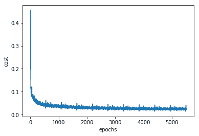

我们可以看到，随着网络的学习，损耗/成本正在降低，到我们达到 5,000 个周期时，损耗/成本几乎在一条线上振荡。 这意味着进一步增加时期将是无用的。 如果现在要改善训练，则应该更改超参数，例如学习率，批处理大小和使用的优化程序。

6.  现在让我们看一下重建的图像。 在这里，您可以同时看到由我们的自编码器生成的原始图像和重建图像：

```py
# Plotting original and reconstructed images
row, col = 2, 8
idx = np.random.randint(0, 100, row * col // 2)
f, axarr = plt.subplots(row, col, sharex=True, sharey=True, figsize=(20,4))
for fig, row in zip([Xtest,out], axarr):
    for i,ax in zip(idx,row):
        ax.imshow(fig[i].reshape((28, 28)), cmap='Greys_r')
        ax.get_xaxis().set_visible(False)
        ax.get_yaxis().set_visible(False)
```

我们得到以下结果：

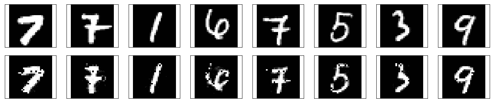

# 工作原理

有趣的是，在前面的代码中，我们将输入的尺寸从 784 减少到 256，并且我们的网络仍可以重建原始图像。 让我们比较一下具有相同隐藏层尺寸的 RBM（第 7 章，无监督学习）的表现：

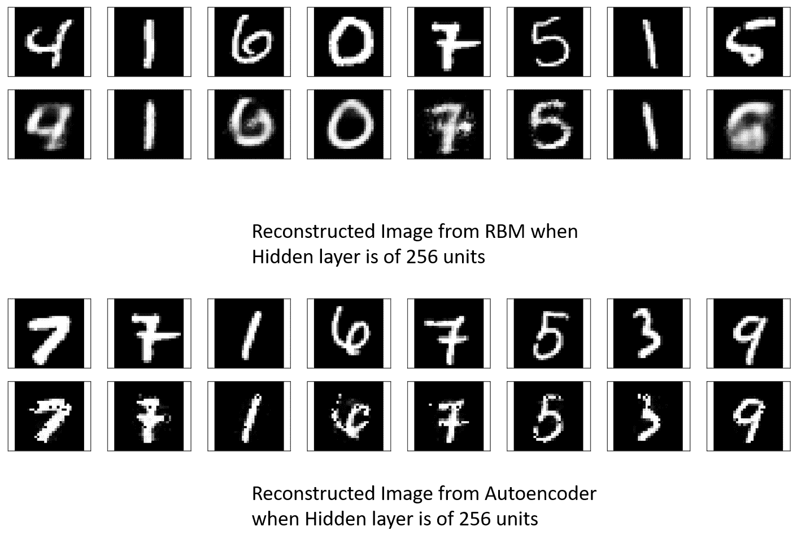

我们可以看到，自编码器重建的图像比 RBM 重建的图像更清晰。 原因是，在自编码器中，还有其他权重（从隐藏层到解码器输出层的权重）需要训练，因此保留了学习知识。 随着自编码器了解更多，即使两者都将信息压缩到相同的尺寸，它的表现也比 RBM 更好。

# 更多

诸如 PCA 之类的自编码器可以用于降维，但是 PCA 仅可以表示线性变换，但是我们可以在自编码器中使用非线性激活函数，从而在编码中引入非线性。 这是从 Hinton 论文复制的结果，该结果使用*神经网络*降低了数据的维数。 该结果将 PCA（A）的结果与栈式 RBM 作为具有 784-1000-500-250-2 架构的自编码器的结果进行了比较：


正如我们稍后将看到的，当使用栈式自编码器制作自编码器时，每个自编码器最初都经过单独的预训练，然后对整个网络进行微调以获得更好的表现。

# 稀疏自编码器

我们在前面的秘籍中看到的自编码器的工作方式更像是一个身份网络-它们只是重构输入。 重点是在像素级别重建图像，唯一的限制是瓶颈层中的单元数； 有趣的是，像素级重建不能确保网络将从数据集中学习抽象特征。 通过添加更多约束，我们可以确保网络从数据集中学习抽象特征。

在稀疏自编码器中，将稀疏惩罚项添加到重构错误中，以确保在任何给定时间触发瓶颈层中较少的单元。 如果`m`是输入模式的总数，那么我们可以定义一个数量`ρ_hat`（您可以在 [Andrew Ng 的讲座](https://web.stanford.edu/class/cs294a/sparseAutoencoder_2011new.pdf)中检查数学细节），它测量每个隐藏层单位的净活动（平均触发多少次）。 基本思想是放置一个约束`ρ_hat`，使其等于稀疏性参数`ρ`。这导致损失函数中添加了稀疏性的正则项，因此现在`loss`函数如下：

```py
loss = Mean squared error + Regularization for sparsity parameter
```

如果`ρ_hat`偏离`ρ`，则此正则化项将对网络造成不利影响；做到这一点的一种标准方法是使用`ρ`和`ρ_hat`之间的 **Kullback-Leiber** （**KL**）差异。

# 准备

在开始秘籍之前，让我们进一步探讨 KL 的差异，`D[KL]`。 它是两个分布之间差异的非对称度量，在我们的情况下为`ρ`和`ρ_hat`。当`ρ`和`ρ_hat`相等时，则为零，否则，当`ρ_hat`与`ρ`分叉时，它单调增加。在数学上，它表示为：


这是固定`ρ = 0.3`时`D[KL]`的图，我们可以看到当`ρ_hat = 0.3`时，`D[KL] = 0`；否则在两端单调增长：

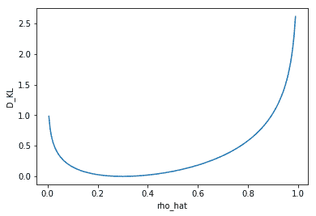

# 操作步骤

我们按以下步骤进行：

1.  我们导入必要的模块：

```py
import tensorflow as tf
import numpy as np
from tensorflow.examples.tutorials.mnist import input_data
import matplotlib.pyplot as plt
%matplotlib inline
```

2.  从 TensorFlow 示例中加载 MNIST 数据集：

```py
mnist = input_data.read_data_sets("MNIST_data/")
trX, trY, teX, teY = mnist.train.images, mnist.train.labels, mnist.test.images, mnist.test.labels
```

3.  定义`SparseAutoEncoder`类，它与前面的秘籍中的`AutoEncoder`类非常相似，除了引入了 KL 散度损失之外：

```py
def kl_div(self, rho, rho_hat):
 term2_num = tf.constant(1.)- rho
 term2_den = tf.constant(1.) - rho_hat
 kl = self.logfunc(rho,rho_hat) + self.logfunc(term2_num, term2_den)
 return kl

 def logfunc(self, x1, x2):
 return tf.multiply( x1, tf.log(tf.div(x1,x2)))

```

我们将 KL 约束添加到损失中，如下所示：

```py
alpha = 7.5e-5
kl_div_loss = tf.reduce_sum(self.kl_div(0.02, tf.reduce_mean(self.y,0)))
loss = self._loss + alpha * kl_div_loss
```

在此，`alpha`是赋予稀疏性约束的权重。 该类的完整代码如下：

```py
class SparseAutoEncoder(object):
 def __init__(self, m, n, eta = 0.01):
 """
 m: Number of neurons in input/output layer
 n: number of neurons in hidden layer
 """
 self._m = m
 self._n = n
 self.learning_rate = eta

 # Create the Computational graph

 # Weights and biases
 self._W1 = tf.Variable(tf.random_normal(shape=(self._m,self._n)))
 self._W2 = tf.Variable(tf.random_normal(shape=(self._n,self._m)))
 self._b1 = tf.Variable(np.zeros(self._n).astype(np.float32)) #bias for hidden layer
 self._b2 = tf.Variable(np.zeros(self._m).astype(np.float32)) #bias for output layer

 # Placeholder for inputs
 self._X = tf.placeholder('float', [None, self._m])

 self.y = self.encoder(self._X)
 self.r = self.decoder(self.y)
 error = self._X - self.r

 self._loss = tf.reduce_mean(tf.pow(error, 2))
 alpha = 7.5e-5
 kl_div_loss = tf.reduce_sum(self.kl_div(0.02,   tf.reduce_mean(self.y,0)))
 loss = self._loss + alpha * kl_div_loss 
 self._opt = tf.train.AdamOptimizer(self.learning_rate).minimize(loss)

 def encoder(self, x):
 h = tf.matmul(x, self._W1) + self._b1
 return tf.nn.sigmoid(h)

 def decoder(self, x):
 h = tf.matmul(x, self._W2) + self._b2
 return tf.nn.sigmoid(h)

 def set_session(self, session):
 self.session = session

 def reduced_dimension(self, x):
 h = self.encoder(x)
 return self.session.run(h, feed_dict={self._X: x})

 def reconstruct(self,x):
 h = self.encoder(x)
 r = self.decoder(h)
 return self.session.run(r, feed_dict={self._X: x})

 def kl_div(self, rho, rho_hat):
 term2_num = tf.constant(1.)- rho
 term2_den = tf.constant(1.) - rho_hat
 kl = self.logfunc(rho,rho_hat) + self.logfunc(term2_num, term2_den)
 return kl

 def logfunc(self, x1, x2):
 return tf.multiply( x1, tf.log(tf.div(x1,x2)))

 def fit(self, X, epochs = 1, batch_size = 100):
 N, D = X.shape
 num_batches = N // batch_size

 obj = []
 for i in range(epochs):
     #X = shuffle(X)
     for j in range(num_batches):
         batch = X[j * batch_size: (j * batch_size + batch_size)]
         _, ob = self.session.run([self._opt,self._loss], feed_dict={self._X: batch})
         if j % 100 == 0:
             print('training epoch {0} batch {2} cost {1}'.format(i,ob, j)) 
obj.append(ob)
 return obj
```

4.  接下来，我们声明`SparseAutoEncoder`类的对象，对训练数据进行拟合，并计算重建的图像：

```py
Xtrain = trX.astype(np.float32)
Xtest = teX.astype(np.float32)
_, m = Xtrain.shape
sae = SparseAutoEncoder(m, 256)
#Initialize all variables
init = tf.global_variables_initializer()
with tf.Session() as sess:
 sess.run(init)
 sae.set_session(sess)
 err = sae.fit(Xtrain, epochs=10)
 out = sae.reconstruct(Xtest[0:100])
```

5.  让我们看看随着网络学习，均方重构损失的变化：

```py
plt.plot(err)
plt.xlabel('epochs')
plt.ylabel('Reconstruction Loss (MSE)')
```

情节如下：

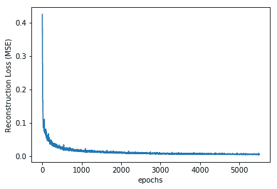

6.  让我们看一下重建的图像：

```py
# Plotting original and reconstructed images
row, col = 2, 8
idx = np.random.randint(0, 100, row * col // 2)
f, axarr = plt.subplots(row, col, sharex=True, sharey=True, figsize=(20,4))
for fig, row in zip([Xtest,out], axarr):
    for i,ax in zip(idx,row):
        ax.imshow(fig[i].reshape((28, 28)), cmap='Greys_r')
        ax.get_xaxis().set_visible(False)
        ax.get_yaxis().set_visible(False)
```

我们得到以下结果：

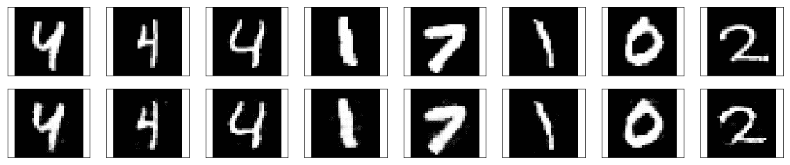

# 工作原理

您必须已经注意到，稀疏自编码器的主要代码与普通自编码器的主要代码完全相同，这是因为稀疏自编码器只有一个主要变化-增加了 KL 发散损耗以确保稀疏性。 隐藏的（瓶颈）层。 但是，如果比较这两个重构，则可以发现即使在隐藏层中具有相同数量的单位，稀疏自编码器也比标准编码器好得多：

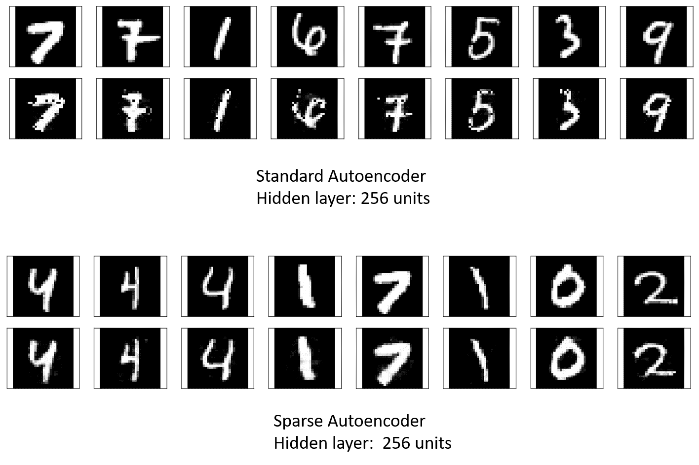

训练 MNIST 数据集的原始自编码器后的重建损失为 0.022，而稀疏自编码器则为 0.006。 因此，添加约束会迫使网络学习数据的隐藏表示。

# 更多

输入的紧凑表示形式以权重存储； 让我们可视化网络学习到的权重。 这分别是标准自编码器和稀疏自编码器的编码器层的权重。 我们可以看到，在标准自编码器中，许多隐藏单元的权重非常大，表明它们工作过度：

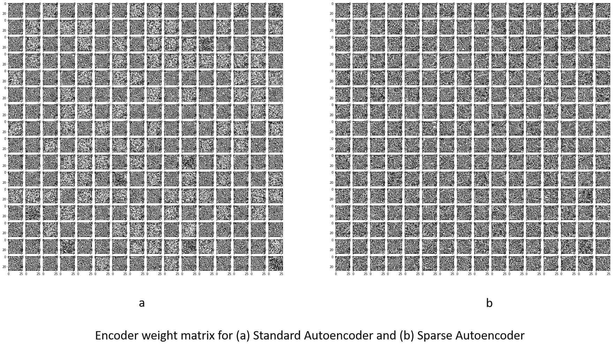

# 另见

*   <http://web.engr.illinois.edu/~hanj/cs412/bk3/KL-divergence.pdf>
*   <https://en.wikipedia.org/wiki/Kullback%E2%80%93Leibler_divergence>

# 去噪自编码器

我们在前两个秘籍中探讨过的两个自编码器是**未完成的**自编码器的示例，因为与输入（输出）层相比，它们中的隐藏层具有较低的尺寸。 去噪自编码器属于**过完整**自编码器的类别，因为当隐藏层的尺寸大于输入层的尺寸时，它会更好地工作。

去噪自编码器从损坏的（嘈杂的）输入中学习； 它为编码器网络提供噪声输入，然后将来自解码器的重建图像与原始输入进行比较。 这个想法是，这将帮助网络学习如何去噪输入。 它不再只是按像素进行比较，而是为了进行去噪，还将学习相邻像素的信息。

# 准备

去噪自编码器还将具有 KL 散度惩罚项； 它在两个主要方面与先前秘籍的稀疏自编码器有所不同。 首先，`n_hidden > m`瓶颈层中的隐藏单元数大于输入层`m`中的单元数`n_hidden > m`。 其次，编码器的输入已损坏。 为了在 TensorFlow 中做到这一点，我们添加了`invalid`函数，这给输入增加了噪音：

```py
def corruption(x, noise_factor = 0.3): #corruption of the input
    noisy_imgs = x + noise_factor * np.random.randn(*x.shape)
    noisy_imgs = np.clip(noisy_imgs, 0., 1.)
    return noisy_imgs
```

# 操作步骤

1.  像往常一样，第一步是导入必要的模块-TensorFlow，numpy 来操纵输入数据，matplotlib 来进行绘制，等等：

```py
import tensorflow as tf
import numpy as np
from tensorflow.examples.tutorials.mnist import input_data
import matplotlib.pyplot as plt
import math
%matplotlib inline
```

2.  从 TensorFlow 示例中加载数据。 在本章的所有秘籍中，我们都使用标准的 MNIST 数据库进行说明，以便为您提供不同自编码器之间的基准。

```py
mnist = input_data.read_data_sets("MNIST_data/")
trX, trY, teX, teY = mnist.train.images, mnist.train.labels, mnist.test.images, mnist.test.labels
```

3.  接下来，我们定义此秘籍的主要组成部分`DenoisingAutoEncoder`类。 该类与我们在前面的秘籍中创建的`SparseAutoEncoder`类非常相似。 在这里，我们为噪点图像添加了一个占位符； 该噪声输入被馈送到编码器。 现在，当输入的是噪点图像时，重构误差就是原始清晰图像与解码器输出之间的差。 我们在此保留稀疏惩罚条款。 因此，拟合函数将原始图像和噪声图像都作为其参数。

```py
class DenoisingAutoEncoder(object):
def __init__(self, m, n, eta = 0.01):
"""
m: Number of neurons in input/output layer
n: number of neurons in hidden layer
"""
self._m = m
self._n = n
self.learning_rate = eta

# Create the Computational graph

# Weights and biases
self._W1 = tf.Variable(tf.random_normal(shape=(self._m,self._n)))
self._W2 = tf.Variable(tf.random_normal(shape=(self._n,self._m)))
self._b1 = tf.Variable(np.zeros(self._n).astype(np.float32)) #bias for hidden layer
self._b2 = tf.Variable(np.zeros(self._m).astype(np.float32)) #bias for output layer

# Placeholder for inputs
self._X = tf.placeholder('float', [None, self._m])

self._X_noisy = tf.placeholder('float', [None, self._m])

self.y = self.encoder(self._X_noisy)
self.r = self.decoder(self.y)
error = self._X - self.r

self._loss = tf.reduce_mean(tf.pow(error, 2))
#self._loss = tf.reduce_mean(tf.nn.sigmoid_cross_entropy_with_logits(labels =self._X, logits = self.r))
alpha = 0.05
kl_div_loss = tf.reduce_sum(self.kl_div(0.02, tf.reduce_mean(self.y,0)))
loss = self._loss + alpha * kl_div_loss 
self._opt = tf.train.AdamOptimizer(self.learning_rate).minimize(loss)

def encoder(self, x):
h = tf.matmul(x, self._W1) + self._b1
return tf.nn.sigmoid(h)

def decoder(self, x):
h = tf.matmul(x, self._W2) + self._b2
return tf.nn.sigmoid(h)

def set_session(self, session):
self.session = session

def reconstruct(self,x):
h = self.encoder(x)
r = self.decoder(h)
return self.session.run(r, feed_dict={self._X: x})

def kl_div(self, rho, rho_hat):
term2_num = tf.constant(1.)- rho
term2_den = tf.constant(1.) - rho_hat
kl = self.logfunc(rho,rho_hat) + self.logfunc(term2_num, term2_den)
return kl

def logfunc(self, x1, x2):
return tf.multiply( x1, tf.log(tf.div(x1,x2)))

def corrupt(self,x):
return x * tf.cast(tf.random_uniform(shape=tf.shape(x), minval=0,maxval=2),tf.float32)

def getWeights(self):
return self.session.run([self._W1, self._W2,self._b1, self._b2])

def fit(self, X, Xorg, epochs = 1, batch_size = 100):
N, D = X.shape
num_batches = N // batch_size

obj = []
for i in range(epochs):
#X = shuffle(X)
for j in range(num_batches):
batch = X[j * batch_size: (j * batch_size + batch_size)]
batchO = Xorg[j * batch_size: (j * batch_size + batch_size)]
_, ob = self.session.run([self._opt,self._loss], feed_dict={self._X: batchO, self._X_noisy: batch})
if j % 100 == 0:
print('training epoch {0} batch {2} cost {1}'.format(i,ob, j)) 
obj.append(ob)
return obj
```

也可以向自编码器对象添加噪声。 在这种情况下，您将使用类`self._X_noisy = self.corrupt(self._X) * 0.3 + self._X * (1 - 0.3)`中定义的损坏方法，并且`fit`方法也将更改为以下内容：

```py
def fit(self, X, epochs = 1, batch_size = 100):
        N, D = X.shape
        num_batches = N // batch_size

        obj = []
        for i in range(epochs):
            #X = shuffle(X)
            for j in range(num_batches):
                batch = X[j * batch_size: (j * batch_size + batch_size)]
                _, ob = self.session.run([self._opt,self._loss], feed_dict={self._X: batch})
                if j % 100 == 0:
                    print('training epoch {0} batch {2} cost {1}'.format(i,ob, j)) 
                obj.append(ob)
        return obj
```

4.  现在，我们使用前面定义的损坏函数来生成一个嘈杂的图像并将其提供给会话：

```py
n_hidden = 800
Xtrain = trX.astype(np.float32)
Xtrain_noisy = corruption(Xtrain).astype(np.float32)
Xtest = teX.astype(np.float32)
#noise = Xtest * np.random.randint(0, 2, Xtest.shape).astype(np.float32)
Xtest_noisy = corruption(Xtest).astype(np.float32) #Xtest * (1-0.3)+ noise *(0.3)
_, m = Xtrain.shape

dae = DenoisingAutoEncoder(m, n_hidden)

#Initialize all variables
init = tf.global_variables_initializer()
with tf.Session() as sess:
 sess.run(init)
 dae.set_session(sess)
 err = dae.fit(Xtrain_noisy, Xtrain, epochs=10)
 out = dae.reconstruct(Xtest_noisy[0:100])
 W1, W2, b1, b2 = dae.getWeights()
 red = dae.reduced_dimension(Xtrain)
```

5.  随着网络的学习，重建损失减少：

```py
plt.plot(err)
plt.xlabel('epochs')
plt.ylabel('Reconstruction Loss (MSE)')
```

情节如下：

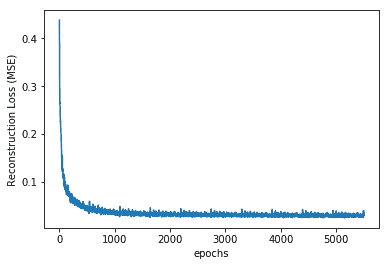

6.  当来自测试数据集的嘈杂图像呈现给训练网络时，重建图像如下：

```py
# Plotting original and reconstructed images
row, col = 2, 8
idx = np.random.randint(0, 100, row * col // 2)
f, axarr = plt.subplots(row, col, sharex=True, sharey=True, figsize=(20,4))
for fig, row in zip([Xtest_noisy,out], axarr):
 for i,ax in zip(idx,row):
 ax.imshow(fig[i].reshape((28, 28)), cmap='Greys_r')
 ax.get_xaxis().set_visible(False)
 ax.get_yaxis().set_visible(False)
```

我们得到以下结果：

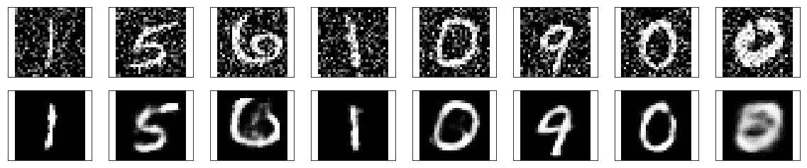

# 另见

*   <https://cs.stanford.edu/people/karpathy/convnetjs/demo/autoencoder.html>
*   <http://blackecho.github.io/blog/machine-learning/2016/02/29/denoising-autoencoder-tensorflow.html>

# 卷积自编码器

研究人员发现**卷积神经网络**（**CNN**）与图像效果最佳，因为它们可以提取隐藏在图像中的空间信息。 因此，很自然地假设，如果编码器和解码器网络由 CNN 组成，它将比其余的自编码器更好地工作，因此我们有了**卷积自编码器**（**CAE**）。 在第 4 章“卷积神经网络”中，说明了卷积和最大池化的过程，我们将以此为基础来了解卷积自编码器的工作原理。

CAE 是其中编码器和解码器均为 CNN 网络的一种 CAE。 编码器的卷积网络学习将输入编码为一组信号，然后解码器 CNN 尝试从中重建输入。 它们充当通用特征提取器，并学习从输入捕获特征所需的最佳过滤器。

# 准备

从第 4 章“卷积神经网络”中，您了解到，随着添加卷积层，传递到下一层的信息在空间范围上会减少，但是在自编码器中，重建的图像应该有输入图像的相同的大小和深度。 这意味着解码器应以某种方式对图像进行大小调整和卷积以重建原始图像。 与卷积一起增加空间范围的一种方法是借助**转置的卷积层**。 通过`tf.nn.conv2d_transpose`可以轻松地在 TensorFlow 中实现这些功能，但是发现转置的卷积层会在最终图像中产生伪像。 奥古斯都·奥德纳（Augustus Odena）等。 [1]在他们的工作中表明，可以通过使用最近邻或双线性插值（上采样）再加上卷积层来调整图层的大小来避免这些伪像。 他们通过`tf.image.resize_images`实现了最近邻插值，取得了最佳结果； 我们将在此处采用相同的方法。

# 操作步骤

1.  与往常一样，第一步包括必要的模块：

```py
import tensorflow as tf
import numpy as np
from tensorflow.examples.tutorials.mnist import input_data
import matplotlib.pyplot as plt
import math
%matplotlib inline
```

2.  加载输入数据：

```py
mnist = input_data.read_data_sets("MNIST_data/")
trX, trY, teX, teY = mnist.train.images, mnist.train.labels, mnist.test.images, mnist.test.labels
```

3.  定义网络参数。 在这里，我们还计算每个最大池层的输出的空间尺寸。 我们需要以下信息来对解码器网络中的图像进行升采样：

```py
# Network Parameters
h_in, w_in = 28, 28 # Image size height and width
k = 3 # Kernel size
p = 2 # pool
s = 2 # Strides in maxpool
filters = {1:32,2:32,3:16}
activation_fn=tf.nn.relu
# Change in dimensions of image after each MaxPool
h_l2, w_l2 = int(np.ceil(float(h_in)/float(s))) , int(np.ceil(float(w_in)/float(s))) # Height and width: second encoder/decoder layer
h_l3, w_l3 = int(np.ceil(float(h_l2)/float(s))) , int(np.ceil(float(w_l2)/float(s))) # Height and width: third encoder/decoder layer
```

4.  为输入（嘈杂的图像）和目标（对应的清晰图像）创建占位符：

```py
X_noisy = tf.placeholder(tf.float32, (None, h_in, w_in, 1), name='inputs')
X = tf.placeholder(tf.float32, (None, h_in, w_in, 1), name='targets')
```

5.  建立编码器和解码器网络：

```py
### Encoder
conv1 = tf.layers.conv2d(X_noisy, filters[1], (k,k), padding='same', activation=activation_fn)
# Output size h_in x w_in x filters[1]
maxpool1 = tf.layers.max_pooling2d(conv1, (p,p), (s,s), padding='same')
# Output size h_l2 x w_l2 x filters[1] 
conv2 = tf.layers.conv2d(maxpool1, filters[2], (k,k), padding='same', activation=activation_fn)
# Output size h_l2 x w_l2 x filters[2] 
maxpool2 = tf.layers.max_pooling2d(conv2,(p,p), (s,s), padding='same')
# Output size h_l3 x w_l3 x filters[2] 
conv3 = tf.layers.conv2d(maxpool2,filters[3], (k,k), padding='same', activation=activation_fn)
# Output size h_l3 x w_l3 x filters[3]
encoded = tf.layers.max_pooling2d(conv3, (p,p), (s,s), padding='same')
# Output size h_l3/s x w_l3/s x filters[3] Now 4x4x16

### Decoder
upsample1 = tf.image.resize_nearest_neighbor(encoded, (h_l3,w_l3))
# Output size h_l3 x w_l3 x filters[3]
conv4 = tf.layers.conv2d(upsample1, filters[3], (k,k), padding='same', activation=activation_fn)
# Output size h_l3 x w_l3 x filters[3]
upsample2 = tf.image.resize_nearest_neighbor(conv4, (h_l2,w_l2))
# Output size h_l2 x w_l2 x filters[3] 
conv5 = tf.layers.conv2d(upsample2, filters[2], (k,k), padding='same', activation=activation_fn)
# Output size h_l2 x w_l2 x filters[2] 
upsample3 = tf.image.resize_nearest_neighbor(conv5, (h_in,w_in))
# Output size h_in x w_in x filters[2]
conv6 = tf.layers.conv2d(upsample3, filters[1], (k,k), padding='same', activation=activation_fn)
# Output size h_in x w_in x filters[1]

logits = tf.layers.conv2d(conv6, 1, (k,k) , padding='same', activation=None)

# Output size h_in x w_in x 1
decoded = tf.nn.sigmoid(logits, name='decoded')

loss = tf.nn.sigmoid_cross_entropy_with_logits(labels=X, logits=logits)
cost = tf.reduce_mean(loss)
opt = tf.train.AdamOptimizer(0.001).minimize(cost)
```

6.  启动会话：

```py
sess = tf.Session()
```

7.  将模型拟合给定输入：

```py
epochs = 10
batch_size = 100
# Set's how much noise we're adding to the MNIST images
noise_factor = 0.5
sess.run(tf.global_variables_initializer())
err = []
for i in range(epochs):
 for ii in range(mnist.train.num_examples//batch_size):
 batch = mnist.train.next_batch(batch_size)
 # Get images from the batch
 imgs = batch[0].reshape((-1, h_in, w_in, 1))

 # Add random noise to the input images
 noisy_imgs = imgs + noise_factor * np.random.randn(*imgs.shape)
 # Clip the images to be between 0 and 1
 noisy_imgs = np.clip(noisy_imgs, 0., 1.)

 # Noisy images as inputs, original images as targets
 batch_cost, _ = sess.run([cost, opt], feed_dict={X_noisy: noisy_imgs,X: imgs})
 err.append(batch_cost)
 if ii%100 == 0:
 print("Epoch: {0}/{1}... Training loss {2}".format(i, epochs, batch_cost))
```

8.  网络学习到的误差如下：

```py
plt.plot(err)
plt.xlabel('epochs')
plt.ylabel('Cross Entropy Loss')
```

绘图如下：

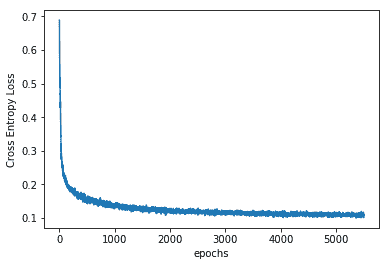

9.  最后，让我们看一下重建的图像：

```py
fig, axes = plt.subplots(rows=2, cols=10, sharex=True, sharey=True, figsize=(20,4))
in_imgs = mnist.test.images[:10]
noisy_imgs = in_imgs + noise_factor * np.random.randn(*in_imgs.shape)
noisy_imgs = np.clip(noisy_imgs, 0., 1.)
reconstructed = sess.run(decoded, feed_dict={X_noisy: noisy_imgs.reshape((10, 28, 28, 1))})
for images, row in zip([noisy_imgs, reconstructed], axes):
 for img, ax in zip(images, row):
 ax.imshow(img.reshape((28, 28)), cmap='Greys_r')
 ax.get_xaxis().set_visible(False)
 ax.get_yaxis().set_visible(False)
```

这是前面代码的输出：

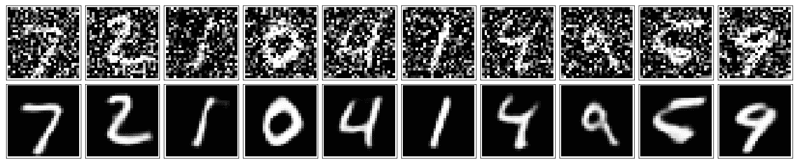

10.  关闭会话：

```py
sess.close()
```

# 工作原理

前面的 CAE 是降噪 CAE，与仅由一个瓶颈层组成的简单降噪自编码器相比，我们可以看到它在降噪图像方面更好。

# 更多

研究人员已将 CAE 用于语义分割。 有趣的读物是 Badrinayanan 等人在 2015 年发表的论文 [Segnet：一种用于图像分割的深度卷积编码器-解码器架构](https://arxiv.org/pdf/1511.00561.pdf)。 该网络使用 VGG16 的卷积层作为其编码器网络，并包含一层解码器，每个解码器对应一个解码器层次作为其解码器网络。 解码器使用从相应的编码器接收的最大池索引，并对输入特征图执行非线性上采样。 本文的链接在本秘籍的另请参见部分以及 GitHub 链接中给出。

# 另见

1.  <https://distill.pub/2016/deconv-checkerboard/>
2.  <https://pgaleone.eu/neural-networks/2016/11/24/convolutional-autoencoders/>
3.  <https://arxiv.org/pdf/1511.00561.pdf>
4.  <https://github.com/arahusky/Tensorflow-Segmentation>

# 栈式自编码器

到目前为止，涵盖的自编码器（CAE 除外）仅由单层编码器和单层解码器组成。 但是，我们可能在编码器和解码器网络中具有多层； 使用更深的编码器和解码器网络可以使自编码器表示复杂的特征。 这样获得的结构称为栈式自编码器（**深度自编码器**）； 由一个编码器提取的特征将作为输入传递到下一个编码器。 可以将栈式自编码器作为一个整体网络进行训练，以最大程度地减少重构误差，或者可以首先使用您先前学习的无监督方法对每个单独的编码器/解码器网络进行预训练，然后对整个网络进行微调。 已经指出，通过预训练，也称为贪婪分层训练，效果更好。

# 准备

在秘籍中，我们将使用贪婪分层方法来训练栈式自编码器； 为了简化任务，我们将使用共享权重，因此相应的编码器/解码器权重将相互转换。

# 操作步骤

我们按以下步骤进行：

1.  第一步是导入所有必要的模块：

```py
import tensorflow as tf
import numpy as np
from tensorflow.examples.tutorials.mnist import input_data
import matplotlib.pyplot as plt
%matplotlib inline
```

2.  加载数据集：

```py
mnist = input_data.read_data_sets("MNIST_data/")
trX, trY, teX, teY = mnist.train.images, mnist.train.labels, mnist.test.images, mnist.test.labels
```

3.  接下来，我们定义类`StackedAutoencoder`。 `__init__`类方法包含一个列表，该列表包含从第一个输入自编码器和学习率开始的每个自编码器中的许多神经元。 由于每一层的输入和输出都有不同的尺寸，因此我们选择字典数据结构来表示每一层的权重，偏差和输入：

```py
class StackedAutoEncoder(object):
 def __init__(self, list1, eta = 0.02):
 """
 list1: [input_dimension, hidden_layer_1, ....,hidden_layer_n]
 """
 N = len(list1)-1
 self._m = list1[0]
 self.learning_rate = eta

 # Create the Computational graph
 self._W = {}
 self._b = {}
 self._X = {}
 self._X['0'] = tf.placeholder('float', [None, list1[0]])

 for i in range(N):
 layer = '{0}'.format(i+1)
 print('AutoEncoder Layer {0}: {1} --> {2}'.format(layer, list1[i], list1[i+1]))
 self._W['E' + layer] = tf.Variable(tf.random_normal(shape=(list1[i], list1[i+1])),name='WtsEncoder'+layer)
 self._b['E'+ layer] = tf.Variable(np.zeros(list1[i+1]).astype(np.float32),name='BiasEncoder'+layer)
 self._X[layer] = tf.placeholder('float', [None, list1[i+1]])
 self._W['D' + layer] = tf.transpose(self._W['E' + layer]) # Shared weights
 self._b['D' + layer] = tf.Variable(np.zeros(list1[i]).astype(np.float32),name='BiasDecoder' + layer)

 # Placeholder for inputs
 self._X_noisy = tf.placeholder('float', [None, self._m])
```

4.  我们建立一个计算图来定义每个自编码器的优化参数，同时进行预训练。 当先前的自编码器的编码器的输出为其输入时，它涉及为每个自编码器定义重建损耗。 为此，我们定义类方法`pretrain`和`one_pass`，它们分别为每个栈式自编码器返回训练操作器和编码器的输出：

```py
 self.train_ops = {}
 self.out = {}

 for i in range(N):
 layer = '{0}'.format(i+1)
 prev_layer = '{0}'.format(i)
 opt = self.pretrain(self._X[prev_layer], layer)
 self.train_ops[layer] = opt
 self.out[layer] = self.one_pass(self._X[prev_layer], self._W['E'+layer], self._b['E'+layer], self._b['D'+layer])
```

5.  我们建立计算图以对整个栈式自编码器进行微调。 为此，我们使用类方法`encoder`和`decoder`：

```py
self.y = self.encoder(self._X_noisy,N) #Encoder output 
self.r = self.decoder(self.y,N) # Decoder ouput

optimizer = tf.train.AdamOptimizer(self.learning_rate) 
error = self._X['0'] - self.r # Reconstruction Error

self._loss = tf.reduce_mean(tf.pow(error, 2))
self._opt = optimizer.minimize(self._loss)
```

6.  最后，我们定义类方法`fit`，以执行每个自编码器的分批预训练，然后进行微调。 在进行预训练时，我们使用未损坏的输入，而对于微调，我们使用损坏的输入。 这使我们能够使用栈式自编码器甚至从嘈杂的输入中进行重构：

```py
def fit(self, Xtrain, Xtr_noisy, layers, epochs = 1, batch_size = 100):
 N, D = Xtrain.shape
 num_batches = N // batch_size
 X_noisy = {}
 X = {}
 X_noisy ['0'] = Xtr_noisy
 X['0'] = Xtrain

 for i in range(layers):
 Xin = X[str(i)]
 print('Pretraining Layer ', i+1)
 for e in range(5):
 for j in range(num_batches):
 batch = Xin[j * batch_size: (j * batch_size + batch_size)]
 self.session.run(self.train_ops[str(i+1)], feed_dict= {self._X[str(i)]: batch})
 print('Pretraining Finished')
 X[str(i+1)] = self.session.run(self.out[str(i+1)], feed_dict = {self._X[str(i)]: Xin})

 obj = []
 for i in range(epochs):
 for j in range(num_batches):
 batch = Xtrain[j * batch_size: (j * batch_size + batch_size)]
 batch_noisy = Xtr_noisy[j * batch_size: (j * batch_size + batch_size)]
 _, ob = self.session.run([self._opt,self._loss], feed_dict={self._X['0']: batch, self._X_noisy: batch_noisy})
 if j % 100 == 0 :
 print('training epoch {0} batch {2} cost {1}'.format(i,ob, j)) 
 obj.append(ob)
 return obj
```

7.  不同的类方法如下：

```py
def encoder(self, X, N):
 x = X
 for i in range(N):
 layer = '{0}'.format(i+1)
 hiddenE = tf.nn.sigmoid(tf.matmul(x, self._W['E'+layer]) + self._b['E'+layer])
 x = hiddenE
 return x

def decoder(self, X, N):
 x = X
 for i in range(N,0,-1):
 layer = '{0}'.format(i)
 hiddenD = tf.nn.sigmoid(tf.matmul(x, self._W['D'+layer]) + self._b['D'+layer])
 x = hiddenD
 return x

def set_session(self, session):
 self.session = session

def reconstruct(self,x, n_layers):
 h = self.encoder(x, n_layers)
 r = self.decoder(h, n_layers)
 return self.session.run(r, feed_dict={self._X['0']: x})

def pretrain(self, X, layer ):
 y = tf.nn.sigmoid(tf.matmul(X, self._W['E'+layer]) + self._b['E'+layer])
 r =tf.nn.sigmoid(tf.matmul(y, self._W['D'+layer]) + self._b['D'+layer])

 # Objective Function
 error = X - r # Reconstruction Error
  loss = tf.reduce_mean(tf.pow(error, 2))
 opt = tf.train.AdamOptimizer(.001).minimize(loss, var_list = 
 [self._W['E'+layer],self._b['E'+layer],self._b['D'+layer]])
  return opt

def one_pass(self, X, W, b, c):
 h = tf.nn.sigmoid(tf.matmul(X, W) + b)
 return h
```

8.  我们使用降噪自编码器秘籍中定义的破坏函数来破坏图像，最后创建一个`StackAutoencoder`并对其进行训练：

```py
Xtrain = trX.astype(np.float32)
Xtrain_noisy = corruption(Xtrain).astype(np.float32)
Xtest = teX.astype(np.float32)
Xtest_noisy = corruption(Xtest).astype(np.float32) 
_, m = Xtrain.shape

list1 = [m, 500, 50] # List with number of neurons in Each hidden layer, starting from input layer
n_layers = len(list1)-1
autoEncoder = StackedAutoEncoder(list1)

#Initialize all variables
init = tf.global_variables_initializer()

with tf.Session() as sess:
 sess.run(init)
 autoEncoder.set_session(sess)
 err = autoEncoder.fit(Xtrain, Xtrain_noisy, n_layers, epochs=30)
 out = autoEncoder.reconstruct(Xtest_noisy[0:100],n_layers)
```

9.  这里给出了随着堆叠自编码器的微调，重建误差与历时的关系。 您可以看到，由于进行了预训练，我们已经从非常低的重建损失开始了：

```py
plt.plot(err)
plt.xlabel('epochs')
plt.ylabel('Fine Tuning Reconstruction Error')
```

情节如下：

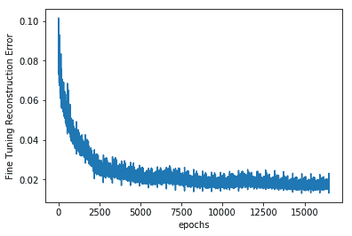

10.  现在让我们检查网络的表现。 当网络中出现嘈杂的测试图像时，这是去噪后的手写图像：

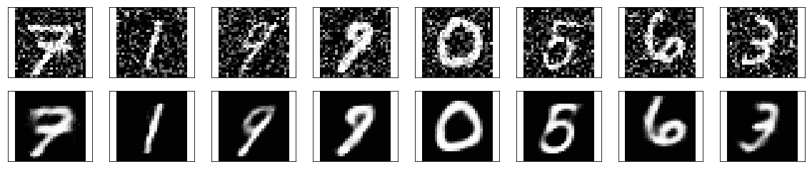

# 工作原理

在栈式自编码器上进行的实验表明，应以较低的学习率值进行预训练。 这样可以确保在微调期间具有更好的收敛性和表现。

# 更多

整章都是关于自编码器的，尽管目前它们仅用于降维和信息检索，但它们引起了很多兴趣。 首先，因为它们不受监督，其次，因为它们可以与 FCN 一起使用。 它们可以帮助我们应对维度的诅咒。 研究人员已经证明，它们也可以用于分类和异常检测。

# 另见

*   [关于栈式自编码器的一个不错的教程](http://ufldl.stanford.edu/wiki/index.php/Stacked_Autoencoders)。
*   `Schwenk, Holger. "The diabolo classifier." Neural Computation 10.8 (1998): 2175-2200.`
*   `Sakurada, Mayu, and Takehisa Yairi. "Anomaly detection using autoencoders with nonlinear dimensionality reduction." Proceedings of the MLSDA 2014 2nd Workshop on Machine Learning for Sensory Data Analysis. ACM, 2014.`
*   [栈式自编码器的酷 TensorBoard 可视化和实现](https://github.com/cmgreen210/TensorFlowDeepAutoencoder)