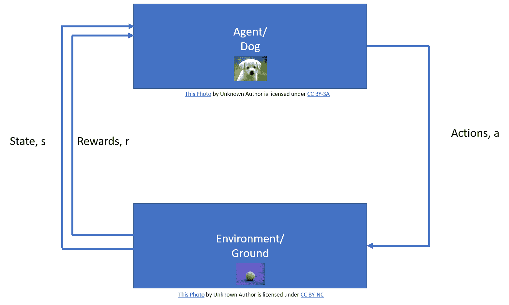
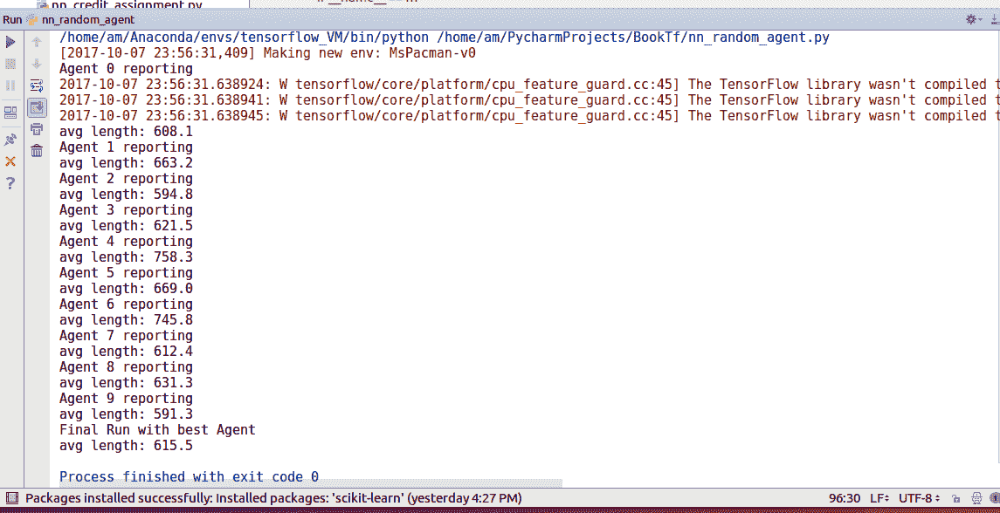
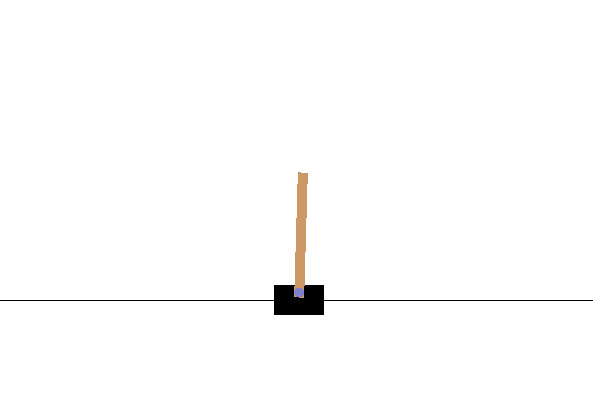
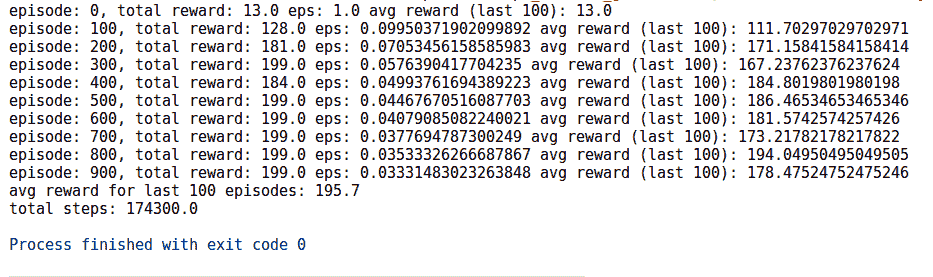
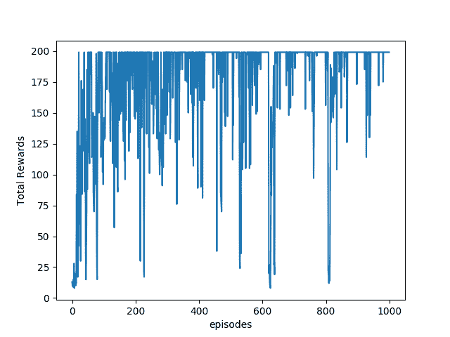
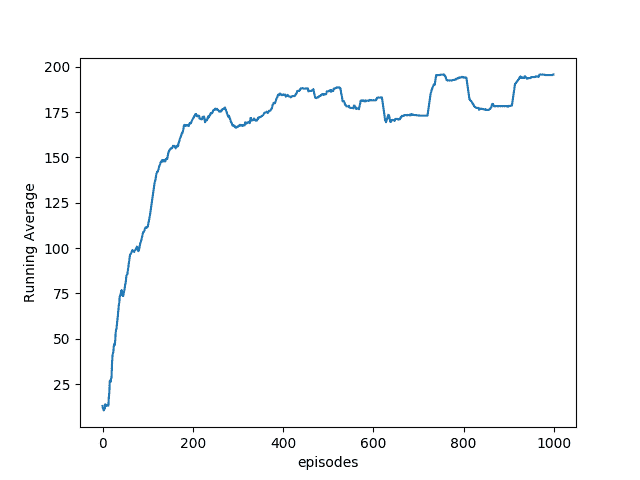
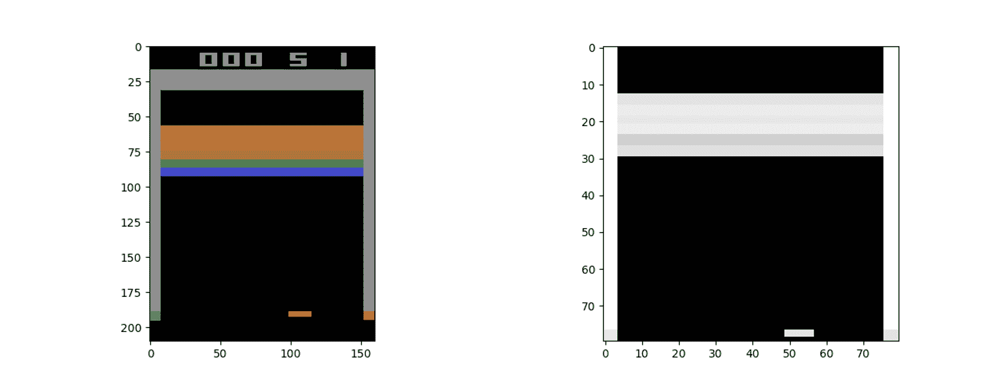
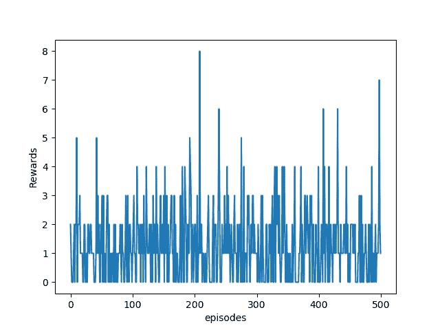
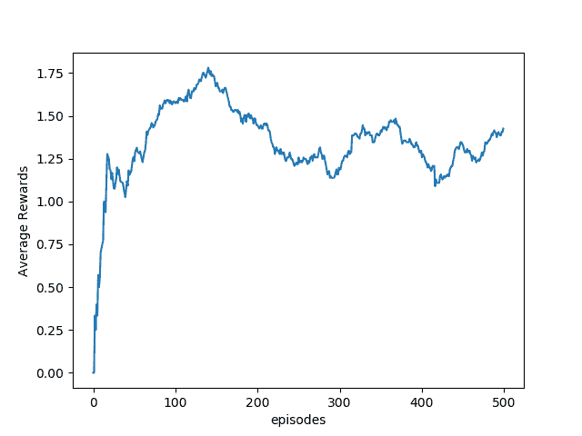
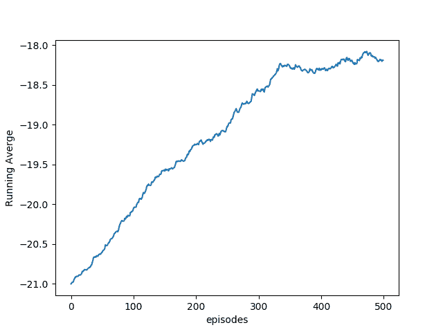

# 强化学习

本章介绍**强化学习**（**RL**）-学习最少，但最有前途的学习范例。 本章包括以下主题：

*   学习 OpenAI 体育馆
*   实现神经网络代理来扮演吃豆人
*   Q 学习平衡购物车
*   使用 Deep Q Networks 的 Atari 游戏
*   玩 Pong 游戏的策略梯度

# 介绍

2016 年 3 月，由 Google DeepMind 制作的程序 AlphaGo 以 4 比 1 击败了世界上最好的围棋选手，十八届世界冠军李·塞多尔（Lee Sedol）。 ，具有：

```py
208,168,199,381,979,984,699,478,633,344,862,770,286,522,
453,884,530,548,425,639,456,820,927,419,612,738,015,378,
525,648,451,698,519,643,907,259,916,015,628,128,546,089,
888,314,427, 129,715,319,317,557,736,620,397,247,064,840,935
```

可能的法律委员会职位。 玩和赢得围棋无法通过简单的蛮力完成。 它需要技巧，创造力，以及专业围棋选手所说的直觉。

AlphaGo 在基于 RL 算法的深度神经网络与最先进的树搜索算法相结合的帮助下实现了这一非凡的成就。 本章介绍 RL 和我们用于执行 RL 的一些算法。

因此，出现的第一个问题是什么是 RL，它与我们在前几章中探讨的有监督和无监督学习有何不同？

拥有宠物的任何人都知道，训练宠物的最佳策略是奖励其期望的行为，并惩罚其不良行为。 RL 也称为与批评者进行的**学习**，它是一种学习范例，其中代理以相同的方式进行学习。 这里的代理对应我们的网络（程序）； 它可以执行一组**动作**（`a`），这会导致环境的**状态**（`s`）发生变化。 ，则代理会感知其是否获得奖励或惩罚。

例如，在狗的情况下，狗是我们的代理人，狗的自愿肌肉运动是动作，地面是环境。 狗给我们骨头作为奖励，从而感觉到我们对其动作的反应：



Adapted from Reinforcement Learning: an Introduction by Sutton and BartoEven our brain has a group of subcortical nuclei situated at the base of the forebrain called **basal ganglia**, which, according to neuroscience, are responsible for action selection, that is, help us decide which of several possible actions to execute at any given time.

代理人的目的是使报酬最大化并减少惩罚。 做出此决策涉及各种挑战，最重要的挑战是如何最大化未来的回报，也称为**临时得分分配问题**。 代理根据某些策略（`π`）决定其操作； 代理根据其与环境的交互来学习此策略（`π`）。 有各种策略学习算法； 我们将在本章中探索其中的一些。 代理通过反复试验的过程来推断最优策略（`π*`），并且要学习最优策略，代理需要与之交互的环境； 我们将使用提供不同环境的 OpenAI Gym。

在这里，我们仅对 RL 中涉及的基本概念进行了回顾； 我们假设您熟悉马尔可夫概念的决策过程，折现因子和价值函数（状态值和动作值）。

在本章以及随后的食谱中，我们将一集定义为游戏的一次运行，例如，解决一个数独游戏。 通常，代理会播放许多剧集以学习一种最佳策略，该策略可使奖励最大化。

看到 RL 特工在没有任何游戏隐性知识的情况下，如何在这些游戏中学会玩游戏，不仅玩游戏，甚至击败人类，真是太神奇了。

# 学习 OpenAI 体育馆

我们将使用 OpenAI Gym 为我们的代理商提供一个环境。 OpenAI Gym 是一个开源工具包，用于开发和比较 RL 算法。 它包含各种模拟环境，可用于训练代理和开发新的 RL 算法。

# 做好准备

首先要做的是安装 OpenAI Gym； 使用`pip install gym`可以完成最少的安装。 OpenAI 体育馆提供了多种环境，例如 Atari，棋盘游戏以及 2D 或 3D 物理引擎。 最小安装可在 Windows 上运行，并且仅支持基本环境-算法，`toy_text`和`classic_control`-但如果您要探索其他环境，则它们将需要更多的依赖项。 OS X 和 Ubuntu 支持完整版本。 可以在 OpenAI Gym 的 [GitHub 链接](https://github.com/openai/gym#installing-dependencies-for-specific-environments)上阅读详细说明。

# 怎么做...

让我们从食谱开始：

1.  OpenAI Gym 提供的核心接口是统一环境接口。 代理可以使用三种基本方法与环境进行交互，即重置，逐步和渲染。 `reset`方法重置环境并返回观察值。 `step`方法将环境步进一个时间步，并返回观察，奖励，完成和信息。 `render`方法呈现一帧环境，例如弹出一个窗口。
2.  要使用 OpenAI Gym，您需要先将其导入：

```py
import gym
```

3.  接下来，我们创建我们的第一个环境：

```py
env_name = 'Breakout-v3'
env = gym.make(env_name)
```

4.  我们使用`reset`方法启动环境：

```py
obs = env.reset()
```

5.  让我们检查一下环境的形状：

```py
print(obs.shape)
```

6.  可以使用命令`actions = env.action_space`检查可能的操作数量。 从此结果可以看出，对于 Breakout-v4，我们有四个可能的动作：NoOp，Fire，Left 和 Right。 可以通过调用`env.action_space.n`命令获得操作总数。
7.  让我们定义一个具有随机策略的代理。 代理会随机选择四个可能的动作中的任何一个：

```py
def random_policy(n):
 action = np.random.randint(0,n)
 return action
```

8.  接下来，我们使用`obs, reward, done, info = env.step(action)`允许我们的随机代理播放 1,000 步：

```py
for step in range(1000): # 1000 steps max
 action = random_policy(env.action_space.n)
 obs, reward, done, info = env.step(action)
 env.render()
 if done:
     img = env.render(mode='rgb_array')
     plt.imshow(img)
     plt.show()
     print("The game is over in {} steps".format(step))
     break
```

`obs`告诉代理程序环境是什么样的； 对于我们的环境，它对应于大小为 210 x 160 x 3 的 RGB 图像。在每个步骤中，代理将获得 0 或 1 奖励，根据 OpenAI Gym Wiki，其`reward`为`[-inf, inf]`。 游戏结束后，环境将`done`返回为`True`。 `info`可用于调试，但代理不使用。 `env.render()`命令弹出一个窗口，显示环境的当前状态。 当包含此命令时，您可以通过弹出窗口查看座席如何尝试玩耍和学习。 最好在座席接受训练时对此进行评论，以节省时间。

9.  最后，关闭环境：

```py
env.close()
```

# 这个怎么运作...

前面的代码实现了一个随机代理； 代理会随机选择以下四个动作之一：


要观察的另一件重要事情是，在这种环境中，动作空间是离散的，而观察空间是 Box 类型的。 OpenAI 中关于空间（动作/观察）的术语“离散”和“框”是指允许的值。 离散空间允许固定范围的非负数，在我们的情况下为（`0,1,2,3`）。 另一方面，盒子空间表示一个`n`维盒子，因此对于吃豆人来说，任何有效观察结果都是`210×160×3`数字的数组。

# 还有更多...

OpenAI Gym 由许多不同的环境组成，其活跃的贡献社区在其中添加了许多环境。 要获取所有现有环境的列表，可以运行[以下简单代码](https://github.com/openai/gym)：

```py
from gym import envs
env_ids = [spec.id for spec in envs.registry.all()]
print("Total Number of environments are", len(env_ids))
for env_id in sorted(env_ids):
    print(env_id)
```

目前，OpenAI Gym 共有 777 个环境。 这是吃豆人使用与之前相同的随机代理的图像：


# 也可以看看

*   可以从[这里](https://gym.openai.com/envs)获取有关不同环境的详细信息。
*   在[这个链接](https://github.com/openai/gym/wiki)中为某些环境维护了 Wiki 页面
*   可以从[这个链接](https://github.com/openai/gym)获得有关安装说明和依赖项的详细信息。

# 实现神经网络代理来扮演吃豆人

让我们首先构建一个简单的神经网络代理来玩“吃豆人”游戏。 我们将创建具有一组随机权重和偏差的代理。 然后，这些特工将尝试玩游戏； 我们选择能够发挥最长平均持续时间的特工，并假设他们是最佳策略。

# 做好准备

此配方中的代理没有学习任何策略； 他们根据初始权重（固定政策）做出决策。 代理根据神经网络给出的概率来选择动作。 每个代理做出的决定仅基于对环境的当前观察。

我们通过完全连接的神经网络来实现。 NN 的输入由环境的观察空间决定； 输出神经元的数量由可能的离散动作的数量决定。 吃豆人游戏有九种可能的离散动作-NoOp，向右转，向左转，向上转，向下，向左移动，向右移动，向上移动和向下移动-因此我们的 NN 具有九个输出神经元。

# 怎么做...

让我们从食谱开始：

1.  与往常一样，第一步是导入模块。 在这种情况下，除了通常的模块之外，我们还将导入`gym`，以便我们可以使用它提供的不同环境：

```py
import gym
import numpy as np
import tensorflow as tf
import matplotlib.pyplot as plt
```

2.  接下来，我们创建一个`RlAgent`类。 该类由三种方法组成-`__init__`方法初始化 NN 大小并创建计算图。 在这里，我们使用了 TensorFlow 函数`tf.multinomial`来决定采取的可能措施。 该函数根据我们网络的 9 个输出神经元的 S 形值返回操作。 这样可以确保网络根据概率选择最终操作。 `predict`方法返回由 NN 预测的动作。 `get_weights`方法可帮助我们获得获胜者代理的权重和偏见：

```py
class RlAgent(object):
 def __init__(self,m,n,ini=False,W=None, b=None ):
     self._graph = tf.Graph()
     with self._graph.as_default():
     self._X = tf.placeholder(tf.float32,shape=(1,m))
     if ini==False:
         self.W = tf.Variable(tf.random_normal([m,n]), trainable=False)
         self.bias =         tf.Variable(tf.random_normal([1,n]),trainable=False)
     else:
         self.W = W
         self.bias = b
     out = tf.nn.sigmoid(tf.matmul(self._X,self.W)+ self.bias)
     self._result = tf.multinomial(out,1)
     init = tf.global_variables_initializer()

    self._sess = tf.Session()
    self._sess.run(init)

    def predict(self, X):
         action = self._sess.run(self._result, feed_dict= {self._X: X})
         return action

    def get_weights(self):
         W, b = self._sess.run([self.W, self.bias])
         return W, b
```

3.  我们定义了一些辅助功能来玩一个完整的游戏`play_one_episode`：

```py
def play_one_episode(env, agent):
    obs = env.reset()
    img_pre = preprocess_image(obs)
     done = False
     t = 0
    while not done and t < 10000:
         env.render()  # This can be commented to speed up 
         t += 1
         action = agent.predict(img_pre)
         #print(t,action)
         obs, reward, done, info = env.step(action)
         img_pre = preprocess_image(obs)
         if done:
             break
    return t
```

4.  `play_multiple_episodes`函数创建代理的一个实例，并使用该代理进行许多游戏，并返回其平均游戏时间：

```py
def play_multiple_episodes(env, T,ini=False, W=None, b=None):
    episode_lengths = np.empty(T)
    obs = env.reset()
    img_pre = preprocess_image(obs)
    if ini== False:
        agent = RlAgent(img_pre.shape[1],env.action_space.n)
    else:
        agent = RlAgent(img_pre.shape[1],env.action_space.n,ini, W, b)
    for i in range(T):
        episode_lengths[i] = play_one_episode(env, agent)
    avg_length = episode_lengths.mean()
    print("avg length:", avg_length)
    if ini == False:
        W, b = agent.get_weights()
    return avg_length, W, b
```

5.  `random_search`函数调用`play_multiple_episodes`； 每次调用`play_multiple_episodes`时，都会使用一组新的随机权重和偏差来实例化新代理。 这些随机创建的 NN 代理之一将胜过其他代理，这将是我们最终选择的代理：

```py
def random_search(env):
    episode_lengths = []
    best = 0
    for t in range(10):
        print("Agent {} reporting".format(t))
        avg_length, wts, bias = play_multiple_episodes(env, 10)
        episode_lengths.append(avg_length)
        if avg_length > best:
            best_wt = wts
            best_bias = bias
            best = avg_length
    return episode_lengths, best_wt, best_bias
```

6.  每次执行步骤时，环境都会返回一个观察场。 该观察具有三个颜色通道。 为了将其馈送到 NN，需要对观测值进行预处理，目前，我们唯一要做的预处理是将其转换为灰度，增加对比度并将其整形为行向量：

```py
def preprocess_image(img):
    img = img.mean(axis =2) # to grayscale
    img[img==150] = 0  # Bring about a better contrast
    img = (img - 128)/128 - 1 # Normalize image from -1 to 1
    m,n = img.shape
    return img.reshape(1,m*n)
```

7.  NN 代理一一实例化，然后选择最佳代理。 为了提高计算效率，我们目前仅搜索 10 个代理，每个代理玩 10 场比赛。 玩得最长的游戏被认为是最好的：

```py
if __name__ == '__main__':
    env_name = 'Breakout-v0'
    #env_name = 'MsPacman-v0'
    env = gym.make(env_name)
    episode_lengths, W, b = random_search(env)
    plt.plot(episode_lengths)
    plt.show()
    print("Final Run with best Agent")
    play_multiple_episodes(env,10, ini=True, W=W, b=b)
```

结果如下：



我们可以看到我们的随机代理也可以平均 **615.5** 的长度玩游戏。 不错！

# Q 学习平衡购物车

如导言所述，我们有一个由状态`s`（`s ∈ S`，其中`S`是所有可能状态的集合）描述的环境 可以执行动作`a`（`a ∈ A`，其中`A`由所有可能的动作组成），从而导致主体从一种状态移动到另一种状态 。 代理因其行为而受到奖励，代理的目标是使奖励最大化。 在 Q 学习中，代理通过计算最大化报酬的状态-动作组合的数量（`R`）来学习要采取的动作（策略，`π`）。 在选择行动时，代理人不仅要考虑现在的奖励，而且要考虑未来的折扣。

`Q: S × A → R`

代理以`Q`的任意初始值开头，并且随着代理选择动作`a`并获得奖励`r`，它会更新状态`s`（取决于过去状态`s`和动作`a`）和`Q`值：

`Q(s, a) = (1 - α) · Q(s, a) + α(r + γ · max[a']Q(s', a'))`

在此，`α`是学习率，`γ`是折扣因子。 第一项保留`Q`的旧值，第二项提供 Q 值的改进估计值（它包括当前奖励和未来行动的折现奖励）。 当结果状态不理想时，这将降低`Q`值，从而确保代理在下次遇到此状态时不会选择相同的动作。 类似地，当期望结果状态时，相应的`Q`值将增加。

Q 学习的最简单实现涉及维护和更新状态-作用值查找表； 表的大小将为 N×M，其中 N 是所有可能状态的数量，M 是所有可能动作的数量。 对于大多数环境，此表将很大。 表越大，搜索所需的时间就越多，并且存储表所需的内存也就越多，因此这不是可行的解决方案。 在本食谱中，我们将使用 Q 学习的 NN 实现。 在此，将神经网络用作函数逼近器来预测值函数（Q）。 NN 具有等于可能动作数的输出节点，并且它们的输出表示相应动作的值函数。

# 做好准备

我们将训练一个线性神经网络来解决[`'CartPole-v0'`环境](https://github.com/openai/gym/wiki/CartPole-v0)。 目的是平衡手推车上的杆。 观测状态由四个连续值参数组成：推车位置`[-2.4, 2.4]`，推车速度`[-∞, ∞]`，极角`[~-41.8º, ~41.8º]`和极限速度`[-∞, ∞]`。 可以通过向左或向右推推车来实现平衡，因此动作空间由两个可能的动作组成。 您可以看到`CartPole-v0`环境空间：



现在，对于 Q 学习，我们需要找到一种量化连续值观测状态的方法。 这是使用类`FeatureTransform`实现的； 该类首先生成 20,000 个观察空间示例的随机样本。 随机生成的观察空间示例使用 scikit `StandardScaler`类进行了标准化。 然后以不同的方差使用 scikit 的`RBFSampler`来覆盖观察空间的不同部分。 `FeatureTransformer`类由随机观察空间示例实例化，该示例用于使用`fit_transform`函数方法训练`RBFSampler`。

后来，使用`transform`方法将连续观察空间转换为这种特征化表示：

```py
class FeatureTransformer:
 def __init__(self, env):
   obs_examples = np.random.random((20000, 4))
   print(obs_examples.shape)
   scaler = StandardScaler()
   scaler.fit(obs_examples)

   # Used to converte a state to a featurizes represenation.
   # We use RBF kernels with different variances to cover different parts of the space
   featurizer = FeatureUnion([
       ("cart_position", RBFSampler(gamma=0.02, n_components=500)),
       ("cart_velocity", RBFSampler(gamma=1.0, n_components=500)),
       ("pole_angle", RBFSampler(gamma=0.5, n_components=500)),
       ("pole_velocity", RBFSampler(gamma=0.1, n_components=500))
       ])
    feature_examples =          featurizer.fit_transform(scaler.transform(obs_examples))
    print(feature_examples.shape)

    self.dimensions = feature_examples.shape[1]
    self.scaler = scaler
    self.featurizer = featurizer

def transform(self, observations):
    scaled = self.scaler.transform(observations)
    return self.featurizer.transform(scaled)
```

# 怎么做...

我们按以下步骤进行：

1.  第一步是导入必要的模块。 这次，除了我们通常的 TensorFlow，Numpy 和 Matplotlib，我们还将从 scikit 导入 Gym 和一些类：

```py
import numpy as np
import tensorflow as tf
import gym
import matplotlib.pyplot as plt
from sklearn.pipeline import FeatureUnion
from sklearn.preprocessing import StandardScaler
from sklearn.kernel_approximation import RBFSampler
```

2.  在 Q 学习中，我们使用 NN 作为函数逼近器来估计值函数。 我们定义一个线性`NeuralNetwork`类； NN 将把变换后的观测空间作为输入并预测估计的 Q 值。 由于我们有两个可能的动作，因此我们需要两个不同的神经网络对象来获取预测的状态动作值。 该类包括训练单个 NN 和预测输出的方法：

```py
class NeuralNetwork:
 def __init__(self, D):
     eta = 0.1
     self.W = tf.Variable(tf.random_normal(shape=(D, 1)), name='w')
     self.X = tf.placeholder(tf.float32, shape=(None, D), name='X')
     self.Y = tf.placeholder(tf.float32, shape=(None,), name='Y')

     # make prediction and cost
     Y_hat = tf.reshape(tf.matmul(self.X, self.W), [-1])
     err = self.Y - Y_hat
     cost = tf.reduce_sum(tf.pow(err,2))

    # ops we want to call later
    self.train_op = tf.train.GradientDescentOptimizer(eta).minimize(cost)
    self.predict_op = Y_hat

    # start the session and initialize params
    init = tf.global_variables_initializer()
    self.session = tf.Session()
    self.session.run(init)

def train(self, X, Y):
    self.session.run(self.train_op, feed_dict={self.X: X, self.Y: Y})

def predict(self, X):
    return self.session.run(self.predict_op, feed_dict={self.X: X})
```

3.  下一个重要的类是`Agent`类，它使用`NeuralNetwork`类来创建学习代理。 实例化类创建具有两个线性 NN 的代理，每个线性 NN 具有 2,000 个输入神经元和 1 个输出神经元。 （从本质上讲，这意味着该代理具有 2 个神经元，每个神经元具有 2,000 个输入，因为 NN 的输入层不执行任何处理）。 `Agent`类具有定义为预测两个 NN 的输出并更新两个 NN 权重的方法。 此处的代理在训练阶段使用 Epsilon 贪婪策略进行探索。 在每个步骤中，代理程序会根据 epsilon（`eps`）的值选择具有最高 Q 值的操作或随机操作。 epsilon 在训练过程中经过退火处理，因此，最初，代理会采取许多随机动作（探索），但随着训练的进行，会采取具有最大 Q 值的动作（探索）。 这称为**探索与开发**的权衡取舍：我们允许代理在被利用的操作过程中探索随机操作，这使代理可以尝试新的随机操作并从中学习：

```py
class Agent:
 def __init__(self, env, feature_transformer):
 self.env = env
 self.agent = []
 self.feature_transformer = feature_transformer
 for i in range(env.action_space.n):
 model = NeuralNetwork(feature_transformer.dimensions)
 self.agent.append(model)

def predict(self, s):
 X = self.feature_transformer.transform([s])
 return np.array([m.predict(X)[0] for m in self.agent])

def update(self, s, a, G):
 X = self.feature_transformer.transform([s])
 self.agent[a].train(X, [G])

def sample_action(self, s, eps):
 if np.random.random() < eps:
     return self.env.action_space.sample()
 else:
     return np.argmax(self.predict(s))
```

4.  接下来，我们定义一个功能来播放一集； 它类似于我们先前使用的`play_one`函数，但现在我们使用 Q 学习来更新代理的权重。 我们首先使用`env.reset()`重置环境，然后开始游戏，直到完成游戏为止（并进行了最大迭代以确保程序结束）。 像以前一样，代理为当前观察状态选择一个动作，并在环境上执行该动作（`env.step(action)`）。 现在的区别在于，根据先前状态和采取操作后的状态，使用`G = r + γ · max[a']Q(s', a')`更新 NN 权重，以便它可以预测与某个动作相对应的准确期望值。 为了获得更好的稳定性，我们修改了奖励-杆位下降时，座席会获得 -400 的奖励，否则，每一步都会获得 +1 的奖励：

```py
def play_one(env, model, eps, gamma):
 obs = env.reset()
 done = False
 totalreward = 0
 iters = 0
 while not done and iters < 2000:
 action = model.sample_action(obs, eps)
 prev_obs = obs
 obs, reward, done, info = env.step(action)
 env.render()   # Can comment it to speed up.

if done:
 reward = -400

# update the model
 next = model.predict(obs)
 assert(len(next.shape) == 1)
 G = reward + gamma*np.max(next)
 model.update(prev_obs, action, G)

if reward == 1:
 totalreward += reward
iters += 1
```

5.  现在所有功能和类均已就绪，我们定义了代理和环境（在本例中为`'CartPole-v0'`）。 该代理总共播放 1000 集，并通过使用 value 函数与环境交互来学习：

```py
if __name__ == '__main__':
    env_name = 'CartPole-v0'
    env = gym.make(env_name)
    ft = FeatureTransformer(env)
    agent = Agent(env, ft)
    gamma = 0.97

    N = 1000
    totalrewards = np.empty(N)
    running_avg = np.empty(N)
    for n in range(N):
        eps = 1.0 / np.sqrt(n + 1)
        totalreward = play_one(env, agent, eps, gamma)
        totalrewards[n] = totalreward
        running_avg[n] = totalrewards[max(0, n - 100):(n + 1)].mean()
        if n % 100 == 0:
            print("episode: {0}, total reward: {1} eps: {2} avg reward (last 100): {3}".format(n, totalreward, eps,
                                                                                               running_avg[n]), )

    print("avg reward for last 100 episodes:", totalrewards[-100:].mean())
    print("total steps:", totalrewards.sum())

    plt.plot(totalrewards)
    plt.xlabel('episodes')
    plt.ylabel('Total Rewards')
    plt.show()

    plt.plot(running_avg)

    plt.xlabel('episodes')
    plt.ylabel('Running Average')
    plt.show()
    env.close()
```



6.  以下是代理商通过游戏获悉的总奖励和移动平均奖励的图。 根据 Cart-Pole Wiki 的说法，奖励 200 分表示该特工在接受 1,000 次训练后赢得了该剧集。 我们的特工播放 100 集时平均获得 195.7 的平均奖励，这是一项了不起的壮举：





# 还有更多...

可以使用相同的逻辑为 OpenAI 的其他环境创建代理。 但是，对于诸如 Breakout 或 Pac-Man 之类的 Atari 游戏，观察空间并不只是由四个数字组成的数组。 相反，它非常大（210×160 = 33,600 像素，具有 3 个 RGB 值）； 如果没有某种形式的量化，则这种简单的 NN 可能的状态是无限的，并且不会产生良好的结果。 我们将在深度 Q 学习食谱中使用 CNN 解决此问题。

# 也可以看看

尽管有很多有关 Q 学习的 Web 链接，但一些有用的链接如下：

*   https://zh.wikipedia.org/wiki/Q-Learning
*   <http://mnemstudio.org/path-finding-q-learning-tutorial.htm>
*   <http://artint.info/html/ArtInt_265.html>
*   <https://medium.com/emergent-future/simple-reinforcement-learning-with-tensorflow-part-0-q-learning-with-tables-and-neural-networks-d195264329d0>

# 使用 Deep Q Networks 的 Atari 游戏

**深层 Q 网络**（**DQN**）是 Q 学习与**卷积神经网络**（**CNN**）的结合。 [由 Mnih 等人在 2013 年提出](https://arxiv.org/pdf/1312.5602.pdf)。 CNN 网络具有提取空间信息的能力，因此能够从原始像素数据中学习成功的控制策略。 我们已经在第 4 章，“卷积神经网络”中使用了 CNN，因此我们直接从这里开始。

This recipe is based on the original DQN paper, Playing Atari with Deep Reinforcement Learning by DeepMind. In the paper, they used a concept called **experience replay**, which involved randomly sampling the previous game moves (state, action reward, next state).

# 做好准备

如先前的食谱所述， *Q 学习平衡 CartPole*，对于像《吃豆人》或 Breakout 之类的 Atari 游戏，我们需要预处理观察状态空间，该状态空间由 33,600 个像素组成，具有 3 个 RGB 值。 这些像素中的每个像素都可以采用 0 到 255 之间的任何值。我们的`preprocess`函数应该能够量化像素的可能值，同时减少观察状态空间。

我们利用 Scipy 的`imresize`函数对图像进行下采样。 以下功能`preprocess`在将图像馈送到 DQN 之前：

```py
def preprocess(img):
    img_temp = img[31:195]  # Choose the important area of the image
    img_temp = img_temp.mean(axis=2)  # Convert to Grayscale#
    # Downsample image using nearest neighbour interpolation
    img_temp = imresize(img_temp, size=(IM_SIZE, IM_SIZE), interp='nearest')
    return img_temp

```

`IM_SIZE`是一个全局参数-在代码中，我们将其值为 80。该函数具有描述每个过程的注释。 在这里，您可以看到预处理前后的观察空间：



要注意的另一重要事项是，当前的观察空间不能完全显示游戏情况。 例如，参见上图，您无法确定桨叶是向左还是向右移动。 因此，为了完全理解游戏的当前状态，我们需要考虑动作和观察的顺序。 在配方中，我们考虑了四个动作和观察序列，以确定当前情况并训练代理商。 这是借助`state_update`函数完成的，该函数将当前的观察状态附加到先前的状态，从而生成一系列状态：

```py
def update_state(state, obs):
    obs_small = preprocess(obs)
    return np.append(state[1:], np.expand_dims(obs_small, 0), axis=0)
```

最后，为了解决训练时的稳定性问题，我们使用了`target_network`的概念，它是 DQN 的副本，但更新频率不高。 我们使用目标网络来生成 DQN 网络的目标值函数，而 DQN 在每个步骤/片段都进行更新，并且`target_network`在固定间隔后进行更新（与 DQN 相同）。 由于所有更新都在 TensorFlow 会话中进行，因此我们使用名称范围来区分`target_network`和 DQN 网络。

# 怎么做...

1.  我们导入必要的模块。 我们正在使用`sys`模块的`stdout.flush()`来帮助我们强制 Python *刷新*标准输出（在我们的情况下为计算机监视器）中的数据。 `random`模块用于从体验重播缓冲区（我们存储过去经验的缓冲区）中获取随机样本。 `datetime`模块用于跟踪训练时间：

```py
import gym
import sys
import random
import numpy as np
import tensorflow as tf
import matplotlib.pyplot as plt
from datetime import datetime
from scipy.misc import imresize
```

2.  我们定义训练的超参数； 您可以通过更改它们进行试验。 这些参数定义了体验重播缓冲区的最小和最大大小以及更新目标网络之后的情节数量：

```py
MAX_EXPERIENCES = 500000
MIN_EXPERIENCES = 50000
TARGET_UPDATE_PERIOD = 10000
IM_SIZE = 80
K = 4
```

3.  定义了类`DQN`； 其构造函数使用`tf.contrib.layers.conv2d`函数构建 CNN 网络，并定义成本和训练操作：

```py
class DQN:
    def __init__(self, K, scope, save_path= 'models/atari.ckpt'):

        self.K = K
        self.scope = scope
        self.save_path = save_path

        with tf.variable_scope(scope):

            # inputs and targets
            self.X = tf.placeholder(tf.float32, shape=(None, 4, IM_SIZE, IM_SIZE), name='X')

            # tensorflow convolution needs the order to be:
            # (num_samples, height, width, "color")
            # so we need to tranpose later
            self.G = tf.placeholder(tf.float32, shape=(None,), name='G')
            self.actions = tf.placeholder(tf.int32, shape=(None,), name='actions')

            # calculate output and cost
            # convolutional layers
            Z = self.X / 255.0
            Z = tf.transpose(Z, [0, 2, 3, 1])
            cnn1 = tf.contrib.layers.conv2d(Z, 32, 8, 4, activation_fn=tf.nn.relu)
            cnn2 = tf.contrib.layers.conv2d(cnn1, 64, 4, 2, activation_fn=tf.nn.relu)
            cnn3 = tf.contrib.layers.conv2d(cnn2, 64, 3, 1, activation_fn=tf.nn.relu)

            # fully connected layers
            fc0 = tf.contrib.layers.flatten(cnn3)
            fc1 = tf.contrib.layers.fully_connected(fc0, 512)

            # final output layer
            self.predict_op = tf.contrib.layers.fully_connected(fc1, K)

            selected_action_values = tf.reduce_sum(self.predict_op * tf.one_hot(self.actions, K),
                reduction_indices=[1]
            )

            self.cost = tf.reduce_mean(tf.square(self.G - selected_action_values))
            self.train_op = tf.train.RMSPropOptimizer(0.00025, 0.99, 0.0, 1e-6).minimize(self.cost)
```

4.  该类具有设置会话`set_session()`，预测动作值函数`predict()`，更新网络`update()`以及使用 Epsilon Greedy 算法`sample_action()`选择动作的方法：

```py
def set_session(self, session):
    self.session = session

def predict(self, states):
    return self.session.run(self.predict_op, feed_dict={self.X: states})

def update(self, states, actions, targets):
    c, _ = self.session.run(
        [self.cost, self.train_op],
        feed_dict={
            self.X: states,
            self.G: targets,
            self.actions: actions
        }
    )
    return c

def sample_action(self, x, eps):
    """Implements epsilon greedy algorithm"""
    if np.random.random() < eps:
        return np.random.choice(self.K)
    else:
        return np.argmax(self.predict([x])[0])
```

5.  我们还定义了加载和保存网络的方法，因为训练可能会花费一些时间：

```py
def load(self):
    self.saver = tf.train.Saver(tf.global_variables())
    load_was_success = True
    try:
        save_dir = '/'.join(self.save_path.split('/')[:-1])
        ckpt = tf.train.get_checkpoint_state(save_dir)
        load_path = ckpt.model_checkpoint_path
        self.saver.restore(self.session, load_path)
    except:
        print("no saved model to load. starting new session")
        load_was_success = False
    else:
        print("loaded model: {}".format(load_path))
        saver = tf.train.Saver(tf.global_variables())
        episode_number = int(load_path.split('-')[-1])

def save(self, n):
    self.saver.save(self.session, self.save_path, global_step=n)
    print("SAVED MODEL #{}".format(n))
```

6.  将主 DQN 网络的参数复制到目标网络的方法如下：

```py
def copy_from(self, other):
    mine = [t for t in tf.trainable_variables() if t.name.startswith(self.scope)]
    mine = sorted(mine, key=lambda v: v.name)
    others = [t for t in tf.trainable_variables() if t.name.startswith(other.scope)]
    others = sorted(others, key=lambda v: v.name)

    ops = []
    for p, q in zip(mine, others):
        actual = self.session.run(q)
        op = p.assign(actual)
        ops.append(op)

    self.session.run(ops)
```

7.  我们定义一个函数`learn()`，它预测值函数并更新原始 DQN 网络：

```py
def learn(model, target_model, experience_replay_buffer, gamma, batch_size):
    # Sample experiences
    samples = random.sample(experience_replay_buffer, batch_size)
    states, actions, rewards, next_states, dones = map(np.array, zip(*samples))

    # Calculate targets
    next_Qs = target_model.predict(next_states)
    next_Q = np.amax(next_Qs, axis=1)
    targets = rewards + np.invert(dones).astype(np.float32) * gamma * next_Q

    # Update model
    loss = model.update(states, actions, targets)
    return loss
```

8.  既然我们已经在主代码中定义了所有要素，我们就可以使用它们来构建和训练 DQN 网络以玩 Atari 游戏。 该代码经过了很好的注释，并且是对先前 Q 学习代码的扩展，并增加了 Experience Replay 缓冲区，因此您应该不难理解它：

```py
if __name__ == '__main__':
    # hyperparameters
    gamma = 0.99
    batch_sz = 32
    num_episodes = 500
    total_t = 0
    experience_replay_buffer = []
    episode_rewards = np.zeros(num_episodes)
    last_100_avgs = []

    # epsilon for Epsilon Greedy Algorithm
    epsilon = 1.0
    epsilon_min = 0.1
    epsilon_change = (epsilon - epsilon_min) / 500000

    # Create Atari Environment
    env = gym.envs.make("Breakout-v0")

    # Create original and target  Networks
    model = DQN(K=K, gamma=gamma, scope="model")
    target_model = DQN(K=K, gamma=gamma, scope="target_model")

    with tf.Session() as sess:
        model.set_session(sess)
        target_model.set_session(sess)
        sess.run(tf.global_variables_initializer())
        model.load()

        print("Filling experience replay buffer...")
        obs = env.reset()
        obs_small = preprocess(obs)
        state = np.stack([obs_small] * 4, axis=0)

        # Fill experience replay buffer
        for i in range(MIN_EXPERIENCES):

            action = np.random.randint(0,K)
            obs, reward, done, _ = env.step(action)
            next_state = update_state(state, obs)

            experience_replay_buffer.append((state, action, reward, next_state, done))

            if done:
                obs = env.reset()
                obs_small = preprocess(obs)
                state = np.stack([obs_small] * 4, axis=0)

            else:
                state = next_state

        # Play a number of episodes and learn
        for i in range(num_episodes):
            t0 = datetime.now()

            # Reset the environment
            obs = env.reset()
            obs_small = preprocess(obs)
            state = np.stack([obs_small] * 4, axis=0)
            assert (state.shape == (4, 80, 80))
            loss = None

            total_time_training = 0
            num_steps_in_episode = 0
            episode_reward = 0

            done = False
            while not done:

                # Update target network
                if total_t % TARGET_UPDATE_PERIOD == 0:
                    target_model.copy_from(model)
                    print("Copied model parameters to target network. total_t = %s, period = %s" % (
                        total_t, TARGET_UPDATE_PERIOD))

                # Take action
                action = model.sample_action(state, epsilon)
                obs, reward, done, _ = env.step(action)
                obs_small = preprocess(obs)
                next_state = np.append(state[1:], np.expand_dims(obs_small, 0), axis=0)

                episode_reward += reward

                # Remove oldest experience if replay buffer is full
                if len(experience_replay_buffer) == MAX_EXPERIENCES:
                    experience_replay_buffer.pop(0)

                # Save the recent experience
                experience_replay_buffer.append((state, action, reward, next_state, done))

                # Train the model and keep measure of time
                t0_2 = datetime.now()
                loss = learn(model, target_model, experience_replay_buffer, gamma, batch_sz)
                dt = datetime.now() - t0_2

                total_time_training += dt.total_seconds()
                num_steps_in_episode += 1

                state = next_state
                total_t += 1

                epsilon = max(epsilon - epsilon_change, epsilon_min)

            duration = datetime.now() - t0

            episode_rewards[i] = episode_reward
            time_per_step = total_time_training / num_steps_in_episode

            last_100_avg = episode_rewards[max(0, i - 100):i + 1].mean()
            last_100_avgs.append(last_100_avg)
            print("Episode:", i,"Duration:", duration, "Num steps:", num_steps_in_episode,
                  "Reward:", episode_reward, "Training time per step:", "%.3f" % time_per_step,
                  "Avg Reward (Last 100):", "%.3f" % last_100_avg,"Epsilon:", "%.3f" % epsilon)

            if i % 50 == 0:
                model.save(i)
            sys.stdout.flush()

    #Plots
    plt.plot(last_100_avgs)
    plt.xlabel('episodes')
    plt.ylabel('Average Rewards')
    plt.show()
    env.close()
```



从上图中我们可以看到，特工通过训练获得了更高的报酬，并且通过每 100 集的平均报酬图可以清楚地看到情况：



这只是在训练的前 500 集之后； 为了获得更好的效果，您将需要训练更长的时间，约 10,000 集。

# 还有更多...

训练代理需要花费很多时间，这既浪费时间又消耗内存。 OpenAI Gym 提供了一个包装器来将游戏另存为视频，因此，除了使用渲染之外，您还可以使用包装器来保存视频并随后监视代理的学习方式。 AI 工程师和发烧友可以上传这些视频以显示结果。 为此，我们需要首先导入包装器，然后创建环境，最后使用 Monitor。 默认情况下，它将存储 1、8、27、64 等视频，然后每第 1000 集（带有完美立方体的情节编号）存储； 默认情况下，每项训练都保存在一个文件夹中。 为此要添加的代码如下：

```py
import gym
from gym import wrappers
env = gym.make('Breakout-v0)
env = wrappers.Monitor(env, '/save-path')
```

如果您想在下一个训练中使用相同的文件夹，可以将`force=True`添加到 Monitor。

# 也可以看看

*   `Mnih, Volodymyr, and others, Playing Atari with deep reinforcement learning, arXiv preprint arXiv:1312.5602 (2013) (https://arxiv.org/pdf/1312.5602.pdf)`
*   `Mnih, Volodymyr, et al. Human-level control through deep reinforcement learning, Nature 518.7540 (2015): 529-533`
*   [玩 Atari 的 DQN 的一个很酷的实现](https://github.com/devsisters/DQN-tensorflow)

# 玩 Pong 游戏的策略梯度

到目前为止，策略梯度是最常用的 RL 算法之一。 研究表明，经过适当调优后，它们的性能要优于 DQN，同时不会遭受过多的内存和计算缺点。 与 Q 学习不同，策略梯度使用参数化策略，该策略可以选择操作而不咨询值函数。 在策略梯度中，我们讨论了性能度量`η(θ[p])`； 目标是最大程度地提高性能，因此根据梯度上升算法更新 NN 的权重。 但是，TensorFlow 没有`maximum`优化器，因此我们使用性能梯度的负值`-∇η(θ[p])`并将其最小化。

# 做好准备

Pong 的游戏是一个两人游戏，目标是将球弹回另一位玩家。 代理可以上下移动操纵杆（是的，是标准 NoOp）。 OpenAI 环境中的一名玩家是一位体面的 AI 玩家，他知道如何很好地玩游戏。 我们的目标是使用策略梯度来训练第二个代理。 我们的经纪人精通所玩的每款游戏。 虽然代码已构建为只能运行 500 集，但我们应该添加一条规定以将代理状态保存在指定的检查点，并且在下一次运行时，首先加载上一个检查点。 为此，我们首先声明一个保护程序，然后使用 TensorFlow `saver.save`方法保存当前的网络状态（检查点），最后从最后保存的检查点加载网络。 为完成本食谱的部分，在“操作步骤”一节中定义的以下`PolicyNetwork`类方法可以执行此工作：

```py
def load(self):
    self.saver = tf.train.Saver(tf.global_variables())
    load_was_success = True  # yes, I'm being optimistic
    try:
        save_dir = '/'.join(self.save_path.split('/')[:-1])
        ckpt = tf.train.get_checkpoint_state(save_dir)
        load_path = ckpt.model_checkpoint_path
        self.saver.restore(self.session, load_path)
    except:
        print("no saved model to load. starting new session")
        load_was_success = False
    else:
        print("loaded model: {}".format(load_path))
        saver = tf.train.Saver(tf.global_variables())
        episode_number = int(load_path.split('-')[-1])
```

为了每 50 集保存一次模型，我们使用以下方法：

```py
def save(self):
    self.saver.save(self.session, self.save_path, global_step=n)
    print("SAVED MODEL #{}".format(n))
```

# 怎么做...

1.  此食谱的代码基于 [Andrej Karpathy 博客](http://karpathy.github.io/2016/05/31/rl/)，并且其中一部分已由 [Sam Greydanus](https://gist.github.com/karpathy/a4166c7fe253700972fcbc77e4ea32c5) 的代码进行了改编。
2.  我们有通常的进口：

```py
import numpy as np
import gym
import matplotlib.pyplot as plt
import tensorflow as tf
```

3.  我们定义我们的`PolicyNetwork`类。 在类构建期间，还将初始化模型超参数。 `__init__`方法定义输入状态`self.tf_x`的占位符； 预测作用，`self.tf.y`； 相应的奖励，`self.tf_epr`； 网络权重； 并预测行动价值，训练和更新。 您可以看到该类构造还启动了一个交互式 TensorFlow 会话：

```py
class PolicyNetwork(object):
    def __init__(self, N_SIZE, h=200, gamma=0.99, eta=1e-3, decay=0.99, save_path = 'models2/pong.ckpt' ):

        self.gamma = gamma
        self.save_path = save_path
        # Placeholders for passing state....
        self.tf_x = tf.placeholder(dtype=tf.float32, shape=[None, N_SIZE * N_SIZE], name="tf_x")
        self.tf_y = tf.placeholder(dtype=tf.float32, shape=[None, n_actions], name="tf_y")
        self.tf_epr = tf.placeholder(dtype=tf.float32, shape=[None, 1], name="tf_epr")

        # Weights
        xavier_l1 = tf.truncated_normal_initializer(mean=0, stddev=1\. / N_SIZE, dtype=tf.float32)
        self.W1 = tf.get_variable("W1", [N_SIZE * N_SIZE, h], initializer=xavier_l1)
        xavier_l2 = tf.truncated_normal_initializer(mean=0, stddev=1\. / np.sqrt(h), dtype=tf.float32)
        self.W2 = tf.get_variable("W2", [h, n_actions], initializer=xavier_l2)

        # Build Computation
        # tf reward processing (need tf_discounted_epr for policy gradient wizardry)
        tf_discounted_epr = self.tf_discount_rewards(self.tf_epr)
        tf_mean, tf_variance = tf.nn.moments(tf_discounted_epr, [0], shift=None, name="reward_moments")
        tf_discounted_epr -= tf_mean
        tf_discounted_epr /= tf.sqrt(tf_variance + 1e-6)

        # Define Optimizer, compute and apply gradients
        self.tf_aprob = self.tf_policy_forward(self.tf_x)
        loss = tf.nn.l2_loss(self.tf_y - self.tf_aprob)
        optimizer = tf.train.RMSPropOptimizer(eta, decay=decay)
        tf_grads = optimizer.compute_gradients(loss, var_list=tf.trainable_variables(), grad_loss=tf_discounted_epr)
        self.train_op = optimizer.apply_gradients(tf_grads)

        # Initialize Variables
        init = tf.global_variables_initializer()

        self.session = tf.InteractiveSession()
        self.session.run(init)
        self.load()
```

4.  我们定义了一种计算折现奖励的方法。 这确保代理不仅考虑当前奖励，而且考虑未来奖励。 任意时间`t`的折现奖励为`R[t] = ∑γ[k]r[t + k]`，其中总和超过`k∈[0, ∞]`，并且`γ`是贴现因子，值在 0 到 1 之间。在我们的代码中，我们使用了`gamma = 0.99`：

```py
def tf_discount_rewards(self, tf_r):  # tf_r ~ [game_steps,1]
    discount_f = lambda a, v: a * self.gamma + v;
    tf_r_reverse = tf.scan(discount_f, tf.reverse(tf_r, [0]))
    tf_discounted_r = tf.reverse(tf_r_reverse, [0])
    return tf_discounted_r
```

5.  在给定输入观察状态的情况下，我们定义了`tf_policy_forward`方法来提供将桨向上移动的概率。 我们使用两层神经网络实现它。 网络获取处理过的游戏状态图像，并生成一个数字，表示将球拍向上移动的可能性。 在 TensorFlow 中，由于仅在 TensorFlow 会话中计算网络图，因此我们定义了另一种方法`predict_UP`来计算概率：

```py
def tf_policy_forward(self, x): #x ~ [1,D]
     h = tf.matmul(x, self.W1)
     h = tf.nn.relu(h)
     logp = tf.matmul(h, self.W2)
     p = tf.nn.softmax(logp)
     return p

def predict_UP(self,x):
    feed = {self.tf_x: np.reshape(x, (1, -1))}
    aprob = self.session.run(self.tf_aprob, feed);
    return aprob
```

6.  `PolicyNetwork`代理使用`update`方法更新权重：

```py
def update(self, feed):
    return self.session.run(self.train_op, feed)
```

7.  我们定义一个辅助函数来预处理观察状态空间：

```py
# downsampling
def preprocess(I):
    """ prepro 210x160x3 uint8 frame into 6400 (80x80) 1D float vector """
    I = I[35:195] # crop
    I = I[::2,::2,0] # downsample by factor of 2
    I[I == 144] = 0  # erase background (background type 1)
    I[I == 109] = 0  # erase background (background type 2)
    I[I != 0] = 1    # everything else (paddles, ball) just set to 1
    return I.astype(np.float).ravel()

```

8.  其余的很简单-我们创建一个游戏环境，定义要持有的数组（状态，动作，奖励，状态），并使代理学习大量情节（休息或连续不断），这完全取决于您的计算能力 资源）。 这里要注意的重要一点是，代理没有按动作步骤学习。 相反，代理使用一个情节的完整（状态，动作，奖励，状态）集来纠正其策略。 这可能会占用大量内存：

```py
if __name__ == '__main__':
    # Create Game Environment
    env_name = "Pong-v0"
    env = gym.make(env_name)
    env = wrappers.Monitor(env, '/tmp/pong', force=True)
    n_actions = env.action_space.n  # Number of possible actions
    # Initializing Game and State(t-1), action, reward, state(t)
    xs, rs, ys = [], [], []
    obs = env.reset()
    prev_x = None

    running_reward = None
    running_rewards = []
    reward_sum = 0
    n = 0
    done = False
    n_size = 80
    num_episodes = 500

    #Create Agent
    agent = PolicyNetwork(n_size)

    # training loop
    while not done and n< num_episodes:
        # Preprocess the observation
        cur_x = preprocess(obs)
        x = cur_x - prev_x if prev_x is not None else np.zeros(n_size*n_size)
        prev_x = cur_x

        #Predict the action
        aprob = agent.predict_UP(x) ; aprob = aprob[0,:]

        action = np.random.choice(n_actions, p=aprob)
        #print(action)
        label = np.zeros_like(aprob) ; label[action] = 1

        # Step the environment and get new measurements
        obs, reward, done, info = env.step(action)
        env.render()
        reward_sum += reward

        # record game history
        xs.append(x) ; ys.append(label) ; rs.append(reward)

        if done:
            # update running reward
            running_reward = reward_sum if running_reward is None else running_reward * 0.99 + reward_sum * 0.01
            running_rewards.append(running_reward)
            feed = {agent.tf_x: np.vstack(xs), agent.tf_epr: np.vstack(rs), agent.tf_y: np.vstack(ys)}
            agent.update(feed)
            # print progress console
            if n % 10 == 0:
                print ('ep {}: reward: {}, mean reward: {:3f}'.format(n, reward_sum, running_reward))
            else:
                print ('\tep {}: reward: {}'.format(n, reward_sum))

            # Start next episode and save model
            xs, rs, ys = [], [], []
            obs = env.reset()
            n += 1 # the Next Episode

            reward_sum = 0
            if n % 50 == 0:
                agent.save()
            done = False

    plt.plot(running_rewards)
    plt.xlabel('episodes')
    plt.ylabel('Running Averge')
    plt.show()
    env.close()
```

下图显示了代理在前 500 个情节中学习时的平均运行奖励：



# 这个怎么运作...

权重使用 Xavier 初始化进行了初始化，这确保了我们的权重既不会太大也不会太小。 两种情况都阻碍了网络的学习。 在 Xavier 初始化中，为权重分配一个具有零均值和特定方差`2/(nin+nout)`的值，其中`nin`和`nout`该层的输入和输出数。 要了解有关 Xavier 初始化的更多信息，请参阅 Glorot 和 Bengio 在 2009 年发表的论文。 有关详细信息，请参见“另见”部分。

# 还有更多...

看到代理商第一次学习演奏的任何人都会对此感到惊讶-看起来很像人。 最初的举动总是很笨拙。 缓慢地，坐席会学习走哪条路，尽管速度很慢并且经常会错过球。 但是，随着学习的继续，代理将成为专家。

但这与我们很不一样。 一旦学会玩游戏，我们便可以在其他任何类似情况下轻松使用该知识。 RL 代理将无法执行此操作-即使是简单的事情（例如更改环境空间的大小）也会将其恢复为零。 转移学习是研究人员正在研究的一种技术，它可以帮助主体在另一环境空间中的一个环境中使用它所学到的知识，也许有一天可以为真正的人工智能奠定基础。

# AlphaGo 零

最近，DeepMind 发表了有关 AlphaGo Zero（AlphaGo 的最新版本）的文章。 根据他们发布的结果，AlphaGo Zero 甚至更强大，并且是历史上最强大的围棋选手。 AlphaGo 从表格状态开始，即从空白状态开始，并且仅使用棋盘状态和与其对抗的游戏来调整神经网络并预测正确的动作。

AlphaGo Zero 使用深层神经网络，该网络将原始板表示形式（当前和历史）作为输入，并输出移动概率和值。 因此，该神经网络结合了政策网络和价值网络的作用。 该网络是通过自玩游戏进行训练的，这与以前的 AlphaGo 版本不同（它们是使用监督学习进行训练的）。 在每个位置上，由神经网络指导执行蒙特卡洛树搜索（MCTS）。 通过使用 MCTS 播放每个动作的自演强化学习算法来训练神经网络。

最初，神经网络的权重是随机初始化的。 在每个迭代步骤中，都会生成许多自玩游戏。 在每个时间步，使用神经网络的先前迭代对可能的策略执行 MCTS 搜索，然后通过对搜索概率进行采样来进行移动。 重复此过程直到该特定游戏终止。 存储游戏状态，采取的策略以及游戏每个时间步骤的奖励。 并行地，根据自播放的先前迭代的所有时间步长之间均匀采样的数据训练神经网络。 调整神经网络的权重，以最小化预测值和自赢者之间的误差，并使神经网络移动概率与搜索概率的相似性最大化。

在配备 4 个 TPU 的单台机器上仅进行了 3 天的训练，AlphaGo Zero 以 100-0 击败 AlphaGo。 AlphaGo Zero 完全基于 RL。 可以在 2017 年 10 月发表于《自然》上的论文《掌握无人掌握的围棋游戏》中阅读其实现的详细信息。

# 也可以看看

*   <https://arxiv.org/pdf/1602.01783.pdf>
*   <http://ufal.mff.cuni.cz/~straka/courses/npfl114/2016/sutton-bookdraft2016sep.pdf>
*   <http://karpathy.github.io/2016/05/31/rl/>
*   `Xavier Glorot and Yoshua Bengio, Understanding the difficulty of training deep feedforward neural networks, Proceedings of the Thirteenth International Conference on Artificial Intelligence and Statistics, 2010, http://proceedings.mlr.press/v9/glorot10a/glorot10a.pdf`