# 生成模型和 CapsNet

在本章中，我们将介绍一些用于以下方面的方法：

*   学习使用 Simple GAN 伪造 MNIST 图像
*   学习使用 DCGAN 伪造 MNIST 图像
*   学习使用 DCGAN 伪造名人面孔和其他数据集
*   实现变分自编码器
*   通过 Capsule Networks 学习击败 MNIST 的最新结果

# 介绍

在本章中，我们将讨论如何将**生成对抗网络**（**GAN**）用于深度学习领域，其中关键方法是通过同时训练鉴别器来挑战图像来训练图像生成器 后者用于改进。 可以将相同的方法应用于不同于 Image 的域。 另外，我们将讨论变分自编码器。

GAN 已被深度学习之父之一 Yann LeCun 定义为[“这是深度学习的突破”](https://www.quora.com/What-are-some-recent-and-potentially-upcoming-breakthroughs-in-deep-learning)。 GAN 能够学习如何再现看起来真实的合成数据。 例如，计算机可以学习如何绘制和创建逼真的图像。 这个想法最初是由与蒙特利尔大学 Google Brain 合作的 Ian Goodfellow 提出的，最近由 [OpenAI](https://openai.com/) 提出。

# 那么，GAN 是什么？

通过将其视为类似于*艺术伪造*的方式，可以很容易地理解 GAN 的关键过程，这是创作被误认为其他人（通常是更著名的艺术家）的艺术品的过程。 GAN 同时训练两个神经网络。

**生成器** *G（Z）*是造成伪造的一种，而**鉴别器** *D（Y）*就是一种 可以根据对真实艺术品和复制品的观察来判断复制品的逼真度。 *D（Y）*接受输入 Y（例如图像），并投票决定输入的真实程度。 通常，接近零的值表示*实数*，而接近一的值表示*伪造*。 G（Z）从随机噪声 *Z* 中获取输入，并训练自己以欺骗 D 认为 G（Z）产生的任何东西都是真实的。 因此，训练鉴别器 *D（Y）*的目标是，从真实数据分布中为每个图像最大化 *D（Y）*，并最小化 *D（Y）* ]，而不是来自真实数据分布的每个图像。 因此，G 和 D 扮演相反的游戏：因此称为对抗训练。 请注意，我们以交替的方式训练 G 和 D，其中它们的每个目标都表示为通过梯度下降优化的损失函数。 生成模型学习如何越来越好地进行伪造，而鉴别模型学习如何越来越好地识别伪造。

鉴别器网络（通常是标准卷积神经网络）试图对输入图像是真实的还是生成的进行分类。 一个重要的新思想是反向传播鉴别器和生成器，以调整生成器的参数，以使生成器可以学习如何在越来越多的情况下欺骗鉴别器。 最后，生成器将学习如何生成与真实图像无法区分的图像：

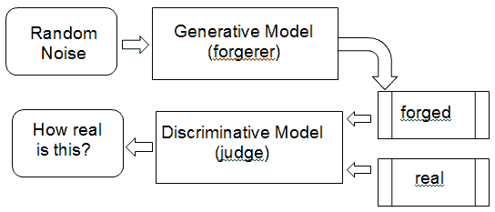

An example of Generator (forger) -Discriminator (judge) model. The Discriminator receives forged and real images

当然，GAN 可以在有两名玩家的游戏中找到平衡点。 为了有效学习，如果一个玩家在下一轮更新中成功下坡，那么相同的更新也必须使另一个玩家也下坡。 想想看！ 如果伪造者每次都学会如何愚弄法官，那么伪造者本人就没什么可学的了。 有时，两个玩家最终会达到平衡，但这并不总是可以保证的，因此两个玩家可以长时间继续比赛。 下图提供了双方的示例：


An example of convergence for Generator and Discriminator

# 一些很酷的 GAN 应用程序

我们已经确定生成器学习如何伪造数据。 这意味着它将学习如何创建由网络创建的新合成数据，并且*看起来是*真实的并且由人类创建。 在讨论有关 GAN 代码的详细信息之前，我想分享使用 GAN 的最新论文（[代码可在线获得](https://github.com/hanzhanggit/StackGAN)）的结果。 从文本描述开始合成伪造的图像。 结果令人印象深刻。 第一列是测试集中的真实图像，其他所有列都是从 StackGAN 的 Stage-I 和 Stage-II 中相同的文本描述生成的图像。 [YouTube 上有更多示例](https://www.youtube.com/watch?v=SuRyL5vhCIM&feature=youtu.be)：

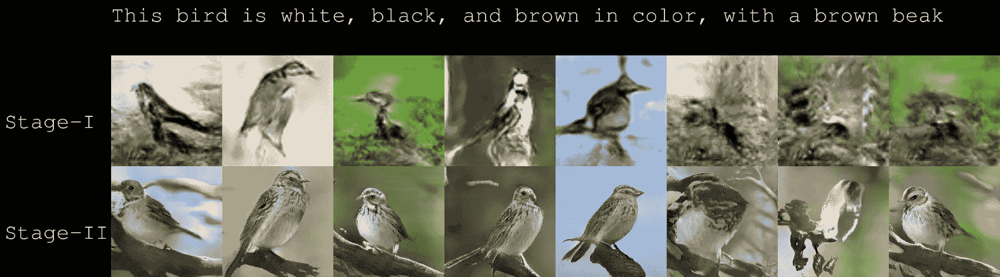

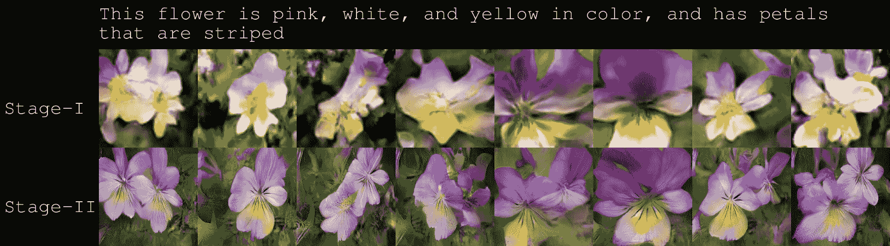

现在，让我们看看 GAN 如何学习**伪造** MNIST 数据集。 在这种情况下，它是用于生成器和鉴别器网络的 GAN 和 ConvNets 的组合。 最初，生成器不会产生任何可理解的东西，但是经过几次迭代，合成的伪造数字变得越来越清晰。 在下图中，通过增加训练时期来对面板进行排序，您可以看到面板之间的质量改进：

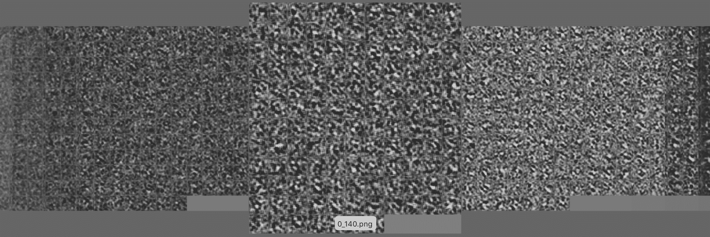

The improved image is as follows:

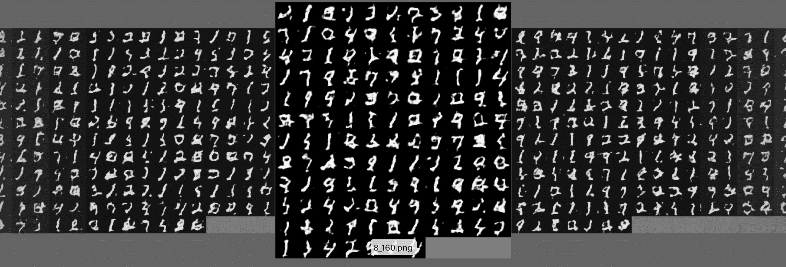

We can see further improvements in the following image:

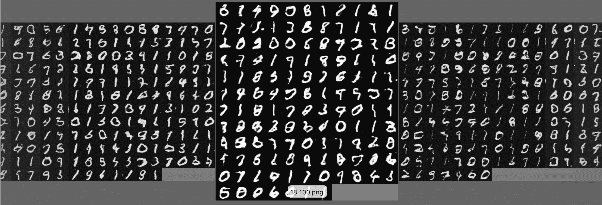

GAN 最酷的用途之一是对生成器矢量 Z 的面部进行算术。换句话说，如果我们停留在合成伪造图像的空间中，则可能会看到类似以下内容：`[微笑的女人]-[中性的女人] + [中性的男人] = [微笑的男人]`，或类似这样：`[戴眼镜的男人] - [戴眼镜的男人] + [戴眼镜的女人] = [戴眼镜的女人]`。 下图取自：[深度卷积生成对抗网络的无监督表示学习](https://arxiv.org/abs/1511.06434)（Alec Radford，Luke Metz，Soumith Chintala，2016）

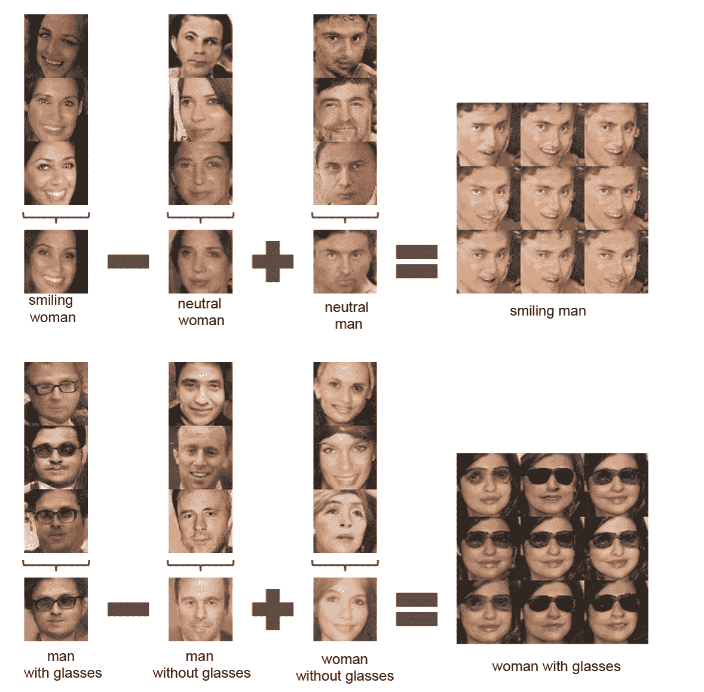

[这个链接](https://github.com/Newmu/dcgan_code)提供了 GAN 的其他出色示例。 本文中所有图像均由神经网络生成。 他们不是真实的。 [全文可在此处找到](http://arxiv.org/abs/1511.06434)。

**卧室**：经过五个时期的训练后生成的卧室：

An example of generated bedrooms

**专辑封面**：这些图像不是真实的，而是由 GAN 生成的。 专辑封面看起来很真实：


An example of generated album covers

# 学习使用简单的 GAN 伪造 MNIST 图像

Ian J.Goodfellow，Jean Pouget-Abadie，Mehdi Mirza，Bing Xu，David Warde-Farley，Sherjil Ozair，Aaron Courville，Yoshua Bengio 等人撰写的 Generative Adversarial Networks（2014）是更好地理解 GAN 的好论文。 在本食谱中，我们将学习如何使用以 Generator-Discriminator 体系结构组织的全连接层网络来伪造 MNIST 手写数字。

# 做好准备

此食谱基于[这个页面](https://github.com/TengdaHan/GAN-TensorFlow)上可用的代码。

# 怎么做...

我们按以下步骤进行：

1.  从 github 克隆代码：

```py
git clone https://github.com/TengdaHan/GAN-TensorFlow
```

2.  如论文*中所述，定义 Xavier 初始化程序。了解由 Xavier Glorot，Yoshua 编写的深度前馈神经网络的训练[2009]* *Bengio，http：//citeseerx.ist.psu.edu/viewdoc /download?doi=10.1.1.207.2059 & rep = rep1 & type = pdf* 事实证明，初始化程序可让 GAN 更好地收敛：

```py
def xavier_init(size):
  in_dim = size[0]
  xavier_stddev = 1\. / tf.sqrt(in_dim / 2.)
  return xavier_stddev
```

3.  定义输入 X 的生成器。首先，我们定义尺寸为[100，K = 128]的矩阵 W1，并根据正态分布对其进行初始化。 注意 100 是 Z 的任意值，Z 是我们的发生器使用的初始噪声。 然后，我们定义尺寸为[K = 256]的偏差 B1。 类似地，我们定义尺寸为[`K=128`，`L=784`]的矩阵 W2 和尺寸为[L = 784]的偏置 B2。 使用步骤 1 中定义的`xavier_init`初始化两个矩阵 W1 和 W2，而使用`tf.constant_initializer()`初始化 B1 和 B2。 之后，我们计算矩阵 *X * W1* 之间的乘法，求和 B1 的偏差，然后将其传递给 RELU 激活函数以获得 fc1。 然后将该密集层与下一个密集层连接，该密集层是通过将矩阵 fc1 与 W2 相乘并求和 B2 的偏差而创建的。 然后将结果通过 Sigmoid 函数传递。 这些步骤用于定义用于生成器的两层神经网络：

```py
def generator(X):
  with tf.variable_scope('generator'): 
    K = 128
    L = 784
    W1 = tf.get_variable('G_W1', [100, K],
  initializer=tf.random_normal_initializer(stddev=xavier_init([100,   K])))
    B1 = tf.get_variable('G_B1', [K],       initializer=tf.constant_initializer())
    W2 = tf.get_variable('G_W2', [K, L],
    initializer=tf.random_normal_initializer(stddev=xavier_init([K,   L])))
    B2 = tf.get_variable('G_B2', [L],    initializer=tf.constant_initializer())
    # summary
    tf.summary.histogram('weight1', W1)
    tf.summary.histogram('weight2', W2)
    tf.summary.histogram('biases1', B1)
    tf.summary.histogram('biases2', B2)
    fc1 = tf.nn.relu((tf.matmul(X, W1) + B1))
    fc2 = tf.matmul(fc1, W2) + B2
    prob = tf.nn.sigmoid(fc2)
    return prob
```

4.  定义输入 X 的鉴别符。原则上，这与生成器非常相似。 主要区别在于，如果参数重用为 true，则调用`scope.reuse_variables()`触发重用。 然后我们定义两个密集层。 第一层使用尺寸为[`J=784`，`K=128`]的矩阵 W1，尺寸为[`K=128`]的偏差 B1，并且它基于 X 与 W1 的标准乘积。 将该结果添加到 B1 并传递给 RELU 激活函数以获取结果 fc1。 第二个矩阵使用尺寸为[`K=128`，`L=1`]的矩阵 W2 和尺寸为[`L=1`]的偏差 B2，它基于 fc1 与 W2 的标准乘积。 将此结果添加到 B2 并传递给 Sigmoid 函数：

```py
def discriminator(X, reuse=False):
  with tf.variable_scope('discriminator'):
    if reuse:
      tf.get_variable_scope().reuse_variables()
    J = 784
    K = 128
    L = 1
    W1 = tf.get_variable('D_W1', [J, K],
    initializer=tf.random_normal_initializer(stddev=xavier_init([J,  K])))
    B1 = tf.get_variable('D_B1', [K],    initializer=tf.constant_initializer())
    W2 = tf.get_variable('D_W2', [K, L],
initializer=tf.random_normal_initializer(stddev=xavier_init([K, L])))
    B2 = tf.get_variable('D_B2', [L],  initializer=tf.constant_initializer())
    # summary
    tf.summary.histogram('weight1', W1)
    tf.summary.histogram('weight2', W2)
    tf.summary.histogram('biases1', B1)
    tf.summary.histogram('biases2', B2)
    fc1 = tf.nn.relu((tf.matmul(X, W1) + B1))
    logits = tf.matmul(fc1, W2) + B2
    prob = tf.nn.sigmoid(logits)
    return prob, logits
```

5.  现在让我们定义一些有用的附加功能。 首先，我们导入一堆标准模块：

```py
import tensorflow as tf
import numpy as np
import matplotlib.pyplot as plt
import matplotlib.gridspec as gridspec
import os
import argparse
```

6.  然后，我们从 MNIST 数据集中读取数据，并定义了用于绘制样本的辅助函数：

```py
def read_data():
  from tensorflow.examples.tutorials.mnist import input_data
  mnist = input_data.read_data_sets("../MNIST_data/", one_hot=True)
  return mnist

def plot(samples):
  fig = plt.figure(figsize=(8, 8))
  gs = gridspec.GridSpec(8, 8)
  gs.update(wspace=0.05, hspace=0.05)
  for i, sample in enumerate(samples):
    ax = plt.subplot(gs[i])
    plt.axis('off')
    ax.set_xticklabels([])
    ax.set_yticklabels([])
    ax.set_aspect('equal')
    plt.imshow(sample.reshape(28, 28), cmap='Greys_r')
  return fig
```

7.  现在让我们定义训练功能。 首先，让我们读取 MNIST 数据，然后定义一个具有一个用于标准 MNIST 手写字符的通道的 28 x 28 形状的矩阵 X。 然后，让我们定义大小为 100 的 z 噪声矢量，这是 GAN 论文中提出的一个常见选择。 下一步是在 z 上调用生成器，然后将结果分配给 G。之后，我们将 X 传递给鉴别符，而无需重用。 然后，我们将伪造/伪造的 G 结果传递给鉴别器，从而重用学习到的权重。 这方面的一个重要方面是我们如何选择鉴别器的损失函数，该函数是两个交叉熵的和：一个交叉熵，一个用于实字符，其中所有真实 MNIST 字符的标签都设置为一个，另一个用于伪造的字符，其中 所有伪造的字符的标签都设置为零。 鉴别器和生成器以交替顺序运行 100,000 步。 每 500 步，会从学习到的分布中抽取一个样本，以打印该生成器到目前为止所学的内容。 这就是定义新纪元的条件，结果将在下一节中显示。 让我们看看实现我们刚刚描述的代码片段。

```py
def train(logdir, batch_size):
  from model_fc import discriminator, generator
  mnist = read_data()
  with tf.variable_scope('placeholder'):
    # Raw image
    X = tf.placeholder(tf.float32, [None, 784])
    tf.summary.image('raw image', tf.reshape(X, [-1, 28, 28, 1]), 3)
   # Noise
   z = tf.placeholder(tf.float32, [None, 100]) # noise
   tf.summary.histogram('Noise', z)

  with tf.variable_scope('GAN'):
    G = generator(z)
    D_real, D_real_logits = discriminator(X, reuse=False)
    D_fake, D_fake_logits = discriminator(G, reuse=True)
    tf.summary.image('generated image', tf.reshape(G, [-1, 28, 28, 1]), 3)

  with tf.variable_scope('Prediction'):
    tf.summary.histogram('real', D_real) 
    tf.summary.histogram('fake', D_fake)

  with tf.variable_scope('D_loss'):
    d_loss_real = tf.reduce_mean(
    tf.nn.sigmoid_cross_entropy_with_logits(
    logits=D_real_logits, labels=tf.ones_like(D_real_logits)))
    d_loss_fake = tf.reduce_mean(
    tf.nn.sigmoid_cross_entropy_with_logits(
     logits=D_fake_logits, labels=tf.zeros_like(D_fake_logits)))
    d_loss = d_loss_real + d_loss_fake

  tf.summary.scalar('d_loss_real', d_loss_real)
  tf.summary.scalar('d_loss_fake', d_loss_fake)
  tf.summary.scalar('d_loss', d_loss)

  with tf.name_scope('G_loss'):
    g_loss = tf.reduce_mean(tf.nn.sigmoid_cross_entropy_with_logits
   (logits=D_fake_logits, labels=tf.ones_like(D_fake_logits)))
    tf.summary.scalar('g_loss', g_loss)
    tvar = tf.trainable_variables()
    dvar = [var for var in tvar if 'discriminator' in var.name]
    gvar = [var for var in tvar if 'generator' in var.name]

  with tf.name_scope('train'):
    d_train_step = tf.train.AdamOptimizer().minimize(d_loss,   var_list=dvar)
    g_train_step = tf.train.AdamOptimizer().minimize(g_loss,  var_list=gvar)

  sess = tf.Session()
  init = tf.global_variables_initializer()
  sess.run(init)
  merged_summary = tf.summary.merge_all()
  writer = tf.summary.FileWriter('tmp/mnist/'+logdir)
  writer.add_graph(sess.graph)
  num_img = 0
  if not os.path.exists('output/'):
    os.makedirs('output/')

  for i in range(100000):
    batch_X, _ = mnist.train.next_batch(batch_size)
    batch_noise = np.random.uniform(-1., 1., [batch_size, 100])
    if i % 500 == 0:
     samples = sess.run(G, feed_dict={z: np.random.uniform(-1., 1., [64, 100])})
     fig = plot(samples)
     plt.savefig('output/%s.png' % str(num_img).zfill(3),    bbox_inches='tight')
     num_img += 1
    plt.close(fig)

  _, d_loss_print = sess.run([d_train_step, d_loss],
feed_dict={X: batch_X, z: batch_noise})
  _, g_loss_print = sess.run([g_train_step, g_loss],
  feed_dict={z: batch_noise})
  if i % 100 == 0:
    s = sess.run(merged_summary, feed_dict={X: batch_X, z: batch_noise})
    writer.add_summary(s, i)
    print('epoch:%d g_loss:%f d_loss:%f' % (i, g_loss_print, d_loss_print))

  if __name__ == '__main__':
    parser = argparse.ArgumentParser(description='Train vanila GAN using fully-connected layers networks')
    parser.add_argument('--logdir', type=str, default='1', help='logdir for Tensorboard, give a string')
    parser.add_argument('--batch_size', type=int, default=64, help='batch size: give a int')
    args = parser.parse_args()
    train(logdir=args.logdir, batch_size=args.batch_size)
```

# 这个怎么运作...

在每个时期，生成器都会进行许多预测（它会生成伪造的 MNIST 图像），鉴别器会在将预测与实际 MNIST 图像混合后尝试学习如何生成伪造的图像。 在 32 个时代之后，生成器学习伪造这组手写数字。 没有人对机器进行编程来编写，但是它学会了如何编写与人类所写的数字没有区别的数字。 请注意，训练 GAN 可能非常困难，因为有必要在两个参与者之间找到平衡。 如果您对该主题感兴趣，我建议您看看[从业者收集的一系列技巧](https://github.com/soumith/ganhacks)。

让我们看一下不同时期的许多实际示例，以了解机器将如何学习以改善其编写过程：

| 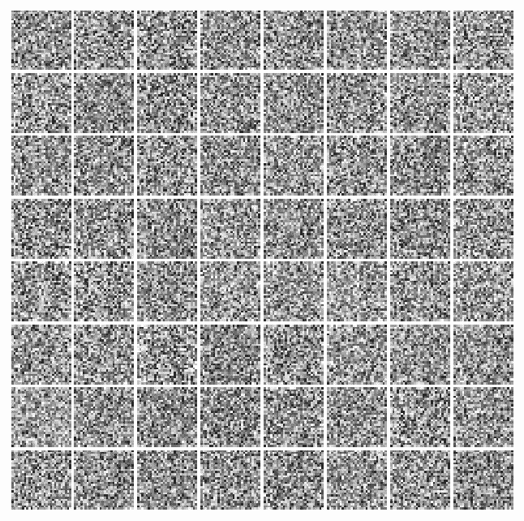 | 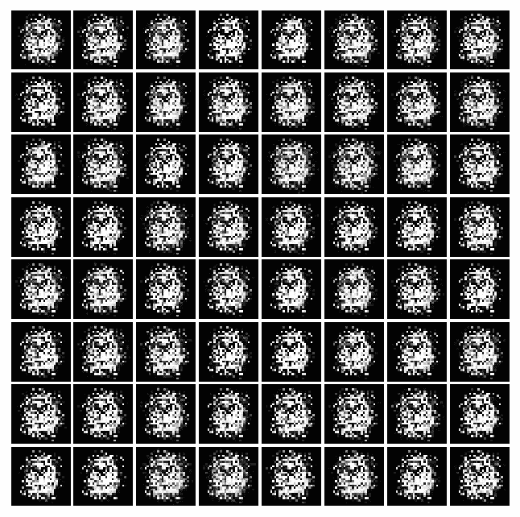 | 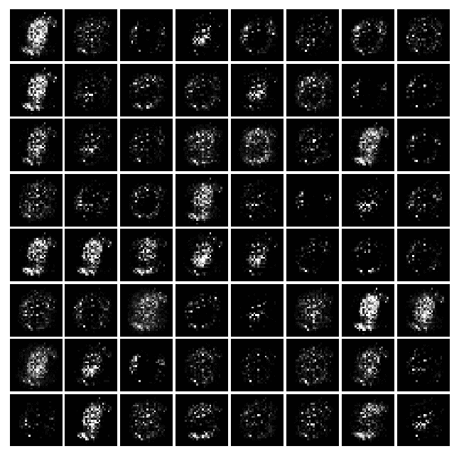 |
| 时代 0 | 纪元 2 | 纪元 4 |
|  | 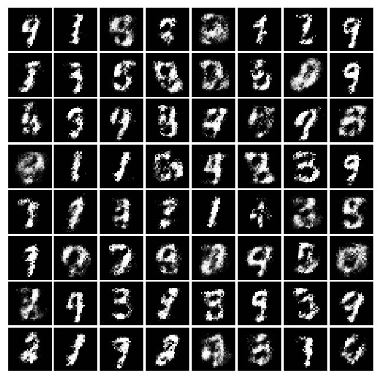 | 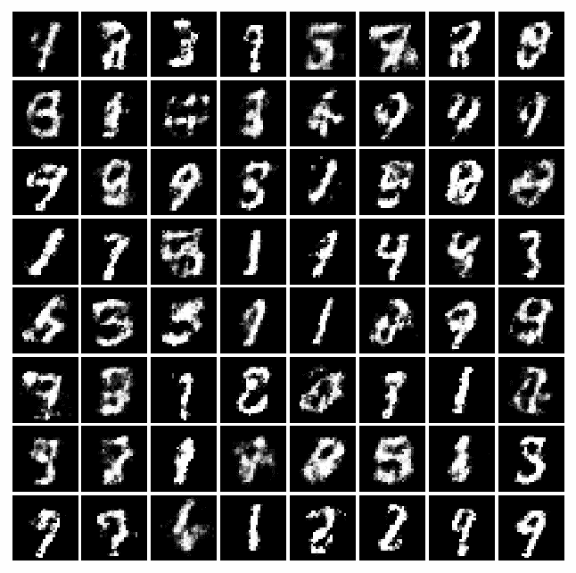 |
| 纪元 8 | 纪元 16 | 时代 32 |
| 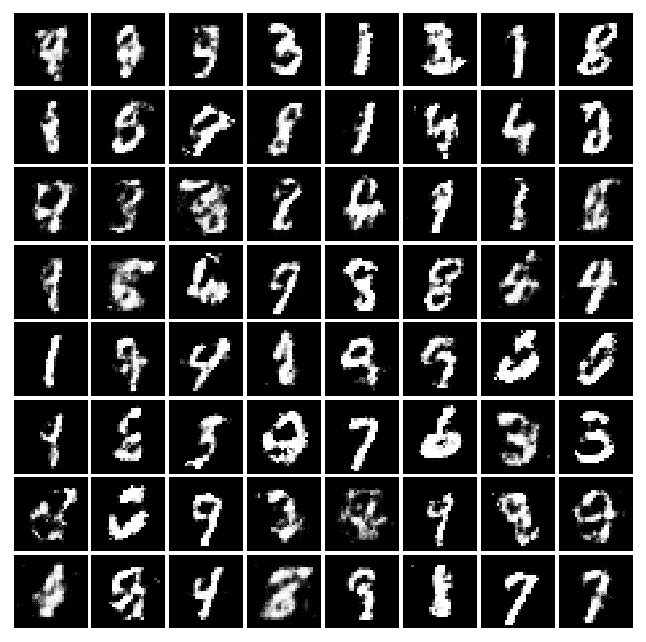 | 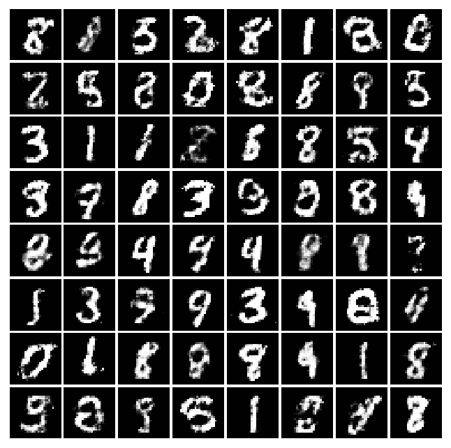 | 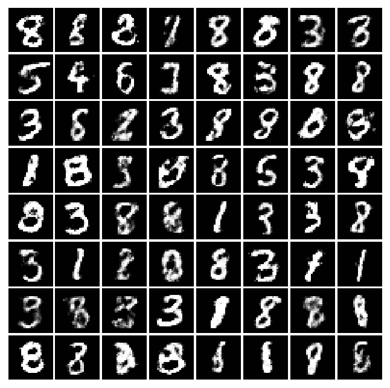 |
| 时代 64 | 时代 128 | 时代 200 |

Example of forged MNIST-like characters with a GAN

# 学习使用 DCGAN 伪造 MNIST 图像

在本食谱中，我们将使用一个简单的 GAN，它使用 CNN 来学习如何伪造 MNIST 图像并创建不属于原始数据集的新图像。 这个想法是 CNN 与 GAN 一起使用将提高处理图像数据集的能力。 请注意，先前的方法是将 GAN 与完全连接的网络一起使用，而在此我们重点介绍 CNN。

# 做好准备

此食谱基于[这个页面](https://github.com/TengdaHan/GAN-TensorFlow)上可用的代码。

# 怎么做...

我们按以下步骤进行：

1.  从 github 克隆代码：

```py
git clone https://github.com/TengdaHan/GAN-TensorFlow
```

2.  按照论文*中的定义定义 Xavier 初始化程序。了解 Xavier Glorot，Yoshua Bengio* 训练深度前馈神经网络（2009）的难度。 事实证明，初始化程序可让 GAN 更好地收敛：

```py
def xavier_init(size):
  in_dim = size[0]
  xavier_stddev = 1\. / tf.sqrt(in_dim / 2.)
  # return tf.random_normal(shape=size, stddev=xavier_stddev)
  return xavier_stddev
```

3.  为给定输入 *x* ，权重 *w* ，偏差 *b* 和给定*步幅*定义卷积运算。 我们的代码使用标准的`tf.nn.conv2d(...)`模块。 请注意，我们使用第 4 章中定义的“ SAME”填充：

```py
def conv(x, w, b, stride, name):
  with tf.variable_scope('conv'):
    tf.summary.histogram('weight', w)
    tf.summary.histogram('biases', b)
    return tf.nn.conv2d(x,
      filter=w,
      strides=[1, stride, stride, 1],
      padding='SAME',
      name=name) + b
```

4.  为给定输入 *x* ，权重 *w* ，偏差 *b* 和给定*步幅*定义反卷积运算。 我们的代码使用标准的`tf.nn.conv2d_transpose(...)`模块。 同样，我们使用`'SAME'`填充。

```py
def deconv(x, w, b, shape, stride, name):
  with tf.variable_scope('deconv'):
    tf.summary.histogram('weight', w)
    tf.summary.histogram('biases', b)
    return tf.nn.conv2d_transpose(x,
      filter=w,
      output_shape=shape,
      strides=[1, stride, stride, 1],
      padding='SAME',
      name=name) + b
```

5.  定义一个标准`LeakyReLU`，这对于 GAN 是非常有效的激活函数：

```py
def lrelu(x, alpha=0.2):
  with tf.variable_scope('leakyReLU'):
    return tf.maximum(x, alpha * x)
```

6.  定义生成器。 首先，我们定义输入大小为 100（Z 的任意大小，即生成器使用的初始噪声）的完全连接层。 全连接层由尺寸为[100，7 * 7 * 256]且根据正态分布初始化的矩阵 W1 和尺寸为[7 * 7 * 256]的偏置 B1 组成。 该层使用 ReLu 作为激活函数。 在完全连接的层之后，生成器将应用两个反卷积运算 deconv1 和 deconv2，两者的步幅均为 2。 完成第一个 deconv1 操作后，将结果批量标准化。 请注意，第二次反卷积运算之前会出现丢失，概率为 40％。 最后一个阶段是一个 Sigmoid，用作非线性激活，如下面的代码片段所示：

```py
def generator(X, batch_size=64):
  with tf.variable_scope('generator'):
    K = 256
    L = 128
    M = 64
    W1 = tf.get_variable('G_W1', [100, 7*7*K],    initializer=tf.random_normal_initializer(stddev=0.1))
    B1 = tf.get_variable('G_B1', [7*7*K], initializer=tf.constant_initializer())
    W2 = tf.get_variable('G_W2', [4, 4, M, K], initializer=tf.random_normal_initializer(stddev=0.1))
    B2 = tf.get_variable('G_B2', [M], initializer=tf.constant_initializer())
    W3 = tf.get_variable('G_W3', [4, 4, 1, M], initializer=tf.random_normal_initializer(stddev=0.1))
    B3 = tf.get_variable('G_B3', [1], initializer=tf.constant_initializer())
    X = lrelu(tf.matmul(X, W1) + B1)
    X = tf.reshape(X, [batch_size, 7, 7, K])
    deconv1 = deconv(X, W2, B2, shape=[batch_size, 14, 14, M], stride=2, name='deconv1')
    bn1 = tf.contrib.layers.batch_norm(deconv1)
    deconv2 = deconv(tf.nn.dropout(lrelu(bn1), 0.4), W3, B3, shape=[batch_size, 28, 28, 1], stride=2, name='deconv2')
    XX = tf.reshape(deconv2, [-1, 28*28], 'reshape')
    return tf.nn.sigmoid(XX)
```

7.  定义鉴别符。 与前面的配方一样，如果参数重用为 true，则调用`scope.reuse_variables()`触发重用。 鉴别器使用两个卷积层。 第一个是批处理归一化，而第二个是概率为 40％的辍学，然后是批处理归一化步骤。 之后，我们得到了一个具有激活函数 ReLU 的致密层，然后是另一个具有基于 S 形激活函数的致密层：

```py
def discriminator(X, reuse=False):
  with tf.variable_scope('discriminator'):
    if reuse:
      tf.get_variable_scope().reuse_variables()
    K = 64
    M = 128
    N = 256
    W1 = tf.get_variable('D_W1', [4, 4, 1, K],   initializer=tf.random_normal_initializer(stddev=0.1))
    B1 = tf.get_variable('D_B1', [K], initializer=tf.constant_initializer())
    W2 = tf.get_variable('D_W2', [4, 4, K, M], initializer=tf.random_normal_initializer(stddev=0.1))
    B2 = tf.get_variable('D_B2', [M], initializer=tf.constant_initializer())
    W3 = tf.get_variable('D_W3', [7*7*M, N], initializer=tf.random_normal_initializer(stddev=0.1))
    B3 = tf.get_variable('D_B3', [N], initializer=tf.constant_initializer())
    W4 = tf.get_variable('D_W4', [N, 1], initializer=tf.random_normal_initializer(stddev=0.1))
    B4 = tf.get_variable('D_B4', [1], initializer=tf.constant_initializer())
    X = tf.reshape(X, [-1, 28, 28, 1], 'reshape')
    conv1 = conv(X, W1, B1, stride=2, name='conv1')
    bn1 = tf.contrib.layers.batch_norm(conv1)
    conv2 = conv(tf.nn.dropout(lrelu(bn1), 0.4), W2, B2, stride=2, name='conv2')
    bn2 = tf.contrib.layers.batch_norm(conv2)
    flat = tf.reshape(tf.nn.dropout(lrelu(bn2), 0.4), [-1, 7*7*M], name='flat')
    dense = lrelu(tf.matmul(flat, W3) + B3)
    logits = tf.matmul(dense, W4) + B4
    prob = tf.nn.sigmoid(logits)
    return prob, logits
```

8.  然后，我们从 MNIST 数据集中读取数据，并定义用于绘制样本的辅助函数：

```py
import numpy as np
import matplotlib.pyplot as plt
import matplotlib.gridspec as gridspec
import os
import argparse

def read_data():
  from tensorflow.examples.tutorials.mnist import input_data
  mnist = input_data.read_data_sets("../MNIST_data/", one_hot=True)
  return mnist

def plot(samples):
  fig = plt.figure(figsize=(8, 8))
  gs = gridspec.GridSpec(8, 8)
  gs.update(wspace=0.05, hspace=0.05)
  for i, sample in enumerate(samples):
    ax = plt.subplot(gs[i])
    plt.axis('off')
    ax.set_xticklabels([])
    ax.set_yticklabels([])
    ax.set_aspect('equal')
    plt.imshow(sample.reshape(28, 28), cmap='Greys_r')
    return fig
```

9.  现在让我们定义训练功能。 首先，让我们读取 MNIST 数据，然后定义一个具有一个用于标准 MNIST 手写字符的通道的 28 x 28 形状的矩阵 X。 然后，让我们定义大小为 100 的 z 噪声向量，这是 GAN 论文中提出的一个常见选择。 下一步是在 z 上调用生成器，然后将结果分配给 G。之后，我们将 X 传递给鉴别符，而无需重用。 然后，我们将伪造/伪造的 G 结果传递给鉴别器，从而重用学习到的权重。 这方面的一个重要方面是我们如何选择鉴别函数的损失函数，该函数是两个交叉熵的和：一个用于实字符，其中所有真实 MNIST 字符的标号都设置为 1，一个用于遗忘字符，其中所有 伪造的字符的标签设置为零。 鉴别器和生成器以交替顺序运行 100,000 步。 每 500 步，会从学习到的分布中抽取一个样本，以打印该生成器到目前为止所学的内容。 这就是定义新纪元的条件，结果将在下一部分中显示。 训练功能代码段报告如下

```py
def train(logdir, batch_size):
  from model_conv import discriminator, generator
  mnist = read_data()

  with tf.variable_scope('placeholder'):
    # Raw image
    X = tf.placeholder(tf.float32, [None, 784])
    tf.summary.image('raw image', tf.reshape(X, [-1, 28, 28, 1]), 3)
    # Noise
    z = tf.placeholder(tf.float32, [None, 100]) # noise
    tf.summary.histogram('Noise', z)

  with tf.variable_scope('GAN'):
    G = generator(z, batch_size)
    D_real, D_real_logits = discriminator(X, reuse=False)
    D_fake, D_fake_logits = discriminator(G, reuse=True)
    tf.summary.image('generated image', tf.reshape(G, [-1, 28, 28, 1]), 3)

  with tf.variable_scope('Prediction'):
    tf.summary.histogram('real', D_real)
    tf.summary.histogram('fake', D_fake)

  with tf.variable_scope('D_loss'):
    d_loss_real = tf.reduce_mean(
    tf.nn.sigmoid_cross_entropy_with_logits(
logits=D_real_logits, labels=tf.ones_like(D_real_logits)))

    d_loss_fake = tf.reduce_mean(
tf.nn.sigmoid_cross_entropy_with_logits(
logits=D_fake_logits, labels=tf.zeros_like(D_fake_logits)))
    d_loss = d_loss_real + d_loss_fake
    tf.summary.scalar('d_loss_real', d_loss_real)
    tf.summary.scalar('d_loss_fake', d_loss_fake)
    tf.summary.scalar('d_loss', d_loss)

  with tf.name_scope('G_loss'):
    g_loss =   tf.reduce_mean(tf.nn.sigmoid_cross_entropy_with_logits
(logits=D_fake_logits, labels=tf.ones_like(D_fake_logits)))
    tf.summary.scalar('g_loss', g_loss)
    tvar = tf.trainable_variables()
    dvar = [var for var in tvar if 'discriminator' in var.name]
    gvar = [var for var in tvar if 'generator' in var.name]

  with tf.name_scope('train'):
    d_train_step = tf.train.AdamOptimizer().minimize(d_loss, var_list=dvar)
    g_train_step = tf.train.AdamOptimizer().minimize(g_loss, var_list=gvar)

  sess = tf.Session()
  init = tf.global_variables_initializer()

  sess.run(init)
  merged_summary = tf.summary.merge_all()
  writer = tf.summary.FileWriter('tmp/'+'gan_conv_'+logdir)
  writer.add_graph(sess.graph)
  num_img = 0

  if not os.path.exists('output/'):
    os.makedirs('output/')
  for i in range(100000):
    batch_X, _ = mnist.train.next_batch(batch_size)
    batch_noise = np.random.uniform(-1., 1., [batch_size, 100])
    if i % 500 == 0:
      samples = sess.run(G, feed_dict={z: np.random.uniform(-1., 1., [64, 100])})
    fig = plot(samples)
    plt.savefig('output/%s.png' % str(num_img).zfill(3), bbox_inches='tight')
    num_img += 1
    plt.close(fig)

  _, d_loss_print = sess.run([d_train_step, d_loss],
feed_dict={X: batch_X, z: batch_noise})
  _, g_loss_print = sess.run([g_train_step, g_loss],
feed_dict={z: batch_noise})

  if i % 100 == 0:
    s = sess.run(merged_summary, feed_dict={X: batch_X, z: batch_noise})
    writer.add_summary(s, i)
    print('epoch:%d g_loss:%f d_loss:%f' % (i, g_loss_print, d_loss_print))

  if __name__ == '__main__':
    parser = argparse.ArgumentParser(description='Train vanila GAN using convolutional networks')
    parser.add_argument('--logdir', type=str, default='1', help='logdir for Tensorboard, give a string')
    parser.add_argument('--batch_size', type=int, default=64, help='batch size: give a int')
    args = parser.parse_args()
    train(logdir=args.logdir, batch_size=args.batch_size)
```

# 这个怎么运作...

将 CNN 与 GAN 一起使用可提高学习能力。 让我们看一下不同时期的许多实际示例，以了解机器将如何学习以改善其编写过程。 例如，将以下配方中的四次迭代后获得的结果与先前配方中的四次迭代后获得的结果进行比较。 你看得到差别吗？ 我希望自己可以学习这种艺术！

| 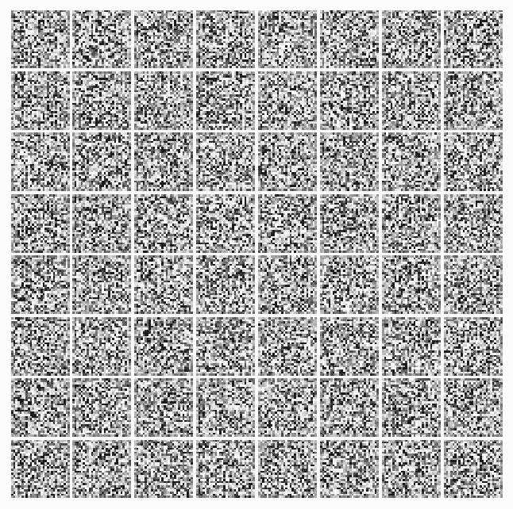 | 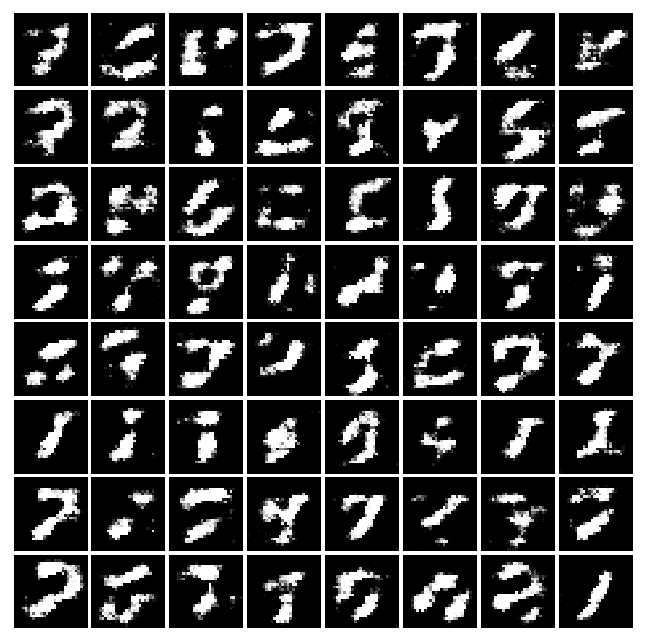 | 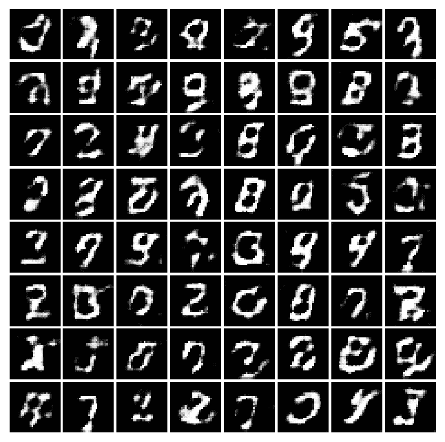 |
| 时代 0 | 纪元 2 | 纪元 4 |
| 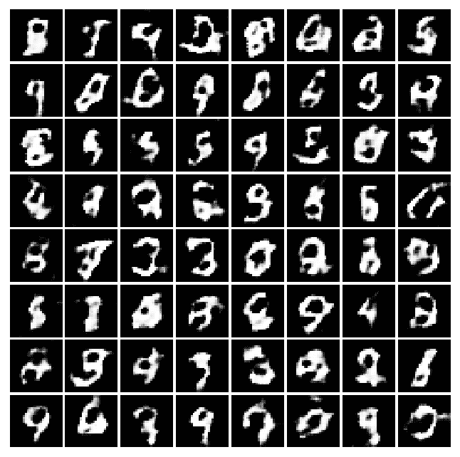 | 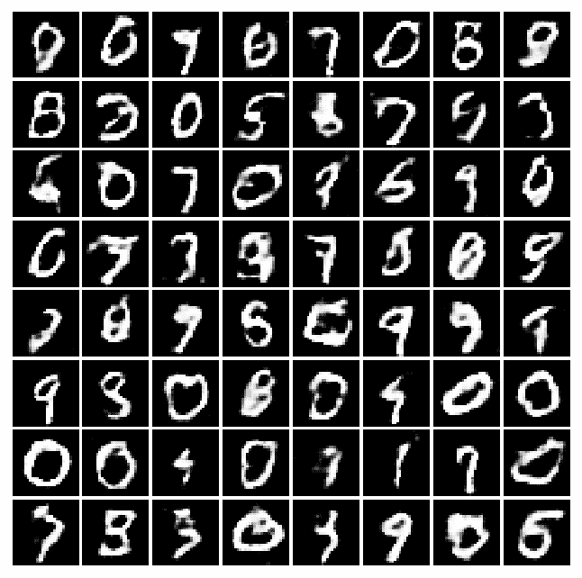 | 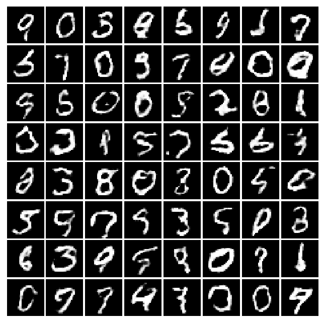 |
| 纪元 8 | 纪元 16 | 时代 32 |

| 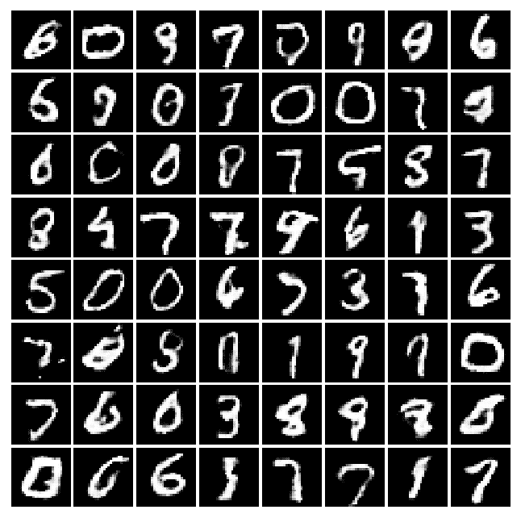 | 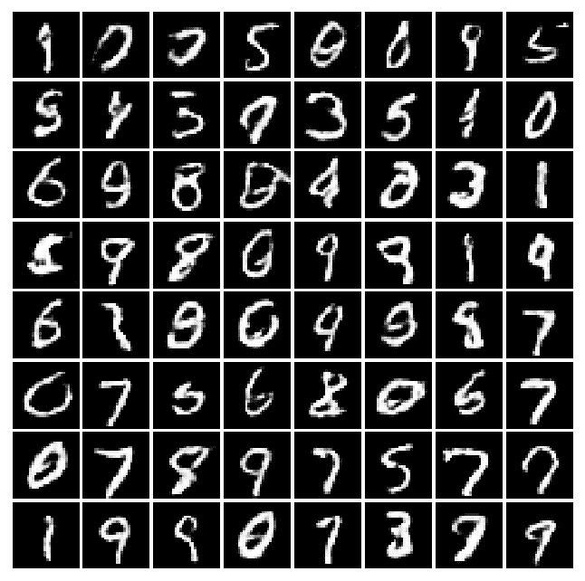 | 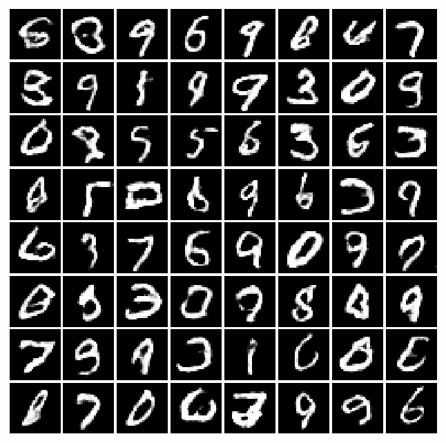 |
| 时代 64 | 时代 128 | 时代 200 |

Example of forged MNIST-like with DCGAN

# 学习使用 DCGAN 伪造名人面孔和其他数据集

用于伪造 MNIST 图像的相同思想可以应用于其他图像域。 在本食谱中，您将学习如何使用位于[这个链接](https://github.com/carpedm20/DCGAN-tensorflow)的包在不同的数据集上训练 DCGAN 模型。 这项工作基于论文*和深度卷积生成对抗网络的无监督表示学习，Alec Radford，Luke Metz，Soumith Chintal，2015 年。*引用摘要：

In recent years, supervised learning with convolutional networks (CNNs) has seen huge adoption in computer vision applications. Comparatively, unsupervised learning with CNNs has received less attention. In this work we hope to help bridge the gap between the success of CNNs for supervised learning and unsupervised learning. We introduce a class of CNNs called deep convolutional generative adversarial networks (DCGANs), that have certain architectural constraints, and demonstrate that they are a strong candidate for unsupervised learning. Training on various image datasets, we show convincing evidence that our deep convolutional adversarial pair learns a hierarchy of representations from object parts to scenes in both the generator and discriminator. Additionally, we use the learned features for novel tasks - demonstrating their applicability as general image representations.

请注意，生成器具有下图所示的体系结构：

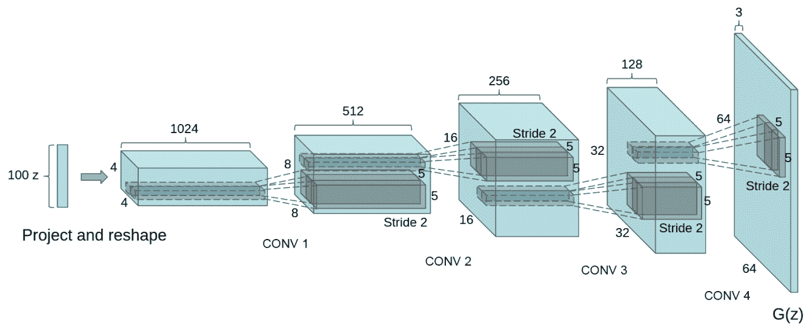

请注意，在包装中，相对于原始纸张进行了更改，以避免 D（鉴别器）网络快速收敛，G（发电机）网络每次 D 网络更新都会更新两次。

# 做好准备

此食谱基于[这个页面](https://github.com/carpedm20/DCGAN-tensorflow)上提供的代码。

# 怎么做...

我们按以下步骤进行：

1.  从 Github 克隆代码：

```py
git clone https://github.com/carpedm20/DCGAN-tensorflow
```

2.  使用以下命令下载数据集：

```py
python download.py mnist celebA
```

3.  要使用下载的数据集训练模型，请使用以下命令：

```py
python main.py --dataset celebA --input_height=108 --train --crop
```

4.  要使用现有模型对其进行测试，请使用以下命令：

```py
python main.py --dataset celebA --input_height=108 --crop
```

5.  另外，您可以通过执行以下操作来使用自己的数据集：

```py
$ mkdir data/DATASET_NAME
 ... add images to data/DATASET_NAME ...
 $ python main.py --dataset DATASET_NAME --train
 $ python main.py --dataset DATASET_NAME
 $ # example
 $ python main.py --dataset=eyes --input_fname_pattern="*_cropped.png" --train
```

# 这个怎么运作...

生成器学习如何生成名人的伪造图像，鉴别器学习如何将伪造的图像与真实的图像区分开。 两个网络中的每个时代都在竞争以改善和减少损失。 下表报告了前五个时期：

| 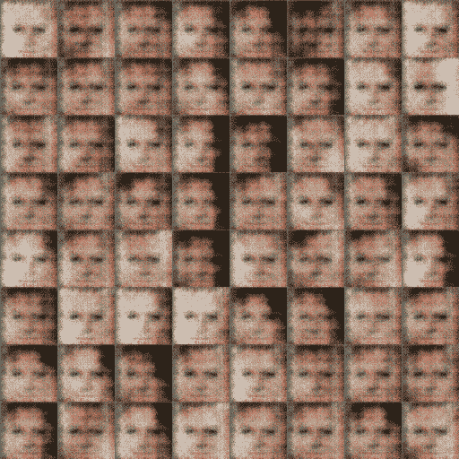 | 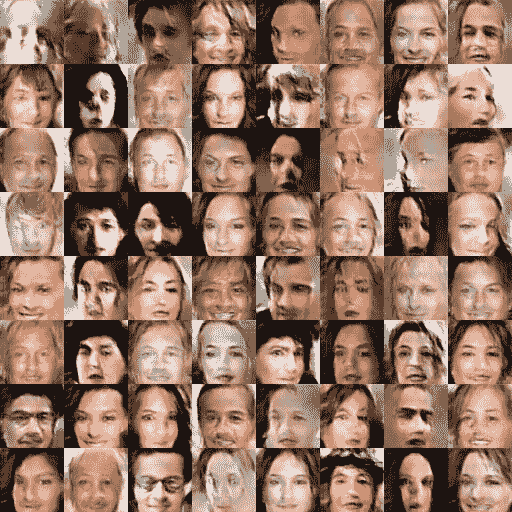 |
| 时代 0 | 纪元 1 |
| 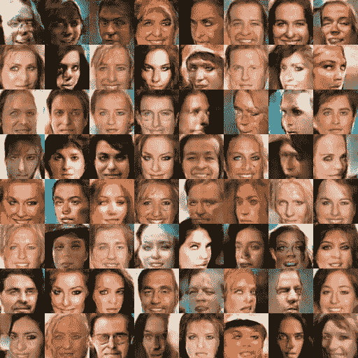 |  |
| 纪元 2 | 纪元 3 |
| 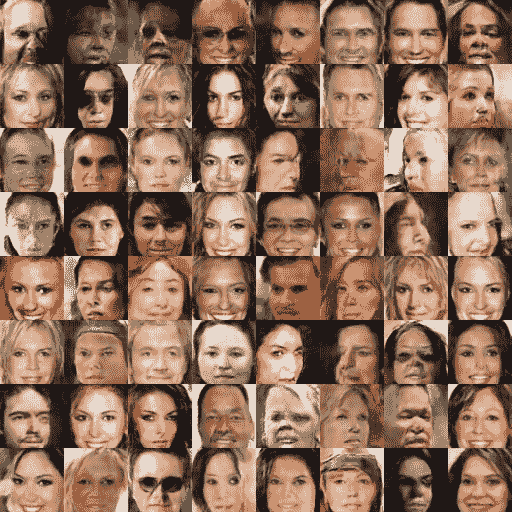 |  |
| 纪元 4 | 纪元 5 |

Example of forged celebrities with a DCGAN

# 还有更多...

内容感知填充是摄影师使用的一种工具，用于填充不需要的或丢失的图像部分。 Raymond A. Yeh，Chen Chen，Teck Yian Lim，Alexander G. Schwing，Mark Hasegawa--的论文 [*具有感知和上下文损失的语义图像修复*](https://arxiv.org/abs/1607.07539) *和* 约翰逊（Minh N.）的约翰逊（Johnson），2016 年使用 DCGAN 进行图像完成，并学习如何填充部分图像。

# 实现变分自编码器

**变分自编码器**（**VAE**）是神经网络和贝叶斯推理两者的最佳结合。 它们是最酷的神经网络，并已成为无监督学习的流行方法之一。 它们是自编码器。 与传统的编码器和自编码器的解码器网络（请参阅第 8 章*自编码器*）一起，它们还具有其他随机层。 编码器网络之后的随机层使用高斯分布对数据进行采样，解码器网络之后的随机层使用伯努利分布对数据进行采样。 像 GAN 一样，可以使用变分自编码器根据经过训练的分布来生成图像和图形。 VAE 允许人们设置潜在的复杂先验，从而学习强大的潜在表示。

下图描述了 VAE。 编码器网络*qᵩ（z | x）*逼近真实但棘手的后验分布 *p（z | x）*，其中 *x* 是 VAE 的输入， *z* 是潜在表示。 解码器网络 *p <sub>ϴ</sub> （x | z* ）将 *d* 维潜在变量（也称为潜在空间）作为其输入，并根据 与 *P（x）*相同的分布。 从 z | x〜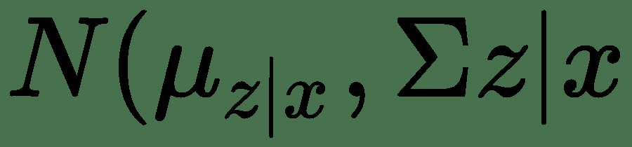中采样潜在表示 *z* ，解码器网络的输出从 x | z〜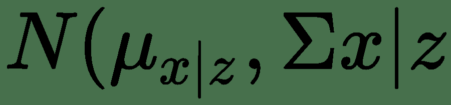中采样 x | z：

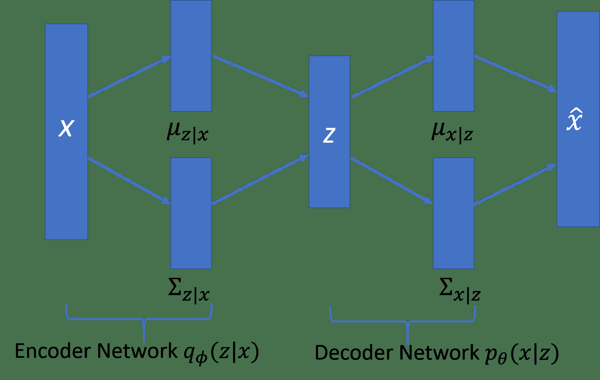

Example of Encoder-Decoder for Autoencoders.

# 准备...

既然我们已经掌握了 VAE 的基本体系结构，那么就出现了一个问题，即如何对它们进行训练，因为训练数据的最大可能性和后验密度是很难解决的？ 通过最大化日志数据可能性的下限来训练网络。 因此，损耗项包括两个部分：生成损耗，它是通过解码器网络通过采样获得的；以及 KL 发散项，也称为潜在损耗。

生成损失确保解码器生成的图像和用于训练网络的图像相同，而潜在损失确保后验分布*qᵩ（z | x）*接近先前的 *p <sub>ϴ</sub> （z）*。 由于编码器使用高斯分布进行采样，因此潜在损失可以衡量潜在变量与单位高斯的匹配程度。

对 VAE 进行训练后，我们只能使用解码器网络来生成新图像。

# 怎么做...

此处的代码基于 Kingma 和 Welling 的论文[自动编码变分贝叶斯](https://arxiv.org/pdf/1312.6114.pdf)，并改编自 [GitHub](https://jmetzen.github.io/2015-11-27/vae.html)。

1.  第一步是始终导入必要的模块。 对于此食谱，我们将需要 Numpy，Matplolib 和 TensorFlow：

```py
import numpy as np
import tensorflow as tf
import matplotlib.pyplot as plt
%matplotlib inline
```

2.  接下来，我们定义 VariationalAutoencoder 类。 `class __init__ method`定义了超参数，例如学习率，批处理大小，输入的占位符以及编码器和解码器网络的权重和偏差变量。 它还根据 VAE 的网络体系结构构建计算图。 在此食谱中，我们使用 Xavier 初始化来初始化权重。 我们没有定义自己的 Xavier 初始化方法，而是使用`tf.contrib.layers.xavier_initializer()` TensorFlow 来完成任务。 最后，我们定义损失（生成和潜在）和优化器操作：

```py
class VariationalAutoencoder(object):
  def __init__(self, network_architecture,   transfer_fct=tf.nn.softplus,
learning_rate=0.001, batch_size=100):
      self.network_architecture = network_architecture
      self.transfer_fct = transfer_fct
      self.learning_rate = learning_rate
      self.batch_size = batch_size
      # Place holder for the input
      self.x = tf.placeholder(tf.float32, [None,    network_architecture["n_input"]])
      # Define weights and biases
      network_weights = self._initialize_weights(**self.network_architecture)
      # Create autoencoder network
      # Use Encoder Network to determine mean and
      # (log) variance of Gaussian distribution in latent
      # space
      self.z_mean, self.z_log_sigma_sq = \
      self._encoder_network(network_weights["weights_encoder"],
    network_weights["biases_encoder"])
      # Draw one sample z from Gaussian distribution
      n_z = self.network_architecture["n_z"]
      eps = tf.random_normal((self.batch_size, n_z), 0, 1, dtype=tf.float32)
      # z = mu + sigma*epsilon
      self.z =       tf.add(self.z_mean,tf.multiply(tf.sqrt(tf.exp(self.z_log_sigma_sq)), eps))

      # Use Decoder network to determine mean of
      # Bernoulli distribution of reconstructed input
      self.x_reconstr_mean = \
      self._decoder_network(network_weights["weights_decoder"],
   network_weights["biases_decoder"])
      # Define loss function based variational upper-bound and 
      # corresponding optimizer
      # define generation loss
      generation_loss = \
  -tf.reduce_sum(self.x * tf.log(1e-10 + self.x_reconstr_mean)
+ (1-self.x) * tf.log(1e-10 + 1 - self.x_reconstr_mean), 1)
      latent_loss = -0.5 * tf.reduce_sum(1 + self.z_log_sigma_sq
- tf.square(self.z_mean)- tf.exp(self.z_log_sigma_sq), 1)
      self.cost = tf.reduce_mean(generation_loss + latent_loss)       #    average over batch
      # Define the optimizer
      self.optimizer = \
 tf.train.AdamOptimizer(learning_rate=self.learning_rate).minimize(self.cost)
      # Initializing the tensor flow variables
      init = tf.global_variables_initializer()
  # Launch the session
      self.sess = tf.InteractiveSession()
      self.sess.run(init)

def _initialize_weights(self, n_hidden_recog_1, n_hidden_recog_2,
n_hidden_gener_1, n_hidden_gener_2,
n_input, n_z):
   initializer = tf.contrib.layers.xavier_initializer()
   all_weights = dict()
   all_weights['weights_encoder'] = {
   'h1': tf.Variable(initializer(shape=(n_input, n_hidden_recog_1))),
   'h2': tf.Variable(initializer(shape=(n_hidden_recog_1, n_hidden_recog_2))),
   'out_mean': tf.Variable(initializer(shape=(n_hidden_recog_2, n_z))),
   'out_log_sigma': tf.Variable(initializer(shape=(n_hidden_recog_2, n_z)))}
   all_weights['biases_encoder'] = {
   'b1': tf.Variable(tf.zeros([n_hidden_recog_1], dtype=tf.float32)),
   'b2': tf.Variable(tf.zeros([n_hidden_recog_2], dtype=tf.float32)),
   'out_mean': tf.Variable(tf.zeros([n_z], dtype=tf.float32)),
   'out_log_sigma': tf.Variable(tf.zeros([n_z], dtype=tf.float32))}

   all_weights['weights_decoder'] = {
   'h1': tf.Variable(initializer(shape=(n_z, n_hidden_gener_1))),
   'h2': tf.Variable(initializer(shape=(n_hidden_gener_1, n_hidden_gener_2))),
   'out_mean': tf.Variable(initializer(shape=(n_hidden_gener_2, n_input))),
   'out_log_sigma': tf.Variable(initializer(shape=(n_hidden_gener_2, n_input)))}

    all_weights['biases_decoder'] = {
   'b1': tf.Variable(tf.zeros([n_hidden_gener_1],    dtype=tf.float32)),
   'b2': tf.Variable(tf.zeros([n_hidden_gener_2], dtype=tf.float32)),'out_mean': tf.Variable(tf.zeros([n_input], dtype=tf.float32)),
   'out_log_sigma': tf.Variable(tf.zeros([n_input], dtype=tf.float32))}
   return all_weights
```

3.  我们建立编码器网络和解码器网络。 编码器网络的第一层正在获取输入并生成输入的简化的潜在表示。 第二层将输入映射到高斯分布。 网络学习了以下转换：

```py
def _encoder_network(self, weights, biases):
  # Generate probabilistic encoder (recognition network), which
  # maps inputs onto a normal distribution in latent space.
  # The transformation is parametrized and can be learned.
  layer_1 = self.transfer_fct(tf.add(tf.matmul(self.x,     weights['h1']),
biases['b1']))
  layer_2 = self.transfer_fct(tf.add(tf.matmul(layer_1,   weights['h2']),
biases['b2']))
  z_mean = tf.add(tf.matmul(layer_2, weights['out_mean']),
biases['out_mean'])
  z_log_sigma_sq = \
tf.add(tf.matmul(layer_2, weights['out_log_sigma']),
biases['out_log_sigma'])
  return (z_mean, z_log_sigma_sq)

def _decoder_network(self, weights, biases):
  # Generate probabilistic decoder (decoder network), which
  # maps points in latent space onto a Bernoulli distribution in data space.
  # The transformation is parametrized and can be learned.
  layer_1 = self.transfer_fct(tf.add(tf.matmul(self.z, weights['h1']),
biases['b1']))
  layer_2 = self.transfer_fct(tf.add(tf.matmul(layer_1, weights['h2']),
biases['b2']))
  x_reconstr_mean = \
tf.nn.sigmoid(tf.add(tf.matmul(layer_2, weights['out_mean']),
  biases['out_mean']))
  return x_reconstr_mean
```

4.  VariationalAutoencoder 类还包含一些辅助函数，用于生成和重建数据并适合 VAE：

```py
def fit(self, X):
  opt, cost = self.sess.run((self.optimizer, self.cost),
  feed_dict={self.x: X})
  return cost

def generate(self, z_mu=None):
""" Generate data by sampling from latent space.
If z_mu is not None, data for this point in latent space is
generated. Otherwise, z_mu is drawn from prior in latent
space.
"""
  if z_mu is None:
    z_mu = np.random.normal(size=self.network_architecture["n_z"])
# Note: This maps to mean of distribution, we could alternatively
# sample from Gaussian distribution
  return self.sess.run(self.x_reconstr_mean,
      feed_dict={self.z: z_mu})

def reconstruct(self, X):
""" Use VAE to reconstruct given data. """
  return self.sess.run(self.x_reconstr_mean,
    feed_dict={self.x: X})
```

5.  一旦完成了 VAE 类，我们就定义了一个功能训练，它使用 VAE 类对象并为给定数据训练它。

```py
def train(network_architecture, learning_rate=0.001,
batch_size=100, training_epochs=10, display_step=5):
  vae = VariationalAutoencoder(network_architecture,
  learning_rate=learning_rate,
  batch_size=batch_size)
  # Training cycle
  for epoch in range(training_epochs):
    avg_cost = 0.
    total_batch = int(n_samples / batch_size)
    # Loop over all batches
    for i in range(total_batch):
      batch_xs, _ = mnist.train.next_batch(batch_size)
      # Fit training using batch data
      cost = vae.fit(batch_xs)
      # Compute average loss
      avg_cost += cost / n_samples * batch_size
      # Display logs per epoch step
     if epoch % display_step == 0:
       print("Epoch:", '%04d' % (epoch+1), 
           "cost=", "{:.9f}".format(avg_cost))
  return vae
```

6.  现在让我们使用 VAE 类和训练功能。 我们将 VAE 用于我们最喜欢的 MNIST 数据集：

```py
# Load MNIST data in a format suited for tensorflow.
# The script input_data is available under this URL:
#https://raw.githubusercontent.com/tensorflow/tensorflow/master/tensorflow/examples/tutorials/mnist/input_data.py

from tensorflow.examples.tutorials.mnist import input_data
mnist = input_data.read_data_sets('MNIST_data', one_hot=True)
n_samples = mnist.train.num_examples

```

7.  我们定义网络架构，并在 MNIST 数据集上进行 VAE 训练。 在这种情况下，为简单起见，我们保留潜在尺寸 2。

```py
network_architecture = \
dict(n_hidden_recog_1=500, # 1st layer encoder neurons
n_hidden_recog_2=500, # 2nd layer encoder neurons
n_hidden_gener_1=500, # 1st layer decoder neurons
n_hidden_gener_2=500, # 2nd layer decoder neurons
n_input=784, # MNIST data input (img shape: 28*28)
n_z=2) # dimensionality of latent space
vae = train(network_architecture, training_epochs=75)
```

8.  现在让我们看看 VAE 是否真正重建了输入。 输出结果表明确实可以重建数字，并且由于我们使用了 2D 潜在空间，因此图像明显模糊：

```py
x_sample = mnist.test.next_batch(100)[0]
x_reconstruct = vae.reconstruct(x_sample)
plt.figure(figsize=(8, 12))
for i in range(5):
  plt.subplot(5, 2, 2*i + 1)
  plt.imshow(x_sample[i].reshape(28, 28),  vmin=0, vmax=1, cmap="gray")
  plt.title("Test input")
  plt.colorbar()
  plt.subplot(5, 2, 2*i + 2)
  plt.imshow(x_reconstruct[i].reshape(28, 28), vmin=0, vmax=1, cmap="gray")
  plt.title("Reconstruction")
  plt.colorbar()
  plt.tight_layout()
```

以下是上述代码的输出：

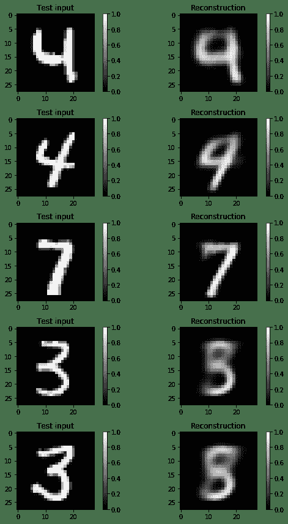

An example of MNIST reconstructed characters

9.  以下是使用经过训练的 VAE 生成的手写数字示例：

```py
nx = ny = 20
x_values = np.linspace(-3, 3, nx)
y_values = np.linspace(-3, 3, ny)
canvas = np.empty((28*ny, 28*nx))
for i, yi in enumerate(x_values):
  for j, xi in enumerate(y_values):
    z_mu = np.array([[xi, yi]]*vae.batch_size)
    x_mean = vae.generate(z_mu)
    canvas[(nx-i-1)*28:(nx-i)*28, j*28:(j+1)*28] = x_mean[0].reshape(28, 28)
plt.figure(figsize=(8, 10))
Xi, Yi = np.meshgrid(x_values, y_values)
plt.imshow(canvas, origin="upper", cmap="gray")
plt.tight_layout()

```

以下是自编码器生成的 MNIST 类字符的范围：

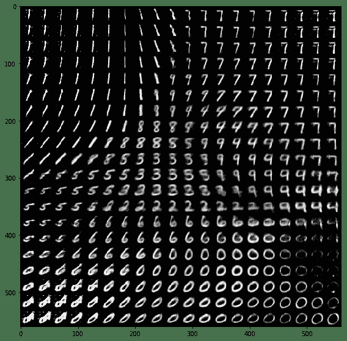

A range of MNIST like characters generated by autoencoders

# 这个怎么运作...

VAE 学会重建并同时生成新图像。 生成的图像取决于潜在空间。 生成的图像与训练的数据集具有相同的分布。

我们还可以通过在 VariationalAutoencoder 类中定义一个转换函数来查看潜在空间中的数据：

```py
def transform(self, X):
    """Transform data by mapping it into the latent space."""
    # Note: This maps to mean of distribution, we could alternatively sample from Gaussian distribution
    return self.sess.run(self.z_mean,   feed_dict={self.x: X})
```

使用转换函数的 MNIST 数据集的潜在表示如下：

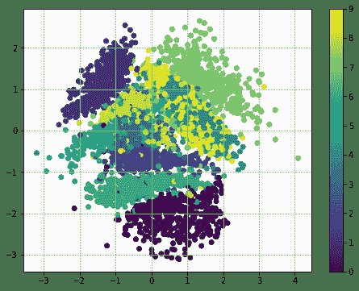

# 还有更多...

VAE 的生成图像取决于潜在空间尺寸。 模糊减少了潜在空间的尺寸，增加了。 分别针对 5 维，10 维和 20 维潜在维度的重构图像如下：

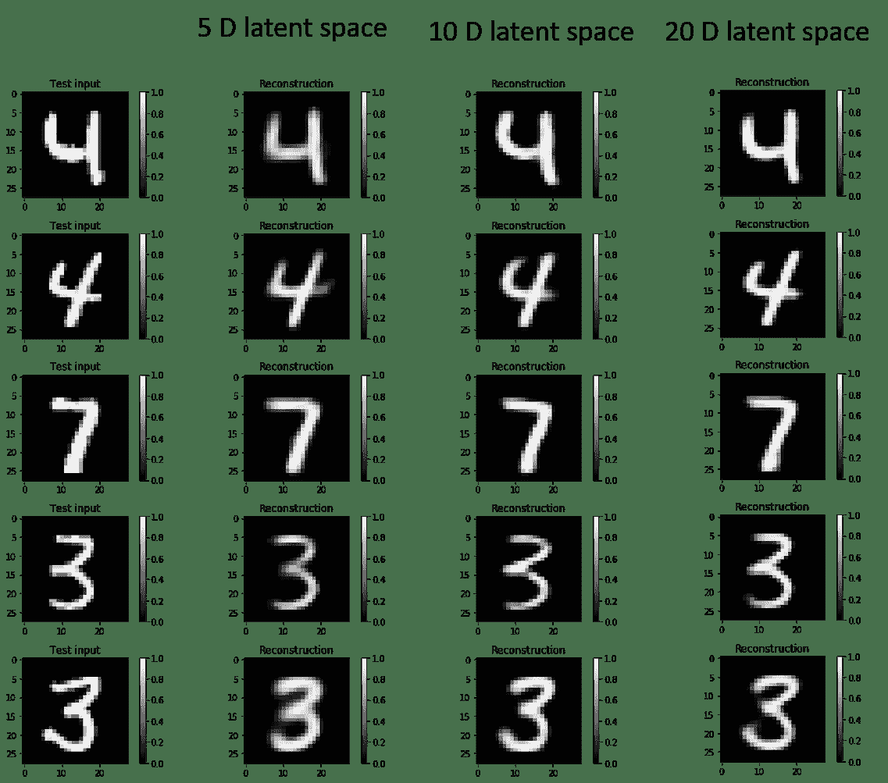

# 也可以看看...

[Kingma 和 Welling 的论文](https://arxiv.org/pdf/1312.6114.pdf)是该领域的开创性论文。 他们会经历完整的建筑思维过程以及优雅的数学运算。 对于对 VAE 感兴趣的任何人，必须阅读。

另一个有趣的读物是 Carl Doersch 的论文，[变分编码器教程](https://arxiv.org/pdf/1606.05908.pdf)。

[Github 链接包含 VAE 的另一种实现，以及来自 Kingma 和 Welling 论文的图像再现](https://github.com/hwalsuklee/tensorflow-mnist-VAE)。

# 通过 Capsule Networks 学习击败 MNIST 的最新结果

Capsule Networks（或 CapsNets）是一种非常新颖的深度学习网络。 这项技术是在 2017 年 10 月底由 Sara Sabour，Nicholas Frost 和 Geoffrey Hinton 发表的[名为“胶囊之间的动态路由”的开创性论文](https://arxiv.org/abs/1710.09829)中引入的。 欣顿（Hinton）是深度学习之父之一，因此，整个深度学习社区很高兴看到胶囊技术取得的进步。 确实，CapsNets 已经在 MNIST 分类中击败了最好的 CNN，这真是……令人印象深刻！

**那么 CNN 有什么问题？** 在 CNN 中，每一层*都会以渐进的粒度理解*图像。 正如我们在多种配方中讨论的那样，第一层将最有可能识别直线或简单的曲线和边缘，而随后的层将开始理解更复杂的形状（例如矩形）和复杂的形式（例如人脸）。

现在，用于 CNN 的一项关键操作是池化。 池化旨在创建位置不变性，通常在每个 CNN 层之后使用它来使任何问题在计算上易于处理。 但是，合并会带来一个严重的问题，因为它迫使我们丢失所有位置数据。 不是很好。 考虑一下脸：它由两只眼睛，一张嘴和一只鼻子组成，重要的是这些部分之间存在空间关系（嘴在鼻子下方，通常在眼睛下方）。 确实，欣顿说：

The pooling operation used in convolutional neural networks is a big mistake and the fact that it works so well is a disaster.

从技术上讲，我们不需要位置不变。 相反，我们需要等方差。 等方差是一个奇特的术语，表示我们想了解图像中的旋转或比例变化，并且我们要相应地调整网络。 这样，图像中不同成分的空间定位不会丢失。

**那么 Capsule Networks 有什么新功能？** 据作者说，我们的大脑有称为**胶囊**的模块，每个胶囊专门处理特定类型的信息。 尤其是，有些胶囊对于理解位置的概念，尺寸的概念，方向的概念，变形的概念，纹理等非常有用。 除此之外，这组作者还建议我们的大脑具有特别有效的机制，可以将每条信息动态路由到胶囊，这被认为最适合处理特定类型的信息。

因此，CNN 和 CapsNets 之间的主要区别在于，使用 CNN 时，您会不断添加用于创建深度网络的层，而使用 CapsNet 时，您会在另一个内部嵌套神经层。 胶囊是一组神经元，可在网络中引入更多结构。 它产生一个向量来表示图像中实体的存在。 尤其是，欣顿使用活动矢量的长度来表示实体存在的概率，并使用其方向来表示实例化参数。 当多个预测结果一致时，更高级别的胶囊就会生效。 对于每个可能的父母，胶囊产生一个额外的预测向量。

现在有了第二项创新：我们将使用跨胶囊的动态路由，并且不再使用池化的原始思想。 较低级别的容器倾向于将其输出发送到较高级别的容器，并且活动矢量的标量积很大，而预测来自较低级别的容器。 标量预测向量乘积最大的亲本会增加胶囊键。 所有其他父母都减少了联系。 换句话说，这种想法是，如果较高级别的胶囊同意较低级别的胶囊，则它将要求发送更多该类型的信息。 如果没有协议，它将要求发送更少的协议。 使用协定方法的这种动态路由优于当前的机制（例如最大池），并且根据 Hinton 的说法，路由最终是解析图像的一种方法。 实际上，Max-pooling 忽略了除最大值以外的任何东西，而动态路由根据较低层和较高层之间的协议选择性地传播信息。

第三个差异是引入了新的非线性激活函数。 CapsNet 并未像在 CNN 中那样向每个图层添加挤压功能，而是向嵌套的一组图层添加了挤压功能。 下图表示了非线性激活函数，它被称为挤压函数（方程式 1）：

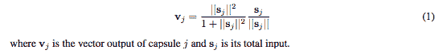

Squashing function as seen in Hinton's seminal paper

此外，Hinton 等人表明，经过判别训练的多层胶囊系统在 MNIST 上达到了最先进的性能，并且在识别高度重叠的数字方面比卷积网络要好得多。

论文*胶囊之间的动态路由*向我们展示了简单的 CapsNet 体系结构：


A simple CapsNet architecture

该体系结构很浅，只有两个卷积层和一个完全连接的层。 Conv1 具有 256 个 9×9 卷积核，步幅为 1，并具有 ReLU 激活函数。 该层的作用是将像素强度转换为局部特征检测器的活动，然后将其用作主胶囊的输入。 PrimaryCapsules 是具有 32 个通道的卷积胶囊层。 每个主胶囊包含 8 个卷积单元，其内核为 9×9，步幅为 2 *。* 总计，PrimaryCapsules 具有[32，6，6]胶囊输出（每个输出是 8D 矢量），并且[6，6]网格中的每个胶囊彼此共享重量。 最后一层（DigitCaps）每位数字类具有一个 16D 胶囊，这些胶囊中的每个胶囊都接收来自下一层中所有其他胶囊的输入。 路由仅发生在两个连续的胶囊层之间（例如 PrimaryCapsules 和 DigitCaps）。

# 做好准备

此食谱基于[这个页面](https://github.com/debarko/CapsNet-Tensorflow)上提供的代码，而该代码又基于[这个页面](https://github.com/naturomics/CapsNet-Tensorflow.git)。

# 怎么做...

这是我们如何进行配方的方法：

1.  在 Apache Licence 下从 github 克隆代码：

```py
git clone https://github.com/naturomics/CapsNet-Tensorflow.git
 $ cd CapsNet-Tensorflow
```

2.  下载 MNIST 并创建适当的结构：

```py
mkdir -p data/mnist
wget -c -P data/mnist \\
http://yann.lecun.com/exdb/mnist/{train-images-idx3-ubyte.gz,train-labels-idx1-ubyte.gz,t10k-images-idx3-ubyte.gz,t10k-labels-idx1-ubyte.gz}
gunzip data/mnist/*.gz
```

3.  开始训练过程：

```py
python main.py
```

4.  让我们看看用于定义胶囊的代码。 每个胶囊将 4D 张量作为输入并返回 4D 张量。 可以将胶囊定义为完全连接的网络（DigiCaps）或卷积网络（主胶囊）。 请注意，Primary 是 ConvNets 的集合，在它们之后应用了非线性压缩功能。 主胶囊将通过动态路由与 DigiCaps 通信：

```py
# capsLayer.py
#
import numpy as np
import tensorflow as tf
from config import cfg
epsilon = 1e-9
class CapsLayer(object):
''' Capsule layer.
Args:
input: A 4-D tensor.
num_outputs: the number of capsule in this layer.
vec_len: integer, the length of the output vector of a capsule.
layer_type: string, one of 'FC' or "CONV", the type of this layer,
fully connected or convolution, for the future expansion capability
with_routing: boolean, this capsule is routing with the
lower-level layer capsule.
Returns:
A 4-D tensor.
'''
def __init__(self, num_outputs, vec_len, with_routing=True, layer_type='FC'):
  self.num_outputs = num_outputs
  self.vec_len = vec_len
  self.with_routing = with_routing
  self.layer_type = layer_type

def __call__(self, input, kernel_size=None, stride=None):
'''
The parameters 'kernel_size' and 'stride' will be used while 'layer_type' equal 'CONV'
'''
  if self.layer_type == 'CONV':
    self.kernel_size = kernel_size
    self.stride = stride

    if not self.with_routing:
    # the PrimaryCaps layer, a convolutional layer
    # input: [batch_size, 20, 20, 256]
      assert input.get_shape() ==  [cfg.batch_size, 20, 20, 256]
      capsules = []
      for i in range(self.vec_len):
        # each capsule i: [batch_size, 6, 6, 32]
        with tf.variable_scope('ConvUnit_' + str(i)):
          caps_i = tf.contrib.layers.conv2d(input,      self.num_outputs,
self.kernel_size, self.stride,
padding="VALID")
          caps_i = tf.reshape(caps_i, shape=(cfg.batch_size, -1, 1, 1))
          capsules.append(caps_i)

      assert capsules[0].get_shape() == [cfg.batch_size, 1152, 1, 1]
# [batch_size, 1152, 8, 1]
      capsules = tf.concat(capsules, axis=2)
      capsules = squash(capsules)
      assert capsules.get_shape() == [cfg.batch_size, 1152, 8, 1]
      return(capsules)

  if self.layer_type == 'FC':
    if self.with_routing:
      # the DigitCaps layer, a fully connected layer
      # Reshape the input into [batch_size, 1152, 1, 8, 1]
      self.input = tf.reshape(input, shape=(cfg.batch_size, -1, 1, input.shape[-2].value, 1))
    with tf.variable_scope('routing'):
      # b_IJ: [1, num_caps_l, num_caps_l_plus_1, 1, 1]
      b_IJ = tf.constant(np.zeros([1, input.shape[1].value,    self.num_outputs, 1, 1], dtype=np.float32))
      capsules = routing(self.input, b_IJ)
      capsules = tf.squeeze(capsules, axis=1)
    return(capsules)
```

5.  论文*中介绍了路由算法。*胶囊之间的动态路由以及相关章节已得到说明，并定义了等式 2 和等式 3。该路由算法的目标是传递信息。 从较低层的胶囊到较高层的胶囊，*了解*哪里有共识。 通过简单地使用上层中每个胶囊 *j* 的当前输出 *v <sub>j</sub>* 的标量乘积和得出的预测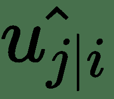，即可计算出一致性 通过*或*胶囊：

| 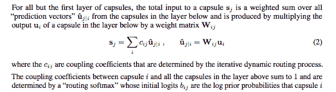 |
| 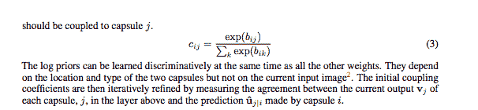 |
| 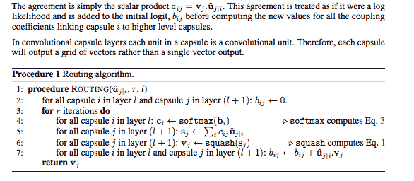 |

以下方法实现了前面图像中过程 1 中描述的步骤。 注意，输入是来自 l 层中 1,152 个胶囊的 4D 张量。 输出是形状为`[batch_size, 1, length(v_j)=16, 1]`的张量，表示层 l + 1 中胶囊 j 的向量输出 v_j：

```py
def routing(input, b_IJ):
''' The routing algorithm.
Args:
input: A Tensor with [batch_size, num_caps_l=1152, 1, length(u_i)=8, 1]
shape, num_caps_l meaning the number of capsule in the layer l.
Returns:
A Tensor of shape [batch_size, num_caps_l_plus_1, length(v_j)=16, 1]
representing the vector output `v_j` in the layer l+1
Notes:
u_i represents the vector output of capsule i in the layer l, and
v_j the vector output of capsule j in the layer l+1.
'''
  # W: [num_caps_j, num_caps_i, len_u_i, len_v_j]
  W = tf.get_variable('Weight', shape=(1, 1152, 10, 8, 16), dtype=tf.float32,
  initializer=tf.random_normal_initializer(stddev=cfg.stddev))
  # Eq.2, calc u_hat
  # do tiling for input and W before matmul
  # input => [batch_size, 1152, 10, 8, 1]
  # W => [batch_size, 1152, 10, 8, 16]
  input = tf.tile(input, [1, 1, 10, 1, 1])
  W = tf.tile(W, [cfg.batch_size, 1, 1, 1, 1])
  assert input.get_shape() == [cfg.batch_size, 1152, 10, 8, 1]

  # in last 2 dims:
  # [8, 16].T x [8, 1] => [16, 1] => [batch_size, 1152, 10, 16, 1]
  u_hat = tf.matmul(W, input, transpose_a=True)
  assert u_hat.get_shape() == [cfg.batch_size, 1152, 10, 16, 1]

  # line 3,for r iterations do
  for r_iter in range(cfg.iter_routing):
    with tf.variable_scope('iter_' + str(r_iter)):
      # line 4:
      # => [1, 1152, 10, 1, 1]
      c_IJ = tf.nn.softmax(b_IJ, dim=2)
      c_IJ = tf.tile(c_IJ, [cfg.batch_size, 1, 1, 1, 1])
      assert c_IJ.get_shape() == [cfg.batch_size, 1152, 10, 1, 1]
      # line 5:
      # weighting u_hat with c_IJ, element-wise in the last two dims
      # => [batch_size, 1152, 10, 16, 1]
      s_J = tf.multiply(c_IJ, u_hat)
      # then sum in the second dim, resulting in [batch_size, 1, 10, 16, 1]
      s_J = tf.reduce_sum(s_J, axis=1, keep_dims=True)
      assert s_J.get_shape() == [cfg.batch_size, 1, 10, 16, 16
      # line 6:
      # squash using Eq.1,
      v_J = squash(s_J)
      assert v_J.get_shape() == [cfg.batch_size, 1, 10, 16, 1]
      # line 7:
      # reshape & tile v_j from [batch_size ,1, 10, 16, 1] to [batch_size, 10, 1152, 16, 1]
      # then matmul in the last tow dim: [16, 1].T x [16, 1] => [1, 1], reduce mean in the
      # batch_size dim, resulting in [1, 1152, 10, 1, 1]
      v_J_tiled = tf.tile(v_J, [1, 1152, 1, 1, 1])
      u_produce_v = tf.matmul(u_hat, v_J_tiled, transpose_a=True)
      assert u_produce_v.get_shape() == [cfg.batch_size, 1152, 10, 1, 1]
      b_IJ += tf.reduce_sum(u_produce_v, axis=0, keep_dims=True)
  return(v_J)
```

6.  现在让我们回顾一下非线性激活压缩函数。 输入是具有`[batch_size, num_caps, vec_len, 1]`形状的 4D 向量，输出是具有与向量相同形状但被压缩在第三维和第四维中的 4-D 张量。 给定一个矢量输入，目标是计算公式 1 中表示的值，如下所示：


```py
def squash(vector):
'''Squashing function corresponding to Eq. 1
Args:
vector: A 5-D tensor with shape [batch_size, 1, num_caps, vec_len, 1],
Returns:
A 5-D tensor with the same shape as vector but squashed in 4rd and 5th dimensions.
'''
  vec_squared_norm = tf.reduce_sum(tf.square(vector), -2, keep_dims=True)
  scalar_factor = vec_squared_norm / (1 + vec_squared_norm) / tf.sqrt(vec_squared_norm + epsilon)
  vec_squashed = scalar_factor * vector # element-wise
return(vec_squashed)
```

7.  在前面的步骤中，我们定义了什么是胶囊，胶囊之间的动态路由算法，以及非线性压缩函数。 现在我们可以定义适当的 CapsNet。 构建损失函数以进行训练，并选择了 Adam Optimizer。 方法`build_arch(...)`定义了 CapsNet，如下图所示：

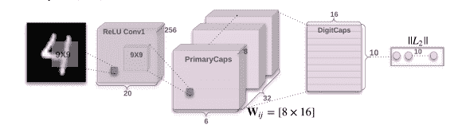

请注意，本文将重构技术描述为一种正则化方法。 从本文：

We use an additional reconstruction loss to encourage the digit capsules to encode the instantiation parameters of the input digit. During training, we mask out all but the activity vector of the correct digit capsule.

然后，我们使用此活动向量进行重构。

数字胶囊的输出被馈送到解码器，该解码器由三个完全连接的层组成，这些层对像素强度进行建模，如图 2 所示。我们将逻辑单元的输出与像素强度之间的平方差之和最小化。 我们将这种重建损失降低了 0.0005，以使其在训练过程中不会控制保证金损失。 如下实现的方法`build_arch(..)`也用于创建解码器：

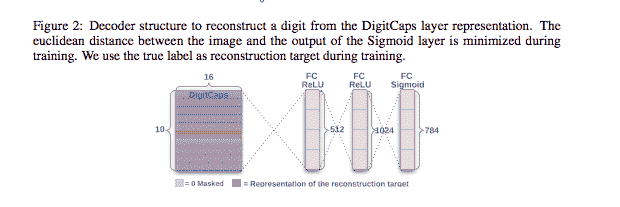

```py
#capsNet.py
#
import tensorflow as tf
from config import cfg
from utils import get_batch_data
from capsLayer import CapsLayer
epsilon = 1e-9

class CapsNet(object):
  def __init__(self, is_training=True):
    self.graph = tf.Graph()
    with self.graph.as_default():
      if is_training:
        self.X, self.labels = get_batch_data()
        self.Y = tf.one_hot(self.labels, depth=10, axis=1, dtype=tf.float32)
        self.build_arch()
        self.loss()
        self._summary()

        # t_vars = tf.trainable_variables()
        self.global_step = tf.Variable(0, name='global_step', trainable=False)
        self.optimizer = tf.train.AdamOptimizer()
        self.train_op =    self.optimizer.minimize(self.total_loss, global_step=self.global_step) # var_list=t_vars)

      elif cfg.mask_with_y:
        self.X = tf.placeholder(tf.float32,
          shape=(cfg.batch_size, 28, 28, 1))
        self.Y = tf.placeholder(tf.float32, shape=(cfg.batch_size, 10, 1))
        self.build_arch()
      else:
        self.X = tf.placeholder(tf.float32,
        shape=(cfg.batch_size, 28, 28, 1))
        self.build_arch()
      tf.logging.info('Setting up the main structure')

def build_arch(self):

  with tf.variable_scope('Conv1_layer'):
    # Conv1, [batch_size, 20, 20, 256]
    conv1 = tf.contrib.layers.conv2d(self.X, num_outputs=256,
       kernel_size=9, stride=1, 
       padding='VALID')
    assert conv1.get_shape() == [cfg.batch_size, 20, 20, 256]# Primary Capsules layer, return [batch_size, 1152, 8, 1]

  with tf.variable_scope('PrimaryCaps_layer'):
    primaryCaps = CapsLayer(num_outputs=32, vec_len=8,   with_routing=False, layer_type='CONV')
    caps1 = primaryCaps(conv1, kernel_size=9, stride=2)
    assert caps1.get_shape() == [cfg.batch_size, 1152, 8, 1]

  # DigitCaps layer, return [batch_size, 10, 16, 1]
  with tf.variable_scope('DigitCaps_layer'):
    digitCaps = CapsLayer(num_outputs=10, vec_len=16,   with_routing=True, layer_type='FC')
    self.caps2 = digitCaps(caps1)

  # Decoder structure in Fig. 2
  # 1\. Do masking, how:
  with tf.variable_scope('Masking'):
    # a). calc ||v_c||, then do softmax(||v_c||)
    # [batch_size, 10, 16, 1] => [batch_size, 10, 1, 1]
    self.v_length = tf.sqrt(tf.reduce_sum(tf.square(self.caps2),
axis=2, keep_dims=True) + epsilon)
    self.softmax_v = tf.nn.softmax(self.v_length, dim=1)
    assert self.softmax_v.get_shape() == [cfg.batch_size, 10, 1, 1]
    # b). pick out the index of max softmax val of the 10 caps
    # [batch_size, 10, 1, 1] => [batch_size] (index)
    self.argmax_idx = tf.to_int32(tf.argmax(self.softmax_v, axis=1))
    assert self.argmax_idx.get_shape() == [cfg.batch_size, 1, 1]
    self.argmax_idx = tf.reshape(self.argmax_idx, shape=(cfg.batch_size, )) .  
    # Method 1.
   if not cfg.mask_with_y:
     # c). indexing
     # It's not easy to understand the indexing process with  argmax_idx
     # as we are 3-dim animal
     masked_v = []
     for batch_size in range(cfg.batch_size):
       v = self.caps2[batch_size][self.argmax_idx[batch_size], :]
       masked_v.append(tf.reshape(v, shape=(1, 1, 16, 1)))
       self.masked_v = tf.concat(masked_v, axis=0)
       assert self.masked_v.get_shape() == [cfg.batch_size, 1, 16, 1]

   # Method 2\. masking with true label, default mode
   else:
     self.masked_v = tf.matmul(tf.squeeze(self.caps2), tf.reshape(self.Y, (-1, 10, 1)), transpose_a=True)
     self.v_length = tf.sqrt(tf.reduce_sum(tf.square(self.caps2), axis=2, keep_dims=True) + epsilon)

  # 2\. Reconstruct the MNIST images with 3 FC layers
  # [batch_size, 1, 16, 1] => [batch_size, 16] => [batch_size, 512] 
  with tf.variable_scope('Decoder'):
    vector_j = tf.reshape(self.masked_v, shape=(cfg.batch_size, -1))
    fc1 = tf.contrib.layers.fully_connected(vector_j, num_outputs=512)
    assert fc1.get_shape() == [cfg.batch_size, 512]
    fc2 = tf.contrib.layers.fully_connected(fc1, num_outputs=1024)
    assert fc2.get_shape() == [cfg.batch_size, 1024]
    self.decoded = tf.contrib.layers.fully_connected(fc2, num_outputs=784, activation_fn=tf.sigmoid)
```

8.  本文中定义的另一个重要部分是保证金损失函数。 这在下面的论文（等式 4）的摘录引用中进行了说明，并在 loss（..）方法中实现，该方法包括三个损失，即边际损失，重建损失和总损失：

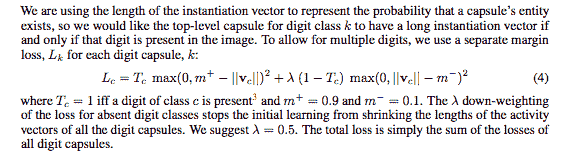

```py
def loss(self):
  # 1\. The margin loss
  # [batch_size, 10, 1, 1]
  # max_l = max(0, m_plus-||v_c||)^2
  max_l = tf.square(tf.maximum(0., cfg.m_plus - self.v_length))
  # max_r = max(0, ||v_c||-m_minus)^2
  max_r = tf.square(tf.maximum(0., self.v_length - cfg.m_minus))
  assert max_l.get_shape() == [cfg.batch_size, 10, 1, 1]

  # reshape: [batch_size, 10, 1, 1] => [batch_size, 10]
  max_l = tf.reshape(max_l, shape=(cfg.batch_size, -1))
  max_r = tf.reshape(max_r, shape=(cfg.batch_size, -1))
  # calc T_c: [batch_size, 10]
  T_c = self.Y
  # [batch_size, 10], element-wise multiply
  L_c = T_c * max_l + cfg.lambda_val * (1 - T_c) * max_r

  self.margin_loss = tf.reduce_mean(tf.reduce_sum(L_c, axis=1))

  # 2\. The reconstruction loss
  orgin = tf.reshape(self.X, shape=(cfg.batch_size, -1))
  squared = tf.square(self.decoded - orgin)
  self.reconstruction_err = tf.reduce_mean(squared)

  # 3\. Total loss
  # The paper uses sum of squared error as reconstruction   error, but we
  # have used reduce_mean in `# 2 The reconstruction loss` to calculate
  # mean squared error. In order to keep in line with the paper,the
  # regularization scale should be 0.0005*784=0.392
  self.total_loss = self.margin_loss + cfg.regularization_scale * self.reconstruction_err
```

9.  另外，定义`a _summary(...)`方法来报告损失和准确性可能会很方便：

```py
#Summary
def _summary(self):
  train_summary = []
  train_summary.append(tf.summary.scalar('train/margin_loss', self.margin_loss))train_summary.append(tf.summary.scalar('train/reconstruction_loss', self.reconstruction_err))
  train_summary.append(tf.summary.scalar('train/total_loss', self.total_loss))
  recon_img = tf.reshape(self.decoded, shape=(cfg.batch_size, 28, 28, 1))
  train_summary.append(tf.summary.image('reconstruction_img', recon_img))
  correct_prediction = tf.equal(tf.to_int32(self.labels), self.argmax_idx)
  self.batch_accuracy = tf.reduce_sum(tf.cast(correct_prediction, tf.float32))
  self.test_acc = tf.placeholder_with_default(tf.constant(0.), shape=[])
  test_summary = []
  test_summary.append(tf.summary.scalar('test/accuracy', self.test_acc))
  self.train_summary = tf.summary.merge(train_summary)
  self.test_summary = tf.summary.merge(test_summary)
```

# 这个怎么运作...

CapsNet 与最先进的深度学习网络有很大的不同。 CapsNet 并没有添加更多的层并使网络更深，而是使用了浅层网络，其中，胶囊层嵌套在其他层内。 每个胶囊专门用于检测图像中的特定实体，并且使用动态路由机制将检测到的实体发送给父层。 使用 CNN，您必须从许多不同角度考虑成千上万张图像，以便从不同角度识别物体。 Hinton 认为，这些层中的冗余将使胶囊网络能够从多个角度和在不同情况下以 CNN 通常使用的较少数据识别对象。 让我们检查一下 tensorboad 所示的网络：

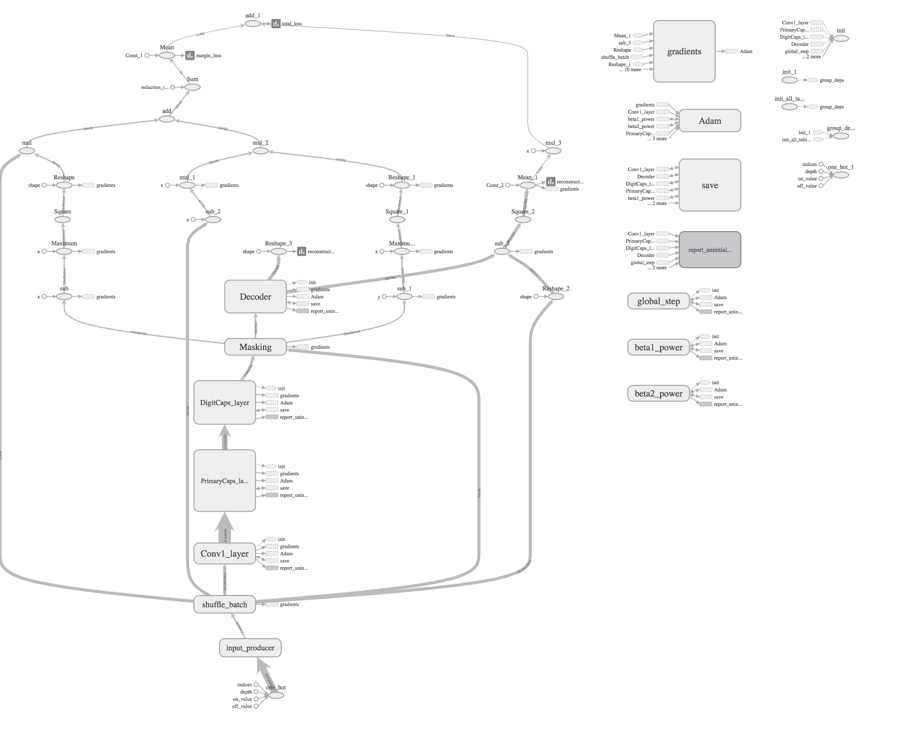

An example of CapsNet as defined in the code and shown by tensorboard

如下图所示，其结果令人印象深刻。 CapsNet 在以前仅在更深层的网络中才能实现的三层网络上具有较低的测试错误（0.25％）。 基线是具有 256,256-128 个通道的三个卷积层的标准 CNN。 每个都有 5 x 5 个内核，步幅为 1。最后一个卷积层后面是两个大小为 328,192 的完全连接的层。 最后一个完全连接的层通过压降连接到具有交叉熵损失的 10 类 softmax 层：

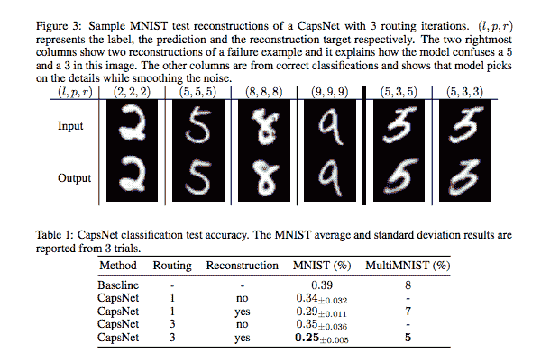

让我们检查保证金损失，重建损失和总损失的减少：

| 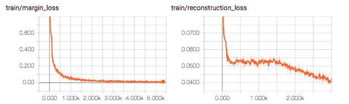 |
| 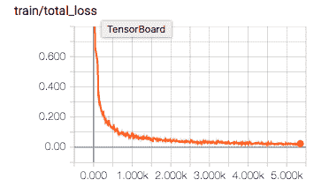 |

我们还要检查准确性的提高； 经过 500 次迭代，它在 3500 次迭代中分别达到 92％和 98.46％：

| > 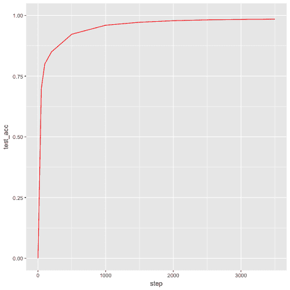 | 

&#124; **迭代** &#124; **精度** &#124;
&#124; 500 &#124; 0.922776442308 &#124;
&#124; 1000 &#124; 0.959735576923 &#124;
&#124; 1500 &#124; 0.971955128205 &#124;
&#124; 2000 &#124; 0.978365384615 &#124;
&#124; 2500 &#124; 0.981770833333 &#124;
&#124; 3000 &#124; 0.983473557692 &#124;
&#124; 3500 &#124; 0.984675480769 &#124;

 |

Examples of increase in accuracy for CapsNet

# 还有更多...

CapsNets 在 MNIST 上可以很好地工作，但是在理解是否可以在其他数据集（例如 CIFAR）或更通用的图像集合上获得相同的令人印象深刻的结果方面，还有很多研究工作要做。 如果您有兴趣了解更多信息，请查看以下内容：

[Google 的 AI 向导在神经网络上带来了新的变化](https://www.wired.com/story/googles-ai-wizard-unveils-a-new-twist-on-neural-networks/)

[Google 研究人员可以替代传统神经网络](https://www.technologyreview.com/the-download/609297/google-researchers-have-a-new-alternative-to-traditional-neural-networks/)

Keras-CapsNet 是可在[这个页面](https://github.com/XifengGuo/CapsNet-Keras)上使用的 Keras 实现。

[杰弗里·欣顿（Geoffrey Hinton）讨论了卷积神经网络的问题](https://www.youtube.com/watch?v=rTawFwUvnLE&feature=youtu.be)