# 十三、AutoML 和学习如何学习（元学习）

深度学习的成功极大地促进了特征工程的工作。 确实，传统的机器学习很大程度上取决于对正确的特征集的选择，而且与选择特定的学习算法相比，这一步骤通常更为重要。 深度学习改变了这种情况。 创建正确的模型仍然非常重要，但是现今的网络对特定特征集的选择已不那么敏感，并且能够自动选择真正重要的特征。

取而代之的是，深度学习的引入使人们更加关注正确的神经网络架构的选择。 这意味着研究人员的兴趣正逐渐从特征工程转向网络工程。 **AutoML**（**元学习**）是一个新兴的研究主题，旨在针对给定的学习任务自动选择最有效的神经网络。 换句话说，AutoML 代表*学习如何有效学习*的一组方法。 考虑例如机器翻译，图像识别或游戏的任务。 通常，模型是由工程师，数据科学家和领域专家组成的团队手动设计的。 如果您认为一个典型的 10 层网络可以具有约`10^10`个候选网络，那么您就会知道该过程可能很昂贵，容易出错并且最终不是最佳选择。

# 使用递归网络和强化学习的元学习

解决此问题的关键思想是拥有一个控制器网络，该控制器网络会在给定特定网络输入的情况下，以概率`p`提出*子*模型架构。 对子项进行训练和评估，以解决要解决的特定任务（例如，子项获得的准确度`R`）。 该评估`R`被传递回控制器，该控制器进而使用`R`来改善下一个候选架构。 在此框架下，可以将候选子项到控制器的反馈建模为计算`p`的梯度的任务，然后通过`R`缩放此梯度。 控制器可以实现为循环神经网络（请参见下图）。 这样做，控制器将倾向于在迭代之后获得更好的`R`的架构候选区域，并倾向于给得分不那么高的候选区域分配较低的概率。

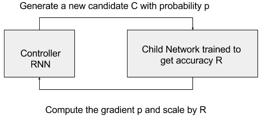

例如，控制器循环神经网络可以对卷积网络进行采样。 控制器可以预测许多超参数，例如过滤器高度，过滤器宽度，步幅高度，步幅宽度和一层过滤器的数量，然后可以重复。 每个预测可以由 softmax 分类器执行，然后输入到下一个 RNN 时间步中。 以下图片来自[《使用增强学习的神经架构搜索》](https://arxiv.org/abs/1611.01578)（Barret Zoph，Quoc V. Le）：

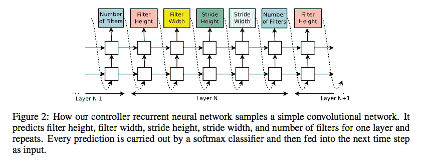

预测超参数是不够的，因为最好定义一组动作以在网络中创建新层。 这特别困难，因为描述新层的奖励函数极有可能是不可区分的，因此无法通过标准技术（例如 SGD）对其进行优化。 解决方案来自强化学习，它包括采用类似于我们的第 9 章，“强化学习”中所述的策略梯度网络。

除此之外，并行性可用于优化控制器 RNN 的参数。 Quoc Le＆Barret Zoph 建议采用参数服务器方案，其中我们有一个 S 碎片的参数服务器，用于存储 K 个控制器副本的共享参数。 每个控制器副本都采样了如下图所示的并行训练的不同子架构，如下图所示，取自[《使用增强学习的神经架构搜索》](https://arxiv.org/abs/1611.01578)（Barret Zoph，Quoc V. Le）：

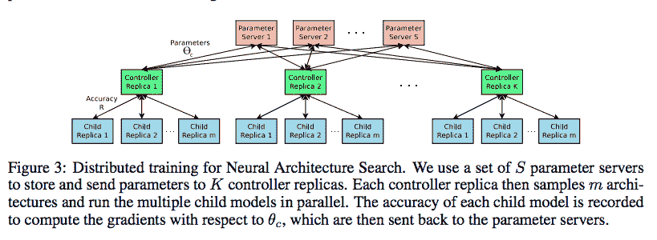

Quoc 和 Barret 将 AutoML 技术用于神经架构搜索应用于 [Penn Treebank 数据集](https://en.wikipedia.org/wiki/Treebank)，这是语言建模的著名基准。 他们的结果改进了目前被认为是最先进的手动设计网络。 特别是，他们在 Penn Treebank 上实现了 62.4 的测试集困惑，这比以前的最新模型好 3.6 困惑。 同样，在 [CIFAR-10 数据集](https://www.cs.toronto.edu/~kriz/cifar.html)上，该方法可以设计一种新颖的网络架构，与测试集准确性方面最好的人类发明架构旗鼓相当。 提出的 CIFAR-10 模型实现了 3.65 的测试错误率，比使用类似架构方案的最新技术模型好 0.09%，并且快 1.05 倍。

# 元学习块

在[《用于可伸缩图像识别的学习可传输架构》](https://arxiv.org/abs/1707.07012)（Barret Zoph，Vijay Vasudevan，Jonathon Shlens，Quoc V. Le，2017）中，建议在小型数据集上学习架构构造块，然后将其传输到大型数据集。 作者建议在 CIFAR-10 数据集上搜索最佳的卷积层（或单元），然后通过堆叠该单元的更多副本（每个都有其自己的参数），将此学习到的单元应用于 ImageNet 数据集。 准确地说，所有卷积网络都是由结构相同但权重不同的卷积层（或单元）组成的。 因此，将搜索最佳卷积架构简化为搜索最佳单元结构，这样可以更快地将其推广到其他问题。 尽管无法在 ImageNet 上直接学习该单元，但是在已发表的工作中，由学得最好的单元构成的架构可实现 ImageNet 的最新精度为 82.7% top-1 和 96.2% top-5。 该模型的 top-1 准确性比人类发明的最佳架构高 1.2%，而 FLOPS 则减少了 90 亿个，与之前的最新模型相比降低了 28%。 还需要注意的重要一点是，使用 RNN + RL（循环神经网络+强化学习）学习的模型正在击败随机搜索（RL）代表的基线，如本文中所取的图所示。 在 RL 与 RS 中确定的前 5 名和前 25 名模型的平均表现中，RL 始终是赢家：

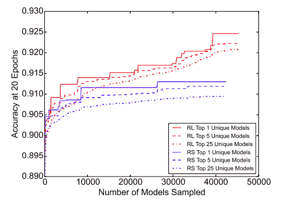

# 新任务的元学习

可以对元学习系统进行训练以完成大量任务，然后对其元学习新任务的能力进行测试。 这种元学习的一个著名例子是在高级 CNN 章节中讨论的所谓迁移学习，其中网络可以从相对较小的数据集中成功学习基于图像的新任务。 但是，对于诸如语音，语言和文本之类的非视觉领域，没有类似的预训练方案。

[《用于快速适应深度网络的模型不可知元学习》](https://arxiv.org/abs/1703.03400)（切尔西·芬恩（Chelsea Finn），彼得·阿比尔（Siety Levine），2017 年）提出了一个模型 -不可知论方法的名称为 MAML，它与经过梯度下降训练的任何模型兼容，并且适用于各种不同的学习问题，包括分类，回归和强化学习。 元学习的目标是针对各种学习任务训练模型，以便仅使用少量训练样本即可解决新的学习任务。 元学习器旨在找到一种可以快速（以很少的步骤）并有效地（仅使用几个示例）快速适应各种问题的初始化。 用参数为θ的参数化函数`f[0]`表示的模型。 当适应新任务`T[i]`时，模型参数`θ`变为`θ[i']`。 在 MAML 中，使用对任务`T[i]`的一个或多个梯度下降更新来计算更新的参数向量`θ[i']`。

例如，当使用一个梯度更新时，`θ[i'] = θ - α∇[0]L[Ti](f[θ])`，其中`L[Ti]`是任务`T`的损失函数，而`α`是元学习参数。 该图报告了 MAML 算法：

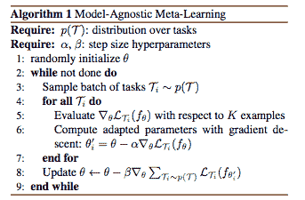

MAML 能够在流行的少拍图像分类基准上大大胜过许多现有方法。 旨在从一个或几个概念中学习新概念的镜头很少有挑战性。 例如，[《通过概率性程序归纳进行人级概念学习》](https://www.cs.cmu.edu/~rsalakhu/papers/LakeEtAl2015Science.pdf)（Brenden M. Lake，Ruslan Salakhutdinov，Joshua B. Tenenbaum，2015 年），建议人们可以学会从单个图片中识别新颖的两轮车，例如红色框中包含的图片，如下所示：

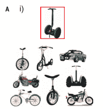

在 2017 年底，AutoML（或元学习）主题是一个活跃的研究主题，旨在针对给定的学习任务自动选择最高效的神经网络。 目标是学习如何高效，自动地设计网络，从而可以学习特定任务或适应新任务。 主要问题是不能简单地用可微分的损失函数描述网络的设计，因此传统的优化技术不能简单地用于元学习。 因此，已经提出了一些解决方案，包括具有控制器递归网络（RNN）和基于强化学习的奖励策略的思想，以及具有与模型无关的元学习的思想。 两种方法都非常有前途，但是肯定还有很多研究空间。

因此，如果您对一个热门话题感兴趣，那么*学习深度学习*当然是一个可以考虑作为下一份工作的空间。

*   Google 提出了[采用 RNN 作为控制器的方法](https://research.googleblog.com/2017/05/using-machine-learning-to-explore.html)，该方法使用机器学习来探索神经网络架构。
*   [《带有增强学习的神经架构搜索》](https://arxiv.org/abs/1611.01578)（Barret Zoph，Quoc V. Le）是一篇开创性的论文，它证明了有关 Google 方法的更多细节。 但是，RNN 不是唯一的选择。
*   [《图像分类器的大规模发展》](https://arxiv.org/abs/1703.01041)（Esteban Real，Sherry Moore，Andrew Selle，Saurabh Saxena，Yutaka Leon Suematsu，Jie Tan，Quoc Le，Alex Kurakin，2017 年）提出在进化遗传算法中使用遗传计算来探索新的候选网络。
*   [《学习用于可伸缩图像识别的可转移架构》](https://arxiv.org/abs/1707.07012)（Barret Zoph，Vijay Vasudevan，Jonathon Shlens，Quoc V. Le）提出了在 CIFAR 上学习的单元，用于改善 ImageNet 分类。
*   [《构建可以建立人工智能的 AI》](https://www.nytimes.com/2017/11/05/technology/machine-learning-artificial-intelligence-ai.html)：谷歌和其他公司为争夺一小部分研究人员而奋斗，他们正在寻找自动方法来应对人工智能专家的短缺。
*   [《用于快速适应深度网络的模型不可知元学习》](https://arxiv.org/abs/1703.03400)（切尔西·芬恩（Chelsea Finn），彼得·阿比耶尔（Pieter Abbeel），谢尔盖·莱文（Sergey Levine），2017 年）。
*   [《通过梯度下降学习》](https://arxiv.org/abs/1606.04474)（Marcin Andrychowicz，Misha Denil，Sergio Gomez，Matthew W. Hoffman，David Pfau，Tom Schaul，Brendan Shillingford，Nando de Freitas）展示了如何将优化算法的设计转换为学习问题，从而使该算法能够自动学习感兴趣的问题中的结构。 LSMT 学习的算法在训练任务上胜过手工设计的竞争对手，并且可以很好地推广到结构相似的新任务。 该算法的代码可在 [GitHub](https://github.com/deepmind/learning-to-learn) 上获得。

# 连体网络

连体网络是 Yann LeCun 及其同事在 NIPS 1994 中提出的[一种特殊类型的神经网络](http://www.worldscientific.com/doi/pdf/10.1142/S0218001493000339)。 它们背后的基本思想是，像“连体双胞胎”一样，该网络由两个不同的神经网络组成，它们共享相同的架构和权重。

在这里，您可以看到连体架构：

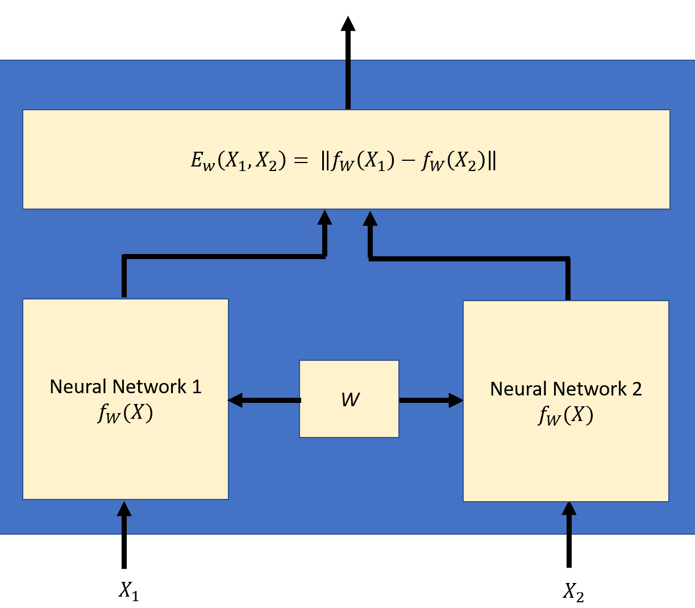

在训练阶段，该对网络会显示一个训练对`(X[1], X[2])`，其中两个输入不同但相似，例如， `X[1] = 他很聪明`，而`X[2] = 他是一个聪明人`。 这两个神经网络将产生两个不同的结果。 可以将组合网络视为测量训练对`(X[1], X[2])`之间相似度的标量**能量函数** ， 定义为：

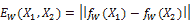

连体网络的目标是训练对`(X[1], X[2])`之间的能量应小于其他赝品对之间的能量`(X[1], X'[2])`。

这可以通过使用**对比损失函数**进行训练来实现。

在训练阶段，网络被输入一个训练对和一个与之相关的标签，告诉它是一个真正的对或赝品对的网络：`(X[1], X[2], Y[i])`第`i`个训练样本。 对比损失函数计算如下：

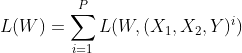

其中，

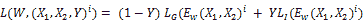

和`L[G]`是真正对的部分损失， `L[I]`是赝品的部分损失对和`P`训练样本数。 当偶对是正品时，标签`Y`的值为 0；当偶对是赝品时，标签`Y`的值为 1。 设计局部损失`L[G]`和`L[I]`的方式应使对比损耗`L(W)`将减少真正对的能量并增加赝品的能量。 这是通过选择部分损失`L(G)`单调增加而选择部分损失`L(I)`单调减少`f`来实现的。 一种可能的选择是使用余弦相似度来计算部分损耗。

使用反向传播算法调整权重。

# 连体网络的应用

近年来，连体网络已用于许多应用。 他们在 LeCun 论文中首次使用的是签名验证。 从那时起，出现了许多应用，我们将介绍一些最近的应用：

*   [与连体网络进行说话人和语音相似性的联合学习](https://pdfs.semanticscholar.org/4ffe/3394628a8a0ffd4cba1a77ea85e197bd4c22.pdf)：他们训练了一个多输出连体网络，其中一个输出用于语音相似性，其他用于演讲者相似性。 他们将工作扩展到三体网络。
*   [用于对象跟踪的全卷积连体网络](https://link.springer.com/chapter/10.1007/978-3-319-48881-3_56)：他们使用在 ILSVRC15 数据集上训练的卷积连体网络进行视频中的目标检测。
*   我们站在一起：[连体网络进行类似问题的检索](http://www.aclweb.org/anthology/P16-1036)：本文使用连体网络来查找当前问题和已归档问题之间的语义相似性 。 他们还使用了卷积连体网络。

除此之外，还对连体网络进行了[脸部验证/识别](https://github.com/harveyslash/Facial-Similarity-with-Siamese-Networks-in-Pytorch)。 [它们已用于问题解答](https://arxiv.org/pdf/1512.05193v2.pdf)。

# 一个有效的例子 -- MNIST

工作示例基于 [Github 页面](https://github.com/ywpkwon/siamese_tf_mnist)。 此处的代码使用连体网络将手写的 MNIST 数字嵌入到 2D 空间中，属于同一类的数字被嵌入在一起。 该代码包含三个主要文件：

+   `run.py`：它包含执行训练的基本包装。 它使用“梯度下降”算法将对比度损失降至最低。

+   `inference.py`：包含定义 3 层全连接网络的连体类。 代码中两个网络的输出之间的相似性是欧几里得。 然后，使用部分生成损失和部分赝品损失来计算对比损失。

+   `visualize.py`：这只是用于可视化结果的包装。

经过前 100,000 个训练步骤，结果是：

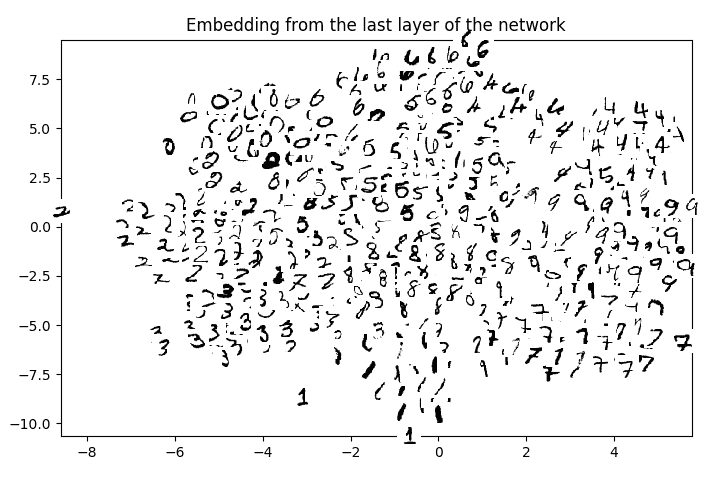

您可以看到相同（标记）的数字一起嵌入 2D 空间。

还有另一个有趣的示例](https://github.com/dhwajraj/deep-siamese-text-similarity) 。

在这里，使用 Tensorflow，训练了深层的连体 LSTM 网络以使用字符嵌入来捕获短语/句子相似性。