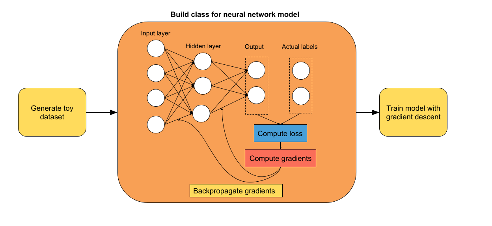
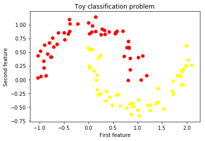
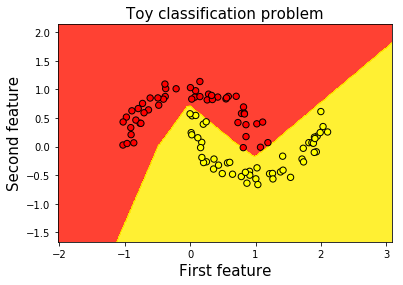

# 一、如何使用 TensorFlow Eager 构建简单的神经网络

大家好！ 在本教程中，我们将使用 TensorFlow 的命令模式构建一个简单的前馈神经网络。 希望你会发现它很有用！ 如果你对如何改进代码有任何建议，请告诉我。

教程步骤：



使用的版本：TensorFlow 1.7

## 第一步：导入有用的库并启用 Eager 模式

```py
# 导入 TensorFlow 和 TensorFlow Eager
import tensorflow as tf
import tensorflow.contrib.eager as tfe

# 导入函数来生成玩具分类问题
from sklearn.datasets import make_moons
import numpy as np

# 导入绘图库
import matplotlib.pyplot as plt
%matplotlib inline

# 开启 Eager 模式。一旦开启不能撤销！只执行一次。
tfe.enable_eager_execution()
```

## 第二步：为二分类生成玩具数据集

我们将生成一个玩具数据集，来训练我们的网络。 我从`sklearn`中选择了`make_moons`函数。 我相信它对我们的任务来说是完美的，因为类不是线性可分的，因此神经网络将非常有用。

```py
# 为分类生成玩具数据集
# X 是 n_samples x n_features 的矩阵，表示输入特征
# y 是 长度为 n_samples 的向量，表示我们的标签
X, y = make_moons(n_samples=100, noise=0.1, random_state=2018)
```

## 第三步：展示生成的数据集

```py
plt.scatter(X[:,0], X[:,1], c=y, cmap=plt.cm.autumn)
plt.xlabel('First feature')
plt.ylabel('Second feature')
plt.title('Toy classification problem')
plt.show()
```



## 第四步：构建单隐层神经网络（线性 -> ReLU -> 线性输出）

我们的第一个试验是一个简单的神经网络，只有一个隐层。 使用 TensorFlow Eager 构建神经网络模型的最简单方法是使用类。 在初始化期间，你可以定义执行模型正向传播所需的层。

由于这是一个分类问题，我们将使用`softmax`交叉熵损失。 通常，我们必须对标签进行单热编码。 为避免这种情况，我们将使用稀疏`softmax`损失，它以原始标签作为输入。 无需进一步处理！

```py
class simple_nn(tf.keras.Model):
    def __init__(self):
        super(simple_nn, self).__init__()
        """ 在这里定义正向传播期间
            使用的神经网络层
        """   
        # 隐层
        self.dense_layer = tf.layers.Dense(10, activation=tf.nn.relu)
        # 输出层，无激活函数
        self.output_layer = tf.layers.Dense(2, activation=None)
    
    def predict(self, input_data):
        """ 在神经网络上执行正向传播
            Args:
                input_data: 2D tensor of shape (n_samples, n_features).   
            Returns:
                logits: unnormalized predictions.
        """
        hidden_activations = self.dense_layer(input_data)
        logits = self.output_layer(hidden_activations)
        return logits
    
    def loss_fn(self, input_data, target):
        """ 定义训练期间使用的损失函数
        """
        logits = self.predict(input_data)
        loss = tf.losses.sparse_softmax_cross_entropy(labels=target, logits=logits)
        return loss
    
    def grads_fn(self, input_data, target):
        """ 在每个正向步骤中，
            动态计算损失值对模型参数的梯度
        """
        with tfe.GradientTape() as tape:
            loss = self.loss_fn(input_data, target)
        return tape.gradient(loss, self.variables)
    
    def fit(self, input_data, target, optimizer, num_epochs=500, verbose=50):
        """ 用于训练模型的函数，
            使用所选的优化器，执行所需数量的迭代
        """
        for i in range(num_epochs):
            grads = self.grads_fn(input_data, target)
```

## 第五步：使用梯度下降训练模型

使用反向传播来训练我们模型的变量。 随意玩玩学习率和迭代数。

```py
X_tensor = tf.constant(X)
y_tensor = tf.constant(y)

optimizer = tf.train.GradientDescentOptimizer(5e-1)
model = simple_nn()
model.fit(X_tensor, y_tensor, optimizer, num_epochs=500, verbose=50)

optimizer.apply_gradients(zip(grads, self.variables))
if (i==0) | ((i+1)%verbose==0):
    print('Loss at epoch %d: %f' %(i+1, self.loss_fn(input_data, target).numpy()))

'''

Loss at epoch 1: 0.653288
Loss at epoch 50: 0.283921
Loss at epoch 100: 0.260529
Loss at epoch 150: 0.244092
Loss at epoch 200: 0.221653
Loss at epoch 250: 0.186211
Loss at epoch 300: 0.139418
Loss at epoch 350: 0.103654
Loss at epoch 400: 0.078874
Loss at epoch 450: 0.062550
Loss at epoch 500: 0.051096
'''
```

## 第六步：绘制决策边界

用于绘制模型决策边界的代码受到[本教程](http://scikit-learn.org/stable/auto_examples/svm/plot_iris.html#sphx-glr-auto-examples-svm-plot-iris-py)的启发。

```py
# 创建 mesh ，在其中绘制
x_min, x_max = X[:, 0].min() - 1, X[:, 0].max() + 1
y_min, y_max = X[:, 1].min() - 1, X[:, 1].max() + 1
xx, yy = np.meshgrid(np.arange(x_min, x_max, 0.01),
                     np.arange(y_min, y_max, 0.01))

# 为每个样本 xx, yy 预测标签
Z = np.argmax(model.predict(tf.constant(np.c_[xx.ravel(), yy.ravel()])).numpy(), axis=1)

# 将结果放进彩色绘图
Z = Z.reshape(xx.shape)
fig = plt.figure()
plt.contourf(xx, yy, Z, cmap=plt.cm.autumn, alpha=0.8)

# 绘制我们的训练样本
plt.scatter(X[:, 0], X[:, 1], c=y, s=40, cmap=plt.cm.autumn, edgecolors='k')
plt.xlim(xx.min(), xx.max())
plt.ylim(yy.min(), yy.max())
plt.xlabel('First feature', fontsize=15)
plt.ylabel('Second feature', fontsize=15)
plt.title('Toy classification problem', fontsize=15)
```


