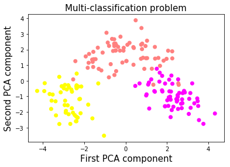
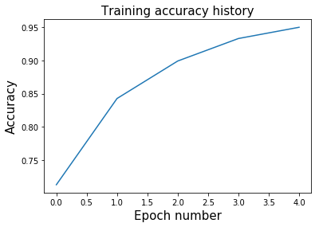
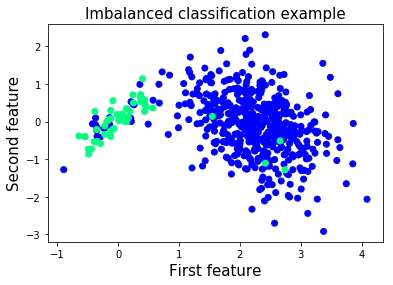
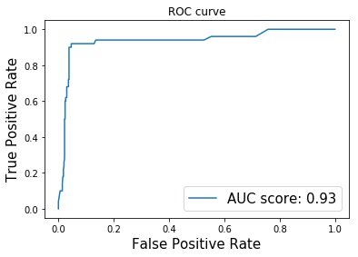
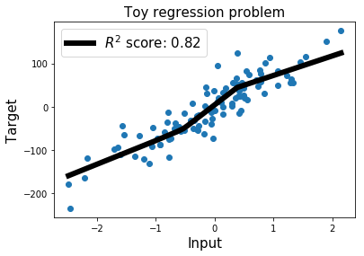

# 二、在 Eager 模式中使用指标

大家好！ 在本教程中，我们将学习如何使用各种指标来评估在 TensorFlow 中使用 Eager 模式时神经网络的表现。

我玩了很久 TensorFlow Eager 模式，我喜欢它。对我来说，与使用声明模式相比，API 看起来非常直观，现在一切看起来都更容易构建。 我现在发现的主要不便之处（我使用的是 1.7 版）是使用 Eager 模式时，`tf.metrics`还不兼容。 尽管如此，我已经构建了几个函数，可以帮助你评估网络的表现，同时仍然享受凭空构建网络的强大之处。

教程步骤：


我选择了三个案例：

多分类

对于此任务，我们将使用准确率，混淆矩阵和平均精度以及召回率，来评估我们模型的表现。

不平衡的二分类

当我们处理不平衡的数据集时，模型的准确率不是可靠的度量。 因此，我们将使用 ROC-AUC 分数，这似乎是一个更适合不平衡问题的指标。

回归

为了评估我们的回归模型的性能，我们将使用 R ^ 2 分数（确定系数）。

我相信这些案例的多样性足以帮助你进一步学习任何机器学习项目。 如果你希望我添加下面未遇到的任何额外指标，请告知我们，我会尽力在以后添加它们。 那么，让我们开始吧！

TensorFlow 版本 - 1.7

## 导入重要的库并开启 Eager 模式

```py
# 导入 TensorFlow 和 TensorFlow Eager
import tensorflow as tf
import tensorflow.contrib.eager as tfe

# 导入函数来生成玩具分类问题
from sklearn.datasets import load_wine
from sklearn.datasets import make_classification
from sklearn.datasets import make_regression

# 为数据预处理导入 numpy
import numpy as np

# 导入绘图库
import matplotlib.pyplot as plt
%matplotlib inline

# 为降维导入 PCA
from sklearn.decomposition import PCA

# 开启 Eager 模式。一旦开启不能撤销！只执行一次。
tfe.enable_eager_execution()
```

## 第一部分：用于多分类的的数据集

```py
wine_data = load_wine()

print('Type of data in the wine_data dictionary: ', list(wine_data.keys()))
'''
Type of data in the wine_data dictionary:  ['data', 'target', 'target_names', 'DESCR', 'feature_names']
'''

print('Number of classes: ', len(np.unique(wine_data.target)))
# Number of classes:  3

print('Distribution of our targets: ', np.unique(wine_data.target, return_counts=True)[1])
# Distribution of our targets:  [59 71 48]

print('Number of features in the dataset: ', wine_data.data.shape[1])
# Number of features in the dataset:  13
```

### 特征标准化

每个特征的比例变化很大，如下面的单元格所示。 为了加快训练速度，我们将每个特征标准化为零均值和单位标准差。 这个过程称为标准化，它对神经网络的收敛非常有帮助。

```py
# 数据集标准化
wine_data.data = (wine_data.data - np.mean(wine_data.data, axis=0))/np.std(wine_data.data, axis=0)

print('Standard deviation of each feature after standardization: ', np.std(wine_data.data, axis=0))
# Standard deviation of each feature after standardization:  [1. 1. 1. 1. 1. 1. 1. 1. 1. 1. 1. 1. 1.]
```

### 数据可视化：使用 PCA 降到二维

我们将使用 PCA，仅用于可视化目的。 我们将使用所有 13 个特征来训练我们的神经网络。

让我们看看这三个类如何在 2D 空间中表示。

```py
X_pca = PCA(n_components=2, random_state=2018).fit_transform(wine_data.data)

plt.scatter(X_pca[:,0], X_pca[:,1], c=wine_data.target, cmap=plt.cm.spring)
plt.xlabel('First PCA component', fontsize=15)
plt.ylabel('Second PCA component', fontsize=15)
plt.title('Multi-classification problem', fontsize=15)
plt.show()
```



好的，所以这些类看起来很容易分开。 顺便说一句，我实际上在特征标准化之前尝试使用 PCA，粉色和黄色类重叠。 通过在降维之前标准化特征，我们设法在它们之间获得了清晰的界限。

### 让我们使用 TensorFlow Eager API 构建双层神经网络

你可能已经注意到，使用 TensorFlow Eager 构建模型的最方便方法是使用类。 我认为，为模型使用类可以更容易地组织和添加新组件。 你只需定义初始化期间要使用的层，然后在预测期间使用它们。 它使得在预测阶段更容易阅读模型的架构。

```py
class two_layer_nn(tf.keras.Model):
    def __init__(self, output_size=2, loss_type='cross-entropy'):
        super(two_layer_nn, self).__init__()
        """ 在这里定义正向传播期间
            使用的神经网络层     
            Args:
                output_size: int (default=2). 
                loss_type: string, 'cross-entropy' or 'regression' (default='cross-entropy')
        """   
        # 第一个隐层
        self.dense_1 = tf.layers.Dense(20, activation=tf.nn.relu)
        # 第二个隐层
        self.dense_2 = tf.layers.Dense(10, activation=tf.nn.relu)
        # 输出层，未缩放的对数概率
        self.dense_out = tf.layers.Dense(output_size, activation=None)     
        # 初始化损失类型
        self.loss_type = loss_type
    
    def predict(self, input_data):
        """ 在神经网络上执行正向传播     
            Args:
                input_data: 2D tensor of shape (n_samples, n_features).   
            Returns:
                logits: unnormalized predictions.
        """
        layer_1 = self.dense_1(input_data)
        layer_2 = self.dense_2(layer_1)
        logits = self.dense_out(layer_2)
        return logits
    
    def loss_fn(self, input_data, target):
        """ 定义训练期间使用的损失函数
        """
        preds = self.predict(input_data)
        if self.loss_type=='cross-entropy':
            loss = tf.losses.sparse_softmax_cross_entropy(labels=target, logits=preds)
        else:
            loss = tf.losses.mean_squared_error(target, preds)
        return loss
    
    def grads_fn(self, input_data, target):
        """ 在每个正向步骤中，
            动态计算损失值对模型参数的梯度
        """
        with tfe.GradientTape() as tape:
            loss = self.loss_fn(input_data, target)
        return tape.gradient(loss, self.variables)
    
    def fit(self, input_data, target, optimizer, num_epochs=500, 
            verbose=50, track_accuracy=True):
        """ 用于训练模型的函数，
            使用所选的优化器，执行所需数量的迭代
        """   
        
        if track_accuracy:
            # Initialize list to store the accuracy of the model
            self.hist_accuracy = []     
            # Initialize class to compute the accuracy metric
            accuracy = tfe.metrics.Accuracy()

        for i in range(num_epochs):
            # Take a step of gradient descent
            grads = self.grads_fn(input_data, target)
            optimizer.apply_gradients(zip(grads, self.variables))
            if track_accuracy:
                # Predict targets after taking a step of gradient descent
                logits = self.predict(X)
                preds = tf.argmax(logits, axis=1)
                # Compute the accuracy
                accuracy(preds, target)
                # Get the actual result and add it to our list
                self.hist_accuracy.append(accuracy.result())
                # Reset accuracy value (we don't want to track the running mean accuracy)
                accuracy.init_variables()
```

### 准确率指标

为了使用准确率指标评估模型的表现，我们将使用`tfe.metrics.Accuracy`类。 在批量训练模型时，此指标非常有用，因为它会在每次调用时计算批量的平均精度。 当我们在每个步骤中使用整个数据集训练模型时，我们将重置此指标，因为我们不希望它跟踪运行中的平均值。

```py
# 创建输入特征和标签。将数据从 numpy 转换为张量
X = tf.constant(wine_data.data)
y = tf.constant(wine_data.target)

# 定义优化器
optimizer = tf.train.GradientDescentOptimizer(5e-1)

# 初始化模型
model = two_layer_nn(output_size=3)

# 在这里选择迭代数量
num_epochs = 5

# 使用梯度下降训练模型
model.fit(X, y, optimizer, num_epochs=num_epochs)

plt.plot(range(num_epochs), model.hist_accuracy);
plt.xlabel('Epoch number', fontsize=15);
plt.ylabel('Accuracy', fontsize=15);
plt.title('Training accuracy history', fontsize=15);
```



### 混淆矩阵

在训练完算法后展示混淆矩阵是一种很好的方式，可以全面了解网络表现。 TensorFlow 具有内置函数来计算混淆矩阵，幸运的是它与 Eager 模式兼容。 因此，让我们可视化此数据集的混淆矩阵。

```py
# 获得整个数据集上的预测
logits = model.predict(X)
preds = tf.argmax(logits, axis=1)

# 打印混淆矩阵
conf_matrix = tf.confusion_matrix(y, preds, num_classes=3)
print('Confusion matrix: \n', conf_matrix.numpy())
'''
Confusion matrix: 
 [[56  3  0]
 [ 2 66  3]
 [ 0  1 47]]
'''
```

对角矩阵显示真正例，而矩阵的其它地方显示假正例。

### 精准率得分

上面计算的混淆矩阵使得计算平均精确率非常容易。 我将在下面实现一个函数，它会自动为你计算。 你还可以指定每个类的权重。 例如，由于某些原因，第二类的精确率可能对你来说更重要。

```py
def precision(labels, predictions, weights=None):
    conf_matrix = tf.confusion_matrix(labels, predictions, num_classes=3)
    tp_and_fp = tf.reduce_sum(conf_matrix, axis=0)
    tp = tf.diag_part(conf_matrix)
    precision_scores = tp/(tp_and_fp)
    if weights:
        precision_score = tf.multiply(precision_scores, weights)/tf.reduce_sum(weights)
    else:
        precision_score = tf.reduce_mean(precision_scores)        
    return precision_score
    
precision_score = precision(y, preds, weights=None)
print('Average precision: ', precision_score.numpy())
# Average precision:  0.9494581280788177
```

### 召回率得分

平均召回率的计算与精确率非常相似。 我们不是对列进行求和，而是对行进行求和，来获得真正例和假负例的总数。

```py
def recall(labels, predictions, weights=None):
    conf_matrix = tf.confusion_matrix(labels, predictions, num_classes=3)
    tp_and_fn = tf.reduce_sum(conf_matrix, axis=1)
    tp = tf.diag_part(conf_matrix)
    recall_scores = tp/(tp_and_fn)
    if weights:
        recall_score = tf.multiply(recall_scores, weights)/tf.reduce_sum(weights)
    else:
        recall_score = tf.reduce_mean(recall_scores)        
    return recall_score

recall_score = recall(y, preds, weights=None)
print('Average precision: ', recall_score.numpy())
# Average precision:  0.9526322246094269
```

## 第二部分：不平衡二分类

当你开始使用真实数据集时，你会很快发现大多数问题都是不平衡的。 例如，考虑到异常样本与正常样本的比例，异常检测问题严重不平衡。 在这些情况下，评估网络性能的更合适的指标是 ROC-AUC 得分。 那么，让我们构建我们的不平衡数据集并开始研究它！

```py

XX,,  yy  ==  make_classificationmake_cla (n_samples=1000, n_features=2, n_informative=2, 
                           n_redundant=0, n_classes=2, n_clusters_per_class=1,
                           flip_y=0.1, class_sep=4, hypercube=False, 
                           shift=0.0, scale=1.0, random_state=2018)

# 减少标签为 1 的样本数
X = np.vstack([X[y==0], X[y==1][:50]])
y = np.hstack([y[y==0], y[y==1][:50]])
```



我们将使用相同的神经网络架构。 我们只需用`num_classes = 2`初始化模型，因为我们正在处理二分类问题。

```py
# Numpy 数组变为张量
X = tf.constant(X)
y = tf.constant(y)
```

让我们将模型只训练几个迭代，来避免过拟合。

```py
# 定义优化器
optimizer = tf.train.GradientDescentOptimizer(5e-1)

# 初始化模型
model = two_layer_nn(output_size=2)

# 在这里选择迭代数量
num_epochs = 5

# 使用梯度下降训练模型
model.fit(X, y, optimizer, num_epochs=num_epochs)
```

### 如何计算 ROC-AUC 得分

为了计算 ROC-AUC 得分，我们将使用`tf.metric.auc`的相同方法。 对于每个概率阈值，我们将计算真正例，真负例，假正例和假负例的数量。 在计算这些统计数据后，我们可以计算每个概率阈值的真正例率和真负例率。

为了近似 ROC 曲线下的面积，我们将使用黎曼和和梯形规则。 如果你想了解更多信息，请点击[此处](https://www.khanacademy.org/math/ap-calculus-ab/ab-accumulation-riemann-sums/ab-midpoint-trapezoid/a/understanding-the-trapezoid-rule)。

### ROC-AUC 函数

```py
def roc_auc(labels, predictions, thresholds, get_fpr_tpr=True):
    tpr = []
    fpr = []
    for th in thresholds:    
        # 计算真正例数量
        tp_cases = tf.where((tf.greater_equal(predictions, th)) & 
                            (tf.equal(labels, 1)))
        tp = tf.size(tp_cases)
        
        # 计算真负例数量
        tn_cases = tf.where((tf.less(predictions, th)) & 
                            (tf.equal(labels, 0)))
        tn = tf.size(tn_cases)
        
        # 计算假正例数量
        fp_cases = tf.where((tf.greater_equal(predictions, th)) & 
                            (tf.equal(labels,0)))
        fp = tf.size(fp_cases)
        
        # 计算假负例数量
        fn_cases = tf.where((tf.less(predictions, th)) & 
                            (tf.equal(labels,1)))
        fn = tf.size(fn_cases)
        
        # 计算该阈值的真正例率
        tpr_th = tp/(tp + fn)
        
        # 计算该阈值的假正例率
        fpr_th = fp/(fp + tn)
        
        # 附加到整个真正例率列表
        tpr.append(tpr_th)
        
        # 附加到整个假正例率列表
        fpr.append(fpr_th)
        
    # 使用黎曼和和梯形法则，计算曲线下的近似面积
    auc_score = 0
    for i in range(0, len(thresholds)-1):
        height_step = tf.abs(fpr[i+1]-fpr[i])
        b1 = tpr[i]
        b2 = tpr[i+1]
        step_area = height_step*(b1+b2)/2
        auc_score += step_area
    return auc_score, fpr, tpr
```

### 为我们训练的模型计算 ROC-AUC 得分并绘制 ROC 曲线

```py
# 阈值更多意味着曲线下的近似面积的粒度更高
# 随意尝试阈值的数量
num_thresholds = 1000 
thresholds = tf.lin_space(0.0, 1.0, num_thresholds).numpy()

# 将Softmax应用于我们的预测，因为模型的输出是非标准化的
# 选择我们的正类的预测（样本较少的类）
preds = tf.nn.softmax(model.predict(X))[:,1] 

# 计算 ROC-AUC 得分并获得每个阈值的 TPR 和 FPR
auc_score, fpr_list, tpr_list = roc_auc(y, preds, thresholds)

print('ROC-AUC score of the model: ', auc_score.numpy())
# ROC-AUC score of the model:  0.93493986

plt.plot(fpr_list, tpr_list, label='AUC score: %.2f' %auc_score);
plt.xlabel('False Positive Rate', fontsize=15);
plt.ylabel('True Positive Rate', fontsize=15);
plt.title('ROC curve');
plt.legend(fontsize=15);
```



## 第三部分：用于回归的数据集

我们最终的数据集为简单的回归任务而创建。 在前两个问题中，网络的输出表示样本所属的类。这里网络的输出是连续的，是一个实数。

我们的输入数据集仅包含一个特征，以便使绘图保持简单。 标签`y`是实数向量。

让我们创建我们的玩具数据集！

```py
X, y = make_regression(n_samples=100, n_features=1, n_informative=1, noise=30, 
                       random_state=2018)
```

### 展示输入特征和标签

为了更好地了解我们正在处理的问题，让我们绘制标签和输入特征。

```py

pltplt..scatterscatter((XX,,  yy););
 pltplt..xlabelxlabel(('Input''Input',,  fontsizefontsize=15);
plt.ylabel('Target', fontsize=15);
plt.title('Toy regression problem', fontsize=15);
```


```py

# Numpy 数组转为张量
X = tf.constant(X)
y = tf.constant(y)
y = tf.reshape(y, [-1,1]) # 从行向量变为列向量
```

### 用于回归任务的神经网络

我们可以重复使用上面创建的双层神经网络。 由于我们只需要预测一个实数，因此网络的输出大小为 1。

我们必须重新定义我们的损失函数，因为我们无法继续使用`softmax`交叉熵损失。 相反，我们将使用均方误差损失函数。 我们还将定义一个新的优化器，其学习速率比前一个更小。

随意调整迭代的数量。

```py
# 定义优化器
optimizer = tf.train.GradientDescentOptimizer(1e-4)

# 初始化模型
model = two_layer_nn(output_size=1, loss_type='regression')

# 选择迭代数量
num_epochs = 300

# 使用梯度下降训练模型
model.fit(X, y, optimizer, num_epochs=num_epochs, 
          track_accuracy=False)
```

### 计算 R^2 得分（决定系数）

如果你曾经处理过回归问题，那么你可能已经听说过这个得分。

这个指标计算输入特征与目标之间的变异百分率，由我们的模型解释。R^2 得分的值范围介于 0 和 1 之间。R^2 得分为 1 意味着该模型可以进行完美的预测。 始终预测目标`y`的平均值，R^2 得分为 0。

R^2 可能为的负值。 在这种情况下，这意味着比起总是预测目标变量的平均值的模型，我们的模型做出更糟糕的预测。

由于此度量标准在 TensorFlow 1.5 中不易获得，因此在 Eager 模式下运行时，我在下面的单元格中为它创建了一个小函数。

```py
# 计算 R^2 得分
def r2(labels, predictions):
    mean_labels = tf.reduce_mean(labels)
    total_sum_squares = tf.reduce_sum((labels-mean_labels)**2)
    residual_sum_squares = tf.reduce_sum((labels-predictions)**2)
    r2_score = 1 - residual_sum_squares/total_sum_squares
    return r2_score

preds = model.predict(X)
r2_score = r2(y, preds)
print('R2 score: ', r2_score.numpy())
# R2 score:  0.8249999999348803
```

### 展示最佳拟合直线

为了可视化我们的神经网络的最佳拟合直线，我们简单地选取`X_min`和`X_max`之间的线性空间。

```py
# 创建 X_min 和 X_max 之间的数据点来显示最佳拟合直线
X_best_fit = np.arange(X.numpy().min(), X.numpy().max(), 0.001)[:,None]

# X_best_fit 的预测
preds_best_fit = model.predict(X_best_fit)

plt.scatter(X.numpy(), y.numpy()); # 原始数据点
plt.plot(X_best_fit, preds_best_fit.numpy(), color='k',
         linewidth=6, label='$R^2$ score: %.2f' %r2_score) # Our predictions
plt.xlabel('Input', fontsize=15);
plt.ylabel('Target', fontsize=15);
plt.title('Toy regression problem', fontsize=15);
plt.legend(fontsize=15);
```


