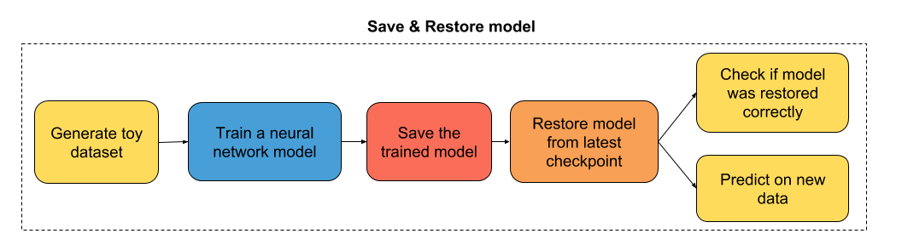

# 三、如何保存和恢复训练模型

滚动浏览`reddit.com/r/learnmachinelearning`的帖子后，我意识到机器学习项目的主要瓶颈，出现于数据输入流水线和模型的最后阶段，你必须保存模型和 对新数据做出预测。 所以我认为制作一个简单直接的教程，向你展示如何保存和恢复使用 Tensorflow Eager 构建的模型会很有用。

教程的流程图



## 导入有用的库

```py
# 导入 TensorFlow 和 TensorFlow Eager
import tensorflow as tf
import tensorflow.contrib.eager as tfe

# 导入函数来生成玩具分类问题
from sklearn.datasets import make_moons

# 开启 Eager 模式。一旦开启不能撤销！只执行一次。
tfe.enable_eager_execution()
```

## 第一部分：为二分类构建简单的神经网络

```py
class simple_nn(tf.keras.Model):
    def __init__(self):
        super(simple_nn, self).__init__()
        """ 在这里定义正向传播期间
            使用的神经网络层
        """   
        # 隐层
        self.dense_layer = tf.layers.Dense(10, activation=tf.nn.relu)
        # 输出层，无激活
        self.output_layer = tf.layers.Dense(2, activation=None)
    
    def predict(self, input_data):
        """ 在神经网络上执行正向传播
            Args:
                input_data: 2D tensor of shape (n_samples, n_features).   
            Returns:
                logits: unnormalized predictions.
        """
        hidden_activations = self.dense_layer(input_data)
        logits = self.output_layer(hidden_activations)
        return logits
    
    def loss_fn(self, input_data, target):
        """ 定义训练期间使用的损失函数
        """
        logits = self.predict(input_data)
        loss = tf.losses.sparse_softmax_cross_entropy(labels=target, logits=logits)
        return loss
    
    def grads_fn(self, input_data, target):
        """ 在每个正向步骤中，
            动态计算损失值对模型参数的梯度
        """
        with tfe.GradientTape() as tape:
            loss = self.loss_fn(input_data, target)
        return tape.gradient(loss, self.variables)
    
    def fit(self, input_data, target, optimizer, num_epochs=500, verbose=50):
        """ 用于训练模型的函数，
            使用所选的优化器，执行所需数量的迭代
        """
        for i in range(num_epochs):
            grads = self.grads_fn(input_data, target)
            optimizer.apply_gradients(zip(grads, self.variables))
            if (i==0) | ((i+1)%verbose==0):
                print('Loss at epoch %d: %f' %(i+1, self.loss_fn(input_data, target).numpy()))
```

## 第二部分：训练模型

```py
# 为分类生成玩具数据集
# X 是 n_samples x n_features 的矩阵，表示输入特征
# y 是 长度为 n_samples 的向量，表示我们的标签
X, y = make_moons(n_samples=100, noise=0.1, random_state=2018)
X_train, y_train = tf.constant(X[:80,:]), tf.constant(y[:80])
X_test, y_test = tf.constant(X[80:,:]), tf.constant(y[80:])

optimizer = tf.train.GradientDescentOptimizer(5e-1)
model = simple_nn()
model.fit(X_train, y_train, optimizer, num_epochs=500, verbose=50)
'''
Loss at epoch 1: 0.658276
Loss at epoch 50: 0.302146
Loss at epoch 100: 0.268594
Loss at epoch 150: 0.247425
Loss at epoch 200: 0.229143
Loss at epoch 250: 0.197839
Loss at epoch 300: 0.143365
Loss at epoch 350: 0.098039
Loss at epoch 400: 0.070781
Loss at epoch 450: 0.053753
Loss at epoch 500: 0.042401
'''
```

## 第三部分：保存训练模型

```py
# 指定检查点目录
checkpoint_directory = 'models_checkpoints/SimpleNN/'
# 创建模型检查点
checkpoint = tfe.Checkpoint(optimizer=optimizer,
                            model=model,
                            optimizer_step=tf.train.get_or_create_global_step())

# 保存训练模型
checkpoint.save(file_prefix=checkpoint_directory)
# 'models_checkpoints/SimpleNN/-1'
```

## 第四部分：恢复训练模型

```py
# 重新初始化模型实例
model = simple_nn()
optimizer = tf.train.GradientDescentOptimizer(5e-1)

# 指定检查点目录
checkpoint_directory = 'models_checkpoints/SimpleNN/'
# 创建模型检查点
checkpoint = tfe.Checkpoint(optimizer=optimizer,
                            model=model,
                            optimizer_step=tf.train.get_or_create_global_step())

# 从最近的检查点恢复模型
checkpoint.restore(tf.train.latest_checkpoint(checkpoint_directory))
# <tensorflow.contrib.eager.python.checkpointable_utils.CheckpointLoadStatus at 0x7fcfd47d2048>
```

## 第五部分：检查模型是否正确恢复

```py
model.fit(X_train, y_train, optimizer, num_epochs=1)
# Loss at epoch 1: 0.042220
```

损失似乎与我们在之前训练的最后一个迭代中获得的损失一致！

## 第六部分：对新数据做预测

```py
logits_test = model.predict(X_test)

print(logits_test)
'''
tf.Tensor(
[[ 1.54352813 -0.83117302]
 [-1.60523365  2.82397487]
 [ 2.87589525 -1.36463485]
 [-1.39461001  2.62404279]
 [ 0.82305161 -0.55651397]
 [ 3.53674391 -2.55593046]
 [-2.97344627  3.46589599]
 [-1.69372442  2.95660466]
 [-1.43226137  2.65357974]
 [ 3.11479995 -1.31765645]
 [-0.65841567  1.60468631]
 [-2.27454367  3.60553595]
 [-1.50170912  2.74410115]
 [ 0.76261479 -0.44574208]
 [ 2.34516959 -1.6859307 ]
 [ 1.92181942 -1.63766352]
 [ 4.06047684 -3.03988941]
 [ 1.00252324 -0.78900484]
 [ 2.79802993 -2.2139734 ]
 [-1.43933035  2.68037059]], shape=(20, 2), dtype=float64)
'''
```
