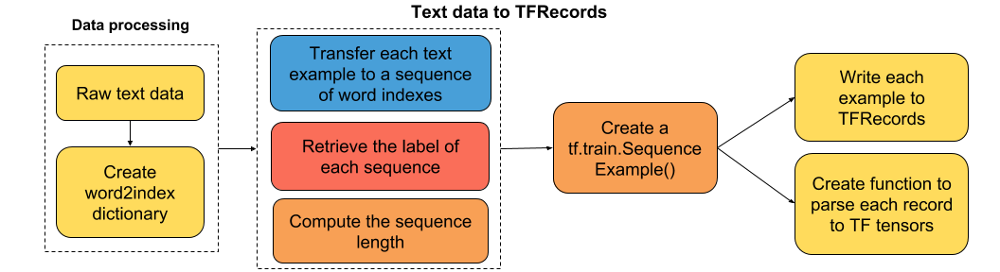

# 四、文本序列到 TFRecords

大家好！ 在本教程中，我将向你展示如何将原始文本数据解析为 TFRecords。 我知道很多人都卡在输入处理流水线，尤其是当你开始着手自己的个人项目时。 所以我真的希望它对你们任何人都有用！

教程的流程图



### 虚拟的IMDB文本数据

在实践中，我从斯坦福大学提供的大型电影评论数据集中选择了一些数据样本。

### 在这里导入有用的库

```py
from nltk.tokenize import word_tokenize
import tensorflow as tf
import pandas as pd
import pickle
import random
import glob
import nltk
import re

try:
    nltk.data.find('tokenizers/punkt')
except LookupError:
    nltk.download('punkt')
```

### 将数据解析为 TFRecords

```py
def imdb2tfrecords(path_data='datasets/dummy_text/', min_word_frequency=5,
                   max_words_review=700):
    '''
    这个脚本处理数据
    并将其保存为默认的 TensorFlow 文件格式：tfrecords。
    
    Args:
        path_data: the path where the imdb data is stored.
        min_word_frequency: the minimum frequency of a word, to keep it
                            in the vocabulary.
        max_words_review: the maximum number of words allowed in a review.
    '''
    # 获取正面/负面评论的文件名 
    pos_files = glob.glob(path_data + 'pos/*')
    neg_files = glob.glob(path_data + 'neg/*')

    # 连接正负评论的文件名
    filenames = pos_files + neg_files
    
    # 列出数据集中的所有评论
    reviews = [open(filenames[i],'r').read() for i in range(len(filenames))]
    
    # 移除 HTML 标签
    reviews = [re.sub(r'<[^>]+>', ' ', review) for review in reviews]
        
    # 将每个评论分词
    reviews = [word_tokenize(review) for review in reviews]
    
    # 计算每个评论的的长度
    len_reviews = [len(review) for review in reviews]

    # 展开嵌套列表
    reviews = [word for review in reviews for word in review]
    
    # 计算每个单词的频率
    word_frequency = pd.value_counts(reviews)
    
    # 仅仅保留频率高于最小值的单词
    vocabulary = word_frequency[word_frequency>=min_word_frequency].index.tolist()
    
    # 添加未知，起始和终止记号
    extra_tokens = ['Unknown_token', 'End_token']
    vocabulary += extra_tokens
    
    # 创建 word2idx 词典
    word2idx = {vocabulary[i]: i for i in range(len(vocabulary))}
    
    # 将单词的词汇表写到磁盘
    pickle.dump(word2idx, open(path_data + 'word2idx.pkl', 'wb'))
        
    def text2tfrecords(filenames, writer, vocabulary, word2idx,
                       max_words_review):
        '''
        用于将每个评论解析为部分，并作为 tfrecord 写入磁盘的函数。
        
        Args:
            filenames: the paths of the review files.
            writer: the writer object for tfrecords.
            vocabulary: list with all the words included in the vocabulary.
            word2idx: dictionary of words and their corresponding indexes.
        '''
        # 打乱 filenames
        random.shuffle(filenames)
        for filename in filenames:
            review = open(filename, 'r').read()
            review = re.sub(r'<[^>]+>', ' ', review)
            review = word_tokenize(review)
            # 将 review 归约为最大单词
            review = review[-max_words_review:]
            # 将单词替换为来自 word2idx 的等效索引
            review = [word2idx[word] if word in vocabulary else 
                      word2idx['Unknown_token'] for word in review]
            indexed_review = review + [word2idx['End_token']]
            sequence_length = len(indexed_review)
            target = 1 if filename.split('/')[-2]=='pos' else 0
            # Create a Sequence Example to store our data in
            ex = tf.train.SequenceExample()
            # 向我们的示例添加非顺序特性
            ex.context.feature['sequence_length'].int64_list.value.append(sequence_length)
            ex.context.feature['target'].int64_list.value.append(target)
            # 添加顺序特征
            token_indexes = ex.feature_lists.feature_list['token_indexes']
            for token_index in indexed_review:
                token_indexes.feature.add().int64_list.value.append(token_index)
            writer.write(ex.SerializeToString())
    
    ##########################################################################     
    # Write data to tfrecords.This might take a while.
    ##########################################################################
    writer = tf.python_io.TFRecordWriter(path_data + 'dummy.tfrecords')
    text2tfrecords(filenames, writer, vocabulary, word2idx, 
                   max_words_review)

imdb2tfrecords(path_data='datasets/dummy_text/')
```

### 将 TFRecords 解析为 TF 张量

```py
def parse_imdb_sequence(record):
    '''
    解析 imdb tfrecords 的脚本
    
    Returns:
        token_indexes: sequence of token indexes present in the review.
        target: the target of the movie review.
        sequence_length: the length of the sequence.
    '''
    context_features = {
        'sequence_length': tf.FixedLenFeature([], dtype=tf.int64),
        'target': tf.FixedLenFeature([], dtype=tf.int64),
        }
    sequence_features = {
        'token_indexes': tf.FixedLenSequenceFeature([], dtype=tf.int64),
        }
    context_parsed, sequence_parsed = tf.parse_single_sequence_example(record, 
        context_features=context_features, sequence_features=sequence_features)
        
    return (sequence_parsed['token_indexes'], context_parsed['target'],
            context_parsed['sequence_length'])
```

如果你希望我在本教程中添加任何内容，请告诉我，我将很乐意进一步改善它。

