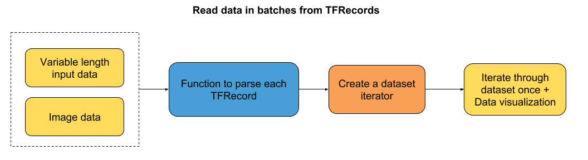
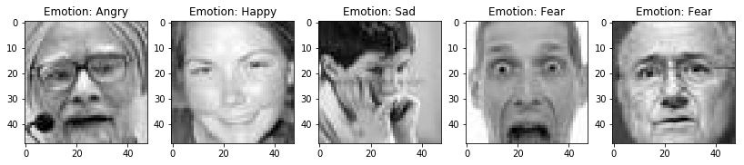

# 六、如何使用 TensorFlow Eager 从 TFRecords 批量读取数据

大家好，本教程再次关注输入流水线。 这很简单，但我记得当我第一次开始批量读取数据时，我陷入了相当多的细节，所以我想我可能会在这里分享我的方法。 我真的希望它对你们中的一些人有用。

教程的流程图：



我们将研究两种情况：

+   可变序列长度的输入数据 - 在这种情况下，我们将填充批次到最大序列长度。
+   图像数据

两种情况的数据都存储为 TFRecords。 你可以查看教程的第四和第五章，了解如何将原始数转换为 TFRecords。

那么，让我们直接开始编程！

### 导入有用的库

```py
# 导入数据可视化库
import matplotlib.pyplot as plt

# 使绘图内嵌在笔记本中
%matplotlib inline

# 导入 TensorFlow 和 TensorFlow Eager
import tensorflow as tf
import tensorflow.contrib.eager as tfe

# 开启 Eager 模式。一旦开启不能撤销！只执行一次。
tfe.enable_eager_execution()
```

## 第一部分：读取可变序列长度的数据

本教程的第一部分向你介绍如何读取不同长度的输入数据。 在我们的例子中，我们使用了大型电影数据库中的虚拟 IMDB 评论。 你可以想象，每个评论都有不同的单词数。 因此，当我们读取一批数据时，我们将序列填充到批次中的最大序列长度。

为了了解我如何获得单词索引序列，以及标签和序列长度，请参阅第四章。

### 创建函数来解析每个 TFRecord

```py
def parse_imdb_sequence(record):
    '''
    用于解析 imdb tfrecords 的脚本
    
    Returns:
        token_indexes: sequence of token indexes present in the review.
        target: the target of the movie review.
        sequence_length: the length of the sequence.
    '''
    context_features = {
        'sequence_length': tf.FixedLenFeature([], dtype=tf.int64),
        'target': tf.FixedLenFeature([], dtype=tf.int64),
        }
    sequence_features = {
        'token_indexes': tf.FixedLenSequenceFeature([], dtype=tf.int64),
        }
    context_parsed, sequence_parsed = tf.parse_single_sequence_example(record, 
        context_features=context_features, sequence_features=sequence_features)
        
    return (sequence_parsed['token_indexes'], context_parsed['target'],
            context_parsed['sequence_length'])
```

### 创建数据集迭代器

正如你在上面的函数中所看到的，在解析每个记录之后，我们返回一系列单词索引，评论标签和序列长度。 在`padded_batch`方法中，我们只填充记录的第一个元素：单词索引的序列。 在每个示例中，标签和序列长度不需要填充，因为它们只是单个数字。 因此，`padded_shapes`将是：

+   `[None]` -> 将序列填充到最大维度，还不知道，因此是`None`。
+   `[]` -> 标签没有填充。
+   `[]` -> 序列长度没有填充。

```py
# 选取批量大小
batch_size = 2

# 从 TFRecords 创建数据集
dataset = tf.data.TFRecordDataset('datasets/dummy_text/dummy.tfrecords')
dataset = dataset.map(parse_imdb_sequence).shuffle(buffer_size=10000)
dataset = dataset.padded_batch(batch_size, padded_shapes=([None],[],[]))
```

### 遍历数据一次

```py
for review, target, sequence_length in tfe.Iterator(dataset):
    print(target)
'''
tf.Tensor([0 1], shape=(2,), dtype=int64)
tf.Tensor([1 0], shape=(2,), dtype=int64)
tf.Tensor([0 1], shape=(2,), dtype=int64)
'''

for review, target, sequence_length in tfe.Iterator(dataset):
    print(review.shape)
'''
(2, 145)
(2, 139)
(2, 171)
'''

for review, target, sequence_length in tfe.Iterator(dataset):
    print(sequence_length)
'''
tf.Tensor([137 151], shape=(2,), dtype=int64)
tf.Tensor([139 171], shape=(2,), dtype=int64)
tf.Tensor([145 124], shape=(2,), dtype=int64)
'''
```

## 第二部分：批量读取图像（以及它们的标签）

在本教程的第二部分中，我们将通过批量读取图像,将存储为 TFRecords 的图像可视化。 这些图像是 FER2013 数据集中的一个小型子样本。

### 创建函数来解析每个记录并解码图片

```py
def parser(record):
    '''
    解析 TFRecords 样本的函数
    
    Returns:
        img: decoded image.
        label: the corresponding label of the image.         
    '''
    
    # 定义你想要解析的特征
    features = {'image': tf.FixedLenFeature((), tf.string),
                'label': tf.FixedLenFeature((), tf.int64)}
    
    # 解析样本
    parsed = tf.parse_single_example(record, features)

    # 解码图像
    img = tf.image.decode_image(parsed['image'])
   
    return img, parsed['label']
```

### 创建数据集迭代器

```py
# 选取批量大小
batch_size = 5

# 从 TFRecords 创建数据集
dataset = tf.data.TFRecordDataset('datasets/dummy_images/dummy.tfrecords')
dataset = dataset.map(parser).shuffle(buffer_size=10000)
dataset = dataset.batch(batch_size)
```

### 遍历数据集一次。展示图像。

```py
# Dictionary that stores the correspondence between integer labels and the emotions
emotion_cat = {0:'Angry', 1:'Disgust', 2:'Fear', 3:'Happy', 4:'Sad', 5:'Surprise', 6:'Neutral'}

# 遍历数据集一次
for image, label in tfe.Iterator(dataset):
    # 为每个图像批量创建子图
    f, axarr = plt.subplots(1, int(image.shape[0]), figsize=(14, 6))
    # 绘制图像
    for i in range(image.shape[0]):
        axarr[i].imshow(image[i,:,:,0], cmap='gray')
        axarr[i].set_title('Emotion: %s' %emotion_cat[label[i].numpy()])
```



如果你希望我在本教程中添加任何内容，请与我们联系。 我会尽力添加它！
