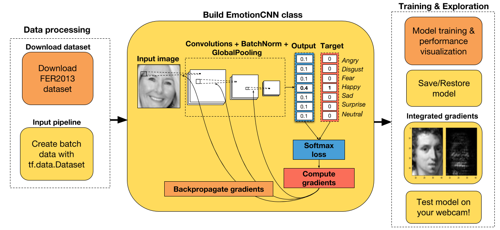
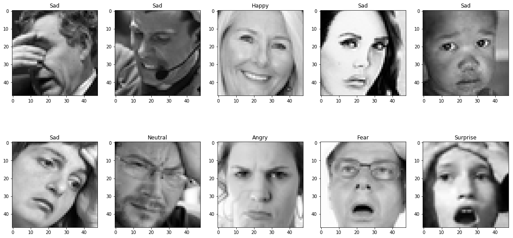
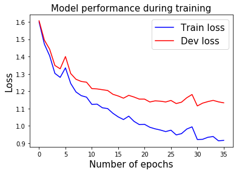
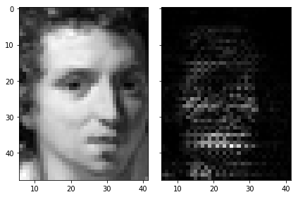

# 七、使用 TensorFlow Eager 构建用于情感识别的卷积神经网络（CNN）

对于深度学习，我最喜欢的部分之一就是我可以解决一些问题，其中我自己可以测试神经网络。 到目前为止，我建立的最有趣的神经网络是用于情感识别的 CNN。 我已经设法通过网络传递我的网络摄像头视频，并实时预测了我的情绪（使用 GTX-1070）。 相当容易上瘾！

因此，如果你想将工作与乐趣结合起来，那么你一定要仔细阅读本教程。 另外，这是熟悉 Eager API 的好方法！

教程步骤



+   下载并处理 Kaggle 上提供的 FER2013 数据集。
+   整个数据集上的探索性数据分析。
+   将数据集拆分为训练和开发数据集。
+   标准化图像。
+   使用`tf.data.Dataset` API 遍历训练和开发数据集。
+   在 Eager 模式下为 CNN 创建一个类。
+   能够保存模型或从先前的检查点恢复。
+   创建一个损失函数，一个优化器和一个梯度计算函数。
+   用梯度下降训练模型。
+   从头开始或者从预训练模型开始。
+   在训练期间可视化表现并计算准确率。
+   使用集成梯度可视化样本图像上的 CNN 归属。
+   使用 OpenCV 和 Haar 级联算法在新图像上测试 CNN。

## 导入有用的库

```py
# 导入 TensorFlow 和 TensorFlow Eager
import tensorflow as tf
import tensorflow.contrib.eager as tfe

# 导入函数来生成玩具分类问题
from sklearn.datasets import make_moons
import numpy as np

# 导入绘图库
import matplotlib.pyplot as plt
%matplotlib inline

# 开启 Eager 模式。一旦开启不能撤销！只执行一次。
tfe.enable_eager_execution()
```

## 下载数据集

为了训练我们的 CNN，我们将使用 Kaggle 上提供的 FER2013 数据集。 你必须在他们的平台上自己下载数据集，遗憾的是我无法公开分享数据。 尽管如此，数据集只有 96.4 MB，因此你应该能够立即下载它。 你可以在[这里](https://www.kaggle.com/c/challenges-in-representation-learning-facial-expression-recognition-challenge/data)下载。

下载完数据后，将其解压缩并放入名为`datasets`的文件夹中，这样你就不必对下面的代码进行任何修改。

好的，让我们开始探索性数据分析！

## 探索性数据分析

在构建任何机器学习模型之前，建议对数据集进行探索性数据分析。 这使你有机会发现数据集中的任何缺陷，如类之间的强烈不平衡，低质量图像等。

我发现机器学习项目中出现的大多数错误，都是由于数据处理不正确造成的。 如果你在发现模型没有用后才开始调查数据集，那么找到这些错误会更加困难。

所以，我给你的建议是：在构建任何模型之前总是分析数据。

```py
# 读取输入数据。假设已经解压了数据集，并放入名为 data 的文件夹中。
path_data = 'datasets/fer2013/fer2013.csv'
data = pd.read_csv(path_data)

print('Number of samples in the dataset: ', data.shape[0])
# Number of samples in the dataset:  35887

# 查看前五行
data.head(5)
```


| | emotion | pixels | Usage |
| --- | --- | --- | --- |
| 0 | 0 | 70 80 82 72 58 58 60 63 54 58 60 48 89 115 121... | Training |
| 1 | 0 | 151 150 147 155 148 133 111 140 170 174 182 15... | Training |
| 2 | 2 | 231 212 156 164 174 138 161 173 182 200 106 38... | Training |
| 3 | 4 | 24 32 36 30 32 23 19 20 30 41 21 22 32 34 21 1... | Training |
| 4 | 6 | 4 0 0 0 0 0 0 0 0 0 0 0 3 15 23 28 48 50 58 84... | Training |

```py
# 获取每个表情的含义
emotion_cat = {0:'Angry', 1:'Disgust', 2:'Fear', 3:'Happy', 4:'Sad', 5:'Surprise', 6:'Neutral'}

# 查看标签分布（检查不平衡）
target_counts = data['emotion'].value_counts().reset_index(drop=False)
target_counts.columns = ['emotion', 'number_samples']
target_counts['emotion'] = target_counts['emotion'].map(emotion_cat)
target_counts
```

|  | emotion | number_samples |
| --- | --- | --- |
| 0 | Happy | 8989 |
| 1 | Neutral | 6198 |
| 2 | Sad | 6077 |
| 3 | Fear | 5121 |
| 4 | Angry | 4953 |
| 5 | Surprise | 4002 |
| 6 | Disgust | 547 |

如你所见，数据集非常不平衡。 特别是对于情绪`Disgust`。 这将使这个类的训练更加困难，因为网络将有更少的机会来学习这种表情的表示。

在我们训练网络之后，稍后我们会看到这是否会严重影响我们网络的训练。

我们来看看一些图片！

图像当前表示为整数的字符串，每个整数表示一个像素的强度。 我们将处理字符串。将其表示为整数列表。

```py
# 将图像从字符串换换位整数列表
data['pixels'] = data['pixels'].apply(lambda x: [int(pixel) for pixel in x.split()])

# 修改这里的种子来查看其它图像
random_seed = 2

# 随机选择十个图像
data_sample = data.sample(10, random_state=random_seed)

# 为图像创建子图
f, axarr = plt.subplots(2, 5, figsize=(20, 10))

# 绘制图像
i, j = 0, 0
for idx, row in data_sample.iterrows():
    img = np.array(row['pixels']).reshape(48,48)
    axarr[i,j].imshow(img, cmap='gray')
    axarr[i,j].set_title(emotion_cat[row['emotion']])
    if j==4:
        i += 1
        j = 0
    else:
        j += 1
```



## 将数据集拆分为训练/开发，并按最大值标准化图像

```py

data_traindata_tra  = data[data['Usage']=='Training']
size_train = data_train.shape[0]
print('Number samples in the training dataset: ', size_train)

data_dev = data[data['Usage']!='Training']
size_dev = data_dev.shape[0]
print('Number samples in the development dataset: ', size_dev)
'''
Number samples in the training dataset:  28709
Number samples in the development dataset:  7178
'''

# 获取训练输入和标签
X_train, y_train = data_train['pixels'].tolist(), data_train['emotion'].as_matrix()
# 将图像形状修改为 4D（样本数，宽，高，通道数）
X_train = np.array(X_train, dtype='float32').reshape(-1,48,48,1)
# 使用最大值标准化图像（最大像素密度为 255）
X_train = X_train/255.0

# 获取开发输入和标签
X_dev, y_dev = data_dev['pixels'].tolist(), data_dev['emotion'].as_matrix()
# 将图像形状修改为 4D（样本数，宽，高，通道数）
X_dev = np.array(X_dev, dtype='float32').reshape(-1,48,48,1)
# 使用最大值标准化图像
X_dev = X_dev/255.0
```

## 使用`tf.data.Dataset` API

为了准备我们的数据集用作 CNN 的输入，我们将使用`tf.data.Dataset` API，将我们刚刚创建的 numpy 数组转换为 TF 张量。 由于此数据集比以前教程中的数据集大得多，因此我们实际上必须将数据批量提供给模型。

通常，为了提高计算效率，你可以选择与内存一样大的批量。 但是，根据我的经验，如果我在训练期间使用较小的批量，我会在测试数据上获得更好的结果。 随意调整批量大小，看看你是否得到了与我相同的结论。

```py
# 随意调整批量大小
# 通常较小的批量大小在测试集上获取更好的结果
batch_size = 64
training_data = tf.data.Dataset.from_tensor_slices((X_train, y_train[:,None])).batch(batch_size)
eval_data = tf.data.Dataset.from_tensor_slices((X_dev, y_dev[:,None])).batch(batch_size)
```

## 在 Eager 模式下创建 CNN 模型

CNN 架构在下面的单元格中创建。 如你所见，`EmotionRecognitionCNN`类继承自`tf.keras.Model`类，因为我们想要跟踪包含任何可训练参数的层（例如卷积的权重，批量标准化层的平均值）。 这使我们易于保存这些变量，然后在我们想要继续训练网络时将其恢复。

这个 CNN 的原始架构可以在这里找到（使用 keras 构建）。 我认为如果你开始使用比 ResNet 更简单的架构，那将非常有用。 对于这个网络规模，它的效果非常好。

你可以使用它，添加更多的层，增加层的数量，过滤器等。看看你是否可以获得更好的结果。

有一点可以肯定的是，dropout 越高，网络效果越好。

```py
class EmotionRecognitionCNN(tf.keras.Model):
    
    def __init__(self, num_classes, device='cpu:0', checkpoint_directory=None):
        ''' 定义在正向传播期间使用的参数化层，你要在它上面运行计算的设备，以及检查点目录。
            
            Args:
                num_classes: the number of labels in the network.
                device: string, 'cpu:n' or 'gpu:n' (n can vary). Default, 'cpu:0'.
                checkpoint_directory: the directory where you would like to save or 
                                      restore a model.
        ''' 
        super(EmotionRecognitionCNN, self).__init__()
        
        # 初始化层
        self.conv1 = tf.layers.Conv2D(16, 5, padding='same', activation=None)
        self.batch1 = tf.layers.BatchNormalization()
        self.conv2 = tf.layers.Conv2D(16, 5, 2, padding='same', activation=None)
        self.batch2 = tf.layers.BatchNormalization()
        self.conv3 = tf.layers.Conv2D(32, 5, padding='same', activation=None)
        self.batch3 = tf.layers.BatchNormalization()
        self.conv4 = tf.layers.Conv2D(32, 5, 2, padding='same', activation=None)
        self.batch4 = tf.layers.BatchNormalization()
        self.conv5 = tf.layers.Conv2D(64, 3, padding='same', activation=None)
        self.batch5 = tf.layers.BatchNormalization()
        self.conv6 = tf.layers.Conv2D(64, 3, 2, padding='same', activation=None)
        self.batch6 = tf.layers.BatchNormalization()
        self.conv7 = tf.layers.Conv2D(64, 1, padding='same', activation=None)
        self.batch7 = tf.layers.BatchNormalization()
        self.conv8 = tf.layers.Conv2D(128, 3, 2, padding='same', activation=None)
        self.batch8 = tf.keras.layers.BatchNormalization()
        self.conv9 = tf.layers.Conv2D(256, 1, padding='same', activation=None)
        self.batch9 = tf.keras.layers.BatchNormalization()
        self.conv10 = tf.layers.Conv2D(128, 3, 2, padding='same', activation=None)
        self.conv11 = tf.layers.Conv2D(256, 1, padding='same', activation=None)
        self.batch11 = tf.layers.BatchNormalization()
        self.conv12 = tf.layers.Conv2D(num_classes, 3, 2, padding='same', activation=None)
        
        # 定义设备
        self.device = device
        
        # 定义检查点目录
        self.checkpoint_directory = checkpoint_directory
       
    def predict(self, images, training):
        """ 根据输入样本预测每个类的概率。
            
            Args:
                images: 4D tensor. Either an image or a batch of images.
                training: Boolean. Either the network is predicting in
                          training mode or not.
        """
        x = self.conv1(images)
        x = self.batch1(x, training=training)
        x = self.conv2(x)
        x = self.batch2(x, training=training)
        x = tf.nn.relu(x)
        x = tf.layers.dropout(x, rate=0.4, training=training)
        x = self.conv3(x)
        x = self.batch3(x, training=training)
        x = self.conv4(x)
        x = self.batch4(x, training=training)
        x = tf.nn.relu(x)
        x = tf.layers.dropout(x, rate=0.3, training=training)
        x = self.conv5(x)
        x = self.batch5(x, training=training)
        x = self.conv6(x)
        x = self.batch6(x, training=training)
        x = tf.nn.relu(x)
        x = tf.layers.dropout(x, rate=0.3, training=training)
        x = self.conv7(x)
        x = self.batch7(x, training=training)
        x = self.conv8(x)
        x = self.batch8(x, training=training)
        x = tf.nn.relu(x)
        x = tf.layers.dropout(x, rate=0.3, training=training)
        x = self.conv9(x)
        x = self.batch9(x, training=training)
        x = self.conv10(x)
        x = self.conv11(x)
        x = self.batch11(x, training=training)
        x = self.conv12(x)
        return tf.layers.flatten(x)
    
    def loss_fn(self, images, target, training):
        """ 定义训练期间使用的损失函数。
        """
        preds = self.predict(images, training)
        loss = tf.losses.sparse_softmax_cross_entropy(labels=target, logits=preds)
        return loss
    
    def grads_fn(self, images, target, training):
        """ 在每个正向步骤中，
            动态计算损失值对模型参数的梯度
        """
        with tfe.GradientTape() as tape:
            loss = self.loss_fn(images, target, training)
        return tape.gradient(loss, self.variables)
    
    def restore_model(self):
        """ 用于恢复已训练模型的函数
        """
        with tf.device(self.device):
            # Run the model once to initialize variables
            dummy_input = tf.constant(tf.zeros((1,48,48,1)))
            dummy_pred = self.predict(dummy_input, training=False)
            # Restore the variables of the model
            saver = tfe.Saver(self.variables)
            saver.restore(tf.train.latest_checkpoint
                          (self.checkpoint_directory))
    
    def save_model(self, global_step=0):
        """ 用于保存已训练模型的函数
        """
        tfe.Saver(self.variables).save(self.checkpoint_directory, 
                                       global_step=global_step)   
    
    def compute_accuracy(self, input_data):
        """ 在输入数据上计算准确率
        """
        with tf.device(self.device):
            acc = tfe.metrics.Accuracy()
            for images, targets in tfe.Iterator(input_data):
                # Predict the probability of each class
                logits = self.predict(images, training=False)
                # Select the class with the highest probability
                preds = tf.argmax(logits, axis=1)
                # Compute the accuracy
                acc(tf.reshape(targets, [-1,]), preds)
        return acc
        
    def fit(self, training_data, eval_data, optimizer, num_epochs=500, 
            early_stopping_rounds=10, verbose=10, train_from_scratch=False):
        """ 使用所选优化器和所需数量的迭代来训练模型。 你可以从头开始训练或加载最后训练的模型。 提前停止用于降低过拟合网络的风险。
            
            Args:
                training_data: the data you would like to train the model on.
                                Must be in the tf.data.Dataset format.
                eval_data: the data you would like to evaluate the model on.
                            Must be in the tf.data.Dataset format.
                optimizer: the optimizer used during training.
                num_epochs: the maximum number of iterations you would like to 
                            train the model.
                early_stopping_rounds: stop training if the loss on the eval 
                                       dataset does not decrease after n epochs.
                verbose: int. Specify how often to print the loss value of the network.
                train_from_scratch: boolean. Whether to initialize variables of the
                                    the last trained model or initialize them
                                    randomly.
        """ 
    
        if train_from_scratch==False:
            self.restore_model()
        
        # 初始化最佳损失。 此变量存储评估数据集上的最低损失。
        best_loss = 999
        
        # 初始化类来更新训练和评估的平均损失
        train_loss = tfe.metrics.Mean('train_loss')
        eval_loss = tfe.metrics.Mean('eval_loss')
        
        # 初始化字典来存储损失的历史记录
        self.history = {}
        self.history['train_loss'] = []
        self.history['eval_loss'] = []
        
        # 开始训练
        with tf.device(self.device):
            for i in range(num_epochs):
                # 使用梯度下降来训练
                for images, target in tfe.Iterator(training_data):
                    grads = self.grads_fn(images, target, True)
                    optimizer.apply_gradients(zip(grads, self.variables))
                    
                # 计算一个迭代后的训练数据的损失
                for images, target in tfe.Iterator(training_data):
                    loss = self.loss_fn(images, target, False)
                    train_loss(loss)
                self.history['train_loss'].append(train_loss.result().numpy())
                # 重置指标
                train_loss.init_variables()
                
                # 计算一个迭代后的评估数据的损失
                for images, target in tfe.Iterator(eval_data):
                    loss = self.loss_fn(images, target, False)
                    eval_loss(loss)
                self.history['eval_loss'].append(eval_loss.result().numpy())
                # 重置指标
                eval_loss.init_variables()
                
                # 打印训练和评估损失
                if (i==0) | ((i+1)%verbose==0):
                    print('Train loss at epoch %d: ' %(i+1), self.history['train_loss'][-1])
                    print('Eval loss at epoch %d: ' %(i+1), self.history['eval_loss'][-1])

                # 为提前停止而检查
                if self.history['eval_loss'][-1]<best_loss:
                    best_loss = self.history['eval_loss'][-1]
                    count = early_stopping_rounds
                else:
                    count -= 1
                if count==0:
                    break
```

## 使用梯度下降和提前停止来训练模型

我在训练网络 35 个迭代后保存了权重。 你可以在更多的几个迭代中恢复和微调它们。 如果你的计算机上没有 GPU，那么进一步调整模型将比从头开始训练模型容易得多。

如果在`n`个时期之后开发数据集上的损失没有减少，则可以使用提前停止来停止训练网络（可以使用变量`early_stopping_rounds`设置`n`的数量）。

```py

# 指定你打算保存/恢复已训练变量的路径
checkpoint_directory = 'models_checkpoints/EmotionCNN/'

# 如果可用，则使用 GPU
device = 'gpu:0' if tfe.num_gpus()>0 else 'cpu:0'

# 定义优化器
optimizer = tf.train.AdamOptimizer()

# 实例化模型。这不会实例化变量
model = EmotionRecognitionCNN(num_classes=7, device=device, 
                              checkpoint_directory=checkpoint_directory)
                              

# 训练模型  
model.fit(training_data, eval_data, optimizer, num_epochs=500, 
          early_stopping_rounds=5, verbose=10, train_from_scratch=False)
          
'''
Train loss at epoch 1:  1.5994938561539342
Eval loss at epoch 1:  1.6061641948413006
Train loss at epoch 10:  1.1655063030448947
Eval loss at epoch 10:  1.2517835698296538
Train loss at epoch 20:  1.007327914901725
Eval loss at epoch 20:  1.1543473274306912
Train loss at epoch 30:  0.9942544895184863
Eval loss at epoch 30:  1.1808805191411382
'''

# 保存已训练模型
model.save_model()
```

## 在训练期间展示表现

```py

pltplt..plotplot((rangerange((lenlen((modelmodel..historyhistory[['train_loss''train_l ])), model.history['train_loss'],
         color='b', label='Train loss');
plt.plot(range(len(model.history['eval_loss'])), model.history['eval_loss'], 
         color='r', label='Dev loss');
plt.title('Model performance during training', fontsize=15)
plt.xlabel('Number of epochs', fontsize=15);
plt.ylabel('Loss', fontsize=15);
plt.legend(fontsize=15);
```



## 计算准确率

```py
train_acc = model.compute_accuracy(training_data)
eval_acc = model.compute_accuracy(eval_data)

print('Train accuracy: ', train_acc.result().numpy())
print('Eval accuracy: ', eval_acc.result().numpy())
'''
Train accuracy:  0.6615347103695706
Eval accuracy:  0.5728615213151296
'''
```

## 使用集成梯度展示神经网络归属

所以现在我们已经训练了我们的 CNN 模型，让我们看看我们是否可以使用集成梯度来理解它的推理。本文详细解释了这种方法，称为深度网络的 Axiomatic 归属。

通常，你首先尝试理解，模型的预测是直接计算输出类对图像的导数。这可以为你提供提示，图像的哪个部分激活网络。但是，这种技术对图像伪影很敏感。

为了避免这种缺陷，我们将使用集成梯度来计算特定图像的网络归属。该技术简单地采用原始图像，将像素强度缩放到不同的度数（从`1/m`到`m`，其中`m`是步数）并且计算对每个缩放图像的梯度。为了获得该归属，对所有缩放图像的梯度进行平均并与原始图像相乘。

以下是使用 TensorFlow Eager 实现此操作的示例：

```py
def get_prob_class(X, idx_class):
    """ 获取所选图像的 softmax 概率
        
        Args:
            X: 4D tensor image.
            
        Returns:
            prob_class: the probability of the selected class.  
    """
    logits = model.predict(X, False)
    prob_class = logits[0, idx_class]
    return prob_class

def integrated_gradients(X, m=200):
    """ 为一个图像样本计算集成梯度
        
        Args:
            X: 4D tensor of the image sample.
            m: number of steps, more steps leads to a better approximation.
               
        Returns:
            g: integrated gradients.
    """
    perc = (np.arange(1,m+1)/m).reshape(m,1,1,1)
    perc = tf.constant(perc, dtype=tf.float32)
    idx_class = tf.argmax(model.predict(X, False), axis=1).numpy()[0]
    X_tiled = tf.tile(X, [m,1,1,1])
    X_scaled = tf.multiply(X_tiled, perc)
    grad_fn = tfe.gradients_function(get_prob_class, params=[0])
    g = grad_fn(X_scaled, idx_class)
    g = tf.reduce_mean(g, axis=[1])
    g = tf.multiply(X, g)
    return g, idx_class
    
def visualize_attributions(X, g, idx_class):
    """ 使用集成渐变绘制原始图像以及 CNN 归属。
        
        Args:
            X: 4D tensor image.
            g: integrated gradients.
            idx_class: the index of the predicted label.
    """
    img_attributions = X*tf.abs(g)
    f, (ax1, ax2) = plt.subplots(1, 2, sharey=True)
    ax1.imshow(X[0,:,:,0], cmap='gray')
    ax1.set_title('Predicted emotion: %s' %emotion_cat[idx_class], fontsize=15)
    ax2.imshow(img_attributions[0,:,:,0], cmap='gray')
    ax2.set_title('Integrated gradients', fontsize=15)
    plt.tight_layout()
    
with tf.device(device):
    idx_img = 1000 # modify here to change the image
    X = tf.constant(X_train[idx_img,:].reshape(1,48,48,1))
    g, idx_class = integrated_gradients(X, m=200)
    visualize_attributions(X, g, idx_class)
```



集成梯度图像的较亮部分对预测标签的影响最大。

## 网络摄像头测试

最后，你可以在任何新的图像或视频集上测试 CNN 的性能。 在下面的单元格中，我将向你展示如何使用网络摄像头捕获图像帧并对其进行预测。

为此，你必须安装`opencv-python`库。 你可以通过在终端输入这些来轻松完成此操作：

```
pip install opencv-python
```

正如你在笔记本开头看到的那样，FER2013 数据集中的图像已经裁剪了面部。 为了裁剪新图像/视频中的人脸，我们将使用 OpenCV 库中预先训练的 Haar-Cascade 算法。

那么，让我们开始吧！

如果要在实时网络摄像头镜头上运行模型，请使用：

```py
cap = cv2.VideoCapture(0)
```

如果你有想要测试的预先录制的视频，可以使用：

```py
cap = cv2.VideoCapture(path_video)
```

自己随意尝试网络！ 我保证这会很有趣。

```py

# 导入OpenCV
import cv2

# 创建字符来将文本添加到图像
font = cv2.FONT_HERSHEY_SIMPLEX

# 导入与训练的 Haar 级联算法
face_cascade = cv2.CascadeClassifier(cv2.data.haarcascades + "haarcascade_frontalface_default.xml")
```

网络摄像头捕获的代码受到[本教程](https://docs.opencv.org/3.0-beta/doc/py_tutorials/py_gui/py_video_display/py_video_display.html)的启发。

```py
# Open video capture
cap = cv2.VideoCapture(0)

# Uncomment if you want to save the video along with its predictions
# fourcc = cv2.VideoWriter_fourcc(*'mp4v') 
# out = cv2.VideoWriter('test_cnn.mp4', fourcc, 20.0, (720,480))

while(True):
    # 逐帧捕获
    ret, frame = cap.read()
   
    # 从 RGB 帧转换为灰度
    gray = cv2.cvtColor(frame, cv2.COLOR_BGR2GRAY)
    
    # 检测帧中的所有人脸
    faces = face_cascade.detectMultiScale(gray, 1.3, 5)
    
    # 遍历发现的每个人脸
    for (x,y,w,h) in faces:
        # 剪裁灰度帧中的人脸
        face_gray = gray[y:y+h, x:x+w]    
        # 将图像大小改为 48x48 像素
        face_res = cv2.resize(face_gray, (48,48)) 
        face_res = face_res.reshape(1,48,48,1)
        # 按最大值标准化图像
        face_norm = face_res/255.0
        # 模型上的正向传播
        with tf.device(device):
            X = tf.constant(face_norm)
            X = tf.cast(X, tf.float32)
            logits = model.predict(X, False)
            probs = tf.nn.softmax(logits)
            ordered_classes = np.argsort(probs[0])[::-1]
            ordered_probs = np.sort(probs[0])[::-1]
            k = 0
            # 为每个预测绘制帧上的概率
            for cl, prob in zip(ordered_classes, ordered_probs):
                # 添加矩形，宽度与其概率成比例
                cv2.rectangle(frame, (20,100+k),(20+int(prob*100),130+k),(170,145,82),-1)
                # 向绘制的矩形添加表情标签
                cv2.putText(frame,emotion_cat[cl],(20,120+k),font,1,(0,0,0),1,cv2.LINE_AA)
                k += 40
    
    # 如果你希望将视频写到磁盘，就取消注释
    #out.write(frame)
    
    # 展示所得帧
    cv2.imshow('frame',frame)
    if cv2.waitKey(1) & 0xFF == ord('q'):
        break
        
# 一切都完成后，解除捕获
cap.release()
cv2.destroyAllWindows()
```
