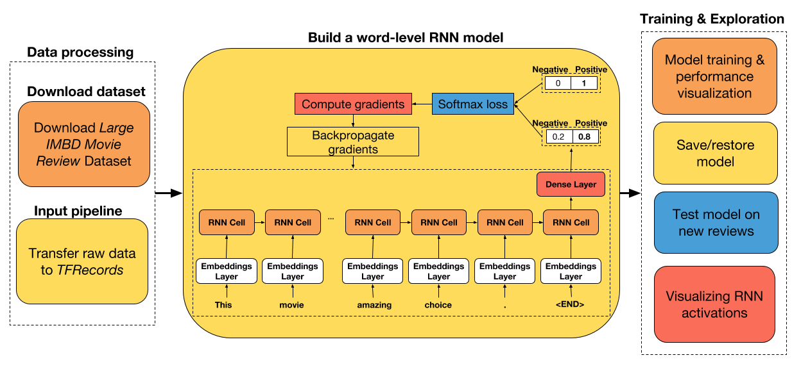
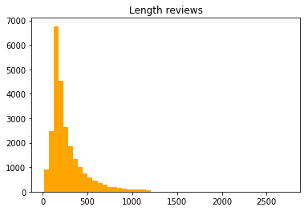
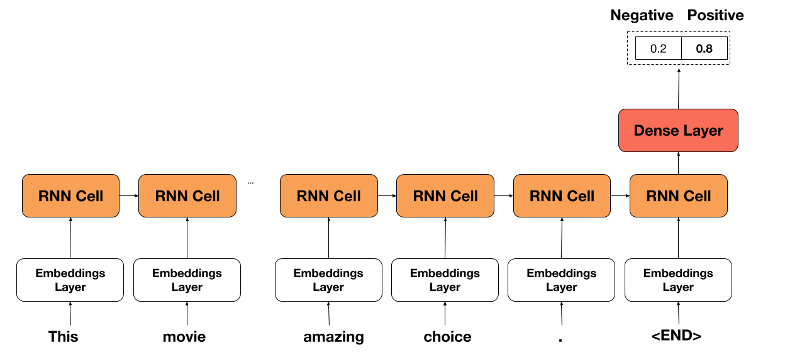
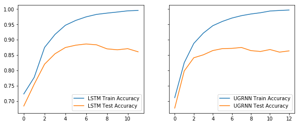
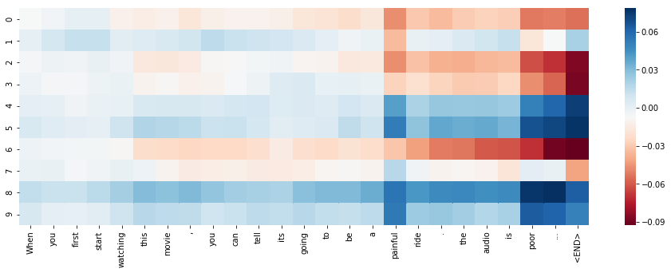

# 八、用于 TensorFlow Eager 序列分类的动态循坏神经网络

大家好！ 在本教程中，我们将构建一个循环神经网络，用于对 IMDB 电影评论进行情感分析。 我选择了这个数据集，因为它很小，很容易被任何人下载，所以数据采集没有瓶颈。

本教程的主要目的不是教你如何构建一个简单的 RNN，而是如何构建一个 RNN，为你提供模型开发的更大灵活性（例如，使用目前在 Keras 中不可用的新 RNN 单元，更容易访问 RNN 的展开输出，从磁盘批量读取数据）。 我希望能够让你看看，在你可能感兴趣的任何领域中，如何继续建立你自己的模型，不管它们有多复杂。

教程步骤



+   下载原始数据并将其转换为 TFRecords（ TensorFlow 默认文件格式）。
+   准备一个数据集迭代器，它从磁盘中批量读取数据，并自动将可变长度的输入数据填充到批量中的最大大小。
+   使用 LSTM 和 UGRNN 单元构建单词级 RNN 模型。
+   在测试数据集上比较两个单元的性能。
+   保存/恢复训练模型
+   在新评论上测试网络
+   可视化 RNN 激活

如果你想在本教程中添加任何内容，请告诉我们。 此外，我很高兴听到你的任何改进建议。

## 导入实用的库

```py
# 导入函数来编写和解析 TFRecords
from data_utils import imdb2tfrecords
from data_utils import parse_imdb_sequence

# 导入 TensorFlow 和 TensorFlow Eager
import tensorflow as tf
import tensorflow.contrib.eager as tfe

# 为数据处理导入 pandas，为数据读取导入  pickle
import pandas as pd
import pickle

# 导入绘图库
import matplotlib.pyplot as plt
%matplotlib inline

# 开启 Eager 模式。一旦开启不能撤销！只执行一次。
tfe.enable_eager_execution(device_policy=tfe.DEVICE_PLACEMENT_SILENT)
```

## 下载数据并转换为 TFRecords

或者，如果你克隆这个仓库，你将自动将下载的数据解析为 TFRecords，因此请随意跳过此步骤。

大型电影评论数据集是“二元情感分类的数据集，包含比以前的基准数据集更多的数据”（来源）。 它由 25000 个评论的训练数据集（12500 个正面和 125000 个负面）和 25000 个评论的测试数据集（12500 个正面和 125000 个负面）组成。

以下是正面评论的示例：

> Rented the movie as a joke. My friends and I had so much fun laughing at it that I went and found a used copy and bought it for myself. Now when all my friends are looking for a funny movie I give them Sasquatch Hunters. It needs to be said though there is a rule that was made that made the movie that much better. No talking is allowed while the movie is on unless the words are Sasquatch repeated in a chant. I loved the credit at the end of the movie as well. "Thanks for the Jeep, Tom!" Whoever Tom is I say thank you because without your Jeep the movie may not have been made. In short a great movie if you are looking for something to laugh at. If you want a good movie maybe look for something else but if you don't mind a laugh at the expense of a man in a monkey suit grab yourself a copy.

以下是负面评论的示例：

> The Good: I liked this movie because it was the first horror movie I've seen in a long time that actually scared me. The acting wasn't too bad, and the "Cupid" killer was believable and disturbing. The Bad: The story line and plot of this movie is incredibly weak. There just wasn't much to it. The ways the killer killed his victims was very horrifying and disgusting. I do not recommend this movie to anyone who can not handle gore. Overall: A good scare, but a bad story.

为了下载数据集，只需在终端中执行：

```
chmod o+x datasets/get_imdb_dataset.sh
datasets/get_imdb_dataset.sh
```

让我们来看看评论长度的分布（单词/评论）：

```py
length_reviews = pickle.load(open('datasets/aclImdb/length_reviews.pkl', 'rb'))
pd.DataFrame(length_reviews, columns=['Length reviews']).hist(bins=50, color='orange');
plt.grid(False);
```



似乎大多数评论都有大约 250 个单词。 然而，由于一些相当长的评论，分布似乎有一个很长的尾巴。 由于我们必须将可变长度输入序列填充到批量中的最大序列，因此保留这些评论将是非常低效的。

因此，我在`imdb2tfrecords`函数中添加了一个参数，你可以在其中指定评论中允许的最大字数。 这将简单地采用评论中的最后一个`max_words`来提高训练效率，并避免在很多时间步长内展开神经网络，这可能导致内存问题。

下载数据集后，只需运行`imdb2tfrecords`函数即可。 此函数将每个评论解析为单词索引列表。

```py
# 用于将原始数据转换为 TFRecords 的函数，将评论中每个单词转换为整数索引
#imdb2tfrecords(path_data='datasets/aclImdb/', min_word_frequency=5, max_words_review=700)
```

处理结束时，每个`tfrecord`将由以下内容组成：


| TFrecord | 描述 |
| --- | --- |
| 'token_indexes' | 评论中出现的单词索引的序列 |
| 'target' | 负面情感为 0，正面情感为 1 |
| 'sequence_length' | 评论的序列长度 |

如果你想使用新数据集测试此 RNN 网络，请查看`data_utils.py`脚本中的`imdb2tfrecords`或`parse_imdb_sequence`，来了解如何将新数据解析为 TFRecords。 我真的建议使用这种文件格式，因为它非常容易处理非常大的数据集，而不受 RAM 容量的限制。

## 创建训练和测试迭代器

```py
train_dataset = tf.data.TFRecordDataset('datasets/aclImdb/train.tfrecords')
train_dataset = train_dataset.map(parse_imdb_sequence).shuffle(buffer_size=10000)
train_dataset = train_dataset.padded_batch(512, padded_shapes=([None],[],[]))

test_dataset = tf.data.TFRecordDataset('datasets/aclImdb/test.tfrecords')
test_dataset = test_dataset.map(parse_imdb_sequence).shuffle(buffer_size=10000)
test_dataset = test_dataset.padded_batch(512, padded_shapes=([None],[],[]))

# 读取词汇表
word2idx = pickle.load(open('datasets/aclImdb/word2idx.pkl', 'rb'))
```

## 用于序列分类的 RNN 模型，兼容 Eager API

在下面的单元格中，你可以找到我为 RNN 模型创建的类。 API 与我在上一个教程中创建的 API 非常相似，只是现在我们跟踪模型的准确率而不是损失。

网络的想法非常简单。 我们只需在评论中选择每个单词，选择相应的单词嵌入（在开头随机初始化），然后将其传递给 RNN 单元。 然后，我们在序列的末尾获取 RNN 单元的输出并将其传递通过密集层（具有 ReL U激活）来获得最终预测。

通常，网络继承自`tf.keras.Model`，以便跟踪所有变量并轻松保存/恢复它们。



```py
class RNNModel(tf.keras.Model):
    def __init__(self, embedding_size=100, cell_size=64, dense_size=128, 
                 num_classes=2, vocabulary_size=None, rnn_cell='lstm',
                 device='cpu:0', checkpoint_directory=None):
        ''' 定义在正向传播期间使用的参数化层，你要在其上运行计算的设备，以及检查点目录。另外，你还可以修改网络的默认大小。
            
            Args:
                embedding_size: the size of the word embedding.
                cell_size: RNN cell size.
                dense_size: the size of the dense layer.
                num_classes: the number of labels in the network.
                vocabulary_size: the size of the word vocabulary.
                rnn_cell: string, either 'lstm' or 'ugrnn'.
                device: string, 'cpu:n' or 'gpu:n' (n can vary). Default, 'cpu:0'.
                checkpoint_directory: the directory where you would like to save or 
                                      restore a model.
        '''
        super(RNNModel, self).__init__()
        
        # 权重初始化函数
        w_initializer = tf.contrib.layers.xavier_initializer()
    
        # 偏置初始化函数
        b_initializer = tf.zeros_initializer()
        
        # 为单词嵌入初始化权重
        self.embeddings = tf.keras.layers.Embedding(vocabulary_size, embedding_size, 
                                                    embeddings_initializer=w_initializer)
        
        # 密集层的初始化
        self.dense_layer = tf.keras.layers.Dense(dense_size, activation=tf.nn.relu, 
                                                 kernel_initializer=w_initializer, 
                                                 bias_initializer=b_initializer)
        
        # 预测层的初始化
        self.pred_layer = tf.keras.layers.Dense(num_classes, activation=None, 
                                                kernel_initializer=w_initializer, 
                                                bias_initializer=b_initializer)
        
        # 基本的 LSTM 单元
        if rnn_cell=='lstm':
            self.rnn_cell = tf.nn.rnn_cell.BasicLSTMCell(cell_size)
        # 否则是 UGRNN 单元
        else:
            self.rnn_cell = tf.contrib.rnn.UGRNNCell(cell_size)
            
        # 定义设备 
        self.device = device
        
        # 定义检查点目录
        self.checkpoint_directory = checkpoint_directory
        
    def predict(self, X, seq_length, is_training):
        '''
        基于输入样本，预测每个类的概率

        Args:
            X: 2D tensor of shape (batch_size, time_steps).
            seq_length: the length of each sequence in the batch.
            is_training: Boolean. Either the network is predicting in
                         training mode or not.
        '''
        
        # 获取批量中的样本量
        num_samples = tf.shape(X)[0]

        # 初始化 LSTM 单元状态为零
        state = self.rnn_cell.zero_state(num_samples, dtype=tf.float32)
        
        # 获取序列中每个词的嵌入
        embedded_words = self.embeddings(X)
        
        # 分割嵌入
        unstacked_embeddings = tf.unstack(embedded_words, axis=1)
        
        # 遍历每个时间步长并附加预测
        outputs = []
        for input_step in unstacked_embeddings:
            output, state = self.rnn_cell(input_step, state)
            outputs.append(output)
            
        # 将输出堆叠为（批量大小，时间步长，单元数）
        outputs = tf.stack(outputs, axis=1)
        
        # 对于每个样本，提取最后一个时间步骤的输出
        idxs_last_output = tf.stack([tf.range(num_samples), 
                                     tf.cast(seq_length-1, tf.int32)], axis=1)
        final_output = tf.gather_nd(outputs, idxs_last_output)
        
        # 为正则化添加 dropout
        dropped_output = tf.layers.dropout(final_output, rate=0.3, training=is_training)
        
        # 向密集层（ReLU 激活）传入最后单元的状态
        dense = self.dense_layer(dropped_output)
        
        # 计算非标准化的对数概率
        logits = self.pred_layer(dense)
        return logits
    
    def loss_fn(self, X, y, seq_length, is_training):
        """ 定义训练期间使用的损失函数        
        """
        preds = self.predict(X, seq_length, is_training)
        loss = tf.losses.sparse_softmax_cross_entropy(labels=y, logits=preds)
        return loss
    
    def grads_fn(self, X, y, seq_length, is_training):
        """ 在每个正向步骤中，
            动态计算损失值对模型参数的梯度
        """
        with tfe.GradientTape() as tape:
            loss = self.loss_fn(X, y, seq_length, is_training)
        return tape.gradient(loss, self.variables)
    
    def restore_model(self):
        """ 用于恢复训练模型的函数
        """
        with tf.device(self.device):
            # 运行模型一次来初始变量
            dummy_input = tf.constant(tf.zeros((1,1)))
            dummy_length = tf.constant(1, shape=(1,))
            dummy_pred = self.predict(dummy_input, dummy_length, False)
            # 恢复模型变量
            saver = tfe.Saver(self.variables)
            saver.restore(tf.train.latest_checkpoint
                          (self.checkpoint_directory))
    
    def save_model(self, global_step=0):
        """ 用于保存训练模型的函数
        """
        tfe.Saver(self.variables).save(self.checkpoint_directory, 
                                       global_step=global_step)   
        
    def fit(self, training_data, eval_data, optimizer, num_epochs=500, 
            early_stopping_rounds=10, verbose=10, train_from_scratch=False):
        """ 用于训练模型的函数，
            使用所选的优化器，执行所需数量的迭代
            你可以从零开始训练，或者加载最后训练的模型
            使用了提前停止来降低网络的过拟合风险
            
            Args:
                training_data: the data you would like to train the model on.
                                Must be in the tf.data.Dataset format.
                eval_data: the data you would like to evaluate the model on.
                            Must be in the tf.data.Dataset format.
                optimizer: the optimizer used during training.
                num_epochs: the maximum number of iterations you would like to 
                            train the model.
                early_stopping_rounds: stop training if the accuracy on the eval 
                                       dataset does not increase after n epochs.
                verbose: int. Specify how often to print the loss value of the network.
                train_from_scratch: boolean. Whether to initialize variables of the
                                    the last trained model or initialize them
                                    randomly.
        """ 
    
        if train_from_scratch==False:
            self.restore_model()
        
        # 初始化 best_acc。这个变量储存最高的准确率。
        # on the eval dataset.
        best_acc = 0
        
        # 初始化类别来更新训练和评估的平均准确率
        train_acc = tfe.metrics.Accuracy('train_acc')
        eval_acc = tfe.metrics.Accuracy('eval_acc')
        
        # 初始化字典来存储准确率历史
        self.history = {}
        self.history['train_acc'] = []
        self.history['eval_acc'] = []
        
        # 开始训练
        with tf.device(self.device):
            for i in range(num_epochs):
                # 使用梯度下降来训练
                for X, y, seq_length in tfe.Iterator(training_data):
                    grads = self.grads_fn(X, y, seq_length, True)
                    optimizer.apply_gradients(zip(grads, self.variables))
                    
                # 检查训练集的准确率
                for X, y, seq_length in tfe.Iterator(training_data):
                    logits = self.predict(X, seq_length, False)
                    preds = tf.argmax(logits, axis=1)
                    train_acc(preds, y)
                self.history['train_acc'].append(train_acc.result().numpy())
                # 重置指标
                train_acc.init_variables()

                # 检查评估集的准确率
                for X, y, seq_length in tfe.Iterator(eval_data):
                    logits = self.predict(X, seq_length, False)
                    preds = tf.argmax(logits, axis=1)
                    eval_acc(preds, y)
                self.history['eval_acc'].append(eval_acc.result().numpy())
                # 重置指标
                eval_acc.init_variables()
                
                # 打印训练和评估准确率
                if (i==0) | ((i+1)%verbose==0):
                    print('Train accuracy at epoch %d: ' %(i+1), self.history['train_acc'][-1])
                    print('Eval accuracy at epoch %d: ' %(i+1), self.history['eval_acc'][-1])

                # 为提前停止而检查
                if self.history['eval_acc'][-1]>best_acc:
                    best_acc = self.history['eval_acc'][-1]
                    count = early_stopping_rounds
                else:
                    count -= 1
                if count==0:
                    break
```

## 使用梯度下降和提前停止来训练模型

### 使用简单的 LSTM 单元来训练模型

```py
# 指定你打算存储/恢复训练变量的路径
checkpoint_directory = 'models_checkpoints/ImdbRNN/'

# 如果可用，则使用 GPU
device = 'gpu:0' if tfe.num_gpus()>0 else 'cpu:0'

# 定义优化器
optimizer = tf.train.AdamOptimizer(learning_rate=1e-4)

# 初始化模型，还没有初始化变量
lstm_model = RNNModel(vocabulary_size=len(word2idx), device=device, 
                      checkpoint_directory=checkpoint_directory)
                      
# 训练模型
lstm_model.fit(train_dataset, test_dataset, optimizer, num_epochs=500, 
                early_stopping_rounds=5, verbose=1, train_from_scratch=True)
'''
Train accuracy at epoch 1:  0.72308
Eval accuracy at epoch 1:  0.68372
Train accuracy at epoch 2:  0.77708
Eval accuracy at epoch 2:  0.75472
Train accuracy at epoch 3:  0.875
Eval accuracy at epoch 3:  0.82036
Train accuracy at epoch 4:  0.91728
Eval accuracy at epoch 4:  0.8542
Train accuracy at epoch 5:  0.94728
Eval accuracy at epoch 5:  0.87464
Train accuracy at epoch 6:  0.96312
Eval accuracy at epoch 6:  0.88228
Train accuracy at epoch 7:  0.97476
Eval accuracy at epoch 7:  0.88624
Train accuracy at epoch 8:  0.9828
Eval accuracy at epoch 8:  0.88344
Train accuracy at epoch 9:  0.98692
Eval accuracy at epoch 9:  0.87036
Train accuracy at epoch 10:  0.99052
Eval accuracy at epoch 10:  0.86724
Train accuracy at epoch 11:  0.9944
Eval accuracy at epoch 11:  0.87088
Train accuracy at epoch 12:  0.99568
Eval accuracy at epoch 12:  0.86068
'''

# 保存模型
lstm_model.save_model()
```

### 使用 UGRNN 单元训练模型

```py
# 定义优化器
optimizer = tf.train.AdamOptimizer(learning_rate=1e-4)

# 初始化模型，还没有初始化变量
ugrnn_model = RNNModel(vocabulary_size=len(word2idx), rnn_cell='ugrnn', 
                       device=device, checkpoint_directory=checkpoint_directory)

# 训练模型
ugrnn_model.fit(train_dataset, test_dataset, optimizer, num_epochs=500, 
                early_stopping_rounds=5, verbose=1, train_from_scratch=True)
'''
Train accuracy at epoch 1:  0.71092
Eval accuracy at epoch 1:  0.67688
Train accuracy at epoch 2:  0.82512
Eval accuracy at epoch 2:  0.7982
Train accuracy at epoch 3:  0.88792
Eval accuracy at epoch 3:  0.84116
Train accuracy at epoch 4:  0.92156
Eval accuracy at epoch 4:  0.85076
Train accuracy at epoch 5:  0.94592
Eval accuracy at epoch 5:  0.86476
Train accuracy at epoch 6:  0.95984
Eval accuracy at epoch 6:  0.87104
Train accuracy at epoch 7:  0.9708
Eval accuracy at epoch 7:  0.87188
Train accuracy at epoch 8:  0.9786
Eval accuracy at epoch 8:  0.8748
Train accuracy at epoch 9:  0.98412
Eval accuracy at epoch 9:  0.86452
Train accuracy at epoch 10:  0.9882
Eval accuracy at epoch 10:  0.86172
Train accuracy at epoch 11:  0.9938
Eval accuracy at epoch 11:  0.86808
Train accuracy at epoch 12:  0.9956
Eval accuracy at epoch 12:  0.8596
Train accuracy at epoch 13:  0.997
Eval accuracy at epoch 13:  0.86368
'''
```

### 表现比较

```py
f, (ax1, ax2) = plt.subplots(1, 2, sharey=True, figsize=(10, 4))
ax1.plot(range(len(lstm_model.history['train_acc'])), lstm_model.history['train_acc'], 
         label='LSTM Train Accuracy');
ax1.plot(range(len(lstm_model.history['eval_acc'])), lstm_model.history['eval_acc'], 
         label='LSTM Test Accuracy');
ax2.plot(range(len(ugrnn_model.history['train_acc'])), ugrnn_model.history['train_acc'],
         label='UGRNN Train Accuracy');
ax2.plot(range(len(ugrnn_model.history['eval_acc'])), ugrnn_model.history['eval_acc'],
         label='UGRNN Test Accuracy');
ax1.legend();
ax2.legend();
```



## 在新评论上测试网络

我认为最近在 IMDb 上发布的新评论测试网络会很不错。 我选择了 2018 年 2 月为电影 Bad Apples 发布的三条评论。 随意试试新的评论或自己发布一个新的评论！ 网络能在所有三种情况下正确识别情感，所以我印象非常深刻。

```py
################################################################
# 恢复训练模型
################################################################
tf.reset_default_graph()
checkpoint_directory = 'models_checkpoints/ImdbRNN/'
device = 'gpu:0' if tfe.num_gpus()>0 else 'cpu:0'
lstm_model = RNNModel(vocabulary_size=len(word2idx), device=device, 
                      checkpoint_directory=checkpoint_directory)
lstm_model.restore_model()
# INFO:tensorflow:Restoring parameters from models_checkpoints/ImdbRNN/-0

###############################################################
# 导入/下载必要的库来处理新的序列
###############################################################
import nltk
try:
    nltk.data.find('tokenizers/punkt')
except LookupError:
    nltk.download('punkt')
from nltk.tokenize import word_tokenize
import re

def process_new_review(review):
    '''用于处理新评论的函数
       Args:
           review: original text review, string.
       Returns:
           indexed_review: sequence of integers, words correspondence 
                           from word2idx.
           seq_length: the length of the review.
    '''
    indexed_review = re.sub(r'<[^>]+>', ' ', review)
    indexed_review = word_tokenize(indexed_review)
    indexed_review = [word2idx[word] if word in list(word2idx.keys()) else 
                      word2idx['Unknown_token'] for word in indexed_review]
    indexed_review = indexed_review + [word2idx['End_token']]
    seq_length = len(indexed_review)    
    return indexed_review, seq_length
    
sent_dict = {0: 'negative', 1: 'positive'}

review_score_10 = "I think Bad Apples is a great time and I recommend! I enjoyed the opening, which gave way for the rest of the movie to occur. The main couple was very likable and I believed all of their interactions. They had great onscreen chemistry and made me laugh quite a few times! Keeping the girls in the masks but seeing them in action was something I loved. It kept a mystery to them throughout. I think the dialogue was great. The kills were fun. And the special surprise gore effect at the end was AWESOME!! I won't spoil that part ;) I also enjoyed how the movie wrapped up. It gave a very urban legends type feel of \"did you ever hear the story...\". Plus is leaves the door open for another film which I wouldn't mind at all. Long story short, I think if you take the film for what it is; a fun little horror flick, then you won't be disappointed! HaPpY eArLy HaLLoWeEn!"

review_score_4 = "A young couple comes to a small town, where the husband get a job working in a hospital. The wife which you instantly hate or dislike works home, at the same time a horrible murders takes place in this small town by two masked killers. Bad Apples is just your tipical B-horror movie with average acting (I give them that. Altough you may get the idea that some of the actors are crazy-convervative Christians), but the script is just bad, and that's what destroys the film."

review_score_1 = "When you first start watching this movie, you can tell its going to be a painful ride. the audio is poor...the attacks by the \"girls\" are like going back in time, to watching the old rocky films, were blows never touched. the editing is poor with it aswell, example the actress in is the bath when her husband comes home, clearly you see her wearing a flesh coloured bra in the bath. no hints or spoilers, just wait till you find it in a bargain basket of cheap dvds in a couple of weeks"

new_reviews = [review_score_10, review_score_4, review_score_1]
scores = [10, 4, 1]

with tf.device(device):
    for original_review, score in zip(new_reviews, scores):
        indexed_review, seq_length = process_new_review(original_review)
        indexed_review = tf.reshape(tf.constant(indexed_review), (1,-1))
        seq_length = tf.reshape(tf.constant(seq_length), (1,))
        logits = lstm_model.predict(indexed_review, seq_length, False)
        pred = tf.argmax(logits, axis=1).numpy()[0]
        print('The sentiment for the review with score %d was found to be %s'
              %(score, sent_dict[pred]))
'''

The sentiment for the review with score 10 was found to be positive
The sentiment for the review with score 4 was found to be negative
The sentiment for the review with score 1 was found to be negative
'''
```

## 展示 RNN 单元的激活

本教程的部分内容受到了 Karpathy 在[《可视化和理解循坏神经网络》](https://arxiv.org/abs/1506.02078)中的工作的启发。

我们将使用`seaborn`库绘制热图。 你可以通过在终端输入这个来获取它：

```
pip install seaborn
```

```py
# 导入用于 RNN 可视化的库
import seaborn as sns

def VisualizeRNN(model, X):
    ''' 返回每个时间步骤的单元状态的 tanh 的函数
        
        Args:
            model: trained RNN model.
            X: indexed review of shape (1, sequence_length).
            
        Returns:
            tanh(cell_states): the tanh of the memory cell at each timestep.       
    '''
    
    # 初始化 LSTM 单元状态为零
    state = model.rnn_cell.zero_state(1, dtype=tf.float32)
    
    # 获取序列中每个词的嵌入
    embedded_words = model.embeddings(X)

    # 分割嵌入
    unstacked_embeddings = tf.unstack(embedded_words, axis=1)

    # 遍历每个时间步骤，附加它的单元状态
    cell_states = []
    for input_step in unstacked_embeddings:
        _, state = model.rnn_cell(input_step, state)
        cell_states.append(state[0])
        
    # 将 cell_states 堆叠为（批量大小，时间步长，单元数量）
    cell_states = tf.stack(cell_states, axis=1)
    return tf.tanh(cell_states)
    
# 随意修改输入 
dummy_review = "When you first start watching this movie, you can tell its going to be a painful ride. the audio is poor..."


# 处理新的评论
indexed_review, seq_length = process_new_review(dummy_review)
indexed_review = tf.reshape(tf.constant(indexed_review), (1,-1))

# 获取单元状态
cell_states = VisualizeRNN(lstm_model, indexed_review)


# 绘制单元中前 10 个单元的激活（总共有 64 个单元）
plt.figure(figsize = (16,5))
sns.heatmap(cell_states.numpy()[0,:,:10].T, 
            xticklabels=word_tokenize(dummy_review)+['<END>'],
            cmap='RdBu');
```


