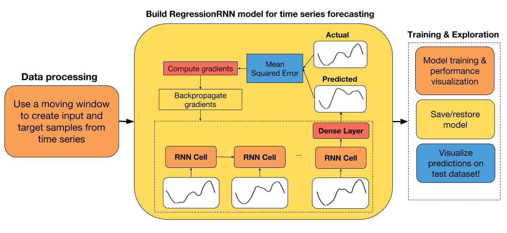
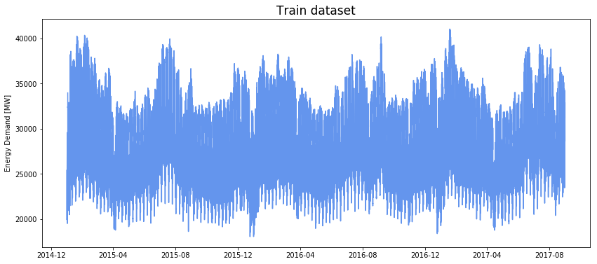
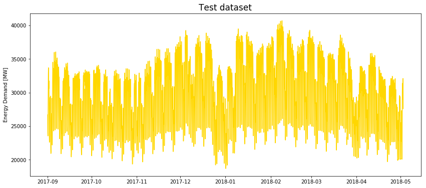
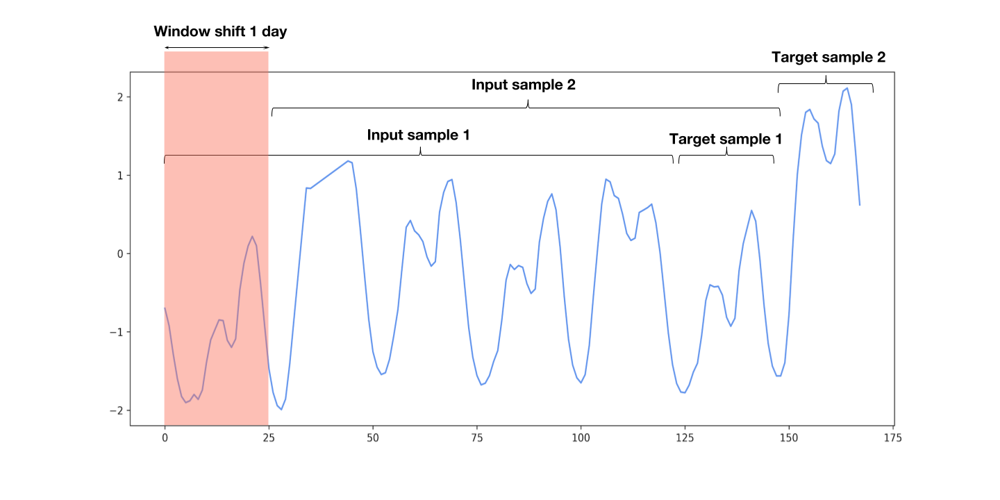
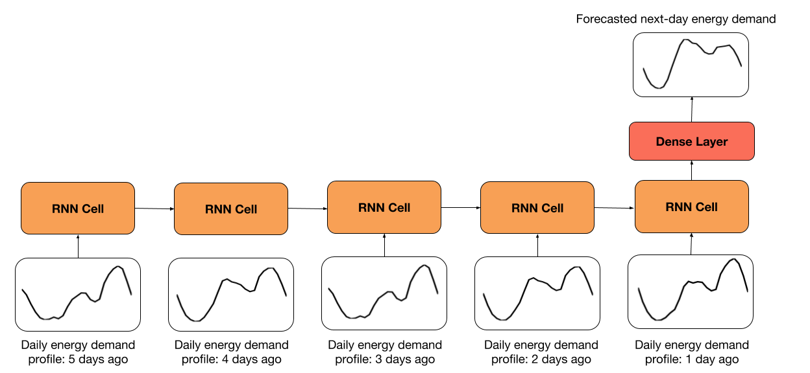
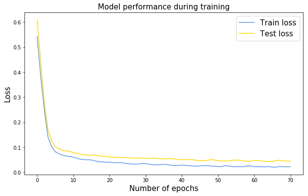
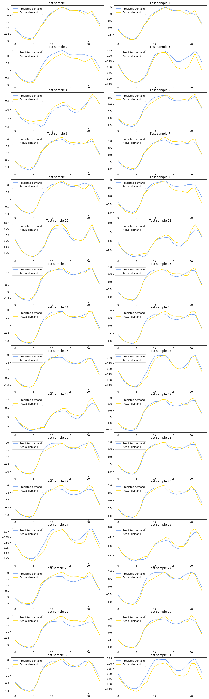

# 九、用于 TensorFlow Eager 时间序列回归的递归神经网络

大家好！ 在本教程中，我们将探讨如何为时间序列回归构建循环神经网络。 由于我的背景在电力系统中，我认为最好包括该领域相关的教程。 因此，在本教程中，我们将构建一个用于能源需求预测的 RNN。

为了预测第二天的能源需求，我们将使用 ENTSO-E 提供的每小时能耗数据。 我选择使用来自西班牙的数据，因为我目前住在这里。 然而，相同的分析可以应用于来自任何国家的能耗数据。

教程步骤



+   ENTSO-E 能源需求数据的探索性数据分析
+   创建训练和测试数据集
+   处理原始数据来创建输入和标签样本
+   为回归创建 RNN 类
+   从头开始或从以前的检查点使用梯度下降训练模型
+   展示测试集上的预测值和实际值之间的差异

如果你想在本教程中添加任何内容，请告诉我们。 此外，我很高兴听到你的任何改进建议。

## 导入有用的库

```py

# 导入 TensorFlow 和 TensorFlow Eager
import tensorflow.contrib.eager as tfe
import tensorflow as tf

# 导入用于数据处理的库
from sklearn.preprocessing import StandardScaler
from datetime import datetime as dt
import pandas as pd
import numpy as np

# 导入绘图库
import matplotlib.pyplot as plt
%matplotlib inline

# 开启 Eager 模式。一旦开启不能撤销！只执行一次。
tfe.enable_eager_execution(device_policy=tfe.DEVICE_PLACEMENT_SILENT)
```

## 探索性数据分析

可以在文件夹datasets / load_forecasting中找到本教程中使用的数据集。 我们读取它，来看看吧！

```py
energy_df = pd.read_csv('datasets/load_forecasting/spain_hourly_entsoe.csv')
energy_df.tail(2)
```

|  | Time (CET) | Day-ahead Total Load Forecast [MW] - BZN|ES | Actual Total Load [MW] - BZN|ES |
| --- | --- | --- | --- |
| 29230 | 02.05.2018 22:00 - 02.05.2018 23:00 | 30187.0 | 30344.0 |
| 29231 | 02.05.2018 23:00 - 03.05.2018 00:00 | 27618.0 | 27598.0 |

```py
# 重命名行
energy_df.columns = ['time', 'forecasted_load', 'actual_load']

# 从 'Time (CET)' 中提取日期和时间
energy_df['date'] = energy_df['time'].apply(lambda x: dt.strptime(x.split('-')[0].strip(), '%d.%m.%Y %H:%M'))
```

如你所见，数据集附带每个测量的时间戳，特定小时的实际能量需求，以及预测值。 对于我们的任务，我们只使用`Actual Total Load [MW]`列。

```py

printprint(('The date of the first measurement: ''The da , energy_df.loc[0, 'time'])
# The date of the first measurement:  01.01.2015 00:00 - 01.01.2015 01:00

print('The date of the last measurement: ', energy_df.loc[len(energy_df)-1, 'time'])
# The date of the last measurement:  02.05.2018 23:00 - 03.05.2018 00:00
```

该数据集包括从 2015 年 1 月 1 日到 2018 年 5 月 2 日的每小时能耗数据。最近的数据！

## 从时间序列数据创建输入和标签样本

### 将数据分割为训练/测试数据集

数据处理的第一步是从原始数据创建训练和测试数据集。 我选择将 80% 的数据保留在训练集中，20% 保留在测试集中。 通过修改`train_size`变量，随意调整此参数。

```py
# 将数据分割为训练和测试数据集
train_size = 0.8
end_train = int(len(energy_df)*train_size/24)*24
train_energy_df = energy_df.iloc[:end_train,:]
test_energy_df = energy_df.iloc[end_train:,:]

# 绘制训练集 
plt.figure(figsize=(14,6))
plt.plot(train_energy_df['date'], train_energy_df['actual_load'], color='cornflowerblue');
plt.title('Train dataset', fontsize=17);
plt.ylabel('Energy Demand [MW]');
```



```py

# 绘制测试集
plt.figure(figsize=(14,6))
plt.plot(test_energy_df['date'], test_energy_df['actual_load'], color='gold');
plt.title('Test dataset', fontsize=17);
plt.ylabel('Energy Demand [MW]');
```



### 缩放数据集

数据被标准化后，神经网络工作得更好，收敛速度更快。 对于此任务，我选择使用零均值和单位方差对数据进行标准化，因为我发现这对 LSTM 更有效。 你还可以尝试使用`MinMaxScaler`对数据进行标准化，看看是否可以获得更好的结果。

```py
# 为缺失的度量进行差值
train_energy_df = train_energy_df.interpolate(limit_direction='both')
test_energy_df = test_energy_df.interpolate(limit_direction='both')

scaler = StandardScaler().fit(train_energy_df['actual_load'][:,None])
train_energy_df['actual_load'] = scaler.transform(train_energy_df['actual_load'][:,None])
test_energy_df['actual_load'] = scaler.transform(test_energy_df['actual_load'][:,None])
```

### 创建滑动窗口样本

你可以在我创建的函数下面的代码单元格中找到，从时间序列数据生成输入和标签样本。 每个 RNN 单元中的输入是一天的每小时数据。 时间步数由`look_back`变量定义，该变量指定要回顾的天数。 默认值为 5 天，这意味着 RNN 将展开 5 个步骤。

你还可以指定预测的天数，默认为一天。

输入和标签样本是基于`look_back`和`predict_ahead`变量创建的，如下图所示。



```py
def moving_window_samples(timeseries, look_back=5, predict_ahead=1):
    '''
    用于从时间序列创建输入和标签样本的函数，延迟为一天。
    
    Args:
        timeseries: timeseries dataset.
        look_back: the size of the input. Specifies how many days to look back.
        predict_ahead: size of the output. Specifies how many days to predict ahead.
    
    Returns:
        input_samples: the input samples createad from the timeseries, 
                       using a window shift of one day.
        target_samples: the target corresponding to each input sample.
    '''
    
    n_strides = int((len(timeseries)- predict_ahead*24 - look_back*24 + 24)/24)
    input_samples = np.zeros((n_strides, look_back*24))
    target_samples = np.zeros((n_strides, predict_ahead*24))
    for i in range(n_strides):
        end_input = i*24 + look_back*24
        input_samples[i,:] = timeseries[i*24:end_input]
        target_samples[i,:] = timeseries[end_input:(end_input + predict_ahead*24)]  
        
    # 将输入形状修改为（样本数，时间步长，输入维度）
    input_samples = input_samples.reshape((-1, look_back, 24))
    return input_samples.astype('float32'), target_samples.astype('float32')

train_input_samples, train_target_samples = moving_window_samples(train_energy_df['actual_load'],
                                                                  look_back=5, predict_ahead=1)
                                                                  
test_input_samples, test_target_samples = moving_window_samples(test_energy_df['actual_load'],
                                                                look_back=5, predict_ahead=1)
```

### 使用`tf.data.Dataset`创建训练和测试数据集

通常，我们使用`tf.data.Dataset` API 将数据传输到张量。 我选择了 64 的批量大小，但随意调整它。 在训练网络时，我们可以使用`tfe.Iterator`函数非常轻松地遍历这些数据集。

```py
# 随意修改批量大小
# 通常较小的批量大小在测试集上获得更好的结果
batch_size = 64
train_dataset = (tf.data.Dataset.from_tensor_slices(
    (train_input_samples, train_target_samples)).batch(batch_size))
test_dataset = (tf.data.Dataset.from_tensor_slices(
    (test_input_samples, test_target_samples)).batch(batch_size))
```

## 兼容 Eager API 的 RNN 回归模型

RNN 模型的类与以前的模型非常相似。 在初始化期间，我们定义了正向传播中所需的所有层。 我们还可以指定要在其上执行计算的设备，以及我们希望恢复或保存模型变量的文件路径。 该模型继承自`tf.keras.Model`，以便跟踪所有变量。

该模型的架构非常简单。 我们只需获取最后`look_back`天的每小时数据，然后将其传给 RNN。 最终输出传给了带有 ReLU 激活的密集层。 输出层大小由`predict_ahead`变量定义。 在我们的例子中，输出大小是 24 个单元，因为我们预测第二天的能源需求。



```py
class RegressionRNN(tf.keras.Model):
    def __init__(self, cell_size=64, dense_size=128, predict_ahead=1, 
                 device='cpu:0', checkpoint_directory=None):
        ''' 定义在正向传播期间使用的参数化层，你要在上面运行计算的设备以及检查点目录。 另外，你还可以修改网络的默认大小。
            
            Args:
                cell_size: RNN cell size.
                dense_size: the size of the dense layer.
                predict_ahead: the number of days you would like to predict ahead.
                device: string, 'cpu:n' or 'gpu:n' (n can vary). Default, 'cpu:0'.
                checkpoint_directory: the directory where you would like to 
                                      save/restore a model.
        '''
        super(RegressionRNN, self).__init__()
        
        # 权重初始化函数
        w_initializer = tf.contrib.layers.xavier_initializer()
    
        # 偏置初始化函数
        b_initializer = tf.zeros_initializer()
        
        # 密集层初始化
        self.dense_layer = tf.keras.layers.Dense(dense_size, activation=tf.nn.relu, 
                                                 kernel_initializer=w_initializer, 
                                                 bias_initializer=b_initializer)
        
        # 预测层初始化
        self.pred_layer = tf.keras.layers.Dense(predict_ahead*24, activation=None, 
                                                kernel_initializer=w_initializer, 
                                                bias_initializer=b_initializer)
        
        # 基本的 LSTM 单元
        self.rnn_cell = tf.nn.rnn_cell.BasicLSTMCell(cell_size)
        
        # 定义设备
        self.device = device
        
        # 定义检查点目录
        self.checkpoint_directory = checkpoint_directory
        
    def predict(self, X):
        '''
        在网络上执行正向传播

        Args:
            X: 3D tensor of shape (batch_size, timesteps, input_dimension).
        
        Returns:
            preds: the final predictions of the network.
        '''
        
        # 获取一个批量的样本数量
        num_samples = tf.shape(X)[0]

        # 初始化 LSTM 单元状态为零
        state = self.rnn_cell.zero_state(num_samples, dtype=tf.float32)
        
        # 分割输入
        unstacked_input = tf.unstack(X, axis=1)
        
        # 遍历每个时间步骤
        for input_step in unstacked_input:
            output, state = self.rnn_cell(input_step, state)
        
        # 将最后一个单元状态传给密集层（ReLU 激活）
        dense = self.dense_layer(output)
        
        # 计算最终的预测
        preds = self.pred_layer(dense)
        return preds
    
    def loss_fn(self, X, y):
        """ 定义训练期间使用的损失函数
        """
        preds = self.predict(X)
        loss = tf.losses.mean_squared_error(y, preds)
        return loss
    
    def grads_fn(self, X, y):
        """ 在每个正向步骤中，
            动态计算损失值对模型参数的梯度
        """
        with tfe.GradientTape() as tape:
            loss = self.loss_fn(X, y)
        return tape.gradient(loss, self.variables)
    
    def restore_model(self):
        """ 用于恢复训练模型的函数
        """
        with tf.device(self.device):
            # 运行模型一次来初始化变量
            dummy_input = tf.constant(tf.zeros((1, 5, 24)))
            dummy_pred = self.predict(dummy_input)
            # 恢复模型变量
            saver = tfe.Saver(self.variables)
            saver.restore(tf.train.latest_checkpoint
                          (self.checkpoint_directory))
    
    def save_model(self, global_step=0):
        """ 用于保存训练模型的函数
        """
        tfe.Saver(self.variables).save(self.checkpoint_directory, 
                                       global_step=global_step)   
        
    def fit(self, training_data, eval_data, optimizer, num_epochs=500, 
            early_stopping_rounds=10, verbose=10, train_from_scratch=False):
        """ 用于训练模型的函数，
            使用所选的优化器，执行所需数量的迭代
            你可以从零开始训练，或者加载最后训练的模型
            使用了提前停止来降低网络的过拟合风险
            
            Args:
                training_data: the data you would like to train the model on.
                                Must be in the tf.data.Dataset format.
                eval_data: the data you would like to evaluate the model on.
                            Must be in the tf.data.Dataset format.
                optimizer: the optimizer used during training.
                num_epochs: the maximum number of iterations you would like to 
                            train the model.
                early_stopping_rounds: stop training if the loss on the eval 
                                       dataset does not decrease after n epochs.
                verbose: int. Specify how often to print the loss value of the network.
                train_from_scratch: boolean. Whether to initialize variables of the
                                    the last trained model or initialize them
                                    randomly.
        """ 
    
        if train_from_scratch==False:
            self.restore_model()
        
        # 初始化最佳损失。这个遍历储存评估数据集上的最低损失
        best_loss = 999
        
        # 初始化类别来更新训练和评估平均损失
        train_loss = tfe.metrics.Mean('train_loss')
        eval_loss = tfe.metrics.Mean('eval_loss')
        
        # 初始化目录来储存损失历史
        self.history = {}
        self.history['train_loss'] = []
        self.history['eval_loss'] = []
        
        # 开始训练
        with tf.device(self.device):
            for i in range(num_epochs):
                # 使用梯度下降来训练
                for X, y in tfe.Iterator(training_data):
                    grads = self.grads_fn(X, y)
                    optimizer.apply_gradients(zip(grads, self.variables))
                    
                # 计算一个迭代后训练数据上的损失
                for X, y in tfe.Iterator(training_data):
                    loss = self.loss_fn(X, y)
                    train_loss(loss)
                self.history['train_loss'].append(train_loss.result().numpy())
                # 重置指标
                train_loss.init_variables()
                
                # 计算一个迭代后评估数据上的损失
                for X, y in tfe.Iterator(eval_data):
                    loss = self.loss_fn(X, y)
                    eval_loss(loss)
                self.history['eval_loss'].append(eval_loss.result().numpy())
                # 重置指标
                eval_loss.init_variables()
                
                # 打印训练和评估损失
                if (i==0) | ((i+1)%verbose==0):
                    print('Train loss at epoch %d: ' %(i+1), self.history['train_loss'][-1])
                    print('Eval loss at epoch %d: ' %(i+1), self.history['eval_loss'][-1])

                # 为提前停止而检查
                if self.history['eval_loss'][-1]<best_loss:
                    best_loss = self.history['eval_loss'][-1]
                    count = early_stopping_rounds
                else:
                    count -= 1
                if count==0:
                    break
```

## 使用梯度下降来训练模型

```py
# 指定你打算保存/恢复训练变量的路径
checkpoint_directory = 'models_checkpoints/DemandRNN/'

# 如果可用，则使用 GPU
device = 'gpu:0' if tfe.num_gpus()>0 else 'cpu:0'

# 定义优化器
optimizer = tf.train.AdamOptimizer(learning_rate=1e-2)

# 实例化模型。这并不会实例化变量。
model = RegressionRNN(cell_size=16, dense_size=16, predict_ahead=1, 
                      device=device, checkpoint_directory=checkpoint_directory)

# 训练模型
model.fit(train_dataset, test_dataset, optimizer, num_epochs=500, 
          early_stopping_rounds=5, verbose=50, train_from_scratch=True)
'''
Train loss at epoch 1:  0.5420932229608297
Eval loss at epoch 1:  0.609554298222065
Train loss at epoch 50:  0.024180740118026733
Eval loss at epoch 50:  0.049175919964909554
'''

# 保存模型
model.save_model()
```

## 在训练期间展示表现

我们可以很容易地看到在模型拟合过程中自动跟踪的损失历史。

```py
plt.figure(figsize=(10, 6))
plt.plot(range(len(model.history['train_loss'])), model.history['train_loss'],
         color='cornflowerblue', label='Train loss');
plt.plot(range(len(model.history['eval_loss'])), model.history['eval_loss'], 
         color='gold', label='Test loss');
plt.title('Model performance during training', fontsize=15)
plt.xlabel('Number of epochs', fontsize=15);
plt.ylabel('Loss', fontsize=15);
plt.legend(fontsize=15);
```



## 展示测试集上的预测

这是本教程的最后一部分。 在对网络进行训练后，我们可以可展示测试数据集进行的预测。

如果你已经跳过训练，我添加了一个单元格，你可以轻松恢复已经训练过的模型。

```py
##################################################
# 恢复之前训练过的模型
##################################################
tf.reset_default_graph()
checkpoint_directory = 'models_checkpoints/DemandRNN/'
model = RegressionRNN(cell_size=16, dense_size=16, predict_ahead=1, 
                      device=device, checkpoint_directory=checkpoint_directory)
model.restore_model()
# 
INFO:tensorflow:Restoring parameters from models_checkpoints/DemandRNN/-0

###################################################
# 展示实际值和预测值
###################################################
with tf.device(device):
    # 创建输入和标签样本的迭代器
    X_test, y_test = tfe.Iterator(test_dataset).next()
    # 预测测试批量
    preds = model.predict(X_test).numpy()
    y = y_test.numpy()
    # 为一般的批量样本（32）创建子图
    f, axarr = plt.subplots(16, 2, figsize=(12, 40))
    f.tight_layout()
    # 绘制预测
    i, j = 0, 0
    for idx in range(32):
        axarr[i,j].plot(range(24), preds[idx,:], label='Predicted demand', 
                        color='cornflowerblue')
        axarr[i,j].plot(range(24), y[idx,:], label='Actual demand',
                        color='gold')
        axarr[i,j].legend()
        axarr[i,j].set_title('Test sample %d' %idx)
        if j==1:
            i += 1
            j = 0
        else:
            j += 1
```


