# (10) 基于模型的增强学习的策略训练

> 作者：[谢天](https://www.zhihu.com/people/xie-tian-55-77)
> 
> 来源：[POST 馆](https://zhuanlan.zhihu.com/c_150977189)

## 使用基于模型的增强学习训练策略

在上两篇中，我们对基于模型的深度学习进行了大致的探讨，包括如果我们已知模型信息如何进行利用来做出正确的决策（如 MCTS 和 iLQR），在不知道确切模型的情况下如何收集数据学习模型。其中在上一篇中，我们给出了收集数据学习模型的框架，并使用 iLQR（包括加入噪声成为 Linear-Gaussian）进行规划；我们分别探讨了如何训练全局模型（如高斯过程 GP，神经网络等）、如何通过控制旧轨迹和新轨迹的 KL 散度的方法在一个信赖域中训练局部模型（如线性模型），也可以用诸如贝叶斯回归的方法将全局模型作为先验更好地训练局部模型。在训练模型之外，我们讨论的控制基本上局限于 v1.5 版本以下的在线执行某些规划过程，主要是 v1.5 版本的闭环 MPC 方法，是具有相当的鲁棒性的。

在这一篇中，我们将探讨通过基于模型的增强学习算法来训练策略，如何像 v2.0 版本一样使用策略来做决策。获得一个策略有很多好处，首先使用策略来进行在线行动选择是一个轻量级的方法，远比 v1.5 的每步在线重新使用规划方法求解快；此外更重要的是，**训练策略可能有比训练模型有更好的泛化能力**（但不一定，取决于问题）。举个例子，考虑到（譬如在棒垒球中）我们去接一个球，基于模型的算法考虑物体的飞行轨迹，譬如如何受重力和风力影响，然后求解运动问题，确定落地点，然后过去接球；而事实上人类去解这个问题更简单，如我们只需要追赶这个球，保持一定的速度使得球在视野里面就行了，我们没必要关注具体的物理动态，也能接住这个球。这个例子说明了有可能使用策略的话，观测和行动之间会是一个比较简单的关系，从而训练一个不错的策略比搞清楚模型具体是什么更容易泛化，更容易提炼出某种意义上的“知识”作为策略以适应新情况：人类的接球策略可以在物体不是球的时候也通用，而根据物理模型规划计算则需要做很大变化了。

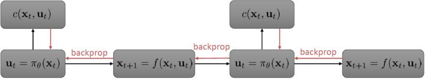

我们继续祭出之前多次使用过的计算图。这个计算图本质上体现了**策略函数**和**模型动态**影响**代价（收益）**的形式（包含了三个重要组成部分，注意这里换成最小化代价了，其实是一样的）。在 v2.0 版框架中，我们考虑使用反向传播的方法来优化策略函数**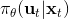**：如果这三个东西都是可微的，那么我们就可以求出代价关于的梯度（对于确定性策略更容易，对于有些随机策略也是可行的，如之前所讲的[PILCO 方法](https://link.zhihu.com/?target=http%3A//mlg.eng.cam.ac.uk/pub/pdf/DeiRas11.pdf)匹配前两阶矩），从而反向传播是可以做到的。但不幸的是，直接这样简单的做法通常并不可行。

考虑最早期的行动，最早期的行动通常对整个轨迹有非常大的影响（如上图，第一个动作变化可能会使得整条轨迹有很大的晃动），可能会影响所有后续的状态和动作，因此关于它的梯度应该是非常大的；而在后期的行动，在整个序贯决策问题中关于总代价起到的作用就比较小了，因此关于它的梯度就小：从而，这个梯度会相当病态。这个**参数敏感问题**在射击法 (shooting method) 中也同样存在，在射击法中我们同样也不使用一阶算法而使用类似 LQR 的二阶算法，但是在这里我们就不再有一个类似 LQR 的容易的二阶方法来求解这个问题了：因为引入了含参的复杂的策略函数，这些参数在整个问题中将非常纠结，因此不再能用简单的动态规划方法求解了；我们会发现，其实这样的求解序贯问题和训练 RNN 非常相似，而训练 RNN 的一个重要方法就是 BPTT：因此，训练这个问题所遇到的问题和 BPTT 中**梯度爆炸/消失的问题**本质上非常相似，但是 RNN 我们可以通过选择类似 LSTM 的表达结构来使得梯度变好，而对于我们的问题来说，系统动态是外生的客观存在的，我们只能去学习而并不能自主选择。因此我们遇到的问题相对来说更棘手。

## 引导策略搜索 (GPS)

相比射击法，搭配法 (collocation methods) 优化每个时刻的状态或者同时优化状态和行动，并使用约束来表示状态转移的关系。这样的方法相对射击法而言，就没有那么参数敏感了，但是困难在于它不是一个无约束优化问题了。有一个特点是，我们可以将策略**引入优化问题中，作为约束条件**，而不再成为射击法一样的计算图的一环，便有了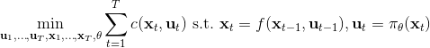（这里先假设都是确定性的）。这个表达形式还是同时优化状态和行动的，也可以只去优化状态，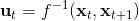，这样行动就是相邻两个状态的产物。

为了让这个问题容易求解，我们可以先把这个问题分离出来，一方面去优化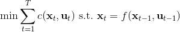，这是普通的轨迹优化问题，可以用之前讲过的 LQR 等方法进行优化；同时又施以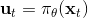的约束。为了求解这样的问题，我们使用增广拉格朗日乘子法 (augmented Lagrangian method)，非常类似于上一篇中的 DGD 算法，只是求解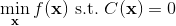问题时，拉格朗日函数变成了增广拉格朗日函数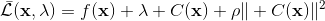，加了一个二次惩罚项，使得在严重违反约束条件时更倾向于控制约束条件以增加稳定性（这个函数最常见在 ADMM 算法中被涉及到，这个算法也算是 ADMM 的一个特例）。增广拉格朗日算法的总体框架还是和之前一样，迭代进行以下步骤：

1.  在给定拉格朗日乘子下，求解最优的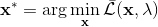。
2.  求解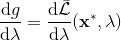。
3.  拉格朗日乘子走一个梯度步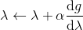。

我们记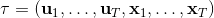，则优化问题可以简写为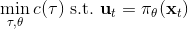。它的增广拉格朗日函数可以写成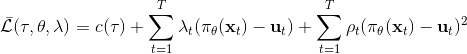。这个函数有两块未知参数和一块乘子，因此考虑形式上非常接近于 ADMM 的这样一个算法：

1.  固定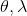，使用诸如 iLQR 的方法优化轨迹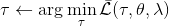。
2.  固定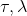，使用诸如 SGD 的方法优化策略参数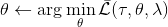。
3.  拉格朗因为日乘子走一个梯度步。

其中第一步相当于重新构建一个代价函数，把后面部分包进去，然后执行 iLQR。第二步注意到只和后两项有关，而后两项的形式简单，且能完全按时间分解：这样的好处是不需要再做反向传播了，而稍作变形，本质上只是一个非常传统的最小二乘监督学习问题，可以用一些 SGD 方法进行求解。因此整个过程是交替使用轨迹优化和监督学习，不需要再做 BPTT。这样的方法理论上需要凸性，但是如果没有凸性的话有些时候实践中效果也还可以。当然，要让这样的算法在实际中可用，还需要做一些其他工作。

这样的算法属于**引导策略搜索** (Guided Policy Search, GPS)，这样的叫法主要因为策略训练是跟着轨迹优化的结果而来的。有意思的是，该算法一方面可以被理解成在**约束下的轨迹优化算法**，同时因为第二步就是一个监督学习过程，另一方面可以被理解成**对最优控制的模仿学习**。这也建立起了基于模型的增强学习与模仿学习之间的关系。最优控制扮演了老师的角色，同时最优控制又需要去适应学习者（因为第一步轨迹优化是与给定策略有关的），避免一些学习者不能模仿的行动，属于一种自适应学习。广义的 GPS 算法的一般结构是这样的：

1.  关于某些修改后的代价函数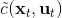进行轨迹分布的优化。
2.  关于某些监督学习的目标函数优化策略参数。
3.  修改对偶变量。

本质上只是之前算法的推广泛化，第一步修改代价函数以加入增广拉格朗日函数的两项，第二步不需要考虑原始代价函数因为原始代价函数只与轨迹有关，而与策略参数无关。我们需要选择的是**轨迹分布的形式**（或者干脆确定性的，确定性形式比较容易，而随机形式一般需要使用比较简单的分布类如高斯分布去近似）、**分布****或者****的优化算法**（第一步的轨迹优化算法）、**修改后的代价函数**、**用来训练****监督学习的目标函数**。举例来说，确定性形式其他部分就跟我们刚才所说一致，问题为，我们的第一步中修改的目标函数就是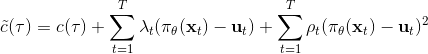 。

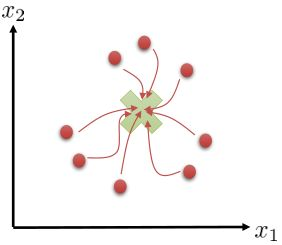

我们有时候也会遇到需要从多条轨迹中学习策略的问题。以上图为例，我们从小红点出发，想走到小绿叉位置。然而从一个点出发的路径容易规划，但是这样一条单一的路径可能对策略学习不太好，所以我们想从多个不同的出发点开始学习策略以提高策略的泛化能力。这样的问题又可以被表述为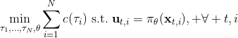，同时优化一组轨迹，减少它们的共同代价，并将它们限制在同一策略之下。这个时候 GPS 算法的第一步只需要改成对所有的，关于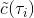进行轨迹优化：这一步其实可以并行完成，因为它们只与被固定下来的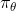有关，而互相之间其实没有联系。第二步需要把这些数据全部拿过来放在一起进行监督学习。Mordatch et al. (2015) 发表在 NIPS 上的文章"[Interactive Control of Diverse Complex Characters with Neural Networks](https://link.zhihu.com/?target=http%3A//papers.nips.cc/paper/5764-interactive-control-of-diverse-complex-characters-with-neural-networks)"就利用了这一并行（在多台机器上训练，然后合起来）的约束下的轨迹优化的方法来训练神经网络策略，在 MuJoCo 模拟器上完成了复杂生物（如类似蝙蝠翅膀，更复杂的如人形机器人的步态）的运动 (locomotion) 学习，可以做到向某一目标移动的实时控制。在训练策略之外，这样的介入策略的做法还提高了轨迹优化本身：策略的介入迫使行动成为状态的函数，使得轨迹优化会做出**周期性的稳定控制**，而不仅仅是一个不稳定的只为了到达目标的控制。在这里，不同的轨迹意味着不同的起点和终点。

对于随机 GPS 问题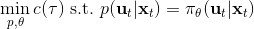，控制器从单一策略变成了一个策略分布。我们仅以最简单的（局部）线性均值加高斯噪音的控制器为例，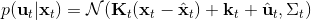，这类形式比较容易求解。第一步优化，目标函数我们上一篇中在一个信赖域中拟合局部模型相似，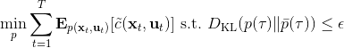。使用这样的方法训练策略，相当于在原来的结构上多出一块训练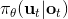的部分。

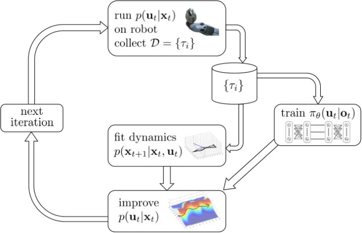

首先第一步使用我们现在的线性-高斯控制器来运行机器人，以收集一些轨迹样本；第二步去用这堆轨迹去拟合模型动态（一些回归的方法），然后在信赖域中更新线性-高斯控制器。在信赖域中找新控制器的时候，我们同时使用上了用这堆轨迹数据训练的神经网络策略。在机器人学的背景下，Levine et al. (2016) 等人投稿于 JMLR 的"[End-to-End Training of Deep Visuomotor Policies](https://link.zhihu.com/?target=https%3A//arxiv.org/abs/1504.00702)"一文提供了一种端到端的策略训练机器人做事情的方法。此时我们的神经网络不再训练，而改为训练，也就是以机器人的视觉图像为一段，输出直接为策略函数，这样的端到端学习，下图即为端到端的 CNN 结构。

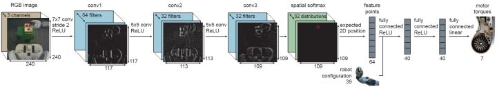

因此我们的 GPS 问题变为了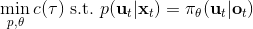。我们使用局部模型进行（低维度的）轨迹优化作为老师来得到策略，但是我们在真正训练神经网络的时候则把输入替换为机器人看到的图像，然后进行监督学习，重复这个过程。在训练神经网络时候我们把输入从状态偷偷替换成了原始图像，这样的技巧叫做**输入重映射** (input remapping trick)：在轨迹优化的时候我们采用状态，而在训练策略的时候我们使用图像，这种方法有助于我们训练从**传感器（如摄像机）直接得到的高维输入的策略**。比如说在移动方块的任务中，在训练的时候，机器人可能可以通过某种方法知道木块在哪里（也就是知道状态是什么），但是在测试的时候则只能通过图像来确定策略，这样的方法就可以用上了。

## PLATO 算法

在这一块，我们介绍另一种使用模仿学习的方法。这个想法是基于之前我们提到的约束下的轨迹优化问题又可以理解为一种对最优控制的模仿学习。那么说到[模仿学习](https://zhuanlan.zhihu.com/p/32575824)，那么算法就不只有一种了，在之前的模仿学习中我们就介绍过 DAgger 算法，一个模仿最优控制的应用就是[之前](https://zhuanlan.zhihu.com/p/33093879)提到过的 Guo et al. (2014) 使用 MCTS 来提供 Atari 游戏样本，并使用 DAgger 算法来实现模仿学习 MCTS 策略。

最原始的 DAgger 存在一些问题。譬如该方法的第三步要求**人工标注新样本**，这非常不自然的，因此我们使用某些如最优控制的方法**让计算机自动标注这些新样本**，算是得到了解决。DAgger 的另一个很大的问题是我们在一开始需要通过人工数据来训练一个策略，然后**运行这个策略**来得到数据。但是这个策略在一开始可能是非常糟糕的，我们只有在反复增加数据之后才能缓解分布不匹配的问题，而分布不匹配问题在一开始非常严重，甚至是灾难性的（如驾车）。如果我们能用一些基于模型的增强学习算法来“更好地”运行这些策略，使得安全系数提高，那么不失为一件好事。

Kahn et al. (2016) 在"[PLATO: Policy Learning using Adaptive Trajectory Optimization](https://link.zhihu.com/?target=https%3A//arxiv.org/abs/1603.00622)"提出的 PLATO 算法正为解决这个问题而存在。该算法将 MPC 思想引入到 DAgger 算法中，而 MPC 的每步重新规划正是为了克服误差的。DAgger 算法的第二步尝试执行监督学习训练出来的来获取数据集，就是我们学出来什么策略就运行什么策略，来克服分布不匹配问题；而事实上 PLATO 算法告诉我们，我们可以稍微做一点妥协，且同样也能得到收敛性保证：我们尝试使用一个近似的策略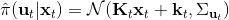，而这个策略出自使用 LQR 来求出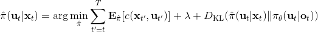，和之前一样，结果是一个线性均值的高斯分布。譬如在驾车过程中，如果发生碰撞就会得到一个很高的代价，这样的策略就会以降低代价函数为目标，同时也保证新策略不与就策略差别过大。我们在每一步中执行这样的新策略作为校正，均衡长期代价和与当前策略的接近程度。注意到，我们的策略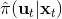在每一步最小化的是**长期的期望代价**和**当前阶段的 KL 散度**（两者的一种权衡），因此它实际想做到的是做出一个不背离当前阶段策略太远的长期期望代价最低的决策。因此，我们将该算法结合 MPC 进行使用，在每一步就需要重新规划。

在这里，我们和前面 GPS 中所提到的一样，使用了输入重映射的技巧，控制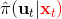和 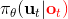之间的 KL 散度，这是因为我们学到的策略可能只是关于观测到的图像，而我们实际发生的控制策略则需要根据状态得到。PLATO 算法想做到的是，在训练阶段，我们可以有一些外部的观察者来给出车辆的状态信息，使相对来说比较聪明，以避免很多不必要的损失；但是还是要根据原始的传感器等信息来学的，这个可能比较难学，但是我们在真实测试环境中还是要靠。我们知道观测是由状态决定的，但是我们的模型是用来预测未来的状态的，如果我们有模型的话我们可以知道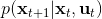，但是观测的分布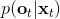是不知道且极难的：相对预测下一帧图像而言，我们更容易弄清楚下一个状态是什么。因此我们也不是对未来的观测做规划，而是对未来的状态做规划。我们知道下一阶段的状态是什么，但是不知道下一帧观察是什么：因此我们执行一步操作后，我们就能得到下一阶段的观测，然后重新规划，进行这样的循环。

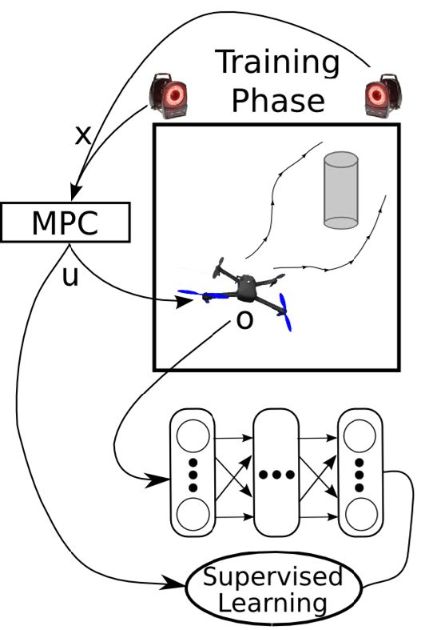

这样一个训练四旋翼躲避障碍物的任务中，在训练过程中，四旋翼被监视器等设备所控制（或者使用激光测距仪等），因此它能很好地得到自己的状态进行重新规划，同时也使用输入重映射技巧，端到端地训练直接的从观测到行动的策略；在实际测试中，则使用原始观测图像。总体来说，这种 DAgger 的变种算法中，我们代价函数中的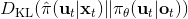使得我们能去学习改进策略，直到最后变成一个完全在线的行为，这意味着分布不匹配问题得到了解决；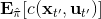使得我们能避免高代价（如碰撞损毁），即便我们的策略和原始策略有差异，哪怕产生分布不匹配的问题，我们也不想产生太高的代价。

## 一些总结

在本篇中，我们首先提到可以使用反向传播的方法训练策略，但是由于梯度爆炸/消失等问题效果不佳。接着我们通过将策略作为约束条件来进行搭配法的方式，使得基于模型的增强学习非常像对最优控制（轨迹优化等）的模仿学习，并具体讲了 DAgger 类算法和 GPS 算法。DAgger 算法不需要一个能自适应策略变化的专家，因此如果我们有一个很难去修改目标函数等以适应策略的规划算法的话，DAgger 是一个很好的选择。但是 DAgger 也有自己的假定，它**假设我们的学习者可以学到一个策略，使得和专家行为之间的差距是可以被控制在一个很小的范围之内的**，也就是说假设不存在学习者怎么都学不会的情形。事实上，这样差距不可控的情形是存在的，如在部分观测的问题中。一个极端的例子是在驾车时不给车任何观测信息，也有可能我们的策略簇根本无法学会专家行为。而 GPS 算法则需要专家去适应学习者，也需要修改轨迹优化算法来加入策略的损失信息，但是正因如此，专家时刻跟着学习者走，它不需要控制差距的范围。

我们之所以想去模仿最优控制，主要是因为这样做相对比较稳定且好用：我们现在已经能把监督学习算法做得很好了，最优控制算法通常来说也效果不错，因此两者结合通常也可以期望能有不错的结果。我们可以使用输入重映射的技巧，在做最优控制时候使用低维度的状态信息，而在训练策略时候可以引入高维观测信息。它也能克服直接做反向传播方法的诸多困难。此外，这样的做法通常样本利用率高，且对于实际物理系统可行。

我们对迄今为止讨论的两大类基于模型的增强学习算法进行总结。第一类是不引入策略，光学习模型并使用模型进行规划。这类方法迭代逐渐收集数据来克服分布不匹配的问题，同时我们也可以使用 MPC 的方法在每一步进行重新规划来克服模型误差带来的影响。第二类更先进点的算法是引入并学习策略。当然我们可以使用反向传播的方法来训练策略函数，这类算法的代表是使用高斯过程匹配两阶矩的 PILCO，相对简单但是不稳定。更通用的方法是模仿最优控制，可以像 GPS 一样做约束下的最优化，也可以使用 DAgger 类的算法诸如 PLATO。还有一类没有提及的方法是 Dyna 方法，是介于有模型方法和无模型方法之间的混合方法：大意如训练一个模型（神经网络）作为模拟器来生成样本，但是使用无模型的方法进行学习。如果我们已经有了一个无模型的算法，但是苦于数据不足的话，是个不错的选择。

当然，基于模型的增强学习算法也有局限性。首先顾名思义，**我们必须要有某种模型**，但不见得总能得到某种模型：有的时候模型简单，但有的时候就很复杂；而且有时候学好模型比学好策略更难（模型复杂但策略不复杂）。学习一个模型需要很多时间和数据，而且比无模型的方法求解计算代价更高。虽然基于模型的方法通常需要的数据量较少也能得到一个还可以的控制，但也取决于学习模型和策略哪个更容易。**速度和表达力通常需要有一个权衡**：有时候一个表达能力很强的模型（如神经网络）速度很慢（取决于具体问题），有时候一个速度较快的模型（如线性模型）去处理非常复杂动态系统的表达力不够。同时，基于模型的增强学习算法**需要引入很多额外的假设**，这在无模型算法中通常没有。如需要认为（局部某种意义上的）可线性化或者连续，这个在很多真实物理系统还是可以的，但是对一些离散系统（如 Atari 游戏）就不适用了；尤其是对于线性局部模型，需要能够重置系统以在同一状态下多次尝试，虽然有些无模型的方法也需要这个假设，但是通常在在线处理就够好了；在有些模型（如 GP 类全局模型）中，需要假设光滑性，不能不可微；等等。

我们也对基于模型的方法和无模型的方法进行综合比较。因为要进行增强学习，我们必须要收集数据，要么是在廉价的模拟器上，要么是在昂贵的真实物理系统，所以首先比较样本效率。通常样本效率最低的是**不基于梯度的算法**（如 NES (Natural Evolution Strategies)、CMA-ES 等），这类算法是无模型的算法，且不计算神经网络的梯度，但依赖于随机优化。**完全在线的算法**（如 A3C 算法）虽然比前者要好一些但是样本效率还是较低，这类算法在线学习，不使用基于策略的回放缓冲池，依赖大规模的并行。**策略梯度法**（如 TRPO 等）的样本效率较前者再进一步，虽然也是在线但是使用批量处理的方法提高效率。样本效率更好一些是**基于回放缓冲池的值函数方法**（如 Q 学习、DDPG、NAF 等），这类方法是离线的。**基于模型的深度增强学习算法**（如 GPS）和**基于模型的“浅度”增强学习算法**（如 PILCO，不使用深度神经网络）则递进提高了样本效率，但在这块也意味着引入了越来越严格的假设。这边差不多每一级基本上是样本效率差了 10 倍。Salimans et al. (2017) 的"[Evolution Strategies as a Scalable Alternative to Reinforcement Learning](https://link.zhihu.com/?target=https%3A//arxiv.org/abs/1703.03864)"一文说明 cheetah 任务中进化算法样本效率比完全在线的算法低十几倍。Wang et al. (2017) 的"[Sample Efficient Actor-Critic with Experience Replay](https://link.zhihu.com/?target=https%3A//arxiv.org/abs/1611.01224)"一文训练 A3C 算法约需一亿步（完全真实时间 15 天）。Schulman et al. (2016) 使用 TRPO+GAE 方法约需一千万步（完全真实时间 1.5 天），十倍的效率提升。Gu et al. (2016) 的"[Continuous Deep Q-Learning with Model-based Acceleration](https://link.zhihu.com/?target=https%3A//arxiv.org/abs/1603.00748)" 使用 DDPG 方法（完全真实时间 3 小时）达到十倍的效率提升，使用 NAF 完全真实时间 2.5 小时。到了基于模型的增强学习，计算的时间可能比数据收集时间更多，因此瓶颈重点转移到了计算。Chebotar et al. (2017) 的"[Combining Model-Based and Model-Free Updates for Trajectory-Centric Reinforcement Learning](https://link.zhihu.com/?target=https%3A//arxiv.org/abs/1703.03078)"一文体现了对于真实控制问题 GPS 比 DDPG 有 10 倍的样本效率提升。对于浅层方法，效率提升大约也是 10 倍，但是相对来说问题更简单了。注意到有很多时候我们不能只看真实时间，模拟器可能非常快，因此如果我们能并行得到很多计算资源，那么可能样本效率低的算法反而更快，都是一些权衡。

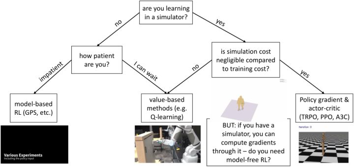

最后我们来讨论如何根据问题选择合适的增强学习算法。最重要的问题可能是我们是否是从模拟器中学习，因为这决定了算法样本效率的重要性。如果是的话，我们要看模拟成本是不是相对训练成本是可以忽略不计的（决定样本效率有多不重要）：如果是，我们会考虑样本效率较低的算法如策略梯度法 TRPO/PPO，和完全在线的算法如 A3C，这样实际运行时间可能较少，而且如策略梯度法可能更容易调参；如果模拟成本不低，那么我们可能希望使用如 Q 学习/DDPG/NAF 的基于值函数的方法来提高样本利用率。值得一提的是，如果使用模拟器，另一个问题是我们某种意义上可以用模拟器来算出梯度，哪怕不能直接得到也可以得到一个数值解（尤其是如果我们在求解连续问题）我们可能不是在需要无模型的算法，而是需要 MCTS 或者轨迹优化这样的方法；也并不总是这样，有时如策略梯度法的无模型方法可能比这些规划算法要效果好，但无论如何是值得讨论的。回到我们不使用模拟器的情形，此时样本效率可能很重要，取决于我们有多少时间（或者能否自动收集数据，是否需要在工作时有人监督）。如果我们没什么时间，那么可能会倾向于诸如 GPS 的基于模型的算法，此时对模型的选择和假设很重要；如果我们时间还是很充裕的，那么可以使用可能更有效的值函数法。