# (11) 概率图模型与软化增强学习

> 作者：[谢天](https://www.zhihu.com/people/xie-tian-55-77)
> 
> 来源：[POST 馆](https://zhuanlan.zhihu.com/c_150977189)

## 概率图模型上的推断

在前面的笔记中，我们已经学习了如何使用一些常用算法来做出正确决策以优化收益函数。现在，我们转过头来关注如何对人类（专家）行为进行建模：这种模型之后的逆增强学习中可以用来使用观测推断收益函数是什么。在这里，我们关注一些概率模型来对观察到的行为进行建模，建立起概率推断和最优控制、强化学习之间的关系，并从中得出一些新的（稍微不同的）新的增强学习算法。

让我们考虑人类在各种层面上的行为，如运动、在房间里行动，或者更高层面上的如开车的路径规划。一个合理的假设是，人类想要实现某种目标，都是去定义一些收益函数，并基于人类所能做出的行动和人类对世界和物理的理解（也就是一个人类自以为的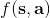），做一些诸如最优控制的规划行动以实现目的。这个想法非常类似于我们之前的优化形式，，根据不同对象建立起不同的模型（如人的跑步是基于对人身体构造和物理环境的理解，汽车路径规划是对交通情况的理解），根据不同目标制定出不同的收益函数。对于一些随机情况，可能我们需要得到一个最佳策略诸如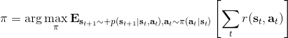来最大化期望收益的期望，然后从中挑选出行动。这是基于人的理性决策的假设，因此要研究一个人如何做出决策，如果我们能得到对应的收益函数，那么从某种意义上说就可以用最优控制或者增强学习的框架来解释或预测在各种场合下这个人的决策。

比如说有一项实验，使用果子奖励刺激猴子把场景里一个物体移动到某个指定位置。我们知道最优的移动轨迹必然是两点连线的直线段，但是猴子可能不会走这样的直线，总会多多少少有一些弯曲，但同样能完成任务。这是因为，猴子的决策基本总不是完美的，反正目标能完成就能拿到奖励，所以**在某些领域有一些误差其实影响并不大**（走了一条较长的路线差了几秒钟猴子可能觉得无所谓，而如果没有把物体移动到指定位置那么就没果子吃了，差别很大）。对于猴子来说，行为是随机的，但是“好的行为”总是有一定相似度的。现在的问题是，如何使用数学的方法来表达，次优的路径也是可以的但是不达目标的路径是不行的这个界限，以及如何刻画这个随机行为。

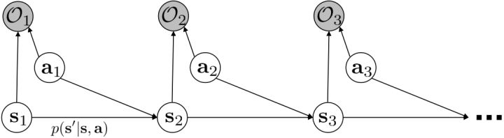

我们考虑使用概率图模型来表达这个“近似最优的”行为：与之前我们只采取最优策略不同，我们也需要让一些次优行动有非零概率存在。在之前，我们知道了状态和行动通过系统动态共同决定了下一个状态。对于这样的一串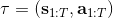，我们应有出现概率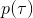，但是只有真实物理场景对猴子进行限制（如猴子不能飞），但没有对猴子试图做的最优行为或者意图进行假设。为了对猴子的意图进行建模，我们加入了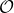元素来代表最优性，也就是说，代表猴子尝试使用一些最优手段来完成（阶段性）目标。简单起见，我们假设元素是一个 0-1 变量，如果猴子没在完成意图就是 0，反之是 1，也可以理解成一个事件。接下来我们要做的事情就是来描述。在这里一个重要假设是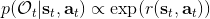，那么条件概率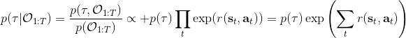，也就是正比于该轨迹实际的发生的概率乘上轨迹总收益的自然指数。因此，收益最大的（可行）轨迹就变得可能性最大；如果有一条轨迹收益也一样大，物理可能性相同，那么它同样也很可能发生：如有多条它们将平分可能性。注意在这里，只是用于评判给定了所有状态和行动后，这样一个序列的可能性，并不去决策。

这个模型表达了有些轨迹虽然不是最好的，但是也还不错的这样一个特征：猴子的例子告诉我们，在终点有一个巨大的收益，但是在路途中间并没有什么收益，因此可能有非常非常多的较优路径存在，但它们最后都指向了同一个终点。在这个模型中，收益最高的行为是最有可能的，当收益下降的时候它的可能性指数下降。有些轨迹虽然可能发生，但是可能性非常低，因此智能体可能不愿意承担这个风险：因为想去最大化期望收益，智能体可能宁愿选择收益较低的但是可能性较高的轨迹。这个模型有一些好处。第一点，它可以**对次优行为进行建模**，这个在逆增强学习中非常有意义，用于观察他人的行为来揣测他的真实目标。第二点，可以**使用一些推断算法来求解控制规划问题**。此外，它可以**对为什么会偏好随机行为（相较于确定性行为）给出解释**。

我们的推断 (inference) 问题是，如果执行最优策略，那么在当前状态下做出某个行动的概率是多少。为了解决这样的问题，我们需要回答三类问题：第一类是如何计算**后向信息** (backward messages) 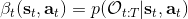；第二类是如何计算**策略** (policy) 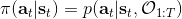；第三类是如何计算**前向信息** (forward messages) 。

首先我们来看**后向信息**，给定某个时间点的状态和行动，得出未来最优性变量的观测概率（它不关心过去）。之所以说是后向信息，是它的计算方式类似于 LQR 中的倒推。在递推边界时，根据定义有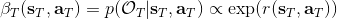，只需要做归一化；在中间，我们使用全概率公式进行积分，并使用 Markov 性进行概率拆分，得到 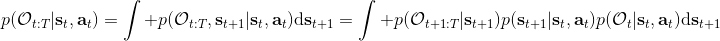。其中我们已知和，而剩余一块根据全概率公式有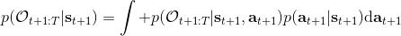，其中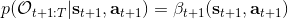；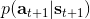比较奇怪，它并不是一个策略函数，**而只是一个给定状态做出什么决策的先验概率，在这里我们可以先认为是均匀分布的**，概率密度是一个常数。我们进一步令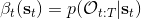，则所有的概率可以由以下倒推过程完成：

> for 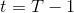 to 1:
> 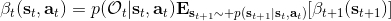 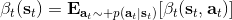

回顾我们的[值函数迭代 (value iteration) 算法](https://zhuanlan.zhihu.com/p/32909860)，和这个算法不谋而合。因为这里所有的操作都是乘法形式，我们将其取对数变成加法形式。令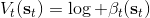，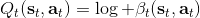。根据第二条关系有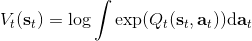。从极限的角度看，随着 Q 的值变大，显然会有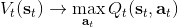，因此前者的这种操作也被称为 softmax，是 max 函数的一个软化。根据第一条关系，有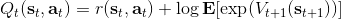。这个形式看起来很奇怪：如果状态转移是确定的，那么期望就可以拿掉了，对数和指数就抵消了，有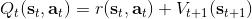，和值函数迭代形式一致；如果状态转移是随机的，那么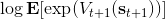就是一个 softmax，最乐观的转移。然而，乐观也不是个好事情，Ziebart et al. (2010) "[Modeling Interaction via the Principle of Maximum Causal Entropy](http://link.zhihu.com/?target=http%3A//www.ri.cmu.edu/pub_files/2010/6/maxCausalEnt.pdf)" 一文提供了一个基于最大因果熵 (maximal causal entropy) 原则的方法，此时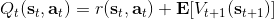。

在之前，我们还剩余了一个对的均匀分布的假设。如果这个先验分布不是均匀分布，值函数将会变成，并保持不变。如果我们定义一个新的 Q 函数，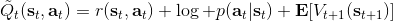，那么值函数又变成了：这说明我们的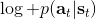项总能和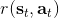项合并到一起去，因此我们在实际求解的时候可以不失一般性地假设这一项不对算法产生任何困难：如果有一个非均匀分布的先验，就把它放到收益函数里面去就行了。

第二个是**策略**，也就是给定当前状态和所有最优性变量，得出行动的概率。首先根据 Markov 性，有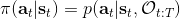。将条件概率进行一步变形，前者就等于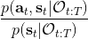。根据贝叶斯公式，又可以变形为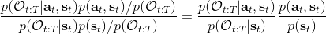。两个分式相乘，前者为后向信息之比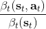，后者为先验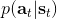，如果我们假设先验是均匀分布的话那么后者是常数，因此可以去掉。从而，我们有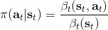。在我们之前的倒推过程中，如果换成 Q 函数和 V 函数的话，就是：

> for  to 1:
>  

而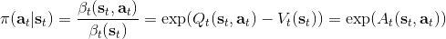，正好是一个优势函数的指数的概念，也比较符合逻辑。这些函数还有一些变种，如对 Q 函数贴现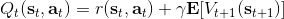就变成了贴现随机最优控制 (discounted SOC)；显式加入一个温度（热力学概念）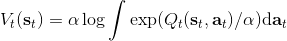，我们的 Q 和 V 都对温度非常敏感，当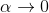时 softmax 就退化成 max，且有温度时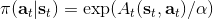。

这样的策略的一个直接的解释是，使得“更好的”行动更可能发生。如果有多个性质一样好的行动，它们的可能性一致，只是一个概率分布的策略只需随机挑选一个。它和 Boltzmann 探索（见[第六篇](https://zhuanlan.zhihu.com/p/32909860)）有很强的相似性。随着温度下降，它逐渐逼近与一个贪心的策略。

最后一个推断问题是**前向信息** (forward messages) ，给定之前的所有最优性变量，得出在当前时点到达某状态的概率。这个对策略来说并不重要，但是在逆增强学习中非常重要。前向信息的边界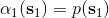，通常认为初始分布是已知的。将该概率进行展开，变成一个二重积分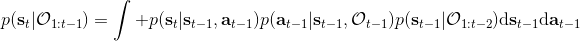。其中第一项我们假设是已知的系统状态转移，第三项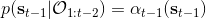。第二项略微复杂，使用贝叶斯定理得到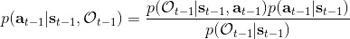，其中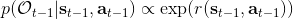，我们假设是均匀分布，分母也是一个归一化常数，因此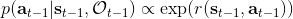。于是就得到一个正向的递推关系了。

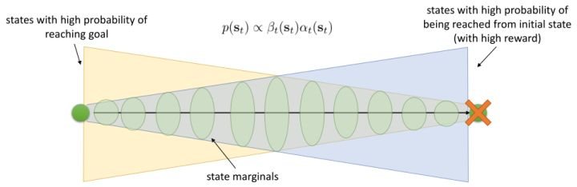

有了前向消息和后向信息之后，给定所有最优性变量，求某时刻的某状态的发生概率就比较容易了。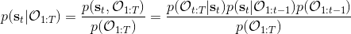，其中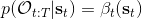，，其他可以看作归一化常数，因此，这整个理论和 HMM 很像。注意到这个概率是前向消息和后项消息的乘积，可以说是一个交汇。考虑上图左边圆点是起点，右边叉叉是终点的路径。黄色锥区域是能够有高概率到达终点的状态，蓝色锥区域是有高概率从初始状态以高收益到达的状态，然后基本上就是两者的交（概率上相乘）。Li and Todorov (2006) 做了人和猴子类似从一个点到另一个点的实验，记录空间位置变化，基本上也是中间部分方差最大。

总结来说，我们这边用概率图模型来描述最优控制，而且这个最优控制可以用概率推断来实现（类似于 HMM 和 EKF），而且与动态规划、值函数迭代关系非常强（它这里面 max 是软化的，可以通过降低温度来使得变成硬性 max）。

## 软化的增强学习算法

使用之前提到的软化 max 函数，可以得到很多增强学习算法，例如我们在这里对 Q 学习进行软化。对于[标准的 Q 学习](https://zhuanlan.zhihu.com/p/32994423)，参数的迭代格式为，目标值函数为。而对于软化 Q 学习来说，梯度步还是一样的，但是目标值函数变成了软化 max 函数。同样，策略函数也变成了类似 Boltzmann 探索的。因此，只需要将[DQN](https://zhuanlan.zhihu.com/p/32994423)的第三步中“使用目标网络计算出目标值”改成  就可以了。第一步的“在环境中执行某个操作，观察到”的操作，如果想在线执行（如 SARSA），也需要用软化 max 来抽取。

策略梯度法也可以进行软化。Ziebart et al. (2010) "[Modeling Interaction via the Principle of Maximum Causal Entropy](http://link.zhihu.com/?target=http%3A//www.ri.cmu.edu/pub_files/2010/6/maxCausalEnt.pdf)" 一文的一个结论是最大化。关于该结论的一个比较直观的理解是，当最小化时（为归一化因子），。而如果我们展开 KL 距离表达式，，这是因为取完对数正好是这样。因此，如果要对策略梯度法进行软化，我们也**只需要在目标函数内，在期望收益之后加上策略函数的熵**就可以了：这个熵给策略一定压力，使得它不会退化成一个确定性策略。这种方法通常被称为**熵正则化** (entropy regularized) 策略梯度法，通常用于防止策略过早地熵崩塌 (premature entropy collapse)。这在行动空间是连续的时候尤为重要，如我们之前在[策略梯度法的第二个问题](https://zhuanlan.zhihu.com/p/32652178)中提到，高斯策略下，策略梯度法通常希望减少策略的方差，因为减少方差通常可以导致局部的收益增大，但这同时也会使得策略梯度卡住，改进停止，加入熵也是一个方法。

同时，这个方法和软化的 Q 学习也非常有关，详见 Haarnoja et al. (2017) 的"[Reinforcement Learning with Deep Energy-Based Policies](http://link.zhihu.com/?target=https%3A//arxiv.org/abs/1702.08165)" 和 Schulman et al. (2017) 的"[Equivalence Between Policy Gradients and Soft Q-Learning](http://link.zhihu.com/?target=https%3A//arxiv.org/abs/1704.06440)"。这里给出一个比较简单的介绍。由于，软化的策略梯度法的目标函数就等于。将其关于策略参数取梯度，  ，最后的那个 1 可以通过基线 (baseline) 拿掉，而中间的。注意到，软化的 Q 学习中，，因此代入进去得到，同样 可以拿掉。对于软化的 Q 学习，它的梯度为，看起来是非常相似的。符号不同是因为 Q 学习是梯度下降，而策略梯度法是梯度上升。

总体来说，软化方法的好处主要是有以下几点。首先毫无疑问地，它**增加了探索（类似 Boltzmann 探索）且防止了熵的坍塌**。软化方法**对状态的覆盖面更广**、**鲁棒性增强**，也**更容易对特定的任务进行调参（预训练）**。对于**并列最优**的情况，软化 max 得到的是一个分布，几个选项将等概率选择，**通过调整温度参数和收益尺度可以使得软化 max 变成硬 max**。在之后我们也将体现这个模型**更适合对人类行为建模**。

Haarnoja et al. (2017) 的"[Reinforcement Learning with Deep Energy-Based Policies](http://link.zhihu.com/?target=https%3A//arxiv.org/abs/1702.08165)" 使用软化的 Q 学习方法来进行成功的实践。用策略梯度法来学习 MuJoCo 小人跑步的任务，超参数稍微进行调整，可能虽然得分都很高但是跑步形态完全不同，这是因为增强学习算法一旦发现一块比较好的区域，就会去加强这块区域的利用率，很容易达到局部最优。如上图中，机器人想到达这个蓝块，代价函数为到这个蓝块的距离。机器人可以选择黄色或绿色路线，初始看起来可能效果差不多，但是黄色路线实际上是走不通的：软化的方法可以让两条线路有更均衡的被选择概率，防止某一块被过度增强，不错失可能性。这个方法被称为随机的基于能量的策略 (stochastic energy-based policy)。要保证所有假设都被验证，就是用之前介绍过的软化 Q 学习算法，问题是如何实现从分布中采样。为了实现这个目标，它们训练一个随机网络来根据状态和某高斯随机噪音来得到行动（类似[模仿学习](https://zhuanlan.zhihu.com/p/32575824)中提到过的隐性密度模型），使用[均摊的 SVGD (Stein Variational Gradient Descent)](http://link.zhihu.com/?target=https%3A//arxiv.org/abs/1611.01722) (Wang and Liu, 2017) 来训练以符合，和 GAN 的想法非常接近。

四足动物在一个槽里移动的训练，在预训练时，软化的 Q 学习相比 DDPG（加上-贪心）来说探索覆盖面更广（一开始就显示出了非常强的探索性）。事实上，有预训练比没有预训练效果好很多，而且软化 Q 学习的预训练效果比 DDPG 预训练要好。