# (12) 逆增强学习

> 作者：[谢天](https://www.zhihu.com/people/xie-tian-55-77)
> 
> 来源：[POST 馆](https://zhuanlan.zhihu.com/c_150977189)

## 逆增强学习问题

迄今为止，我们做增强学习的时候都是对特定任务来手工定义收益函数的思路来完成任务。但是要真正实现稍微智能化的目标，我们更倾向于在不知道具体任务的时候，去观察专家的行为然后推测他想干什么，也就是学习他的收益函数，然后再使用增强学习算法，这也称为逆增强学习。在这里，我们将利用[上一篇](https://zhuanlan.zhihu.com/p/33534968)中讲到的近似最优模型来达成这一学习目的。

收益函数的来源有很多。对于很多（有得分的）游戏来说，我们只是需要让游戏的得分最大化就行了，收益函数是非常自然的。但是在很多现实世界中的问题中并不是那么简单，而且原因千奇百怪。比如说有个机器人任务，想让它拿起壶往杯子里倒水。要让机器人模仿这个动作倒是不困难，但是如何鉴别水是不是真的倒进去了可能会非常困难（因为机器人并不是拿来喝），手工设置一个这样的函数也是很烦的。比如说有个对话系统，跟人类交流来做技术支持解决问题，也需要关注用户是否满意这样的互动，体验好不好，这个其实也很难具体评价。对于自动驾驶，即便是有很多成文条例，但也有很多隐性的不成文的规则、公约和常识要去遵守，做一个文明司机，这个在人工设置的收益函数里面也很难刻画。这些的特点是，相对手工来做一个收益函数，由人来介绍怎么做会比较容易。

在之前，我们也介绍过[模仿学习](https://zhuanlan.zhihu.com/p/32575824)（行为克隆），也就是直接模仿专家的行为而不需要理解其中原因。这也是实践中的一个备选项，在有些时候也能满足要求，尤其是观测数据很多，且域漂移 (domain shift) 比较小的情况，但不见得能适应广泛的情况。同时，模仿学习只能捕捉到台面上的动作：盲目模仿所有的环节，不管重要不重要，如果在教学过程中出现一点错误，就会被学进系统中。此外，学习者和教学者可能能力不同，如人倒一杯水的过程可能和机器人的过程不同，如果机器人能学习到目标则它可以自适应做得更好。

从示范中推测收益函数的问题又被称为**逆最优控制问题** (Inverse Optimal Control, IOC) 或者**逆增强学习问题** (Inverse Reinforcement Learning, IRL) (Kalman, 1964; Ng and Russell, 2000)。在“正”增强学习问题中，我们得到的是状态空间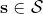，决策空间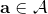，部分基于模型的问题还会给定系统转移动态，以及收益函数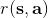：通过这些去求一个最优策略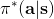。在逆增强学习问题中，我们同样有状态空间，决策空间，（或有的）系统转移动态，和很多从最优策略下的轨迹分布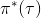中抽取出来的轨迹样本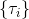：从中学习出一个参数化的收益函数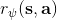，其中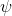是参数，再使用它来学习最优策略。参数化的收益函数简单形式可以是线性的，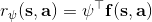，参数是权重向量，对若干个特征函数做一个加权线性组合；也可以是一个复杂的神经网络。我们先讨论线性的，再讨论神经网络。

逆增强学习的主要挑战是，这个问题可能是定义不足的 (underdefined)，因为我们可能已经对这个世界非常了解了，有很多先验知识，但是事实上机器学习算法啥都不知道：比如一个东西向右移动了，可能是因为它喜欢向右移动，也可能是因为它喜欢的东西在右边，或者其他什么原因，我们有很多很多选择去解释它，答案并不唯一而且是非常模糊的。同样，我们很难去评判已经学到的收益函数。因为在逆增强学习问题中，我们要尝试去改进收益函数，然而去评估收益函数的时候，我们要求解类似梯度的东西，这其实是正增强学习问题要做的事情，因此有点类似于正增强学习是逆增强学习内循环中的子问题，在样本使用和计算上都很困难。实践中，（人类）专家指导很可能不是精确最优的，这点在[上一篇](https://zhuanlan.zhihu.com/p/33534968)中已经有所讨论，这个也造成困难。

一个早期的逆增强学习算法叫做**特征匹配逆增强学习** (Feature matching IRL)，可以给我们一些启发。这里先假定收益函数是若干特征函数的线性组合，。如果这些特征选得比较好，我们只需要选权重的话，我们就会考虑去匹配最优策略下的期望。具体来说，如果对于一个收益函数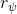，最优策略为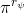，那么我们就希望去找到一组参数，使得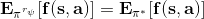，后者是未知的最优专家策略。左边是边缘化的期望，或者我们就直接运行，然后抽样估计特征的期望。最优策略下特征的期望是要用专家给出的样本来算的。事实上，参数并不是唯一的，我们可以从支持向量机 (SVM) 中借鉴最大间隔 (maximum margin) 原理来得到一个比较靠谱的解，如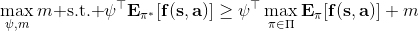，也就是找一个分割超平面把最优解下的期望收益和策略簇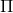内其他所有策略的期望收益相区分开，并且使得间隔最大。这个问题与原问题不同，只是尝试去这么做。然而不难发现，如果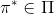，那么最优解落在分割超平面上，这个总是 0，这个间隔就不起效果了。因此，可能这样一刀切的间隔是不好的，我们有必要去体现策略不同下期望收益和专家策略有差异（专家策略就应该间距为 0），使得和专家策略相差得越多，策略越糟糕。定义两个策略的距离为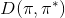，那么使用一个与 SVM 类似的技巧，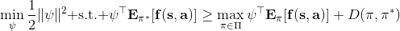。距离可以定义为两个策略的期望特征的差异。整体来说，这个方法还是问题多多。首先，为了解决不唯一性，做最大间隔的方法看上去不能说不奇怪，**很难说明为什么间距大就代表收益大**，有点随便。正如很多分类问题根本不是线性可分的一样，我个人看到这个模型时想到的第一个问题这边也提到了，**如果专家的策略不是最优的**，可能这个最优化问题根本就无解。如果要强行处理的话，可以通过增加一些带惩罚的松弛变量来某种程度上缓解这个问题（这也是 SVM 里面的思路了），但这样做还是很随意，对专家的非最优行为并没有清晰的建模，解释并不能令人满意。从计算上看，这个带约束的优化问题也是非常复杂的，即便右边这个 max 好求（_ 离散的话就是把约束拆开，如果右边这个 max 问题是强对偶的那么就使用对偶方法转成 min，就变成了存在性问题 _），**很难应用扩展性好的**如基于随机梯度等**方法推广到复杂的非线性神经网络**。关于这类比较古老的方法，可以参考 Abbeel and Ng (2004) 发表在 ICML 的"[Apprenticeship Learning via Inverse Reinforcement Learning](http://link.zhihu.com/?target=http%3A//robotics.stanford.edu/%7Eang/papers/icml04-apprentice.pdf)"和 Ratliff et al. (2006) 发表在 ICML 的"[Maximum Margin Planning](http://link.zhihu.com/?target=https%3A//www.ri.cmu.edu/pub_files/pub4/ratliff_nathan_2006_1/ratliff_nathan_2006_1.pdf)"。

另一种想法的出发点是我们上一篇中讲到的对人类次优行为使用概率图模型建模，使用人类行为数据进行拟合，并推测出收益函数。继续假设，那么轨迹条件概率，正比于该轨迹实际的发生的概率乘上轨迹总收益的自然指数。根据我们的假设也不难看出，使用这个模型去做逆增强学习，本质上是去学习最优性变量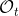的分布。我们把参数化的收益函数的参数放进来， 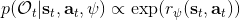，我们要学习的就是这个收益参数，且最优变量取决于；类似地，轨迹条件概率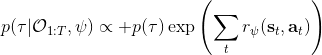。我们现有的数据是从最优策略下的轨迹分布中抽样得到的轨迹样本。我们的学习可以做最大似然学习，也就是最大化对数似然函数：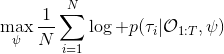。代入上面的条件概率，在这个最大化问题中是常数可以忽略；如果我们令轨迹收益，那么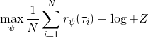，后面多了一项归一化项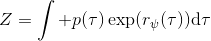，称为 partition function。

要用梯度法优化参数，我们对这个对数似然函数关于参数求梯度，则根据链式法则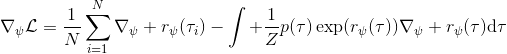。此时我们发现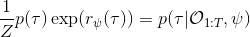，然后第一项也是期望的话，梯度就变成了一个很有趣的差了，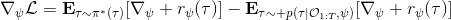，就是**专家策略下的轨迹分布下的收益关于参数的梯度**减去**当前收益函数对应的软化最优策略下的轨迹分布下的收益关于参数的梯度**。第一块是关于数据的，第二块是从当前策略进行采样。这样的梯度类似于想要增加数据的概率，也要减少模型的概率。第一块可以从专家样本中估计，第二块更多是一些推断。

这里我们来讨论第二块期望怎么估计。把第二块期望的轨迹收益按照时间拆开，。其中状态行动分布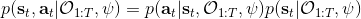。容易发现，前者就是我们上一篇中的策略，后者就是我们上一篇中的路径概率，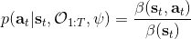，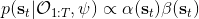。从而，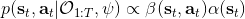，是后向信息和前向信息之积。令作为在时刻状态行动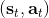访问概率，那么第二块的期望就可以写成一个二重积分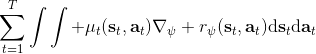，也可以简写为一个内积关系。从而，我们填补了梯度公式，并得到了一个**最大熵逆增强学习** (MaxEnt IRL) 算法，循环执行以下步骤：

1.  给定，按照[上一篇](https://zhuanlan.zhihu.com/p/33534968)的方法求出对应的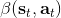和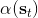。
2.  计算访问概率。
3.  求解梯度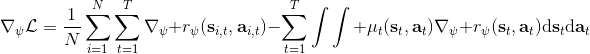。
4.  走一个梯度步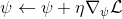。

这个是表格形式的最大熵逆增强学习的算法。该思想由 Ziebart et al. (2008) 发表在 AAAI 上的"[Maximum Entropy Inverse Reinforcement Learning](http://link.zhihu.com/?target=http%3A//www.aaai.org/Papers/AAAI/2008/AAAI08-227.pdf)"提出。之所以称为最大熵，因为原理其实与上一篇中的熵正则化类似。我们可以说明如果我们的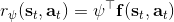是这样的线性形式，那么其实这样的算法是在最优化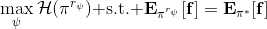，在保证学习的策略的特征和专家策略特征一致的基础上使得策略的熵最大。

Ziebart et al. (2008) 发表在 AAAI 上的"[Maximum Entropy Inverse Reinforcement Learning](http://link.zhihu.com/?target=http%3A//www.aaai.org/Papers/AAAI/2008/AAAI08-227.pdf)"使用这一套方法用于道路网络导航的 MDP 问题。根据人类驾驶员的驾驶路径数据弄出一个 MDP 问题，状态是在哪个交叉口，行动是在每个交叉口往哪儿走，因此状态和行动空间都是离散的，虽然很大但是还是可以弄成一个大表的。他们的目标用于看这个人的驾车路线（GPS 等）来实时推测他想去的目的地；也用于找怎么样的道路是代价更高/低的。他们使用线性代价函数，手工定制了路的类型（高速、主道、辅道）、速度、车道、转向等特征。这说明在实际问题中这种表格形式也是有一定可行性的。

Wulfmeier et al. (2015) 的"[Maximum Entropy Deep Inverse Reinforcement Learning](http://link.zhihu.com/?target=https%3A//arxiv.org/abs/1507.04888)"及其应用，Wulfmeier et al. (2016) 发表在 IROS 上的"[Watch This: Scalable Cost-Function Learning for Path Planning in Urban Environments](http://link.zhihu.com/?target=https%3A//arxiv.org/abs/1607.02329)"也使用了类似的方法，还是使用了表格的形式，但是收益函数的设置更复杂，是一个**用神经网络来对若干人工特征进行非线性组合**的形式，算法本质上和最大熵逆增强学习没有区别，只是需要用神经网络来计算收益，最后需要用梯度去更新的也是神经网络。注意这个问题中状态空间只是一个二维平面，行动空间是离散的方向。该方法的主要局限性是**仍然需要迭代求解 MDP**，而且还**需要假设系统动态是已知的**。

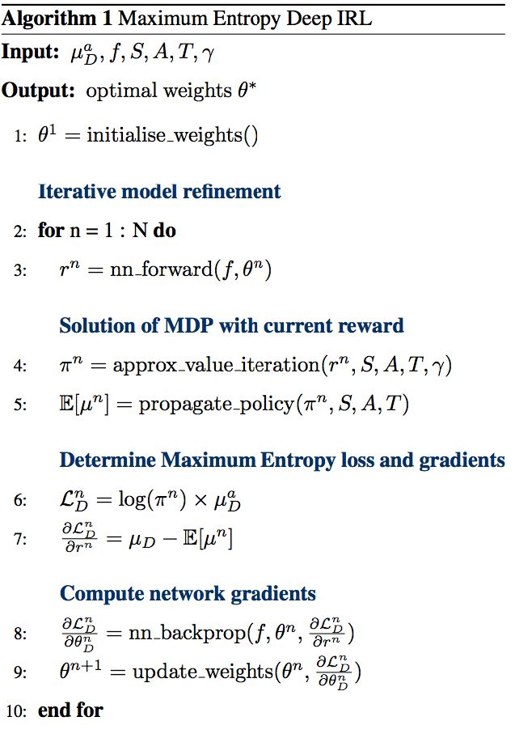

## 深度逆增强学习

前面我们提到了逆增强学习的经典处理方法最大熵逆增强学习法，是一个学习收益函数的概率框架。这类算法的表格实现可以推广到收益函数是一个使用神经网络组合特征的非线性形式，但是状态空间和行动空间都得离散且比较小，因为求解梯度需要枚举所有状态-行动对，然后递推求解几个动态规划问题：当状态空间和行动空间大的时候就不能接受了。要处理深度逆增强学习问题，我们希望能适应**离散较大的甚至是连续的状态行动空间**，而且我们需要对**系统动态未知**的情况下做有效的学习。在无模型的增强学习算法中我们使用了一些抽样手段，在这里也希望能用上去。

假设我们不知道系统动态，但可以像普通增强学习一样抽样。注意到我们前面对数似然函数的梯度，前者是专家样本数据中得到的，后者是当前收益函数对应最优策略下的。要做到后者，一个比较直接的想法是使用任何最大熵增强学习方法学习出策略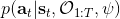，然后根据这个策略来采集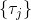。此时，就用专家样本的结果减掉新抽样本的结果，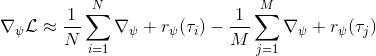来做无偏估计。然而事实上这种学习的做法是代价很高的，因为我们不假定有模型，所以可能要用无模型的增强学习算法，这将使得每一步都花掉很多很多时间。这里我们可以采用一些小技巧，我们可以不用完全地把对应的最优策略学出来，而只是**每次把策略改进一点点**，然后用这个不准确的策略去近似估计梯度。然而现在多出来一个问题，由于我们使用的策略是不正确的（不是最优的策略），因此我们的估计量将不再无偏。对于分布错误的问题，一个有力武器是重要性抽样（我们在[策略梯度法部分](https://zhuanlan.zhihu.com/p/32652178)有过介绍），用其他分布下抽样结果来得到正确分布下的无偏估计：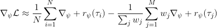，其中权重为 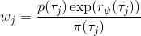，分子正比于收益的指数（_ 我觉得 Levine 教授原文少了一个概率，无法推导成下面的形式，或者是可能它的定义和我上面说的不同了，请评论区大神帮忙研究下 _），分母是现在分布的概率。因为我们前面会除以权重之和，就不需要关注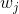归一化的问题。使用之前策略梯度法一样的展开，对同一条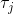，我们得到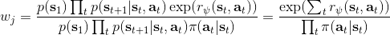这样比较简单的形式。进一步，最优下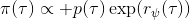，无需做 IS。每一步策略迭代都使我们更接近最优分布，因此事实上是在逐步改进的。

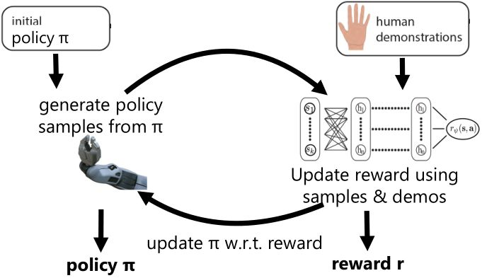

Finn et al. (2016) 发表在 ICML 上的文章"[Guided Cost Learning: Deep Inverse Optimal Control via Policy Optimization](http://link.zhihu.com/?target=http%3A//proceedings.mlr.press/v48/finn16.html)" 提出了**引导代价学习** (guided cost learning) 算法。需要给定一些人工的示范，然后算法从一个随机的策略 开始，通过运行策略去生成随机样本，然后使用重要性抽样和人工示范的方式来更新收益函数，根据收益函数稍微更新一下分布，然后下一阶段的分布更好。最后，我们得到了最终的类似于专家的收益函数和对应的策略。事实上，这个文章中使用了基于模型的算法中的 GPS 算法来做策略更新，然而事实上任何改进策略的方法应当都是适用的。她们的文章中使用这样的方法来“教”机器人完成人工动手的操作如摆放盘子和往目标杯子里倒水。这项工作相对更早期的逆增强学习算法，如 Kalakrishnan et al. (2013) "[Learning Objective Functions for Manipulation](http://link.zhihu.com/?target=https%3A//pdfs.semanticscholar.org/2732/9bc3b6c5a25aeadd3503d01064570b8a4a5c.pdf)" 的路径积分 IRL (path integral IRL) 和 Boularias et al. (2011) "[Relative Entropy Inverse Reinforcement Learning](http://link.zhihu.com/?target=http%3A//proceedings.mlr.press/v15/boularias11a.html)" 的相对熵 IRL (relative entropy IRL) 的思路的改进主要在于，早期的算法虽然使用了重要性抽样，但是没有下面的那个箭头，**没有对策略进行更新**，也因此只得到收益函数而不产生最终的策略。但是早期算法如果在初始分布不错的情况下（要求可能较高），也是可以得到一些不错效果的。她们比较了手工设计的收益函数，相对熵 IRL 和 GCL 算法的效果。

事实上，很可能我们得到的收益函数不是一个很好的收益函数，但是往往这个策略函数反倒还可以。

## 与生成对抗网络 (GAN) 的联系

Goodfellow et al. (2014) 提出了生成对抗网络 (Generative Adversarial Networks) 红遍机器学习界。GAN 是一个生成模型，由两个神经网络组成，一个生成网络，一个判别网络。判别网络用于输入一张图片，判断是生成网络生成的还是数据集里面真实的；而生成网络则尝试通过生成类似于数据集里图片的方式“欺骗”判别网络。IRL 也和 GAN 有一些相似之处，在我们最大似然估计中，尝试去增加专家样本的出现概率，减少当前策略样本的出现概率。Finn et al. (2016) 发表于 NIPS 的文章 "[A Connection between Generative Adversarial Networks, Inverse Reinforcement Learning, and Energy-Based Models](http://link.zhihu.com/?target=https%3A//arxiv.org/abs/1611.03852)" 进行一个对比，IRL 中的轨迹对应着 GAN 中的样本，IRL 中的策略对应着 GAN 中的生成器（生成轨迹和样本），而 IRL 收益函数则对应了 GAN 中的判别器。

事实上，可以令 GAN 的判别器取决于收益的方式来完成类似的目标。假设一个轨迹在专家（数据）分布下的概率是，当前策略下的概率是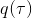，最优判别器应该为。在 IRL 中，我们假设专家分布下的概率是，从而。我们的判别器要最小化损失函数 (reward/discriminator optimizaion) ，简单说就是使得对应分布下的似然最大，这也是 IRL 的目标函数。我们的生成器要最小化损失函数 (policy/generator optimization) ，使得在当前分布下判别器尽可能分不清，这个结论和上篇中的熵正则化的增强学习的结论是很相似的。对于未知的系统动态，我们交替进行策略更新来最大化收益函数，然后进行收益更新来提高样本收益且降低当前策略收益，也是类似这样的过程。GCL 算法中，机器人尝试的收益函数是要去最小化的，人类示范的收益函数是要去最大化的，去尝试学习最大熵模型的分布。此外，一个有趣的交汇是，IRL 也和基于能量的模型 (energy-based models, EBM) 很有关系。

Ho and Ermon (2016) 发表在 NIPS 上的 "[Generative adversarial imitation learning](http://link.zhihu.com/?target=http%3A//papers.nips.cc/paper/6391-generative-adversarial-imitation-learning.pdf)" 一文将 GAN 和模仿学习联系得更直接，就认为机器人的动作是负样本，人类示范动作是正样本，是一个二分类器来表示轨迹是一个正样本的概率，并使用作为收益函数。事实上它和 GCL 是差不多的，只是 GCL 的 D 是一个给定的函数形式，而这边 D 是一个二分类器（因此该算法不是 IRL，但是非常像），总体来说两个算法都是 GAN 的变种。

总体来说，IRL 是从专家示范中推断出未知收益函数的手段， 一类比较好用的 IRL 算法是最大熵 IRL，相对类似超平面分割的方法来说可以消除歧义，也解决了人类示范可能不是最优这种情况。这类算法可以用表格动态规划来实现，比较简单有效，但是只有在状态行动空间较小，动态已知的情况下才能应用。有一类微分最大熵 IRL 这边没有涉及，它适合于大而连续的空间，但需要知道系统动态。我们这里讲的深度 IRL 使用的是基于样本的最大熵 IRL，可以用于连续空间，可以不假设有模型存在，较广泛。它的实现可以用 GCL 算法，该算法与 GAN 也有很深的渊源，和它紧密相关的还有生成对抗模仿学习算法（但不是 IRL，不推测收益函数）。

**注：水平有限，本文可能有较多谬误之处，请评论区大神多多指教！**