# (2) 模仿学习

> 作者：[谢天](https://www.zhihu.com/people/xie-tian-55-77)
> 
> 来源：[POST 馆](https://zhuanlan.zhihu.com/c_150977189)

## 序贯决策问题

在这里我们先假设大家都已经对监督学习 (Supervised Learning) 的基本概念非常熟悉了。我们在这里先介绍一下今后要使用到的记号：

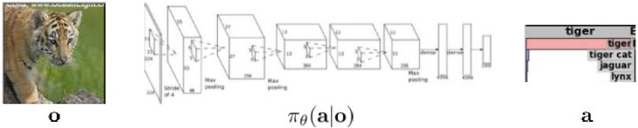

跟上一篇一样，这只是一个有监督学习的例子，把图像通过某种方式进行分类，譬如在这个例子中将左边的图片分类成老虎。我们把图像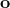称为**观测** (observation)，而把输出的结果称为**行动** (action)：系统要做的行动无非是给观测到的图像贴上属性变量的标签。在从到的过程中有一个**策略** (policy) 函数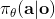，这个函数确定了给定观测之后，行动的概率分布，这个分布比较常见的方式是通过一个 Softmax 函数来确定。这个策略里面有一个参数，而如果是一个神经网络，那么这个参数就是神经网络的权重。在监督学习中，我们的目标是找到一组很好的参数，使得它能很好地完成任务。

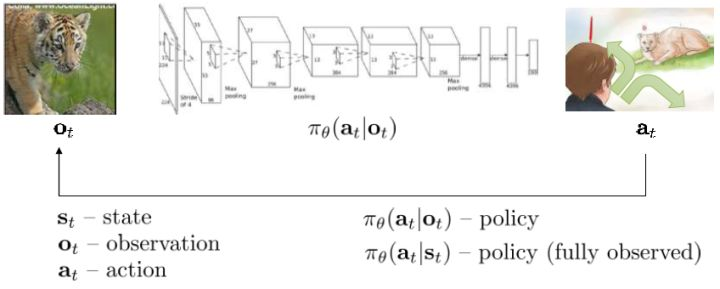

我们将这一设定进一步延伸到序贯决策问题中去，这一问题是由很多时间点的决策问题组成的。首先我们给之前的所有变量都打上下标，以说明这是时刻的决策问题：在时刻，我们观测到，然后做出行动。不同于监督学习的独立同分布假设，在序贯决策问题中认为当期的行动会影响到下一期的观测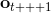。所以当你看到老虎的时候，你需要做出合适的动作，说不定你下一期就不会再看到老虎了；而如果你的动作不正确，也许就会发生惨剧。在这个问题中，我们要做的行动就不再是把它标注为老虎了，而是采取的某项真正意义上的动作。这种动作可以是离散意义的，譬如跑掉、忽略或者去抚摸它等，在数学表达上和之前的类似，可以使用 Softmax；也可以是连续的，譬如选择往哪个方向跑，可能会去用一个高斯分布的均值和方差来表示；当然混合起来也是可以的。

在这边还出现了一个**状态** (state) 的概念，通常指真实环境的相关配置全貌，包含了我们去了解这个世界所需要的一切信息，但这些信息不见得能从单一的观测中得出来。以一个猎豹追逐羚羊的图片作为例子，这个图片作为观测，本身是一个很大的张量；而在图片背后，其实潜藏着一个真实的物理系统，包含了譬如猎豹和羚羊的坐标、速度以及其他各种量。这样的系统构成了我们所真正关心的状态本身。究竟是使用状态还是观测，取决于我们能否完全了解到整个情况：我们看到的感受到的，不见得就是整个环境本身，往往是不充分的。如果我们的图片上猎豹正好被一辆车挡住，此时虽然我们在观测中看不见猎豹，但它依然是真实存在的；但是对于下围棋这种例子，棋盘上所有情况都是非常清楚的，因此观测就是状态本身了。

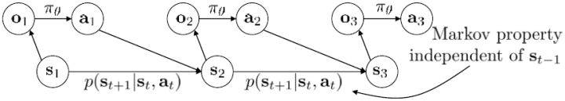

用一个图形来表示它们的关系。我们从状态中获得了观测（这里假设观测不完全），并根据策略来得出行动。这里有一个转移概率函数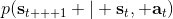（很多文献中的 dynamics 也通常指的是这类转移概率），表明了在状态下执行行动所得到的下一个观测的概率分布。这里有一个性质，也就是被认为仅由和影响，而与之前的状态和行动无关：也就是之前的所有后果全部被包含在状态之中了，你可以忘掉过去所有的东西，此谓 Markov 性，也是序贯决策问题的重要假设。注意到对于观测来说，这个性质是不成立的，观测序列不具有 Markov 性。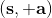的记号最早来源于著名动态规划开山鼻祖的 Richard Bellman，取 state 和 action 的首字母；在机器人和最优控制领域则常见使用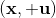来作为记号，来源于最优控制的鼻祖 Lev Pontryagin。

## 模仿学习

我们考虑自动驾驶问题，在这个问题上我们或许可以使用一些监督学习的方法，来根据观测来预测驾驶员应该要做出的行动。一种可行的思路是，找到成百上千的司机，在他们的车前装上摄像机，并且以一个固定频率来记录他们的动作（如方向盘转向、油门、刹车操作）。这样我们就能得到一大堆观测和行动，作为我们的训练样本数据。我们想要通过这些训练数据，来训练一个神经网络以输出行动（转向、油门、刹车）的分布。分布可以是离散的，这时就需要把这些行动离散化；也可以是连续的，如输出转向角度和预期速度的高斯分布。将这些训练数据放入一个监督学习的算法，如带动量 (momentum) 的 SGD，或者 ADAM 等算法。这时我们得出一个策略，纯粹是由监督学习得到的。

那么这样做是否有很好的效果？事实上并不然。我们可能不能得到非常充足的数据，以至于很难泛化到新的情形中去。但即便我们的数据已经充足，这个做法也可能会导致很大的问题。下面给一个直观的例子。图的黑色线条是我们的训练轨迹，假设状态是一维的位置信息。

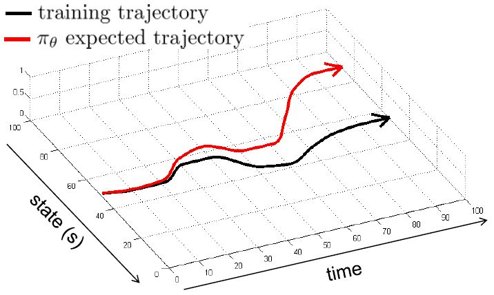

如果我们训练完毕，期望能够重新生成这条黑色轨迹。我们的训练误差可能被控制得很小，但这种函数的近似手段通常不会是非常完美的。我们使用红色的线来描绘根据之前策略得到的期望轨迹。如我们在第一个拐弯处出现了一个非常小的失误（第一次出现夹角处），这时我们的状态是和训练轨迹有一个非常小的差距的。这个失误本身并不严重，而麻烦的是，这个失误导致进入了一个新的状态，在这个状态中可能会犯的错误比之前的失误更大。虽然可能只大一点点，但是会导致这个轨迹偏离越偏越大，最后发散到一个很离谱的地方。这本质上是因为序贯决策的特性才导致了这样的问题：如果只是一个单独的问题，也许会犯点小错误，但这个错误是有限的；而这里的决策并不是独立同分布，每个行动都会影响下一个状态，这样错误就会被累积起来。

即便前面充满了对这样简单粗暴算法的批判，但是这样的做法事实上也有人在使用，如 NVIDIA 的一项关于自动驾驶的研究，Bojarski et al. (2016) 收集了 3000 英里的数据后效果一样不差。他们成功的秘诀主要是使用了一些“黑科技”，下图是其原理图。

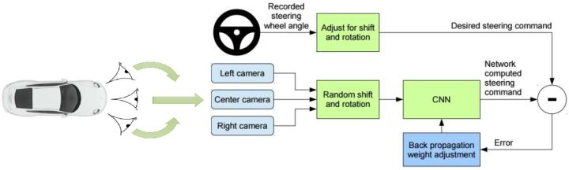

如上图所示，他们不仅在车正前方装上了摄像头，还在车的偏左偏右的两侧同样装上，通过这样获得增强的训练数据。这个小技巧就是，收集到了向前的图像，并将其标注上司机的实际操作方案。与此同时，你也获得了向左一个角度和向右一个角度的图像数据：我们可以将左摄像头得到的图像所对应的司机操作稍微加一个向右的角度，右摄像头向左，作为一个简单的补偿。从更广泛的意义上理解，这样的做法本质上是一个稳定控制器 (stabilizing controller)，对于漂移的情况给出了对于偏差的补偿校正方案。即便我们单条的轨迹可能偏离很大，但是整体轨迹的分布还是比较稳定的：不关于一个特定的有界的区域偏离太多。

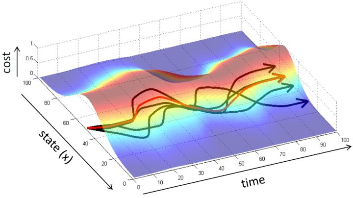

对于一个轨迹分布，其中轨迹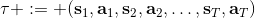，之后的课程中我们可以使用一个类似迭代 LQR 的算法构建一个高斯分布来描述它。转而从一个概率的角度来看这个问题的话，我们使用策略来确定行动，训练的是根据输入来输出的分布的这样一个监督学习算法。我们的训练数据中其实是符合一个特定的分布的，称为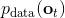。当我们真正运行我们的策略时，因为行动会对将来的观测产生影响，实际上轨迹路线上看到的数据分布将和训练数据的分布不同，称为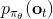，通常与不同，除非我们的训练是完美的，且看到了与训练数据一模一样的初始观测。如果两个分布不同，那么这将意味着我们将在一个与训练集有很大差异的测试集上进行测试，这在监督学习中也称为域转移 (domain shift)，通常机器学习不能保证在测试集有任何的效果。

那么我们如何能做到使得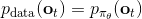呢？一个有趣的想法是，鉴于我们要去让去接近可以说是削足适履的，倒不如转头去对做点手脚让它能贴近，譬如从收集数据的时候就“根据”去做。这也是 Ross et al. (2011) 提出的算法 DAgger (Dataset Aggregation) 的思想基础。它的目标是从分布收集训练数据。为了做到这一点，我们只需要去运行策略来收集一些新的数据就可以了。困难的是，我们需要去对进行重新标记：我们不仅仅是需要图像，更重要的是要给出对应的行动才是。一个简化版本的 DAgger 算法是这样的：

1.  从人工提供的数据集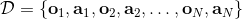中训练出策略；
2.  运行策略来获得一个新的数据集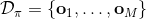；
3.  人工来对数据集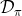进行标注，得到一系列；
4.  合并数据集，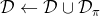。返回第一步。

第一步可以由任意的监督学习算法来完成，第二步我们希望没有什么意外发生。第三步听起来有点奇怪，就像找个人来看一个电影，然后指导这个机器应该做些什么；这个事情有的时候简单，有的时候就非常困难了，但必须得做以获得标签。这样做下来，数据集就会有越来越多的在线 (on-policy) 数据，该算法所得出的策略结果和人类专家的差异（训练误差）就会逐渐收敛到一个有界的情形，从而使得数据集分布收敛到策略分布。这个算法以“向老师请教怎么做”的互动形式模仿老师的工作，而不仅仅是老师拿出一大堆意见的填鸭式灌输而缺乏互动，我自己感觉这在人类教育中也是很有意思的想法。特别的是，就第二步而言，我们可以运行策略几分钟然后马上找个人来标注数据再重新训练，也可以运行一年然后再标注，取决于具体的需要。有一个使用 DAgger 训练的无人机飞行避开树木的例子，先用一个训练集来训练策略，让它飞一段时间后人工对这些数据进行标注，再重新训练。

在这个过程中，第三步我们可能会需要很长的人工标注时间（我感觉通常比收集数据本身难多了），而且有相当难度。譬如指导汽车驾驶，如果坐在驾驶位上可能是非常熟练的，但给你图片让你给出标注可能就不那么容易了。那么能不能在不用很多数据的时候使得模仿学习成功呢？深度增强学习的理论常常给予否定答复，然而在实践中往往是可行的。DAgger 算法解决分布“漂移”的问题，而如果我们的模型非常好，不会产生“漂移”，事情就会容易很多。要想做到这点，我们需要去非常精确地去模仿专家的行为，同时也不要过拟合，虽然在很多情况下这个事情很难做到。如果能做到这点，虽然我们不能完全消除累积错误，但是一定程度上可以得到缓解。

有两个原因使得我们经常不能很好地学习专家行为。

第一个是非 Markov 行为，意思是专家所做的行为可能不完全依赖于当前所看到的东西。我们在前面学习的假设中，给定的策略形式假设行动只依赖于当前的观测。在这样的假设下，如果我们看到同样的东西两次，那么我们也做同样的行动两次，和之前是否看见过是没有关系的。这在一些情况下并不合理，是因为我们只能得到部分观测 (partially-observed)，当前的状态不能被这个观测所完全推断出来。还有一点就是即便是人类，看到同样的事情两次会做出一模一样的行动，通常也是非常不自然的：譬如开车，每次行为都会有些差异，我们也很难理解我们为什么这么做，也不理解到底发生了什么。要想解决这个问题，一个想法是把之前所有的观测都提供出来，变成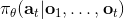：行动依赖于过去所有的观测，这样就能处理非 Markov 行为了。那么怎么使用整个历史呢？在自动驾驶的例子中，如果历史帧数多的话，权重参数的个数就会增长得很快。在这个时候，通过权重共享等手段，循环卷积神经网络就可以大显身手了。训练的目标是让输出的行为概率分布更接近人工操作。对于 RNN 的选择，通常使用 LSTM 的效果是比较好的。

第二个是多峰 (multimodal) 行为。当我们要驾驶无人机躲避一棵树的时候，我们可能会向左绕或者向右绕，但如果将这些决策进行平均的话就变成向前飞然后撞上去了，就悲剧了。如果我们采用离散的概率分布，其实问题不大：如果离散成(向左飞，向前飞，向右飞)，那么肯定向左向右有一个很大的概率而向前飞概率很低。而如果我们使用连续的概率分布，或者我们将它离散化得非常细，那么概率分布将会一团糟。如果我们使用高斯分布这样的单峰分布，显然是不合理的。这只是一个比较简单的例子，是这类问题的冰山一角，实际中经常发生。那么我们怎么去解决这类问题呢？

1.  第一种方法是使用高斯分布的混合，即把分布表示为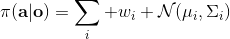这样的加权线性组合，这样就可以代表一些多峰分布；这五类方式的主要缺点是需要指出这个分布有多少个峰，如果有十个峰的话可能还是很麻烦的。
2.  第二种是使用隐性密度模型 (Implicit Density Model)，这类模型可以表达任意概率分布：虽然它本身还是输出一个高斯分布或者一个什么其他的简单分布，甚至可以是一个值。现在我们输入的不仅仅是一个观测图像本身，同样也输入一个噪音进去，譬如给定维数的多元高斯噪音，然后得到输出。这一模型可以学习任何的非线性函数，可以把单峰的噪音变成多峰的输出。我自己感觉这个模型输入了一个随机噪音进去，对应了原分布的某一个位置，有点像概率论里面的分布变换。这种方法的主要问题是这个模型很难训练。
3.  第三种是使用自回归离散化 (Autoregressive Discretization)。如果有连续的动作，一个可行的方法是将其离散化；但是如果维度大了，离散化后的联合分布将维度灾难。一个小技巧是避免联合离散化所有维度。假设我们有三个维度，首先我们离散化维度 1，通过诸如 Softmax 的方法得到维度 1 的几个离散分类的分布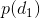。然后我们从这个分布里面进行抽样，得到维度 1 的值（其实是某个分类），然后把这个值输送给另一个神经网络（顺便还有图像或者某些隐藏层数据），这个神经网络给出离散化后维度 2 的分布，再如此得到维度 3 的分布。这样做的一个好处是，维度 2 的分布是以维度 1 的样本为条件的，即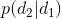。这样就可以表示出任何的联合分布，但是在一个时段只需要离散化一个维度。当你训练这样的模型时，只需要给每个维度的正确值就可以了，做一个标准的监督学习过程。在测试中，需要依此采样然后馈入后续网络之中。

总结来说，模仿学习通常有一定局限性（分布不匹配的问题、误差累积问题），但有时候能做得不错，如使用一些稳定控制器，或者从稳定轨迹分布中抽样，抑或是使用 DAgger 之类的算法增加更多的在线数据，理想化地如使用更好的模型来拟合得更完美。

## 案例

第一个案例是 Giusti et al. (2016)，使用一个四旋翼在森林小道里飞。他们的策略与之前 NVIDIA 的相似，也使用了左右摄像头进行补偿。实际上，他们遇到的问题比 NVIDIA 的自动驾驶更为困难：因为森林小道通常是非常凌乱的，很难进行清晰的感知，有些时候给一个图应该往哪儿飞都得仔细分析一会儿。首先，他们将动作的输出离散为向前、向左、向右三个；然后训练深度卷积神经网络来从图片得到动作。在这个问题中，收集数据可能是比较困难的，因为四旋翼本身非常续航时间很短，经常需要充电；他们的解决方法是用人头上绑三个 GoPro 摄像机来收集数据，并认为左中右三个相机拍摄到的图像应该被分别标为右前左。事实上，这样做的效果非常好：虽然这样做会非常尴尬，但每个人都能做到。

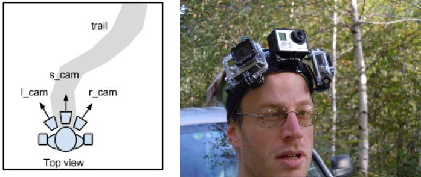

第二个案例是 Daftry et al. (2017)，同样是四旋翼控制问题，使用 DAgger 来规避分布不匹配的问题。在 DAgger 的第三步，需要人工参与标注。人类通常比较难看着某些动画来拉控制杆，因为人类需要一些反馈信息。他们编了一个更直观的接口，使用了画图中红线的方式，来计算出四旋翼应该调整的角度，这样对于人工标注的难度就大大降低了。同样，他们建立了一个深度神经网络，从一个图片入手输出四旋翼指令。他们的数据中有夏天的数据和冬天的数据（两者看起来差异很大），引入了一个对抗域适应机制，设计一个通用的神经网络来解决两个季节问题和不同四旋翼的问题。

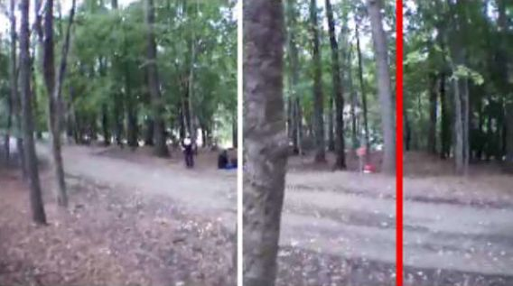

第三个案例是 Rahmatizadeh et al. (2016)，使用游戏手柄和模拟器训练机械臂的运作，把一个盒子（标志物）夹起来放到某个地方去。使用 LSTM 来处理非 Markov 问题，使用混合高斯分布来处理多峰问题。他们在训练时候也故意会犯一些错误，来阐述一些更正手段。当机器人成功后人会把盒子移开，机械臂会再去夹。有趣的是这没有一个阶段性任务的说法，事实上只是一个 LSTM 不停地在运转而已。Levine 教授推测 LSTM 之所以有意义，很可能是因为人的指导过程会产生非 Markov 的偏差。

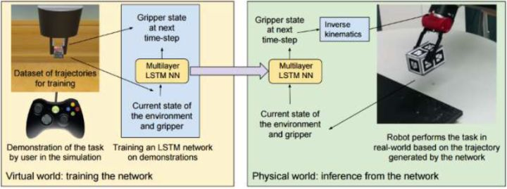

模仿学习在很多其他领域也有应用。如结构预测问题，不仅仅是输出一个标签，而是更结构化的输出。这种预测问题在自然语言处理，如机器翻译或问答机器人中尤为重要。比如人家提问“Where are you”，回答“I'm at work”。如果像 RNN 一样一个词一个词输出，如果第二个词 at 变成了 in，那么第三个词可能就不能是 work 了，即便和数据本身比较接近，可能说 school 会好一些：第二个词的选择会影响第三个词。因此在结构预测问题中，答案的一部分会影响另一部分，有点类似一个序贯决策问题。因此一些模仿学习方法已经在这个领域中流行了起来：因为通常有训练数据所以会比较像模仿学习，而且是序贯的。其他的诸如交互和主动学习，要从人的反馈中学习；再就是逆增强学习。

那么模仿学习的最大问题是什么？第一，人类需要提供数据，而人能提供的数据通常是非常有限的，即便如头戴摄像机这样相对便宜的手段被开发出来，而深度神经网络通常需要大量的数据才能把事情做好，此为一大限制。第二，人类不善于提供有些类型的行动指导，原因可能是多种多样的。第三，人类可以自主学习而机器则不能，自主学习的好处是我们可以通过自己的经验获得无限量的数据，看到错误可以自我修正，达到连续的自我提升。

## 奖励/代价函数

要超越模仿学习，我们必须找到我们真正想要的是什么。回到一开始人与老虎的那个例子，让我们先不考虑策略函数。在这种情况下，我们真正想要做的事情是给出一连串决策，使得被老虎吃掉的概率最小：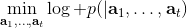。如果我们真的知道被老虎吃掉这个事情怎么用数学形式表示，我们可以把它描述成一个最优化问题。一般来说，我们想做的是最小化一系列的代价函数：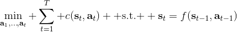。譬如我们可以把被老虎吃掉的概率当成我们的代价函数，或者负的奖励函数。我们不能选择最终我们停留在什么状态，这是由系统转移的动态决定的；我们能选择的就是一系列的行动。因此，如果要超越模仿学习，我们需要定义关于代价或者奖励的目标函数：代价函数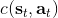或者奖励函数，两者是相反数关系。奖励函数在动态规划领域更流行，而代价函数在最优控制领域更流行。

在实践中，奖励函数有很多种形式。譬如让一个机械手抓住一个小球并放到某个指定地点，当然我们可以选择这样简单的函数，但这样的函数通常很难帮我们解决增强学习问题：直到你把小球移动到目标位置之前，你真的不知道你应该这样做。所以通常解决实践问题，我们会设计一些更循序渐进的奖励函数，如 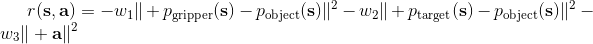 之类，我们减少机械臂和小球的距离，也要减少小球和目标的距离，也避免让动作做得太大。这三个目标都不是我们真正想做的意图，但能帮助我们做事情。一个使机械小人奔跑的例子也是，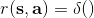这样的函数并不好，而使用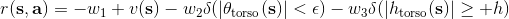之类的函数，要增加小人的运动速度，控制躯干的倾斜角度避免倾倒，保持躯干的高度。

同样，模仿学习也可以写出奖励函数，如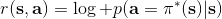，也就是我们策略的行动应该尽量与专家的指导意见一致。事实上 DAgger 算法也在优化这个东西，它能够逐渐使得这个奖励函数靠近最优的奖励函数。

通常我们设计代价和奖励函数会有一些困难。当我们玩电子游戏的时候，可能会有一个得分显示在屏幕上，来说明你现在玩得有多好；但在很多现实问题中，并没有一个显式的得分这样的概念，比如一个孩子想要倒一杯水，很难说奖励函数是什么。Rusu et al. (2016) 用了一种方法把机器人在模拟仿真下学习到的策略转移到现实控制问题中，但是他们在模拟中可以轻松得到的小红方块的位置，在真实情况下就变得不容易光从图像中感知到位置了：他们需要写出一个计算机视觉程序来定位这个红色方块。这样一来，他们虽然自称是从像素中得到数据，但是还是需要用监督学习来确定红色方块，是有一些悖论的，也说明了奖励函数的设计在这个像素级别的问题中不是端到端的。