# (3) 增强学习简介

> 作者：[谢天](https://www.zhihu.com/people/xie-tian-55-77)
> 
> 来源：[POST 馆](https://zhuanlan.zhihu.com/c_150977189)

## Markov 决策过程与增强学习

在上一篇中，我们已经熟悉了状态、观测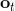、行动、策略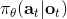或者是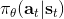的概念，也知道了从包含认知世界所需要的所有信息的状态得到观测，然后使用策略做出行动，最后由状态和行动经过系统固有的转移概率分布函数 (dynamics) 得到下一期的状态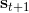这样周而复始的过程，同样我们也明白了给定状态，假设之后的状态和之前的状态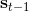等无关的 Markov 性。

我们同样给出了如果我们有充分的数据，一定程度上可以做监督学习（模仿学习）。但是如果我们没有数据的话，需要用一些方式来定义这个任务。在上一篇的结尾也提到，一个核心是要去设置一个收益函数，它定义了什么样的 (状态, 行为) 二元组是好的，以及什么样的是不好的。譬如在自动驾驶问题中，如果汽车开得很顺利速度很快，收益函数应该很高；而如果和其他车辆撞上了，那么收益函数应该很低。收益函数的目的不是直接告诉你现在应该做什么，只是告诉你哪些结果会被认为是比较好的。而增强学习问题的一大目标就是，弄清楚现在应该做什么，使得未来的结果会更好。这也被称为延迟收益 (delayed reward) 问题，现在的行为可能不立即产生什么奖惩，而会对将来的结果产生严重的影响。

状态、行动、收益函数和转移概率共同定义了**Markov 决策过程** (Markov Decision Process, MDP)。

为了描述这一过程，我们先来回顾一下俄罗斯数学家 Andrey Markov 提出的 Markov 链。Markov 链本身并不是直接与增强学习相关。Markov 链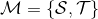由状态空间 (state space) 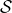和转移算子 (transition operator) 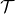共同构成。每一个状态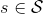可以是离散的分类变量，也可以是连续的数值之类；转移算子确定了概率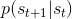，是给定当前状态转移到下一个某状态的转移概率。该算子其实是一个线性算子。如果状态是离散的，令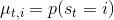为在时刻处于状态的概率，从而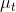是一个加和为 1 的概率分布向量，表示了在时刻的概率分布；令转移概率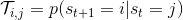，则这些概率组成一个转移概率矩阵，且有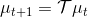的关系。如果状态是连续的，则无非状态变成了无数个，转移概率矩阵无穷大，但还是线性的。Markov 性体现在转移概率的定义上，当我们知道状态了，下一个状态就不依赖于其他的信息了，分布为。

Markov 决策过程 (MDP) 是将 Markov 链放在一个决策环境的扩展产物，在 1950 年代由 Richard Bellman 等人提出。Markov 决策过程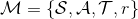相比之前多了一些组件。其中状态空间保持不变，多了一个行动空间 (action space) ，行动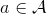同样可以是离散的也可以是连续的。在这里，转移概率不仅受到状态影响，还受到行动影响，因此转移算子在这里变成了一个张量，每个元素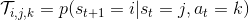。如果令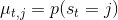，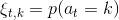的话，同样存在一个线性关系： 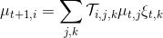。因此下一期的状态只与当期状态和当期行动有关系。最后一部分是收益函数，是一个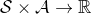的映射。

一个更加广义的问题被称为**部分可观察的 Markov 决策过程** (Partially Observed Markov Decision Process, POMDP)。该过程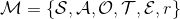新增了两个组件：观察空间 (observation space)，同样是可以离散可以连续的；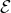为排放概率 (emission probability)，决定了给定由后，的概率分布为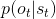。

现在我们来说明增强学习的目标是什么。在这里我们假设的策略函数是清楚的，可以由一个参数为的深度神经网络确定（这里先假设完全可观察）。我们将状态输入到深度神经网络之中，得到行动，共同输入给环境。环境通过某些转移概率函数（一般我们假设这个是不知道的），得到新的状态，形成一个循环。

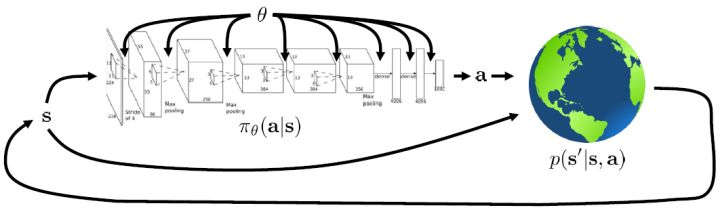

我们考虑一个有限长度的(状态, 行动)轨迹 (trajectory)，。对于这样的轨迹，发生的概率为。我们通常不能控制初始状态，而后面每一期的行动都由当前状态和策略函数决定，转移概率具有 Markov 性，故可以表现为这样乘积的形式。而我们想做的是，选出一组最优的神经网络参数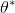，使得，即最大化总收益函数的关于轨迹期望。收益可以非常稀疏，如打一场篮球赛，如果最后时点赢了那么得到收益为 1，此外其他时间的收益都是 0；如果想减少自动驾驶中车祸的数量，也可以设置成一旦发生车祸就给予-1 的收益；总体来说，如何使用收益函数是非常灵活的。

值得一提的是，这个发生概率其实本质上是一个关于增广的空间的 Markov 链。具体来说，可以表示为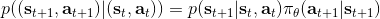。

对于有限长度的轨迹问题，事实上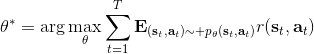，只需要关注这个 Markov 链在一个时间点上的边际分布就可以了。对于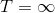的无限长度的问题，由于我们之前已经把的 Markov 链化，因此有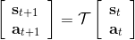，进一步步转移算子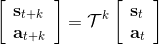。我们考虑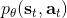是否逐渐收敛到一个平稳分布 (stationary distribution)：之所以说平稳分布，是因为经过一次状态转移后，分布不发生变化，这样的分布也就是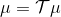，也就是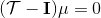，或者说以矩阵特征向量的角度考虑，是特征值为 1 的特征向量。由于是一个随机矩阵，给定一些正则条件，这样的向量总是存在的，此时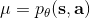是其平稳分布。对于无限长度的问题，我们也可以对目标函数进行平均，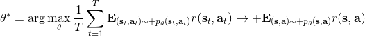，它将完全由平稳分布下的情形所控制。

在增强学习中，我们几乎只关心期望，而不是个别的值，这是因为这给予了我们很好的数学性质。譬如说在盘山公路上开一辆车，如果正在运行那么收益函数为+1，如果掉下山崖则收益函数为-1。此时，我们的收益函数是不光滑的。假如说我们从非常复杂的系统中提取出了一个概率，作为掉下的概率，此时如果我们关注期望的话，平稳分布下的收益函数的期望，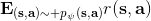则是关于光滑的！这一点非常重要，允许我们使用诸如基于梯度的算法来优化非光滑的目标（可能是非光滑的转移，或者非光滑的收益函数等等导致）。

## 增强学习算法的一般步骤

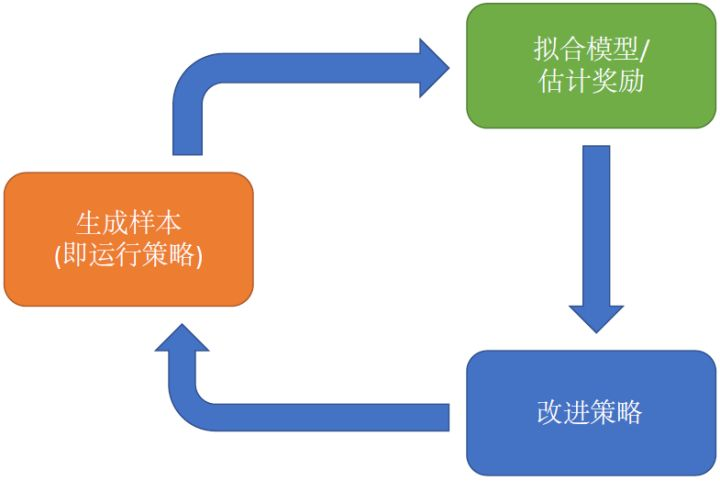

几乎所有的增强学习算法都会由以上三部分组成，即便可能特定算法会退化掉其中的一部分。

1.  生成样本。我们在现实世界（或者模拟器）中运行我们的策略，来收集轨迹样本。有的时候，这个轨迹可以只是一个转移，这样就是一个很短的轨迹；也可以是完整的有始有终的一条。
2.  拟合模型/估计收益。对于策略学习算法，则这个部分就是策略评估 (policy evaluation)；对于基于模型 (model-based) 的增强学习算法，那么就是模型拟合，等等。这个步骤中并不改变我们的行为，但我们想通过研究我们在第一步中得到的样本来看发生了什么，当前的策略有多好，或者尝试去分析物理环境等等。
3.  改进策略 (policy improvement)。根据之前的研究结果，改进策略，再投入到第一步的运行中去。

不同算法在不同步骤要做的事情也差异很大。在绿色方块的第二步，策略梯度法只需要计算一个求和来得到收益，诸如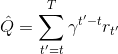； 基于值函数的方法诸如演员-评论家算法和 Q 学习算法则需要去拟合一个用深度神经网络代表的函数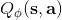；基于模型的方法则需要去估计转移概率。在蓝色方块的第三步，策略梯度法需要对神经网络的参数进行一个梯度步的调整，诸如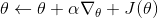；Q 学习法则需要找到一个使得 Q 函数最大的行动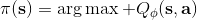；基于模型的方法则需要用诸如反向传播梯度的方法去优化策略函数。

哪些步骤昂贵，哪些步骤廉价，实际上取决于选取的算法和要处理的实际问题。就生成样本而言，如果我们运行诸如汽车、机器人等，需要用到真实物理系统的话，我们只能以 1 倍速度实时收集数据（除非有了时间穿梭手段）；当然如果我们有多个物理系统我们可能可以进行并行的数据收集。而如果我们使用诸如 MuJoCo 之类的模拟器，那么我们可以期待有 10000 倍速度的加速。因此取决于我们的具体问题，生成样本的难度可能会是效果的主要限制因素，当然也可能微不足道。同样，绿色方块第二步策略梯度法计算求和很容易，而 Q 学习方法的拟合神经网络则代价较高而且很难并行。但是，在蓝色方块第三步中，Q 学习方法对应的找到使得 Q 函数最大的行动却非常容易，而基于模型的方法的反向传播优化策略则相对很困难。

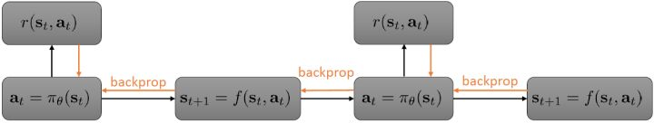

让我们来考虑如上的有点像基于模型的增强学习中，用反向传播来训练增强学习模型的玩具例子。假设环境是确定性的（非随机），策略用一个神经网络表示，给定状态，输出一个行动。整体形式类似于一个 RNN，优化策略的方法是反向传播收益函数的梯度。要做这件事情，我们要收集数据（第一步橙色方块），也要更新模型，保证模型和实际发生状态转移情况一致（第二步绿色方块）。前向传播用于计算收益函数，也属于第二步绿色方块之中。唯一属于第三步蓝色方块的是计算梯度并将其反向传播。当然这个过程也是非常不足的，譬如只处理确定性的环境和策略，只处理连续的状态和行动，且优化问题也是非常难以求解的。

## Q 函数与值函数

那么如何处理随机系统呢？因为我们考虑的目标主要还是关于期望，因此条件期望成为一个非常有力的工具。我们想描述一个期望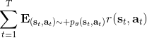，而这个期望则可以由一系列嵌套的条件期望所描述： 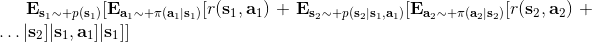 其中第一个状态是服从于初始分布，在第一个期望内，我们要对第一个行动取期望，是服从于我们的策略的。第二个状态是以第一个状态和第一个行动为条件的，依次类推。而我们想做的事情，首先是找到一个非常好的**第一个行动**。我们把中间的递归部分抽离出来，令 ，如果我们知道这样一个函数，那么原来的问题就可以被简写为  ，我们对的选择的事实上就不依赖于其他的东西了。我们把这样的函数称为**Q 函数** (Q-function)，表现为在状态下，选择行动所能带来的收益函数的条件期望。如果 Q 函数已知，那么改进策略将非常容易：我们只需要挑选一个，使得 Q 函数最大化就行了，即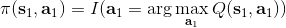。同样也可以在其他步骤类似这样做法。

那么我们给几个重要的概念下定义。

> Q 函数：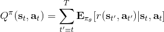，从时刻状态为起，执行行动，之后根据给定策略决策，未来总收益的条件期望。
> 值函数 (value function)：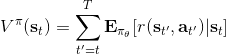，从时刻状态为起，根据给定策略决策，未来总收益的条件期望。

由于 Q 函数和值函数的特别关系，值函数也可以表示为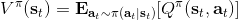。需要注意的是，这样定义的函数的右上角都有个，指的是它都是关于某个特定的策略函数的。注意，经过这样的标记后，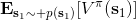正好是增强学习的目标函数。

这两类函数之所以有价值，是因为如果我们已知这两类函数，那么能够很方便地做很多事情。譬如：

*   如果我们现在有一个策略，且我们知道，那么我们可以构造一个新的策略，这个策略至少和一样好（且可能更好），是因为这一个策略最大化未来的收益。这一点与当前的是什么没有关系。
*   我们可以增加“好的行动”发生的概率。注意到，代表了在策略下的行动平均水平，所以如果，就能说明是高于平均水平的行动。那么我们便可以改动策略，使得这样的行动发生的概率上升。

## 增强学习算法的权衡

回顾我们的目标，。在增强学习中，有以下几类基本算法：

*   **策略梯度法**：这类算法直接对目标函数关于参数求梯度。本质是一阶最优化算法，求解无约束优化问题的通用方法。
*   **值函数方法**：这类方法尝试去近似估计**最优策略下的**值函数或 Q 函数，而并不揣测策略函数是什么。注意此时策略并需要不显式表达出来，只需要选择使得 Q 函数最大的行动即可（或者值函数类似于动态规划中的手段）。
*   **演员-评论家 (actor-critic) 方法**：这类方法尝试去近似估计**当前策略下的**值函数或 Q 函数，并用这个信息求一个策略的梯度，改进当前的策略。所以也可以看作是策略梯度法和值函数方法的一个混合体。
*   **基于模型 (model-based) 的增强学习方法**与上面的几类都不同。它需要去**估计转移概率**来作为模型，描述物理现象或者其他的系统动态。有了模型以后，可以做很多事情。譬如可以做行动的安排（不需要显式的策略），可以去计算梯度改进策略，也可以结合一些模拟或使用动态规划来进行无模型训练。

我们来看基于模型的方法如何分解成三个方块的步骤。在第二步绿色方块中，显然它需要去学习转移概率。在第三步蓝色方块中，改进策略可能有很多不同的选项。

1.  有了模型，我们可以抛开策略，直接使用模型去模拟安排。对于连续问题，可以用一些轨迹优化和最优控制的方法；对于离散问题，可以使用譬如蒙特卡洛树搜索 (Monte Carlo Tree Search, MCTS) 的方法来对离散的行动空间进行计划。
2.  我们可以将梯度反向传播回策略之中，这通常需要一些技巧来使得它能真正起效。
3.  也可以使用模型来学习值函数和 Q 函数。如果运气好，在一个空间足够小的离散环境下可以使用动态规划，一个更流行的方法是用这个模型生成综合的“经验”，然后进行无模型训练（如 Dyna 算法）。

值函数类算法在绿色方块中做的是去拟合一个值函数或者 Q 函数，而蓝色方块的策略改进部分则没有显式的过程，策略仅仅是去选一个行动使得 Q 函数最大。直接的策略梯度法的绿色方块做的是计算收益，蓝色方块做的是计算一个梯度，这一点做起来是非常神奇的。演员-评论家算法是两者的混合，因此这两个它都做一点：绿色方块它拟合值函数或者 Q 函数，并用这些函数去评估收益，蓝色方块还是跟策略梯度法做的一样，走一个梯度步。

为什么我们需要那么多中不同的强化学习算法？在强化学习中，没有一个单纯的算法在所有情形下都表现得很好，因此算法之间需要有很多**权衡点**：首先是**样本效率** (sample efficiency)，就是要有一个不错的策略效果需要橙色方块收集多少数据；其次是**稳定性**和**易用性**，主要体现在选择超参数和学习率等调参的难度，在不同的算法中这个难度可以差别很大。不同的算法也有不同的前提假设：有些算法假设系统动态和策略是随机的，有些是确定性的；有些连续有些离散；有些有限期 (episodic) 有些无限期。还有一个很现实的问题是，在不同的问题下，要去表示一个东西的难度是不一样的，譬如有些问题去表示一个策略是比较容易的，而有些问题去拟合模型更容易：因此方法的选择对于特定问题很有关系。

在橙色方块中，我们主要关心样本效率。样本效率意味着我们要得到一个好的策略，需要收集的样本数量：这决定了我们需要在模拟器或者真实世界运行我们的策略多久才能让它到一个稳定状态。最重要的一点是，我们的算法是否是**离线** (off-policy) 的。离线的意义是我们可以在不用现在的策略去生成新样本的情况下，就能改进我们的策略。其实就是能够使用其他策略生成过的历史遗留数据来使得现在的策略更优。**在线** (on-policy) 算法指的是每次策略被更改，即便只改动了一点点，我们也需要去生成新的样本。在线算法用于梯度法通常会有一些问题，因为梯度算法经常会走梯度步，些许调整策略就得生成大量样本。

上图是一个算法间的样本效率比较图（是非常粗糙的，具体效果如何其实非常依赖于特定的问题）。以竖线为分界点，离线算法有较高的样本效率，在线算法则较低。如最右侧的进化算法，甚至都不使用梯度信息，只是把参数当成一些黑盒子，使用一些不可微函数的方法来作用在参数上：它们需要最多的样本，因为它们没有利用梯度信息。在线的策略梯度法也是在线算法，每次策略更改后需要重新收集数据，但它利用了梯度信息所以会高效一些。演员-评论家算法在两侧都可以有。离线的 Q 学习法，通常学习 Q 函数可以是完全离线的，样本效率较高。基于模型的深度增强学习方法更有效，更极端的基于模型的浅度增强学习方法不去拟合神经网络，使用一些更加高效的贝叶斯方法，但通常会引入一些很强的假设来作用于一些特定的问题。

然而样本效率低并不代表这个方法是“坏”的。为什么我们会用一个样本效率较低的算法？答案有很多，其中一个答案是现实时间并不与样本效率相同。如果你有一个很快的模拟器，可能你根本不关心收集样本所需要的时间；我们关心的是真实发生的时间消耗，优化我们的策略需要花多少时间，其中包含模拟时间和优化神经网络的时间。有一些时候，将进化算法进行并行是最快的；在线的策略梯度法有时候也很容易做并行，也相当快，如果模拟是相当廉价的。相对的，基于模型的增强学习，即便它们充分利用数据，真实时间也相当慢，因为可能去拟合了很多个不同的神经网络模型（转移概率、策略），需要反向传播很长的序列，有可能更昂贵。

关于稳定性和易用性，我们需要问一系列问题。首先是这样的算法收敛么？如果收敛的话，收敛到什么地方？它在所有情况都收敛么？至于这为什么会成为问题，我们在监督学习中训练巨大的模型，在现在技术下通常收敛得不错。这是因为，在监督学习中，我们采用的基本上都是某种意义上的梯度下降法，而这样的算法分析起来是相对简单的，大家对它比较了解，也有很好的让它收敛的办法。而增强学习通常不使用梯度下降法，譬如 Q 学习法本质上是一个不动点迭代的过程，在一定条件下收敛；基于模型的增强学习，当我们在优化转移模型时，它并不优化期望收益函数；策略梯度法是梯度方法，比较好用，但它的样本效率比前两者都要低。这些都是权衡，更聪明的算法可能更难用。

很多方法都有缺点，如值函数拟合方法，一般来说我们优化的是它对期望收益函数拟合得多好，但是把这个函数拟合得好并不意味着有一个很好的策略，减少预测误差不见得最大化期望收益；在更坏的情况下，它什么都不优化，事实上，很多流行的值函数拟合方法在非线性的问题中并不能保证收敛性。基于模型的增强学习方法，立足于减少模型预测误差，这是一个监督学习问题，一般会收敛；但这不意味着一个更好的模型能得到一个更好的策略。策略梯度法是仅有的关于目标函数使用梯度上升方法的，但也有一些缺点。

不同的方法由不同的假设。**完全的可见性**常常被值函数拟合类方法所假设，可以通过加入 RNN 的方法来缓解；**有限期**被纯策略梯度法和一些基于模型的增强学习算法假设，这些方法不用去训练值函数，对于有些机器人问题中确实是如此的（机器人拼乐高的例子）；**连续性和光滑性**也是一些连续的值函数学习法和一些基于模型的增强学习算法（如浅层学习）所假设的，如果知道连续性，那么可以有一些技巧可做。要看问题具体满足什么样的假设，然后选取合适的算法。

值函数拟合方法有 Q 学习（深度 Q 网络 DQN）、时间差分学习、拟合值迭代等，策略梯度法有 REINFORCE、自然策略梯度 (Natural Policy Gradient)、信赖域策略优化 (Trust Region Policy Optimization, TRPO)等，演员-评论家算法如 A3C、基于模型的增强学习算法如 Dyna 和引导策略搜索 (Guided Policy Search)等。

基于值函数方法的一个最经典的例子是使用 DQN 来打 Atari 游戏 (Mnih et al., 2013)，使用卷积神经网络来估计 Q 函数，学习的不是策略而是 Q 函数来预测未来的收益，并由此得到策略。Levine et al. (2016) 使用引导策略搜索 (GPS) 这样的基于模型的增强学习方法来做基于像素图像的机器人控制，拟合局部模型。Schulman et al. (2016) 使用加入值函数近似的策略梯度法 (TRPO) 来训练小人模拟行走，走的时间逐渐变长。