# (4) 策略梯度法

> 作者：[谢天](https://www.zhihu.com/people/xie-tian-55-77)
> 
> 来源：[POST 馆](https://zhuanlan.zhihu.com/c_150977189)

## 策略梯度法

在上一篇中，我们已经熟悉了智能体通过增强学习与环境打交道的运作机理：当前智能体处于某个状态，会根据某种诸如由参数为的神经网络所表示的策略，得到行动，作用于环境中，由环境内在的某种动态决定的状态转移概率得到新的状态，接着循环往复。我们也知道了根据这样的决策过程，由 Markov 性，一个轨迹的出现概率是。我们的目标是选出一组最优的神经网络参数最大化总收益函数的关于轨迹分布的期望。

首先我们要研究怎么去评估这个目标，然后再考虑如何去改进当前的策略。我们把目标函数记作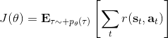。除非我们的分布性质非常干净譬如说高斯分布，通常我们不能精确地对这个期望进行评估，但我们可以去用蒙特卡洛方法抽样近似。如果我们根据轨迹分布来抽样的话，目标函数的一个无偏估计是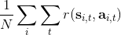，其中样本量为，第个样本在时刻的状态为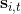，行动为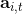。因为分布是关于我们当前策略的，因此我们抽样的方式是在实际环境或者模拟器中运行我们的策略，来生成这些轨迹。如对于机器人，只是让它去尝试完成任务，看它做得怎么样。同样策略下，不同轨迹可能有些做得好有些做得不好，对每个轨迹得到一个评分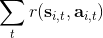，然后把这些评分平均起来来近似我们的目标函数。这是一个最简单的利用蒙特卡洛方法来评估一个策略是否好的方式。

现在考虑怎么去改进策略，在连续优化中最常见的方法是计算其梯度，然后让参数走一个梯度步。现在看怎么在这个目标中实现这个步骤。令轨迹的收益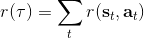，则。根据期望的定义，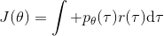。它的梯度为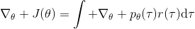，因此其实我们关心的主要是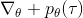这个部分。以下有一个非常重要的恒等式：

> 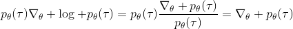

我们把这个式子代回去，得到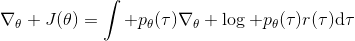，因为式子中又再度出现了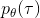这个概率，它本质上又变回了一个期望：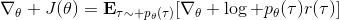。回想我们的概率表达形式，将两边取对数，得到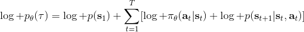。在原式子中，我们需要的是这个东西关于的梯度，而事实上初始分布和转移概率本身都与参数并不相关。因此形式上只有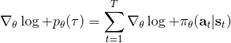。再将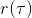展开，我们得到的最终形式如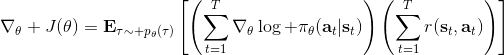。这个形式的最大优点是，它不需要我们知道状态的初始分布，也不需要我们知道转移概率：而这两者通常正是非常困难的！这一点是非常重要的，我们只需要从环境中抽一些样本来估计一个期望，然后我们唯一需要知道的事情是关于我们策略的梯度，不需要知道这个环境本身是什么样的。

关于蒙特卡洛估计方法，与之前类似，我们也可以从实际系统中抽样，用来作为一个无偏估计。得到梯度后，使用梯度上升法走一个的梯度步。我们在上一篇提到过一般的增强学习算法都可以由三大块构成，第一步橙色方块是我们生成很多样本，用于估计目标函数和梯度；第二步绿色方块用来估计收益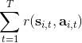，用于判断我们的策略有多好，非常简单，只需要一个加总；第三步蓝色方块需要我们搞清楚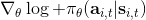，求出梯度然后走一个梯度步。这样，我们就得到了一个最简单的策略梯度法 REINFORCE (Williams, 1992)：

1.  运行策略，抽取样本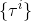；
2.  估计梯度；
3.  走一个梯度上升步。

不幸的是，通常直接这么做效果不会很好，因此我们需要做很多工作让它能真正运行起来。但在优化这个算法之前，我们首先要解决之前的遗留问题，搞清楚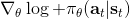到底是什么。这个是根据策略分布不同而有差异的，譬如说之前我们所讲述的模仿学习之中，模仿学习也想学习一个策略，从一个状态输出一个行动之类：假设我们只有两种操作，向左转或者向右转，那么策略就变成了一个向左或者向右的概率。

考虑一个人形机器人的控制问题。此时小人需要得到连续的控制变量，而不是离散的。假设我们的策略函数输出的是一个高斯分布，形如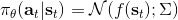，我们的神经网络根据当前状态输出均值，而一个简单的情形，协方差矩阵可能是固定的。根据分布函数，我们有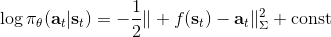，形式非常简单；将它取梯度，得到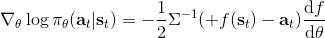。在实践中，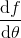是对神经网络取梯度，需要一次反向传播。而训练神经网络我们也是走一个梯度步，因此我们只需要在走梯度步的时候乘上权重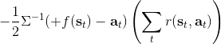就行。

我们回顾一下之前我们都做了些什么。我们用轨迹样本近似了目标函数的梯度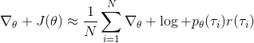。在普通的监督学习之中，我们可能会尝试使用极大似然估计，梯度是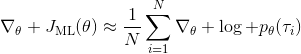。可以发现策略梯度在做非常相似的事情，除了策略梯度法尝试对不同的样本进行加权，权重是收益函数之和。每个样本的收益可正可负，因此在行为上，极大似然估计梯度总是尝试去增加所有样本的出现概率，而策略梯度法则尝试去减少一些不好的样本的出现概率，增加其他样本的出现概率，属于一个趋利避害的试错过程的梯度上升法版本。在计算机程序上，这两者也是非常相似的：如果我们能有代码计算极大似然估计，那么它也可以稍作修改以执行策略梯度法。

如果我们的观测不完全，即只有部分观测信息，怎么办？在策略梯度法中，这不是个问题。我们可以得到基于观测的梯度，可以发现这个式子中完全没有用到 Markov 性。也就是说，我们可以直接在 POMDP 中使用策略梯度法，不需要任何的修改；但是在之后的诸如演员-评论家算法、Q 学习算法之类的，这个性质往往是不成立的。这是策略梯度法的一大优势。但即便如此，它不能保证你能得到一个运行得很好的策略，因为非 Markov 性可能导致真正运行得好的策略和之前的历史有关，但是它能在你的**策略簇中**找到一个不错的策略。如果你觉得历史还是非常重要的，那么可能使用一个 RNN 会好一些。

策略梯度法通常会有一些问题。第一个问题下一节会讲，第二个问题我们会在将来讨论怎么去缓解。

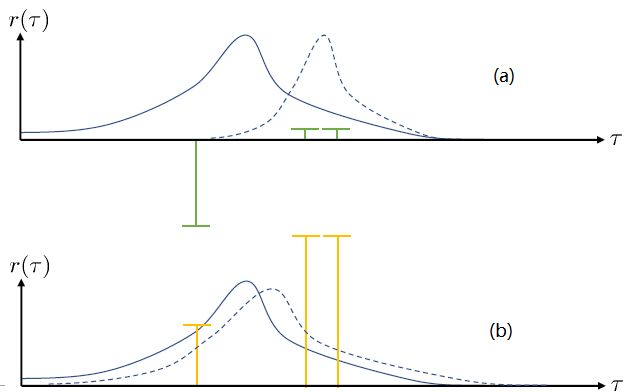

第一个问题：在两个图中，x 轴代表轨迹，而 y 轴代表轨迹对应的收益。蓝色实线是我们选取策略的分布密度。我们从分布之中抽取了三个样本，在(a)图中，可以发现最左边的样本的收益是一个很大的负数，而右边两个都是很小的正数。我们想做的就是把我们的策略右移到右边的虚线，使得在坏的位置密度更低，好的位置密度更高。实际上，正负的数值对这个算法影响很大：两个小正数和一个大负数可能把步伐拉得比较大。而我们(b)图中，只是把收益都加上了一个很大的常数，收益之间的相对差不变。如果我们**把所有情况的收益都增减同一个常数**，我们可以把这个常数从这个期望中提出来，作为一个与参数无关的部分，因此**整个期望关于参数求梯度的结果是不发生变化的**。此时，策略梯度法就会想增加第一个样本的概率（行为发生了根本性变化），但更想增加后两个的概率。这个情况下，移动的步伐就小了很多，取而代之的是可能方差就增大了，变得更平缓了。这一点被称为“**高方差**”问题。一个更极端的情形是，有很好的样本，但是它的收益函数是 0（其他的样本收益为负数），那么如何动完全依赖于我现在的策略在什么位置。我们只需要把奖励函数整体上下移动，就可以完全改变策略梯度法的行为。这个问题主要是因为如果我们选取无数个样本的话，那么这些差异互相会被抵消掉；但是对有限个样本的选择会很有偏差，就会导致这样的问题：对于这样的高方差问题，当然增加样本总是能缓解的，但是增加样本也使得学习效率降低。

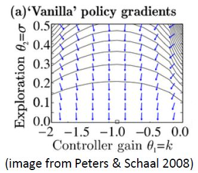

第二个问题：让我们考虑一个一维的连续状态和行动的增强学习问题。参数是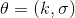。对数策略函数是一个高斯分布，由这两个参数确定，整个簇的形式是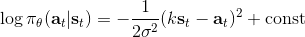，依赖于行动和均值之差的平方，其中均值是当前状态的倍。收益函数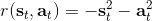，前一部分表明最终状态希望是 0，后一部分说明我们希望行动大小尽量小：这在机械中是很合理的，如果我们的行动是电动机指令的话，通常不希望让电动机运转过强。在最优控制领域，这是一个 LQR 问题，可以用解析方法求出最优解，也很容易分析。但是在策略梯度法中，有趣的是，因为收益函数希望行动尽量小，梯度法总会倾向于减小（见上图，蓝色箭头为梯度，总在降低的方向），用于减少很大的的概率：因为概率来源于高斯分布，而高斯分布的支撑集非常大。事实上，更小的，更倾向于让我们进一步减少。即便我们的梯度总是指向正确的方向，它在上的分量更长些：在很小时候，分量的大小可以忽略不计了。因此一个结果是，我们会快速下降，然而逐渐地就不动了，所以最终得到一个正确结果的速度奇慢无比。这也导致了策略梯度法的收敛速度很慢，而且选择学习率也是一个很难的问题：如果因为收敛速度慢而使用了较大的步长，反而更快地进入了一个让难以动弹的状况。

## 方差削减

第一种方法是使用**因果关系** (casuality)。回顾我们的梯度为。因果关系指的是，在时间点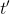的策略不能影响时间点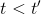的收益。这个关系看起来很蠢，就像今天做的事情不会影响昨天已经发生的事情。而事实上我们可以用这个关系得到更好的估计量。我们把后者这个括号做进前面去，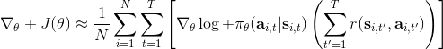。从另一个角度看，我们根据概率的可加性有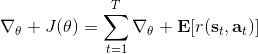 ，其中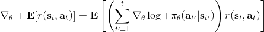，相当于是一个在当前时点截断的轨迹，因为时刻的收益的概率分布之和之前有关而与之后无关。我们将双重求和号调整顺序，得到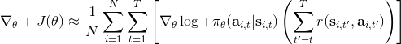：正好是我们之前论述的，一个策略只影响从它之后的部分。我们把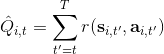记作今后收益 (reward-to-go)，也就是从这个时刻起的收益。这样做的一大好处就是，我们这样采样做，数值求和上减少了，方差也倾向于随之减少；更重要的是我们几乎没有理由不这么做，这么做基本上总是好的，即便是计算上实现起来稍微复杂了一点，但也只是一个从后往前加的后缀和的事情。

第二种有效的方法是**基准线** (baseline)。回到，我们希望好的轨迹的收益函数是正的，而差的轨迹是负的。然而之前也提到了它对值非常敏感，如果收益函数增加或者减少一个常数，结果就会很不同。所以我们想做的，可能是不依赖于轨迹自身有多好，而是一条轨迹**比平均好多少**：这里的平均指的是我们平时通常情况的普遍收益。举个例子，平均可以是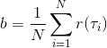，然后我们使用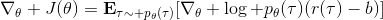。看起来是非常合理的，而且更重要的是在这里是某个常数的话，这样做总是对的。数学上，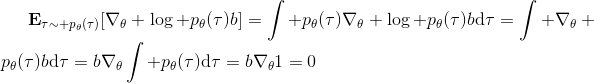 。其中第一个等号是把期望写成积分形式，第二个等号直接利用了我们之前的恒等关系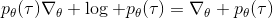，第三个利用了是常数和积分微分可交换的性质，第四个利用了对一个概率密度积分恒等于 1 的性质。因此我们减去一个常数的基准线，这样得到的估计总是在期望意义下无偏的。

当然，我们这么取平均得到一个基线常数不见得是最好的，但是实际效果却通常较好。为了降低方差，我们可以求出一个理论上最优的。回忆方差的表达式为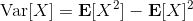。而，其方差为： 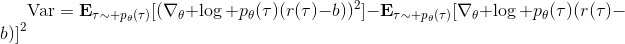 ，而我们在前面已经证明了后面一块等价于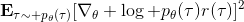，与是不相关的。我们将方差取微商取一阶最优性条件，令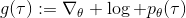，得到 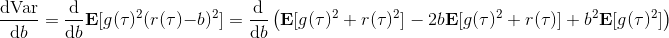 ，其中第一项微分后为 0。要使该微商等于 0，则需要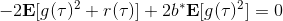，因此最优解。本质上来说，它是一个关于概率梯度的加权平均，不同样本的权重不同是因为概率的梯度不同。而我们前面说的简单平均只是它的一个粗糙简化版本而已，也是有一些理论根据的。在实践中也没有发现很大的效果差异。

## 离线的策略梯度法

我们不难发现策略梯度法是一个在线 (on-policy) 算法，这是因为策略梯度，求期望的时候必须是从当前的分布上采样才能有无偏性，而这就要求每次梯度更新之后就根据新分布全部重新采样：如果策略是一个非常复杂的神经网络，每次迭代可能只更新一点点，但也要求把之前的样本全都扔了然后重新采样，对数据的利用率是非常低的。在前面也提到了，使用策略梯度法选择学习率可能是很难的，收敛速度也可以非常低。

如果我们没有从最新的中得到的样本呢？虽然我们还是要求去估计期望，但是我们可以考虑用其他分布去估计它。假设我们有一堆从分布中抽取出来的数据，并知道对应的轨迹和收益，那我们就可以使用**重要性抽样** (importance sampling) 的方法。

> 重要性抽样的原理是 ，给了我们用其他分布的数据进行无偏估计的方法，但前面需要乘上一块东西，算是重新加个权重。

换到我们的目标函数上，则。这里我们需要具体分析这个权重是什么。由于， ，同样最难处理的初始分布和转移概率也被消掉了：我们依然保持了无需知道这些繁琐内容的性质。在实践上可能会有一些问题，但是至少在理论上还是无偏的：只要给定足够多的样本就行。

现在我们要求出目标函数的梯度了。使用重要性抽样的技术，，可以发现与有关的部分仅仅是，因此将目标函数求梯度得。继续利用恒等式，得到。我们将其展开， 这个和之前还是比较相似的，只是前面加了一块权重。同样，之前所说的因果关系可以加到这里来，类似的推导过程可以得到 ，可以理解为概率这块到此时为止，而收益从此时开始看起。

那么这么做的问题主要在哪里呢？我们不难看出中间这块连乘部分的数值，是关于指数增长的，如果每个数都略小于 1，而时间轴非常长，这个乘积最终将非常接近于 0，这样梯度效果就会很差了。

在课程的后面会具体介绍怎么解决，而这里给一个预览。我们把目标函数重写为，写成一个边际分布下的期望求和的形式。根据我们的决策过程，把期望进一步展开成。 这样，我们就可以在两个层面上做重要性抽样了：。这样就不再有指数乘积问题，但是同时又带来了一个新的需要知道这样给定策略下某个时刻在某个状态的概率这样的大难题。一个近似的处理方式是我们可以把这块弄掉，当然这样做的话理论上就不再无偏了，但是事实上当两个策略足够接近的话，可以说明这个比值是不重要的：在很多问题的实践上是好的，而且有一定的理论保证。

## 用自动差分器做策略梯度法

我们现在想找到一个比较简单的方法去实现策略梯度法，以利用上 TensorFlow 或者 PyTorch 等自动差分器。回顾梯度，我们不想显式地去计算这些，然后再做乘法丢回去。我们需要一个图结构，可以用监督学习，它的极大似然的梯度正好是我们的策略梯度，那样就完美解决了。考虑到极大似然估计的目标函数为，梯度为。我们要把给放进去。一个特性是，本身是不依赖于参数的，我们所需要做的一切就是做一个虚拟的损失函数，加权损失函数，其中权重就是，然后就用自动差分器求梯度就行了。当然，在线方法要求我们每一个梯度步重新采样，所以我们不能使用 SGD。

Levine 教授给出了 TensorFlow 样式的代码例子，给出了两者的区别（状态和行动认为是离散的，所以是 one-hot 编码，因此输入是二维张量）：

**最大似然估计：**

```
# Given:
# actions -(N*T) x Da tensor of actions
# states -(N*T) x Ds tensor of states
# Build the graph:
logits = policy.predictions(states) # This should return (N*T) x Da tensor of action logits
negative_likelihoods = tf.nn.softmax_cross_entropy_with_logits(labels=actions, logits=logits)
loss = tf.reduce_mean(negative_likelihoods)
gradients = loss.gradients(loss, variables) 
```

**策略梯度法：**

```
# Given:
# actions -(N*T) x Da tensor of actions
# states -(N*T) x Ds tensor of states
# q_values – (N*T) x 1 tensor of estimated state-action values
# Build the graph:
logits = policy.predictions(states) # This should return (N*T) x Da tensor of action logits
negative_likelihoods = tf.nn.softmax_cross_entropy_with_logits(labels=actions, logits=logits)
weighted_negative_likelihoods = tf.multiply(negative_likelihoods, q_values)
loss = tf.reduce_mean(weighted_negative_likelihoods)
gradients = loss.gradients(loss, variables) 
```

可以发现差别还是很小的，只是加了一个加权的过程。

在实践中，我们需要记住梯度的方差是非常大的，处理监督学习的方法不见得在这里适用，而且噪音非常大。一个比较实际的解决方法是使用很大的批量数据来降低方差。调整学习率是很有挑战性的，而且可能会需要很多时间来做这件事情。使用自适应的步长如 ADAM 等方法通常还可以。在之后的课程中会讲一些针对策略梯度法的步长调整方法。

Levine and Koltun (2013) 训练模拟机器人，使用重要性抽样的方法用演示例子去训练神经网络代表的策略。一点启发是抽样的分布不见得一定要是一个神经网络分布，也可以是其他给定数据的分布：这样如果那个分布好的话，可以减少训练所需要的时间，可以说是一个热启动。Schulman et al. (2015) 使用信赖域策略优化算法 (TRPO) 训练模拟机器人，使用自然梯度，并使用了自动调节步长的方法，可以做出离散和连续的行动，也可以玩 Atari 游戏。可以找到相关代码 (Duan et al., 2016, [https://arxiv.org/abs/1604.06778](https://link.zhihu.com/?target=https%3A//arxiv.org/abs/1604.06778), [rll/rllab](https://link.zhihu.com/?target=https%3A//github.com/rll/rllab))。这个方法适用范围比较广，如果不关注样本效率的话，通常较容易用于新的问题。