# (5) 演员-评论家算法

> 作者：[谢天](https://www.zhihu.com/people/xie-tian-55-77)
> 
> 来源：[POST 馆](https://zhuanlan.zhihu.com/c_150977189)

## 策略梯度法与值函数的结合

在上一篇中，我们已经了解策略梯度法的本质是找出目标函数对策略的梯度的一个估计量，其中**今后收益** (reward-to-go)，然后将策略沿着这个梯度方向走一步。注意到使用今后收益是由**因果关系** (casuality) 所得到的。

让我们把视线聚集在，注意到其实是在状态下选取行动之后的期望收益的估计量。这里使用字母 Q 绝不是偶然的，因为我们显然已经发现了它与我们在[第三讲](https://zhuanlan.zhihu.com/p/32598322)中所提到的 Q 函数有非常密切的关系。如果我们要得到其估计量，可以求出我们模拟出来的一条轨迹的收益的后面一段也就是。但是事实上我们在之前也说过，在同一个分布中抽取的轨迹可能也是千差万别的。用 MDP 的语言解释，可能是因为我们在之后根据策略函数分布随机选择了不同的动作，也有可能是选择了同一个动作但是由于系统环境的随机性导致下一个状态不同。一句题外话是，自从高三暑假拿到复旦本科录取通知书，上面有一句话我一直都很欣赏，“_ 一个真实的现在可以开垦一万个美丽的未来 _”，大抵如此：从一个起点出发的轨迹从来都不见得是殊途同归的，也很难用一个学生的人生去衡量整个学校的学生。

结果就是，真实的期望收益远远比根据策略做出行动的与系统互动的结果要复杂，无数的未来情况需要被平均在一起去得到真实的今后收益，本质上是一个积分：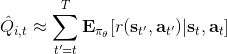。也就是说，真正的期望今后收益应该是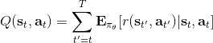。一旦我们知道期望今后收益，那么我们可以用它来替代，即如果我们能用某种方式得到 Q 函数的值，那么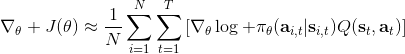将会成为一个更好的估计量。当然我们可以说是一个无偏估计，但这个估计其实只用了仅仅一个样本，会导致估计的方差非常大；如果你有无限个样本，那么方差就会比较低了。如果我们能把真实的 Q 函数值代入进去的话，那么我们就可以期望策略梯度有一个较低的方差。这也正好是我们在上一篇中提到的策略梯度法的最大瓶颈之一是高方差，解决这一瓶颈问题，我们就倾向于认为可以收敛到一个更好的解，或者使用较大的学习率（也就是增加单步步长），从而收敛得更快。

同样，我们可以引入基准线技术。我们选择的一个比较好的基准线是同样在第三讲中出现的值函数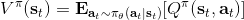，也就是在给定策略下 Q 函数的期望。之所以采用值函数，是因为这和我们在[上一篇](https://zhuanlan.zhihu.com/p/32652178)中所提到的平均情况不谋而合：之前认为一个不错的基准线是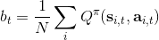，而这里也正好是对应的期望。此时我们的估计量就变成了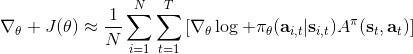，其中

> **优势函数** (advantage function) ，表现了给定策略，在状态下，采用了行动能比该策略的平均情况期望今后收益多出多少。

根据定义，如果我们对优势函数关于行动取期望，结果是 0。这样的“杠杆”也正是我们想要的，使得更好的行动可能性更大，而规避更差的行动。同样的，如果我们能对优势函数估计得越好，那么策略梯度的方差就可以越小。回顾我们之前的是一个无偏估计，但是它的方差相当大；而我们考虑要做的是牺牲一点点无偏性，引入一个神经网络（神经网络总不是完美的），但期望它能显著地降低方差。这个偏差-方差的权衡在统计中是非常常见的。

## 演员-评论家算法

回到我们的一般步骤中，我们来看它与策略梯度法在第一步生成样本和第三步策略改进上并没有显著区别，主要区别在于第二步：我们现在尝试去做的是去拟合一个值函数：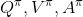三者之一，以期能得到一个更好的梯度估计。我们真正从“估计收益”变为了“拟合模型”。

三者都是紧密相关的，那么我们到底去拟合哪个呢？一个非常自然的想法是去拟合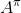，因为这是我们在梯度表达式中直接要用到的东西。我们可以生成一些数据，然后使用监督学习方法。这里有一个小技巧：我们发现 Q 函数取决于状态和行动两个维度，因此输入是对应两个空间的笛卡尔积。但是维度越大，同样的样本数估计的方差越大。根据 Q 函数和值函数的关系， ，因为在我们的问题结构中，给定当期的状态和行动，当期的收益就是确定的了，可以把当期的收益提出来。而后边那块求和项其实就是值函数的期望。如果我们愿意做一点近似，用轨迹样本来估计这个期望——此时不是使用整条轨迹，而仅仅是看一步以后的状态，那么我们的 Q 函数可以近似为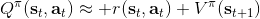。与此同时，优势函数也可以被近似为。这么一来，其实我们只要去拟合值函数 V 就好，其他的都可以被近似表示，这样拟合神经网络的维度的输入空间就只需要是状态空间了：要做的事情是去训练一个神经网络的参数，使得输入为状态，输出给定策略下值函数的估计量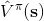。因为实用性和便利性，绝大多数的演员-评论家算法都是去**拟合值函数 V**。

给定一个策略去拟合这样一个神经网络的过程我们称为**策略评估** (Policy Evaluation)。这个步骤不尝试去改进策略，它只是想从任意给定的状态出发，评估这个策略有多好。由于值函数表达式为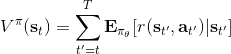，目标函数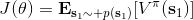只是值函数的一个期望而已，所以拟合值函数 V 同时也为我们带来了目标函数。那么具体怎么做策略评估呢？与策略梯度法相似，我们依然使用蒙特卡洛方法，进行一次轨迹采样以后来近似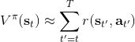；当然如果我们可以重启模拟器的话，最好能做多次轨迹采样后得到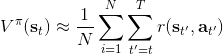，但是前者其实也还是不错的。

神经网络会有一些偏倚。因为可能我们从比较接近的两个状态出发做出的两条轨迹，结果上可能会有很大的偏倚；而对于神经网络来说，相似的输入基本上也就对应了相似的输出。毕竟神经网络只是一个函数的逼近器而已，对于确定性模型，它的输出是良定的 (well-defined)，意味着对于同一个输入对应同一个输出。神经网络拟合很多样本，将其综合起来得到一个低方差的估计：从相似的出发点，一条轨迹极好，另一条极不好，神经网络会认为这是不合理的，并将其平均处理。如果样本越多，函数将近似得越好，结果就越好。但是譬如在两个相似状态之间存在一个断崖，那么答案就会出现问题，但是不管怎么说估计的方差总是小的。

训练神经网络的方式非常传统，就是收集一些训练数据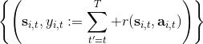，然后最小化诸如最小二乘的损失函数。这是一个非常通常的损失函数，在最优控制中这个损失函数有一些概率解释；当然也可以用 Huber 损失函数，效果也是很好的。我们尝试去将其做得更好，意思是进一步降低方差。注意到在理想化的完美情况下，我们的目标是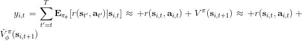。第一个约等号和前面 Q 函数时候的技巧一致，用一步轨迹做近似；第二个约等号是将值函数 V 用神经网络做近似。这某种意义是一个自助方法 (bootstrap)，如果神经网络相对于直接将轨迹的后半段加和的效果更好，那么就应该这样做；虽然这样近似使得估计有偏，但是我们期待函数估计的方差更小。看起来好像这样训练神经网络就是从里面拿出数据再放回去，其实不然，我们给它加入了些许知识，降低了其方差。进一步将这个一步估计泛化，我们可以做两步、甚至多步的估计，本质上是两者的折中版本。Levine 教授也提到了，训练神经网络的初值会影响训练行为，如 Q 学习中设置一部分初始的值函数非常大，来使得初始的更希望去试探这块区域。在演员评论家算法中，初值通常设置得比较小，这是为稳定性着想。

策略评估的两个游戏相关例子。Tesauro (1992) 使用增强学习在西洋双陆棋上取得了成功，做了一个 TD-Gammon 软件：当然事实上它只是一个值函数方法而不是演员-评论家算法。它的收益函数是游戏结果，值函数是给定局面状态，输出期望游戏结果。Silver et al. (2016) 给出了举世闻名的 AlphaGo，使用了蒙特卡洛树搜索 (MCTS)、值函数拟合和策略梯度等方法，事实上收益函数和值函数的想法和前者还是接近的，不过用了一些卷积神经网络。在这些例子中，策略评估的解释是相当直观的。

这里给出一个比较简单的演员-评论家算法，称为**批量演员-评论家算法** (batch actor-critic algorithm)，与策略梯度法的结构非常相近：

1.  运行机器人，根据策略得到一些样本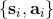，包括所处状态、行动和收益。
2.  使用样本收益之和拟合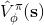。这一步样本可以做蒙特卡洛，也可以做自助法；拟合可以用最小二乘的目标函数。
3.  评估优势函数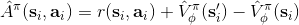。
4.  放入策略梯度函数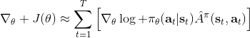。
5.  走一个梯度步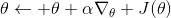。

## 贴现因子

如果说机器人拼乐高的问题是有终点的 (episodic)，而训练小人行走，我们通常希望它能一直走下去 (continuous / cyclical)。这种无限期的问题会使得目标函数值越来越大。在上面我们使用了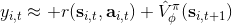作为估计，然后用去训练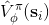。那么对于无限期的问题，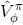可能会在训练中逐渐增加（减少），在很多例子中都能达到无穷，这样的情况就很麻烦了。为了解决这个问题，接下来我们要引入**贴现因子** (discount factor) 的概念，这个概念在金融、经济等领域相当常见：一般认为一笔钱在眼前的价值会比未来的价值要高，也可以与金钱的通货膨胀联系起来。因此，在建立模型时，我们也希望收益发生时间更接近眼前。我们的方法是，加入一个小小的贴现因子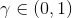，然后修改。在实际应用中贴现因子设置成 0.99 效果不错。

实际上，引入了并不影响整个 MDP 框架，只是稍许改变了转移概率函数。我们可以将这个贴现因子放进 MDP 的架构进行解释。以离散问题为例，如原来的转移概率为，我们在状态集合中新增一个死亡状态 (death state)，本质上是一个吸收状态，且此后收益一直为 0（或者理解为游戏立即结束）。我们构建新的转移概率，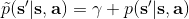，且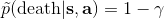。这也就是说在任意情况下，都有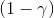的概率游戏结束，此后不收集任何收益。

抛开演员-评论家算法，现在我们讨论如何将贴现因子引入到策略梯度法中，稍稍有些复杂。对于蒙特卡洛策略梯度，我们有以下两种选项。这两者其实都可以有演员-评论家算法版本，但首先先写成策略梯度法形式。

第一种选择是我们直接利用因果关系后的式子，对后半部分进行贴现得到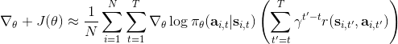，如果我们式子中加入了评论家的话就变成了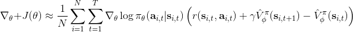；第二种选择是我们回到一开始的策略梯度式子，进行贴现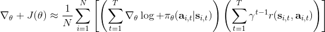。这两者其实是不相等的，可以发现将第二种选择进行重组后变成了 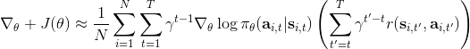 ，多出了一项对梯度进行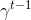贴现的系数。主要的区别是，第二种选择的做法使得越往后的步骤影响力越小。但是看起来很奇怪，我们一开始使用正确的策略梯度法，但是如果使用第二种选择进行贴现的话，梯度也被贴现了。事实上，如果你想从初始时间点 1 开始进行贴现，第二种选择的表达式是正确的；但是一般来说没人想这么做，我们一般还是采用第一种选择。原因是，譬如我们想运行一个小机器人无限长时间，我们一般不关注它在第一个时间点是不是速度很快，而是在每一个时间点是否很快。我们采用第一种选择，是想去**近似一个无限时间长的平均收益，且使用贴现因子**。这样就可以对无限期问题有一个总和的界。关于这个理论是比较复杂的，可以参考 Thomas (2014) 发表在 ICML 上的文章。

现在我们把贴现因子加入到演员-评论家算法。在之前的批量演员-评论家算法中，只需要把第三步从变为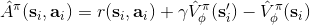就可以了。注意贴现因子使得对于无限长问题也有一个上界。我们在这里同样给出一个**在线的演员-评论家算法** (online actor-critic algorithm)：前者与策略梯度法相似，是根据策略生成一大堆轨迹，然后做一个很大的计算更新，再重新生成策略。在线算法可以在每一步收集样本之后，就立即更新评论家和策略。

1.  在线运行机器人，根据策略执行行动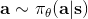，得到一个状态转移样本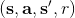，即从一个状态出发执行某行动到哪个新的状态，单步收益多少。
2.  使用评论家的结果来更新。
3.  评估优势函数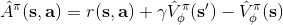。
4.  放入策略梯度函数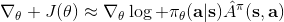。
5.  走一个梯度步。

可以发现，第二步我们只用一个例子去更新。我们这么急迫的原因是，如果我们没有评论家，我们就不知道这个结果到底应该是什么。如果我们有了好的评论家，那么我们就可以做这样的自助法了。第三步只需要算一个值就行了，第四步也是单样本的梯度。

## 实现细节

现在我们来研究批量和在线的演员-评论家算法的实现细节。首先第一点是算法中的神经网络结构设计。相对于之前的模型我们只有一个从状态映射到演员策略的神经网络，在这里我们还需要去近似评论家函数，因此会有一个从映射到的神经网络。一个非常直观的做法是，我们可以将两个网络分别训练，成为两个独立的网络。这样做法的主要好处是简单而稳定，也是在一开始上手的时候非常建议使用的。但是一个很大的不足是，在演员和评论家之间并没有建立起共享的特征，譬如如果特征是非常高维的图像，那么如果在图像的低级别特征（也就是经过多层卷积）进行共享还是有意义的。因此一个替代的解决方案是使用同一个输入，构建一个同时输出演员策略和评论家函数的输出。这在网络特别大的时候更有效，但是缺点在于训练起来可能会比较恶心，因为会有两个不同的梯度（策略梯度和回归梯度）往不同的方向推动共享的参数，数据类型也不太一样，因此让这个网络稳定下来需要很多技巧，如初始化数值和学习率的选择。Levine 教授的建议是，如果模拟器（如 Atari 模拟器和 MuJoCo）很快的话，不妨使用双网络结构，这样比较容易。

在上一节的末尾我们提到了在线演员-评论家算法，其中第四步只用一个样本去估计梯度，第二步也只用一个样本去更新评论家函数。这样做多少是有点困难的，因为方差会相当高。问题主要出在它依然是一个在线 (on-policy) 算法，在线意味着在第五步更新之后，所有的样本需要推倒重来。如果我们能做出一个批量的样本，那么效果可能会明显变好。一个方法是我们尽量少去更新策略，将这个算法弄成拟在线 (quasi-online) 的形式，做多步之后再去更新策略。如果我们可以假设样本可以由多个智能体（多辆汽车，多个机器人等）来收集的话，一个更好的方法是并行训练，如下图。第一种是采用左边图形的**同步法** (synchronized)，多个智能体各走一步得到训练数据，用样本数据去计算梯度，先完成的需要等待（因此是一个同步点）；然后用多个智能体的梯度加总起来更新演员策略参数网络，大家再去根据新网络执行下一步。每次可以是不同的状态，不同的行动，然后到不同的下一个状态，但这都是不相干的：每次采样完毕后可以继续运行，可以重启，也可以其他操作。一种更先进的方法是**异步法 ** (asynchronous)，基本上就是移除这些同步点，每个智能体完成操作以后就去用自己的梯度去更新中央服务器参数，中央服务器积累了一定的步数，就把更新信息发送回所有的智能体。有点像闭着眼走路，但是实际上运行得不错。移除同步点后通常实现简单，更快，基本上哪儿都好；但希望模拟本身要非常快。

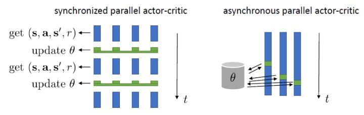

我们进一步想看基准线方法如何更好地应用于演员-评论家方法。对于演员-评论家算法，我们的策略梯度估计为。这个方法的主要优点是我们采用了评论家函数，因此希望有一个更小的方差；然而这个估计并不是无偏的，因为评论家函数总不能被完美拟合；而且在训练的前期评论家函数通常非常不准确，因此不管方差有多小因为评论家函数的无意义导致怎么都不会得到一个很好的值。另一个极端是策略梯度法完全的蒙特卡洛抽样，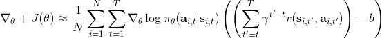，其中是任意常数。这个做法的主要是之前我们已经证明了的无偏性，也提到了主要缺点是单样本估计的极高方差使得本身并不怎么有意义。这边评论家函数的另一种正确用法是，将评论家函数（根据当前状态的）作为基准线，从而得到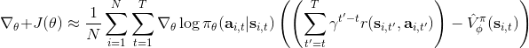。与之前的常数不同，这个基准线是依赖于状态的；但是这样做依然是无偏的（类似之前的推导展开），而且事实上改为任何只与相关的函数都是无偏的。因此无偏性得到了保留，但是如果基准线接近真实收益，那么方差就会大大降低。依赖于状态的基准线能更敏感地解决问题，比一个常数的降方差功效更好。

我们新引入了一个依赖状态的基准线，那么我们现在想在此基础上进一步引入行动。考虑优势函数。它的一种估计是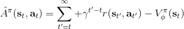，显然它是无偏的，但是因为这是单样本估计所以有高方差的问题；然而如果我们使用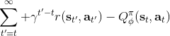来作为根据，如果评论家函数是正确的那么它的期望将达到 0 是非常好的，但是这个估计根本就不正确。那么有没有补偿方法呢？我们看这样一个结构： 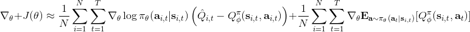 ，虽然前面一项本身不正确，但是我们在后面加入了一个修正项使得其无偏：如果我们能用一个办法来评估第二项（根据 Q 的结构不同，可能有一些结构可以以解析形式表达，如策略是高斯的，Q 函数是二次的，那么这个结构就是可以在没有样本的情况下得到评估的，但是是否有这样的结构还是很需要运气），这个无偏估计就可以用。这样的用 Q 函数作为评论家的相关内容 (Q-Prop, Gu et al., 2016) 会在后续课程中更多提到。因此，我们得到的启发是，基于状态的基准线是无偏的，基于行动的基准线是有偏的，但是偏差有可能可以通过一个校正项补救回来。

在之前我们适用的演员-评论家算法的估计都是一步的，即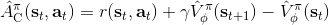。下标 C 的意思指的是评论家 Critic。这个估计的优点主要在于方差较低，但是缺点也很明显，如果值函数是错的的话，那么就会引起很大的偏差（当然肯定总是错的）。另一个极端就是纯粹的蒙特卡洛而不使用评论家，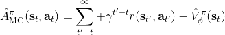。我们也知道了它是一个无偏估计，但这样的单样本估计的方差非常高。现在我们考虑一个方法，中和两者的优缺点，得到一个折中方案。一种方法是对两者进行混合，如果发现方差或者偏差过高，那么就提高或者降低组合系数。另一个是，我们发现由于贴现因子的作用，这样指数下降的函数，随着时间往后推移，收益的贡献比例将非常低。

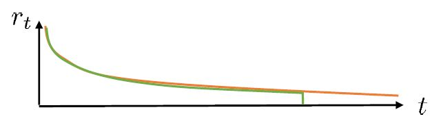

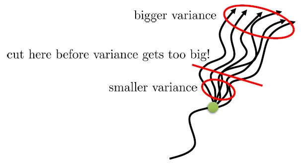

在上图，从一个状态出发，不同的轨迹的效果随着时间后移而渐行渐远，因此是一个从小方差到大方差的过程，贡献逐渐下降而方差逐渐上升。单个样本很容易被淹没于未来轨迹的汪洋大海之中，遥远的未来的可能性如此之多，如果我们看 50 年以后会怎么样基本上是做白日梦。我们要做的是在轨迹上在方差变得太大前切一条线，因为后面的步骤可能性太多，效用实在太低；而我们用评论家函数 V 去替代后面的部分，作为一个平均情况：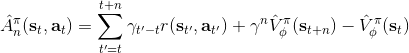。这样的表达式允许我们通过调整来控制偏差方差的权衡，通常选择一个大于 1 的值如 4、5 会运行得较好。这也称为步收益。

Schulman et al. (2016) 提出了**广义优势估计** (Generalized Advantage Estimation, GAE)。本质上是步收益的推广。这种方法不再选择一个单一的步数，而是对所有的步数进行一个加权平均，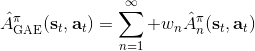。其中是权重。现在的一个重要问题是如何选择权重。我们希望降低方差，因此一种比较合理的方法是让权重也指数下降，即，其中 是一个底数参数，权重加和为 1。代入之后经过整理，我们可以得到，其中是一个类似演员-评论家的东西。这个方法说明了贴现因子在里面扮演的新角色，和之前非常不同。非常像一个贴现因子，如果它比较小，那么我们将在很早期就切断，偏差较大方差较小；反之则较后切断，偏差较小方差较大。因此从另一种意义上解读，贴现因子意味着方差降低。

演员-评论家算法也有很多应用。在前面提到的 Schulman et al. (2016) 使用 GAE 估计量来进行模拟机器人的训练，用的是批量演员-评论家算法（因为模拟器中样本容易获取）。Mnih et al. (2016) 使用在线演员-评论家算法训练三维迷宫导航问题，采用了异步并行的技术，使用了 4 步收益，它的演员策略网络和评论家策略建立在同一个神经网络之内（因为输入是像素图像）。