# (6) 基于值函数的方法

> 作者：[谢天](https://www.zhihu.com/people/xie-tian-55-77)
> 
> 来源：[POST 馆](https://zhuanlan.zhihu.com/c_150977189)

## 动态规划与值函数的拟合

在上一讲的演员-评论家算法中，本质上我们已经把在某种策略下的值函数（这里的值函数是广义的，包括 V、Q、A 等）用到增强学习的算法里面去了，形成一个策略-值函数的交融算法。而在这一篇中，我们尝试去构造一个没有“演员”的“评论家”，也就是纯粹的值函数方法。我们在之前的学习中也了解到值函数的厉害之处，它自身包含了非常多的信息。

我们在之前的两篇中分别介绍了策略梯度法和演员-评论家算法，它们的特点本质上都是寻找策略梯度，而只是演员-评论家算法使用某种值函数来试图给出策略梯度的更好估计。然而策略梯度通常有非常高的方差，要把它弄好需要花费很大的努力。那么我们可能会考虑一个问题：**强化学习能否彻底抛开策略梯度这一架构？**

回忆优势函数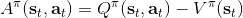，指的是给定策略，在状态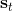下，采用了行动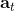能比该策略的平均情况期望今后收益多出多少。我们在演员-评论家算法里面花了很大力气去估计这个东西。假设我们在某个策略下已经知道这个函数，那么意义是，如果我们在状态下执行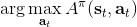，也就是根据优势函数得到一个当前最好的决策（当然我们得坚持之后还是完全按照策略来），那么根据定义，这个决策必然是在期望意义下最优的：换句话说，它至少不差于任何的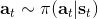。这个结论是非常显然的；值得注意的是，这个结论的成立性是广泛的，和策略具体是什么东西没关系。

刚才的结论给了我们一个策略改进（第三步蓝色方块）的思路。对于一个策略，如果我们已经得到了它对应的优势函数，那么我们必然可以构造出一个新的策略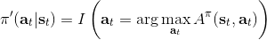：刚才我们已经指出了在任意一个状态下，这样的策略不差于原策略，至少和原策略一样优且有可能更好。需要注意的是这是一个确定性策略。事实上这是本篇中要涉及的算法的内在思想。

作为开始，我们先不引入神经网络和复杂的动态系统等很复杂的东西，假设状态和行动的个数很少，以至于 V、Q、A 函数都能用一个表格来记录下来；转移概率也是完全已知的。在这个最简单的环境里，上述算法就可以用一个非常经典的**策略迭代法** (Policy Iteration, PI) 来简单实现。策略迭代法循环执行以下两个步骤：

1.  策略评估 (Policy Evaluation)：计算所有的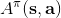。
2.  策略改进 (Policy Improvement)：令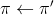，其中。

要执行这个过程，最大的问题就是如何计算。在之前我们提到的是，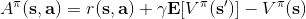。因为在这里我们的转移概率已经知道了，因此我们只需要去研究值函数 V 就行了。这一类方法广义上被称为**动态规划** (Dynamic Programming, DP)。形式上，假设我们已知转移概率为，且状态和行动都是离散的而且空间足够小，这样我们所有的数据都可以在表里记下来。类似于我们在之前提到的自助法，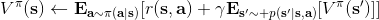。自助法的意思是，我们只需要在后面插入当前的估计（就是查表得到）就行了。（_ 这里我补充一下，从深层次来说，这样的表达式又叫 Bellman 方程，但在这个课中似乎不涉及到这一块的理论 _）由于我们现在采用的是一个确定性策略，这样的单点确定性策略也可以写作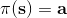，即给定状态下得出行动这样的一个函数形式。于是，之前的公式就可以被进一步简写为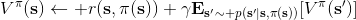——这也就成为了我们策略评估步的公式，我们用值函数 V 去替代优势函数 A。需要注意的是，标准的策略迭代法的第一步需要关于我们的当前策略解出比较精确的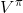，本质上是一个不动点问题：一种方法是之前的公式进行反复迭代直到收敛；另一种方法是求解一个比较大的线性系统（之前的公式是线性的）。

不要忘记我们本篇的目标是在算法中完全抛开策略函数。可以回顾我们每一步更新的新策略其实都是，而给定状态下，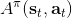和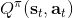之间其实只相差了一个常数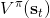，因此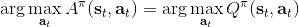，我们可以用 Q 去替代 A 在这里的地位。事实上，如果我们有了一个大 Q 表，每一行代表一个状态，每一列代表一个行动，那么我们只需要标出每一行的最大值的格子位置就可以了，因此 Q 函数本身就可以隐式地表示一个策略；同样，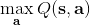正是对应的值函数。那么这样，我们就正式地把策略的重要地位给架空了，得到一个更简单的动态规划求解方法：**值函数迭代法** (Value Iteration, VI)。事实上该方法可以把以下两步混在一起把 Q 函数架空，但是 Q 函数在我们的值函数方法中有很高的地位，我们不这样做。我们反复执行以下两步，直到收敛。其中第一步属于绿色方块，第二步属于蓝色方块。

1.  更新 Q 函数：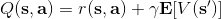。
2.  更新 V 函数：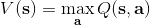。

在对经典的两大动态规划算法进行完简单的介绍后，我们考虑的是如何把这样的方法搬运到深度增强学习中来。在相对比较复杂的问题中，我们知道状态个数是非常之大的，很难用一个很大的表来保存所有状态的 V 值或者 Q 值。譬如在一个彩色的赛车游戏中，分辨率是 200 * 200，那么根据屏幕显示而设定的状态总数可以达到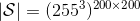，这个数字大得超乎想象。这样的个数随着维度的增长而几何爆炸的问题通常称为维度灾难 (curse of dimensionality)。引入到深度增强学习中，一个非常直接的想法就是使用一个巨大的神经网络来代替这个大表，如弄一个参数为的深度神经网络来拟合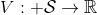函数，输入状态，输出对应的值函数。为了训练这样的函数，我们使用一个平方损失函数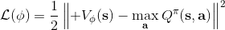来做这样的回归问题。从而，之前的值函数迭代法可以被改写为以下的**拟合值函数迭代算法** (Fitted Value Iteration)：

1.  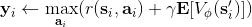。
2.  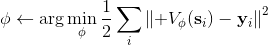。

第一步我们就和之前演员-评论家算法一样计算出一个目标，然后第二步训练神经网络减少神经网络输出与目标的值函数之间的差异。然而事实上，第一步的这个 max 操作是非常难做的：一个最大的问题是我们**假设我们已经知道了系统的转移概率**！要做这个 max，我们必须知道每个行动会导致概率往哪些状态转移。我们用一些无模型的增强学习，可能可以执行很多操作来看结果，但状态往往不能回撤复原以尝试其他的选项；而第一步的 max 要求我们尝试各种不同的操作来看结果。

我们尝试去避免做这么强的假设。回顾我们之前的策略迭代法，我们迭代进行两步：第一步求解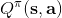，第二步用这个 Q 函数来更新策略。其中，第一步的做法可以是反复迭代值函数  ，然后再通过一步转移和加上 来得到 Q 函数；但同样也可以是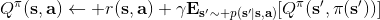。现在的 Q 函数可以用样本来拟合出来。这一切告诉我们：只要有 Q 函数，一切就可以在不知道系统转移概率的情况下运转起来。进一步，我们也考虑将 Q 函数使用诸如神经网络的结构来近似，得到**拟合 Q 函数迭代算法** (Fitted Q-Iteration)：

1.  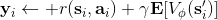，其中我们使用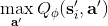来近似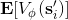。
2.  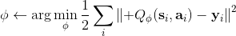。

可以发现，这样的决策算法的根本好处在于不需要去同一状态尝试不同的行动选项，因为 Q 函数已经告诉你不同行动的效果了：我们无需在真实环境中尝试各种不同行动后复位，而只需要在我们所涉及的 Q 函数拟合器上做这点就可以了。此外，我们这样的两步算法有很大的优点。第一，算法中只需要用到很多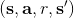的一步转移样本，而这些样本是可以离线的；这个在演员-评论家算法中是不通用的。第二，这个算法只用到一个网络，没有用到策略梯度，因此也没有高方差的问题。但是，这个算法的致命缺点是，对于这样的非线性函数拟合机制下的算法，没有任何收敛性保证（不进行拟合的大表格 Q 迭代算法在一定条件下有收敛性）。我们接下来会进一步探讨这些优缺点。一个完整的拟合 Q 函数迭代算法的一个简单框架是这样的：

1.  执行某个策略，收集容量为的数据集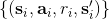。
2.  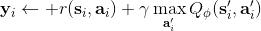。
3.  。反复执行次 2-3 步骤后跳回第一步继续收集数据。

第一步的策略其实是任意的，因为 Q 函数迭代算法不对数据集的策略做出任何假设。根据收集数据数量的不同，可以变成收集一堆数据的批量算法，也可以变成只收集一个数据的在线算法。第三步可以选择怎么去训练神经网络，比如走多少个梯度步，算得精确一点还是简单走几步就停了。

现在来解释该算法的**离线** (off-policy) 性质。实际上第一步可以用上任意策略的数据，因为第二步和第三步的计算没有需要用到当前策略下的数据，而只是单步转移的片段就可以了。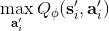只需要对决策空间的一个枚举，而转移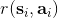，在给定了状态和行动的情况下，也跟当前策略没关系。某种意义上可以说 Q 函数是对策略的一个解耦合。因此，我们可以收集一大堆转移数据放进一个大桶里，我们的算法从大桶中抽取数据，这个算法照样可以运转。

那么拟合 Q 函数迭代算法到底在优化一些什么呢？在第二步中，如果我们是表格 Q 函数迭代的话，max 就是在改进策略。第三步中，我们在最小化一个期望误差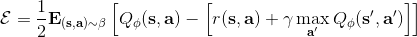，也被称为 Bellman 误差。可以发现，在理想情况下，如果这个误差为 0，那么我们所求得的 Q 函数就满足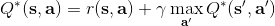，这正是确定**最优 Q 函数**的 Bellman 方程，也对应了**最优策略**：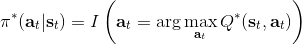，这个最优策略最大化期望收益。如果我们不使用近似，且每一个都有概率发生的话，那么我们可以说明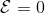对应着最优策略。在这边，**即便算法是离线的，但是收集数据的分布还是有很大关系的**。一个极端情况，我们假设只是一个单点分布，除了一个状态外概率都为 0：这样我们就成为只知道一个状态的井底之蛙了，不能对其他状态的好坏做出正确评价。因此，尽管算法是离线的，但请尽可能确保我们收集的数据中包含了真正运行时会访问到的那些状态和行动。此外，如果我们使用诸如神经网络的东西去拟合 Q 函数表，那么之前所说的大量理论保证将丧失。

在之前的拟合 Q 函数迭代算法中，我们收集大量数据，然后反复做样本-做回归。我们把每次收集的样本数设为 1，然后把 K 设为 1，并且设置只走一个梯度步，就变成了**在线 Q 迭代算法** (Online Q-iteration)，循环以下三步。

1.  执行某个行动，收集观察数据。
2.  。
3.  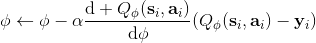。

该算法每轮执行一个行动，得到一个转移观察，算出目标值，做一步的随机梯度下降。这是标准的 Q 学习算法，虽然是离线的，但还是和刚才所说的一样，第一步的支撑集希望足够大。那么如何选择行动呢？我们最终的行动服从一个单点分布，选择一个使得 Q 最大的行动。但是如果我们把这个东西直接搬过来在学习过程中使用的话，是不好的。事实上，这是在线学习中的一个很纠结的问题：探索 (exploration) 和开发 (exploitation)。学习就是一个探索的过程，如果我们还没进行足够的探索，在 Q 函数还不够准确的时候，我们根本无法分别出到底哪个是真正好的，会忽略掉真正优秀的方案。在在线学习中，有多种启发式方法来脱离这一局面。一种策略称为-贪心，也就是分给最大的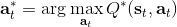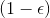的大概率的同时，也保留概率平均分给其他所有的种行动。另一种常用的设定是 Boltzmann 探索，概率分布为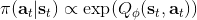。它假定 Q 函数多多少少知道一些哪个行动好，但是有噪音。这样 Q 比较大的行动有显著较高的概率被选到，同时保持了其他选项的可能性。

## 算法的理论

让我们回到非神经网络近似的值函数迭代算法，它本质上在做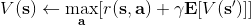。那么第一个问题就是，这个算法收敛么？如果是的话，收敛到什么？首先，我们定义一个备份算子 (backup operator) 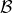 ，形式上写作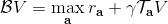，其中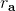是所有状态下选择行动的一步收益的向量，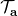指的是选择行动的转移矩阵，诸如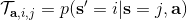，max 是按分量取最大。实际上，我们可以发现最优下，是算子的一个不动点，因为，所以。与之前 Q 函数的讨论相似，这一个不动点总是存在，总是唯一，且总是对应着最优策略。现在我们的关键问题是如何去找到这样一个不动点，因为不动点意味着最优值函数和最优策略。

我们可以通过证明是一个收缩映射 (contraction mapping) 的方式来证明值函数迭代法收敛到一个不动点。事实上，是一个无穷模下的收缩映射，因为对任何的两个值函数和，我们可以证明，两者的间隙每次都减小到原来的倍。如果我们选择的话，那么因为，有。因此每做一次迭代，我们都能把两者之差的无穷模稍微减小一些。

使用算子，我们可以把每一步的值函数迭代算法写成。为了把 Q 函数用神经网络表示，现在我们来看拟合值函数迭代算法。拟合值函数迭代需要做一个回归，它的本质是从神经网络能表示的所有函数的簇里面，找到一个函数，使得。虽然在理论上，一个无限大的深度神经网络可以拟合任意函数，但是在实际使用中，我们一般只能使用一个有限大小的神经网络，因此它能表示的只是所有函数的一个子集。

如上图，蓝色的线代表该神经网络能代表的函数的全集，我们从一个函数出发，进行一次备份操作，然后使用最小二乘回归来投影到这个函数集合。我们定义投影算子，那么我们的拟合值函数迭代算法可以写成这样的复合映射。注意到投影算子最小化的是欧几里得距离，是 2 模下的收缩映射。是一个无穷模下的收缩映射，；是一个 2 模下的收缩映射，，但问题在于如果我们将这两个映射进行复合，那么并不是一个收缩映射，因为它们不是在同一个模下收缩的。

上图是一个该算法发散的例子。假设最优解在那个五角星处，然后我们从开始一脚走到了，然后被投影回归扯回了。从图上看，我们的解到最优解的距离越来越远了。注意到，不用无穷模的原因是当状态空间很大或者无限的情况下，无穷模下的投影问题极其难解。我们只能寻求找到最优解的一个投影（同样对于策略梯度法我们也只能期望找到最优策略的一个投影），但是事与愿违的是，反复进行拟合值函数迭代算法，可能使你从较好的解开始越来越差。因此我们的结论是，值函数迭代法在表格中是收敛的，但是拟合值函数迭代法在一般意义下是不收敛的，在实践中也通常不收敛，但是有一些方法来缓解这些问题。

拟合 Q 函数迭代法也差不多，，只是把 max 放到里面去了；同样投影算子，因此。它的收敛结果与之前也别无二致，同样一般意义下不收敛。对于在线 Q 迭代算法来说，它的第三步看起来在走一个梯度步，我们看似抓住了一个救命稻草：梯度下降法应该是可以收敛的？但是，Q 函数方法的梯度并不是目标函数的梯度，因此与策略梯度法并不同，它并不是梯度下降法。

这个不收敛结论同样也适用于演员-评论家算法。如一步自助法关于无穷模收缩，而拟合函数 关于 2 模收缩，因此拟合下的自助法做的策略评估同样不具有收敛性。顺便说一下，在演员-评论家算法中用的，指的是关于策略的值函数，是评论家用的函数；而在值函数迭代中用的，则是最优策略所代表的值函数，也是最优的值函数。

在这一篇中，我们暴露了很多问题，而在接下来的内容中，我们将尝试如何缓解这些问题，从而让算法能正常运转起来。