# (7) 深度增强学习中的 Q 学习方法

> 作者：[谢天](https://www.zhihu.com/people/xie-tian-55-77)
> 
> 来源：[POST 馆](https://zhuanlan.zhihu.com/c_150977189)

## 回放缓冲池与目标网络

在上一篇中，我们介绍了一些纯粹使用值函数的方法（这个是在动态规划中最最经典的要素），最重要的是 Q 学习方法，这类方法抛开了一个显式的策略，直接去学习 Q 函数，使我们知道在某个特定的状态下执行某一操作效果有多好；也指出了如果我们使用神经网络来进行拟合所可能出现的不收敛现象：这些问题将在所有的使用某些结构（如神经网络）拟合值函数，然后使用拟合的值函数作为“评论家”来做自助的方法中都存在。在这一篇中，我们将介绍一些方法，使得在实践中这些问题能被有效克服。

在 Q 学习中，我们已经介绍过，可以使用拟合 Q 迭代的方法：在每一轮迭代中，使用某些策略收集很多的样本，然后执行若干步构造目标值和回归的过程。当然我们希望收集到的样本的支撑集越大越好，以避免盲区。它的一个特例是在线 Q 迭代，也就是每次只收集一个样本，构造目标值，然后回归只走一个简单的梯度步。我们仅以在线 Q 迭代算法为例，它循环执行以下步骤（此处目标值已经填入）。

1.  执行某个行动，收集观察数据。
2.  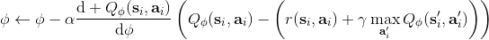。

我们之前已经说明过，它**不是一个梯度下降算法**，因此，梯度法的收敛性在这里不适用。第二点很关键的问题是，在普通的 SGD 中，我们常常认为每一次拿到的数据之间都有一定的不相关性；而在第一步收集的数据中，**数据通常都是非常相关的**：下一步的观察数据可能和这一步非常相关。因此，梯度也会非常相关。因此，我们会尝试去使用一些手段来缓解这些问题。我们考虑解决的问题主要有两个：序贯状态的强相关性，以及目标值总是在变动。

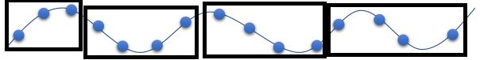

序贯样本为什么会成为痛点？让我们先考虑一个简单的回归问题，这个回归问题尝试去拟合一堆数据，而这堆数据是一个正弦波。一般我们希望数据是独立同分布的，而我们在序贯问题中先得到了开始的几个样本，然后逐渐得到后面几组，每得到一组我们就走一个梯度步。这样我们就很难去学习整个正弦波，而更容易在局部形成过拟合的同时，忘掉了其他样本的信息。在演员-评论家算法中，可以采用一些并行学习的方法，这里 Q 学习也可以：使用多个独立的智能体进行独立的数据收集，然后使用同步或者异步的方法进行梯度更新，这样可以使得样本的相关度减轻，但是这样的做法可能是相当“繁重”的。

另一种更常见的做法，**回放缓冲池** (Replay Buffer)，利用到了 Q 学习算法本质上是离线 (off-policy) 的这样一个性质：也就是说，Q 学习算法使用到的数据不需要根据当前的策略收集得到。相对的，演员-评论家算法是一个在线 (on-policy) 算法，因此对于演员-评论家算法来说并行学习是首选之一，然而在 Q 学习中并非如此。在拟合 Q 迭代算法中，我们每一步收集一些样本，然后进行若干步目标值构造和回归。在收集样本的步骤中，我们可以使用任意策略（当然我们希望样本的支撑集足够大），因此我们不妨假设一个极端情形：收集样本的步骤被完全省略了，我们在很早的时候就收集了非常非常多的样本，然后全部丢在了一个数据库之中，我们在每次训练更新的时候随便从里面拉出一些来。这样做完全是可以的，因为我们事实上不根据策略和模拟器进行任何交互。

这给了我们一个启示，我们可以构造一个样本池，然后每次从里面抽出一批样本，进行梯度更新： 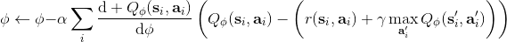 。这样做的好处不仅在于这样抽出的样本不再具有很强的相关性了，同时我们每次可以用的样本量也从 1 个变成了很多个，可以使用多样本来降低梯度的方差（有点类似于 mini-batch SGD 的做法）。现在我们想要知道的是，高覆盖面的数据到底从哪里来。在实践中，对于很大的状态空间，我们通常很难去很好地覆盖；我们能做到的最好情况的可能也只是覆盖我们所可能到的沧海之一粟。因此，我们在 Q 学习的过程中，还是需要同时去为样本池补充新鲜血液。这也要求我们使用一些探索策略向外界环境输出一些不同的策略，然后得到样本进入样本池。训练过程有点像某些抽奖箱子里每次抽一张卡，抽完丢回去再抽。因为我们投入的数据会被反复使用到，有点类似于回放，因此被称为**回放缓冲池** (Replay Buffer)。

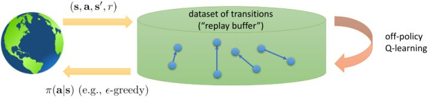

从而，一个（同步的）使用回放缓冲池的 Q 学习算法是这样的：

1.  使用某些策略（如-贪心）跟环境打交道收集一批数据，并加入到回放缓冲池中。
2.  从回放缓冲池中抽一批样本。
3.  更新一个梯度步：，反复执行 2-3 步次之后返回第一步继续收集样本。

注意到，如果缓冲区足够大的话，那么新进入数据占权重其实是很小的，很可能不会被抽到。当然这不是个问题，新进数据只是为了让样本池的支撑集更广（更新 Q 函数使得更新策略，新策略会访问到之前没去过的地方）而已。在的选择上，通常选择 1 就不错，然而如果数据获取代价比较高的话（如需要与真实物理系统打交道），更大的有时候会产生更高的数据使用效率。由此，回放缓冲池成功解决了数据的强相关性问题，但是目标值的变动问题还是没有解决。

之前听过一个童话，说小猪问妈妈幸福在哪里，妈妈表示在尾巴上，然后小猪尝试咬自己尾巴但是抓不到，但是妈妈表示只要你一直走幸福就会一直跟着你。暖心的小童话在这边就变成了一个讨厌的事实：我们想要使得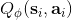尽量靠近目标值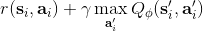，但只要我们不停迭代，我们的目标值就跟尾巴一样一直会动来动去的！这就跟射击中的移动靶一样，总比固定靶要难打很多。但是如果我们能够像之前一样，先把目标值算出来，然后再去做最小化最小二乘的回归，那么这样的回归就会稳定很多。

在这里，我们把之前的思想改造成一个**目标网络** (Target Network)，以提高实践中的稳定性（虽然还是没有什么理论保证）。整体想法与之前使用回放缓冲池的 Q 学习算法没有什么太大区别，只不过是我们再执行若干步（如 10000 步）整个算法迭代后，就把整个网络的参数存下来称为目标网络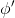（就像很多软件的自动存档功能一样），然后我们每次做的梯度步变成了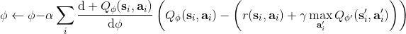，也就是说我们的目标不再是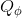而是了。这样就能使得我们的“靶子”在一段时间内保持确定，不再是每走一个梯度步目标就动一下，就像“秦王绕柱走”一样的“放风筝”策略一样避敌。等我们已经足够接近靶子了，然后再允许靶子动到一个更好的地方去。我们可以发现，如果我们把靶子固定，那么这个算法非常接近一个监督学习算法。这跟人一样，一开始学走路就把步伐放得太大容易摔跤，我们这样做可以把训练速度放下来，同时提高训练的稳定性，从而这个目标网络更新步数需要权衡以提高收敛概率：太大训练太慢，太小则容易不稳定。理论上，这样做不改变任何事情，但是实践中，这样降低靶子移动的频率，非常有助于训练的稳定性，减少训练所需要的时间。综合这两种技巧，Mnih et al. (2013) 在 NIPS 提出了举世闻名的深度 Q 网络 (Deep Q Network, DQN) 算法，也是深度 Q 学习中最经典的算法。

1.  在环境中执行某个操作，观察到，并加入到回放缓冲池中。
2.  均匀地从回放缓冲池中抽取一个小批量样本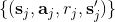。
3.  使用目标网络，计算出目标值。
4.  走一个梯度步，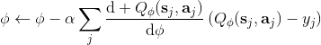。
5.  每隔步，把整个神经网络的参数复制到目标网络中去。返回第一步。

小批量样本的特性是，其中第三第四步是可以并行的。

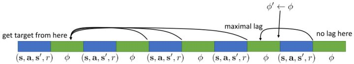

关于目标网络，也有另一种实现策略。看上图，我们在第一个绿色方块更新了目标网络，此后若干个步骤，我们都将以这个目标网络为基础进行迭代，然后逐渐误差越来越大，直到下一个目标网络更新点，就形成了一个断点。这样其实对于步骤和步骤之间并不公平，有些步骤访问的延迟很高，有的步骤则很低。为了使得延迟公平化，可以使用一个类似于指数平滑的方法（随机优化中的 Polyak Averaging），不再是若干步执行更新而是每一步都做一个小变动：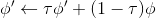。实践中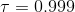效果不错。从优化的角度，可以对这样的做法有一些理论解释。

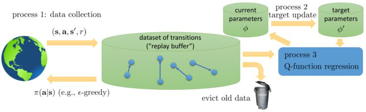

现在，让我们对在线 Q 学习、拟合 Q 迭代、DQN 算法进行一个比较。我们可以发现，对于有回放缓冲池和目标网络的 Q 学习算法来说，最外层循环是更新目标网络的参数，内层循环是使用同一个策略收集若干数据集丢进缓冲池后，迭代若干次从池中抽样然后做小批量样本的梯度步；而对于拟合 Q 迭代算法，最外层循环是使用同一个策略收集若干数据集丢进缓冲池，而内层循环则是更新目标网络的参数，然后迭代抽样做梯度步。外面两层操作顺序是相反的。DQN 是其中的一个特例。

从而，我们可以把过程的主要步骤分为三部分：第一步是数据收集 (data collection)，第二步是目标更新 (target update)，第三步是 Q 函数回归 (Q-function regression)。此外，还有一个从缓冲池里丢弃旧数据的操作。第一步的数据收集是用于充实我们的缓冲池的。我们拿我们有一定探索性质的策略与外界打交道，从而获得一些转移数据；如果缓冲区太大了，我们也需要把一些旧数据丢进垃圾桶（如把缓冲区弄成一个固定大小的循环型，老的数据自然被丢弃），这是因为旧数据可能是在很垃圾的策略下得到的，已经没什么实际价值。第二步以一定的频率（或者 Polyak Averaging）用当前的参数去更新目标网络参数，如果我们想稳定一点的话，这一步通常频率很低。第三步是一个学习过程，它从目标网络中取得参数，从缓冲池中取得数据，然后进行回归以后更新当前的参数。广义看，不同的算法之间，只在于这几个操作的频率有所区别，取决于样本取得代价，网络更新代价和对稳定性的需求。对于在线 Q 学习，我们取得数据后只使用一次就丢弃了（也就是样本池里只有一个样本），三个步骤的频率是一样的。对于 DQN，缓冲池比较大，第一步和第三步运行频率一致，而第二步频率很低。对于拟合 Q 迭代，就形成了一个嵌套结构，第三步是第二步的内循环，而第二步是第一步的内循环，频率指数降低。

## 让 Q 学习更好的技巧

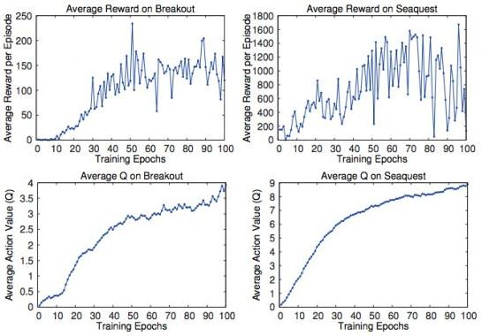

我们在前面已经知道，Q 函数本身是有意义的：在某个状态下，我们进行了某种操作，今后会带来的期望收益。那么我们使用之前估计得到的 Q 函数值是否能准确反映呢？Mnih et al. (2015) 在 Nature 上的论文做了一系列正面实验。上面四个图中，上面两个是平均收益，下面两个是平均 Q 值，我们发现当估计的 Q 值上升的时候，总体来说收益也呈一个上升的趋势；但是在训练片段中收益波动相当大，Q 值虽然不能很好去拟合收益，但是波动相对小，相对光滑。下面举两个 Atari 游戏的例子来说明这些值函数的意义。

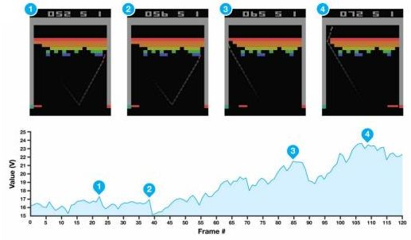

在打砖块 (breakout) 游戏中，我们知道每当球撞到一个砖块，就会产生一个小小的收益，因此，值函数就会有一个小型的峰出现。上面四个图每次都是要打掉一个砖块时的画面，正好对应了下面的四个峰。更进一步地，我们一个很好的策略是让这个砖块里面产生一个小孔，然后让球进去那个基本封闭的区域里面跳来跳去，打掉很多砖块产生大量得分：这个判断正好和图 3（成孔前夕）-图 4（成孔后进入）一致，从而值函数给予了很高的评分：图 3 是一个希望，而图 4 美梦成真。这说明我们的值函数的局面评估定性上是合理的。

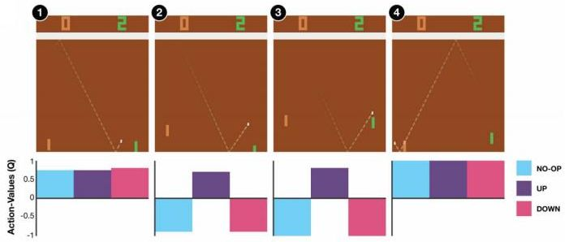

在弹球游戏 (pong) 中，我们控制右边的板子上下移动来接球。操作有三种：无操作、向上、向下。在图 1 和图 4 中，三种操作都可以接受，尤其是在图 4 中我们不管做什么样的操作都已经获胜了；而图 1 中接小球还有足够的容错可能。而在图 2 则接小球有了很强的紧迫性，而图 3 紧迫性更强几乎没有容错机会了，所以向上的 Q 值很高，向下和不动的 Q 值很低。

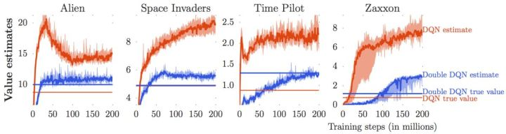

我们说了很多使用值函数评估局面、Q 函数来做决策的合理性。因为我们只需要按照 Q 函数最大的准则来进行行动，似乎只有 Q 的相对数值大小才有决定性作用。那么这些绝对数值是否准确？很遗憾，van Hasselt et al. (2015) 这些数值是被高估的。我们只看上图的红色部分（DQN estimate 和 DQN true value）。红色的波动很厉害的那条折线代表了神经网络所估计出来的 Q 值，而下面那条红色直线是根据 DQN 的策略行动实际所能得到的期望收益：所以理想情况下，在很多步估计之后，红色折线应该和红色直线有一个相切关系。但是事实上，我们在不同的游戏中都发现估计出来的红色曲线明显比真实值红色直线要高，呈现一个系统性趋势。这说明了 DQN 实际上严重高估了 Q 值。事实上 DQN 的表现还是不错的，尽管这个 Q 值可能估计得很离谱：实际上对于两个不同的操作和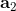，只要让估计的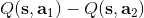差和真实值差不多或者长得像就能让 DQN 工作起来。

这样的**高估** (overestimate) 现象在 DQN 中是系统性问题，原因出在目标值的后面那个 max。我们选择最大的那个数会产生怎样的结果呢？考虑两个随机变量和，我们有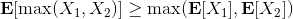。这个结论在多个随机变量中也是适用的。想象一下，这些变量都有一些噪音，而取 max 操作则扩大化了这些噪音，在这种情况下我们是关于噪音取 max，可能我们找到的是若干个数中噪音最大的那个。我们的 Q 都是从样本轨迹里学出来的，所以都含噪，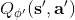即便接近真实的 Q 值但也都是不完美的，因此我们可能得到的只是噪音最高的选项而不是真正 Q 最大的选项。注意到一个简单的事实，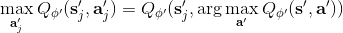，它点明了这一问题的来源。如果对于某一行动 Q 值过大了，我们做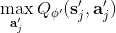过高估计了接下来行动的值，然后继续传导到后续的迭代中去。我们的决策选择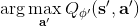本身就是来自于，而我们所选用的 Q 函数值也同样来自。

van Hasselt et al. (2010, 2015) 的**双重 Q 学习** (Double Q-learning) 技术用于缓解这一问题：它本身希望切断**过高估计的行动 - 过高估计的值的传导**这样的一个链条。如果最大 Q 决策选择和它对应的 Q 函数的相关性被斩除，那么这就不再是一个问题了。双重 Q 学习的想法就是，不要使用同一个网络来确定行动和估计 Q 函数值。它使用两个网络和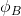，更新时候采用以下交错手段：

*   
*   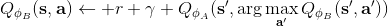

也就是说，更新一个网络的时候，使用另一个网络的值。如果两个 Q 网络的噪音的来源不同，那么它的噪音就不再如此容易扩大了。在实际中，我们在前面已经介绍了目标网络了，因此事实上我们已经有两个不同的网络和了，可以把它利用起来！在标准的 Q 学习中，我们使用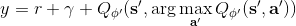，而在这里我们只需要稍作修改，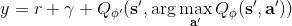，用当前网络来确定我们选择哪个行动，而用目标网络来评估 Q 值。在实践中，我们遇到的问题就会被很大程度上缓解。

我们使用 Q 学习，在回归中会设置一个目标值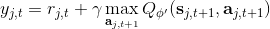。这个目标值信号来自于两块，一块是当前的收益，一块是 Q 值代表的未来期望收益。如果训练还是在早期，通常 Q 就比较小（初始化为小的随机数），那么当前收益就会成为主要成分，Q 值只是噪音。对于时间较长的问题，如果 Q 已经训练到比较后期了，从数值的量级上考虑，可能当前收益所占比就很小，Q 值所占比较大。如果 Q 占比比较大，那么这个目标值可能不太好，只有一期的收益，剩下都由 Q 来决定。在[演员-评论家算法](https://zhuanlan.zhihu.com/p/32727209)中，我们已经提到了这样的自助法存在最低方差的好处，但是如果 Q 值不准确就会带来最大的偏差；而如果我们不使用自助法而直接看一条轨迹，那么将是无偏的，但是方差巨大。从而，我们介绍了一个折中的方法，就是使用步收益后再把未来的自助项加进去。转化到我们当前的问题中就是。

使用步收益的主要好处是，可以降低 Q 函数估计不准确所导致的目标值的偏倚（但同时增加了方差），同时尤其是在早期训练中有效提升速度；但是它也带来严重的根本性问题，这样的训练只有在在线训练的时候才是正确的！为了解释这一问题，我们回忆我们的策略是由 Q 函数决定的：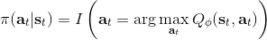；而我们在上面使用步收益，估计的其实是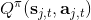，而我们所有的转移，对于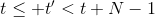的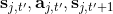，都是要从当前的里面来的。我们之前没有这样的问题是因为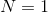，不涉及到在线的转移问题。那么怎么处理这一问题呢？第一种做法是，**直接忽略掉这个问题**。在理论上这是不能接受的，但是实际中通常效果还不错。忽略能否可行，跟待解决问题本身是紧密相关的。第二种做法是**切割轨迹**以得到在线数据。也就是说，我们可以把之前的片段拿过来，然后一步步看我们的策略是否支持这样的行动，如果出现了分歧那么就直接切断：从而这个片段的前面部分是符合我们当前策略的，可以作为一个在线数据使用。这样的做法当数据主要是在线数据（我们需要及时淘汰旧数据）且行动空间很小（如 pong 弹球游戏只有上下和不动三种操作）时效果不错，而如果行动空间很大时则几乎不可能起到什么作用。此外，也可以考虑跟策略梯度法一样做**重要性抽样**重新加权，这样得到的估计总是无偏的，具体可以参考 Munos et al. (2016)在 NIPS 上的文章：Safe and efficient off-policy reinforcement learning。

春季课程中，Schulman 还请他的同事 Szymon Sidor 总结了一些经验，和 Levine 教授这边混在了一起：

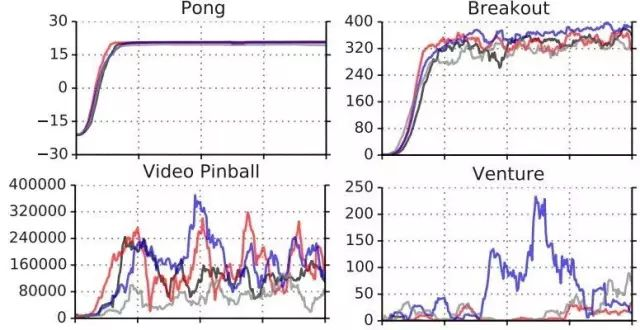

1.  上图显示了几个问题的几种不同 Q 学习的效果 (Schaul et al., 2015)。发现对于不同的问题，Q 学习在有些问题上很可靠，在有些问题上波动很大，需要花很多力气来让 Q 学习稳定下来。因此发现几个能让 Q 学习比较可靠的问题来试验程序，譬如 Pong 和 Breakout。如果这些例子上表现不好，那就说明程序有问题。
2.  回放缓冲池的大小越大，Q 学习的稳定性越好。我们往往会用到上百万个回放样本，那么内存上怎么处理是决定性的。建议图像使用 uint8 (1 字节无符号整型) 存储，然后在存储的时候不要重复存储同样的数据。
3.  训练的时候要耐心。DQN 的收敛速度很慢，对于 Atari 游戏经常需要 1000-4000 万帧，训练 GPU 也得几个小时到一天的时间，这样才能看出能显著地比随机策略要来的好。
4.  在使用贪心等策略的时候，一开始把探索率调高一些，然后逐渐下降。
5.  Bellman 误差可能会非常大，因此可以对梯度进行裁剪（clipping，也就是设一个上下限），或者使用 Huber 损失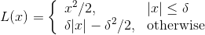进行光滑。
6.  在实践中，使用双重 Q 学习很有帮助，改程序也很简单，而且几乎没有任何坏处。
7.  使用步收益也很有帮助，但是可能会带来一些问题。
8.  除了探索率外，学习率 (Learning Rate, 也就是步长) 也很重要，可以在一开始的时候把步长调大一点，然后逐渐降低，也可以使用诸如 ADAM 的自适应步长方案。
9.  多用几个随机种子试一试，有时候表现差异会很大。

## 行动空间连续时的 Q 学习

在我们之前的问题中，通常假设策略很容易得到：，求 max 只需要遍历行动空间就行了；目标值的 max 也是这样。但是如行动空间是连续的时候，这个 max 就不容易做了。这个问题在后者中尤其严重，因为它是训练过程中最内层循环要做的事情，频率比前者要高多了。那么如何做 max 呢？

第一种想法是直接做优化。在最内层循环做基于梯度的优化算法（如 SGD）相对来说是比较慢的。注意到我们的行动空间通常都是比较低维的（相对整个系统而言），不使用梯度信息的随机优化也许能有用武之地。最简单的方法是使用离散随机踩点：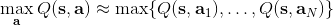，其中行动是从某些分布（如均匀分布）中得到的。这个方法是最简单的，而且还比较容易并行，但是这样得到的结果是不准确的，尤其是在维度增加的情况下看起来就不像是能找到一个效果很好的解；不过有些时候，我们也不真正在乎优化求解的精度。此外，还有一些更好的方法，譬如交叉熵方法 (Cross-entropy Methods) 这样的迭代随机优化算法，或者如 CMA-ES (Covariance Matrix Adaptation Evolutionary Strategies) 这样的进化算法。这些通常在不超过 40 维的决策问题中有效。

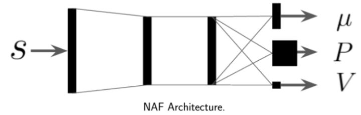

第二种方法是，我们选取一个比较容易优化的函数簇来拟合我们的 Q 函数。在此之前，我们适用的都是通用的神经网络来拟合 Q，有些情况下我们不必要这么做。譬如在 Q 函数是二次函数的时候，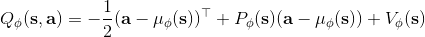，我们就训练一个神经网络或者其他结构，输入状态，输出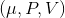，其中和都是向量，是矩阵（可以用如低秩形式表示）。这样的方法称为 NAF (Normalized Advantage Functions)，它的天然特性就是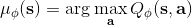和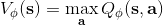。这个很容易和高斯分布建立起联系；当然，这样的 Q 函数中行动是没有界限的。我们这么做的话，算法上不需要做任何改变，非常容易，而且和原来的 Q 学习一样高效。但是缺点就在于 Q 函数只能是固定的形式（如这里的二次函数），非常受限，Q 函数的建模泛化能力将大大降低。

第三种方法比第二种方法更为广泛，是去新学习一个最大化器，在 Lillicrap et al. (2016) 在 ICLR 上的一篇文章中被作为 DDPG (Deep Deterministic Policy Gradient) 算法介绍。考虑到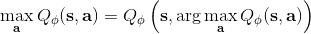，可以想的是另外训练一个最大化器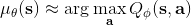，作为最大化的算子。训练的方法是，让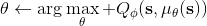，这个可以用梯度上升法，梯度可以遵循链式法则：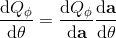。从而，我们的目标值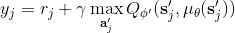。整个 DDPG 算法迭代执行以下步骤：

1.  在环境中执行某个操作，观察到，并加入到回放缓冲池中。
2.  均匀地从回放缓冲池中抽取一个小批量样本。
3.  使用目标网络和最大化器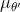，计算出目标值。
4.  当前网络走一个梯度步，。
5.  最大化器走一个梯度步，。
6.  使用 Polyak Averaging 更新和。

相当于相对 DQN，只是增加了一个最大化器，第三步使用最大化器，第五步更新最大化器，同时最大化器的更新也是用 Polyak Averaging。

Q 学习有很多应用。Lange and Riedmiller (2012) 使用拟合 Q 迭代的方法控制小赛车（和其他低维度系统），因为较早期，所以拟合的函数簇包含了随机森林和神经网络。它们是训练了一个自编码器 (autoencoder) 来降维，在隐层上面做 Q 学习。这是同时出现 Q 学习和神经网络比较早的论文，但是 Q 学习没有和神经网络直接结合起来。两者直接结合起来，产生的最经典的 DQN 出自于 Mnih et al. (2013) 在 NIPS 上的文章，用同一种方法成功攻克了多种 Atari 游戏。它们的训练直接使用图像，而不是在一个隐空间中训练。这个工作使用了回放缓冲池和目标网络的技术，使用了一步的备份和一步的梯度步。这个结果在后来也有很多技巧可以改进，如双重 Q 学习。Lillicrap et al. (2015) 最早提出了 Q 学习在连续控制（简单机器人模拟器）上的应用，即 DDPG。这项工作考虑连续的空间，并使用了一个最大化器网络；采用了回放缓冲池、目标网络、Polyak Averaging 更新等技术，使用了一步的备份和一步的梯度步（与 DQN 一致）。Gu et al. (2017) 使用 Q 学习法控制真实的机器人。这项工作同样考虑连续控制，对 Q 函数采用了二次函数的 NAF 近似，也同样采用了回放缓冲池和目标网络技术。在收集数据上，使用了多个不同的机器人来并行处理。因为是真实物理场景，数据比较难采集，所以每个模拟步走了 4 个梯度步（一步备份）。