# (8) 最优控制与规划

> 作者：[谢天](https://www.zhihu.com/people/xie-tian-55-77)
> 
> 来源：[POST 馆](https://zhuanlan.zhihu.com/c_150977189)

## 基于模型的增强学习方法

在之前的[增强学习简介](https://zhuanlan.zhihu.com/p/32598322)之中，我们已经了解了我们的增强学习问题的一般结构是：给定一个状态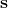，策略函数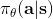可以由某种含参的结构（如策略梯度法和演员-评论家算法使用显式的策略网络，值函数方法的策略是隐式的）确定，并通过这个策略函数得到一个行动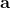，将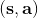共同输入给环境，环境通过某些转移概率函数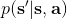，得到新的状态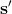，形成一个循环。根据 Markov 性，轨迹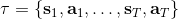的发生概率为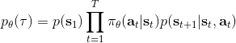，是由我们掌握的策略函数和环境掌握的转移概率共同决定的。增强学习问题的目标是最大化总收益函数的关于轨迹的期望，一般来说就是得到一组最优的参数使得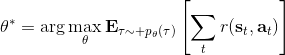。我们在前几篇中主要介绍了无模型 (model-free) 的深度增强学习算法，这些算法的主要特征是不假设我们知道初始分布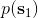和转移概率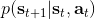：在一般的问题中，这些概率是非常难知道的；这些无模型方法可以很好地绕开这些不知道的东西，我们甚至不尝试去学习这些转移概率。

在一些问题中，我们可以假设我们知道系统的转移概率 (dynamics) 。最简单地，我们设计一个 AI 来下棋（如围棋，棋类的规则是众所周知的）；很多系统是容易建模的，如给汽车设计一个导航系统（不是具体的驾驶行为，而是站在比较高角度的路径规划，这个就会相对容易很多，各种地图上已经有很完善的类似功能了）；更具体地，我们可能会在一个模拟器中研究诸如机器人运动和视频游戏的问题，我们可以通过模拟器得到下一个状态到底是什么。退一步说，即便我们不知道转移是什么，但我们在很多问题中也可以学出这些转移。比如在系统识别 (system identification) 问题中，我们已经有一个模型结构（如机器人的结构已知）了，需要通过学习去拟合里面未知参数（如机器人的各部分质量和摩擦系数等）；更广泛地，我们可能会去用观察到的转移数据去拟合一个广义的模型（比如神经网络或者高斯过程）。

那么这些转移概率是毫无用处的么？如果我们能知道这些转移概率，通常问题就会变得简单很多。不同于无模型的方法，基于模型的 (model-based) 增强学习方法通过学习转移概率来决定如何选择行动。在这一篇中，我们将先介绍如果我们完全知道转移概率，如何进行行动决策（最优控制、轨迹优化）；之后，我们再去关注如何去学习未知的转移概率，以及如何通过诸如模仿最优控制的方法学习策略。

让我们先忘记策略这个东西的存在。类似[之前](https://zhuanlan.zhihu.com/p/32575824)人在老虎面前的决策问题，我们需要给出一连串决策，使得被老虎吃掉的概率最小：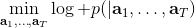，这类问题通常能转化为一个最小化代价的问题：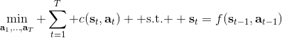，或者是最大化收益。我们假设环境是确定的，目标是最大化收益问题，那么问题的结构就变成了环境向智能体给出了初始状态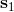，然后智能体做出一系列的行动决策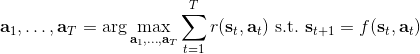，直接交给环境。在确定性环境下，我们上面做的就是一个最优控制了；而对于环境是随机的情况下，轨迹条件概率为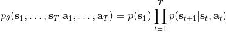（注意是我们给定行动决策序列之后，状态序列的概率），我们一下子做好的期望收益最大的**开环** (open-loop) 控制系统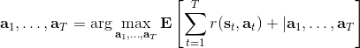就不见得是最优的了：因为我们通常没有必要一下子把所有的决策全部做了，可以通过做第一个决策来观察之后是什么样的随机情况这样的反馈机制，来继续做后面的决策，使得接下来的决策做得更好。这样的机制通常被称为**闭环** (closed-loop)。下图说明，区别在于开环系统在一开始就把所有决策单向传递给环境，因此不接受反馈；闭环系统则每次只传递单次行动，并接受下一个状态作为反馈。

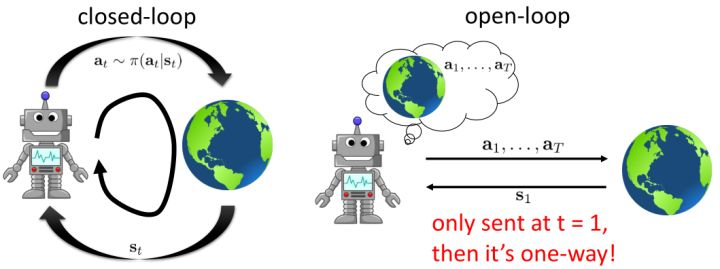

在一个闭环控制系统中，我们就需要一个策略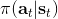了，在策略的加持下，我们的轨迹概率就变成了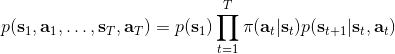；我们需要做的是得到一个最优的策略，使得期望收益最大：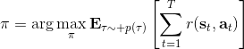。关于这个策略簇，我们在之前提到的主要是用一个神经网络来确定，此外在这一篇中我们还将提到使用经典的轨迹优化 (trajectory optimization) 方法来训练一个（时变的）线性策略簇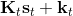，基本上就是主要执行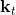，并使用当前给定状态做出一些线性修正。因此，根据我们限定的策略簇不同，策略的学习可以从非常简单到非常复杂。

## 交叉熵方法 (CEM)

我们的第一类规划算法是随机优化，通常用于时长比较短的问题。让我们先将之前的控制问题进行一些抽象，如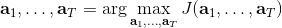，其中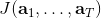是某种函数，我们并不关心具体是什么，只是想把它最大化；再进一步把决策序列写成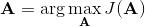。（_ 因为在这边我们的决策只能决策行动，决策和行动是一码事，在后文中，我们将 action 行动和 decision 决策混用 _）在上一篇讲 Q 学习的连续控制中，我们也提到了这类算法中最简单的是从某种分布（如均匀分布）中挑选若干个决策序列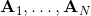，然后选取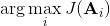。这样的算法在低维问题中还是有一定效果的，有时候被称为随机打靶法 (random shooting method)。

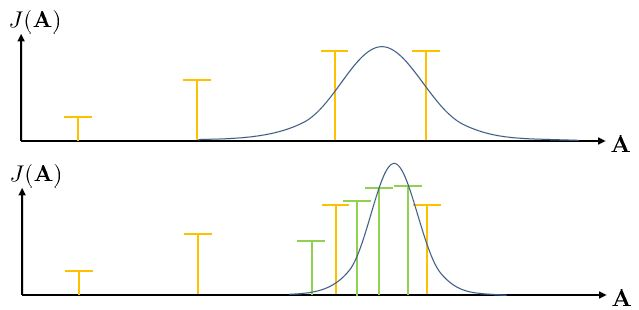

这种方法的一个改良版本称为**交叉熵方法** (Cross-entropy Method, CEM)，对 30 到 50 维这样的问题效果不错。在之前的随机打靶法中，我们需要从某种分布中选取决策序列，但是关键问题是，我们使用哪一种分布？在一开始，我们对于如何选择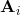没有任何先验知识，所以采用某种均匀的先验分布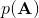。经过一把采样之后（如上图的四个采样），我们发现有一些样本效果比较好，于是我们选出几个较好的样本，来拟合一个分布（如采用图中的高斯分布），作为下一次采样的先验分布。通常认为这样的分布抽样效果会比之前的要好，但是对于很病态的问题我们也没什么太好的办法。第二次采样（下图）进一步更新分布。对于连续值输入的交叉熵方法，算法可以描述成以下步骤的循环：

1.  从先验分布中抽样：。
2.  计算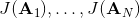。
3.  选取一个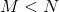（也可以选一个比例），挑选出 J 值最大的子集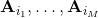。
4.  用重新拟合先验分布。

我们拟合的分布通常使用多元高斯分布，在维度较高时甚至简化成协方差矩阵为对角阵的情况也不错。有一种叫做 CMA-ES 的方法，有点像是在 CEM 方法中加入动量以进行改进，每次不是重新去拟合高斯分布，而是去追随一个高斯分布跟随 J 值最大子集移动的方向。这类优化方法本质上并不是很好，只是因为做起来比较容易：如果都是使用神经网络的话，这些值求起来比较容易，也比较适合并行。所以这个方法的优点主要是，一，非常简单；二，并行求解起来非常快。但是它也有很严重的问题，第一点就是这种基于抽样的方法对维度有比较强的限制，即便我们的问题不是很病态，维度一大也会很容易错过表现好的抽样区域；第二点我们这样抽样也使得我们只能处理开环规划的问题。

## 蒙特卡洛树搜索 (MCTS)

在离散决策问题中，**蒙特卡洛树搜索** (Monte Carlo Tree Search, MCTS) 是用于求解闭环控制的复杂问题的更先进的工具。这一方法在离散问题中非常通用，它也在 AlphaGo 的早期版本中承担很重要的作用。

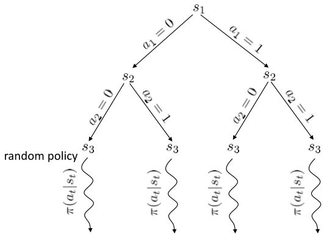

在上图中，我们假设初始状态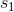已知，每一步的行动有 0 和 1 两种。每次执行完毕一个操作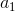以后，就会进入一个新的状态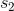，然后继续往复。这样我们随着时间展开成一棵非常庞大的树，要想去对这棵树做一个彻底的搜索（哪怕展开的层数一多）显然是非常不切实际的。在之前我们采用了“树搜索”的思想，这个时候我们对其加一些“蒙特卡洛”。我们搜索到一定程度后，树就不再展开：把此时的叶子节点作为叶子来看待，使用一些启发式策略（也可以是随机策略）来评估这些叶子节点的好坏。即便这个策略并不好也没关系，我们只需要继续对每个叶子节点出发继续执行这个策略若干步来看最后结果怎样，来大概给这个叶子节点的效果打个分。注意，此时打分的复杂度不再是指数级别的，而是**叶子的个数**乘上**启发式策略运行长度**。这个方法的基本思想是，如果当前已经进入了一个优势很大的局面（或者已经赢了），那么一些比较菜的策略也应该能把优势保持到最后；如果我们已经进入了一个怎样都会输的不利局面，那很多人的选择也是乱玩把游戏结束了。因此不会对我们的启发式策略要求很高。因此，在实际中，大家做 MCTS 的时候通常选择的就是随机策略，选一个很好的策略通常是次要的。

在实际中，即便我们对深度进行了限制，这棵搜索树的节点扩展还是指数级别的。因此，我们不能指望搜索所有的路径。MCTS 的最核心想法还是搜索最“有前途”的节点（**选择最大价值的节点**），然后加入一些小小的修正，来补偿那些访问比较少的部分（**也倾向于很少被访问到的节点**）。譬如说我们从一个节点出发走一步，行动 0 之后的节点打分为+10，行动 1 之后的节点打分为+15。当然，这些都不是这个行动真实价值：因为毕竟只是一些很糟糕的随机策略得出的评分而已，而且可能有一定随机性。但是这个值还是有一定意义的，可能认为+15 的节点比+10 的节点可能会稍微好上一点点：因此如果我们时间有限的话，更愿意在+15 的节点上进行探索投资。

MCTS 的一般结构为：

1.  假设当前决策的根节点为，使用某种 TreePolicy()得到一个叶子节点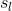。
2.  使用某种随机策略（或其他）DefaultPolicy()评估该叶子节点。
3.  更新在到路径上的所有值，并返回第一步重新循环若干次。
4.  循环 1-3 若干次后，从根节点的所有决策中找一个评分最高的。

TreePolicy 有很多，其中一个很流行的 UCT (Upper Confidence Bounds for Trees) TreePolicy(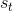)为：如果没有完全被展开（也就是从状态有行动没有被评估过），那么选择一个没有评估过的新行动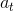；否则就选取一个得分最大的儿子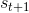，其中得分公式为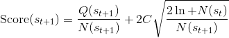，越大越好，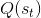为该节点为跟的子树的所有已经被展开过的节点的评分之和，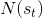为该节点为根的子树中已经被展开过的节点个数，因此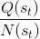就是的平均评分了；后者则是用来评估稀有性。我们使用一个例子来解释该算法。

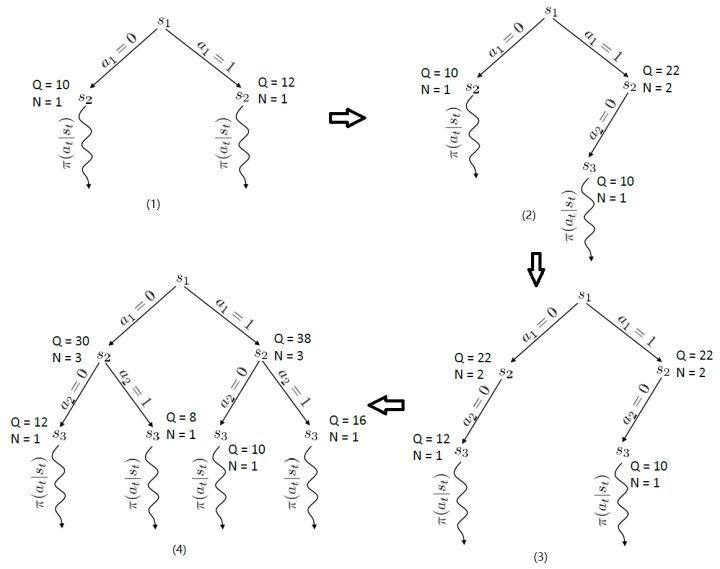

假设每个节点的行动都是 2 个。在一开始，我们只有一个节点，没有被展开，根据 UCT TreePolicy()策略，我们应该展开的所有行动，得到新节点后进行评分。我们经过某种随机策略得到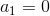下的新状态评分为 10，因此 Q 值和 N 值分别更新为 10 和 1；同样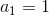下的新状态评分为 12，由此得到图(1)。此时，节点的所有行动都已经完全展开，因为两棵子树展开程度一致，通过 Q/N 的比值，我们决定展开右侧子树一步，得到(2)中的节点，根据随机策略评估得分为 10。此时右侧的的 Q/N 比值为 11，仍高于左侧，但是差距不大，我们假设得分公式中第二项左侧明显占优势（因为右侧已经访问过了，左侧还没访问过），此时左侧得到展开，得到图(3)，接着继续迭代两次得到图(4)。

关于 MCTS，Browne et al. (2012)的"A Survey of Monte Carlo Tree Search Methods"给了一个很好的研究综述。Guo et al. (2014) 发表在 NIPS 上的"Deep Learning for Real-Time Atari Game Play Using Offline Monte-Carlo Tree Search Planning"一文提供了一种使用 MCTS 来提供 Atari 游戏样本，并使用监督学习（也就是之前所提到过的[模仿学习](https://zhuanlan.zhihu.com/p/32575824)）的方法来训练 Atari 游戏策略。他们使用 DAgger 算法来实现模仿学习，回忆 DAgger 算法的第一步是从数据集训练策略，第二步是用策略取得新样本，第三步是**人工标注新样本**，第四步是将新样本并入数据集。他们在第三步中引入 MCTS 来对每个样本进行“应该选择哪个动作”的标注。之所以要在 MCTS 之外训练一个游戏策略，一方面是因为在实时游戏中，MCTS 通常效率很低，而且耗费很大计算量（_ 注：这也是 AlphaGo Lee 版使用大量计算力，每一盘据说耗费电费数千美元的原因，而进入 AlphaGo Master 版认为神经网络已经效果不错了，那么 MCTS 的地位就下降了，决策更加轻量级：MCTS 的引入是为了弥补神经网络不准确的缺陷 _）；另一方面，训练一个策略可能会有很多其他用途，比如做一些感知 (perception) 和泛化 (generalization) 到其他状态。

## 轨迹优化

**轨迹优化** (Trajectory Optimization) 是连续控制中的重要问题。在这里，我们假设状态和行动都是连续的。使用控制的记号，我们的问题可以被写作：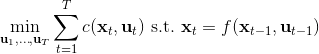，其中 x 代表状态 s，u 代表行动 a，f 代表状态转移（动态，dynamics）。在这里，因为约束是等号，对于这样的确定性问题，我们也可以写作一个无约束问题：，由于非常复杂通常不会这么去写，但是这么写是无约束的所以一定程度上更方便使用一些基于梯度的优化算法。我们需要的是以下几类梯度：，使用类似于反向传播的链式法则，我们就能求出目标函数关于行动的梯度。

在实践中，这样的一阶算法通常效果并不是很好，使用二阶微分信息通常是非常有帮助的：原因是，考虑到第一次行动，在整个式子里面出现了很多次，因此的值是非常敏感的，相对来说最后一次行动的影响则非常小，这样得到的梯度是非常病态 (ill-condition) 的，容易梯度爆炸或者梯度消失。因此使用一阶算法在实践中往往不太可行，但是好消息是这样的问题结构事实上容易得到一些非常有效的二阶算法。注意这些算法并不去训练一个神经网络，但对解决这一类的或者相关的增强学习问题很有帮助。

关于轨迹优化，有两类思想有所区别的算法（_ 注：我不知道这两个名词应该怎么翻译，就随便写一个意译了 _）。一类是**射击法** (shooting method)，这类方法只关注去优化每一个时刻的行动，而把状态看作是行动产生的结果。本质上就是，之所以叫做射击法是因为如上图，动作稍稍一晃就会打出差别很大的轨迹来。

另一类叫做**搭配法** (collocation method)，同时优化每个时刻的状态和行动，同时使用约束来将状态和行动维系起来（甚至有时候只优化状态，而把行动看成状态转移的手段）。本质上就是。搭配法有点像上图，一条轨迹上由很多钉子确定，然后可以通过移动钉子来改变这条轨迹。它相对射击法来说更加稳定，但是问题更难求解（需要引入约束条件）；如果我们不想引入约束，那么就会遇到如射击法一样稍微一晃差异很大的问题。

在为非线性动态系统提供求解方法之前，我们先来研究一类线性模型，以及对应的控制器 LQR (Linear Quadratic Regulator, 线性二次型调节器)。它研究的问题是中，动态系统为的线性形式，这一类线性系统非常有局限性，但同时也特别好求解；代价函数为的二次形式（我们在优化问题中就不关心常数项了），因此叫线性二次型调节器。这一类问题可以在一定程度上泛化到非线性模型，因此我们先来研究如何求解这个问题。

LQR 的主要想法依然是类似于动态规划的逆推算法。首先，我们先从递推边界阶段开始研究。假设我们现在都已经确定了，先当它们是常数进行处理，那么我们的目标函数仅剩，可以写作 （Q 函数在这里是未来代价，cost-to-go，之前我们出现过未来收益 reward-to-go），其中，以及。该函数的一阶最优化条件是（这里假设了，不然需要稍微变化下）。这样，假设矩阵可逆，我们在最后一个阶段的最优决策就可以写成的函数：，其中，。这某种意义上可以看作是最后一个阶段的策略函数：给定状态，最优决策是状态的线性函数。如此，我们就能用最后一个阶段的状态完全确定最后一个阶段的最优决策了，使用代入消元法，我们得到 。将其展开后进行一些整理，我们得到，其中，。

现在让我们倒退到倒数第二个阶段，研究。其表达式为注意。里面的 V 函数我们在前面已经确定了是一个关于的二次型，而是一个线性函数，因此 V 关于是二次的，经整理后得到，其中，。根据一阶最优性条件，最优决策，其中，。然后继续得到，以此类推。因此，LQR 中，我们为了求出最优决策，通常会执行以下过程：

for  to 1:

1.  ，
2.  ，因此，其中，。
3.  ，，从而。

其中，代表了我们从状态执行后直到最后的最小代价，是从状态出发直到最后的最小代价，有点像之前的 Q 函数和值函数的关系。求解完后，如果我们知道初始状态，就可以在每一步执行作为最优策略。

LQR 在随机系统中也能起到一定作用。在某些高斯随机过程中，如，相当于是在原来的确定性过程中加入了一些（单峰）高斯噪音，噪音协方差阵可以是时变的，这个在建模中还是比较普遍的。这样的系统中最优解依然是，也就是说在这个问题中，我们可以忽略高斯噪音的影响。其原因主要是高斯分布具有对称性（解析地看，高斯随机变量的二次型的期望有解析解）。但是，如果噪音和状态、行动有关，那么问题就变得非常复杂了。

现在我们将 LQR 算法应用到非线性问题中去。对于可微的非线性问题，为了利用 LQR，我们期望它能使用某种近似手段近似到 LQR 的结构中去。一个非常直接的做法是在函数局部性上做点文章，局部进行泰勒展开进行近似，为了在形式上保持一致，我们将动态函数 f 展开到一阶：，把代价函数 c 展开到二阶： 。从而，在每个展开点，我们以它为原点建立坐标系，令，，定义新的，，其中，，。这样我们就可以用这么一套新东西来运行 LQR 了。这个方法叫做迭代 LQR (iterative LQR, iLQR)，一个简单版本迭代执行以下步骤直到收敛：

1.  ，，。
2.  使用 LQR 逆推得到，其中每一步代入，。
3.  根据上一步的结果，顺推得到所有的，其中，。
4.  使用第三步的结果更新。

这个方法事实上是一种近似的牛顿法来求解。牛顿法求解的过程也是每一步，而 iLQR 的想法也跟牛顿法一样，局部近似一个复杂的非线性函数。但是 iLQR 并不等价于牛顿法，而确切使用牛顿法需要将动态系统 f 展开到二阶：，这样的方法也被称为**差分动态规划** (Differential Dynamic Programming, DDP)。在实际中我们通常不这样使用，因为 f 通常是一个向量值函数，做二阶微分以后会变成一个张量，会比较复杂。在实践中，一阶微分就效果不错了，虽然它需要更多步数才能收敛，但是考虑到计算二阶微分的成本，还是值得的（iLQR 只是 DDP 方法去掉了 f 的二阶微分）。

在使用牛顿法来求解非常复杂的非线性函数时也有一些技巧。如，如果我们每一步都执行，不见得是好的。这是因为梯度和 Hessian 阵都是局部的，而实际函数并不是一个二次函数。如实际函数是蓝色曲线，在蓝色点上近似展开到二阶，便“认为”该函数是红色的二次函数，然后尝试去找这个函数的最低点。然而，这个解可能在实际中并不好（在红叉位置，走得太远了），甚至比原来的解更大了，实际最优解在五角星位置。所以一个比较好的处理方法是做一些线搜索 (line search)，也就是把 iLQR 的第三步中，改为，其中是一个较小的系数。注意如果是 0，那么在迭代中轨迹不会发生变化。因此决定了如何关于旧轨迹和新轨迹的插值比例系数。一个比较简单的方法是搜索，直到它提高了预期设定的一个比例。关于这块文献，Mayne and Jacobson (1970) 最早提出了 DDP 算法，Tassa et al. (2012) 给出了做 iLQR 的实践指导意见，Levine and Abbeel (2014) 给出了不用线搜索的另一种信赖域方法。

Tassa et al. (2012) 使用 iLQR 做模型预测控制 (Model-Predictive Control) 来控制模拟机器人。这并不是与深度增强学习紧密相关的，只是使用了 iLQR 方法。他们的控制架构是在每一步中，

1.  观察状态；
2.  使用 iLQR 来计划，来最小化；
3.  执行，抛弃。

也就是说，在每一步中先使用 iLQR 对未来若干步进行计划，然后只采用第一步的策略，然后下一次重新进行多步规划。本质上它不是一个“学习”过程，所有执行内容都是在线计划的，因此能够非常好地抗新加入的外力干扰（如何在外力干扰下让机器人保持直立，如何在模型错误也就是质量错误的情况下还能保持直立），稳定性非常好。（_ 注：非常建议大家自己去看一下这个视频：_[http://homes.cs.washington.edu/~todorov/media/TassaIROS12.mp4](https://link.zhihu.com/?target=http%3A//homes.cs.washington.edu/%7Etodorov/media/TassaIROS12.mp4)）这个主要意义是，如果我们能有模型的话，即便我们不做学习也能够做很多事情。

在真实问题中，我们的模型可能会很复杂，甚至很难说能写下一组物理方程就能表示问题；和人类、互联网互动的就更加不确定了，我们能做到最好的可能就是从数据中进行一些建模了，在接下来我们将继续介绍基于模型的增强学习算法。